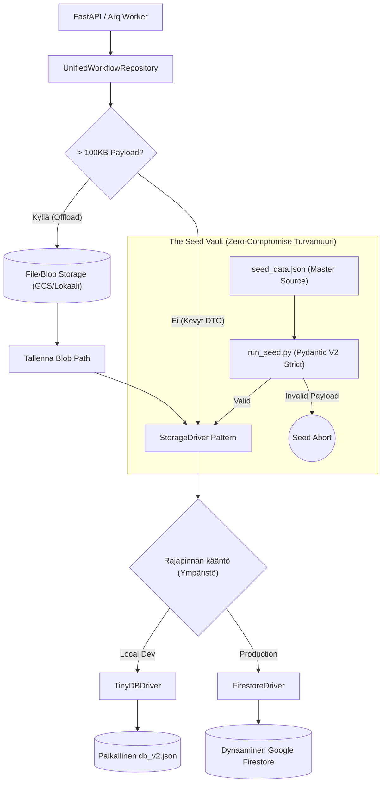

# 05: Tietokanta, Storage Driver ja Repository (Persistence)

Cognitive Quorum hylkää suorat tietokantakohtaiset rutiinit tai perinteiset paksut ORM:t (Object-Relational Mapping). Järjestelmä operoi asynkronisen **Storage Driver Pattern** -arkkitehtuurin kautta, joka mahdollistaa koodin saumattoman siirrettävyyden pilven ja lokaalin koneen välillä (Environment Sovereignty) ilman pienimpiäkään muutoksia liiketoimintalogiikkaan.

## 1. Unified Workflow Repository

Kaikki backendin datakutsut (FastAPI-reiteiltä ja Arq-taustatyöntekijöiltä) reititetään `backend_v2/database/repository.py`:ssä sijaitsevan `UnifiedWorkflowRepository` -instanssin läpi. Tämä luokka ohjaa asynkronisten I/O-operaatioiden säännöstelyn ja abstrahoi datan tallennus- tai latauslogiikan injektoimalla ajuriksi joko `TinyDBDriver` (Local Dev) tai `FirestoreDriver` (Tuotanto).

### Raskaiden Blobien Offload (Firestore Limits)
Tapahtumaperusteisen historiikin (Event Sourcing) myötä tietokantaan syntyy massiivisia Data Transfer -objekteja (`execution_trace`). Koska Googlen Firestore rajoittaa yhden tiedoston koon maksimissaan yhden (1) megatavun suuruiseksi, repository ratkaisee rajoitteen abstraktisti lennossa:
* `_offload_payloads()` -metodi huomaa, jos avainkentät (`execution_trace`, `frozen_context` tai `context_variables`) lähestyvät 100 kilotavun soft-rajaa. Mikäli raja ylittyy, Abstrakti Repository ohjaa valtavan JSON-merkkijonon tiedostopalvelimelle (GCS Bucket tai lokaali levy) pelkkänä binääripakettina, tallentaen itse päätietokantaan vain polkureferenssin (`..._storage_path`).
* Kun data haetaan API:lle (`_hydrate_payloads()`), repository lataa ja liimaa Blobien sisällön takaisin alkuperäiseen rakenteeseen saumattomasti.

### Decoupled MCP Audit Trails
Ennen mahdollisia Blob-siirtoja `_offload_payloads()` poimii `frozen_context` -paketista erilleen tekoälyn työkalukutsut (`mcp_tool_audit`). Tämä data voi työnkulun aikana paisua valtavaksi. Blob-storagen sijaan nämä MCP-lokit ohjataan tallennettavaksi täysin erillisinä dokumentteina natiiviin tietokantaan `executions/{doc_id}/audit_trails` -alakokoelmaan. Tämä eristys ohittaa normaalin JSON-Blob siirron ja mahdollistaa yksittäisten työkalukutsujen rakenteelliset haut ja selaamiset tietokantatasolla ohittaen muun datan.

### Append-Only Workflow Versiointi (System Sovereignty)
Työnkulut noudattavat asynkronisessa I/O -kerroksessa tiukkaa **Append-Only** -protokollaa forensisen jäljitettävyyden vaalimiseksi. Backend API:sta tulevat päivityspyynnöt (`update_workflow`) eivät koskaan tuhoa vanhaa tietokantatietuetta, vaan muuttavat edellisen version tilaksi `is_latest=False` ja luovat täysin uuden dokumenttiversion. Tämä varmistaa *System Sovereignty* -periaatteen säilymisen, jolloin historialliset ajot voidaan aina kytkeä tarkalleen siihen työnkulkukonfiguraatioon, jolla ne aikoinaan suoritettiin.

## 2. API ja Pydantic (SSOT Validation)

Järjestelmä noudattaa tarkkaa rajapintaeristystä (Controller-Service-Repository).
Repository-kerros siirtää luetun tiedon Service-kerrokselle muodossa `dict[str, Any]`. Rajapinnassa data pakotetaan FastAPI:n response_model:illa Pydantic V2 -tyypitykseen (`Model.model_validate()`). Fail-Fast -säännön perusteella odottamattomat kentät (`extra="forbid"`) katkaisevat pyynnön 500/400 Server Errorilla ennemmin kuin sallisivat virheellisen järjestelmätiedon valua UI:n puolelle haamuvikoina.

## 3. The Seed Vault (Nollatoleranssi)

Globaalien järjestelmäkonfiguraatioiden (PromptBlocks, Workflow DAGs, Output Profiles) perustiheys on irrotettu tuotantokannasta turvalliseen **Seed Vault** -järjestelmään (`backend_v2/seed/`).

* **Manuaalinen muokkauskielto:** `.db` tai `db_v2.json` (TinyDB lokalisoitu) suora manuaalinen muokkaus kehittäjien tai tekoälyn toimesta on ehdottoman kielletty. Tämä estää solmujen topologia-avainten korruptoitumisen tai Pydantic-mallien kaatumisen.
* **Source of Truth:** Lokaalit tai globaalit testidata ja vakiot asuvat pelkästään mastertiedostossa `backend_v2/seed/seed_data.json`.
* **Kielto sed/awk -käytölle:** JSON-dataa ei saa koskaan muokata lennosta terminaalikomennoilla (esim. `sed`, `awk` tai bash-tulkit) edes `seed_data.json` -tiedostossa.
* **modify_seed.py standardi:** Jokainen rakenteellinen datamuutos tapahtuu luomalla erillinen lyhytikäinen Python-skripti (`modify_seed.py`), joka käyttää nimenomaan `json.load()` alkuperäisen datan lukemiseen ja modifioitu data kirjoitetaan muotoon `json.dump(data, f, indent=2)`. Vain tämä lukitsee eheyden.
* **Opaque Stripe IDs:** Kaikissa luoduissa tunnisteissa on seurattava ehdotonta Opaque ID -mallia (esim. `usr_x8f9a2b1` tai `wf_cd3p1k`). Ihmisluettavia semanttisia avaimia (`new_user_1`) on kielletty käyttämästä. Opaque-mallit varmistavat aukottoman globaalin tason tietokantaintegritaation ja eristävät dataobjektien viittaukset nimien muutoksista.
* Data astuu virallisesti voimaan vasta kun komento (`uv run python backend_v2/seed/run_seed.py local`) puhdistaa ja todentaa `seed_data.json`:in Pydantic-mallien läpi nollavirhein.
