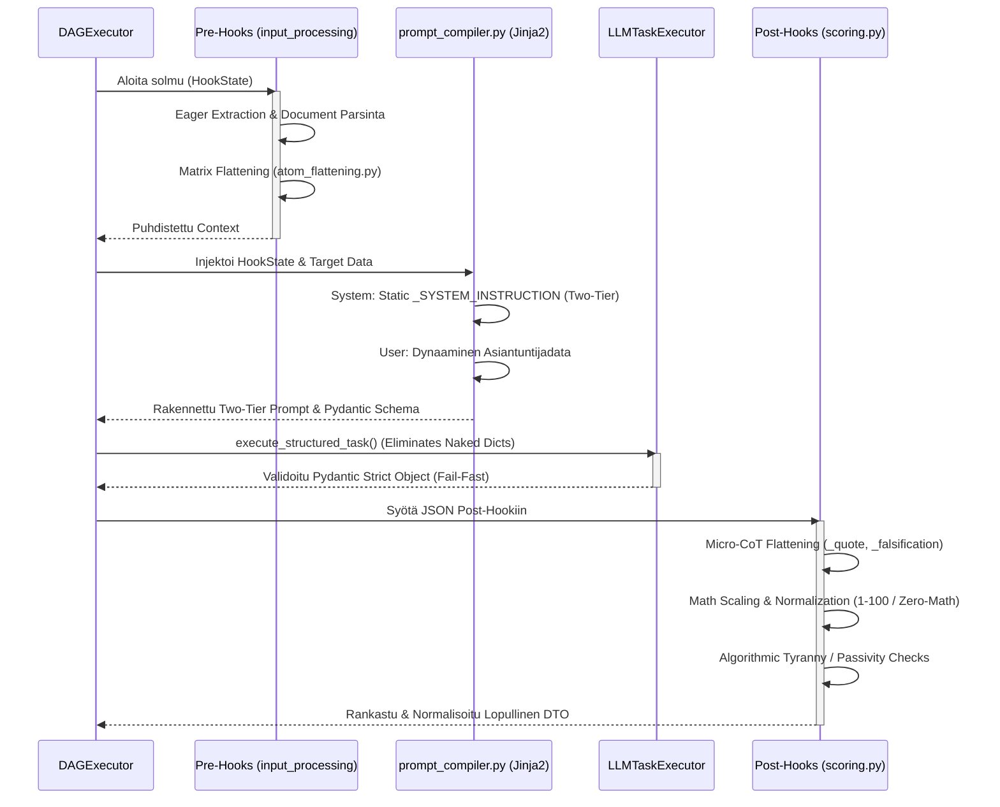

# 05: Natiivit Hookit ja Kieli-integraatiot (LLM)

Cognitive Quorum -järjestelmässä puhtaat työnkulkujen kognitiiviset lisäosat ja ulkoiset tekoälyintegraatiot on eriytetty vahvasti `hooks/` ja `llm/` kerroksiin. Tämä mahdollistaa deterministisen laadunvarmistuksen ohi LLM:n mustan laatikon hallusinaatioiden.

## The Hook Layer (`backend_v2/hooks/`)

Natiivit Python-koukut (Hooks) ovat tilattomia funktioita, joita työnkulun solmut kutsuvat ennen (Pre-Hook) tai jälkeen (Post-Hook) varsinaisen LLM-kutsun. Hookeilla on pääsy työnkulun siihenastiseen `HookState`-kontekstiin ja ne on rekisteröity järjestelmään `hook_registry.py`:n kautta.

### Hook-kerroksen Arkkitehtuurin Invariantit (Phase 9)

Kaikki hookit noudattavat **Explicit Routing** ja **Zero Silent Data Loss** -periaatteita (Pydantic V2 `extra="forbid"`):
* **Kielto Hiljaiselle Siivoukselle (No Silent Scrubbing):** Hookit eivät saa koskaan syöttää koko massiivista `state.inputs` -sanakirjaa suoraan Pydantic-malleihin luottaen siihen, että `extra="ignore"` siivoaisi tuntemattomat kentät pois.
* **Eksplisiittinen Reititys (Explicit Routing):** Hookien (kuten `validation.py` tai `translation_hook.py`) tulee poimia manuaalisesti ja tyyppiturvallisesti vain ne kentät joita ne tarvitsevat (esim. `{"language": state.inputs.get("language")}`) ennen DTO-validaatiota.
* **Token Explosion Prevention:** Erottamalla matriisi-data (dynaamiset rakenteet) ja Observability-data toisistaan ennen validointiota, taataan ettei valtavia päättelyketjuja tai historiatietoja ladata turhaan muistiin.

### Keskeisimmät Hook-vastuut

1. **Scoring ja Arviointien Normalisointi (`scoring.py`):**
   * **Micro-CoT (Chain of Thought) Vastausten Litistäminen (Post-Execution):** LLM vastaa tyypillisesti monivaiheisella syy-seuraus -verkolla. V2-arkkitehtuurissa tulokset parsitaan tiukan `MicroCotDTO`-adapterin läpi ja XAI-laajennokset tallennetaan tiukasti `LightweightMatrixOutput`-mallin `extensions`-sanakirjaan hyödyntäen `XaiExtensionType`-enumia, eikä niitä enää vuodeta root-tason vapaamuotoisiksi avaimiksi.
   * **Nollalaskenta (Zero-Math UI) ja CDM:** V1-mallin mukaiset vapaat sanakirja-avaimet on poistettu. V2 käyttää yksinomaan tyyppiturvallisia `raw_score` ja `normalized_score` -kenttiä. Pisteiden aggregointi pohjautuu Cognitive Diagnostic Model (CDM) -malliin ja sen hyödyntämään progressiiviseen vaimennukseen (Square Root Dampening), mikä luo natiivisti gaussisen varianssin ilman keinotekoista lattiaa.
   * **Passivity Penalty:** Havaitsee tilanteet, joissa LLM valitsee järjestelmällisesti arviointiasteikon pienimmän vaivan tien (minimi score), jolloin tekoälylle annetaan matemaattinen rangaistuskerroin.
   * **Post-Hoc Rationalization & Security Threat -rangaistukset:** Havaitsee turvallisuusuhkat ja jälkikäteisrationalisoinnin, devalvoiden loppupisteitä määritettyjen asetusten mukaisesti.
   * **Boolean-Inversio Kaksikanavaisessa Falsifikoinnissa:** Kun `ContextBuilder` leikkaa mekaanisesti aineiston pois (Spatial Slicing), LLM palauttaa luonnollisesti `evidence_found = False`. Post-Hook -laskenta lukee askeleen säännöstä `inverse_evidence = True` -lipun ja suorittaa deterministisen Boolean-inversion, kääntäen tämän onnistuneeksi `PASSED`-tilaksi.

2. **Integriteetti ja Turvallisuus (`integrity.py` & `security.py`):**
   * Validointihookit, jotka pysäyttävät suorituksen, jos sisältö osuu estettyihin avainsanoihin tai jos kognition palauttamat lainaukset (Citations) eivät täsmää alkuperäiseen dokumenttiin (Source Hallucination).

3. **Informaation Pre-prosessointi (`input_processing.py`):**
   * Huolehtii mm. massiivisten PDF/Word -tiedostojen ennakkojaottelusta, metatiedustelusta ja normalisoinnista "Eager Extraction" -malliin ennen kalliita LLM-kutsuja.
   * **Document Extraction:** Base64-koodatut PDF-tiedostot puretaan synkronisesti pelkäksi tekstiksi (Markdown-muotoon) `DocumentExtractionService`-palvelussa käyttäen erittäin nopeaa `fitz` (PyMuPDF) ja `pymupdf4llm` -kirjastoa. Raskas työ ajetaan FastAPIn `run_in_threadpool` -säikeessä.
   * **Kontekstin Injektointi (English-Only Mandate):** Syötteille määritellyt globaalit tekoälyohjeistukset injektoidaan automaattisesti puretun tekstin yläpuolelle.
   * **Forensinen Tallennus:** Lopullinen prosessoitu teksti tallennetaan levylle väliaikaisena `.md` tiedostona **Forensic Observability** -mandaatin mukaisesti.

4. **Raportointi ja Synteesi (`reporting.py` & `synthesis.py`):**

   #### `synthesis.py` — `text_consolidation_hook`
   Synteesikoukku on koko tulostusputken ydin: se muuntaa kaikkien DAG-steppien raakadatan yhdeksi tai useaksi LLM-syntetisoituksi markdown-tekstiksi per `OutputProfile`.

   **Vaiheen 2 Arkkitehtuurin Invariantit (Fail-Fast & Integrity):**
   * **Strict Schema Validation:** `SynthesisMetadataDTO` pakottaa, että suorituksen metadatassa on aina `step_results`-sanakirja. Jos taustaprosessi ei ole tallentanut tuloksiaan, rajapinta ei "arvaa" tai salli tyhjää tulostetta, vaan vaatii eksaktin tietorakenteen.
   * **Zero Orphaned Data (Data Funnel):** Järjestelmä yhdistää alkuperäiset syötteet ja askeleiden lopputulemat deterministisesti yhteiseen `combined_source_data`-objektiin.
   * **Fail-Fast -pysäytys:** Jos `step_results` puuttuu tai on tyhjä, `text_consolidation_hook` kaatuu välittömästi (HTTP 400) ennen LLM:n käynnistämistä, taaten ettei synteesiä generoida puutteellisella matemaattisella todisteketjulla.

   **Token Shield — `_compress_synthesis_payload()`:**
   Ennen LLM-kutsuhetkeä poistetaan raskaat kentät, jotta Chief Editor -LLM saa vain perustelut ja pisteet — ei atomitason lokeja.

5. **Laiskuuden esto ja Contextual Override Validointi:**
   * Kun `contextual_override = True` palautetaan kielimallilta, validointihook ajaa tiukan **Anti-Laziness Mandate** -validoinnin. Perustelujen (`semantic_reasoning`) on oltava vähintään 50 merkkiä pitkiä, ja niiden on sisällettävä spatiaalinen ankkuri (sivu, kappale, rivi, jne.).
   * Jos ehdot eivät täyty, hook nostaa `ValidationError`-virheen, hylkää ohituksen ja palauttaa virhepalautteen takaisin kielimallille dynaamisessa Self-Healing -korjausluupissa.

---

## Tekoälyintegraatiot (`backend_v2/llm/`)

Kieli-integraatiokerros erottaa ulkoiset mallintarjoajat (Vertex AI, OpenAI) järjestelmän sisäisestä asynkronisesta ytimestä.

### Rakenne ja Validointi

* **`handler.py`:** Segmentoi mallien löytämisen ulkoisista rajapinnoista ja saatavuuden validoinnissa (`fetch_all_available_models`).
* **`mock.py` & `mock_data.py`:** Nämä mahdollistavat testauksen, joka tyystin kieltää suorat LLM-HTTP-kutsut CI/CD:ssä ja yksikkötesteissä.
* **`client.py` & `provider.py`:** Huolehtivat rajapintatason (HTTP) kommunikaatiosta, asynkronisista aikatasauksista (Retry/Rate Limit) sekä erilaisten mallien `Parsing Mode`ista (esim. JSON Structured Output -pakotukset `GEMINI_JSON` modessa).
  * **Universal Provider Decoupling & Dynamic Env Resolver (Epic 62):** Poistaa kovakoodatut sijaintisidokset lähdekoodista. Kaikki tarjoajakohtaiset parametrit (esim. Vertex AI:n sijainti) siirretään tietokantasuvereenisti `additional_params` -asetussanakirjaan. Suorituksen aikana `resolve_env_variables`-metodi interpoloi dynaamiset ympäristömuuttujamerkinnät (esim. `${VERTEX_LOCATION}`). Jos muuttujaa ei löydy, järjestelmä heittää välittömästi tiukan `ConfigurationError`-virheen (Fail-Fast).
  * **Resilient Exponential Jitter-Backoff (Epic 62):** Korvaa kiinteät, tehottomat odotusajat dynaamisella eksponentiaalisella perääntymisellä (`multiplier=2, min=2, max=30`) ja satunnaisella jitterillä (`1-5s`). Tämä tasaa transientit virheet (kuten rate-limit 429, timeoutit ja 503-palvelukatkokeskukset) ilman retry-myrskyjä, yrittäen suoritusta uudelleen tiukasti enintään `SystemConcurrency.LLM_MAX_RETRIES` (2 retries, eli 3 yritystä yhteensä) verran ennen lopullista kaatumista ja siirtymistä `ServiceUnavailableError`-tilaan.
* **`schema_builder.py` & Dynamic Schema Stripping:** Generoi natiivista Pydantic V2 `Step.output_schema` määrityksestä lennossa tekoälylle tarkan JSON-skeeman (Structured Output). Jotta Pydantic V2 voi ylläpitää paikallista Fail-Fast validointia pituusrajoituksilla (kuten `maxLength`), `schema_builder` hyödyntää rekursiivista **Dynamic Stripping** -adapterikoukkua. Se pudottaa API-pyynnöstä pois rajapintojen inhoamat pituusrajoitteet, käärii sen `{ "type": "json_schema", "json_schema": { "strict": True ... } }` muotoon ja suorittaa kutsun, palauttaen Pydantic-validaation paikalliseen haltuun vasta kun raakadata palaa.

### High-Fidelity Prompting & 100% Caching Efficiency (Phase 9 Standard)

V2-arkkitehtuuri on optimoitu API-kulujen minimoimiseksi ja latenssin eliminoimiseksi hyödyntäen fundamentaalimallien **Prompt Caching** -ominaisuutta 100% osumatarkkuudella.

**Prompt Ordering (Välimuistiavaimen eheyden säännöt):**
Järjestelmä pakottaa fyysisen järjestyksen prompteissa:
1. **System Prompt & Few-Shot Examples:** Sijoitetaan ensimmäiseksi. Tämä muodostaa staattisen globaalin ohjeiston.
2. **Document (Context):** Dokumenttiteksti on kääritty `<source_data>` -tagiin User-viestin alkuun.
3. **Execution Parameters & Attention Anchoring:** Dynaamiset parametrit sijoitetaan User-viestin aivan loppuun `<execution_parameters>` -tagin sisään. Näin ne eivät riko alun staattista välimuistia ja "Lost in the Middle" -syndrooma vältetään.
4. **Task Trigger:** Ajo laukaistaan lopullisella `<task>` -käskyllä.

* **Epic 60 Modular Decoupling Caching Effect:** Koska lohkoviittaukset on eroteltu erillisiin `role_block_id` ja `extraction_protocol_block_id` -kenttiin, `PromptFactory` kykenee injektoimaan ne täysin staattisesti ja puhtaasti suoraan `System Prompt` -vaiheeseen. Tämä varmistaa, että askeleen ydinsäännöt pysyvät muuttumattomina eri suorituskierroksilla. Vain arvioitavat TDA-kriteerit (`criteria_block_ids`) kootaan dynamic extraction -skeeman alle. Tämä takaa 95 %+ välimuisti-osumat ilman attention dilution -häiriöitä.
* **Prompt Topology & Tail-End Injection:** Roolit on eristetty tiukasti API-tasolla. Staattiset TDA-säännöt ja järjestelmäohjeet lähetetään `{"role": "system"}` -blokissa, kun taas dynaaminen data ja lähteet sijoitetaan `{"role": "user"}` -blokkiin. Mikäli Pydantic V2 -skeema kaatuu ja järjestelmä pakottaa "Self-Healing" korjauksen, LLM-virheellistä vastausta EI lisätä keskusteluhistoriaan (mikä myrkyttäisi kontekstin ja eväisi välimuistin). Sen sijaan uusi korjauskehote injektoidaan lennosta suoraan olemassa olevan User-viestin loppuun (`Tail-End Injection`). Tämä varmistaa, että iso data pysyy täsmälleen identtisenä ja säilyttää Context Cache -osumat myös Retry-luupeissa.

### Provider-Agnostic Context Caching & FinOps (Epic 67)

V2.7 arkkitehtuuri on tuonut kompromissittoman ja abstrahoidun tason LLM-välimuistien hallintaan. Järjestelmä siirtyy staattisten sanakirjojen käytöstä täysin tyypitettyihin malleihin ja tarjoaja-agnostiseen reititykseen.

* **`CompiledPrompt` ja Staattinen vs. Dynaaminen Eristys:** `prompt_compiler.py` ei enää palauta paljaita `dict`-listoja, vaan palauttaa `CompiledPrompt` -Pydantic-mallin. Malli eristää `static_messages` (kallista ja uudelleenkäytettävää, esim. massiiviset dokumentit ja säännöt) sekä `dynamic_messages` (nopeasti muuttuvaa, esim. askeleen ohjeet).
* **`LLMCachingService` ja Purity Scanner:** Keskittää välimuistien payload-valmistelun (Zero If-Statement Principle). Sisältää myös `_run_purity_scanner` -toiminnon, joka estää UUID-tunnisteiden tai aikaleimojen päätymisen System-ohjeistuksiin. Jos dynaamista dataa vuotaa staattiseen blokkiin, välimuisti-osumat tippuisivat nollaan. Scanner varoittaa tästä automaattisesti lokiin.
* **`LLMCacheAdapterFactory` ja Tarjoajakohtaiset Adapterit:** Adapterit (esim. `AnthropicCacheAdapter` ja `VertexCacheAdapter`) toteuttavat `BaseLLMAdapter` -rajapinnan.
  * **In-Band vs Out-of-Band:** Anthropic käyttää In-Band välimuistia manipuloimalla `cache_control` -tägejä JSON-rakenteessa. Vertex AI käyttää raskasta Out-of-Band välimuistia GCP `CachedContent` API:n kautta. Vertex-adapteri käyttää Redis-hajautuslukkoa (`SETNX`) eliminoimaan **Thundering Herd** -ongelman, varmistaen ettei klusteri yritä luoda sataa identtistä välimuistia samanaikaisesti Google Cloudiin (ja rikkoa RPM=5 sääntöä). Adapteri on myös suojattu tiukalla Zero-Compromise Fail-Soft `try-except` -lohkolla Googlen API-murrosten (Bit Rot) varalta.
* **FinOps-tarkkuus ja `TokenUsage` -polymorfia:** Tavallinen `TokenUsage` on korvattu mallikohtaisilla malleilla (esim. `AnthropicTokenUsage`, `VertexTokenUsage`). Ne seuraavat `cached_tokens` ja `cache_creation_input_tokens` määriä ja laskevat tarkan kustannus-säästön (`estimated_savings_usd`) reaaliajassa jokaisesta askeleesta.

### Machine Control Protocol (MCP) Tool Loop

V2.6 arkkitehtuuri on tuonut mukanaan Model Context Protocol (MCP) -integraatiot, jotka mahdollistavat LLM-mallien turvallisen työkalujen käytön (`services/mcp/`). MCP Tool Loop -malli eristää dynaamisen työkalukutsun turvalliseen, pydantic-validoituun "hiekkalaatikkoon" (Sandbox Loop). Työkalukehä ei koskaan palauta paljaita sanakirjoja (Naked Dicts), vaan pakottaa tarkasti rajatun Pydantic V2 objektin.

### Injektiosuojat, Roolien Eristäminen ja Natiivikieli (Mandates)

Kaistanleveyden LLM-työkalut noudattavat lukittua **"Two-Tier" roolierottelua** ja **"Native English" mandaattia**:

*   **Bilingual Decoupling (TDA Poikkeus):** LLM ei pääsääntöisesti koskaan tuota kognitiivista päättelyään muulla kuin englannin kielellä ("Intelligence Dropping" -esto). Kuitenkin TDA-poimintavaiheessa sovelletaan **Bilingual Decoupling** -poikkeusta: vaikka JSON Schema -rakenteen avaimet pidetään englanniksi, `context_scan_trace` (Micro-CoT) ja etsittävät semanttiset faktat käsitellään ja poimitaan suoraan kohdeasiakirjan alkuperäisellä kielellä. Tämä poistaa Cross-Lingual Attention Taxin ja takaa leksikaalisen ankkuroinnin osumatarkkuuden.
*   **Roolien Ehdoton Eristäminen (`system` vs `user`):** Kaikki infrastruktuurin parserointiohjeet eristetään tiedoston yläosaan globaaliksi `_SYSTEM_INSTRUCTION` vakioksi ja lähetetään `{"role": "system"}` -viestissä. Tuntematon, ulkoinen tuontidata työnnetään täysin erilliseen `{"role": "user"}` -viestiin hyödyntäen Hybrid Prompting (Markdown + XML tags) lähestymistä.
*   **Zero-Fallback ja Centralized Routing:** Sisäiset LLM-työkalut erillisine arkkitehtuurin vastuineen eivät koskaan instansoi omia kääreitään tai käytä API-mallien suoria SDK-kutsuja. Kaikki sisäiset työkalut ohjataan poikkeuksetta keskitetyn `LLMTaskExecutor.execute_structured_task()` reitityksen kautta, mikä eliminoi täysin vaarallisten paljaiden sanakirjojen (Naked Dicts) käytön.

### Kognitiivinen Reititys ja Persoonien Eristäminen (Epic Execution Optimization)

Järjestelmä on siirtynyt raskaasta monoliittisesta Zero-Trust -ajattelusta dynaamiseen **Kognitiiviseen Reititykseen**, jossa tekoälyn suoritus eristetään kolmeen täysin modulaariseen ja tiukasti tyypitettyyn ohjauskerrokseen (Prompt Blocks):

1. **Execution Persona (Globaali perusvire):**
   * Määrittelee tekoälyn ohjelmallisen luonteen ja sen, millä globaaleilla säännöillä se operoi (esim. *Deterministic Parser*, *XAI Reporter*, *Coach*).
   * Esimerkiksi *Deterministic Parser* -persoona pakottaa mallin ymmärtämään kieltä ainoastaan mekaanisten morfosyntaktisten sääntöjen kautta (Kielto semanttiselle joustolle). Nämä injektoidaan aina `{"role": "system"}` -viestin ensimmäiseksi riviksi.

2. **Evidenssin Poimintaprotokolla (Uuttosäännöt):**
   * Määrittelee, *miten* tieto kerätään lähdemateriaalista. Tämä ohjaa suoraan `schema_builder.py`:n luomaa Pydantic-mallia.
   * **Kevyt JSON-uutto (Lightweight Extraction):** Käytetään laajoissa rutiinihauissa (kuten `step_input_processing`), joissa "ajattelukentät" on karsittu nollaan (poistettu `semantic_reasoning`, `contextual_override` jne.). Suoritus tallentuu `LightweightExtractionAtom` -malliin. Tämä pienentää LLM:n kognitiivista taakkaa ja token-määrää merkittävästi.
   * **Globaali Zero-Trust (Heavy Extraction):** Käytetään kriittisissä päätöksentekovaiheissa (kuten `step_deep_analysis`), missä tarvitaan syvää selitettävyyttä ja spatiaalista ankkurointia (`AtomEvaluationItemDTO`).

3. **Tekoälyn Roolipersoona (Dynaaminen asiantuntijuus):**
   * Määrittelee *kuka* tekoäly on suhteessa arvioitavaan dataan (esim. *Asiantuntijatuomaristo*, *Kriittinen Analyytikko*).
   * Tämä ohjaa ainoastaan asiantuntijuuden tulkintakulmaa ja kytketään mukaan arviointistepissä. Se eristetään poimintaprotokollasta, jottei roolileikki sotke mekaanista JSON-uuttoa.

Näiden kolmen parametrin dynaaminen yhdistely PromptBlock-tietokannassa takaa, että LLM:ää ei pakoteta raskaaseen selittämiseen silloin, kun tehtävänä on vain mekaaninen faktanlouhinta.

## Epic 57: Raportointikoukku ja Varianssianalyysi (`reporting.py`)

Epic 57 laajensi asynkronista synteesiprosessia tuomalla mekaaniset metriikat ja matemaattisen varianssianalyysin suoraan osaksi raportointikoukkua (`reporting.py`):

* **`generate_report_hook` -sykli:** Kun työnkulun ajon asynkroninen synteesi laukaistaan, taustaprosessi kutsuu `generate_report_hook`-funktiota. 
* **Lataus ja kytkentä:** Koukku purkaa askeleiden suoritushistoriasta `profiler_metrics` (mekaaniset metriikat) ja `linguistics_result` (mekaaniset täytesanat). Samalla se lukee Performativity Detector- ja Causal Analyst -kognitiiviset asiantuntijatulokset.
* **Varianssilaskenta lennosta:** Koukku kutsuu `calculate_mechanical_cognitive_variance`-funktiota `variance_engine.py`-moduulista. Se laskee varianssipisteen ja alignment-päätöksen lennosta ja rakentaa niistä `VarianceValidationExtension`-laajennoksen.
* **Polymorfinen injektio:** Lopullinen `VarianceValidationExtension` sijoitetaan `XAIOutputDTO`-mallin `output_extensions`-listaan, jolloin se on suoraan käyttöliittymän (Flutter) ja PDF-generaattorin hyödynnettävissä osana yhtenäistä, vikasietoista SDUI-tietovuota.

 

➡️ **Seuraavaksi:** Kun tiedät missä Hookeissa asiat tapahtuvat, lue [06_evaluation_and_scoring.md](./06_evaluation_and_scoring.md), joka pureutuu siihen raskaaseen matematiikkaan ja rangaistuksiin, joita nämä Hookit laskevat LLM:n tuottamasta datasta.
