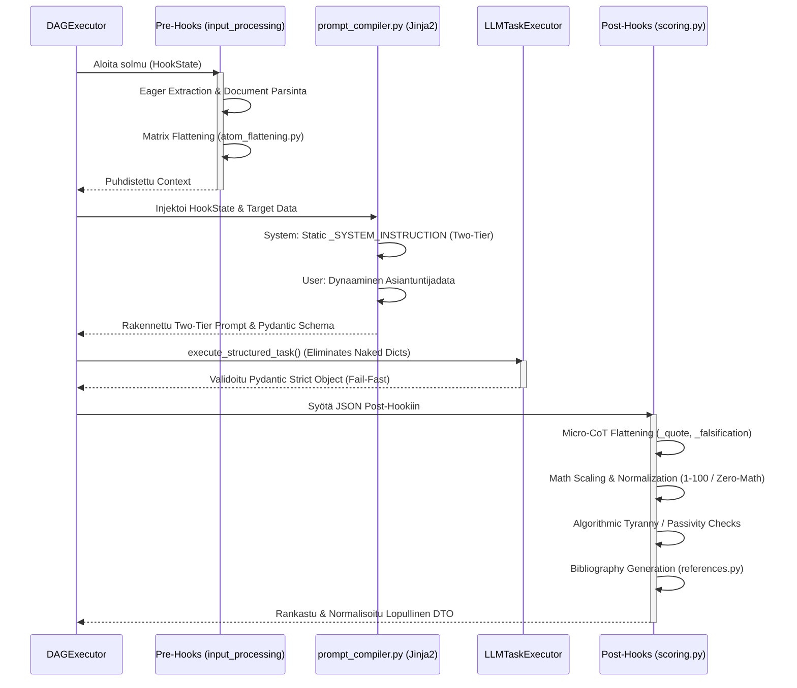

# 04: Natiivit Hookit ja Kieli-integraatiot (LLM)

Cognitive Quorum -järjestelmässä puhtaat työnkulkujen kognitiiviset lisäosat ja ulkoiset tekoälyintegraatiot on eriytetty vahvasti `hooks/` ja `llm/` kerroksiin. Tämä mahdollistaa deterministisen laadunvarmistuksen ohi LLM:n mustan laatikon hallusinaatioiden.

## The Hook Layer (`backend_v2/hooks/`)

Natiivit Python-koukut (Hooks) ovat tilattomia funktioita, joita työnkulun solmut kutsuvat ennen (Pre-Hook) tai jälkeen (Post-Hook) varsinaisen LLM-kutsun. Hookeilla on pääsy työnkulun siihenastiseen `HookState`-kontekstiin ja ne on rekisteröity järjestelmään `hook_registry.py`:n kautta.

### Hook-kerroksen Arkkitehtuurin Invariantit (Phase 9)

Kaikki hookit noudattavat **Explicit Routing** ja **Zero Silent Data Loss** -periaatteita (Pydantic V2 `extra="forbid"`):
* **Kielto Hiljaiselle Siivoukselle (No Silent Scrubbing):** Hookit eivät saa koskaan syöttää koko massiivista `state.inputs` -sanakirjaa suoraan Pydantic-malleihin luottaen siihen, että `extra="ignore"` siivoaisi tuntemattomat kentät pois.
* **Eksplisiittinen Reititys (Explicit Routing):** Hookien (kuten `validation.py` tai `translation_hook.py`) tulee poimia manuaalisesti ja tyyppiturvallisesti vain ne kentät joita ne tarvitsevat (esim. `{"language": state.inputs.get("language")}`) ennen DTO-validaatiota. Tämä estää satunnaiset kaatumiset ja tekee datan kulusta täysin determinististä.
* **Token Explosion Prevention:** Erottamalla matriisi-data (dynaamiset rakenteet) ja Observability-data (esim. `true_atoms_count` `reporting.py`:ssä) toisistaan ennen validointia, taataan ettei valtavia päättelyketjuja tai historiatietoja ladata turhaan muistiin, mikä pitää järjestelmän äärimmäisen nopeana.

### Keskeisimmät Hook-vastuut

1. **Scoring ja Arviointien Normalisointi (`scoring.py`):**
   * **Micro-CoT (Chain of Thought) Vastausten Litistäminen (Post-Execution):** LLM vastaa tyypillisesti monivaiheisella syy-seuraus -verkolla. V2-arkkitehtuurissa tulokset parsitaan tiukan `MicroCotDTO`-adapterin läpi ja XAI-laajennukset (Explainable AI, esim. Falsification, Coaching, Citation) tallennetaan tiukasti `LightweightMatrixOutput`-mallin `extensions`-sanakirjaan hyödyntäen `XaiExtensionType`-enumia (esim. Stripe ID:n suffiksina `_coaching`), eikä niitä enää vuodeta root-tason vapaamuotoisiksi avaimiksi.
   * **Nollalaskenta (Zero-Math UI) ja CDM:** V1-mallin mukaiset vapaat sanakirja-avaimet (kuten `_scaled` tai `_normalized`) on poistettu. V2 käyttää yksinomaan tyyppiturvallisia `raw_score` ja `normalized_score` -kenttiä. Pisteiden aggregointi pohjautuu Cognitive Diagnostic Model (CDM) -malliin ja sen hyödyntämään progressiiviseen vaimennukseen (Square Root Dampening, `calculate_progressive_dampening_score`), mikä luo natiivisti gaussisen varianssin ilman keinotekoista lattiaa.
   * **Passivity Penalty:** Havaitsee tilanteet, joissa LLM valitsee järjestelmällisesti arviointiasteikon pienimmän vaivan tien (minimi score), jolloin tekoälylle annetaan matemaattinen rangaistuskerroin (`enforce_passivity_penalty`).
   * **Post-Hoc Rationalization & Security Threat -rangaistukset:** Havaitsee turvallisuusuhkat (`_extract_guard_flag`) ja jälkikäteisrationalisoinnin Falsifier-agentin datasta (`_calculate_falsifier_penalty`), devalvoiden loppupisteitä määritettyjen asetusten mukaisesti.

2. **Integriteetti ja Turvallisuus (`integrity.py` & `security.py`):**
   * Validointihookit, jotka pysäyttävät suorituksen, jos sisältö osuu estettyihin avainsanoihin tai jos kognition palauttamat lainaukset (Citations) eivät täsmää alkuperäiseen dokumenttiin (Source Hallucination).

3. **Informaation Pre-prosessointi (`input_processing.py`):**
   * Huolehtii mm. massiivisten PDF/Word -tiedostojen ennakkojaottelusta, metatiedustelusta ja normalisoinnista "Eager Extraction" -malliin ennen kalliita LLM-kutsuja.
   * **Document Extraction:** Base64-koodatut PDF-tiedostot puretaan synkronisesti pelkäksi tekstiksi (Markdown-muotoon) `DocumentExtractionService`-palvelussa käyttäen erittäin nopeaa **`fitz` (PyMuPDF)** ja **`pymupdf4llm`** -kirjastoa. Raskas työ ajetaan FastAPIn `run_in_threadpool` -säikeessä, jotta se ei lukitse asynkronista ydintä.
   * **Kontekstin Injektointi (English-Only Mandate):** Syötteille määritellyt globaalit tekoälyohjeistukset (`ai_description`) injektoidaan automaattisesti puretun tekstin yläpuolelle.
   * **Forensinen Tallennus:** Lopullinen prosessoitu teksti (sis. injektoidut ohjeet ja PDF:stä luetun Markdownin) tallennetaan levylle väliaikaisena `.md` tiedostona (esim. `executions/{execution_id}/inputs/input_tiedostonimi.md`) **Forensic Observability** -mandaatin mukaisesti. Tämä takaa 100% jäljitettävyyden siitä, mitä tekoälylle on tarkalleen syötetty ennen työnkulun askelten suorittamista.

4. **Raportointi ja Synteesi (`reporting.py` & `synthesis.py`):**

   #### `synthesis.py` — `text_consolidation_hook`
   Synteesikoukku on koko tulostusputken ydin: se muuntaa kaikkien DAG-steppien raakadatan yhdeksi tai useaksi LLM-syntetisoituksi markdown-tekstiksi per `OutputProfile`.

   **Vaiheen 2 Arkkitehtuurin Invariantit (Fail-Fast & Integrity):**
   * **Strict Schema Validation:** `SynthesisMetadataDTO` pakottaa, että suorituksen metadatassa on aina `step_results`-sanakirja. Jos taustaprosessi ei ole tallentanut tuloksiaan, rajapinta ei "arvaa" tai salli tyhjää tulostetta, vaan vaatii eksaktin tietorakenteen.
   * **Zero Orphaned Data (Data Funnel):** Järjestelmä yhdistää alkuperäiset syötteet (`state.inputs`) ja askeleiden lopputulemat (`state.metadata.step_results`) deterministisesti yhteiseen `combined_source_data`-objektiin. LLM saa käyttöönsä koko suorituksen kognitiivisen historian.
   * **Fail-Fast -pysäytys:** Jos `step_results` puuttuu tai on tyhjä, `text_consolidation_hook` kaatuu välittömästi (HTTP 400) ennen LLM:n käynnistämistä, taaten ettei synteesiä generoida puutteellisella matemaattisella todisteketjulla.

   Käyttöliittymä määrää kaiken:

   * **`synthesis.system_prompt`** — Globaali Kognitiivinen Blueprint (puuttuvana Fail-Fast, ei fallbackia).
   * **`synthesis.preamble_text`** (I18n) — Toniohjaus LLM:lle (käännetään `target_locale`-kielen mukaan).
   * **`synthesis.length_constraint`** — Globaali merkkirajoitus.
   * **`synthesis.enable_pii_masking`** — PII-maskaus ennen LLM-kutsua (`sanitize_text()`).
   * **`synthesis.historical_context_mode`** — Historiallisten synteesien käyttö (DISABLED / SLIDING_WINDOW_3).
   * **`layouts[n].synthesis.system_prompt`** — Osiokohtainen Blueprint ja preamble (per layout).
   * **`visible_extensions`** — XAI-laajennusluettelo, joka annetaan LLM:lle keruu-mandaattina.

   Synteesi tuottaa kolme erillistä `state_delta`-kenttää:
   - `synthesized_markdown` — globaali teksti
   - `section_syntheses` (`dict[layout_id, markdown]`) — layoutkohtaiset tekstit
   - `xai_highlights` — extension-korostukset (coaching, falsification, ...)

   **Token Shield — `_compress_synthesis_payload()`:**
   Ennen LLM-kutsuhetkeä poistetaan raskaat kentät (`shuffled_atoms`, `evaluations`, `quote`, `reasoning`), jotta Chief Editor -LLM saa vain perustelut ja pisteet — ei atomitason lokeja.

   **LLM-step-diskriminaattori (`reasoning_trace is None`):**
   Wildcard-moodissa (`target_blocks = *`) vain ne stepit siirretään synteesikontekstiin, joiden `reasoning_trace`-kenttä **ei ole `None`**. Tämä suodattaa automaattisesti pois `raw_inputs`-, `inputs`- ja logic-node-tapahtumat, jotka eivät emitä `reasoning_trace`-kenttää dynaamisessa schemassa. Tarkistus tehdään eksplisiittisesti `is None` -vertailulla (ei falsy `not`), jotta mallit joilla on tyhjä thinking-output eivät katoa kontekstista.

   **Käännösputki:** Jos `target_locale != "en"`, valmis englanninkielinen markdown siirretään `translation_hook`:lle, joka palauttaa lokalisoidun version. Osiokohtaiset synteesit käännetään erikseen.

   #### `reporting.py` — `generate_report_hook`
   Raportointi-koukku kokoaa `ReportContextDTO`:n kaikista agenttiluokista heti suorituksen jälkeen (Logic Node -polku). Se käyttää **`GlobalContextVarsDTO`** -skeemaa, jossa jokainen looginen rooli (`step_xai`, `step_judge`, `step_overseer`, jne.) on tyyppiturvallisesti määritelty (`strict=True, extra="forbid"`).

   > **Tyyppierittely:** `state.inputs` sisältää DAG-stepit opaakin step-ID:n avaimella (esim. `sr_5f3dd7`). `state.global_context_vars` sisältää hook-tason kontekstin loogisilla roolinämillä (`step_xai`, `step_judge`, ...). Nämä ovat erillisiä — intentionaalinen arkkitehtuurinen erottelu.

   **Score-aggregointi:** MATRIX-blokkit poimitaan suoraan `state.inputs`-hakemistosta `LightweightMatrixOutput`-DTO:n kautta, ei `GlobalContextVarsDTO`:sta (token explosion -esto). `MatrixObservabilityDTO` (`extra="ignore"`) suodattaa hiljaisesti pois raskaan blokki-sisaltön.

   **Score-yhteenveto:** Käytetään `step_scoreengine1.score_summary.normalized_score` -arvoa jos saatavilla, muuten lasketaan MATRIX-pisteiden keskiarvo itse.

5. **Konteksti ja Metatieto (`context_mapper.py`, `metadata.py` & `hydration.py`):**
   * Tilanhallinta ja datan liimaaminen.

6. **Käännökset (`translation_hook.py`):**
   * Hoitaa natiivikielen lokalisoinnin LLM-ajon jälkeen.

7. **Metriikat ja Heuristiikka (`metrics.py`):**
   * Dokumentoi objektiivisen tekstianalytiikan (sanojen määrä, lauseiden pituus), *Control Ratio* (Human vs AI -tekstisuhde), sekä käyttäytymisen heuristiikat (*Say-Do Gap*, *Automation Bias*, *Illusion of Competence*).

8. **Validointihookit (`validation.py`):**
   * Rakennetarkistuksien lisäksi huolehtii tekstien minimipituuden validoinnista (`verify_structure`) raskaalla Fail-Fast -periaatteella. Vastaa myös tuotosten kielen vuotamisen heuristisesta tarkistuksesta (`verify_output_language`).

9. **Arkistointi ja Ennakkotapaukset (`archival.py`):**
   * Sisältää `retrieve_precedent` -hookin, joka hakee aiemmat arvioinnit ("Case Law") oppimismateriaaliksi lennossa asiantuntijoille ja tekoälylle.

10. **Kielitiede ja Performativiteetti (`linguistics.py`):**
    * Vastaa tekoälyn ominaisen korusanaston (esim. "delve into", "kattava katsaus") tunnistavasta `detect_performative_patterns` -hookista. Tunnistettavien lausekkeiden laajuus on määritetty globaalissa `PERFORMATIVE_PATTERNS` -diktionaryssa.

11. **LLM Kontekstihook (`llm.py`):**
    * `configure_llm_context` -hook hakee ja injektoi kulloisenkin strategian (esim. `fast`, `reasoning`) kontekstiin ja reitittää mallin valinnan Model Registryn tietojen perusteella dynaamisesti.

12. **Datan Ennakko-Litistäminen (`atom_flattening.py`):**
    * Vastaa `MatrixScale`-rakenteiden (kuten 75-atomiset kyselyt) litistämisestä sokeaksi listaksi (Pre-Execution Flattening) ennen LLM-kontekstin luontia. Hyödyntää ositettua satunnaisotantaa (Stratified Random Sampling) vähentämään LLM-kontekstiväsymystä ja estämään JSON-token -räjähdyksen.

13. **Lähdeluettelogeneraatio (`references.py`):**
    * Vastaa eksplisiittisten ja implisiittisten viittausten haravoinnista tekstistä (Bibliography Generation). V2-versiossa toistaiseksi kehitysvaiheessa (Stub), joka tuottaa Dummy-viitteitä.

## Tekoälyintegraatiot (`backend_v2/llm/`)

Kieli-integraatiokerros erottaa ulkoiset mallintarjoajat (Vertex AI, OpenAI) järjestelmän sisäisestä asynkronisesta ytimestä.

### Rakenne ja Validointi

* **`handler.py`:** Selittää sen roolin korkean tason operaatioissa, kuten mallien löytämisessä ulkoisista rajapinnoista (Google Vertex Model Garden, OpenAI) ja saatavuuden validoinnissa (`fetch_all_available_models`).
* **`mock.py` & `mock_data.py`:** Nämä mahdollistavat testauksen (Rule: `mocking_mandate_for_llm`), joka tyystin kieltää suorat LLM-HTTP-kutsut CI/CD:ssä ja yksikkötesteissä. Ne eristävät HTTP-kutsut ja palauttavat staattisia JSON-fixtuureja Pydantic-malleihin pakottaen paikallisten fixtuurien käytön verkkovikaisten / aikaa vievien asynkronisten kutsujen sijaan.
* **`client.py` & `provider.py`:** Huolehtivat rajapintatason (HTTP) kommunikaatiosta, asynkronisista aikatasauksista (Retry/Rate Limit) sekä erilaisten mallien `Parsing Mode`ista (esim. JSON Structured Output -pakotukset `GEMINI_JSON` modessa).
* **`schema_builder.py` & Dynamic Schema Stripping (API 400 Prevention):** Generoi natiivista Pydantic V2 `Step.output_schema` määrityksestä lennossa tekoälylle tarkan JSON-skeeman (Structured Output). Jotta Pydantic V2 voi ylläpitää paikallista Fail-Fast validointia pituusrajoituksilla (kuten `maxLength`, `minLength`), mutta estää tekoälyrajapintoja (OpenAI/Vertex) kaatumasta `400 Bad Request` -virheeseen, `schema_builder` hyödyntää rekursiivista **Dynamic Stripping** -adapterikoukkua. Se pudottaa API-pyynnöstä pois rajapintojen inhoamat pituusrajoitteet (`maxLength`/`minLength`), käärii sen `{ "type": "json_schema", "json_schema": { "strict": True ... } }` muotoon ja suorittaa kutsun, palauttaen Pydantic-validaation paikalliseen haltuun vasta kun raakadata palaa palvelimelle.
* **Abstraktion pakotus:** LLM-moduulit *eivät koskaan* rakenna työnkulun dynaamisia prompteja itse. Promptsien Jinja2-kokoaminen ja teoria-aineistojen injektointi suoritetaan erillisessä raskaassa `prompt_compiler.py` Service-kerroksen aggregaatissa (*Frozen Architectural Cornerstone*), eikä sitä muokata suoraan injektioriskien vuoksi. Tämän säännön avulla yksittäisen LLM-toteutuksen voi korvata hetkessä toisella (esim. Vertex AI -> Anthropic) ilman minkäänlaisia muutoksia kognitiivisen logiikan reititykseen, ja valmis tekstinäyte tarjoillaan puhtaana LLM-klientin suoritettavaksi.

### High-Fidelity Prompting & 100% Caching Efficiency (Phase 9 Standard)

V2-arkkitehtuuri on optimoitu API-kulujen minimoimiseksi ja latenssin eliminoimiseksi hyödyntäen fundamentaalimallien (kuten Anthropic / LiteLLM) **Prompt Caching** -ominaisuutta 100% osumatarkkuudella.

**Prompt Ordering (Maksimoidun Caching-tehokkuuden säännöt):**
Järjestelmä pakottaa fyysisen järjestyksen prompteissa:
1. **System Prompt & Few-Shot Examples:** Sijoitetaan ensimmäiseksi. Tämä muodostaa staattisen globaalin ohjeiston.
2. **Document (Context):** Dokumenttiteksti (`local_payload`) on kääritty `<source_data>` -tagiin User-viestin alkuun. Koska se on per dokumentti staattinen, caching säilyy kun samaa tiedostoa pureskellaan useissa askeleissa.
3. **Execution Parameters & Attention Anchoring:** Dynaamiset parametrit (kuten `STRICTNESS_CALIBRATION` ja `CRITICAL_LANGUAGE_MANDATE`) sijoitetaan User-viestin aivan loppuun `<execution_parameters>` -tagin sisään. Näin ne eivät riko alun staattista välimuistia ja "Lost in the Middle" -syndrooma vältetään.
4. **Task Trigger:** Ajo laukaistaan lopullisella `<task>` -käskyllä.

* **Täydellinen Eristys:** Järjestelmä kieltää dynaamisten muuttujien (esim. `target_language`, pituusrajoitukset, päivämäärät) upottamisen suoraan sääntölauseisiin f-stringeillä. Tällainen toiminta ("Attention Dilution") muuttaa promptia jokaisella suorituksella ja estää välimuistin käytön.
* **Staattiset Säännöt & EvidenceType:** Varsinainen kognitiivinen Blueprint (`<objective>` ja `<rules>`) pidetään aina 100% staattisena. Tämän ansiosta jopa 95% syötteestä pysyy muuttumattomana eri asiakkaiden ja suoritusten välillä, mahdollistaen maksimaalisen Token Caching -säästön. LLM pakotetaan tuottamaan luokittelu perustuen `EvidenceType` -enumiin (`EXPLICIT_QUOTE`, `IMPLIED_INTENT`, `NO_EVIDENCE`), joka sitoo kielellisen generoinnin suoraan strukturoituun Pydantic-validaatioon.
* **Prompt Topology & Tail-End Injection (Epic 48, Phase 5):** Roolit on eristetty tiukasti API-tasolla. Staattiset TDA-säännöt ja järjestelmäohjeet (`[System Prompt]`) lähetetään eksklusiivisesti `{"role": "system"}` -blokissa, kun taas dynaaminen data ja lähteet sijoitetaan `{"role": "user"}` -blokkiin. Tämä säilyttää Prefix Tree -välimuistin eheyden massiivisissa Map-Reduce ajoissa. Mikäli Pydantic V2 -skeema kaatuu ja järjestelmä pakottaa "Self-Healing" korjauksen, LLM:n edellistä virheellistä vastausta EI lisätä keskusteluhistoriaan (mikä myrkyttäisi kontekstin ja saattaisi evätä välimuistin tehon). Sen sijaan uusi korjauskehote injektoidaan lennosta suoraan olemassa olevan User-viestin loppuun (`Tail-End Injection`). Tämä varmistaa, että alkuperäinen iso data pysyy täsmälleen identtisenä ja säilyttää OpenAI/Anthropic Prefix Cache -osumat myös Retry-luupeissa.

### Model Context Protocol (MCP) Tool Loop

V2.6 arkkitehtuuri on tuonut mukanaan Model Context Protocol (MCP) -integraatiot, jotka mahdollistavat LLM-mallien turvallisen työkalujen käytön (`services/mcp/`). MCP Tool Loop -malli eristää dynaamisen työkalukutsun (esim. shell-komennot, tietokantahaut) turvalliseen, pydantic-validoituun "hiekkalaatikkoon" (Sandbox Loop). 
* Jokainen työkalun kutsu ja palautus lokitetaan systemaattisesti ja validoidaan strict-skeemojen läpi ennen LLM:lle palauttamista. 
* Tämä arkkitehtuuri estää LLM:n hallusinoimat vapaamuotoiset argumentit kaatamasta järjestelmää, noudattaen ehdotonta Fail-Fast -standardia. Työkalukehä ei koskaan palauta paljaita sanakirjoja (Naked Dicts), vaan pakottaa tarkasti rajatun Pydantic V2 objektin.

### Injektiosuojat, Roolien Eristäminen ja Natiivikieli (Mandates)

Kaikki backendin sisäisen infrastruktuurin LLM-työkalut (kuten raakadatan parsinta tai Post-Hook -kerroksessa tapahtuvat lennosta kääntämiset) noudattavat lukittua **"Two-Tier" roolierottelua** ja **"Native English" mandaattia**. Tämä turvaa järjestelmän suorilta ja epäsuorilta Prompt Injection -hyökkäyksiltä ja maksimoi tekoälyn loogisen päättelykyvyn:

*   **Native English Generation Mandate:** LLM ei koskaan tuota alkuperäistä kognitiivista päättelyään (kuten arvioita tai työnkulkujen hypoteeseja) suoraan ei-englannin kielellä. Tämän säännön tarkoitus on välttää "Intelligence Dropping", jossa tekoäly uhraa resurssejaan kieliopilliseen kääntämiseen päättelyn sijaan. Kaikki luodaan ensin englanniksi ja mahdollinen lokalisointi suoritetaan irrallisessa Post-Hook kääntäjässä (`translation_hook.py`) lennosta ennen käyttöliittymään toimittamista.
*   **Roolien Ehdoton Eristäminen (`system` vs `user`):** LLM:ää ei koskaan ohjeisteta dynaamisella `run_chat()` -yhdistelmämerkkijonolla (esim. "Olet asiantuntija. Tässä data: [DATA]"). Kaikki infrastruktuurin parserointiohjeet eristetään tiedoston yläosaan globaaliksi `_SYSTEM_INSTRUCTION` vakioksi. Niitä EIKÄ koskaan viedä tietokantaan, jotta vältytään vahinkomuokkauksilta, jotka voisivat triggeröidä välittömän 500 Pydantic kaatumisen. Opetus välitetään mallille Pydanticin läpi yksinomaisessa `{"role": "system"}` -viestissä. Kaikki ulkopuolinen, tuntematon tuontidata työnnetään täysin erilliseen `{"role": "user"}` -viestiin (Ns. Likainen laatikko) hyödyntäen aitoa Hybrid Prompting (Markdown + XML tags) lähestymistä.
*   **Zero-Fallback ja Centralized Routing:** Sisäiset LLM-työkalut erillisine arkkitehtuurin vastuineen (esim. `chat_parser.py` tai `translation_hook.py`) eivät koskaan instansoi omia kääreitään tai käytä API-mallien suoria SDK-kutsuja. Kaikki sisäiset työkalut ohjataan nyt poikkeuksetta keskitetyn `LLMTaskExecutor.execute_structured_task()` (tai `execute_chat_task`) reitityksen kautta, sen sijaan että ne kutsuisivat suoraan `LLMClient`:n omia metodeja. Tämä eliminoi täysin vaarallisten paljaiden sanakirjojen (Naked Dicts) käytön ja pakottaa tiukan Fail-Fast Pydantic-validoinnin heti rajapinnassa. Tämä takaa, että FinOps-kustannusseuranta, toipumislogiikka (erilliset logical/schema retry-budjetit) ja Fail-Fast Rate Limitit pätevät koko järjestelmään keskitetysti.
*   **Fail-Fast Hook-Tiloissa (Frozen State):** Arkkitehtuurin suojelutradition mukaisesti ydinmallit, kuten (State) siirtymäluokka `HookState`, on Pydantic V2:ssa sinetöity parametrilla `frozen=True`. Hookit saavat lukea historiadataa ohjelmoidusti, mutta ne EIVÄT VOI mutatoida sisääntulevaa sysäystilaa matkan varrella. Jos kehittäjä yrittää muuttaa tilaa (esim. `state.inputs = ...`), järjestelmä kaatuu välittömästi Error Code -ilmoitukseen (`Instance is frozen`). Tämä kieltää sivuvaikutukset (Side Effects). Datamuutokset on palautettava puhtaana `HookResult(state_delta={...})` -objektina koottavaksi isäntäsovelluksessa.
*   **Data Leak Prevention (DLP):** Riippumatta siitä, katkeaako LLM:n synteesi pahantahtoiseen injektioon vai viattomaan JSON Schema Pydantic-validaatioon, lokiin ei *koskaan* tulosteta raakaa käyttäjädataa tai dynaamisia prompteja (PII-vuotoriski / Tietoturvakompromissi). Kaikkiin backendin logfire / logger -lokeihin ja audit-tietokantaan injektoidaan virhetilanteessa vain turvallinen, RFC 7807 -yhteensopiva matemaattinen `ErrorCode` sekä palautuksen Trace ID.

## LLM-Arkkitehtuurin Tiukat Rajoitteet ja Vaikutukset (Politiikka)

Järjestelmän tekoälynhallinta on rajattu poikkeuksellisen tiukilla, järjestelmätason laajuuksilla säännöillä (määritetty `.agents/rules/05_llm_architecture.md`), jotka estävät holtittoman ja hallusinaatioherkän koodauksen. Nämä ohjelmalliset lait nojaavat kolmeen pääperiaatteeseen: **Tietoturva (DLP), FinOps-kustannushallinta ja Deterministinen Laatu (Fail-Fast).**

### 1. Keskitetty hallinta ja FinOps-kontrolli
* **Kielto Bloatwarelle ja Suorille SDK-kutsuille:** Kolmannen osapuolen kirjastot (kuten LangChain tai CrewAI) ja suorat `openai.ChatCompletion` -kutsut on ankarasti kielletty rakenteesta.
* **Peruste (Architecture):** Kaiken liikenteen on kuljettava matalan tason (Low-Level) ratkaisussamme `LLMClient.from_strategy()` -luokan kautta. Tämä takaa keskitetyn Single Source of Truth -reitityksen (SSOT).
* **Vaikutus (Impact):** Token-seuranta, API-laskutus ja mallien dynaaminen vaihtaminen (Model Registry) säilyvät kirurgisen tarkkoina. Yksikään palvelu ei voi "vuotaa" taustalle kyselyitä ohittamatta seurantaa.

### 2. Tiukka Rinnakkaisuus ja Jäähylogiikka (Concurrency)
* **Kielto Ikuisille Silmukoille:** Vapaat "Self-Heal" -algoritmit, jotka yrittävät hakea tekoälyltä vastausta sekunnin välein JSON-virheen sattuessa, ovat estettyjä.
* **Peruste (Architecture):** Rinnakkaisuus on sidottu globaaliin `SystemConcurrency.LLM_MAX_RETRIES` ja `MAX_CONCURRENT_LLM_STEPS` vakioihin. Kun esim. Vertex AI:n 15 pyynnön minuuttiraja (Rate Limit) täyttyy, ohjelmisto lukitsee vastaukset kylmän rauhallisella 65 sekunnin jäähymekanismilla (Cooldown).
* **Vaikutus (Impact):** Tekoälyajo (esim. tuhansien solmujen atomisointi) saattaa teknisesti viivästyä jäähysyklien vuoksi, mutta se tekee infra- tai ilmaistason API:n kaatamisen ja laskutuksen räjähtämisen mahdottomaksi. Ohjelmisto ryömii ennemmin turvallisesti maaliin kuin kaatuu.

### 3. Arkkitehtuurinen Tietoturva (Data Leak Prevention / DLP)
* **Kielto Raakojen Logien Kirjoittamiselle:** Käyttäjän syöttämiä PII (Personally Identifiable Information) -tietoja tai raakoja prompteja ei koskaan logiteta backendin palvelinlokeihin. Hyökkäykset joudutaan eristämään.
* **Peruste (Architecture):** Tuntematon, ulkoinen data kääritään aina XML-fensseihin (`<user_payload>`) estämään Prompt Injection. Jos malli kaatuu tekoälyn "kapinaan" tai vialliseen Pydantic-rakenteeseen, lokiin kirjataan yksinomaan kryptinen mutta turvallinen `ErrorCode` (esim. `AGENT_EXECUTION_CRITICAL`) ja jäljitettävä `Trace ID`.

### 4. Ephemeral Caching ja Äärimmäinen Rakenteellisuus
* **Kielto Dynaamisille Järjestelmäprompteille:** Kellonaikojen, muuttujien ja UUID-vakiotunnisteiden upottaminen `_SYSTEM_INSTRUCTION` muuttujiin on arkkitehtuurisesti kielletty.
* **Kielto Vapaalle Tekstille:** LLM ei saa *koskaan* muodostaa vapaamuotoisia Markdown-vastauspaketteja (ellet haluta vain raakaa UI-tulostetta).
* **Peruste (Architecture):** Tekoälyohjauksesta erotetaan "Staattinen rooli" ja "Dynaaminen data". Pitämällä systeemi-prompti 100% staattisena, järjestelmä voi säästää satoja tuhansia tokeneita sekunnissa API-tarjoajien (Vertex/OpenAI) natiivilla Context Caching -ominaisuudella. Koska kaikki kognitio pakotetaan `run_structured_task()` kehyksen (Structured Outputs) läpi Pydantic-skeemaan, Flutter-asiakas voi luottaa sokeasti rakenteelliseen (Zero-Math) SDUI-ohjausdataan palautussilmukassa.
* **Vaikutus (Impact):** Teoria joustavasta tekoälystä korvataan täydellä determinismillä. Jos tekoäly tuottaa skeemassa vaaditun `float` arvon sijasta `string` arvon, "Fail-Fast" tuhoaa tuloksen armotta, suojellen koko lopullisen käyttöliittymän eheyttä pienten datakorruption aiheuttamien vääristymien sijaan.

### 5. PromptBlock-fuusio ja Deterministinen Laadunvarmistus
* **Kielto Asteikkojen Hallusinaatiolle:** LLM ei saa koskaan arvioida tekstejä oman mielikuvituksensa puitteissa tai laskea itse matemaattisia rajoja (kuten `math_min` ja `math_max`).
* **Peruste (Architecture):** `prompt_compiler.py` hyödyntää PromptBlock Fusion -strategiaa, jossa tietokannasta (UI-konfiguraatio) tulevat `scales`-arvot ja selitteet injektoidaan staattisesti suoraan XML-rakenteeseen (`<MATRIX>`, `<EVALUATION_RUBRICS>`, `<DIRECTIVE>`). Tämä takaa *Single Source of Truth* -pariteetin: LLM näkee tismalleen saman arviointikriteeristön kuin loppukäyttäjä. Lisäksi LLM pakotetaan `<ANTI_SYCOPHANCY_MANDATE>`-säännöllä toimimaan kylmän analyyttisenä auditoijana välttäen "miellyttämisen tarvetta" (sycophancy).
* **Vaikutus (Impact):** Tekoäly muuttuu arvaamattomasta tekstintuottajasta deterministiseksi datamoottoriksi. Koska rajalaskennat suoritetaan eristetysti backendin Scoring Hookeissa, LLM ei voi hallusinoida laittomia arvosanoja. Tämä varmistaa arviointitulosten ehdottoman objektiivisuuden ja matemaattisen turvallisuuden.

### 6. Raskaiden Tekoälykirjastojen Laiska Lataus (Deferred Initialization / PEP 8 Poikkeus)
* **Kielto Globaaleille Importeille:** Raskaiden AI- ja ML-kirjastojen (kuten `litellm`, `vertexai`, `tokenizers`) importtaaminen moduulitasolla (tiedoston yläreunassa) on ankarasti kielletty rakenteesta.
* **Peruste (Architecture):** Vaikka PEP 8 suosittelee importteja tiedoston alkuun, olemme tehneet poikkeuksen. C/Rust-pohjaiset riippuvuudet aiheuttavat massiivisen Cold Start -viiveen FastAPI/Serverless -ympäristöissä. Tämän lisäksi raskaat PyO3-sillat, kuten `tokenizers`, aiheuttavat kohtalokkaita `ImportError`-kaatumisia Python 3.14:n tiukassa `pytest-cov` testikattavuusraportoinnissa yrittäessään alustua useaan kertaan rinnakkaisesti monitoroinnin varjo-säikeissä.
* **Vaikutus (Impact):** Viivästämällä importit suoritettavien metodien sisään (`__init__`, `generate`), saavutamme Zero Cold Start -viiveen työnkulkujen logiikkasolmuissa ja turvaamme "Fail-Fast" CI/CD-testiputken stabiiliuden sataprosenttisesti. Kirjastot herätetään eloon vasta juuri ennen verkko/API-pyyntöä.

### 7. Graceful Degradation ja Circuit Breaker (Null Object Pattern)
* **Kielto Työnkulkujen Kaatamiselle:** LLM:n epäonnistuessa loogisessa validoinnissa (esim. max_logical_retries ylittyy), järjestelmä ei saa kaataa koko työnkulkua `AgentExecutionError` -poikkeuksella.
* **Peruste (Architecture):** Järjestelmä hyödyntää "Circuit Breaker" -mallia. Kun tekoäly jää jumiin "Self-Healing" -luuppiin ja kuluttaa budjettinsa loppuun, `LLMTaskExecutor` palauttaa Null Object -fallbackin, joka noudattaa vaadittua Pydantic-skeemaa (`model_construct()`). Fallback asettaa arvoiksi turvalliset tyhjät tyypit (esim. `score=None`) ja dokumentoi epäonnistumisen.
* **Vaikutus (Impact):** Tämä "Graceful Degradation" varmistaa, että yksittäisen solmun hallusinaatio ei keskeytä massiivista työnkulkua. Post-Hookit on ohjelmoitu sivuuttamaan `None`-arvoiset pisteet, jolloin epäonnistuminen ei korruptoi aggregoitua matematiikkaa.

 

➡️ **Seuraavaksi:** Kun tiedät missä Hookeissa asiat tapahtuvat, lue [06_evaluation_and_scoring.md](./06_evaluation_and_scoring.md), joka pureutuu siihen raskaaseen matematiikkaan ja rangaistuksiin, joita nämä Hookit laskevat LLM:n tuottamasta datasta.
