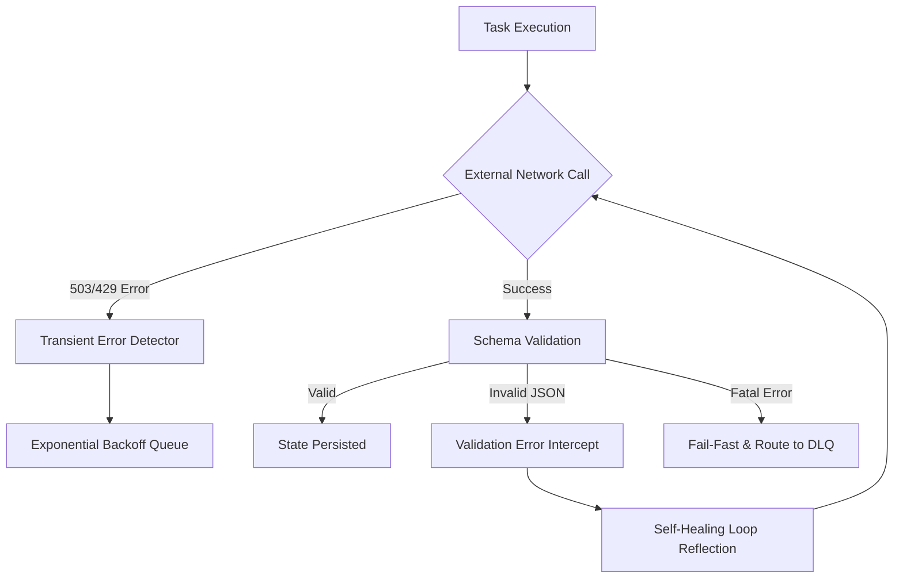

# Resilience & Observability

## 1. Executive Summary
The **Resilience & Observability** capability acts as the "Shield" for the Compound AI System. Its primary role is to ensure that the system degrades gracefully under extreme load or when external dependencies (like Vertex AI) fail. It enforces proactive error handling, automated self-healing mechanisms, and guarantees that when a fatal failure does occur, it is isolated and observable rather than causing a cascading system outage.

## 2. Core Architectural Invariants (The Laws)

These absolute rules (Knowledge Items) govern the global context and must NEVER be violated:

### 2.1. Transient Error Resilience
- **Law:** The system must differentiate between fatal semantic errors (e.g., bad prompts) and transient network failures (e.g., 503 Service Unavailable, 429 Rate Limits).
- **Enforcement:** Before routing a failed execution to the Dead Letter Queue (DLQ), the system must utilize `_is_transient_chunk_error` detection. If a rate limit or service outage is detected, the workflow engine automatically intercepts the error and places the task into an exponential backoff retry loop. This ensures that massive parallel executions do not instantly fail during minor network blips.

### 2.2. LLM Schema Validation Healing
- **Law:** The LLM's response format is fundamentally untrustworthy and must never be piped directly into domain validation without a safety net.
- **Enforcement:** When the LLM outputs malformed JSON or violates the expected structure, the system intercepts the `PydanticValidationError`. Rather than failing the workflow, it automatically triggers a "Self-Healing" loop, reflecting the exact validation error back to the LLM (up to a configurable maximum retry limit) to force the model to correct its own syntax before giving up.

### 2.3. App Error Boundary (Red Screen Mitigation)
- **Law:** The UI must never hide rendering errors with empty widgets (`SizedBox.shrink()`), nor must a single component failure crash the entire screen.
- **Enforcement:** The Flutter frontend mandates strict component-level `AppErrorBoundaries`. If a specific server-driven UI block receives corrupted data or encounters a rendering error, that specific component isolates the crash and renders a localized, user-friendly error card (containing the Dual-Reporting trace ID). The rest of the application remains fully functional.

## 3. Logical Data Flow

## 4. Physical Implementation Map (Auto-Generated)
> **Note:** This section is automatically maintained by the Tier 7 execution agent. Do not manually update physical file paths here.
- **Backend Entrypoints:** `backend_v2/services/orchestrator/strategies/llm_execution/chunk_worker.py` (Transient Error Detector), `backend_v2/worker.py` (Exponential Backoff Queue), `backend_v2/core/rate_limit.py`.
- **Frontend Consumers:** `client_app_v2/lib/core/error/app_error_boundary.dart` (Red Screen Mitigation).
