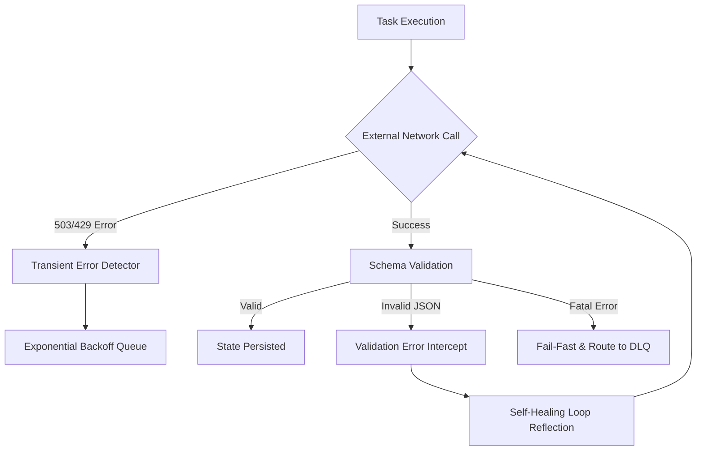

# Resilience & Observability

## 1. Executive Summary
The **Resilience & Observability** capability acts as the "Shield" for the Compound AI System. Its primary role is to ensure that the system degrades gracefully under extreme load or when external dependencies fail. It enforces proactive error handling, automated self-healing mechanisms, and guarantees that when a fatal failure does occur, it is isolated and observable rather than causing a cascading system outage.

## 2. Core Architectural Invariants (The Laws)

These absolute rules (Knowledge Items) govern the global context and must NEVER be violated:

### 2.1. Transient Error Resilience
- **Law:** The system must differentiate between fatal semantic errors (e.g., bad prompts) and transient network failures (e.g., 503 Service Unavailable, 429 Rate Limits).
- **Enforcement:** Before routing a failed execution to the Dead Letter Queue (DLQ), the system must utilize transient error detection. If a rate limit or service outage is detected, the workflow engine automatically intercepts the error and places the task into an exponential backoff retry loop. This ensures that massive parallel executions do not instantly fail during minor network blips.

### 2.2. LLM Schema Validation Healing
- **Law:** The LLM's response format is fundamentally untrustworthy and must never be piped directly into domain validation without a safety net.
- **Enforcement:** When the LLM outputs malformed JSON or violates the expected structure, the system intercepts the validation error. Rather than failing the workflow, it automatically triggers a "Self-Healing" loop, reflecting the exact validation error back to the LLM (up to a configurable maximum retry limit) to force the model to correct its own syntax before giving up.

### 2.3. App Error Boundary (Red Screen Mitigation)
- **Law:** The UI must never hide rendering errors with empty widgets, nor must a single component failure crash the entire screen.
- **Enforcement:** The frontend mandates strict component-level error boundaries. If a specific server-driven UI block receives corrupted data or encounters a rendering error, that specific component isolates the crash and renders a localized, user-friendly error card (containing the Dual-Reporting trace ID). The rest of the application remains fully functional.

### 2.4. Compliance Guardrail Validation
- **Law:** System interactions must be continuously monitored for regulatory and safety compliance before reaching external providers.
- **Enforcement:** A dedicated compliance guardrail actively analyzes outbound and inbound payloads to intercept personally identifiable information (PII) or policy violations. This mechanism guarantees that sensitive data is sanitized or execution is halted before interacting with third-party LLMs.

### 2.5. Centralized Observability and Usage Tracking
- **Law:** Every computational action, especially those invoking external LLMs, must be deterministically tracked for performance, progress, and token consumption.
- **Enforcement:** The system enforces continuous observability by piping execution metrics into centralized tracking mechanisms. This provides real-time visibility into workflow progress and accurate aggregation of token usage, ensuring both operational transparency and precise cost attribution.

### 2.6. AST Guardrails & Forensic Verification
- **Law:** Architectural invariants (such as prohibition of procedural routing, duck-typing, or premature state transitions) must be statically provable and mathematically enforced before runtime execution.
- **Enforcement:** The system executes static AST (Abstract Syntax Tree) guardrails during automated quality gates. These guardrails parse the physical syntax tree to verify that execution engines adhere to structural boundaries, all external hooks register cleanly with the central hook registry, and concurrency limiters are safely wrapped in nullable context managers. Furthermore, cognitive grounding services (such as source verification and evidence quotation) enforce exact lexical matching (`str.find`) and XML injection escaping (`html.escape`) to prevent forensic audit trail contamination.

## 3. Logical Data Flow

