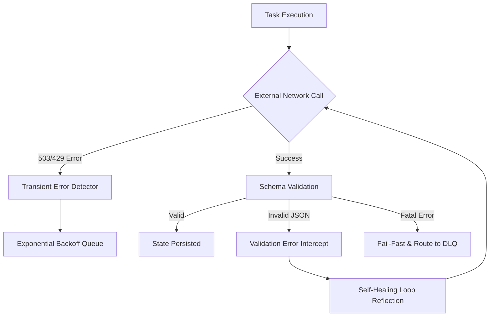

# Resilience & Observability

## 1. Executive Summary
The **Resilience & Observability** capability acts as the "Shield" for the Compound AI System. Its primary role is to ensure that the system degrades gracefully under extreme load or when external dependencies fail. It enforces proactive error handling, automated self-healing mechanisms, and guarantees that when a fatal failure does occur, it is isolated and observable rather than causing a cascading system outage.

## 2. Architectural Principles & Implementation

The Resilience & Observability capability provides graceful degradation, error containment, and operational transparency:

### 2.1. Transient Error Resilience & Backoff
The execution engine differentiates fatal semantic errors from transient network blips (HTTP 503, 429 Rate Limits). When transient errors or provider capacity limits occur, the workflow engine catches the failure and queues the task with exponential backoff rather than failing the execution or dispatching to the Dead Letter Queue.

### 2.2. Schema Validation Self-Healing
When an LLM emits malformed JSON or violates the required Pydantic output schema, the structured task executor intercepts the validation error. Up to the configured retry threshold, it reflects the specific schema error back to the model in a targeted correction prompt, prompting the model to repair its formatting before triggering a fatal exception.

### 2.3. Component-Level App Error Boundaries
The client application implements granular error boundaries. If a specific Server-Driven UI block receives corrupted data or encounters a rendering error, that individual component renders a localized error card containing the RFC 7807 trace identifier, allowing the rest of the report and application shell to remain interactive and responsive.

### 2.4. Compliance & Privacy Guardrails
System interactions pass through automated compliance guardrails that inspect outbound payloads for personally identifiable information (PII) and policy violations. Sensitive data is sanitized or execution halted before external model transmission.

### 2.5. Centralized Observability & Usage Attribution
Every computational action and LLM invocation records telemetry into centralized monitoring pipelines. Metrics capture prompt tokens, completion tokens, cached tokens, execution duration, and provider cost, enabling precise operational oversight and financial tracking.

### 2.6. Static AST Guardrails & Forensic Verification
Architectural invariants (such as prohibition of procedural routing, duck-typing, or raw dictionary state transit) are statically verified through AST guardrail tests executed during automated quality gates. In cognitive grounding, services enforce exact character matching (`str.find`) and XML injection escaping (`html.escape`) to guarantee evidentiary integrity.

## 3. Logical Data Flow

