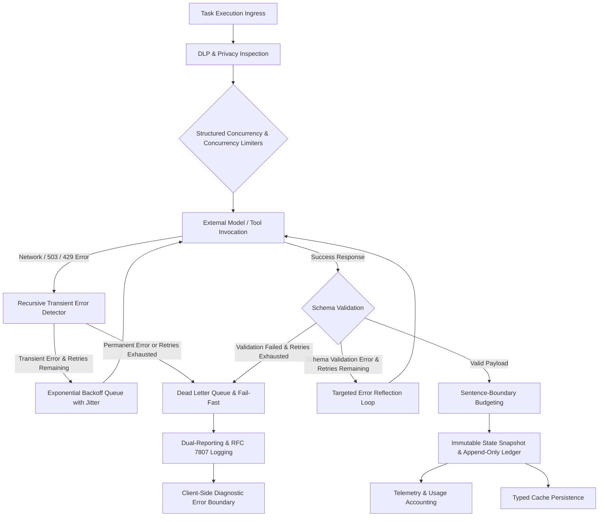

# Resilience & Observability

## 1. Executive Summary
The **Resilience & Observability** capability acts as the operational and forensic shield for the Compound AI System. It guarantees system stability, fault containment, graceful degradation, and comprehensive operational transparency across asynchronous distributed execution. By combining recursive transient error detection, circuit-broken retry mechanics, Dead Letter Queue (DLQ) boundaries, structured concurrency with automatic task cancellation, RFC 7807 problem details reporting, client-side diagnostic error boundaries, privacy and data leak prevention (DLP), immutable system audit trails, and static AST guardrail verification, this capability ensures that transient disruptions never escalate into cascading outages, data remains strictly protected, and all model reasoning and external tool interactions are forensically auditable.

## 2. Architectural Principles & Implementation

The Resilience & Observability capability enforces operational stability, fault isolation, and systemic transparency:

### 2.1. Transient Error Resilience & Recursive Exception Unwrapping
The execution engine strictly differentiates fatal semantic errors from transient network blips, upstream capacity bottlenecks, rate limits (HTTP 429), and gateway drops (HTTP 502, 503, 504). Transient error detection is centralized at the upstream provider boundary as an authoritative Single Source of Truth. Rather than inspecting only shallow, top-level exceptions, the transient classifier recursively unwraps nested exception graphs, including asynchronous exception groups, chained causes, context errors, and custom wrapper objects. A memory-address cycle defense prevents infinite recursion during cyclic exception chains.

The classifier categorizes exceptions into a strict taxonomy:
- **Retriable Transient Anomalies:** Socket disconnects, remote protocol drops, read timeouts, connection resets, upstream timeout domain codes, service unavailable states, and rate limit errors. These trigger exponential backoff with jitter and automated retries rather than aborting execution.
- **Permanent Logical Failures:** Schema validation errors, type mismatches, missing required fields, configuration errors, and structural domain exceptions. These return false immediately, bypassing retry loops and triggering fast failure to conserve compute and token budgets.

### 2.2. Dead Letter Queue (DLQ) Containment & Anti-Premature Routing
The Dead Letter Queue serves as an isolated quarantine boundary for permanently failed execution payloads, protecting downstream pipelines from poisoned messages while preserving failed execution states for forensic inspection. 

To prevent premature failure of long-running evaluations, tasks encountering transient transport drops are never routed to the Dead Letter Queue prematurely; they are retried across the configured retry budget. Only when all transient retry attempts are exhausted, or when an error is classified as permanently non-retriable, is the payload routed to the Dead Letter Queue or marked with a failed execution status. In parallel batch evaluations, chunk workers trap node-level failures internally and route individual item failures to the DLQ, ensuring that an isolated item defect does not propagate upward to cancel valid sibling operations.

### 2.3. Structured Concurrency & Failure Isolation
All asynchronous routines are orchestrated through structured task groups, eliminating detached background tasks and silent zombie coroutines. When a subtask within a task group fails with an unhandled exception, the task group automatically cancels all remaining sibling coroutines, preventing leaked memory, lingering database locks, and runaway model invocation costs. Parallel exceptions are collected into typed exception groups and evaluated using native split-exception handling.

Concurrency limits are governed by a two-tier semaphore architecture:
- **Macro-Level Job Limiter:** Regulates global worker throughput and background job scheduling.
- **Micro-Level Request Limiter:** Governs concurrent model invocations and external network requests.

Isolating macro and micro limiters prevents recursive lock acquisition and eliminates thread deadlocks. Concurrency limiters incorporate null-context fallbacks to enable unconstrained execution in test environments without raising runtime attribute errors. Task lifecycle telemetry marks tasks as actively running only after the concurrency limiter is acquired, ensuring queue wait times do not falsely inflate execution latency metrics.

### 2.4. Schema Validation Self-Healing & Capped Reflection Loops
When structured model output violates required schemas or produces malformed syntax, a deterministic reflection mechanism intercepts the validation failure. Up to a strict, centrally configured retry limit, the specific schema violation and field expectations are reflected back to the model in a targeted correction prompt, enabling autonomous repair of formatting errors.

If the model fails to produce valid output within the retry threshold, the self-healing loop halts immediately and raises a typed validation exception. This capped threshold prevents infinite repair cycles, unbounded token consumption, and latency degradation. Ad-hoc regular expression patches, dynamic key guessing, and loose schema allowances are prohibited; data validation is enforced strictly through schema validation engines.

### 2.5. Universal Problem Details & Dual-Reporting Protocol (RFC 7807)
All system errors conform to the RFC 7807 Problem Details specification, providing structured, machine-readable representations of errors with standardized status codes, error classifications, and resource instance paths while protecting internal system internals from external exposure.

Backend error handling mandates a dual-reporting protocol: every domain exception is preceded by structured logging that captures the exact logical error code, execution parameters, and forensic trace identifiers before the exception is raised. Error codes follow a standardized nomenclature based on domain, reason, and detail, mapping directly to localized client translation keys. This decouples user-facing localization from server-side diagnostics and ensures consistent cross-platform error communication.

### 2.6. Client-Side Forensic Error Boundaries
The client application incorporates granular, component-level error boundaries around Server-Driven UI renderers and layout structures. When an individual UI block encounters corrupted data, missing properties, or rendering exceptions, the error boundary intercepts the failure locally.

Rather than allowing an uncaught exception to crash the application, trigger a gray/red screen of death, or silently hide the defective element, the boundary displays a localized diagnostic error card. This card presents the RFC 7807 error classification, specific mapping failure, and forensic trace identifier. Localizing failures to the affected component preserves overall application stability, allowing the remaining report sections, navigation shells, and interactive tools to remain fully responsive.

### 2.7. Automated Data Leak Prevention (DLP) & Privacy Guardrails
Data flowing across system boundaries passes through automated privacy guardrails to detect and protect personally identifiable information (PII) and sensitive operational data. Natural language text undergoing ingestion is analyzed using lazy-loaded linguistic engines, identifying sensitive entities (such as names, contact details, and financial identifiers) across supported languages and applying deterministic masking prior to external model transmission.

Operational logging, execution traces, and audit records enforce strict data leak prevention. Raw HTTP request bodies, user prompt contents, API keys, and authorization tokens are excluded from log outputs and problem details responses. Logs record exclusively mathematical metrics, logical error codes, and opaque system identifiers, preventing credential leakage and ensuring regulatory compliance.

### 2.8. Immutable System Audit Trails & Explainable AI (XAI) Transparency
External tool interactions (such as web search queries, information retrieval operations, and external API requests) are captured in immutable audit traces. Each audit trace records the tool identifier, triggering workflow step, verbatim claim under verification, submitted search query, epistemic knowledge gap, search rationale, distilled evidence summary, cited source URLs, and round-trip execution latency.

State progression adheres to an append-only ledger model: historical execution traces, step states, and tool audit logs are never modified in-place. State transitions produce new immutable snapshots, establishing a continuous, tamper-evident audit trail that supports explainable AI principles and satisfies international record-keeping standards. Audit traces are transformed into interactive Server-Driven UI components through dedicated presentation adapters, providing users and auditors with transparent fact-checking logs and evidentiary receipts.

### 2.9. Centralized Telemetry, Token Tracking & Multi-Tier Usage Accounting
Every model invocation, background process, and computational task records operational telemetry into centralized monitoring pipelines. Telemetry captures prompt tokens, completion tokens, cached tokens, cache creation tokens, reasoning tokens, execution duration, and provider costs.

Token pricing calculations resolve rates strictly from an authoritative, centralized model pricing registry, eliminating decentralized pricing dictionaries and ad-hoc calculations. Usage records undergo automatic multi-tier cumulative aggregation, maintaining real-time and all-time consumption totals at the root system level, tenant organization level, and individual user level. Telemetry context filters inject unique execution and request identifiers into all log records, enabling continuous end-to-end tracing across asynchronous queues and API boundaries.

### 2.10. Typed High-Throughput Caching & Auto-Eviction
High-frequency intermediate states and model structures utilize typed caching with native JSON deserialization directly into immutable domain models. The cache layer operates under an auto-eviction firewall: if cached data fails schema validation or becomes incompatible following schema updates, the corrupted cache key is immediately purged from the cache store and a cache miss is returned. This prevents poisoned or stale data from propagating through downstream processing pipelines.

### 2.11. Sentence-Boundary Character Budgeting & Semantic Integrity
Output length constraints and character limits are governed by sentence-boundary aware budgeting algorithms rather than arbitrary character slicing. When generated content exceeds designated presentation budgets, the budgeting engine scans backward from the character limit to identify the nearest terminal punctuation, preserving complete sentences, semantic cohesion, and closing quotations.

If no sentence boundary exists within a reasonable threshold of the budget limit, the engine preserves the first complete sentence or trims at the nearest word boundary with terminal punctuation. This prevents mid-sentence truncation, broken words, and dangling clauses, maintaining high editorial quality and semantic integrity in executive reports.

### 2.12. Static AST Architectural Guardrails & Evidentiary Verification
Architectural invariants and coding standards are statically enforced at build and test time through an automated AST Codebase Guardrails Engine. The engine inspects Python abstract syntax trees to detect and block architectural anti-patterns prior to test execution:
- Prohibition of runtime reflection and dynamic duck-typing.
- Ban on lazy dictionary fallback lookups, multi-variable fallback chains, and default fallback operators in domain code.
- Elimination of unstructured concurrency in favor of structured task groups.
- Prohibition of permissive model configurations and in-place mutation of frozen models.
- Ban on anonymous multi-value state tuples, hardcoded magic timeouts, and naive timestamps.
- Prevention of unverified persistence mocking in automated tests.

In cognitive processing, evidentiary quotes are strictly validated against source texts using exact lexical matching and XML entity escaping, guaranteeing evidentiary integrity and eliminating quote hallucination.

### 2.13. Local Debug Prompt Logging, Context Preservation & Event-Loop File Locking
During local development and diagnostic inspection, LLM task executions record deterministic markdown prompt traces into execution artifact directories (`data/files/executions/{execution_id}/llm_debug_prompts.md`):
- **Structured Sub-Engine Auditing**: Primary tasks and sub-engine operations (including parallel Best-of-Three ensemble calls and Phase 0 atomizers) log the static system instructions, theory context prefix, CDATA user payloads, attempt numbers, and expected schema definitions.
- **Parent Context Preservation**: When sub-engine tasks pass sub-task tags (`validation_context={"sub_task": "..."}`), the execution pipeline merges caller parameters with default validation context (`{**(default or {}), **(caller or {})}`), ensuring parent `execution_id` and `step_id` persist unbroken across child task dispatches.
- **Event-Loop Asynchronous File-Locking (`_get_debug_file_lock`)**: All debug logger operations are asynchronous and serialized under an event-loop-bound lazy `asyncio.Lock()`. When parallel sub-engine tasks run concurrently inside `asyncio.TaskGroup`, the lock serializes file appends to eliminate Windows file collision crashes (`WinError 32: PermissionError`), guaranteeing loss-free trace persistence across multi-task evaluations.

## 3. Logical Data Flow

