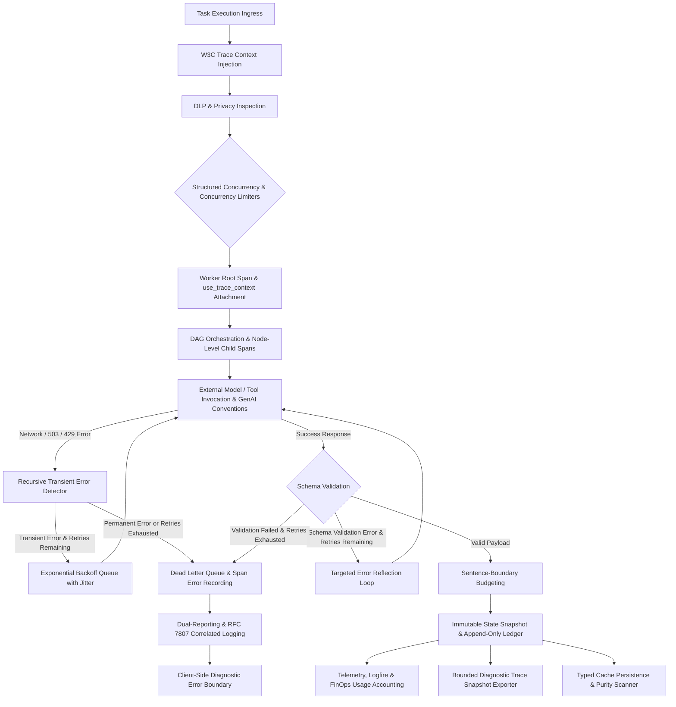

# Resilience & Observability

## 1. Executive Summary
The **Resilience & Observability** capability acts as the operational and forensic shield for the Compound AI System. It guarantees system stability, fault containment, graceful degradation, and comprehensive operational transparency across asynchronous distributed execution. By combining recursive transient error detection, circuit-broken retry mechanics, Dead Letter Queue (DLQ) boundaries, structured concurrency with automatic task cancellation, RFC 7807 problem details reporting, client-side diagnostic error boundaries, privacy and data leak prevention (DLP), immutable system audit trails, and static AST guardrail verification, this capability ensures that transient disruptions never escalate into cascading outages, data remains strictly protected, and all model reasoning and external tool interactions are forensically auditable.

## 2. Architectural Principles & Implementation

The Resilience & Observability capability enforces operational stability, fault isolation, and systemic transparency:

### 2.1. Transient Error Resilience & Recursive Exception Unwrapping
The execution engine strictly differentiates fatal semantic errors from transient network blips, upstream capacity bottlenecks, rate limits (HTTP 429), and gateway drops (HTTP 502, 503, 504). Transient error detection is centralized at the upstream provider boundary as an authoritative Single Source of Truth. Rather than inspecting only shallow, top-level exceptions, the transient classifier recursively unwraps nested exception graphs, including asynchronous exception groups, chained causes, context errors, and custom wrapper objects. A memory-address cycle defense prevents infinite recursion during cyclic exception chains.

The classifier categorizes exceptions into a strict taxonomy:
- **Retriable Transient Anomalies:** Socket disconnects, remote protocol drops, read timeouts, connection resets, upstream timeout domain codes, service unavailable states, and rate limit errors. These trigger exponential backoff with jitter and automated retries rather than aborting execution. Outbound JSON-RPC 2.0 tool execution requests dispatched via generic Model Context Protocol (MCP) clients are also coordinated through centralized transient classification and exponential backoff, shielding interactive agentic workflows from intermittent gateway timeouts or transport drops.
- **Permanent Logical Failures:** Schema validation errors, type mismatches, missing required fields, configuration errors, and structural domain exceptions. These return false immediately, bypassing retry loops and triggering fast failure to conserve compute and token budgets.

### 2.2. Dead Letter Queue (DLQ) Containment & Anti-Premature Routing
The Dead Letter Queue serves as an isolated quarantine boundary for permanently failed execution payloads, protecting downstream pipelines from poisoned messages while preserving failed execution states for forensic inspection. 

To prevent premature failure of long-running evaluations, tasks encountering transient transport drops are never routed to the Dead Letter Queue prematurely; they are retried across the configured retry budget. Only when all transient retry attempts are exhausted, or when an error is classified as permanently non-retriable, is the payload routed to the Dead Letter Queue or marked with a failed execution status. In parallel batch evaluations, chunk workers trap node-level failures internally and route individual item failures to the DLQ, ensuring that an isolated item defect does not propagate upward to cancel valid sibling operations. In asynchronous DAG execution, when a step in a topological wave fails or the execution scope is cancelled, the DAG executor automatically records failure details to the Dead Letter Queue via `_dlq_record_step_failure` for all affected and unreached nodes, ensuring cancelled steps are quarantined rather than leaving ambiguous pending states.

### 2.3. Structured Concurrency & Failure Isolation
All asynchronous routines are orchestrated through structured task groups, eliminating detached background tasks and silent zombie coroutines. When a subtask within a task group fails with an unhandled exception, the task group automatically cancels all remaining sibling coroutines, preventing leaked memory, lingering database locks, and runaway model invocation costs. Parallel exceptions are collected into typed exception groups and evaluated using native split-exception handling.

Within parallel chunk extractions (`TwoPassAtomizer`), probabilistic citations that fall outside assigned packet bounds are treated as local validation events rather than fatal server exceptions: out-of-packet atoms are logged with structured warnings (`corrupted_atom_dropped`) and pruned, allowing the worker to continue extracting remaining valid atoms without raising unhandled exceptions that tear down the parallel `asyncio.TaskGroup`.

Concurrency limits are governed across decoupled operational tiers:
- **Macro-Level Workflow Limiter:** Regulates global worker throughput in the Arq background daemon (`settings.max_concurrent_workflows`).
- **Micro-Level Provider Throttling Pool:** Governs concurrent outbound model invocations within `LiteLLMProvider` via a dynamic semaphore pool configured from provider RPM settings, dynamically shielding external provider APIs from rate limits.
- **Synthesis Fan-Out Limiter:** Restricts parallel synthesis sub-task execution (`settings.max_concurrent_llm_steps`).

Isolating macro and micro limiters prevents recursive lock acquisition and eliminates thread deadlocks. Computational execution engines operate with pure stateless execution decoupled from runtime concurrency primitives. Task lifecycle telemetry updates step status to running synchronously upon dispatch, ensuring execution telemetry accurately reflects active computation.

Concurrency stress test suites verify memory lock atomicity and zero lock starvation under high-concurrency TaskGroup workloads. Coroutines acquire bounded update locks (`_update_lock`) exclusively for shallow dictionary updates and event signaling, never holding update locks across asynchronous I/O, database commits, or network requests. Furthermore, topological wave execution enforces the Post-Wave Atomic Commit Invariant: zero database connections or transactions are held open during parallel `asyncio.TaskGroup` model inference. Database connections are acquired via `PostgresUnitOfWork` in `repeatable_read` isolation strictly after wave inference completes, bound with explicit statement timeouts (`settings.postgres_command_timeout_seconds`), and released via PEP 765 pure `finally` cleanup blocks without control-flow jumps. During FastAPI application lifespan startup, asynchronous preflight verification (`_validate_database_preflight`) opens a `QuorumUnitOfWork` context and invokes `verify_seed_table_counts` across all 10 core PostgreSQL 19 tables, failing fast with `AppException(ErrorCodes.CONFIGURATION_ERROR)` if any of the 7 required seeded tables (`organizations`, `users`, `system_configs`, `prompt_blocks`, `steps`, `workflows`, `output_profiles`) is empty or unreachable, while `_audit_storage_and_database_sync` reconciles persisted `ExecutionRecord` identifiers against physical storage directories on disk. When asynchronous synchronization primitives (specifically: `asyncio.Semaphore`, `asyncio.Lock`, or `asyncio.Event`) are shared across decomposed modular functions or sub-engines, instances are encapsulated within immutable, frozen parameter containers (`@dataclass(frozen=True)`). Passing the container explicitly ensures single-instance lifecycle across call boundaries and prevents split-semaphore deadlocks or uncoordinated concurrency throttling.

### 2.4. Schema Validation Self-Healing & Capped Reflection Loops
When structured model output violates required schemas or produces malformed syntax, a deterministic reflection mechanism intercepts the validation failure. Up to a strict, centrally configured retry limit, the specific schema violation and field expectations are reflected back to the model in a targeted correction prompt, enabling autonomous repair of formatting errors.

If the model fails to produce valid output within the retry threshold, the self-healing loop halts immediately and raises a typed validation exception. This capped threshold prevents infinite repair cycles, unbounded token consumption, and latency degradation. Ad-hoc regular expression patches, dynamic key guessing, and loose schema allowances are prohibited; data validation is enforced strictly through schema validation engines.

### 2.5. Universal Problem Details & Dual-Reporting Protocol (RFC 7807)
All system errors conform to the RFC 7807 Problem Details specification, providing structured, machine-readable representations of errors with standardized status codes, error classifications, and resource instance paths while protecting internal system internals from external exposure.

Backend error handling mandates a dual-reporting protocol: every domain exception is preceded by structured logging that captures the exact logical error code, execution parameters, and forensic trace identifiers before the exception is raised. Error codes follow a standardized nomenclature based on domain, reason, and detail, mapping directly to localized client translation keys. This decouples user-facing localization from server-side diagnostics and ensures consistent cross-platform error communication.

### 2.6. Client-Side Forensic Error Boundaries
The client application incorporates granular, component-level error boundaries around Server-Driven UI renderers and layout structures. In `sdui_blocks_renderer.dart`, autonomous composite visual blocks (`RadarChart`, `ScatterPlot`, `QuadrantMatrix`, `MatrixTable`, `Grid`, and `Accordion`) are wrapped individually in `AppErrorBoundary`. When an individual UI block encounters corrupted data, missing properties, or rendering exceptions, the error boundary intercepts the failure locally.

Rather than allowing an uncaught exception to crash the application, trigger a gray/red screen of death, or silently hide the defective element, the boundary displays a localized diagnostic error card. This card presents the RFC 7807 error classification, specific mapping failure, and forensic trace identifier. Localizing failures to the affected component preserves overall application stability, allowing the remaining report sections, navigation shells, and interactive tools to remain fully responsive.

### 2.7. Automated Data Leak Prevention (DLP) & Privacy Guardrails
Data flowing across system boundaries passes through automated privacy guardrails to detect and protect personally identifiable information (PII) and sensitive operational data. Natural language text undergoing ingestion is analyzed using lazy-loaded linguistic engines, identifying sensitive entities (such as names, contact details, and financial identifiers) across supported languages and applying deterministic masking prior to external model transmission.

Operational logging, execution traces, and audit records enforce strict data leak prevention. Raw HTTP request bodies, user prompt contents, API keys, and authorization tokens are excluded from log outputs and problem details responses. Logs record exclusively mathematical metrics, logical error codes, and opaque system identifiers, preventing credential leakage and ensuring regulatory compliance.

### 2.8. Immutable System Audit Trails & Explainable AI (XAI) Transparency
External tool interactions (such as web search queries, information retrieval operations, and external API requests) are captured in immutable audit traces. Each audit trace records the tool identifier, triggering workflow step, verbatim claim under verification, submitted search query, epistemic knowledge gap, search rationale, distilled evidence summary, cited source URLs, and round-trip execution latency. In dynamic Model Context Protocol (MCP) interactions, audit traces (`MCPAuditTrace`) preserve full gateway provenance, capturing the originating gateway identifier (`gateway_id`), gateway slug (`gateway_slug`), namespaced tool alias (`namespaced_alias`), invocation arguments, tool capability categorization, and raw JSON-RPC response payloads alongside distilled evidence.

State progression adheres to an append-only ledger model: historical execution traces, step states, and tool audit logs are never modified in-place. State transitions produce new immutable snapshots, establishing a continuous, tamper-evident audit trail that supports explainable AI principles and satisfies international record-keeping standards. Audit traces are transformed into interactive Server-Driven UI components through dedicated presentation adapters, providing users and auditors with transparent fact-checking logs and evidentiary receipts.

### 2.9. Centralized Telemetry, Distributed Tracing & Multi-Tier FinOps Accounting
Every model invocation, background process, and computational task records operational telemetry into centralized monitoring and tracing pipelines through standard OpenTelemetry (OTel) and Pydantic Logfire instrumentation:
- **W3C Trace Context Propagation**: Distributed trace context conforms to W3C Trace Context specifications (`traceparent`, `tracestate`). Telemetry context is injected at API ingress, encapsulated within strict serialization carriers with cross-platform parity between backend and client models, and propagated across asynchronous message queues into background worker processes.
- **Resilient Worker Context Attachment**: Worker execution attaches trace context to running coroutines using deterministic detachment tokens that release context upon task completion, preventing context leakage across recycled event loop tasks. If an execution record lacks trace context, the worker initializes an orphan root span with explicit orphan flags, preserving observability without failing execution.
- **Hierarchical Span Architecture**: Workflow execution forms an acyclic span hierarchy: a root orchestration span encapsulates the workflow, child spans track individual node executions with RFC 7807 problem details and exception recording on failure, and nested child spans trace domain sub-engines, semantic atomization, consensus evaluation, and qualitative synthesis.
- **GenAI Semantic Conventions & Dynamic MCP Telemetry**: Outbound foundational model interactions adhere to OpenTelemetry GenAI Semantic Conventions, capturing prompt tokens, completion tokens, cached tokens, reasoning tokens, and physical model identifiers. Context cache hits record explicit cache hit attributes on active spans. External tool calls and dynamic MCP gateway operations are fully instrumented with specialized distributed tracing spans: `mcp.discovery` spans capture gateway discovery latency, target URL, and discovered tool counts, while `mcp.tool_call` spans record the namespaced tool identifier, target gateway, workflow step binding, declared tool capability, and execution latency boundaries.
- **Structured Log Correlation**: Log formatting engines automatically extract active trace and span identifiers from the execution context, injecting them into structured JSON logs for end-to-end correlation between distributed trace trees and operational logging.
- **Multi-Tier FinOps Accounting**: Token pricing calculations resolve rates strictly from an authoritative, centralized model pricing registry, eliminating decentralized pricing dictionaries and ad-hoc calculations. Usage records undergo automatic multi-tier cumulative aggregation, maintaining real-time and all-time consumption totals at the root system level, tenant organization level, and individual user level.

### 2.10. Typed High-Throughput Caching & Auto-Eviction
High-frequency intermediate states and model structures utilize typed caching with native JSON deserialization directly into immutable domain models. The cache layer operates under an auto-eviction firewall: if cached data fails schema validation or becomes incompatible following schema updates, the corrupted cache key is immediately purged from the cache store and a cache miss is returned. This prevents poisoned or stale data from propagating through downstream processing pipelines.

Static prefix caching strictly enforces dynamic variable quarantine: prompts compiled for context caching undergo pre-flight Fail-Fast purity scanning in `caching_service.py` (`_run_purity_scanner`). If dynamic timestamps, formatted dates, or UUIDs are detected within the static system prompt prefix, the service immediately raises `AppException(ErrorCodes.VALIDATION_FAILED)` before dispatching the request. Dynamic execution variables, atom aliases, and user payloads are restricted exclusively to the dynamic user message tail, protecting prompt cache hit rates and eliminating cache invalidation thrashing.

For external tool discovery, typed gateway caching (`MCPGatewayCache`) maintains in-memory snapshots of discovered tool manifests and compiled JSON Schema argument models. The cache enforces reactive auto-invalidation: whenever an MCP gateway's configuration, URL, or transport mode is created, updated, or deleted, corresponding gateway cache entries are immediately invalidated, ensuring downstream execution engines and Studio interfaces never operate on stale tool definitions.

### 2.11. Sentence-Boundary Character Budgeting & Semantic Integrity
Output length constraints and character limits are governed by sentence-boundary aware budgeting algorithms rather than arbitrary character slicing. When generated content exceeds designated presentation budgets, the budgeting engine scans backward from the character limit to identify the nearest terminal punctuation, preserving complete sentences, semantic cohesion, and closing quotations.

If no sentence boundary exists within a reasonable threshold of the budget limit, the engine preserves the first complete sentence or trims at the nearest word boundary with terminal punctuation. This prevents mid-sentence truncation, broken words, and dangling clauses, maintaining high editorial quality and semantic integrity in executive reports.

### 2.12. Static AST & Dart Architectural Guardrails, Clean Imports & Mutation Invariance
Architectural invariants and coding standards are statically enforced at build and test time through an automated AST Codebase Guardrails Engine, client-side Dart Guardrails Engine, clean import verification, zero permissive typing verification, and mathematical core mutation testing:
- **Comprehensive 29-Rule FATAL Guardrails Engine**: Enforces unconditional FATAL severity across all 29 guardrail rules (QGR000-QGR029) in domain code. The engine eliminates runtime reflection and duck-typing, bans dictionary `.get()` lookups and lazy fallbacks, eradicates silent exception swallowing in handlers, prohibits missing strict Pydantic `ConfigDict(strict=True, extra="forbid")`, eliminates deceptive persistence mocking in test suites in favor of stateful in-memory fakes (QGR014), prohibits monolithic facades and non-PostgreSQL persistence drivers or file database artifacts (QGR017), bans legacy string-quoted type annotations under Python 3.14 deferred evaluation (QGR024), prohibits untyped dictionary state injection into `model_copy(update=...)` (QGR025), bans unconditional test skips and expected-failure markers (QGR026), prohibits unauthorized Open-JSON dictionary annotations in non-exempt models (QGR027), prohibits redundant repository model reconstitution and domain state dictionary conversions in services (QGR028), and prohibits untyped dictionary annotations and returns in `@pytest.fixture` functions (QGR029) in favor of centralized Polyfactory model factories (`model_factories.py`, `test_model_factories.py`).
- **Zero-Warning Ceiling Baseline Ledger**: An automated warning ledger (`audit_warning_baseline.py`) cryptographically verifies an absolute zero-warning ceiling (0 fatal violations, 0 advisory warnings) across all backend modules via `--verify-zero` while enforcing monotonic exact-equality residual debt ceilings locked at zero across all ten tracked debt vectors.
- **Clean Import & Circular Dependency Verification**: A codebase-wide import verification engine (`audit_clean_imports.py`) dynamically imports every module across the system in Stage 7/10 of the backend audit loop, proving zero circular dependencies and zero module-level initialization errors before test execution.
- **Cross-Language DTO Parity Verification**: Automated DTO parity analysis (`audit_dto_parity.py`) in Stage 8/10 of the backend audit loop guarantees 1:1 synchronization between backend Pydantic models and frontend Dart Freezed models.
- **Dict Eradication & Typed Domain Transit Verification**: The AST dict eradication engine (`audit_dict_eradication.py`) in Stage 10/10 of the backend audit loop statically verifies zero naked dictionaries, zero Primitive Obsession nested dictionaries, zero unchecked casts, zero unauthorized `# noqa` tokens, zero `# type: ignore` comments, and config suppression ratchets across backend and script scopes.
- **Zero-ORM Strictness & Closed 12-Table DDL AST Verification**: The Zero-ORM AST verifier (`audit_zero_orm_strictness.py`) enforces rules `ZORM001` through `ZORM006` across persistence and domain boundaries (`PostgresPoolManager`, `PostgresGraphAdapter`, `PostgresEntityAdapter`, `PostgresStorageDriver`, and `PostgresUnitOfWork`): banning ORM and prohibited JSON libraries (`ZORM001`), banning naked dictionary row conversions and `**row` unpacking in database adapters (`ZORM002`), banning untyped `except Exception:` blocks in database adapters (`ZORM003`), locking SQL DDL and query identifiers strictly to the closed 12-table topology (`ZORM004`), banning foundational model invocations inside database or Unit of Work modules (`ZORM005`), and enforcing 1:1 DDL column-to-DTO attribute naming parity (`ZORM006`).
- **Mathematical Core Mutation Testing Invariance**: Foundational mathematical engines (`UnifiedScoringEngine`, `TopologicalEvaluator`) enforce a 100% mutant kill rate under automated AST mutation testing (`audit_mutation_coverage.py`), mathematically proving that test assertions actively verify exact boundary values and arithmetic operations rather than merely executing superficial line paths. During architectural code refactoring or modular decomposition, mathematical calculation logic remains 100% mutant-invariant.
- **Client-Side Dart Guardrails & Theme Sovereignty**: Enforces DGR001 (elimination of untyped loose map returns), DGR002 (ban on empty box UI concealment), DGR003 (compile-time localization), DGR004 (ban on unauthorized linter suppressions), and DGR005 (ban on non-codec `Map<String, dynamic>`), with rules DGR001, DGR004, and DGR005 enforced as unconditional fatal gates in the frontend quality loop. In addition, `scripts/audit_flutter_theme_sovereignty.py` statically enforces Flutter Theme Sovereignty, banning direct static colors and standalone naked `TextStyle` declarations across all client widgets in favor of `Theme.of(context).colorScheme`, `textTheme`, and `AppSemanticColors`.

In cognitive processing, evidentiary quotes are strictly validated against source texts using exact lexical matching and XML entity escaping, guaranteeing evidentiary integrity and eliminating quote hallucination.

### 2.13. Bounded Diagnostic Trace Snapshots & Forensic Error Fingerprinting
For local diagnostic inspection and automated failure analysis, the telemetry pipeline exports bounded execution trace snapshots:
- **Context Window Protection**: Diagnostic snapshots are exported to dedicated local trace files, strictly capped at a maximum span count and file size budget (<20 KB). This budget cap protects automated analysis agents from context window exhaustion during troubleshooting.
- **Deterministic Error Fingerprints**: Trace exporters synthesize a deterministic error fingerprint extracting root causes, exception types, and failed node identifiers directly from the span tree, enabling instant root cause identification without scraping unstructured text logs.
- **Ad-Hoc Logging Eradication**: Ad-hoc filesystem debug loggers and manual event-loop file locking are completely eliminated from the architecture and statically banned by codebase AST guardrails, ensuring all operational diagnostics flow through standard, structured telemetry channels.

### 2.14. Lightweight Polling Resilience & Regulatory Record-Keeping
Operational monitoring and status streaming incorporate resilient polling and regulatory compliance controls:
- **Lightweight State Polling**: Real-time status streaming endpoints query execution models with payload hydration and resumability verification disabled (`hydrate=False, skip_resumability=True`). This isolates high-frequency polling from multi-megabyte blob reads (`frozen_context`, `execution_trace`), preventing disk I/O starvation. Polling intervals (`settings.sse_polling_interval_seconds`) and transient disconnect retry limits (`settings.sse_max_transient_retries`) are governed by centralized configuration.
- **Regulatory Record-Keeping (EU AI Act Articles 12–15)**: The execution record acts as a legally auditable artifact capturing bi-temporal timestamps and actor identification (Article 12), verbatim prompt and theory snapshots in frozen context storage (Article 13), human-in-the-loop expert override fields on scorecard atoms (Article 14), and exact lexical grounding against source documents (Article 15).
- **Client Deserialization Fail-Fast**: Client models strictly disallow unrecognized keys (`CheckedFromJsonException`), ensuring schema drift between services and client interfaces is detected immediately at boundary ingress rather than failing silently during rendering.

### 2.15. Thread-Isolated Cycle Defense & Topological Fault Attribution Resilience
Dynamic causal discovery and graph evaluation incorporate robust graph resilience, thread isolation, and deterministic fault isolation mechanisms:
- **Thread-Isolated Cycle Detection**: Before executing topological wave evaluation, graph cycle detection is offloaded to a background worker thread via `asyncio.to_thread(list, nx.simple_cycles(g))`. This prevents deep iterative cycle finding from starving or blocking the asynchronous event loop on dense graphs. If cycles are detected, execution records the cycle cleanly to the topological payload (`cycle_detected = True`) without crashing the orchestrator.
- **Topological Wave Crash Recovery**: Wave-based topological evaluation executes in discrete hierarchical dependency waves. If an evaluation wave encounters an unhandled exception or cycle fault, the wave is trapped, affected downstream nodes are transitioned to failure states, and the failure is recorded to the Dead Letter Queue.
- **Bounded Upward Fault Attribution**: When an evaluation node fails or produces a diagnostic fault, the engine performs bounded upward traversal along the causal graph DAG edges. The traversal identifies the ultimate upstream originator (`root_cause_node_ids`) and isolates it from secondary cascading failures (`blame_parent_ids`). This prevents multi-point penalization and ensures fault metrics reflect true causal origins rather than downstream side-effects.
- **Data Starvation & Empty Document Circuit Breakers**: The engine enforces fail-fast input validation prior to graph construction. Empty document payloads immediately trigger the `CAUSAL_DISCOVERY_EMPTY_DOCUMENT` circuit breaker, while pipelines lacking sufficient causal event pairs or structural connectivity trigger `CAUSAL_DISCOVERY_DATA_STARVATION`, terminating processing cleanly before allocating compute or LLM tokens.

### 2.16. Unattended CLI Orchestration Resilience, Process Tree Termination & Circuit Breaking
Autonomous command-line workflows and multi-stage orchestration scripts enforce dedicated operational resilience patterns to prevent orphaned background processes, execution deadlocks, and repository corruption during unattended runs:
- **Windows Process Tree Termination**: Child CLI subagents operating under external tool wrappers (specifically `cmd.exe /c` or shell interpreters) spawn decoupled process hierarchies. If an execution timeout or cancellation event occurs, termination is executed across the entire process hierarchy using Windows tree termination (`taskkill /F /T /PID`). This eliminates orphaned background processes, frees locked workspace files, and cleanly closes communication pipes.
- **Asynchronous Watchdog Timers & Non-Blocking Streaming**: Output reading over subprocess stdout pipes is decoupled from timeout enforcement through asynchronous watchdog timers (`threading.Timer`). The watchdog triggers deterministic process tree termination upon timeout expiry, breaking blocking pipe reads with EOF and propagating typed execution timeouts rather than stalling indefinitely on deadlocked subagents. Output streaming incorporates Unicode encoding resilience, preserving console telemetry without crashing on non-ASCII thought tokens.
- **Automated Rollback & Circuit Breaking**: Unattended execution pipelines enforce immediate circuit-breaking boundaries. If a subagent process exits with a non-zero status code, times out, or fails automated quality gate validation, the pipeline halts immediately. Clean working trees skip redundant commits, dirty repository changes are verified before staging, and tracker documents are updated in-place strictly after quality gates succeed, preventing corrupted states or broken code from advancing through subsequent pipeline stages.
- **Two-Tier Quality Gate & Configurable Model Execution**: Autonomous hardening pipelines decouple high-frequency per-target iterations from macro completion gates. Per-target hardening subagents execute targeted micro-audits (linting, formatting, strict typing, AST guardrails, and unit tests with suppressed network telemetry) driven by calibrated reasoning models (`gemini-4-argon-medium` by default, configurable via CLI). Upon completing all target iterations, the pipeline triggers a sovereign macro-audit across all modified backend targets, ensuring seed integrity, clean imports, and cross-module cohesion before final sign-off.

## 3. Logical Data Flow

```mermaid
flowchart TD
    A[Task Execution Ingress] --> B[W3C Trace Context Injection]
    B --> C[DLP & Privacy Inspection]
    C --> D{Structured Concurrency & Concurrency Limiters}
    D --> E[Worker Root Span & use_trace_context Attachment]
    E --> F[DAG Orchestration & Node-Level Child Spans]
    F --> G[External Model / Tool Invocation & GenAI Conventions]
    
    G -- Network / 503 / 429 Error --> H[Recursive Transient Error Detector]
    H -- Transient Error & Retries Remaining --> I[Exponential Backoff Queue with Jitter]
    I --> G
    H -- Permanent Error or Retries Exhausted --> J[Dead Letter Queue & Span Error Recording]
    
    G -- Success Response --> K{Schema Validation}
    K -- Schema Validation Error & Retries Remaining --> L[Targeted Error Reflection Loop]
    L --> G
    K -- Validation Failed & Retries Exhausted --> J
    
    K -- Valid Payload --> M[Sentence-Boundary Budgeting]
    M --> N[Immutable State Snapshot & Append-Only Ledger]
    N --> O[Telemetry, Logfire & FinOps Usage Accounting]
    N --> P[Bounded Diagnostic Trace Snapshot Exporter]
    N --> Q[Typed Cache Persistence & Purity Scanner]
    
    J --> R[Dual-Reporting & RFC 7807 Correlated Logging]
    R --> S[Client-Side Diagnostic Error Boundary]
```
