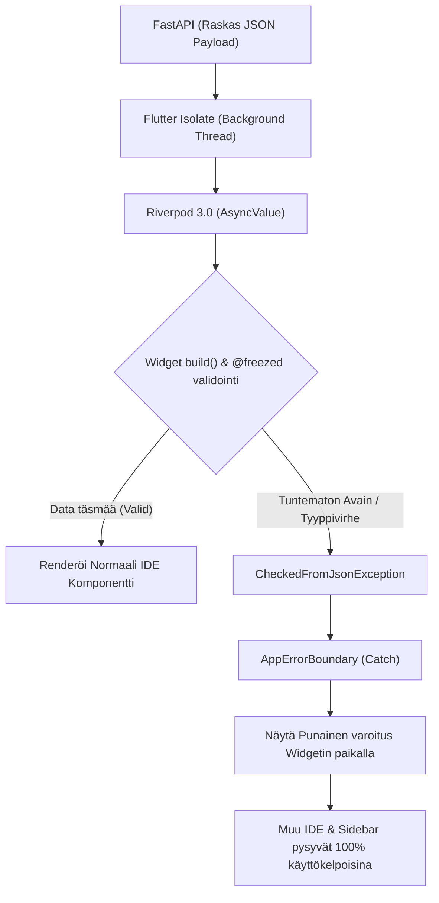

# 06: Flutter Frontend (V5.2 Desktop-First)

Cognitive Quorum V2:n käyttöliittymä (client_app_v2) on rakennettu Flutterilla täysin **Desktop-First** (PC/Ultrawide) edellä. Kaikki logiikka on hajautettu tiukasti Riverpod 3.0:aan ja asynkronisiin Isolate-säikeisiin (Main Thread Jank Prevention). 

Yksi suurimmista arkkitehtuurisista paradigmoista on "**Zero-Math UI**": Käyttöliittymä tai Flutter-laitteen CPU ei saa koskaan laskea matemaattisia keskiarvoja tekoälyn datasta, vertailla numeerisia kynnyksiä saati päätellä teemavärien vaihtumisia. Tämä luottaa puhtaasti Backendin palauttamiin esipureskeltuihin `ReportLayoutDTO` -malleihin (Backend-For-Frontend konsepti).

## 1. Desktop-First Layout ja Ikkunointi

Järjestelmä on siirtynyt mobiilityylisestä koko ruudun selaamisesta täyteen IDE-kankaaseen (Integrated Development Environment).

1. **Reititys ja Kolmikerroksinen (Three-Pane) Ikkuna:** Yli 1200dp näytöillä reitin navigointi rakentuu staattisen Sidebarin (Moduulit), Master List -sivupalkin (Datat, suodatukset) sekä asynkronisen Detail Canvas -näkymän (Esim. ajonaikainen PDF-raportti) välille. Kapeammissa 600-1199dp ikkunoissa siirrytään TwoPane-malliin ja alle 600dp vapaan muotoiseen pinottuun navigaatioon.
2. **Infinite 2D Canvas:** Asiantuntijajärjestelmän työnkulkujen (DAG) tai matriisien konfigurointi hylkää yksittäiset listamuuttujat. **SystemInspector** luo `InteractiveViewer`in päälle äärettömän ruutupaperimaisen editorin, missä kaikki työnkulun Pydantic-solmut liikkuvat visuaalisesti x/y -avaruudessa. Objektin painaminen aukaisee kyseisten parametrien asetusnäkymän sivupalkkiin irroittamatta silmää verkon kokonaisuudesta.

## 2. Koodin Pariteetti ja Freezed-turva (Fail-Fast)

Frontend-mallien (Data Transfer Objects) pitää jatkuvasti vastata yksi-yhteen (`1:1`) Python Backendin uusia Pydantic V2 -muutoksia.
* **Code Generaatio:** Koodaus tapahtuu tiukalla `@freezed` (Dart) ja rakenteellisella `disallow_unrecognized_keys: true` -rajoitteella. Frontend perii kaatumisturvansa backendiltä – jos palvelin yrittää lähettää liikaa avaimia ("extra fields"), Flutter-koodi räjähtää mieluummin äänekkäästi käsiin sen sijaan että hiljaa ohittaisi mallin sisältörikkeet.
* **Pääsäikeen suojaus (Isolates):** Raskaiden Backendin tulostamien raporttien JSON-purku (Deseriliazation) ei saa missään tilanteessa vaikuttaa ikkunan päivitysnopeuteen (60FPS Frame Drop). Se on erotettu omaan säikeeseen käyttämällä rutiinia: `await Isolate.run(() => jsonDecode(chunk));`

## 3. Riverpod 3.0 ja Dynaaminen Reititys (SWR)

Sovelluksen arkkitehtuuri on hylännyt perinteisen `ChangeNotifier` -pohjaisen laiskan päivityksen siirtymällä 100% Riverpodin natiiviin käyttöön ja koodigeneraatioon (`@riverpod`).

* **SWR ja Nollalatenssi:** Raskaat tietokantanäkymät lukitaan muistiin SWR (Stale-While-Revalidate) -konseptin kautta (`ref.keepAlive()`). Käyttäjän peruuttaessa sivustolle, laite heittää heti ruutuun (0ms) viimeisimmän tunnetun version välimuistista. Jos dataa on muutettu tietokannassa, taustapäivitys ajaa uudet muutokset pehmeästi ruudun animoituun pintaan perässä.
* **Tilausreititys ja Muutokset:** Tallentamisoperaatiot hyödyntävät Optimistic UI:ta. "Loading"-ylipeittäviä spinner-lukkoja pidetään nykyaikaisessa desktop-apissa käyttöliittymävirheenä. Muutukset rekisteröidään dynaamisesti ja käyttäjät voivat jatkaa klikkailua taustaverkkopyynnön (`Mutation`) raahatessa mukana.
* **GoRouter Opaque ID:** Navigaatio rakentuu Stripe-tyyppisten Opaque ID:in päälle (`/admin/workflows/blk_abc123`). Reitteihin ei syötetä sisääntulevia `$extra` objektiparametreja, sillä kaikki näkymien tilat sidotaan näkymän omien ID-pohjaisten The Riverpod -providerien varaan estääkseen linkkien mätänemisen.

## 4. Single Source of Truth: UI Error Boundary

Arkkitehtuuri ei yritä enää piilotella ongelmaisia näyttöelementtejä kutsumalla varalla tyhjiä `SizedBox.shrink()` laatikkoita.

* Järjestelmä on kapseloitu globaaliin **AppErrorBoundary** -verkkoon.
* Mikäli yhden tietyn visuaalisen laatikon tai komponentin data (esim. yksittäisen LLM-hookin vastaussääntö) puuttuu tai on korruptoitunut (`CheckedFromJsonException`), laite eristää yksittäisen widgen punaisilla katkoviivoilla korostettuun virhelaatikkoon. Koko muu IDE (sivupalkki, näkymät ja tallennuspainikkeet) pysyy aktiivisena, samalla kun Backendin oma ilmoitus (RFC 7807) tulostuu komponentin sisältä suoraan kehittäjälle näkyville.
