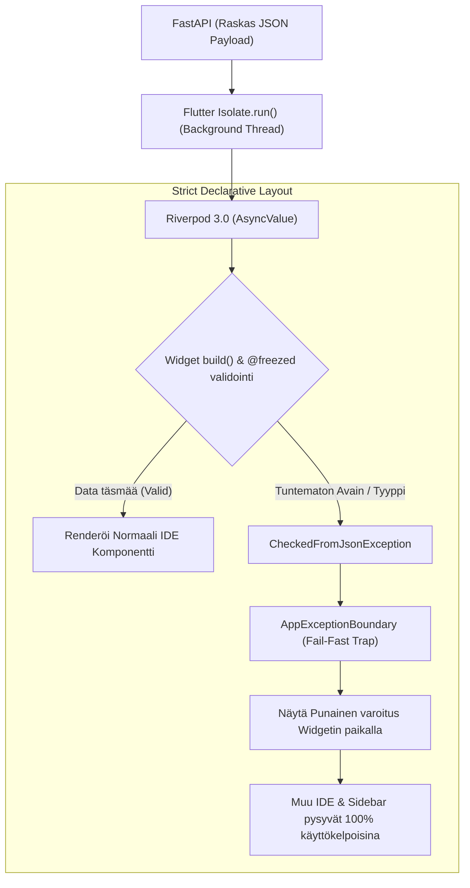

# 06: Flutter Frontend (V5.2 Desktop-First)

Cognitive Quorum -käyttöliittymä (client_app_v2) on rakennettu Flutterilla täysin **Desktop-First** (PC/Ultrawide) edellä. Kaikki logiikka on hajautettu tiukasti Riverpod 3.0:aan ja asynkronisiin Isolate-säikeisiin (Main Thread Jank Prevention). 

Yksi suurimmista arkkitehtuurisista paradigmoista on **SDUI (Server-Driven UI)** eli "**Zero-Math UI**": Käyttöliittymä tai Flutter-laitteen CPU ei saa koskaan laskea matemaattisia keskiarvoja tekoälyn datasta, vertailla numeerisia kynnyksiä saati päätellä teemavärien vaihtumisia. Tämä luottaa puhtaasti Backendin palauttamiin esipureskeltuihin `ReportLayoutDTO` -malleihin (Backend-For-Frontend konsepti). Kaikki kompleksinen esitystieto, kuten `MatrixObservabilityAccordion`, on täysin SDUI-ohjattua.

## 1. Desktop-First Layout ja Ikkunointi

Järjestelmä perustuu täyteen IDE-kankaaseen (Integrated Development Environment).

1. **Reititys ja Macro-Breakpoints:** Koodissa ei käytetä lokaalia `MediaQuery` purkkaa vaan joustavia Rust-Impeller Flexbox/Expanded sääntöjä ja pakotettuja 'Macro-Breakpoints' luokkia. Yli 1200dp näytöillä komponentit asettuvat Three-Pane Row -rakenteeseen (SideBar | MasterList | Canvas). Kapeammissa 800-1199dp ikkunoissa siirrytään Two-Pane malliin jne. Tämä estää nk. "MediaQuery Thrashing" ilmiön Ikkunan skaalauksessa.
2. **Infinite 2D Canvas:** Asiantuntijajärjestelmän työnkulkujen (DAG) tai matriisien konfigurointi hylkää yksittäiset listamuuttujat. **SystemInspector** luo `InteractiveViewer`in päälle äärettömän ruutupaperimaisen editorin, missä kaikki työnkulun Pydantic-solmut liikkuvat visuaalisesti x/y -avaruudessa. Objektin painaminen aukaisee kyseisten parametrien asetusnäkymän sivupalkkiin irroittamatta silmää verkon kokonaisuudesta.
3. **Horizontal Overflow Prevention:** Dynaaminen teksti (`Text`) ja pudotusvalikot (`DropdownButtonFormField`) pitää aina asettaa `Expanded` (tai vastaavan joustavan) wrapperin sisään. Tekstille asetetaan ehdottomasti `overflow: TextOverflow.ellipsis` ja pudotusvalikoille `isExpanded: true`. Tämä pakottaa Impellerin laskemaan typistyksen rajat ennen renderöintiä ja estää kohtalokkaat 'RenderFlex overflowed' -kaatumiset (kelta-mustat varoitusnauhat).
4. **Desktop Pro Tool Interaction:** Koska kyseessä on Desktop-luokan Pro-IDE, kaikki interaktiiviset elementit vaativat natiivin työpöytäkokemuksen. Paljaan `GestureDetector`in käyttö on kielletty ilman seuraavia: hiiren Hover-tilat (`SystemMouseCursors.click`), näppäimistöfokus (`FocusNode`) ja pikanäppäintuki (`Shortcuts`).
5. **Design Token Absolute Rule:** "Zero-Math" -säännön ohella kaikki "taikanumerot" ja kovakoodatut värit (esim. `EdgeInsets.all(16)` tai `Colors.blue`) ovat ehdottomasti kiellettyjä. Käyttöliittymän on nojattava 100% teemattuihin tokeneihin (esim. `AppSpacing.p16` tai `Theme.of(context).textTheme`).

## 2. Koodin Pariteetti ja Freezed-turva (Fail-Fast)

Frontend-mallien (Data Transfer Objects) pitää jatkuvasti vastata yksi-yhteen (`1:1`) Python Backendin uusia Pydantic V2 -muutoksia.
* **Code Generaatio & SafeCast:** Koodaus tapahtuu tiukalla `@freezed` (Dart) ja rakenteellisella `disallow_unrecognized_keys: true` -rajoitteella. Frontend perii kaatumisturvansa backendiltä – jos palvelin yrittää lähettää liikaa avaimia ("extra fields"), Flutter-koodi räjähtää mieluummin äänekkäästi käsiin sen sijaan että hiljaa ohittaisi mallin sisältörikkeet. Datan validoinnissa sovelletaan tiukkaa **SafeCast**-defensiivistä purkua tyyppiturvallisuuden varmistamiseksi.
* **Pääsäikeen suojaus (Isolates Main Thread Jank Prevent):** Raskaiden Backendin tulostamien raporttien (kymmenien tuhansien rivien) JSON-purku (Deseriliazation) ei saa missään tilanteessa vaikuttaa ikkunan päivitysnopeuteen (60FPS Frame Drop). Se on irroitettu pääsäikeestä omaan Background Isolateen käyttämällä rutiinia: `await Isolate.run(() => jsonDecode(chunk));`
* **Freezed When Ban & Natiivi Switch:** Vanhat `.when()` ja `.map()` funktiot on kielletty. Ne korvataan aina Dart 3:n natiiveilla `switch`-lausekkeilla (pattern matching / destructuring), mikä mahdollistaa kevyemmän ja tyyppiturvallisemman tilojen purkamisen.
* **Centralized Frontend Enums & No Raw String Mappings:** Backendin Pydantic-mallien Literal/String-kenttiä ei saa koskaan validoida IF-lauseilla tai manuaalisella `switch`:llä käyttöliittymässä. Kaikki järjestelmätason ja mallien kentät on keskitettävä Enum-luokiksi käyttäen yksittäisille kentille `@JsonValue()`-annotaatioita sijaintiin `core/models/enums.dart`. Tuntemattomat stringit saavat ja niiden pitää rikkoa parseri HETI, jotta vika saadaan kiinni AppExceptionBoundaryssä.
* **No-String Mandate:** V14.4 standardin mukaisesti raw-merkkijonojen käyttö UI-koodissa on ehdottomasti kielletty. Kaikki käyttöliittymän tekstit, kuten virheilmoitukset, sijaitsevat yksinomaan `.arb`-tiedostoissa (esim. `AppLocalizations.of(context)!.errorUnknown`).

## 3. Riverpod 3.0, Hookit ja Dynaaminen Reititys (SWR)

Sovelluksen arkkitehtuuri on hylännyt perinteisen `ChangeNotifier` -pohjaisen laiskan päivityksen siirtymällä 100% Riverpodin natiiviin käyttöön ja koodigeneraatioon (`@riverpod`). Vanhanaikaisten manuaalisten providereiden käyttö on kielletty muistivuotojen estämiseksi.

* **SWR ja Nollalatenssi:** Raskaat tietokantanäkymät lukitaan muistiin SWR (Stale-While-Revalidate) -konseptin kautta (`ref.keepAlive()`). Käyttäjän peruuttaessa sivustolle, laite heittää heti ruutuun (0ms) viimeisimmän tunnetun version välimuistista. Jos dataa on muutettu tietokannassa, taustapäivitys ajaa uudet muutokset pehmeästi ruudun animoituun pintaan perässä.
* **O(1) Lists (Suorituskyky):** Massiivisten tietorakenteiden (kuten kymmenien tuhansien DAG-solmujen) kohdalla vältetään Riverpodin O(N²) listojen syvävertailujäätyminen (deep equality block). Ratkaisuna käytetään natiiveja Dart `List<T>` -rakenteita ohittamalla syvävertailu direktiivillä `@Freezed(equal: false)`.
* **Riverpod Read vs Watch:** Komponenttien `build()`-metodin sisällä on pakollista käyttää ainoastaan `ref.watch()`-metodia tilan kuuntelemiseen. Vastaavasti tapahtumakäsittelijöissä (esim. `onPressed`) on käytettävä ainoastaan `ref.read()`-metodia komentojen suorittamiseen. Tämä eristää täysin visuaalisen päivityssilmukan ja sivuvaikutukset toisistaan.
* **Transient Input State:** Näppäinpainallusten välitön lähettäminen Riverpodiin jokaisella lyönnillä on kielletty, jotta vältetään kankaan turhaan uudelleenpiirtämisen estämiseksi raskaat uudelleenrenderöinnit. Sen sijaan reaaliaikainen tilanhallinta puskuroidaan lokaalisti `flutter_hooks`-kirjaston avulla (`useTextEditingController`). Data ammutaan Riverpodiin vasta käyttäjän tallentaessa/vahvistaessa syötteen.
* **Tilausreititys, Muutokset ja Mutation Optimistic UI:** Tallentamisoperaatiot hyödyntävät Optimistic UI:ta. "Loading"-ylipeittäviä spinner-lukkoja pidetään nykyaikaisessa desktop-apissa käyttöliittymävirheenä. Tilamuutokset peilataan HETI ruudulle "Riverpod 3.0 Mutation" -paradigman kautta, jolloin käyttäjät voivat jatkaa työskentelyä taustaverkkopyynnön (`Mutation`) vielä ollessa käynnissä. Järjestelmässä on kuitenkin oltava aina ns. "Graceful Rollback" (tilan palautus esim. `ref.invalidate()`) sekä käyttäjälle annettava huomautus siltä varalta, että operaatio epäonnistuu palvelimella.
* **GoRouter Opaque ID:** Navigaatio rakentuu Stripe-tyyppisten Opaque ID:in päälle (`/admin/workflow/edit/:id/:slug`). Reitteihin ei syötetä sisääntulevia `$extra` objektiparametreja (esim. koko datamallia routen argumenttina), sillä kaikki näkymien tilat sidotaan näkymän omien ID-pohjaisten Riverpod-providerien varaan estääkseen linkkien mätänemisen.

## 4. Single Source of Truth: UI Error Boundary

Arkkitehtuuri ei yritä enää piilotella ongelmaisia näyttöelementtejä kutsumalla varalla tyhjiä `SizedBox.shrink()` laatikkoita. Koodissa on täysi kielto (`SizedBox.shrink on kielletty`) virheiden hiljaiseen ohittamiseen (poikkeuksena tyhjät listat tai puuttuvan vapaaehtoisen datan ehdollinen renderöinti, missä sen käyttö on edelleen sallittua).

* Järjestelmä on kapseloitu globaaliin **AppExceptionBoundary** -verkkoon (toteutettu tiedostossa `core/error/app_error_boundary.dart`).
* Mikäli yhden tietyn visuaalisen laatikon tai komponentin data (esim. yksittäisen LLM-hookin vastaussääntö) puuttuu tai on korruptoitunut (`CheckedFromJsonException`), laite eristää yksittäisen widgen punaisilla katkoviivoilla korostettuun virhelaatikkoon. Koko muu IDE (sivupalkki, näkymät ja tallennuspainikkeet) pysyy aktiivisena, samalla kun Backendin oma ilmoitus (RFC 7807) tulostuu komponentin sisältä suoraan kehittäjälle näkyville.
* **Graceful Network Degradation:** Dataparserin virheet kaatavat sovelluksen tietoisesti punaiseksi laatikoksi suojatakseen muistivuodoilta, mutta **puhtaita tietoverkkovirheitä** (kuten `SocketException`, HTTP 500/503) ei saa kaataa AppExceptionBoundaryyn. Ne otetaan kiinni alemman tason rajapinnoissa, ja Riverpod ohjaa käyttöliittymän turvallisesti vain tilapäiseen lataus-, uudelleenyhdistämis- tai virhetilaan tuhoamatta käyttäjän jo syöttämää paikallista dataa.

## 5. Keskeinen Hakemistokartta ja Komponentit

Koska Client nojaa tiukasti ominaisuuspohjaiseen rakenteeseen (Feature-First), kriittiset näkymät on jaettu seuraavasti:
* **`features/execution/views/`:** Vastaa työnkulkujen ajonaikaisesta esittämisestä ja tulostuksesta (SDUI). Sisältää 5 ydinruutua: `dashboard_view.dart`, `dynamic_start_screen.dart`, `execution_report_view.dart`, `execution_view.dart`, ja `new_execution_view.dart`.
* **`features/studio/views/`:** Pitää sisällään Admin Studion hallintatyökalut, ml. työnkulkujen rakentimen (DAG Editor: `workflow_builder_view.dart`) sekä V2-arkkitehtuurin mukaisen PromptBlock-editorin (`prompt_block_builder_view.dart`).
* **`core/error/`:** Sisältää järjestelmän tärkeimmät vikasietomekanismit, joista keskeisimpänä `app_error_boundary.dart` (AppExceptionBoundary).
* **`features/studio/views/widgets/xai/`:** SDUI-komponenttien koti, esim. `matrix_observability_accordion.dart`, joka huolehtii xAI-matriisien rakenteellisesta esittämisestä ilman lokaalia matematiikkaa.
