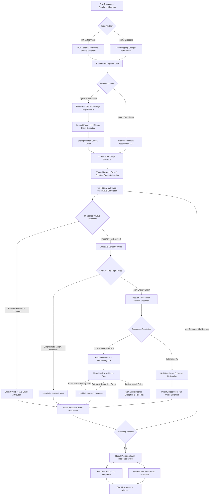

# Enriched Atom Graph Engine

## 1. Executive Summary
The **Enriched Atom Graph Engine** transforms unstructured textual documents and conversational transcripts into a causal, conditional Directed Acyclic Graph (DAG) of verified micro-claims (Atoms). By decoupling semantic extraction, causal dependency discovery, deterministic topological evaluation, and Server-Driven UI (SDUI) presentation, this capability eliminates model hallucinations, prevents the propagation of erroneous premises, and guarantees complete forensic traceability.

Through a structured pipeline incorporating two-pass map-reduce atomization, context-bounded causal linking, thread-isolated acyclic verification, wave-based topological evaluation adhering to the Local Causal Markov Condition, single-pass Best-of-Three Flash ensemble consensus with epistemic Null Hypothesis tie-breaking, tiered lexical anchoring against source evidence, and short-circuit cascade mechanics, the engine evaluates complex analytical propositions with mathematical rigor, high cache survival, and zero tolerance for statistical entropy.

## 2. Architectural Principles & Implementation

The Enriched Atom Graph Engine enforces causal determinism, evidentiary provenance, and architectural decoupling:

### 2.1. Two-Pass Map-Reduce Atomization & Global Ontology Extraction
Unstructured source documents undergo a two-pass extraction protocol that isolates global conceptual modeling from fine-grained semantic claims:
- **First Pass (Global Ontology Mapping):** Extracts all global entities, key actors, and document-wide macro-rules into a unified ontology map. This map resolves cross-chunk references, acronyms, and global business constraints across subsequent processing.
- **Second Pass (Local Chunk Claim Extraction):** Subdivides documents into deterministic text chunks and extracts fine-grained atomic propositions. Each proposition is contextualized by resolving anaphora and ambiguous pronouns against the global ontology map, producing standalone, self-contained claims. Claims derived from source evidence require verbatim textual quotes, while pure logical deductions explicitly flag deductive provenance, preventing uncited assertions from passing as empirical observations.

### 2.2. Context-Bounded Sliding Window Causal Linking
To establish causal relationships across extracted claims without exceeding model attention or context budgets, claims pass through an output-aware sliding window causal linker:
- **Bounded Window Subdivisions:** Partitions extracted claims into sliding windows with deterministic chunk overlaps. Oversized chunks exceeding atom thresholds are dynamically subdivided prior to linking.
- **Causal Edge Inference:** Identifies conditional dependencies between claims across adjacent and overlapping windows. Each discovered edge specifies a directional dependency from parent to child, accompanied by chain-of-thought rationale and an expected parent execution status required to unlock downstream evaluation.
- **Deduplication & Union:** Discovered edges across overlapping windows are merged into a unified causal graph, eliminating redundant links while preserving full multi-path dependencies.

### 2.3. Wave-Based Topological Evaluation & Local Causal Markov Condition
Directed Acyclic Graph evaluation is orchestrated strictly through wave-based topological sorting (Kahn's Algorithm) rather than ad-hoc event waiting or unconstrained concurrent execution.
- **Local Causal Markov Factorization:** The joint evaluation of the graph factorizes strictly across causal parents:
  $$\mathcal{P}(A_1, \dots, A_n \mid \mathcal{D}) = \prod_{k=1}^W \prod_{A_i \in \text{Wave}_k} \mathcal{P}(A_i \mid \text{Parents}_{\mathcal{G}}(A_i), \mathcal{D})$$
- **Discrete Wave Dispatch:** Within each wave, every scheduled node possesses zero unresolved incoming dependencies relative to remaining un-evaluated nodes. Because all causal parents have completed evaluation and reached terminal states, nodes within the same wave are conditionally independent given their parent outcomes and document context. This enables sound, concurrent batch evaluation.
- **Sequential In-Degree Decrement:** Downstream child dependencies are updated only after the current wave finishes execution, advancing through subsequent waves until the graph reaches terminal resolution.

### 2.4. Deterministic Short-Circuit Cascades & Blame Assignment
When causal preconditions are violated, the topological engine short-circuits execution deterministically without invoking model calls:
- **Precondition Evaluation:** Before dispatching an in-degree zero node to model evaluation, its incoming edges are compared against the resolved states of its causal parents. If any parent fails to reach the expected status required by the edge, the child node is immediately short-circuited to a not-applicable status.
- **Blame Determinism:** Short-circuited nodes record the specific parent identifiers that triggered the cascade in their runtime state, providing clear diagnostic blame attribution in audit logs.
- **Error Propagation:** If a parent node resolves to a system error or blocked state, downstream children transition immediately to blocked, preventing downstream evaluation of corrupted or unresolvable causal branches.
- **Matrix Waterfall Soft-Penalties:** In structured evaluation matrices with soft scoring hierarchies, failing lower-level atoms apply proportional score penalty multipliers rather than abruptly aborting the entire evaluation branch, propagating continuous scoring adjustments downstream.

### 2.5. Thread-Isolated Graph Verification & Cyclic Deadlock Defense
Graph structures undergo pre-flight topological verification prior to wave execution:
- **Thread-Isolated Cycle Detection:** Cycle detection algorithms on the directional graph are offloaded to dedicated worker threads, ensuring heavy graph traversal never blocks the asynchronous event loop. Any participating nodes in detected cycles are marked with system errors, preventing infinite loops and event loop deadlocks.
- **Phantom Edge Quarantine:** If an edge references a parent identifier missing from the graph definition, the dependent child is isolated and assigned an unresolved dependency status, preventing missing-key runtime exceptions during traversal.
- **Stranded Node Resolution:** After all evaluable waves complete, any remaining pending nodes (such as nodes stranded behind cycles or unresolvable dependencies) are finalized with blocked statuses, ensuring that every node in the graph reaches an explicit terminal state.

### 2.6. Extractive Sensor Service & Deterministic Pre-Flight Evaluation
Micro-claim evaluation is managed by the extractive sensor service, enforcing a zero-reasoning principle on syntactic anchors:
- **Deterministic Syntactic Pre-Flight:** Evaluates deterministic rules (such as literal keyword presence, negative phrase absence, and structural formatting checks) directly against source text before or without model invocation.
- **Fuzzy Anchoring with Locale Sensitivity:** Syntactic anchor checks tolerate minor optical character recognition (OCR) artifacts and typographical errors through language-tuned fuzzy matching thresholds while requiring strict matching on short substrings.
- **Bypass of High-Cognitive Steps:** When pre-flight deterministic rules definitively confirm or refute a claim, the result is recorded immediately, preserving model invocation budgets and execution latency.

### 2.7. Best-of-Three Flash Ensemble & Epistemic Null Hypothesis Tie-Breaking
For high-entropy analytical evaluations and structured matrix blocks, the sensor service executes a single-pass parallel Best-of-Three Flash ensemble:
- **Structured Parallel Dispatch:** Three independent evaluation calls are executed concurrently in a structured task group using lightweight, high-speed models.
- **Transient Error Tolerance:** Transient transport disconnects, rate limits, and service interruptions within individual ensemble calls are intercepted and tolerated without crashing the execution step. As long as the minimum consensus threshold of valid responses is met, evaluation proceeds normally.
- **Majority Consensus Resolution:** When two or more ensemble responses agree on a status, that outcome is elected as the definitive consensus, preserving the verbatim evidence quote from the first agreeing vote.
- **Epistemic Null Hypothesis Tie-Breaker:** In split or inconclusive votes (such as split outcomes across pass, fail, and error without a majority), ties are resolved deterministically using a pre-computed atom polarity map:
  - *Inverse Assertions:* When verifying the absence of an error, anti-pattern, or negative behavior, the lack of conclusive proof resolves to passed under the legal and epistemic presumption of innocence.
  - *Positive Assertions:* When verifying the presence of concrete action, compliance, or substantiating evidence, the lack of conclusive proof resolves to failed under the Null Hypothesis.
  - *Quote Hallucination Ban:* In all tie-broken resolutions, source evidence quotes are strictly set to null, guaranteeing that unverified quotes are never synthesized or adopted from minority dissents.

### 2.8. Tiered Lexical Validation & Exact Forensic Quote Anchoring
All evidence quotes extracted by models undergo strict, multi-tiered lexical verification against the source document to eliminate quote hallucinations:
- **Primary Gate (Exact Lexical Search):** Normalizes source text and candidate quotes (removing diacritics, punctuation, HTML tags, and whitespace variance while recording original character offsets) and executes exact substring search. An exact match is accepted immediately with zero fuzzy distortion.
- **Entropy Gate (< 10 Characters):** Quotes shorter than ten characters require 100% exact substring matching; fuzzy matching is strictly banned to prevent single-word false positives.
- **Controlled Fuzzy Fallback (>= 10 Characters):** Permitted only when the primary gate fails, the quote exceeds ten characters, and strictness configuration allows tolerance for OCR artifacts or morphological inflections. Contiguity algorithms are applied to short phrases, while token-set comparisons handle longer multi-line sentences.
- **Null Hypothesis Guardrail:** If an atom evaluates to a failed status or activates a contextual override, any associated evidence quotes are stripped and set to null, preventing audit trails from presenting citations for refuted or overridden claims.
- **Immutable Evidence Preservation:** Validated evidence quotes are treated as immutable legal records. Text budgeting, truncation, and sentence-boundary trimming are applied strictly to synthesized editorial text, never to verbatim forensic quotes.

### 2.9. Attention Anchoring & Deterministic Alias Isolation
To protect model context windows from token bloat and prevent attention dilution, raw 32-character system identifiers are isolated from model prompts:
- **Deterministic Alias Compilation:** The prompt engine translates physical atom identifiers and document paths into compact, indexed aliases (such as `a0`, `a1` for claims and `doc0`, `doc1` for sources).
- **Service-Layer Hydration:** Models output structured results referencing these concise aliases. Upon receipt, the service layer validates the returned aliases against the active alias registry and hydrates them back to their authoritative system identifiers before updating graph states. Unrecognized aliases trigger immediate validation exceptions.

### 2.10. Multi-Channel Conversational Ingress & Geometry Extraction
Conversational inputs and meeting transcripts enter the system through a multi-channel ingress architecture that handles heterogeneous modalities:
- **PDF Vector Geometry Channel:** Ingests document attachments and conversation transcripts in PDF format. Using vector drawing analysis and geometric bounding-box evaluation, the extractor detects speech bubbles, identifies sender alignment (distinguishing participant channels by coordinate layout), extracts speaker avatars and timestamps, and preserves chronological turn sequencing. If a document does not contain visual conversation geometry, it falls back to structured markdown prose extraction.
- **Clipboard & Text Ingress Channel:** Processes raw pasted transcripts by stripping system prompts, UI fluff, copy buttons, and timestamp artifacts. A fast-path regular expression engine detects conversational turn patterns, falling back to lightweight model-based boundary slicing when formatting is highly irregular. Both channels output standardized dialogue turn structures.

### 2.11. Context-Enriched Dual-Path Execution (Regular vs Matrix TDA)
The engine supports two distinct operational modes tailored to evaluation context:
- **Dynamic Extracted TDA:** Used for open-ended documents where claims, entities, and causal relationships are dynamically extracted and linked via the sliding window linker.
- **Predefined Matrix Assertion TDA:** Used for structured compliance and evaluation matrices. Assertions are predefined in the database ontology, preserving authoritative identifiers throughout execution. Because matrix assertions represent independent evaluation criteria, sliding window linking is bypassed, and assertions map directly into independent topological evaluation nodes.
- **Enriched Static Context Caching:** Both paths construct a static-first context container containing all verified facts, entity maps, and source text. Positioning static context at the prefix guarantees high context-caching efficiency across parallel model calls.

### 2.12. Result Projection & Server-Driven UI Decoupling
The graph engine maintains strict structural decoupling between internal execution states and presentation layers:
- **Topological Flattening:** The result projector applies Kahn's topological sort to the evaluated graph, projecting dynamic execution states into a sequential array of lightweight evaluation result DTOs.
- **Reference Offloading:** Static evidence (such as resolved claims, verified source quotes, chunk identifiers, and chronological sequence indices) is segregated into an independent reference dictionary keyed by atom identifier.
- **Zero Nested Tree Complexity:** By separating flat dynamic execution results from static hydrated references, presentation adapters and client renderers consume normalized, non-redundant payloads. This eliminates complex nested tree traversal and guarantees complete semantic parity across interactive user interfaces and static document exports.

## 3. Logical Data Flow

