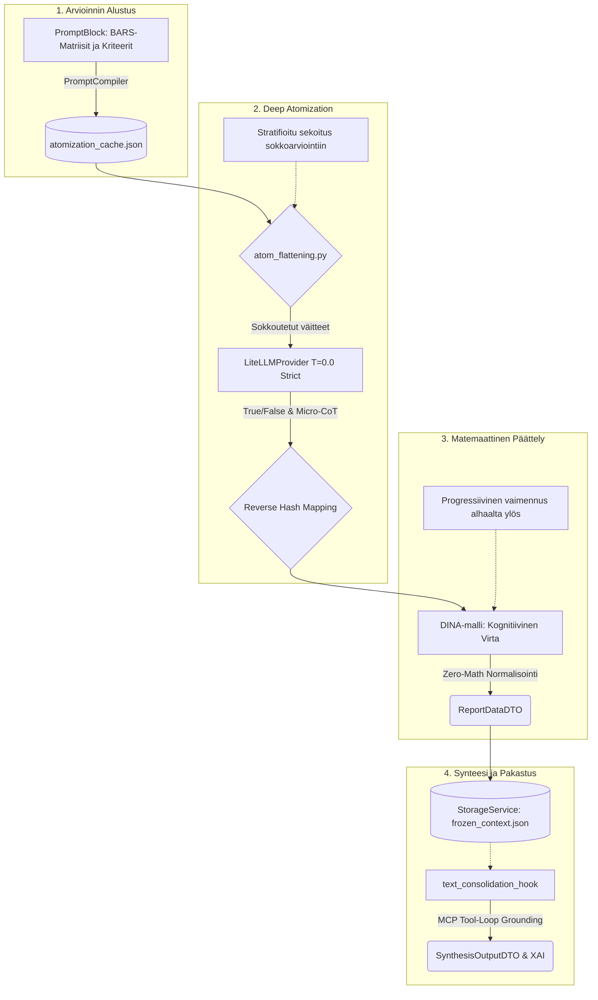
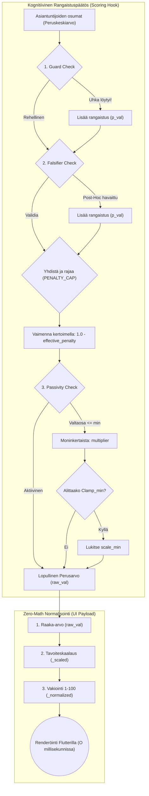

# 09: Kognitiivinen Arviointiarkkitehtuuri ja Pisteytys (DINA-malli)

Tämä luku kuvaa asiantuntija-arviointijärjestelmän ydintä, jonka vastuulla on purkaa laajoja aineistoja mitattaviksi subatomisiksi yksiköiksi ("Deep Atomization") ja muuntaa ne matemaattisesti jatkuviksi, vikasietoisiksi arvosanoiksi (Cognitive Diagnostic Dampening). Järjestelmä on toteutettu Universal Quality Gate -vaatimusten mukaisesti, noudattaen ehdotonta Pydantic Fail-Fast -protokollaa, RFC 7807 virheenkäsittelyä ja Zero-Math UI -mandattia.

## Arkkitehtuurin Yleiskuva (Mermaid Visualisointi)

Alla oleva vuokaavio kuvaa kognitiivisen arviointimoottorin datavirran aina holististen asiakirjojen atomisoinnista lopulliseen Zero-Math normalisointiin ja XAI-synteesiin saakka:

## 1. Miten Atomisoidut Väitteet Syntyvät?

Järjestelmän arviointi luottaa atomisaatioon, missä matriisin kriteerit on valmiiksi pureskeltu pienimpiin mahdollisiin logiikkayksiköihin.

**Pydantic-mallinnus ja Deterministinen TDA-Seeding:**
Arviointiohjeistukset perustuvat nykyään asiantuntijoiden valmiiksi kirjoittamiin `TDAAssertion` (Test-Driven Assertion) -sääntöihin, jotka ladataan suoraan `seed_data.json` -tiedostosta ilman lennosta tapahtuvaa AI-atomisointia. `PromptAtomizer` on täysin riisuttu LLM-riippuvuuksista, ja se tuottaa ajon aikana asiantuntijoiden `TDAAssertion`-säännöille ainoastaan satunnaiset, kryptografiset Opaque Stripe ID:t (esim. `tda_a1b2c3d4`). Aiempi tekoälyllä suoritettu "Deep Atomization" -vaihe ja sen purkkavirityksenä toiminut `atomization_cache.json` on tuhottu (Epic 48). Tämä takaa absoluuttisen matemaattisen determinismin ja täydellisen Fail-Fast -yhteensopivuuden.

### TDA-väitteiden Optimaalinen Lukumäärä (Matemaattinen Triangulaatio)
Järjestelmän lainsäädäntö pakottaa jokaiselle arviointisolulle **tasan kolme (3)** toisistaan riippumatonta (MECE) TDA-väitettä. Tämä arkkitehtuurinen rajoite on matemaattinen ja taloudellinen "sweet spot", joka perustuu kolmeen tieteelliseen pääperiaatteeseen:

1. **Psykometria ja Spearman-Brownin ennusteyhtälö (Diminishing Returns):** 
   Jos yhden säännön luotettavuus on 70 %, nostamalla sääntöjen määrä yhdestä kolmeen, luotettavuus hyppää Spearman-Brownin kaavalla 87,5 prosenttiin (+17,5 %). Jos sääntöjen määrä nostetaan kolmesta viiteen, luotettavuus paranee enää n. 92 prosenttiin (+4,5 %).
2. **Informaatioteoria (Shannonin Entropia):** 
   Yli kolmen säännön kirjoittaminen samalle asialle johtaa semanttiseen saturaatioon. Säännöt 4 ja 5 korreloivat vahvasti ensimmäisten sääntöjen kanssa (redundanssi), eivätkä siten tuo järjestelmään aitoa uutta informaatiota.
3. **LLM Attention Dilution ja Ristikontaminaatio:** 
   Nykyaikaiset kielimallit perustuvat Transformer-arkkitehtuurin Self-Attention -mekanismiin. Jos malli pakotetaan arvioimaan tekstiä viidellä toisiaan muistuttavalla säännöllä, sääntöjen vektorit menevät mallin kognitiossa päällekkäin. Malli laiskistuu ja alkaa ristikontaminoida tuloksia (esim. poimii saman `exact_quote` -lainauksen usealle eri säännölle), jolloin teoreettinen parannushyöty katoaa täysin.

Siirtyminen kolmesta säännöstä neljään tai viiteen nostaisi tekoälyn Output-tokenien generointikustannuksia ja latenssia (viivettä) lineaarisesti 33–66 %, mutta parantaisi laatua vain marginaalisesti ja altistaisi mallin kognitiiviselle sekaannukselle. Siksi kolme sääntöä muodostaa kompromissittoman, tiedepohjaisen standardin.

### Tasokohtainen Atomien Kertolasku (Dynamic Atom Aggregation)
Järjestelmän litteiden osumien kokonaismäärä (Denominator / Total Atoms) vaihtelee dynaamisesti arvosteluskaalojen (esim. T1 vs. T5) välillä. On arkkitehtuurinen välttämättömyys, että "läpikäytyjen atomisoitujen väitteiden määrä" ei ole kaikilla tasoilla sama.

Tämä vaihtelu on täysin deterministinen ja syntyy suoraan tietokantakonfiguraation ja Map-Reduce -lohkomisen tulosta:
1. **Vaatimustason kasvava ankaruus:** Kohdetta arvioitaessa, ylemmille huipputasoille (T4, T5 - Erinomainen) on matriisiin tyypillisesti konfiguroitu huomattavasti enemmän mikroväitteitä (`claims`) kuin perustasoille (T1, T2 - Heikko). Korkean laaduntason todistaminen vaatii kognitiivisessa mittauksessa laajemman joukon ehtojen samanaikaista täyttymistä.
2. **Kertautuminen Map-Reduce-palasissa:** Lopullinen sokeiden osumien maksimimäärä, jonka tekoäly tuottaa yhdelle Matrix-tasolle asynkronisen ajon aikana, on kaavalla: `Tasolle määritettyjen väitteiden lukumäärä x Map-Reduce -chunkkien lukumäärä`.

Jos esimerkiksi T1-tasolle on tietokannassa määritetty 3 ehtoa ja T5-tasolle 6 ehtoa, ja teksti aggregoituna pilkotaan 15 analyysipalaan, T1:stä syntyy lennosta 45 atomia (3x15) ja T5:stä 90 atomia (6x15) tekoälyn pureskeltavaksi. Luku heijastaa suoraan kyseisen tason kognitiivista vaativuustasoa arviointihetkellä.

## 2. Deep Atomization (Syvä Atomisaatio asynkronisessa ajossa)

Perinteinen LLM-pohjainen lausuntojen arviointi kykenee harvoin tuottamaan tiukkoja, luotettavia arvosanoja. Järjestelmä ratkaisee tämän pilkkomalla arvioinnin suoritusvaiheessa:

1. **Rajoittamaton Otanta ja Globaali Sokkosekoitus (Runtime Flattening):**
   Välttääksemme LLM:n rakenteellisen ennakkoasenteen (Hierarchy Bias), kaikki atomit viedään `atom_flattening.py` -hookkiin. Epic 23:n myötä olemme poistaneet keinotekoiset otantarajoittimet (kuten `STRATIFIED_3`), asettamalla globaaliksi vakioksi `SystemConcurrency.MATRIX_SAMPLING_LIMIT = 0` (ALL). Tämä mahdollistaa teoriassa rajattoman kysymysmassan sisäänluvun. Jos satunnaisotantaa poikkeuksellisesti vaaditaan (arvo > 0), haku ohjautuu deterministisesti:
   - **Skaalan sisäinen satunnaistus:** Otanta käyttää kryptografista siemenlukua muodossa `secure_seed = f"{state.execution_id}_{block.id}_scale_{scale.score}"`.
   - **Globaali sokkosekoitus:** Lopullinen atomilistan globaali sokkosekoitus purkaa data-alkiot täysin epäjärjestykseen sokeuttaen tekoälyn. Sekoitus sidotaan suorituksen globaaliin siemenlukuun `state.execution_id`.
   (Lähde: backend_v2/hooks/atom_flattening.py, funktio: process_matrix_flattening)
2. **Asynkroninen Map-Reduce Orchestration (ChunkingService):**
   Jotta satojen kysymysten yhtäaikainen sokea arviointi ei johtaisi Timeout/429 Rate Limit -kaatumisiin tai json-skeeman rikkoutumiseen LLM:n muistin loppuessa (Token Explosion), `LLMNodeStrategy` suorittaa Map-Reduce -operaation. Massiivinen kysymyslista luovutetaan `ChunkingService`-komponentille, joka pilkkoo sen turvallisiin Opaque Stripe ID -suojattuihin osiin (`SystemConcurrency.LLM_MAX_CHUNK_SIZE`-sääntöjen mukaisesti). Palikat ajetaan vahvasti rinnakkain `asyncio.TaskGroup` ja `Semaphore` -varmistuksin. Lopulta erilliset rakenteelliset vastaukset parsitaan takaisin yhtenäiseksi `List[FlattenedAtomResult]` -paketiksi täydellisellä 1:1 osumatarkkuudella.
3. **Eristetty Runtime AI (T=0.0) ja Suoritusjärjestyksen Merkityksettömyys:**
   LLM suorittaa kunkin Map-Reduce -lohkon arvioinnin tiukassa "Strict Mode" -tilassa nollalämpötilalla (`temperature=0.0`), missä `LiteLLMProvider` vaatii koodilta absoluuttisesti TPM/RPM-rajoitusten määrittämistä. Tämä eristäminen poistaa aiemman arkkitehtuurin "huomiokyvyn harhautumisen" (Attention Drift): koska jokainen kysymyslohko arvioidaan omana eristettynä DAG-solmunaan TDA-sääntöjen (Bounty Hunter) avulla, **kysymysten suoritusjärjestyksellä ei ole enää mitään vaikutusta LLM:n vastauksiin**. Järjestelmä on matemaattisen deterministinen. Jos Pydantic-validaatio epäonnistuu yksittäisessä chunkissa, arkkitehtuuri ei yritä "arvailla" fallback-arvoja (Zero-Fallback), vaan nostaa välittömästi RFC 7807 `AppException` -virheen (Fail-Fast).
4. **Three-State Logic ja MatrixReducer (O(N) Reduktio):**
   Koska atomit on pilkottu N-määrään asynkronisia chunkkeja, järjestelmä voi kohdata konfliktin: chunk A löytää osuman (PASSED), mutta chunk B ei löydä (FAILED). Matemaattinen tila reduktoidaan `MatrixReducer`in avulla noudattaen TDA-säännön `aggregation_mode`-attribuuttia:
   - `EXISTS`: Yksikin "PASSED" chunkkien välillä riittää koko säännön läpäisyyn (ANY(Passed) -> Passed). Muuten tutkitaan FAILED/DLQ -enemmistö.
   - `ALL_MUST_COMPLY`: Yksikin "FAILED" (tai DLQ) pudottaa koko säännön tilaan FAILED/DLQ. Kaikkien chunkkien on oltava puhtaasti "PASSED".
   DLQ (Dead Letter Queue) on kolmas tila, johon väite siirretään, jos se on teknisesti viallinen (esim. korruptoitunut lainaus), eikä sitä lasketa nimittäjään (Denominator) lopullisessa Compliance Scoressa.
4. **Paluu Rakennetilaan ja Käänteinen Hajautus (Reverse Hash Mapping):**
   Kun kaikki asynkroniset LLM-palat on suoritettu ja vastaukset (True/False & Micro-CoT -perustelut) on sulatettu massiiviseksi yhteiseksi Boolean-listaksi, asynkronisen moottorin on osattava palauttaa sokeat osumat takaisin alkuperäisiin matriiseihinsa ja vaatimustasoilleen. 
   Tämä ratkaistaan nojaten dynaamiseen **Ephemeral Runtime ID -mäppäykseen (In-Memory)**:
   - Aiemmin (V1) järjestelmä käytti lennosta generoitua MD5-tiivistettä tekstin perusteella ("Content-Addressable ID"). Tämä on nyt **ankarasti kielletty** (Epic 48: MD5 Hashery-Deprekaatio), sillä se aiheutti Hash Collision -haavoittuvuuksia samankaltaisilla kysymyksillä ja turhaa kryptografista kuormaa.
   - Pysyvien tietokanta-ID:iden generointi sadoille alikysymyksille paisuttaisi Seed-kantaa tarpeettomasti. Sen sijaan `atom_flattening.py` generoi suorituksen aikana jokaiselle litteytetylle väitteelle puhtaasti tilapäisen, sekventiaalisen tunnisteen (esim. `atom_1`, `atom_2` tai lyhyt ULID).
   - LLM palauttaa vastauksessaan yksinomaan tämän lyhyen ajonaikaisen tunnisteen yhdessä TRUEn tai FALSEn kanssa. Asynkroninen moottori käyttää O(1) muistihakemistoa (in-memory map) kohdistaakseen tulokset takaisin matriisin tasoille 100 % deterministisesti ilman törmäyksen vaaraa.

### Nollahypoteesi ja Antagonistinen Syyttäjä (Epic 27 Pydantic-puhdistus)
Jotta arviointi olisi matemaattisesti stabiili eikä altis tekoälyn mielistelylle (Sycophancy) tai ympäripyöreälle "Pydantic-skitsofrenialle" (tekoäly yrittää antaa pisteitä aiempien rakenteiden perusteella), kaikki arviointi nojaa **Nollahypoteesi-mandaattiin**. LLM toimi puhtaasti "Antagonistisena syyttäjänä":
* Jokaisen väittämän oletusarvo on aluksi `FALSE` ("Evaluate as FALSE").
* LLM kääntää atomin arvoksi `TRUE` ainoastaan, jos se kykenee poimimaan aineistosta eksplisiittisen, kiistattoman todisteen. 
* LLM:ltä on täysin riistetty kyky palauttaa itse valmiita numeerisia lukuja kuten jatkuvia kokonaisarvosanoja. Tämä logiikka (Zero-Math Payload) pienentää Map-Reduce -töiden palauttamia JSON-rakenteita kriittisesti, pysäyttäen raskaisiin Token-määriin liittyvät "Arq Worker Timeout" -ylikuormittumiset.

**DRY-Abstrahoitu Lainsäädäntö (`atom_flattening.py`):**
Vaikka arvioidut lauseet ovat nykyään deterministisiä `TDAAssertion`-sääntöjä (joita ei enää generoida tekoälyllä lennosta), itse asiantuntijatietokanta (`seed_data.json`) pidetään puhtaana toistuvista ja raskaista säännöistä. Nollahypoteesi on kovakoodattu puhtaasti taustajärjestelmän arviointiputkeen. Map-reduce -vaiheessa `atom_flattening.py` -hookki ohjelmallisesti "liimaa" absoluuttisen säännön (*ENFORCEMENT: Evaluate as FALSE immediately unless explicit, documented evidence is provided.*) jokaisen deterministisen `tda_assertion` -säännön perään lennosta. Tämä arkkitehtuuri takaa, ettei LLM pääse "irti hihnasta" arvioidessaan laajojakin sääntömassoja.

### Laajennuskäsittely ja Pydantic-purku (Extensions & Evaluations)
Asynkronisen moottorin suorittama datan jäsennys tapahtuu Zero-Compromise Pydantic V2 -hengessä. 
* **Laajennusten Tiukennus (`output_extensions`):** `PromptBlock` (blk_) `output_extensions` (kuten `scoring_matrix`, `tda_assertions`) luetaan tiukasti Pydantic-olioihin ajon aikana. Järjestelmä ei salli "graceful degradation" -tilaa: mikäli tekoäly palauttaa viallista dataa näiden laajennusten osalta, dataa ei hiljaisesti ohiteta `.get()` -purkalla tai pudoteta pois, vaan rajapinta nostaa virheen heti.
* **Evaluations Dict Parsing:** Myös `evaluations`-vastausten jäsentely on ehdottoman tiukkaa. Järjestelmä ei hyväksy löysää parserointia. Pienikin poikkeama mallinnetuista `tda_assertions` -kentistä kaataa asynkronisen kerroksen (RFC 7807), eikä oletuksena yritetä tarjota "tyhjää dictiä `{}`" pelastamaan LLM:n rakenteellista hallusinaatiota. Tällä taataan, että jatkolaskenta ei koskaan operoi korruptoituneella aineistolla.

## 3. Zero-Trust Pydantic Validation & Anti-Laziness Mandate (Epic 42)

Evaluointiarkkitehtuuri on kytketty "Zero-Trust" -kehikon taakse torjumaan LLM-mallien yleisimmät ongelmat: laiskuus, keksitty asiantuntijapuhe ja suorat hallusinaatiot.

### A. Alphabetical Keys Hack (Micro-CoT)
Tekoäly pyrkii usein luomaan päätöksen (`is_true: bool`) ensin, ja vasta sitten keksimään sille perustelut ("Post-Hoc Rationalization"). Tämä estetään arkkitehtuurissa pakottamalla LLM Pydantic `AtomResponse`-skeeman avulla tuottamaan päättelyketju tarkassa aakkosjärjestyksessä. Skeeman avaimet on nimetty fyysisesti numeerisin etuliittein:
1. `step_1_evidence_type`: Tekoäly valitsee evidenssin tason (`EXPLICIT_QUOTE`, `IMPLIED_INTENT`, `NO_EVIDENCE`).
2. `step_2_quote`: Suora, muokkaamaton lainaus materiaalista.
3. `step_3_implicit_justification`: Implisiittinen asiantuntijapäättely, jos suoraa lainausta ei ole.
4. `step_4_reasoning`: Vapaa asiantuntijaharkinta.
5. `step_5_boolean`: Vasta viimeisenä lopullinen päätös `is_true`.

Tämä "Alphabetical Keys" -mekanismi pakottaa automaattisen Attention-mekanismin lukemaan omat perustelunsa (step 1-4) ennen arvion (step 5) generoimista, mikä tutkitusti eliminoi laiskan oikaisun ja vahvistaa determinismiä.

### B. Anti-Laziness Pydantic Validations
Kun LLM palauttaa vastauksen, Pydantic V2 `@model_validator(mode='after')` tekee ankaran ristitarkastuksen suoritetun työnkulun ankaruustason (`strictness_level`) ja `validation_context` -objektin avulla:
* **Explicit Quote Check:** Jos `step_1_evidence_type` on `EXPLICIT_QUOTE`, järjestelmä vaatii, että `step_2_quote` on täytetty. Muutoin se hylkää vastauksen.
* **Physical Word-Count Blocker:** Jos näyttö perustuu implisiittiseen päättelyyn (`IMPLIED_INTENT`), järjestelmä estää "konsulttipuheen" asettamalla fyysisen sanamäärärajan (esim. vähintään 20 sanaa). Jos selitys on laiska (esim. "Perustuu rivien välistä luettuun dataan"), Pydantic nostaa `ValueError` -virheen.
* **Strictness Threshold (>= 70):** Mikäli työnkulun käyttäjä on asettanut ankaruustasoksi vähintään 70, `IMPLIED_INTENT` hylätään automaattisesti kokonaan. Tällöin vain `EXPLICIT_QUOTE` tai `NO_EVIDENCE` hyväksytään järjestelmään, mikä muuttaa koko tekoälyn laskennan armottoman faktapohjaiseksi auditointikoneeksi ilman tulkinnanvaraisuuksia.

## 4. Pisteytyslogiikka: Soft Scoring V3 (Lerp, Sigmoid, MAD) ja Kireystasot

Epic 47 myötä järjestelmä on siirtynyt kovan "Square Root Dampening" ja ehdottomien kynnysarvojen ajasta kohti **Soft Scoring V3** -arkkitehtuuria. Tämä uusi arviointimoottori eliminoi luonnottomat matemaattiset jyrkänteet (cliff effects) ja mahdollistaa joustavan mutta deterministisen kognitiivisen arvioinnin soveltamalla lineaarista interpolaatiota (Lerp), loogisia Sigmoid-käyriä ja MAD-pohjaista poikkeamien torjuntaa.

### Forensic Sovereignty ja Kaksinkertainen Pisteytys (Double Scoring)
Epic 47 irrotti matemaattisen pisteytyksen lopullisesti sidotusta suoritusvaiheesta (Execution) käyttäen "Forensic Sovereignty" -arkkitehtuuria. Vaikka tavoitteena on "Decoupling" (eriytetty pisteytys), järjestelmä suorittaa matemaattisen laskennan tietoisesti kahteen kertaan:

1. **DAG-vaiheen Baseline-laskenta (Historiallinen sormenjälki):** 
   Itse työnkulun ajon (Execution) yhteydessä `matrix_scoring_hook` tallentaa sokeat faktat (`level_breakdown`) ja suorittaa niille matemaattisen laskennan työnkulun sen hetkisellä *oletuskireydellä*. Tämä luo tietokantaan (`execution.step_states`) ikuisen "Baseline"-tuloksen. Tämän ainoa arkkitehtoninen tarkoitus on luoda ja säilöä rikas **XAI-loki (Explainable AI)**, joka sisältää tarkan matemaattisen selityksen siitä, miten tekoäly tuotti arvosanan reaaliajassa (esim. "Osuma-aste 0% -> Sovelletaan liukuvaa rangaistusta 0.85").
2. **Virtuaaliset Järjestelmäaskeleet ja Worker-synteesi (SSOT):**
   Kun lopullinen PDF- tai käyttöliittymäraportti luodaan, Arq Worker käynnistää asynkronisen virtuaaliaskeleen (esim. `sys_render_default`). Worker *ohittaa täysin* aiemmat Baseline-pisteet ja XAI-lokin. Se lukee vain muuttumattomat faktat (`level_breakdown`) ja suorittaa täysin uuden matemaattisen laskennan käyttäjän valitseman uuden `OutputProfile` -konfiguraation kireystasolla. Tämän uuden ajon luomaa XAI-lokia ei enää tallenneta, sillä loppukäyttäjälle tuotetaan vain matemaattisesti puhtaat, uuteen profiiliin perustuvat loppupisteet (Scorecard).

Tämä arkkitehtoninen "poikkeus" takaa, että tietokantaan ei synny datapaisumusta miljoonista eri XAI-lokeista jokaisen käyttäjän tekemän PDF-tulosteen yhteydessä, mutta säilyttää silti alkuperäisen auditoitavan matemaattisen jäljen devaajille. SSOT (Single Source of Truth) loppukäyttäjän esityskerroksessa on aina Workerin tuottama tuloste, joten arvot eivät voi mennä ristiin.

### Matemaattiset Moottorit (Mathematical Engines)

Arviointijärjestelmä sisältää neljä täysin Zero-Math UI -pariteettia noudattavaa laskentamoottoria, joiden toimintaa ohjaa dynaaminen **StrictnessConfig** (Kireystaso 0-100). Mitä korkeampi kireystaso, sitä vähemmän anteeksiantoa (forgiveness) järjestelmä antaa.

1. **Syväarvostelu (Progressive Dampening - DINA V3):** 
   Tämä moottori hyödyntää lineaarista interpolaatiota (Lerp) lieventääkseen alempien kognitiivisten tasojen puutteita (`effective_hit_rate = base_forgiveness + (hit_rate * (1.0 - base_forgiveness))`). Vaimennukseen sovelletaan kireystason perusteella dynaamista eksponenttia, jolloin täydellinenkään ylemmän tason suoritus ei voi kompensoida täysin murentunutta perustaa, mutta pisteet eivät romahda absoluuttisesti nollaan yksittäisen virheen takia.
2. **Koearvostelu (Soft Waterfall - Guttman V3):** 
   Tiukka compliance-moottori. Jos tavoitekynnys (threshold) alitetaan, järjestelmä ei enää lukitse koko pisteytystä "rikkinäisiin tikapuihin", vaan laskee vajauksen (`shortfall`) ja soveltaa **liukuvaa rangaistuskerrointa** (sliding penalty multiplier) kaikkiin myöhempiin tasoihin kaskadoituvasti.
3. **Painotettu Keskiarvo (Sigmoid Scaling):** 
   Laskee matriisin tason perusteella painotetun suhdeluvun ja skaalaa tuloksen ulos **Sigmoid (logistic) -käyrällä** (`raw_sigmoid = 1 / (1 + math.exp(-steepness * (hit_rate - midpoint)))`). Kireystaso liikuttaa Sigmoidin keskipistettä, jolloin tiukempi kireystaso vaatii eksponentiaalisesti puhtaampaa osumaprosenttia korkean arvosanan saamiseksi. Järjestelmä suorittaa täyden matemaattisen normalisoinnin absoluuttisten ääripäiden väliin.
4. **Lineaarinen Keskiarvo (MAD Outlier Rejection):** 
   Puhtaassa keskiarvossa järjestelmä on alttiimpi datapisteille, jotka heikentävät muuten vahvaa profiilia. Tämä moottori tunnistaa tilastolliset anomaliat hyödyntämällä **Median Absolute Deviation (MAD)** -menetelmää. Jos yksittäinen taso poikkeaa merkittävästi aggregaatin mediaanista (`hit_rate < median - 3.0 * MAD` ja `hit_rate < 0.30`), tason painoarvoa alennetaan (0.25x), suojellen näin kokonaisarvosanaa perusteettomilta romahduksilta.

### Kireystason Kalibrointi (Strictness Level 0–100)
Matemaattiset moottorit ovat armottomia algoritmeja, mutta tekoälyn kykyä "löytää" osumia säädetään dynaamisesti Kireystasolla. Kireystaso ohjaa myös Pydantic V2 -kerroksen validointia.

* **0–40 (Joustava / Flexible):** Tekoäly saa lukea rivien välistä (`IMPLIED_INTENT`). Malli löytää osumia helposti ja anteeksianto on korkea (Lerp forgiveness 1.0 - 0.6).
* **50 (Oletus / Balanced):** Objektiivinen kultainen keskitie. Vaatii usein suoraa lainausta, mutta sallii implisiittisen perustelun laadukkaalla CoT-ketjulla. Sigmoidin keskipiste on matemaattisessa ytimessä.
* **70–89 (Tiukka / Strict):** Pydantic hylkää implisiittiset tulkinnat. Vain eksakti lainaus (`EXPLICIT_QUOTE`) kelpuutetaan. Kognitiiviset vaimennukset ovat jyrkkiä ja anteeksianto on lähellä nollaa.
* **90–100 (Absoluuttinen / Absolute):** Nollatoleranssi virheille. Aktivoi `ANTI_SYCOPHANCY_MANDATE` -tilan.

### Empiirinen Esimerkki: Yhden Datan 4 Vaihdetta (The 4 Gears)
Järjestelmän arkkitehtoninen vahvuus on SSOT (Single Source of Truth) -mallissa, jossa tekoäly lukee dokumentin vain kerran ja tuottaa raa'an asiantuntijadatan (hits/total). Tämän jälkeen matematiikka ja kireystaso ("linssi") ratkaisevat lopullisen tuomion ja XAI-synteesin sävyn täysin dynaamisesti samasta datasta. Toukokuun 2026 testiajo (Sitra Supermegatrendit) todisti tämän:

1. **Koearvostelu + Ehdottomuus 100 ("Portinvartija"):** Fail-fast -logiikka karsi heikot tasot pois armotta. Arvosana romahti (44.40). Synteesi-LLM luki heikon arvosanan ja omaksui välittömästi armottoman auditoijan roolin, nostaen esiin keksityt päivämäärät ja hauraan logiikan.
2. **Syväarvostelu + Ehdottomuus 100 ("Ketjunheikkous"):** DINA-vaimennus etsi loogisen ketjun heikoimman lenkin ja kertoi koko rakennelman arvon lähelle nollaa (Arvosana 7.00). Tuloksena oli absoluuttinen hylkäys ja säälimätön Johdon Yhteenveto.
3. **Koearvostelu + Täysi Joustavuus 0 ("Aivoriihi"):** Läpäisykynnys laski pohjamutiin. Sama raakadata (jopa <50% osumia osassa matriiseja) riitti täydelliseen läpäisyyn (Arvosana 100.00). Synteesi-LLM sokeutui matematiikalle, antoi faktavirheet anteeksi ja kirjoitti puhtaan ylistävän valmennuspuheen.
4. **Painotettu Keskiarvo + Tasapainoinen 50 ("Kultainen Keskitie"):** Perustasojen osumia painotettiin enemmän, ja kireystaso poisti ääri-ilmiöt (Arvosana 64.20). Synteesi-LLM omaksui rakentavan konsultin roolin: se tunnusti vahvuudet, mutta käytti faktavirhettä (keksitty päivämäärä) *pedagogisena esimerkkinä* oppimiselle, ei rangaistusvälineenä.

Tämä todistaa, että **Synteesi-LLM reagoi dynaamisesti jälkikäteen laskettuun matemaattiseen arvosanaan**. Matematiikka ohjaa tekoälyn asennetta.

### Rangaistusmekanismit (Penalty Logic)

Järjestelmä alentaa kognitiivisen arviointimoottorin määrittämää perusarvosanaa erilaisten rangaistusten (Penalties) avulla. Rangaistukset toteutuvat tiukasti seuraavien sääntöjen ja metodien mukaisesti:

- **Turvallisuusuhat (Security Threat):** Järjestelmä tarkistaa suorituksen Guard-asteelta (Security Check), onko turvallisuusuhka havaittu (`threat_detected`). (Lähde: backend_v2/hooks/scoring.py, funktio: _extract_guard_flag)
  - Jos uhka on havaittu ja asetuksissa määritetty `scoring_security_penalty` on suurempi kuin nolla, kyseinen rangaistusprosentti (`p_val`) lisätään kokonaisrangaistuskertoimeen (`total_penalty_factor`). (Lähde: backend_v2/hooks/scoring.py, funktio: apply_scoring_logic_hook)

- **Jälkikäteisrationalisointi (Post-Hoc Rationalization):** Järjestelmä tarkastaa Falsifier- tai Panel-moduulin tuottamasta datasta `post_hoc_rationalization` -lipun, jolla testataan argumentoinnin pitävyyttä. (Lähde: backend_v2/hooks/scoring.py, funktio: _calculate_falsifier_penalty)
  - Mikäli lippu on aktiivinen ja asetuksissa määritetty `scoring_post_hoc_penalty` on suurempi kuin nolla, kyseinen rangaistusprosentti (`p_val`) lisätään kokonaisrangaistuskertoimeen (`total_penalty_factor`). (Lähde: backend_v2/hooks/scoring.py, funktio: apply_scoring_logic_hook)

- **Kaksinkertaisen rangaistuksen esto (Double Jeopardy Cap):** Kaikki yllä asetetut rangaistukset (Security, Post-Hoc) summataan yhteen ja rajataan maksimivähennykseen (`ScoringCalibrationThresholds.PENALTY_CAP`, esim. 25%). Vasta tämän jälkeen loppuarvosanaa pienennetään yhdistetyllä vaimennuskertoimella `(1.0 - effective_penalty)`. (Lähde: backend_v2/hooks/scoring.py, funktio: apply_scoring_logic_hook)

- **Passiivisuusrangaistus (Passivity Penalty):** Tuomaristomoduulin ("Judge" tai V2 Matriisi) tuottamia arvosanoja analysoidaan puutteellisten laatutasojen varalta. Jos minkä tahansa ulottuvuuden (dimension) saama arvosana on yhtä suuri tai pienempi kuin määritetty minimiarvo `scale_min` (oletus V2 matriiseille on 1.0), passiivisuusrangaistus aktivoituu. (Lähde: backend_v2/hooks/scoring.py, funktio: enforce_passivity_penalty_hook)
  - Rangaistuksen aktivoituessa, kokonaisarvosanaa (tai kyseisen matriisi-dimension osaarvosanaa) lasketaan kertomalla se asetusarvolla `multiplier` (`scoring_passivity_multiplier`). (Lähde: backend_v2/hooks/scoring.py, funktio: enforce_passivity_penalty_hook)
  - Puristussääntö (Safety Clamp): Mikäli laskettu uusi arvosana vaimennetaan niin pieneksi, että se alittaa sallitun minimiarvon `scale_min`, järjestelmä lukitsee eli puristaa tuloksen ehdottomaan alarajaan `new_score = scale_min`. (Lähde: backend_v2/hooks/scoring.py, funktio: enforce_passivity_penalty_hook)

#### Scoring Hook Pipelines (Mermaid Visualisointi)

Alla oleva vuokaavio konkretisoi edellä kuvatun matemaattisen Rangaistus- ja Normalisointilogiikan askel askeleelta, varmistaen Flutterin täydellisen Zero-Math pariteetin:

## 4. eXplainable AI (XAI), Audit Trail ja Agentic Grounding

Laskentamoottori hyödyntää MCP (Model Context Protocol) tool-calling -arkkitehtuuria yhdistääkseen laskut puhtaaksi, todistettavaksi ihmiskieliseksi XAI-tulkinnaksi.

**Kaksivaiheinen Agenttiarkkitehtuuri (Two-Pass Agentic Hook):**
Järjestelmä käyttää `text_consolidation_hook` -moduulia, joka suorittaa synteesin kahdessa vaiheessa:
1. **Tutkiva vaihe (`execute_tool_loop`):** MCP Tool-calling -ominaisuuksia hyödyntävä "ajattelu"-luuppi tekee tiedonhankintaa ja rakentaa Micro-CoT -päättelyketjut dynaamisesti luettuaan dokumentit/verkon asiasanoja.
2. **Rakenteistettu vaihe (Structured Output):** Vain onnistuneen tool-loopin jälkeen data pakotetaan tiukkaan `SynthesisOutputDTO` / `XAIOutputDTO` -skeemaan finalisointia varten.

**XAIOutputDTO -rakenne (Strictly Typed):**
Tekoälyn rakenteistettu XAI-synteesi pakotetaan seuraavaan Pydantic-malliin, jonka jokainen kenttä on pakollinen yhtenäisen laadun takaamiseksi:

- `executive_summary`: Korkean tason tiivistelmä (High-level summary).
- `verified_facts`: Synteesi todennetuista faktoista (Synthesis of facts).
- `cognitive_behavior`: Synteesi Profiler- ja Falsifier-moduulien löydöksistä (Synthesis of Profiler and Falsifier findings).
- `causal_chain`: Synteesi syy-seuraussuhteista ja Logician-moduulin havainnoista (Synthesis of Causal and Logician findings).
- `analysis_strengths`: Tunnistetut vahvuudet (Strengths identified).
- `analysis_weaknesses`: Tunnistetut heikkoudet (Weaknesses identified).
- `analysis_opportunities`: Tunnistetut mahdollisuudet (Opportunities identified).
- `analysis_recommendations`: Suositukset toimenpiteille (Recommendations).
- `final_verdict`: Lopullinen päätelmä (Final conclusion).
- `confidence_score`: Luottamusluku (0.0-1.0).

*Pydantic-validointi:* Kenttien oikeellisuus varmistetaan Pydanticin `@field_validator`-metodeilla (esim. `validate_non_empty`), jotka estävät ehdottomasti tyhjien tai puhtaasti välilyöntejä sisältävien merkkijonojen ohittamisen järjestelmään vikatilanteissa.
(Lähde: backend_v2/models/domain/xai.py, luokka: XAIOutputDTO)

Jokaista lasketun tuloksen taustaa varten luodaan ihmiskieliset lokit ja ne tallennetaan `frozen_context.json` -tiedostoon. Nämä perustelut ovat Native English Generation -säännön alaisia, minimoiden satunnaisen harhautumisen lokituksessa ja antaen käyttäjälle absoluuttista todistettavuutta tulosten synnystä.

## 5. UI Rendering ja Zero-Math Pariteetti

Graafinen käyttöliittymä (Flutter Client) on alistettu tiukkaan **Zero-Math sääntöön** koko tuotantoketjun pituudelta ottamalla käyttöön vikasietoinen "De-Generator" pattern.

Kaikki pistelaskennan desimaalit, normalisoinnit sekä tasojen kynnysarvojen suhteutus kootaan pelkästään Pythonin backendillä (esim. `ReportDataDTO` muotoon). Frontend olettaa aina saavansa valmiiksi arvoiltaan yhdenmukaistettua dataa, piirtäen graafiset hajontakuviot (esim. 3D Illusion Detector matrix) suoraan valmiiden matemaattisten tulosten ilmentyminä ohittaen tarpeen asiakaspohjaiselle matemaattiselle logiikalle kokonaan. 

**Backendin Datan Normalisointiprosessi (Valmistelu UI:ta varten):**
Data ratkaistaan kolmiportaisella rakenteella `normalize_matrix_scores_hook` -funktion sisällä:
1. **Alkuperäinen arvo (`raw_val`):** AI:n laskema alkuperäistulos (esim. DINA-vaimennuksen suora liukuluku).
2. **Suhteutettu arvo (`_scaled`):** Kustomoituun tavoiteskaalaan (esim. matriisin oma skaala) matemaattisesti suhteutettu lopullinen arvo.
3. **Normalisoitu arvo (`_normalized`):** Yhteismitallinen 1–100 vakioitu arvo (esim. 100-jakoinen prosenttiskaala), joka mahdollistaa jopa erilaisten alkuperäisskaalojen saumattoman graafisen vertailun.

*Zero-Math Mandaatti:* Tämä hook-arkkitehtuuri varmistaa sen, ettei UI:n (Flutter) tarvitse ikinä suorittaa liukulukulaskentaa (Floating point math). Backend tallentaa ja injektoi valmiiksi lasketut avaimet, kuten `[pb_id]_scaled` ja `[pb_id]_normalized`, lennosta suoraan valmiiseen payload-sanakirjaan. Jos Pydantic API rajoittaa ulostuloa tai data puuttuu, backend nostaa puhtaan `AppException` RFC 7807 Payloadin, jonka Flutter UI renderöi virhekomponenttina yhdellä askeleella.
(Lähde: backend_v2/hooks/scoring.py, funktio: normalize_matrix_scores_hook)

## 6. Tietorakenteet ja Tallennus (Storage & Persistence)

Arviointiarkkitehtuurin tilanhallinta ja datan tallennus on "Event Sourced" -yhteensopiva.

### A. TDAAssertion-säännöt (Konfiguraatio / Siemendata)
Deterministiset `TDAAssertion` -säännöt luetaan suoraan pysyvästä siemendatasta hakemistosta `backend_v2/seed/seed_data.json`. Aiempi tekoälypohjainen atomisointi ja sen vaatima `atomization_cache.json` on tuhottu, taaten ehdottoman arkkitehtuurisen pariteetin ja nopeat siemennysajot puhtaalla JSON-datalla (`run_seed.py local`).

### B. Raaka-arvioinnit ja True/False -tulokset (Suoritustila)
Tekoälyn tekemä sokea atomien arviointityö tallentuu prosessidatana paikallisesti kehityksessä `data/db_v2.json` -tiedoston `executions`-taulukkoon. Koska säilytämme raaan lokin (Execution Trace), jokaista `True/False` arviota (Micro-CoT) voidaan analysoida audit-loopissa jälkikäteen ilman toistoja.

### C. Lopulliset arvosanat ja XAI-perustelut (Output-tila)
Itse matemaattinen päättely (DINA-laskenta) muodostetaan vasta aivan lopuksi `scoring.py` -hookissa.
Lopulliset rakenteet paketoidaan ja pakastetaan `StorageService` (FileDriver) -rajapinnan läpi polkuun `data/files/executions/exe_{id}/frozen_context.json`. Asiakassovellus kykenee lukemaan valmiin UI-datan suoraan FileDriverin yli nanosekunneissa suorittamatta raskaita laskelmia, täyttäen Zero-Math säännön ja pitäen järjestelmän Opaque Stripe ID relaatiot puhtaina ja rikkoutumattomina.

### D. Matemaattinen Projektio ja In-Memory Renderöinti (Zero-Mutation Protocol)
Kun järjestelmä generoi lopullisia PDF-raportteja (`worker.py` / `generate_pdf_task`), se joutuu laskemaan tarkkoja dynaamisia matematiikka-arvoja (kuten `normalized_score` tavoiteskaalausta varten uudella kireystasolla). Aiemmin nämä arvot ylikirjoitettiin lennossa tapahtumalokiin, mutta tämä rikkoi "Append-Only" -periaatetta.

Nykymallissa kaikki dynaaminen uudelleenlaskenta on puhdas **In-Memory Projektio (Read-Only)**, mikä ratkaisee Append-Only ristiriidan:
1. **Historiallinen Koskemattomuus:** Alkuperäinen tietokannan `execution_trace` (joka sisältää Baseline-pisteet ja tekoälyn alkuperäiset perustelut) on ehdottoman lukittu ("Append-Only"). Datan ylikirjoittaminen (in-place mutation) on kielletty, jotta alkuperäinen historiallinen sormenjälki (Forensic Sovereignty) ei tuhoudu.
2. **Lennosta Lasketut DTO:t:** `BlueprintTransformer` lukee muuttumattomat "raakafaktat" (`evaluated_atoms`) ja suorittaa matemaattisen laskennan lennosta uuden Output Profilen kireystason läpi, luoden `ReportDataDTO`:n. Näitä lennosta laskettuja `normalized_score` -arvoja ei koskaan tallenneta takaisin tapahtumalokiin.
3. **Caching Eristys:** Vain raskas tekoälyn tuottama Markdown-synteesi välimuistitetaan tietokantaan, mutta sekin tallennetaan erilliseen `profile_syntheses` -sanakirjaan itse `ExecutionRecord` -juuritasolla, ei koskaan muokkaamalla tai ylikirjoittamalla menneitä `execution_trace` tapahtumia.

## 7. FinOps ja Token-hallinnan Arkkitehtuuri (Rate-Limit Resurssien Suojaus)

Kognitiivinen arviointimoottori käsittelee valtavia datamassoja (satoja atomeja per matriisi kerrottuna kymmenillä vaiheilla). Jotta LLM-malleille generoitava konteksti ei paisuisi liikaa ja laukaisisi API-toimittajien (esim. Vertex AI) `429 Resource Exhausted / Rate Limit` -rajoituksia, järjestelmässä on sisäänrakennettu älykäs **FinOps-kontekstikompressio**.

Kompressio suoritetaan rekursiivisen avaintenpoiston (stripping) avulla juuri ennen datan viemistä seuraavalle tekoälysolmulle. Toimintalogiikka noudattaa ehdottomasti mandaattia: *"Atomisoiduista kentistä LLM-kontekstiin välitetään vain true/false, mutta matriiseista ja prompteista välitetään rikkaat tekstikentät"*.

**Mekanismin ytimen toiminta:**
1. **Atomi-tason Kompressio:** Järjestelmä siivoaa dynaamisista ajotiloista LLM-solmulle lukukelvottomat ja hyödyttömät metadatat (esim. MD5 `atom_id`) sekä satojen kysymysten raskaat sanalliset Micro-CoT -perustelut (`reasoning`, `quote`). Myös raa'at sekoitetut kysymysmassat (`shuffled_atoms`) hävitetään varhaisilta askeleilta. `evaluations`-lista tiivistetään näin sadoista tuhansista merkeistä puhtaaksi ja kevyeksi totuusarvolistaksi (esim. `[True, False, True, ...]`).
2. **Matriisi-tason Syväanalyysin Säilytys:** Aggressiivisesta token-leikkurista huolimatta kaikki matriisien asiantuntijasolmujen (kuten Profiler, Falsifier) tuottamat laajat holistiset synteesit (esim. `reasoning_trace`, `evaluation_notes`, `step_3_logical_friction`) integroidaan koskemattomana. 

Tällä arkkitehtuurilla alemman tason "Zero-Trust" askeleet tuottavat valtavasti kovaa dataa, mutta huipulla toimiva XAI Reporter näkee vain datasta puhdistetun kokonaisanalyysin, jolloin se pystyy laatimaan täydellisen loppuraportin ilman token-tukehtumisen riskiä. (Lähde: `backend_v2/services/orchestrator/strategies/llm.py`)

## 8. Rakenteellinen Resilienssi (Self-Healing Deprekaatio ja Pydantic-Canonicalization)

Aiemmin järjestelmässä käytettiin "Self-Healing Citations" -heuristiikkaa (purkkaviritys, jossa `model_validator(mode="before")` yritti arvata ja korjata LLM:n lyhentämiä viitteitä lennosta regex-säännöillä). Tämä rikkoi arkkitehtuurin absoluuttista "Fail-Fast" ja "Zero-Trust" -periaatetta piilottamalla virheet, ja se on nyt **ankarasti kielletty ja poistettu koodista** (Epic 48).

**Nykymalli (The CPU Trap Resolution):**
Sen sijaan, että turvauduttaisiin epävarmaan regex-korjailuun tai siirrettäisiin validointia asynkronisiin Arq-jonoihin ("The CPU Trap"), lainausten ja viitteiden validointi tapahtuu 100 % synkronisesti Pydantic V2:n natiivissa C/Rust-kerroksessa (`@model_validator(mode='after')`). 

2. **Exact Match tai Fail-Fast:** Jos normalisoitu LLM-lainaus ei vastaa lähdettä tismalleen, Pydantic heittää välittömästi `ValidationError`in.
3. **Error Feedback Loop ja DLQ:** Arkkitehtuuri ei yritä enää hiljaisesti "parantaa" virhettä. Epäonnistuminen laukaisee automaattisen Error Feedback Loopin (LLM yrittää itse korjata virheensä `<ERROR>` -syötteen avulla). Jos atomi on pysyvästi rikki, se siirretään pragmallisesti DLQ-jonoon (Dead Letter Queue), jotta työnkulku etenee maaliin ilman ohjelman kaatumista.

### C. Kaskadoituva O(N) Anchoring (AnchorValidationService)
Epic 48 esitteli deterministisen kaskadiarkkitehtuurin (`AnchorValidationService`) täydentämään Pydantic-validointia ja estämään puhtaasti ohjelmallisten lainausvirheiden päätymisen DLQ:hun:
1. **O(N) RapidFuzz Anchoring:** Järjestelmä etsii eksaktia lainausta tekstistä nopealla fuzzy-match -algoritmilla (RapidFuzz), sen jälkeen kun molemmat tekstit on normalisoitu (NFKC, lowercase, regex `[^a-z0-9]`). Tämä on matemaattisesti deterministinen Fast-Path.
2. **Semantic Fallback Cascade (NLI):** Jos O(N) fuzzy-match epäonnistuu, kaskadi ei hylkää väitettä suoraan. Järjestelmä laukaisee halvan tason NLI-mallin (esim. GPT-4o-mini), jolta kysytään onko eristetty väite samaa tarkoittava PDF-kontekstin kanssa. Tämä pelastaa OCR-virheistä tai vahvoista lyhenteistä kärsivät tekstiosat DLQ-hylkäykseltä.

 

➡️ **Seuraavaksi:** Nyt kun matematiikka ja pisteytys on valmis, backendin työ on ohi. Siirry lukemaan [07_desktop_first_flutter.md](./07_desktop_first_flutter.md), joka kuvaa miten käyttöliittymä ottaa tämän kaiken vastaan Zero-Math UI -periaatteella.
