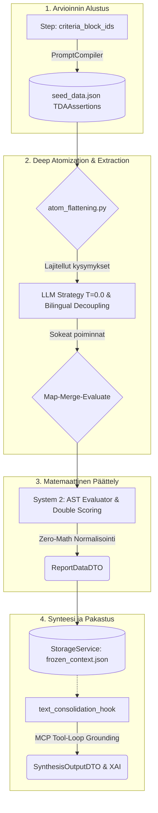
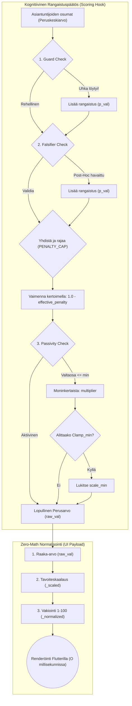

# 06: Kognitiivinen Arviointiarkkitehtuuri ja Pisteytys (DINA-malli)

Tämä luku kuvaa asiantuntija-arviointijärjestelmän ydintä, jonka vastuulla on purkaa laajoja aineistoja mitattaviksi subatomisiksi yksiköiksi ("Deep Atomization") ja muuntaa ne matemaattisesti jatkuviksi, vikasietoisiksi arvosanoiksi (Cognitive Diagnostic Dampening). Järjestelmä on toteutettu Universal Quality Gate -vaatimusten mukaisesti, noudattaen ehdotonta Pydantic Fail-Fast -protokollaa, RFC 7807 virheenkäsittelyä ja Zero-Math UI -mandattia.

## Arkkitehtuurin Yleiskuva (Mermaid Visualisointi)

Alla oleva vuokaavio kuvaa kognitiivisen arviointimoottorin datavirran aina holististen asiakirjojen atomisoinnista lopulliseen Zero-Math normalisointiin ja XAI-synteesiin saakka:



## 1. Miten Atomisoidut Väitteet Syntyvät?

Järjestelmän arviointi luottaa atomisaatioon, missä matriisin kriteerit on valmiiksi pureskeltu pienimpiin mahdollisiin logiikkayksiköihin.

**Pydantic-mallinnus ja Deterministinen TDA-Seeding:**
Arviointiohjeistukset perustuvat nykyään asiantuntijoiden valmiiksi kirjoittamiin `TDAAssertion` (Test-Driven Assertion) -sääntöihin, jotka ladataan suoraan `seed_data.json` -tiedostosta ilman lennosta tapahtuvaa AI-atomisointia. `PromptAtomizer` on täysin riisuttu LLM-riippuvuuksista, ja se tuottaa ajon aikana asiantuntijoiden `TDAAssertion`-säännöille ainoastaan satunnaiset, kryptografiset Opaque Stripe ID:t (esim. `tda_a1b2c3d4`). Aiempi tekoälyllä suoritettu "Deep Atomization" -vaihe ja sen purkkavirityksenä toiminut `atomization_cache.json` on tuhottu. Tämä takaa absoluuttisen matemaattisen determinismin ja täydellisen Fail-Fast -yhteensopivuuden.

**Decoupled TDA Semantic Extractor (Epic 56):**
Järjestelmä siirtyi V5-versioinnissa täydelliseen **Decoupled TDA** -arkkitehtuuriin. Tekoälyltä on **riistetty kognitiivinen tuomiovalta** kokonaan. LLM toimii sokeana semantteisena poimijana (N-Dimensional Semantic Extractor) palauttaen dynaamisen Pydantic-mallien tehtaan (`DynamicExtractionResponse` & `ExtractedFactsDTO`) luoman JSON-rakenteen säännön määlettelemien `facts_to_find`-kenttien perusteella. Lopullinen looginen Pass/Fail -arviointi suoritetaan 100 % deterministisesti Python-koodissa hyödyntäen whitelistattua **AST-arviointimoottoria** (`ast_evaluator.py`). Tämä eliminoi kognitiivisen päättelyvarianssin ja rationalisoinnin.

### Pearl's Rung 3 (Abduktiivinen Päättely) ja XML-Kääntäjä (`localization_compiler.py`)

Järjestelmä noudattaa Judea Pearlin kausaalisen päättelyn tikapuiden kolmatta tasoa (Rung 3: Counterfactuals / Abductive reasoning) arvioidessaan TDA-väitteitä. Jotta LLM ei eksy litteän tekstin rationalisointiin, `localization_compiler.py` kääntää `TDAAssertion`-säännöt tiukkaan XML-muotoon. Aiemman raa'an merkkijonon (`ai_rule_description`) sijaan väitteet injektoidaan LLM:lle tiukasti jäsenneltynä rakenteena:

```xml
<tda_validation>
  <anchor_target>Mitä ankkuria etsitään</anchor_target>
  <search_scope>paragraph</search_scope>
  <validation_rule>Varsinainen sääntö, joka datan on täytettävä</validation_rule>
</tda_validation>
```

Tämä rakenne pakottaa mallin suorittamaan arvioinnin kolmessa vaiheessa: 1) Etsi spatiaalinen ankkuri, 2) Rajaa konteksti, 3) Sovella sääntöä tähän rajattuun tilaan. Tämä on ehdoton vaatimus Pearl's Rung 3 -tason kausaalisen tarkkuuden saavuttamiseksi.

**TDA-väitteiden kohdistus ja Agnostic Matrices (Käyttäjän arvioinnin periaate):**
Cognitive Quorum -järjestelmän päätavoite on aina arvioida **käyttäjän suoritusta ja käyttäjän argumentointia** (eikä tekoälyä itseään). Aiemmin tämä ratkaistiin upottamalla kovat `BANNED SOURCES` -rajoitteet suoraan sääntöihin (TDA Assertions). Tämä kuitenkin sitoi matriisit tiukasti tiettyyn tietorakenteeseen. Nyt järjestelmässä on käytössä **Agnostic Matrices** -arkkitehtuuri:
1. **Matriisien Agnostisuus:** Kaikki kovat `target 'ai:' block` tai `BANNED SOURCES` -viittaukset on poistettu itse säännöistä. Matriisit ovat puhtaita, objektiivisia mittatikkuja ("mitä etsitään"), täysin riippumattomia siitä, *mistä* data tulee.
2. **Semantic Routing (Input-tason ohjaus):** Kohdistuslogiikka hoidetaan nykyään yksinomaan dynaamisesti **Input Configuration Level** -tasolla (`ai_description`). Esimerkiksi Keskusteluhistoriaa (`chat_log`) arvioitaessa järjestelmä injektoi säännön: `EXTRACTION_RULE: You MUST extract 'exact_quote' evidence STRICTLY from lines starting with "user:"`. Näin samaa puhdasta matriisia voidaan soveltaa sekä jäsennettyihin chat-logeihin että strukturoimattomiin PDF-dokumentteihin ilman arkkitehtonisia ristiriitoja.
3. **Muut lähtösyötteet (Esim. `reflection_text`, `product_text` jne.):** Näille syötteille riittää normaali oletusohjeistus, sillä koko dokumentti katsotaan jo valmiiksi käyttäjän tuottamaksi. Näin vältetään aiemmat loogiset oikosulut, joissa säännössä lukenut `BANNED SOURCES: user inputs` kieltäisi vahingossa arvioimasta itse koko kohdedokumenttia. Tällä rakenteella admin-käyttöliittymä (Admin Studio) voi orkestroida monimutkaisiakin arviointeja erittäin puhtaasti.

### TDA-väitteiden Optimaalinen Lukumäärä (Matemaattinen Triangulaatio)
Järjestelmän lainsäädäntö pakottaa jokaiselle arviointisolulle **tasan kolme (3)** toisistaan riippumatonta (MECE) TDA-väitettä. Tämä arkkitehtuurinen rajoite on matemaattinen ja taloudellinen "sweet spot", joka perustuu kolmeen tieteelliseen pääperiaatteeseen:

1. **Psykometria ja Spearman-Brownin ennusteyhtälö:** 
   Jos yhden säännön luotettavuus on 70 %, nostamalla sääntöjen määrä yhdestä kolmeen, luotettavuus hyppää Spearman-Brownin kaavalla 87,5 prosenttiin (+17,5 %). Jos sääntöjen määrä nostetaan kolmesta viiteen, luotettavuus paranee enää n. 92 prosenttiin (+4,5 %).
2. **Informaatioteoria (Shannonin Entropia samansuuntaisuudessa):** 
   Yli kolmen säännön kirjoittaminen samalle asialle johtaa semanttiseen saturaatioon. Säännöt 4 ja 5 korreloivat vahvasti ensimmäisten sääntöjen kanssa (redundanssi), eivätkä siten tuo järjestelmään aitoa uutta informaatiota.
3. **LLM Attention Dilution ja Ristikontaminaatio:** 
   Nykyaikaiset kielimallit perustuvat Transformer-arkkitehtuurin Self-Attention -mekanismiin. Jos malli pakotetaan arvioimaan tekstiä viidellä toisiaan muistuttavalla säännöllä, sääntöjen vektorit menevät mallin kognitiossa päällekkäin. Malli laiskistuu ja alkaa ristikontaminoida tuloksia (esim. poimii saman `exact_quote` -lainauksen usealle eri säännölle), jolloin teoreettinen parannushyöty katoaa täysin.

Siirtyminen kolmesta säännöstä neljään tai viiteen nostaisi tekoälyn Output-tokenien generointikustannuksia ja latenssia lineaarisesti 33–66 %, mutta parantaisi laatua vain marginaalisesti ja altistaisi mallin kognitiiviselle sekaannukselle. Siksi kolme sääntöä muodostaa kompromissittoman, tiedepohjaisen standardin.

---

## 2. Deep Atomization (Syvä Atomisaatio asynkronisessa ajossa)

Perinteinen LLM-pohjainen lausuntojen arviointi kkykenee harvoin tuottamaan tiukkoja, luotettavia arvosanoja. Järjestelmä ratkaisee tämän pilkkomalla arvioinnin suoritusvaiheessa:

1. **Rajoittamaton Otanta ja Deterministinen Ryhmittely (Semantic Micro-Batching):**
   Välttääksemme LLM:n rakenteellisen ennakkoasenteen (Hierarchy Bias) ilman satunnaisuutta, kaikki atomit viedään `atom_flattening.py` -hookkiin. Globaaliksi vakioksi on asetettu `SystemConcurrency.MATRIX_SAMPLING_LIMIT = 0` (ALL), mikä mahdollistaa rajattoman kysymysmassan sisäänluvun. Globaali sokkosekoitus (random shuffle) on **ankarasti kielletty**.
   - **Deterministinen lajittelu:** Atomit lajitellaan staattisen ja deterministisen avaimen mukaan, jolloin samankaltaiset kysymykset muodostavat yhtenäisiä lohkoja (Semantic Grouping). Tämä estää Context Switching -uupumuksen ja varmistaa 100% testattavuuden.
2. **Asynkroninen Map-Reduce Orchestration ja Semantic Micro-Batching:**
   Jotta sokea arviointi ei johda token-tukehtumiseen tai `429 Rate Limit` -kaatumisiin, `LLMNodeStrategy` suorittaa Map-Reduce -tietojenkäsittelyn. Massiivinen kysymyslista luovutetaan `ChunkingService`:lle, joka pilkkoo sen turvallisiin tiukkoihin osiin (maksimissaan 10 atomia / `SystemConcurrency.LLM_MAX_CHUNK_SIZE`). Palikat ajetaan asynkronisesti rinnakkain `asyncio.TaskGroup`:in alla. Lopulta erilliset vastaukset järjestetään uudelleen staattiseen input-järjestykseen ja parsitaan takaisin yhtenäiseksi `List[FlattenedAtomResult]` -paketiksi täydellisellä 1:1 osumatarkkuudella.
3. **Eristetty Runtime AI (T=0.0):**
   LLM suorittaa kunkin Map-Reduce -lohkon arvioinnin tiukassa "Strict Mode" -tilassa nollalämpötilalla (`temperature=0.0`). Tämä eristäminen poistaa huomiokyvyn harhautumisen (Attention Drift): koska jokainen kysymyslohko arvioidaan omana eristettynä solmunaan TDA-sääntöjen avulla, **kysymysten suoritusjärjestyksellä ei ole enää mitään vaikutusta LLM:n vastauksiin**.

---

## 3. System 2 Zero-Variance -suojamuurit & Shannonin entropia

Tekoälyn tuottaman luonnollisen kielen varianssi (oskillointi) pyritään minimoimaan matemaattisilla System 2 -suodattimilla. Järjestelmän deterministisen lopputuomion (PASS/FAIL) **Shannonin entropian on oltava tasan 0.000** ja **Fleissin Kappan tasan 1.0**.

Tämä saavutetaan seuraavilla suojamuureilla:

1. **Map-Merge-Evaluate -malli:**
   * **Map:** Jokainen chunk-worker poimii semanttiset faktat LLM:llä sokeasti hyödyntäen dynaamista Pydantic-luokkamallia (`DynamicExtractionResponse`).
   * **Merge:** Workerien palauttamat poiminnat yhdistetään yhdeksi globaaliksi `MergedFactsDTO`-tietorakenteeksi. Jos useampi chunk löytää saman faktan (esim. eri sivuilta), törmäys ratkaistaan deterministisellä **First-Wins** -törmäyksenestolla (kronologisesti pienin `chunk_index` säilytetään), mikä takaa XAI-lainauksille stabiiliuden.
   * **Evaluate:** Whitelistattu AST-evaluaattori (`ast_evaluator.py`) ajaa 3-tilaista logiikkaa (`TRUE`, `FALSE`, `DLQ`) globaalille `merged_facts` -sanakirjalle. AST-evaluaattori estää `eval()`-haavoittuvuudet sallimalla vain whitelistatut solmut (`ast.And`, `ast.Or`, `ast.Not`, `ast.Name`, jne.).

2. **Pessimistinen DLQ-laskenta (0/1):**
   * **EHDOTON KIELTO:** DLQ-sääntöjä EI SAA poistaa nimittäjästä (ei optimistista `effective_total`-laskentaa).
   * **0/1 Pisteytys:** Dead Letter Queue -tilaan (DLQ) päätynyt sääntö pisteytetään matemaattisesti nollana (0/1) pessimistic & reliable scoring -periaatteella. Tämä takaa, ettei matriisin arvosanaa paranneta keinotekoisesti silloin, kun evidenssidata on viallista. Käyttöliittymää varten tällaiselle matriisille asetetaan erillinen "Data Quality Flag" (keltainen "Puutteellinen data" -merkintä).
   * **Indeterminate-kynnysraja (10 % katto):** Jos viallisten/lainaamattomien DLQ-väitteiden suhde on liian suuri (`dlq_count / total > 0.10`), eli yli 10 % atomeista on DLQ-tilassa, koko matriisin lopputulokseksi asetetaan suoraan tila `INDETERMINATE` laadun ja eheyden takaamiseksi.

3. **Nollahypoteesi ja Antagonistinen Syyttäjä:**
   Jotta arviointi olisi matemaattisesti stabiili eikä altis tekoälyn mielistelylle (Sycophancy), kaikki arviointi nojaa **Nollahypoteesi-mandaattiin**. LLM toimi puhtaasti "Antagonistisena syyttäjänä":
   * Jokaisen väittämän oletusarvo on aluksi `FALSE`.
   * LLM kääntää atomin arvoksi `TRUE` ainoastaan, jos se kykenee poimimaan aineistosta eksplisiittisen, kiistattoman todisteen.
   * LLM:ltä on täysin riistetty kyky palauttaa itse valmiita numeerisia lukuja kuten jatkuvia kokonaisarvosanoja. Tämä logiikka (Zero-Math Payload) pienentää Map-Reduce -töiden palauttamia JSON-rakenteita kriittisesti.

4. **Lexical Verifier ja Lähdetekstin Integriteetti (Anchor Validation):**
   * LLM:n poimiman `exact_quote` -lainauksen on löydyttävä *fyysisesti* lähdetekstistä. Jotta LLM-hallusinaatiot estetään matemaattisella varmuudella, järjestelmä soveltaa `AnchorValidationService`:ssä **Fail-Fast / Slow-Path** -arkkitehtuuria:
   * **Fast-Path (Eksakti Haku - O(N)):** Koska lähdeteksti on usein rikkonaista Markdown-taulukkoa (esim. `|`-erottimia ja `<br>`-tageja), normalisointimoottori (`normalize_text_with_mapping`) strippaa kaikki HTML-tagit ja erikoismerkit pois ennen vertailua, säilyttäen alkuperäisen indeksikartan. Näin ollen "siivottu" LLM-lainaus osuu O(N) nopeudella rikkonaiseenkin taulukkoon, ja tietokantaan saadaan talteen alkuperäinen saksittu palanen kaikkine HTML-muotoiluineen XAI-raporttia varten.
   * **Slow-Path (Fuzzy Fallback):** Jos eksakti haku epäonnistuu (esim. PDF OCR -skannerin hypytysvirheiden vuoksi, missä I-kirjain on vaihtunut L:ksi), järjestelmä siirtyy raskaampaan `rapidfuzz` -sumeaan hakuun. Jos osuman samankaltaisuus (`partial_ratio`) on yli 95 %, järjestelmä ei kaada koko ajoa, vaan hyväksyy LLM:n palauttaman tekstin fallback-skenaariona. Tämä varmistaa vikasietoisuuden ilman overfittausta yksittäisiin PDF-tiedostoihin.

---

## 4. Claim-Level Contextual Override & Laiskuuden esto (System 2)

**Claim-Level Contextual Override (kontekstuaalinen ohitusventtiili):**
Kun tekoäly (System 1) havaitsee epäsuoran tai lieventävän asiayhteyden, se voi yrittää ohittaa mekaanisen säännön epäonnistumisen palauttamalla `contextual_override = True`. Tämä kognitiivinen päätös alistetaan ankaraan System 2 -suojamuurin kaksoislukitukseen ja laiskuuden estoon:

1. **Double-Lock Authorization (Kaksoislukitusvaltuutus):**
   * **Workflow Switch** (`enable_contextual_overrides`): Globaali työnkulun ylätason kytkin.
   * **Assertion Switch** (`allow_contextual_override`): Kyseisen yksittäisen TDA-väitteen oma sääntökohtainen kytkin.
   
   Jos LLM palauttaa vastauksessaan `contextual_override = True`, mutta jompikumpi kytkimistä on `False`, System 2 -suojamuuri **hylkää ohituksen välittömästi** ja pakottaa arvioinnin palaamaan mekaaniseen evidenssitarkistukseen.

2. **Anti-Laziness Mandate (Laiskuuden esto):**
   Mallin laiskuuden ja oikoteiden estämiseksi jokainen hyväksytty ohitus validoidaan Pydantic-kerroksessa:
   * **Pituusvaatimus:** Perustelutekstin (`semantic_reasoning`) on oltava vähintään 50 merkkiä pitkä.
   * **Spatiaalinen ankkurointi:** Perustelun on sisällettävä eksplisiittinen sijaintiviite lähdetekstiin (kuten *sivu*, *kappale*, *rivi*, *luku* tai *otsikko*).
   
   Mikäli nämä ehdot eivät täyty, Pydantic heittää `ValidationError`-virheen ja käynnistää korjaavan uudelleenyrityksen (`Self-Healing`).

---

## 5. Pisteytyslogiikka: Soft Scoring V3 ja Kireystasot

Järjestelmä on siirtynyt kovan progressive dampeningin ja ehdottomien kynnysarvojen ajasta kohti **Soft Scoring V3** -arkkitehtuuria. Tämä uusi arviointimoottori eliminoi luonnottomat matemaattiset jyrkänteet (cliff effects) ja mahdollistaa joustavan mutta deterministisen kognitiivisen arvioinnin soveltamalla lineaarista interpolaatiota (Lerp), loogisia Sigmoid-käyriä ja MAD-pohjaista poikkeamien torjuntaa.

### Forensic Sovereignty ja Kaksinkertainen Pisteytys (Double Scoring)
Järjestelmä suorittaa matemaattisen laskennan tietoisesti kahteen kertaan:

1. **DAG-vaiheen Baseline-laskenta (Historiallinen sormenjälki):** 
   Itse työnkulun ajon (Execution) yhteydessä `matrix_scoring_hook` tallentaa sokeat faktat (`level_breakdown`) ja suorittaa niille matemaattisen laskennan työnkulun sen hetkisellä *oletuskireydellä*. Tämä luo tietokantaan (`execution.step_states`) ikuisen "Baseline"-tuloksen. Tämän ainoa arkkitehtoninen tarkoitus on luoda ja säilöä rikas **XAI-loki**, joka sisältää tarkan matemaattisen selityksen siitä, miten tekoäly tuotti arvosanan reaaliajassa.
2. **Virtuaaliset Järjestelmäaskeleet ja Worker-synteesi (SSOT):**
   Kun lopullinen PDF- tai käyttöliittymäraportti luodaan, Arq Worker käynnistää asynkronisen virtuaaliaskeleen. Worker *ohittaa täysin* aiemmat Baseline-pisteet ja XAI-lokin. Se lukee vain muuttumattomat faktat (`level_breakdown`) ja suorittaa täysin uuden matemaattisen laskennan käyttäjän valitseman uuden `OutputProfile` -konfiguraation kireystasolla. Tämän uuden ajon luomaa XAI-lokia ei enää tallenneta, sillä loppukäyttäjälle tuotetaan vain matemaattisesti puhtaat, uuteen profiiliin perustuvat loppupisteet (Scorecard).

### Matemaattiset Moottorit (Mathematical Engines)

Arviointijärjestelmä sisältää neljä täysin Zero-Math UI -pariteettia noudattavaa laskentamoottoria, joiden toimintaa ohjaa dynaaminen **StrictnessConfig** (Kireystaso 0-100). Mitä korkeampi kireystaso, sitä vähemmän anteeksiantoa (forgiveness) järjestelmä antaa.

1. **Syväarvostelu (Progressive Dampening - DINA V3):** 
   Tämä moottori hyödyntää lineaarista interpolaatiota (Lerp) lieventääkseen alempien kognitiivisten tasojen puutteita (`effective_hit_rate = base_forgiveness + (hit_rate * (1.0 - base_forgiveness))`). Vaimennukseen sovelletaan kireystason perusteella dynaamista eksponenttia.
2. **Koearvostelu (Soft Waterfall - Guttman V3):** 
   Tiukka compliance-moottori. Jos tavoitekynnys alitetaan, järjestelmä laskee vajauksen (`shortfall`) ja soveltaa **liukuvaa rangaistuskerrointa** kaikkiin myöhempiin tasoihin kaskadoituvasti.
3. **Painotettu Keskiarvo (Sigmoid Scaling):** 
   Laskee matriisin tason perusteella painotetun suhdeluvun ja skaalaa tuloksen ulos **Sigmoid-käyrällä** (`raw_sigmoid = 1 / (1 + math.exp(-steepness * (hit_rate - midpoint)))`). Kireystaso liikuttaa Sigmoidin keskipistettä.
4. **Lineaarinen Keskiarvo (MAD Outlier Rejection):** 
   MAD-poikkeamien torjuntamoottori. MAD-menetelmällä tunnistetaan tilastolliset anomaliat. Jos yksittäinen taso poikkeaa merkittävästi aggregaatin mediaanista, tason painoarvoa alennetaan (0.25x), suojellen näin kokonaisarvosanaa perusteettomilta romahduksilta.

---

## 6. eXplainable AI (XAI), Audit Trail ja Agentic Grounding

Laskentamoottori hyödyntää MCP (Model Context Protocol) tool-calling -arkkitehtuuria yhdistääkseen laskut puhtaaksi, todistettavaksi ihmiskieliseksi XAI-tulkinnaksi.

**Kaksivaiheinen Agenttiarkkitehtuuri (Two-Pass Agentic Hook):**
Järjestelmä käyttää `text_consolidation_hook` -moduulia, joka suorittaa synteesin kahdessa vaiheessa:
1. **Tutkiva vaihe (`execute_tool_loop`):** MCP Tool-calling -ominaisuuksia hyödyntävä "ajattelu"-luuppi tekee tiedonhankintaa ja rakentaa Micro-CoT -päättelyketjut dynaamisesti luettuaan dokumentit/verkon asiasanoja.
2. **Rakenteistettu vaihe (Structured Output):** Vain onnistuneen tool-loopin jälkeen data pakotetaan tiukkaan `SynthesisOutputDTO` / `XAIOutputDTO` -skeemaan finalisointia varten.

### Rangaistusmekanismit (Penalty Logic)

Järjestelmä alentaa kognitiivisen arviointimoottorin määrittämää perusarvosanaa erilaisten rangaistusten (Penalties) avulla:

* **Turvallisuusuhat (Security Threat):** Järjestelmä tarkistaa suorituksen Guard-asteelta, onko turvallisuusuhka havaittu. Jos uhka havaitaan, rangaistusprosentti lisätään kokonaisrangaistuskertoimeen.
* **Jälkikäteisrationalisointi (Post-Hoc Rationalization):** Järjestelmä tarkastaa Falsifier-moduulin tuottamasta datasta `post_hoc_rationalization` -lipun. Mikäli lippu on aktiivinen, rangaistusprosentti lisätään kokonaisrangaistuskertoimeen.
* **Kaksinkertaisen rangaistuksen esto (Double Jeopardy Cap):** Kaikki asetetut rangaistukset summataan yhteen ja rajataan maksimivähennykseen (`ScoringCalibrationThresholds.PENALTY_CAP`, esim. 25%). Vasta tämän jälkeen loppuarvosanaa pienennetään yhdistetyllä kertoimella.
* **Passiivisuusrangaistus (Passivity Penalty):** Tuomaristomoduulin tuottamia arvosanoja analysoidaan puutteellisten laatutasojen varalta. Jos minkä tahansa ulottuvuuden saama arvosana on yhtä suuri tai pienempi kuin määritetty minimiarvo (scale_min), passiivisuusrangaistus aktivoituu.



## 7. UI Rendering ja Zero-Math Pariteetti

Graafinen käyttöliittymä (Flutter Client) on alistettu tiukkaan **Zero-Math sääntöön** koko tuotantoketjun pituudelta ottamalla käyttöön vikasietoinen "De-Generator" pattern.

Kaikki pistelaskennan desimaalit, normalisoinnit sekä tasojen kynnysarvojen suhteutus kootaan pelkästään Pythonin backendillä (esim. `ReportDataDTO` muotoon). Frontend olettaa aina saavansa valmiiksi arvoiltaan yhdenmukaistettua dataa, piirtäen graafiset visualisoinnit suoraan valmiiden matemaattisten tulosten ilmentyminä ohittaen tarpeen asiakaspohjaiselle matemaattiselle logiikalle kokonaan.

**Backendin Datan Normalisointiprosessi (Valmistelu UI:ta varten):**
Data ratkaistaan kolmiportaisella rakenteella `normalize_matrix_scores_hook` -funktion sisällä:
1. **Alkuperäinen arvo (`raw_val`):** AI:n laskema alkuperäistulos (esim. DINA-vaimennuksen suora liukuluku).
2. **Suhteutettu arvo (`_scaled`):** Kustomoituun tavoiteskaalaan matemaattisesti suhteutettu lopullinen arvo.
3. **Normalisoitu arvo (`_normalized`):** Yhteismitallinen 1–100 vakioitu arvo (esim. 100-jakoinen prosenttiskaala).

## Epic 57: Mechanical-Cognitive Variance -laskentakaavat

Epic 57 esittelee uuden ristiinvertaavan validointimoottorin (`variance_engine.py`), jonka vastuulla on mitata matemaattisesti kielimallien kognitiivisten arvioiden poikkeamaa suhteessa mitattuun mekaaniseen todellisuuteen.

### 1. Pisteytyksen syötteet ja normalisointi
Varianssimoottori ottaa syötteenä kaksi arvoa:
- $A \in [1.0, 3.0]$: Kognitiivinen LLM-aitousarvosana (`llm_authenticity_score`).
- $P \ge 0$: Mekaanisten performatiivisten täytesanojen lukumäärä (`performative_phrases_count`).

Mekaaninen täytesanamäärä $P$ normalisoidaan ensin välille $[0.0, 2.0]$ lineaarisesti, asettaen kattoarvoksi 10 täytesanaa:
$$N_P = \min\left(\frac{P}{10} \times 2.0, 2.0\right)$$

### 2. Kognitiivisen vaimentimen tavoite (Target Dampener)
Tavoiteltava kognitiivinen aitousarvo lasketaan siten, että jokainen havaittu mekaaninen täytesana alentaa maksimiarvoa (3.0) dynaamisesti:
$$T_A = 3.0 - N_P$$

### 3. Absoluuttinen varianssipiste (Variance Score)
Lopullinen Mechanical-Cognitive Variance -varianssipiste $V$ on LLM-aitousarvon ja mekaanisen tavoitetason välinen itseisarvo:
$$V = | A - T_A |$$

### 4. Kalibrointikynnykset ja Alignment-päätökset
Varianssipiste $V$ sijoitetaan kolmiportaiseen luokitteluun:
- **ALIGNED (0.00 – 0.50):** Tekoälyn kognitiivinen tuomio ja mekaaniset lingvistiset totuusankkurit ovat täydellisessä tasapainossa.
- **MISALIGNED_SYCOPHANCY (varianssi $\ge 0.50$ ja $A > T_A$):** Tekoäly antaa perusteettoman korkean aitousarvon, vaikka mekaaniset koukut ovat löytäneet runsaasti performatiivisia täytesanoja. Paljastaa mielistelyä tai automaatioharhaa.
- **MISALIGNED (varianssi $\ge 0.50$ ja $A \le T_A$):** Tekoäly antaa merkittävästi alhaisemman aitousarvon kuin mitä mekaaninen analyysi edellyttäisi.

<br><hr>

➡️ **Seuraavaksi:** Nyt kun tiedät missä Hookeissa asiat tapahtuvat, lue [07_desktop_first_flutter.md](./07_desktop_first_flutter.md). Se sukeltaa käyttöliittymäkerrokseen ja selittää, miten Zero-Math visualisoinnit renderöidään Desktop-First Flutter -sovelluksessa.
