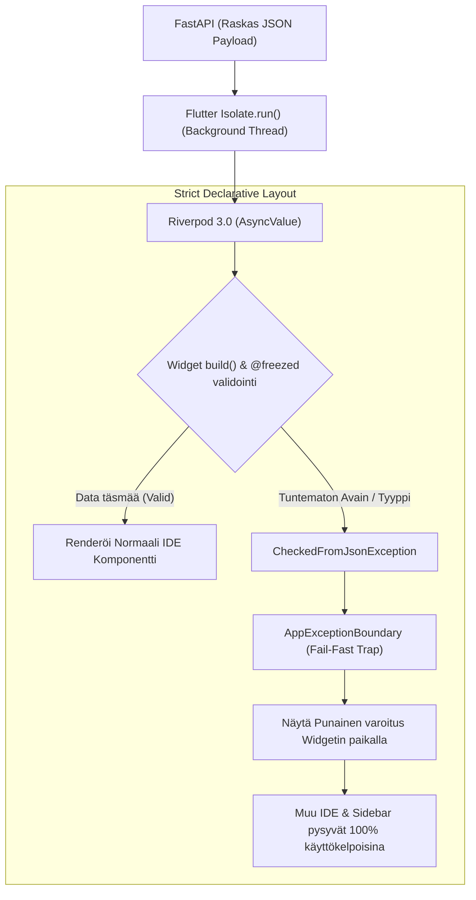

# 07: Flutter Frontend (V5.2 Desktop-First)

Cognitive Quorum -käyttöliittymä (`client_app_v2`) on rakennettu Flutterilla täysin **Desktop-First** (PC/Ultrawide) edellä. Kaikki logiikka on hajautettu tiukasti Riverpod 3.0:aan ja asynkronisiin Isolate-säikeisiin (Main Thread Jank Prevention). 

Yksi suurimmista arkkitehtuurisista paradigmoista on **SDUI (Server-Driven UI)** eli "**Zero-Math UI**": Käyttöliittymä tai Flutter-laitteen CPU ei saa koskaan laskea matemaattisia keskiarvoja tekoälyn datasta, vertailla numeerisia kynnyksiä saati päätellä teemavärien vaihtumisia. Tämä luottaa puhtaasti Backendin palauttamiin esipureskeltuihin `ReportLayoutDTO` -malleihin (Backend-For-Frontend konsepti). Kaikki kompleksinen esitystieto on täysin SDUI-ohjattua.

## 1. Desktop-First Layout ja Ikkunointi

Järjestelmä perustuu täyteen IDE-kankaaseen (Integrated Development Environment).

1. **Reititys ja Macro-Breakpoints:** Koodissa ei käytetä lokaalia `MediaQuery` purkkaa vaan joustavia Rust-Impeller Flexbox/Expanded sääntöjä ja pakotettuja 'Macro-Breakpoints' luokkia. Yli 1200dp näytöillä komponentit asettuvat Three-Pane Row -rakenteeseen (SideBar | MasterList | Canvas). Kapeammissa 800-1199dp ikkunoissa siirrytään Two-Pane malliin jne. Tämä estää nk. "MediaQuery Thrashing" ilmiön Ikkunan skaalauksessa.
2. **Infinite 2D Canvas:** Asiantuntijajärjestelmän työnkulkujen (DAG) tai matriisien konfigurointi hylkää yksittäiset listamuuttujat. **SystemInspector** luo `InteractiveViewer`in päälle äärettömän ruutupaperimaisen editorin, missä kaikki työnkulun Pydantic-solmut liikkuvat visuaalisesti x/y -avaruudessa. Objektin painaminen aukaisee kyseisten parametrien asetusnäkymän sivupalkkiin irroittamatta silmää verkon kokonaisuudesta.
3. **Horizontal Overflow Prevention:** Dynaaminen teksti (`Text`) ja pudotusvalikot (`DropdownButtonFormField`) pitää aina asettaa `Expanded` wrapperin sisään. Tekstille asetetaan ehdottomasti `overflow: TextOverflow.ellipsis` ja pudotusvalikoille `isExpanded: true`. Tämä pakottaa Impellerin laskemaan typistyksen rajat ennen renderöintiä ja estää kohtalokkaat 'RenderFlex overflowed' -kaatumiset.
4. **Desktop Pro Tool Interaction:** Koska kyseessä on Desktop-luokan Pro-IDE, kaikki interaktiiviset elementit vaativat natiivin työpöytäkokemuksen. Paljaan `GestureDetector`in käyttö on kielletty ilman seuraavia: hiiren Hover-tilat (`SystemMouseCursors.click`), näppäimistöfokus (`FocusNode`) ja pikanäppäintuki (`Shortcuts`).
5. **Design Token Absolute Rule:** Exklusiivisesti käytetään globaaleja Design Tokeneita (esim. `AppSpacing.p16` tai `Theme.of(context).textTheme`). Kovakoodatut värit ja padding-arvot ovat kiellettyjä.

## 2. Koodin Pariteetti ja Freezed-turva (Fail-Fast)

Frontend-mallien (Data Transfer Objects) pitää jatkuvasti vastata yksi-yhteen (`1:1`) Python Backendin uusia Pydantic V2 -muutoksia.
* **The De-Generator Mandate (SafeCast & Optimistic Updates):** Admin Studion dynaamiset työnkulku- ja DAG-konfiguraatiot käsitellään tiukalla koodigeneraatiolla (`@freezed`) ja `disallow_unrecognized_keys: true` -rajoitteella. Järjestelmä soveltaa tiukkaa **SafeCast**-defensiivistä purkua estääkseen tuntemattomien avaimien kaatamasta UI:ta hiljaisesti. Yhdistettynä Optimistic Riverpod -päivityksiin tämä De-Generator -arkkitehtuuri varmistaa, että massiivisia dynaamisia puita voidaan muokata lennossa sulavasti ilman käyttöliittymän jäätymistä tai korruptoituneen datan lataamista muistiin.
* **Pääsäikeen suojaus (Isolates Main Thread Jank Prevent):** Raskaiden Backendin tulostamien raporttien JSON-purku ei saa missään tilanteessa vaikuttaa ikkunan päivitysnopeuteen (60FPS Frame Drop). Se on irroitettu pääsäikeestä omaan Background Isolateen käyttämällä rutiinia: `await Isolate.run(() => jsonDecode(chunk));`
* **Freezed When Ban & Natiivi Switch:** Vanhat `.when()` ja `.map()` funktiot on kielletty. Ne korvataan aina Dart 3:n natiiveilla `switch`-lausekkeilla (pattern matching / destructuring).
* **Centralized Frontend Enums & No Raw String Mappings:** Backendin Pydantic-mallien Literal/String-kenttiä ei saa koskaan validoida IF-lauseilla tai manuaalisella `switch`:llä käyttöliittymässä. Kaikki järjestelmätason ja mallien kentät on keskitettävä Enum-luokiksi käyttäen yksittäisille kentille `@JsonValue()`-annotaatioita sijaintiin `core/models/enums.dart`.
  * **Strictness Selector (Epic 42):** Käyttöliittymässä esitettävä semanttinen ankaruustaso pakotetaan käännösvaiheessa absoluuttisiksi API-kokonaisluvuiksi (0, 15, 50, 85, 100). Backendin palauttama `EvidenceType` (`EXPLICIT_QUOTE`, `IMPLIED_INTENT`, `NO_EVIDENCE`) mäppäytyy `@JsonEnum()` avulla suoraan visuaalisiin ikoneihin (checkmark vs. warning), estäen hallusinaatioriskit SDUI-tasolla.
* **No-String Mandate:** Raw-merkkijonojen käyttö UI-koodissa on ehdottomasti kielletty. Kaikki käyttöliittymän tekstit, kuten virheilmoitukset, sijaitsevat yksinomaan `.arb`-tiedostoissa (esim. `AppLocalizations.of(context)!.errorUnknown`).
* **TDAState Sealed Class (Tripartite Parity):** UI:n tila (esim. `pending`, `evaluated`, `dlq`) käsitellään absoluuttisella `TDAState` Dart 3 Sealed Class (Union Type) -rakenteella, joka estää UI:ta koskaan laskemasta tilaa tai suorittamasta scoring-matematiikkaa. DLQ-tilat ja Backendin virhetracet (`backendTrace`) renderöidään deterministisesti ilman fallbacks-purkuja.

## 3. Riverpod 3.0, Hookit ja Dynaaminen Reititys (SWR)

* **SWR ja Nollalatenssi:** Raskaat tietokantanäkymät lukitaan muistiin SWR (Stale-While-Revalidate) -konseptin kautta (`ref.keepAlive()`). Käyttäjän palatessa näkymään heitetään heti ruutuun (0ms) viimeisin tunnettu versio välimuistista, ja taustapäivitys ajaa uudet muutokset pehmeästi ruudun pintaan perässä.
* **O(1) Lists (Suorituskyky):** Massiivisten tietorakenteiden kohdalla vältetään Riverpodin O(N²) listojen syvävertailujäätyminen. Ratkaisuna käytetään natiiveja Dart `List<T>` -rakenteita ohittamalla syvävertailu direktiivillä `@Freezed(equal: false)`.
* **Riverpod Read vs Watch:** Komponenttien `build()`-metodin sisällä on pakollista käyttää ainoastaan `ref.watch()`-metodia tilan kuuntelemiseen. Vastaavasti tapahtumakäsittelijöissä (esim. `onPressed`) on käytettävä ainoastaan `ref.read()`-metodia komentojen suorittamiseen.
* **Transient Input State & Focus Preservation (Cursor Jump Prevention):** Näppäinpainallusten välitön lähettäminen Riverpodiin jokaisella lyönnillä on kielletty. Reaaliaikainen tilanhallinta ja dynaaminen tekstinsyöttö (kuten Model Registryn uusi dynaaminen `additional_params` JSON-editori tai `caching_strategy` asetukset) puskuroidaan lokaalisti `flutter_hooks`-kirjaston avulla (`useTextEditingController`).
  * **Cursor Jump Prevention -mandaatti (Epic 62):** Monimutkaisia JSON- tai tekstikenttiä muokatessa reaktiivinen käyttöliittymä ei saa menettää tekstikentän fokusta tai siirtää kursoripistettä tekstin loppuun kesken kirjoituksen. Tämä estetään sitomalla datan keruu Form-widgetin `onSaved`- tai `onChanged` -elinkaareen ja päivittämällä Riverpod-rekisteritila (`saveRegistry`) hallitusti vasta poistuttaessa kentästä tai tallennuksen yhteydessä, välttäen jatkuvat Widgetin uudelleenrakentamiset (rebuild) kesken aktiivisen kirjoitusprosessin.
* **Snapshot Revert ja Optimistic UI (Mutations):** Tallentamisoperaatiot Admin Studiossa hyödyntävät Optimistic UI:ta. Tilamuutokset peilataan HETI ruudulle Riverpod 3.0 Mutation -paradigman kautta. Jos backend-pyyntö tai backendin tiukka Pydantic-validointi kuitenkin epäonnistuu, järjestelmä suorittaa välittömän **Snapshot Revert** -rutiinin, joka kumoaa lokaalin tilan saumattomasti takaisin edelliseen varmennettuun tilaan ilman sivun uudelleenlatausta.
* **GoRouter Opaque ID:** Navigaatio rakentuu Stripe-tyyppisten Opaque ID:in päälle (`/admin/workflow/edit/:id/:slug`). Reitteihin ei syötetä sisääntulevia `$extra` objektiparametreja, sillä kaikki näkymien tilat sidotaan näkymän omien ID-pohjaisten Riverpod-providerien varaan.

## 4. Single Source of Truth: UI Error Boundary

Koodissa on täysi kielto virheiden hiljaiseen ohittamiseen (ei `SizedBox.shrink()` virhekomponenteille).

* Järjestelmä on kapseloitu globaaliin **AppExceptionBoundary** -verkkoon (toteutettu tiedostossa `core/error/app_error_boundary.dart`).
* Mikäli yhden tietyn visuaalisen laatikon tai komponentin data puuttuu tai on korruptoitunut (`CheckedFromJsonException`), laite eristää yksittäisen widgen punaisilla katkoviivoilla korostettuun virhelaatikkoon. Koko muu IDE pysyy aktiivisena.
* **Graceful Network Degradation:** Dataparserin virheet kaatavat sovelluksen tietoisesti punaiseksi laatikoksi suojatakseen muistivuodoilta, mutta tietoverkkovirheitä (kuten SocketException) ei kaadeta AppExceptionBoundaryyn, vaan ne otetaan kiinni ja ohjataan käyttöliittymä tilapäiseen lataus- tai uudelleenyhdistämistilaan tuhoamatta käyttäjän jo syöttämää paikallista dataa.

## 5. Visuaalinen XAI Audit Trail (Explainable AI)

Jotta tekoälyn tekemät contextual override -ohitukset ovat täysin auditoitavissa ja läpinäkyviä, frontend-kerros renderöi ne korostettuna visualisointina:

* **Mekaanisen sitaatin korvaaminen:** Kun `contextual_override = true` palautetaan API-rajapinnasta, käyttöliittymä poistaa normaalin mekaanisen *"Ote alkuperäisestä tekstistä"* -laatikon ja korvaa sen korostetulla, **amber-reunaisella perustelulaatikolla**.
* **Lokalisaatiopariteetti:** Kaikki UI-tekstit haetaan täysin lokalisoituna `AppLocalizations` -luokan kautta (`reportSemanticExplanationTitle` tai `reportSemanticReasoningTitle`), varmistaen Zero-Math ja No-Magic-Strings -vaatimusten ehdottoman toteutumisen.

## 6. Keskeinen Hakemistokartta ja Komponentit

* **`features/execution/views/`:** Vastaa työnkulkujen ajonaikaisesta esittämisestä ja tulostuksesta (SDUI). Sisältää ydinruudut: `dashboard_view.dart`, `execution_report_view.dart` jne. Näissä näkymissä hallinnoidaan myös asynkronisten järjestelmäaskeleiden (Virtual System Steps) saumatonta renderöintiä osana askeleiden listaa ilman visuaalista eroa natiiveihin tekoälyaskeleisiin.
* **`features/studio/views/`:** Pitää sisällään Admin Studion hallintatyökalut, ml. työnkulkujen rakentimen (DAG Editor: `workflow_builder_view.dart`) sekä V2-arkkitehtuurin mukaisen PromptBlock-editorin.
  * **Decoupled Block Editors (Epic 60):** `StepBuilderView` widgettiin on rakennettu erilliset widgetit: **Role Selector** (roolipersoonan valintaan dynaamisella kategoriasuodatuksella), **Protocol Selector** (poimintaprotokollan valintaan) sekä **Criteria List** (reorderable list -korttijärjestelmä arvioitaville TDA-kriteereille). Vanha mekaaninen flat-lista on poistettu.
* **`core/error/`:** Sisältää vikasietomekanismit, joista keskeisimpänä `app_error_boundary.dart` (AppExceptionBoundary).
* **`features/studio/views/widgets/xai/`:** SDUI-komponenttien koti, esim. `matrix_observability_accordion.dart`, joka huolehtii xAI-matriisien rakenteellisesta esittämisestä ilman lokaalia matematiikkaa.

## Epic 57: "Mechanical vs Cognitive Balance" -mittarikortti

Asiakassovelluksen visualisointi koki Epic 57 -vaiheessa premium-tason laajennuksen, kun ristiinvertaavan varianssimoottorin tuottamat tulokset tuotiin näkyville:

* **`VarianceGaugeWidget` (`xai_extensions_box.dart`):** Premium-tason visualisointikomponentti, joka renderöi mekaanisen ja kognitiivisen päättelyn välisen tasapainon dynaamisena mittarina (Gauge).
* **Segmentoitu asettelu:** Mittari koostuu kolmesta selkeästi rajatusta ja värikoodatusta tausta-alueesta:
  - **Aligned (flex: 25):** Kevyt vihreä (`#E8F5E9`), teksti "Aligned".
  - **Mild (flex: 25):** Kevyt oranssi (`#FFF3E0`), teksti "Mild".
  - **Severe (flex: 50):** Kevyt punainen (`#FFEBEE`), teksti "Severe".
* **Dynaaminen kohdistus ja marker:** Widget lukee varianssipisteen ($0.0 - 2.0$) ja laskee sille `LayoutBuilder`-komponentin tarjoamien maksimileveyksien pohjalta tarkan siirtymän (offset). Kohdistuspisteeseen piirretään alaspäin osoittava kolmio (`CustomPainter` -toteutus) sekä tarkka kahden desimaalin pistemäärä.
* **Tietotyökaluvihje (Tooltip):** Mittarin otsikon viereen on sijoitettu asiantuntijaikonin sisältävä `Tooltip`, joka avaa käyttäjälle selitteen: *"Compares performative linguistic patterns (performative_phrases_count) against cognitive authenticity (llm_authenticity_score)."*
* **Design Tokenit & No-String Mandate:** Kaikki värit ja asetteluvälit noudattavat sovelluksen globaaleja teemoja (`Theme.of(context)`). Kaikki tekstit (kuten "Mechanical vs Cognitive Balance" ja tuomion "Aligned" / "Misaligned Sycophancy" käännökset) ladataan yksinomaan `.arb`-lokalisaatiotiedostoista, noudattaen ehdotonta `AppLocalizations`-standardia.

## 7. Mallirekisterin (Model Registry) Frontend-toteutus (Studio V2)

Mallirekisterin käyttöliittymätoteutus noudattaa **De-Generator Mandate** -vaatimusta, joka kieltää staattiset DTO:t Studion toimialueella. Käyttöliittymä toimii rekursiivisena lomakerakentajana suoraan `Map<String, dynamic>` -rakenteelle.

*   **ModelRegistryController**: Toteutettu Riverpodin `AsyncNotifier`-luokkana.
    *   **Tila**: `AsyncValue<Map<String, dynamic>>`.
    *   **Optimistinen UI**: Päivittää paikallisen tilan *ennen* verkkokutsun valmistumista antaen käyttäjälle välittömän palautteen.
    *   **Snapshot Revert (Rollback)**: Tallentaa edellisen tilan ja palauttaa sen automaattisesti taustajärjestelmän antamilla `4xx/5xx` API-virheillä.
*   **ModelRegistryView**: Dynaaminen lomake-käyttöliittymä.
    *   **Syväkopioitu alustus**: Luo paikallisen muokattavan kopion rekisterin `Map`-rakenteesta lomakkeen `onSaved`-takaisinkutsujen käsittelemiseksi turvallisesti ilman provider-tilan suoraa muuttamista.

### 7.1 Multiplexed-haku ja rekursiivinen lomake
Ohjain hakee datan reitillä `StudioClient.getSystemConfig('model_registry')` taustan monikäyttöisen (multiplexed) päätepisteen kautta. Käyttöliittymä käy läpi sisäkkäisen `models`-sanakirjan ja luo laajennuspaneelit (Expansion Tiles) kullekin tarjoajalle (kuten `google`, `openai`). Tarjoajan sisällä luodaan syöttökentät seuraaville parametreille: `model_name` (teksti), `temperature` (numeerinen), `max_tokens` (numeerinen) ja `supports_grounding` (kytkin).

### 7.2 Toiminnalliset vaaratilanteet ja korjaustoimenpiteet
*   **RSOD-tyyppikaatumiset (String as Map):** Mikäli jotkin rekisterin tarjoajat sisältävät roolimäppäyksiä (esim. `"AnalystAgent": "fast"`) koko strategiakuvan rinnalla, käyttöliittymä suorittaa tyyppitarkistuksen `if (value is String)` estääkseen tyyppimuunnoskaatumiset ja piirtää ne yksinkertaisina `ListTile`-elementteinä.
*   **TDA-kriteerien kalibrointi ja kontrastiviset esimerkit (Phase 5):** Testi-indikaattoreiden (TDA) muokkaimeen ([scale_editor_modal.dart](file:///c:/src/quorum/client_app_v2/lib/features/studio/views/widgets/scale_editor_modal.dart)) on lisätty `contrastive_example`-tekstikenttä. Tämä antaa ylläpitäjille mahdollisuuden asettaa kontrastivisia esimerkkejä (ACCEPTABLE vs UNACCEPTABLE) suoraan käyttöliittymästä negatiivisten rajojen kalibroimiseksi. Valittu arvo tallennetaan DTO-mallin `contrastive_example`-kenttään.

 

➡️ **Seuraavaksi:** Flutterin arkkitehtuurin ymmärtämisen jälkeen, lue [08_dynamic_rendering_sdui.md](./08_dynamic_rendering_sdui.md) nähdäksesi, kuinka palvelin ohjaa käyttöliittymän asetteluita dynaamisesti (Server-Driven UI) ilman, että käyttöliittymää tarvitsee päivittää.
