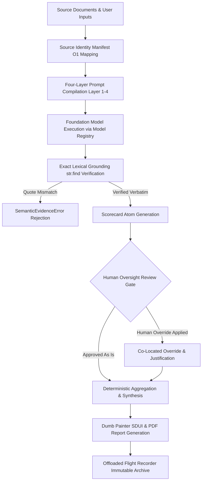

# EU AI Act Compliance & Governance Architecture

## 1. Executive Summary

The **EU AI Act Compliance & Governance** capability defines how the Quorum cognitive platform satisfies, enforces, and continuously monitors compliance with the European Union Artificial Intelligence Act (**Regulation (EU) 2024/1689**). 

In strategic advisory, executive coaching, and organizational assessment, AI-assisted evaluations constitute high-stakes decision support. To ensure legal compliance, ethical trustworthiness, and institutional defensibility, Quorum enforces a **Zero-Black-Box** architectural paradigm: no qualitative assertion, score, matrix evaluation, or synthesized recommendation is emitted without mathematical provenance, deterministic auditability, exact lexical grounding to verified source documents, and non-bypassable human oversight.

---

## 2. Regulatory Alignment & Core Architectural Invariants

Quorum maps its core architectural capabilities directly against the mandatory requirements for high-risk and general-purpose AI systems established by the EU AI Act:

```
┌─────────────────────────────────────────────────────────────────────────────┐
│                      EU AI ACT REGULATORY MAPPING                           │
├──────────────────────────┬──────────────────────────────────────────────────┤
│ Article 12: Record-Keeping│ Immutable Flight Recorder & Epistemic Snapshots │
├──────────────────────────┼──────────────────────────────────────────────────┤
│ Article 13: Transparency │ Four-Layer Clean Prompt Stack & SDUI Rendering   │
├──────────────────────────┼──────────────────────────────────────────────────┤
│ Article 14: Human-in-Loop│ Non-Bypassable Human Override & Expert Auditing  │
├──────────────────────────┼──────────────────────────────────────────────────┤
│ Article 15: Robustness   │ Exact Lexical Anchoring (str.find vs Hallucinate)│
├──────────────────────────┼──────────────────────────────────────────────────┤
│ Article 50: Provenance   │ Source Identity Manifest & Model Registry SSOT   │
└──────────────────────────┴──────────────────────────────────────────────────┘
```

### 2.1. Automatic Record-Keeping & Traceability (Article 12)
- **The Requirement:** High-risk AI systems must automatically log events over their entire operational lifecycle to guarantee post-market traceability, reproducibility, and incident analysis.
- **The Architecture:** Every workflow run produces an atomic, immutable execution record:
  - **Cryptographic Tenant Identity:** Each run is bound to a permanent identifier (`exe_...`), locking tenant boundaries, authorized user metadata (`created_by`), and organization scope (`organization_id`).
  - **Bi-Temporal UTC Timestamps:** Initiation, state transitions, and completion timestamps are captured in UTC, preventing retrospective timeline manipulation.
  - **Dual-Identity Telemetry & Model Provenance:** Step-level execution tracking captures both the **Logical Intent** (configured blueprint strategy alias, e.g. `fast`, `reasoning`) and the **Epistemic Ground Truth** (exact physical model identifier, provider weights version, and system fingerprint, e.g. `vertex_ai/gemini-2.5-flash`, `fp_...`), alongside prompt tokens, completion tokens, cached tokens, reasoning tokens, and financial cost. This guarantees that model version upgrades over time never create an un-auditable black box.
  - **Offloaded Flight Recorder:** Heavy forensic payloads (compiled system prompts, JSON schemas, injected theory texts, and tool audit traces) are archived into immutable object storage with cryptographic URI references in the primary record.

### 2.2. Algorithmic Transparency & Epistemic Grounding (Article 13)
- **The Requirement:** AI systems must operate with sufficient transparency to enable deployers to interpret outputs, understand methodology, and evaluate inherent limitations.
- **The Architecture:** Quorum compiles all AI interactions through a Four-Layer Clean Stack:
  1. **Layer 1 (Static Directives):** Unchanging structural constraints and safety mandates.
  2. **Layer 2 (Epistemic Grounding):** Academic frameworks and peer-reviewed organizational methodologies injected into the reasoning context, anchoring evaluations in recognized science rather than stochastic intuition.
  3. **Layer 3 (Objective & Protocol):** Explicit extraction rubrics, score definitions, and scale bounds published as open schemas.
  4. **Layer 4 (Attention Anchors):** Source inputs bound with deterministic sequence indices and short aliases.
- **Dumb Painter UI:** The client presentation layer does not synthesize or interpret data independently. It acts as a pure renderer displaying layout blocks generated directly from verified backend schemas.

### 2.3. Non-Bypassable Human Oversight (Article 14)
- **The Requirement:** AI systems must be designed to enable natural persons to oversee operations, understand recommendations, and override automated determinations.
- **The Architecture (Human-in-the-Loop):** AI outputs in Quorum represent structured propositions, not irreversible verdicts:
  - **First-Class Human Overrides:** Every scorecard atom and matrix score supports an explicit human override state.
  - **Provenance Preservation:** When an expert reviewer modifies an AI score, the original AI assessment, the human modification, the reviewer's identity, and the textual justification are permanently co-located in the execution record.
  - **Downstream Re-Synthesis:** When overrides occur, reporting and synthesis pipelines automatically re-evaluate final reports against the human-approved state.

### 2.4. Accuracy, Robustness & Hallucination Elimination (Article 15)
- **The Requirement:** Systems must achieve a high level of accuracy and resilience, eliminating biased hallucinations and ungrounded extrapolations.
- **The Architecture:** Quorum prohibits fuzzy matching, semantic distance approximations, or probabilistic heuristics during evidence validation:
  - **Exact Character Matching:** Every empirical claim extracted by the AI must supply a verbatim `evidence_quote`. The platform verifies this quote against the raw source document using exact character sequence matching (`str.find`).
  - **Semantic Evidence Rejection:** If a quote cannot be verified verbatim within the source document, the system triggers a `SemanticEvidenceError` and rejects the extraction, preventing fabricated or chimeric evidence.
  - **Zero-Math Prompts:** LLMs are never permitted to perform numerical arithmetic or scale normalization; all global scoring, metric aggregation, and penalty formulas are executed in deterministic Python runtime.

### 2.5. AI Attribution & Source Manifest (Article 50)
- **The Requirement:** Deployers and recipients must be informed when interacting with AI-generated content, with clear attribution of source materials.
- **The Architecture:**
  - **Source Identity Manifest:** Input documents are fingerprinted upon ingestion and registered in an $O(1)$ lookup table mapping internal opaque identifiers to human-readable document titles.
  - **Model Registry SSOT & Epistemic Mapping:** All model calls route through a centralized Model Registry and pricing abstraction, documenting model family, exact physical version, system fingerprint, and operational cost across all deliverables.

---

## 3. Logical Compliance Data Flow



---

## 4. Continuous Automated Compliance Verification (AST Guardrails)

Quorum enforces EU AI Act compliance not merely through documentation, but through automated **Abstract Syntax Tree (AST) Guardrails**:
- **Static Code Verification:** Pre-commit and CI/CD AST scanners analyze all backend code to statically prevent the introduction of silent fallbacks, unvalidated duck typing, or bypassed error boundaries.
- **Zero-Fallback Enforcement:** If a service introduces ad-hoc fallback values that would mask missing state or bypass validation, the AST guardrail fails the build immediately.
- **Mathematical Invariant Auditing:** Unit and integration test suites enforce over 90% strict coverage across all compliance, scoring, and telemetry pathways.
