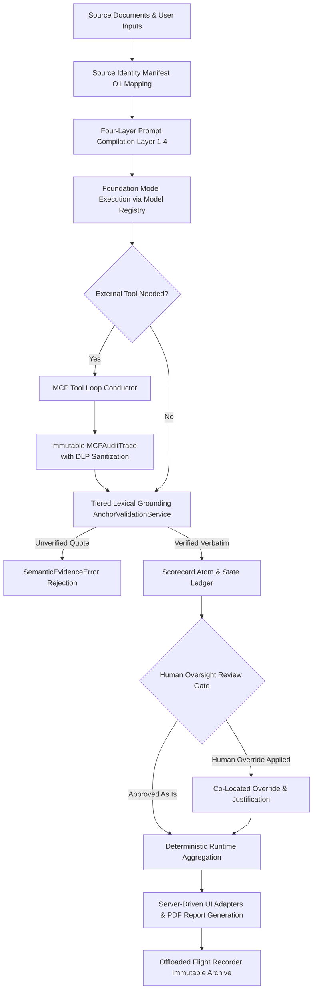

# EU AI Act Compliance & Governance Architecture

## 1. Executive Summary

The **EU AI Act Compliance & Governance** capability defines how the Compound AI System satisfies, enforces, and continuously monitors compliance with the European Union Artificial Intelligence Act (**Regulation (EU) 2024/1689**). 

In strategic advisory, executive coaching, and organizational assessment, AI-assisted evaluations constitute high-stakes decision support. To ensure legal compliance, ethical trustworthiness, and institutional defensibility, Quorum enforces a **Zero-Black-Box** architectural paradigm: no qualitative assertion, score, matrix evaluation, or synthesized recommendation is emitted without mathematical provenance, deterministic auditability, exact lexical grounding to verified source documents, immutable external tool auditing, and non-bypassable human oversight.

---

## 2. Regulatory Alignment & Core Architectural Invariants

Quorum maps its core architectural capabilities directly against the mandatory requirements for high-risk and general-purpose AI systems established by the EU AI Act:

```
┌─────────────────────────────────────────────────────────────────────────────┐
│                      EU AI ACT REGULATORY MAPPING                           │
├──────────────────────────┬──────────────────────────────────────────────────┤
│ Article 12: Record-Keeping│ Immutable Flight Recorder, MCP Traces & Ledgers │
├──────────────────────────┼──────────────────────────────────────────────────┤
│ Article 13: Transparency │ Four-Layer Prompt Stack, XAI Trails & SDUI Parity│
├──────────────────────────┼──────────────────────────────────────────────────┤
│ Article 14: Human-in-Loop│ Non-Bypassable Human Override & Expert Auditing  │
├──────────────────────────┼──────────────────────────────────────────────────┤
│ Article 15: Robustness   │ Tiered Lexical Anchoring & Null Hypothesis Defense│
├──────────────────────────┼──────────────────────────────────────────────────┤
│ Article 50: Provenance   │ Source Identity Manifest & Model Registry SSOT   │
└──────────────────────────┴──────────────────────────────────────────────────┘
```

### 2.1. Automatic Record-Keeping & Traceability (Article 12)
- **Regulatory Requirement:** High-risk AI systems must automatically log events over their entire operational lifecycle to guarantee post-market traceability, reproducibility, and incident analysis.
- **Architectural Implementation:** Every workflow run produces an atomic, immutable execution record:
  - **Cryptographic Tenant Identity:** Each run is bound to a permanent identifier, locking tenant boundaries, authorized user metadata, and organization scope.
  - **Bi-Temporal UTC Timestamps:** Initiation, state transitions, and completion timestamps are captured in UTC, preventing retrospective timeline manipulation.
  - **Dual-Identity Telemetry & Model Provenance:** Step-level execution tracking captures both the **Logical Intent** (configured blueprint strategy alias) and the **Epistemic Ground Truth** (exact physical model identifier, provider weights version, and system fingerprint), alongside prompt tokens, completion tokens, cached tokens, reasoning tokens, and financial cost. This guarantees that model version upgrades over time never create an un-auditable black box.
  - **Append-Only State Ledger:** Historical execution payloads, step states, and tool interactions adhere to an append-only model. In-place mutations of past execution traces are eliminated; dynamic projections instantiate fresh immutable data transfer objects.
  - **Offloaded Flight Recorder:** Heavy forensic payloads (compiled system prompts, JSON schemas, injected theory texts, and tool audit traces) are archived into immutable storage with cryptographic URI references in the primary record.

### 2.2. Algorithmic Transparency & Explainable AI (Article 13)
- **Regulatory Requirement:** AI systems must operate with sufficient transparency to enable deployers to interpret outputs, understand methodology, verify external interactions, and evaluate inherent limitations.
- **Architectural Implementation:** Transparency is enforced across prompt compilation, external fact-checking, and user presentation:
  - **Four-Layer Clean Stack:** Quorum compiles all model interactions through a disciplined four-layer hierarchy:
    1. *Layer 1 (Static Directives & Mandates):* Unchanging structural constraints, safety guardrails, and role definitions maintained as a cacheable prefix.
    2. *Layer 2 (Epistemic Grounding):* Academic frameworks and peer-reviewed organizational methodologies injected into reasoning context, anchoring evaluations in recognized science rather than stochastic intuition.
    3. *Layer 3 (Objective & Protocol):* Explicit extraction rubrics, scorecard metrics, and scale bounds published as open schemas.
    4. *Layer 4 (Attention Anchors & User Payload):* Source inputs bound with deterministic sequence indices and short aliases.
  - **External Tool Audit Trails (XAI Receipts):** All external tool invocations (such as web search queries, external database lookups, and API interactions) are captured in immutable audit traces recording the tool identifier, triggering workflow step, verbatim claim under verification, exact search query, epistemic knowledge gap, search rationale, distilled evidence summary, cited source URLs, and round-trip execution latency.
  - **Server-Driven UI Transparency Blocks:** Audit traces and reasoning receipts are transformed through dedicated presentation adapters into structured layout blocks (such as audit trail cards, fact-check accordions, and warning banners). The client application acts as a pure presentation layer, rendering verifiable receipts directly without client-side heuristics.
  - **Data Leak Prevention (DLP) Sanitization:** Before audit records and execution contexts are serialized or presented, automated DLP inspection ensures credentials, authorization tokens, and personal identifiable information (PII) are masked or referenced exclusively through opaque system identifiers.

### 2.3. Non-Bypassable Human Oversight (Article 14)
- **Regulatory Requirement:** AI systems must be designed to enable natural persons to oversee operations, understand recommendations, and override automated determinations.
- **Architectural Implementation (Human-in-the-Loop):** AI outputs in Quorum represent structured propositions, not irreversible verdicts:
  - **First-Class Human Overrides:** Every scorecard atom and matrix score supports an explicit human override state.
  - **Provenance Preservation:** When an expert reviewer modifies an automated assessment, the original model evaluation, the human modification, the reviewer's identity, and the textual justification are permanently co-located in the execution record.
  - **Downstream Re-Synthesis:** When overrides occur, reporting and synthesis pipelines automatically re-evaluate final reports against the human-approved state, propagating corrections through downstream analytical summaries.

### 2.4. Accuracy, Robustness & Hallucination Elimination (Article 15)
- **Regulatory Requirement:** Systems must achieve a high level of accuracy and resilience, eliminating biased hallucinations, chimeric evidence, and ungrounded extrapolations.
- **Architectural Implementation:** Quorum enforces multi-tiered evidentiary validation and mathematical separation:
  - **Tiered Lexical Validation:** All empirical claims extracted by models must supply verbatim evidence quotes verified through a tiered validation protocol:
    1. *Primary Gate (Exact Substring Search):* Normalizes source text and candidate quotes (stripping diacritics, punctuation, HTML tags, and whitespace variance while mapping character offsets) and executes exact substring search. An exact match is accepted immediately with zero fuzzy distortion.
    2. *Entropy Gate (< 10 Characters):* Quotes shorter than ten characters require 100% exact substring matching; fuzzy matching is strictly banned to prevent single-word false positives.
    3. *Controlled Fuzzy Fallback (>= 10 Characters):* Permitted only when the primary gate fails, the quote exceeds ten characters, and strictness configuration allows tolerance for optical character recognition (OCR) artifacts or morphological inflections. Contiguity algorithms are applied to short phrases, while token-set comparisons handle longer multi-line sentences.
  - **Semantic Evidence Rejection:** If a quote cannot be verified within the source document under these strict boundaries, the system triggers a validation exception and rejects the extraction, preventing fabricated or chimeric evidence from entering the evaluation.
  - **Null Hypothesis Guardrail:** If an evaluation resolves to a failed status or activates a contextual override, associated evidence quotes are forced to null. Forensic evidence cannot substantiate a hypothesis that was refuted or overridden contextually.
  - **Immutable Evidence Preservation:** Verbatim forensic quotes are treated as immutable legal records. Text budgeting, truncation, and sentence-boundary trimming are applied strictly to synthesized editorial text, never to verbatim forensic quotes.
  - **Zero-Math Prompts:** Models are never permitted to perform numerical arithmetic, scaling calculations, or metric aggregation; all scoring, metric calculations, and penalty formulas are executed deterministically in runtime code.

### 2.5. AI Attribution & Source Manifest (Article 50)
- **Regulatory Requirement:** Deployers and recipients must be informed when interacting with AI-generated content, with clear attribution of source materials.
- **Architectural Implementation:**
  - **Source Identity Manifest:** Input documents are fingerprinted upon ingestion and registered in an $O(1)$ lookup table mapping internal opaque identifiers to human-readable document titles and source metadata.
  - **Model Registry SSOT & Epistemic Mapping:** All model calls route through a centralized Model Registry and pricing abstraction, documenting model family, exact physical version, system fingerprint, token usage metrics, and operational cost across all deliverables.

---

## 3. Logical Compliance Data Flow



---

## 4. Continuous Automated Compliance Verification (AST Guardrails)

Quorum enforces EU AI Act compliance not merely through documentation, but through automated **Abstract Syntax Tree (AST) Guardrails**:
- **Static Code Verification:** Pre-commit and automated audit scanners analyze all code to statically prevent the introduction of silent fallbacks, unvalidated duck typing, bypassed error boundaries, or unhandled exceptions.
- **Zero-Fallback Enforcement:** If a service introduces ad-hoc fallback values that would mask missing state or bypass validation, the AST guardrail fails the build immediately.
- **Mathematical Invariant Auditing:** Automated test suites enforce strict coverage across all compliance, scoring, evidentiary anchoring, and telemetry pathways.

