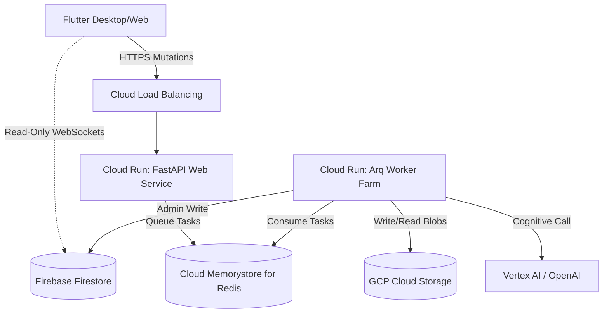

# 07: Infrastruktuuri, Observability ja Tekoälyn Resurssienhallinta (FinOps)

Järjestelmän fyysinen topologia rakentuu **Google Cloud Platformin (GCP)** Serverless-arkkitehtuuriin poistaen Kubernetes-tyyppisen hallintovelan (Scale-to-Zero). B2B asynkroninen hajauttavuus asettaa telemetrialle kriittisiä arkkitehtuurijuuria (Logfire).

## Käyttöönottomalli (Deployment Architecture)

## Vikasietoisuus (Resilience)
Ulkoverkon hallintaan on sovitettu 3-tasoinen elastinen elvytys:
1. **Exponential Backoff:** Kaikki Vertex/OpenAI kutsut hyödyntävät satunnaistettua viivettä.
2. **DAG Checkpointing:** Osa-askelet ovat pysyviä (tilannevedokset) estäen arvokkaan tekoälyn laskennan katoamisen pitkittyneiden kaatumisten vuoksi.
3. **Dead Letter Queue (DLQ):** Toistamiseen kaatuva "Kuolettava" työ heitetään Workerin toimesta viiveiseen jäänteiden rekisteriin hälytysten kera suojaten Redis-luuppia (The Zombi-Protocol).

## Operatiivinen valvonta (Distributed Tracing)
- **`ContextVars` ja Trace-ID:** Lokaali API pyyntö synnyttää globaalin Trace-ID:n.
- **The Dual-Reporting:** Frontend ei koskaan kirjoita telemateriaa suoraan Crashlyticiin, vaan Proxy API (`/telemetry/client-error`) välittää UI:n poikkeukset palvelimeen. Frontend ja Backend yhdistyvät yhdessä Pydantic Logfire -ratkaisussa rinnakkaisena "Single Pane of Glass" läpinäkyvyytenä.

## Tekoälyn resurssienhallinta (FinOps ja Kvootit)
B2B-järjestelmä suojaa itseään "Denial of Wallet" laadusta (ylikestävät ajot).
- **Circuit Breaker:** Suorituksilla the Preflight Check leimaa pyynnön (`402 Payment Required`), jos organisaation luotto kuluu ennenaikaisesti työjonossa, Worker the DAG-loopissa nostaa Exit-Hatchin turvaten yritysvarat lukitukseen. 

---

## The Map: Hakemistoryhmien kuvaus (Infra, Testit & Apuvälineet)

Järjestelmän lokaalit utiliteetit suojelevat API:n suoruutta ja varmistavat luotettavuuden.

### `backend_v2/scripts/` (Hallinta)
Arkkitehtuuri on tuotu erillisiksi modulaarisiksi kehityskutsuksi ohjaimista irti:
- Sisältää ylläpito-työkaluja, järjestelmä-migraatiota lennossa suorittavia erillisiä tiedostoja (esim. OpenAPI skeemojen generoijat ilman ajoaikaista rasitetta).

### `backend_v2/utils/` (Hajautetut Fail-Fast Apufunktiot)
Kaikki pienet hajallaan työnkulun yli olevat luokat. Nämä noudattavat myös The Zero-Compromise Pledge sääntöä (eivät sokaise Exceptioneita oletusarvoilla).
- **`dict_utils.py`**: Puhtaat ja varmennetut sanakirjojen syväyhdistämiset.
- **`math_utils.py`**: Numeeriset normalisoinnit sekä matemaattiset skaalaukset O(1) luotettavuuksilla.
- **`pydantic_utils.py`**: Tukitoimet The Inflate ja dynaamiseen validointikuvien tyhjentämiseen Pydantic objekteista.
- **`redis_patcher.py`**: Ympäristön lokaalit fakeredis testikorjaukset.
- **`static_charts.py`**: Hookeja visualisoivan PDF-kärjen matemaattiset staattiset piirurit. (Radar / Scatter plotting).

### `backend_v2/tests/`
Testaamattomuus on arkkitehtuurieste. Jokainen koodimuutos varmennetaan täällä.
- **`tests/`**: Yksikkö/Integraatiotestit (`Pytest`), joiden 100% kattavuus The Core ja the Domain Models -tasolla varmentaa Pydantic Fail-Fast mallin luotettavuuden jatkuvassa integroinnissa.
