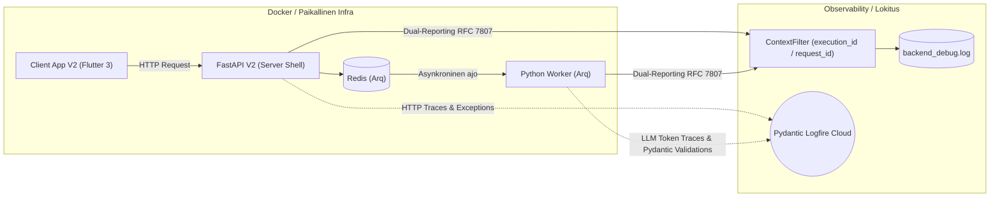

# 07: Infrastruktuuri ja Lokitus (Observability)

Järjestelmä operoi asynkronisen Python FastAPI -arkkitehtuurin, raskaiden Arq / Redis -taustatyöntekijöiden ja Docker-konttien päällä. Koska taiteellisen asiantuntijajärjestelmän debuggaus on perinteisesti tuskaista ("miksi tekoäly tuotti huonon tuloksen?"), Cognitive Quorum panostaa massiivisesti "Forensic Sovereignty" -tyyliseen jäljitettävyyteen.

## 1. Lokitus (The ContextFilter Mandate)

Lokitus (`backend_v2/logging_config.py`) ei ole vain tekstivirtaa, vaan arkkitehtuurisesti kytketty The Zero-Compromise Pledgen "Fail-Fast" periaatteisiin.

1. **Kontekstisidonnaisuus (`ContextFilter`):** Jokainen taustaprosessiin (Worker) tai reitittimeen (API) syntyvä lokirivi, oli se sitten tietokantavirhe tai LLM-integraation varoitus, ohjataan `ContextFilter`:n läpi. Tämä injektoi lokiriville *aina* aktiivisen `execution_id`:n (tai oletuksena `request_id`). Tämän ansiosta massiivisesta serverin lokitiedostosta (`backend_debug.log`) pystytään greppaamaan sekunneissa kaikki yhtä tiettyä työnkulkua koskettavat 100 eri I/O -kutsua The Event Sourcing -ketjussa.
2. **Dual-Reporting (RFC 7807):** Järjestelmän on ehdottomasti estetty nielemästä virheitä lennossa. Kun koodi kaatuu odottamattomaan poikkeukseen, sitä ei "hoideta pois", vaan se työnnetään ensin rakenteellisena `logger.error` viestinä talteen (mukaanlukien täysi Stack Trace ja virhekoodi), ja uudelleenheitetään asiakkaalle puhtaana Pydantic-validoituna `AppException` (RFC 7807 Problem Details) rakenteena vian selvittämiseksi. `main.py` määrittelee erilliset exception handlerit (`AppException`, `RequestValidationError`, `StarletteHTTPException` ja globaali `Exception`). Nämä palauttavat aina validin `application/problem+json` -vastauksen ja injektoivat `extensions`-lohkoon asiakkaalle (Flutterille) koneellisesti luettavan `error_code`:n lokalisointia (L10n) varten. Turvallisuus: HTTP-payloadien ja asiakastietojen raakalokitus on ehdottomasti kielletty.

## 2. Pydantic Logfire & LLM Observability

Tekoälyn toimintakyky ei saa ikinä olla Musta Laatikko. Järjestelmä on integroitu suoraan Pydanticin viralliseen Logfire-pilveen (`logfire.configure`).
* Kaikki HTTP-pyynnöt ja tekoälyintegraatiot (`litellm.success_callback = ["logfire"]`) säteilytetään suoraan kojelautaan pilveen vianjäljitystä varten. Arq Redis -instrumentaatio on kuitenkin tietoisesti disabloitu konsolispämmin (esim. ZRANGEBYSCORE) estämiseksi.
* Tämä paljastaa tarkasti kauan mallilla (esim. Gemini Pro) meni generoida tietty Pydantic Structured Output, paljonko se maksoi (Token usage), ja kaatuiko kysely mahdollisesti rikkinäiseen Pydantic-skeeman luontiin (`schema_builder.py`).
* **Telemetrian hienosäätö ja kestävyys:** Ympäristötasolla Windows 11 cp1252-kaatumiset estetään suoraan lokituksen ytimessä pakkokoodaamalla `sys.stdout.reconfigure(encoding="utf-8")`. Paikalliskehityksessä pilvitelemetria on myös mahdollista kytkeä kokonaan pois päältä `DISABLE_LOGFIRE` -ympäristömuuttujalla.
* **API-tason Middlewaret:** API-integraatio nojaa vahvasti middleware-kerrokseen. `RequestIdMiddleware` injektoi lennossa `X-Request-ID`:n `ContextFilter`ille telemetriakäsittelyä varten, ja `LocalizationMiddleware` asettaa oikean L10n-kielen (esim. `Accept-Language` otsikosta) dynaamisia virheviestejä varten.

## 3. Infrastruktuuri ja Ympäristöt

Quorum pohjaa kontitettuun "Infrastructure as Code" -toimintamalliin. Siksi järjestelmällä ei ole erillistä paikallisista eroja koskevaa ydinlogiikkaa. 

* **Worker Queue (Arq + Redis):** Kuten aiemmin mainittu, työnkulut eivät koskaan elä NginX tai Uvicorn pääprosessin sisällä. Kun asiakas laukaisee evaluaation, FastAPI -päärajapinta tallentaa Pydantic-mallit tietokantaan, lähettää tiedon sadasosasekunneissa Arq-palvelimelle (Redis), joka aloittaa raskaiden tekoälymallien asynkronisen ohjaamisen eristetyssä Worker-säikeessä.
* **Paikallinen Ajo:** Kehittäjät hyödyntävät käynnistysrutiineja kuten `run_local.bat` ja taustamallistoa `docker-compose.yml`, nostaen paikallisen Redis-ilmentymän sekunneissa kehityskäyttöön varmistaen täydellisen pilvipariteetin.

## 4. Frontend Observability (Flutter & AppErrorBoundary)

Vastaavasti kuin palvelinpuolella, Front-Endin (Flutter) arkkitehtuuri on immuuni hiljaisille virheiden nielemisille ("No-pass rule"). Asiakassovellus on kiedottu globaaliin `AppErrorBoundary` -luokkaan, joka ottaa kiinni kaikki odottamattomat asettelu- ja renderöintivirheet. Koska rikkinäisen komponentin jättäminen visuaalisesti näkymättömiin harmaatiloihin on estetty (`SizedBox.shrink()` on kielletty), nämä poikkeukset lokitetaan ja tallennetaan keskitetysti `LoggerServiceProvider`:n kautta lokaaliin `client_debug.log` -tiedostoon vianjäljityksen helpottamiseksi.

Vaikka puuttuva Pydantic/JSON-data kaataa parserin nativisti datavirhelyöntien paljastamiseksi ("Fail-Fast"), sovelletaan verkkoliikenteen osalta silti ohjeistusta "Graceful Network Degradation". Verkkovirheet ja aikakatkaisut otetaan kiinni alemman tason rajapinnoissa ja ohjelmisto heikkenee tällöin hallitusti lataustilaan romahtamatta koskaan kokonaan punaiseen virheruutuun. Näin varmistetaan paikallisesti generoidun graafisen työtilan turvaaminen tilapäisten verkkoyhteyskatkosten keskellä.
