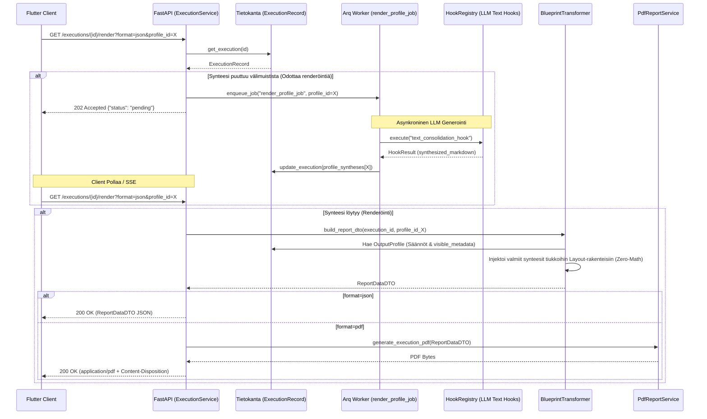

# 08: Dynaaminen Tulostusmoottori ja Osiokohtainen Synteesi

Tämä dokumentti kuvaa järjestelmän uusimman "Dynamic Rendering Engine" (tulostusmoottori) -arkkitehtuurin, joka erottaa tiedonkeruun työnkulun ja sen kielellisen generoinnin sekä visuaalisen asettelun toisistaan.

Kaikki toiminnallisuudet perustuvat tiukkaan "Backend-For-Frontend" (BFF) -jakoon, jossa palvelin ratkaisee raporttien lopullisen JSON- ja PDF-muodon (Zero-Math UI) turvallisesti erikseen eristetyssä Asynkronisessa Worker-prosessissa.

## 1. Arkkitehtuurin Pääkomponentit

Nykyaikainen tulostusarkkitehtuuri nojaa seuraaviin kerroksiin:

1. **`ExecutionService` (API Facade):** 
   Vastaa ohjaamaan pyyntöjä joko suoraan `BlueprintTransformer`ille taikka pollausta vaativaan `Arq Worker` -pohjaiseen taustatyöhön (`render_profile_job`), riippuen valitun tulostusprofiilin (`OutputProfile`) välimuistitilanteesta.
   
2. **Osiokohtainen Synteesivälimuisti (`profile_syntheses`):**
   `ExecutionRecord` on varustettu dynaamisella sanakirjalla (`dict[str, RenderedSynthesisCache]`). Yhdellä työnkululla (DAG) kerätty puhdas "Event Sourced" -tieto voidaan ajaa satojen erilaisten profiilien (esim. lyhyt Executive Summary tai pitkä 3D-data) läpi täysin toisistaan riippumatta ylikirjoittamatta synteesejä.

3. **Arq Worker (`generate_profile_synthesis_and_pdf_task`):**
   Jos pyydetyn profiilin mukaista synteesiä ei vielä löydy tietokannasta, pyyntö palautetaan välittömästi HTTP `202 Accepted` ("pending") -tilassa (SSE/Polling rajapintaedellytys). Taustatyöntekijä hyödyntää `HookRegistry`ä (erityisesti `text_consolidation_hook`) tuottaakseen raskaat LLM-tekstit ja liittää ne vasta paikalleen.

4. **`BlueprintTransformer` (BFF DTO Mapper):**
   Kun synteesi ja data on koossa, Blueprint ottaa haltuun raakadatan (`FrozenContext`) sekä raporttipohjan (`OutputProfile`). Se pakkaa "Zero-Math" säännöillä akseli-tiedot ja soveltaa `visible_metadata` filttereitä pakaten tiedot valmiiseen `ReportDataDTO` muotoon Frontendia (tai PDF-enginea) varten.

## 2. Tulostusprosessi (Mermaid Visualisointi)

Alla on arkkitehtoninen Sequence-verkko, joka kuvaa koko tulostusprosessin (`/render` endpoint) reitityksen sekä Omni-Channel HTTP -käyttäytymisen UI:lle tai PDF-tuotannolle:

## 3. Keskeiset turvallisuus- ja skaalautuvuusvarmitukset

* **Fail-Fast reititys:** Esim. `test_integration_real_llm.py` on osoitus siitä, että jos Arq epäonnistuu kielellisessä synteesissä tai tietokannan profiilia ei löydy, järjestelmä palauttaa ehdottoman validointivirheen (AppException/Pydantic `ValidationError`) sen sijaan että UI kaatuisi mystiseen tyhjään ruutuun.
* **Storage Fallback Mechanism:** Jos PDF haetaan oletusprofiililla ja sen staattinen tiedostopolku (`pdf_report_path`) on turmeltunut tallennustilasta, API "parantaa itsensä" rinnakkaisesti fallback-reitillä; synkronisesti regeneroiden kyseisen puuttuvan tiedoston levylle lennosta ("Self-healed missing PDF" -logiikka).
* **Pariteetti-Sopimus:** Kaikki Flutter-mallit lukevat JSONia 1:1 `ReportDataDTO` -rungolla, jolloin PDF ja selain pohjautuvat matemaattisesti virheettömästi täsmälleen samaan loogiseen puuhun.

## 4. Hard Artifact Testing Protocol (Visuaalisen Regression Hallinta)

Koko tulostusarkkitehtuurin (Dynamic Rendering Engine) elinehto on sen täydellinen determinismi. Koska järjestelmä ajaa jopa PDF-generoinnin suoraan samasta `ReportDataDTO` puusta kuin selainkäyttöliittymä, E2E-testauksessa noudatetaan pakollista **Hard Artifact Testing Protocol** -standardia:

1. **DB Mockaus (Kustannus & Nollaviive):** Ulkoinen I/O-riippuvuus ja LLM-generointi ohitetaan E2E-testeissä syöttämällä renderöintimoottorille 100 % deterministinen, laillisten Pydantic-validointien mukainen `ExecutionRecord`-mock. Tämä takaa nanosekuntitason suoritusnopeuden eristetyssä ympäristössä.
2. **Kova Tiedosto (Visuaalinen Regressio):** Pelkkä tyyppitarkastus (`assert isinstance(pdf_bytes, bytes)`) on kielletty yksinomaisena laadunvarmistuksena Output Management -kerroksessa, sillä se ei paljasta esim. layout-katkoksista tai tyhjistä viiksistä johtuvia visuaalisia regressioita. Testin (`test_e2e_reporting_outputs.py`) on aina injektoitava mocked-data aitoon PDF-moottoriin saakka ja kirjoitettava tuotos fyysiseksi `test_report.pdf` -tiedostoksi levylle.
3. **Koneluettava Audiotoitavuus:** Tästä kovalevylle pudotettavasta artefaktista järjestelmäarkkitehdit, katselmoijat ja tekoälyagentit pystyvät visuaalisesti ja forensisesti tarkastamaan, että uudet layout-laajennukset sijoittuvat oikein rikkomatta aikaisempaa renderöintiä – vaarantamatta CI/CD-automaatiota.

## 5. Tiedonkeruun ja Synteesin Tietomalli (Epic 14 Token Optimization)

Koska raporttisynteesi perustuu tekoälymallien LLM-analyysiin, olemme rakentaneet kolmikerroksisen suojamekanismin varmistamaan, ettei puhtaan tekstin synteesi tukehdu raakadataan (nk. *Token Explosion*).

### A. V2 Amnesia Protocol (Binäärin tuhoaminen)
Kun järjestelmään syötetään massiivisia lausuntoja (esim. PDF-tiedostoja), `input_processing.py` -hook poimii ja purkaa binäärin (Base64) välittömästi pelkäksi tekstiksi levylle. Raskas muistia kuormittava binääridata hävitetään lennosta koodilla `del val["content_base64"]`. Näin ollen dynaamista uudelleensynteesiä voidaan suorittaa jopa vuosia myöhemmin lataamatta megatavukaupalla puhdasta koodiroskaa välimuistiin. Kaikki inputit tallentuvat `execution_trace` taulukkoon `TraceEvent(event_type="input")` kapselissa.

### B. Duck-Typing Token Shield (Kaksitasoinen Tulostuksen Suodatin)
Kun taustatyöntekijä aloittaa raportin kirjoittamisen (`text_consolidation_hook`), data eristellään ehdottomilla "The Way" säännöillä `OutputLayoutBlock` -asetuksista:
1. **Säännötön Imurointi (Wildcard `*`):** Jos käyttöliittymä haluaa vain "kaiken" oletuksena, suodatin suorittaa asiantuntijatuloksille Pydantic tason *Duck-Typing* operaation: `isinstance(v, dict) and "reasoning_trace" in v`. Synteesi hyväksyy mallille ainoastaan solmut, joista löytyy tekoälyn "reasoning_trace" -sormenjälki, torjuen brutaalisti kaiken tokenia tuhlaavan raakadatan, python-matematiikan ja epäpuhtaat tekstit.
2. **Erikoiskutsu (Explicit Target):** Jos UI eksplisiittisesti kutsuu tiettyä avainta nimellä (`target_blocks = ["python_math_score", "report_metadata"]`), wildcard-suojakilpi ohitetaan kokonaan ja data syötetään suoraan lopputulokseen (tai synteesiin) tasan sellaisenaan. 

### C. Multi-Profile Caching & On-Demand Reprocessing
Kaikki puhdas asiantuntijadata makaa muuttumattomana tietokannan `ExecutionRecord.execution_trace` append-only-listassa.
Kun tietty Output Profile (esim. Johdon Tiivistelmä) on prosessoitu, LLM:n palauttama DTO (`RenderedSynthesisCache`) välimuistitetaan ikuiseksi osaksi itse `ExecutionRecord` -tietuetta (`profile_syntheses["prof_executive"]`).
Käyttäjä voi kuitenkin pyytää raportin katselunäkymästä järjestelmää kokoamaan uuden tiivistelmän vaikka viikkoa myöhemmin toisella konfiguraatiolla (esim. "Syvä tekninen"). Tällöin järjestelmä ohittaa vanhan välimuistin uudelleenreitityksellä, noukkii vanhan raakadatan yhdestä tietokantataulusta luoden uuden DTO:n (esim. `profile_syntheses["prof_tech"]`), ilman että ainuttakaan kallista analyysi-agenttia herätetään uudelleen horroksestaan.
