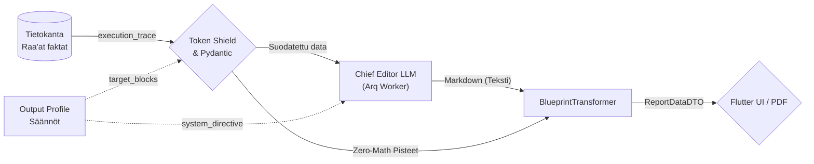
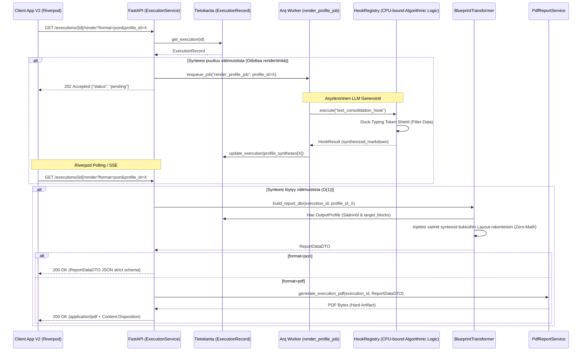

# 08: Dynaaminen Tulostusmoottori ja Osiokohtainen Synteesi

Tämä dokumentti kuvaa järjestelmän uusimman "Dynamic Rendering Engine" (tulostusmoottori) -arkkitehtuurin, joka erottaa tiedonkeruun työnkulun ja sen kielellisen generoinnin sekä visuaalisen asettelun toisistaan.

Kaikki toiminnallisuudet perustuvat tiukkaan "Backend-For-Frontend" (BFF) -jakoon, jossa palvelin ratkaisee raporttien lopullisen JSON- ja PDF-muodon (Zero-Math UI) turvallisesti erikseen eristetyssä Asynkronisessa Worker-prosessissa.

## 1. Arkkitehtuurin Pääkomponentit

Nykyaikainen tulostusarkkitehtuuri nojaa seuraaviin kerroksiin:

1. **`ExecutionService` (API Facade):** 
   Vastaa ohjaamaan pyyntöjä joko suoraan `BlueprintTransformer`ille taikka pollausta vaativaan `Arq Worker` -pohjaiseen taustatyöhön (`render_profile_job`), riippuen valitun tulostusprofiilin (`OutputProfile`) välimuistitilanteesta.
   
2. **Osiokohtainen Synteesivälimuisti (`profile_syntheses`):**
   `ExecutionRecord` on varustettu dynaamisella sanakirjalla (`dict[str, RenderedSynthesisCache]`). Yhdellä työnkululla (DAG) kerätty puhdas "Event Sourced" -tieto voidaan ajaa satojen erilaisten profiilien (esim. lyhyt Executive Summary tai pitkä 3D-data) läpi täysin toisistaan riippumatta ylikirjoittamatta synteesejä.

3. **Arq Worker (`render_profile_job`):**
   Jos pyydetyn profiilin mukaista synteesiä ei vielä löydy tietokannasta, pyyntö palautetaan välittömästi HTTP `202 Accepted` ("pending") -tilassa (SSE/Polling rajapintaedellytys). Taustatyöntekijä hyödyntää puhtaasti "CPU-bound algorithmic logic" -komponenttina toimivaa `HookRegistry`ä (erityisesti determinististä `text_consolidation_hook` asynkronista suoritusta), tuottaakseen raskaat LLM-tekstit sekoittamatta synkronisia I/O -kutsuja API-kerrokseen, ja liittää ne vasta paikalleen. Tämän synteesin valmistuttua, `render_profile_job` päätteeksi Arq Worker enqueuettaa automaattisesti PDF-tuotannon uuteen työhön (`await redis.enqueue_job("generate_pdf_job", ...)`).

4. **Arq Worker (`generate_pdf_job`):**
   Uusi ketjutettu PDF-Background Worker, joka vastaanottaa valmiit synteesit. **Syy:** Tämä hajauttaa kielellisen generoinnin ja visuaalisen asettelun (Zero-Math PDF) eri asynkronisiin työprosesseihin suorituskyvyn takaamiseksi.

5. **`BlueprintTransformer` (BFF DTO Mapper & 3D Matrix Projection):**
   Kun synteesi ja data on koossa, Blueprint ottaa haltuun raakadatan (`FrozenContext`) sekä raporttipohjan (`OutputProfile`). Se pakkaa "Zero-Math" säännöillä paitsi perinteiset akselitiedot, myös täydellisen tuen 3D-matriisivisualisoinnille (kuten Illusion Detector ja hajontakuviot). Transformer mappaa saumattomasti edistyneet XAI-laajennukset (falsifikaatio, coaching, remediation, sentiment) ja matriisikohtaiset PromptBlock-arvosanat suoraan valmiiseen `ReportDataDTO` muotoon. Tämä mahdollistaa moniulotteisten 3D-näkymien renderöinnin Frontendissa (tai PDF-moottorissa) täysin ilman asiakaspuolen laskentaa (Zero-Math UI).

### 1.1 Yhteenveto (Data Flow)
Koko dynaaminen tulostusketju etenee askeleittain seuraavasti:
1. **Tietokanta antaa raa'an historian:** Työnkulun koko `execution_trace` luetaan sellaisenaan.
2. **Pydantic & Token Shield suodattaa:** `OutputProfile`n asetukset (kuten `target_blocks`) aktivoivat Token Shieldin. Pydantic varmistaa, että vain profiilin sallima, tarpeellinen data pääsee eteenpäin ilman LLM:n token-tukkeumaa.
3. **Markdown-synteesi (Chief Editor LLM):** Tämä suodatettu, puhdas Pydantic-data syötetään uuden Arq Worker -taustatehtävän (`text_consolidation_hook`) avulla Chief Editor LLM:lle. Output Profile ohjeistaa tekoälyä roolilla (esim. "Senior Executive Coach") kirjoittamaan yhtenäinen asiantuntijateksti lennosta suoraan kovan datan pohjalta.
4. **BlueprintTransformer (Lopullinen yhdistäminen):** `BlueprintTransformer` ottaa Pydanticista numeeriset pisteet (Frontendin *Zero-Math UI* -matriiseja varten) ja uuden Bleach-sanitoidun Markdown-dokumentin, kooten ne yhdeksi turvalliseksi `ReportDataDTO` -paketiksi, joka siirtyy suoraan Flutteriin tai PDF-generaattoriin.

**Datan Muutosputki (Data Transformation Pipeline):**


## 2. Tulostusprosessi (Mermaid Visualisointi)

Alla on arkkitehtoninen Sequence-verkko, joka kuvaa koko tulostusprosessin (`/render` endpoint) reitityksen sekä Omni-Channel HTTP -käyttäytymisen UI:lle tai PDF-tuotannolle:



## 3. Keskeiset turvallisuus- ja skaalautuvuusvarmitukset

* **Fail-Fast reititys:** Esim. `test_integration_real_llm.py` on osoitus siitä, että jos Arq epäonnistuu kielellisessä synteesissä tai tietokannan profiilia ei löydy, järjestelmä palauttaa ehdottoman validointivirheen (AppException/Pydantic `ValidationError`) sen sijaan että UI kaatuisi mystiseen tyhjään ruutuun. `/render` endpoint palauttaa lisäksi aina asynkronisessa vaiheessa `HTTP 202 Accepted` ("pending"), minimoiden turhat polling-virheet.
* **Storage Fallback Mechanism:** Jos PDF haetaan oletusprofiililla ja sen staattinen tiedostopolku (`pdf_report_path`) on turmeltunut tallennustilasta, `ExecutionService` "parantaa itsensä" rinnakkaisesti fallback-reitillä; synkronisesti regeneroiden puuttuvan tiedoston levylle lennosta (tuottaen lokeihin varoituksen `[ExecutionService] Self-healed missing PDF`).
* **Pariteetti-Sopimus:** Kaikki Flutter-mallit lukevat JSONia 1:1 `ReportDataDTO` -rungolla, jolloin PDF ja selain pohjautuvat matemaattisesti virheettömästi täsmälleen samaan loogiseen puuhun.

## 4. Hard Artifact Testing Protocol (Visuaalisen Regression Hallinta)

Koko tulostusarkkitehtuurin (Dynamic Rendering Engine) elinehto on sen täydellinen determinismi. Koska järjestelmä ajaa jopa PDF-generoinnin suoraan samasta `ReportDataDTO` puusta kuin selainkäyttöliittymä, E2E-testauksessa noudatetaan pakollista **Hard Artifact Testing Protocol** -standardia:

1. **DB Mockaus (Kustannus & Nollaviive):** Ulkoinen I/O-riippuvuus ja LLM-generointi ohitetaan E2E-testeissä syöttämällä renderöintimoottorille 100 % deterministinen `ExecutionRecord`-mock. Nämä luodaan automaattisesti `polyfactory`-kirjastolla turvatun Pydantic-validoinnin kautta, jolloin käsintehtyjen mock-kokoelmien virheellisyys poistuu (vähintään `test_pdf_generator.py` säännöissä). Tämä takaa nanosekuntitason suoritusnopeuden eristetyssä ympäristössä.
2. **Kova Tiedosto (Visuaalinen Regressio):** Pelkkä tyyppitarkastus (`assert isinstance(pdf_bytes, bytes)`) on kielletty yksinomaisena laadunvarmistuksena Output Management -kerroksessa, sillä se ei paljasta esim. layout-katkoksista tai tyhjistä viiksistä johtuvia visuaalisia regressioita. Testien (kuten `test_pdf_generator.py` ja `test_e2e_orchestration.py`) on aina injektoitava mocked-data aitoon PDF-moottoriin saakka ja kirjoitettava tuotos fyysiseksi `test_report.pdf` -tiedostoksi levylle.
3. **Koneluettava Audiotoitavuus:** Tästä kovalevylle pudotettavasta artefaktista järjestelmäarkkitehdit, katselmoijat ja tekoälyagentit pystyvät visuaalisesti ja forensisesti tarkastamaan, että uudet layout-laajennukset sijoittuvat oikein rikkomatta aikaisempaa renderöintiä – vaarantamatta CI/CD-automaatiota.

## 5. Tiedonkeruun ja Synteesin Tietomalli (Token Optimization)

Koska raporttisynteesi perustuu tekoälymallien LLM-analyysiin, olemme rakentaneet kolmikerroksisen suojamekanismin varmistamaan, ettei puhtaan tekstin synteesi tukehdu raakadataan (nk. *Token Explosion*).

### A. Amnesia Protocol (Binäärin tuhoaminen, PII eristys ja Trace-tallennus)
Kun järjestelmään syötetään massiivisia lausuntoja (esim. PDF/Word-tiedostoja), Eager Extraction tapahtuu välittömästi synkronisella API-reititinkerroksella (tai ulkoisella uuttajalla) ennen varsinaista suoritusta. Raskas muistia kuormittava binääridata ei koskaan päädy järjestelmän ytimeen saakka, sillä `WorkflowInputs` -toimialuemalli (Domain Model) estää tämän tiukalla `prevent_base64_pollution` Pydantic `@model_validator` -säännöllä. Jos `content_base64` havaitaan, järjestelmä kaatuu välittömästi (Fail-Fast `AppException`), suojellen tietokantaa ja RAM-muistia. Näin ollen dynaamista uudelleensynteesiä voidaan suorittaa jopa vuosia myöhemmin lataamatta megatavukaupalla puhdasta koodiroskaa välimuistiin. Kaikki inputit tallentuvat lähtökohtaisesti `execution_trace` taulukkoon `TraceEvent(event_type="input")` kapselissa. Kun `ExecutionRecord.execution_trace` kasvaa liian suureksi, se tallennetaan erikseen tiedostojärjestelmään/levylle GCS-bucketin sijaan `execution_trace_storage_path` -viitteen kautta Token Explosion -tukkeumien poistamiseksi jopa tietokannan päästä.

### B. Duck-Typing Token Shield (Token Exhaustion Suojamuuri)
Backendin suurin arkkitehtuurinen riski dynaamisessa tulostuksessa on koko `execution_trace` laatikon sokkosyöttö LLM-mallille, mikä laukaisee API-tarjoajalla (esim. Vertex AI) "Resource Exhausted" 400 -virheen ja tukkii yli miljoonan tokenin rajat sekunneissa. Tämä estetään **"Duck-Typing Token Shield"** kerroksella:
1. **Säännötön Imurointi (Wildcard `*`):** Jos UI pyytää kaikki osiot, Token Shield ei hae kaikkea dataa, vaan iteratiivisesti poimii ainoastaan Pydantic-solmut, joista löytyy tekoälyn luoma `reasoning_trace`. Tämä on **LLM-stepin diskriminaattori** — kaikki LLM-suoritusstepit emittoivat sen dynaamisessa schemassa (`prompt_compiler.py`), mutta `raw_inputs`, `inputs` ja logic-nodet eivät. Token Shield käyttää `SynthesisStepDataDTO` DTO:ta diskriminointiin (`extra="ignore"` — vain `reasoning_trace`-kentän tarkistus).
   > **Tärkeä yksityiskohta:** Tarkistus tehdään `is None` -vertailulla (ei falsy `not`), koska tyhjä merkkijono on kelvollinen LLM-output tietyillä malleilla. Näin yhden stepin poisjääminen synteesistä ei tapahdu tyhjän thinking-outputin vuoksi.
   > **Arkkitehtuurinen Poikkeus (Graceful Degradation):** `extra="ignore"` -asetuksen käyttö Token Shieldissä rikkoo järjestelmän laajuista `extra="forbid"` Fail-Fast -sääntöä. Tämä kompromissi on kuitenkin pakollinen: sen avulla valtavat, miljoonien tokenien `execution_trace` -puut voidaan siivilöidä turvallisesti läpi sokkona, pudottaen raskaat rakenteet hiljaisesti pois ilman kaatumista tuntemattomiin Pydantic-avaimiin.
2. **Erikoiskohteistettu Kutsu (Explicit `target_blocks`):** Jos UI hakee raporttiin vain tiettyjä palikoita (esim. `["python_math_score", "report_metadata"]`), Token Shield ohittaa wildcard asiantuntijalogian ja purkaa Pydantic `frozen_context` rakenteesta natiivisti vain tasan nuo erikoisavaimet kielelliseen tulkkaukseen ilman muun malliston sotkeentumista päälle.
3. **Raskaan datan poisto ennen LLM-kutsua (`_compress_synthesis_payload`):** Ennen LLM-kutsuhetkiä poistuu kentät `shuffled_atoms`, `evaluations`, `quote` ja `reasoning`, jotka voivat sisältää satoja atomeja tai pitkiä ketjupäättelylokeja. Näin Chief Editor -LLM saa vain olennaisen: perustelut ja pisteet.

## 6. Zero-Compromise Export & Reporting (Epic 41)

Tulostusmoottorin vienti- ja raportointiarkkitehtuuri noudattaa "HTML First" ja Zero-Compromise periaatteita varmistaakseen, että PDF- ja ruututulosteet ovat täysin vakaita ja heijastavat absoluuttista Pydantic-tietomallia:

### 6.1 Datan Eheyden Varmistaminen (StrictMatrixPayload)
* **Fail-Fast ja Tyyppiturvallisuus:** Järjestelmän tietokannasta luettava ajodata (ExecutionRecords) puretaan ehdottoman tiukasti `StrictMatrixPayload` -rakenteita noudattaen aina tiedon synnystä lopulliseen tulosteeseen saakka.
* Koodissa ei sallita hiljaisia `except Exception: pass` -suodattimia ("God Blocks"), jotka piilottaisivat matriisidatan rakenteelliset virheet.
* **Eksplisiittinen Tyyppikastaus:** Matriisien syvädataa luettaessa vältetään Mypy:n hylkäämä dynaaminen `union-attr` duck-typing. Tieto tyypitetään eksplisiittisesti (esim. `dict[str, Any]`), jotta varmistutaan tiedon virheettömästä siirtymisestä tietokannasta tulostusmoottorille ilman tiedonhäviötä. Kaikki validointivirheet (`ValidationError`) lokitetaan välittömästi, mikä estää viallisen tiedon päätymisen asiakasraportteihin.

### 6.2 Raporttien Tulostus-API ja HTML Pariteetti (HTML-First Export Strategy)
* **HTML First ja PDF:n Selaindelegointi:** Paikallisten Weasyprint (GTK3) -kaatumisten estämiseksi Windows-ympäristöissä tulostusmoottori tukee formaattia `format=html` suoraan `ExecutionService` -reitittimestä (`/render`). Tämä eriyttää HTML-templatoinnin raskaasta PDF-renderöinnistä, jolloin backend voi palauttaa raa'an HTML:n ja delegoida PDF-konversion suoraan selaimelle (esim. Flutter `url_launcher` tai natiivi print-to-pdf). Tämä ohittaa backendin Weasyprint-rajoitteet lokaalissa kehityksessä täysin ja takaa nopeat, kaatumattomat testausiteraatiot.
* **Yhtenäinen API-rajapinta:** PDF:n tai kauniin HTML-raportin generointiin ei tueta erillisiä lokaaleja CLI-purkkaskriptejä. Kaikki raportit tuotetaan yksinomaan järjestelmän ydinrajapintojen (`BlueprintTransformer` + `HtmlReportService` / `PdfReportService`) kautta, jotta tulosteiden visuaalinen ja tietosisällöllinen renderöinti on aina täydellisesti linjassa tuotannon kanssa.
* **Fail-Fast Badges (Epic 42):** PDF-generaattorin Jinja2-raporttipohjat (`report_template.jinja2`) lukevat suoraan `ReportDataDTO`:n paljastamaa `strictness_level` ja `axis.evidence_type` -dataa. Näin PDF-raportit renderöivät samat visuaaliset badget (esim. "✅ Explicit Quote" tai "⚠️ Implied Intent") ja ankaruustason ilmoitukset identtisesti Flutter-työpöytäsovelluksen (SDUI) kanssa, tuoden Zero-Math UI:n myös paperitulosteisiin.

### 6.3 XAI-Datan ja Matriisikoontitaulukon Synteesi
* Loppuraportti (`report_template.jinja2`) tuottaa visuaalisessa muodossa 1:1 asiakaskäyttöliittymän (Flutter SDUI) kanssa kaikki matriisien syvälaajennukset (kuten Valmennusvinkit, Sävy ja Korjaustoimenpiteet). Tieto virtaa rikkomattomasti `ReportDataDTO`:n kautta.
* **Kattava Matriisikoontitaulukko (Summary Table):** Raportin loppuun renderöidään automaattisesti kattava taulukko-osio. Se kokoaa matriisien tasot (esim. T1-T6), lyhyet perustelut ja skaalatut prosenttiarvot tiiviiksi yhteenvedoksi, muodostaen loogisen ja kauniin loppuyhteenvedon tuotettavalle dokumentille.

### C. Multi-Profile Caching & On-Demand Reprocessing (FinOps)
Koko järjestelmä tallentaa kalliin prosessin vain kerran `ExecutionRecord.execution_trace` taulukkoon Pydantic Event Sourcing -mallilla.
Kun tietty Output Profile (esim. Johdon Tiivistelmä) on prosessoitu, LLM:n palauttama DTO (`RenderedSynthesisCache`) välimuistitetaan ikuiseksi osaksi itse `ExecutionRecord` -tietuetta (`profile_syntheses["prof_executive"]`).
Käyttäjä voi kuitenkin pyytää renderöinnin katselunäkymästä uuden tiivistelmän viikkoa myöhemmin toisella konfiguraatiolla (esim. "Syvä tekninen"). Tällöin järjestelmä ohittaa vanhan välimuistin uudelleenreitityksellä, noukkii vanhan raakadatan yhdellä tietokantahaulla ja puskee sen Token Shieldin läpi uudeksi DTO:ksi (esim. `profile_syntheses["prof_tech"]`), ilman että ainuttakaan alkuperäistä kognitiivista analyysi-agenttia herätetään uudelleen.

## 7. SDUI-Renderöinnin Tarkat Säännöt (`BlueprintTransformer`)

`BlueprintTransformer.build_report_dto()` on universaali BFF-muuntaja, joka palvelee **sekä Flutter-näyttöä että PDF-generointia samasta `ReportDataDTO`-rakenteesta** (täydellinen pariteetti).

### A. Block-suodatus — Fail-Fast rajapinta
Stepin tuloksesta lähetetään `ReportAxisDTO`:ksi **vain** ne avaimet, joilla löytyy vastaava `PromptBlock` tietokannasta (tai legacy `score`-avain):
```python
block = blocks_by_id.get(k)
if not block and not is_legacy_score:
    continue  # reasoning_trace, _step_metadata, jne. suodatetaan POIS
```
Tämä takaa, että sisäiset diagnostiikkakentät (`reasoning_trace`, `_step_metadata`, `_evaluative_matrices`) eivät koskaan vuoda käyttöliittymälle. Lisäksi (Epic 42 myötä) `BlueprintTransformer` kerää solmun atomi-datasta eksplisiittisesti `step_1_evidence_type` -kentän ja asettaa sen suoraan DTO-kerrokselle (`evidence_type`), tehden Zero-Trust evidenssistä ensimmäisen luokan kansalaisen SDUI:ssa.

### B. Grand Unification & Zero-Math UI Mandate (Phase 9)
Raportointiarkkitehtuuri on yhdistetty täydellisesti (Grand Unification), mikä tarkoittaa absoluuttista Fail-Fast-pariteettia Backendin ja Frontendin (sekä PDF-moottorin) välillä:
1. **Zero-Math UI:** Frontend (Flutter) ja PDF-generaattori eivät suorita lainkaan matemaattisia operaatioita. Kaikki UI:n tarvitsemat laskennalliset arvot (esim. `uiPlotRatio`, numeerinen skaalaus ja prosentit) on esilaskettu backendissä.
2. **Dynaamiset Tasojakaumat:** Matriisien jakaumat (esim. pisteet 1-6 ja niitä vastaavat selitteet) iteroidaan suoraan backendin tarjoamasta `levelBreakdown`-kartasta (esim. `Map<String, String>`). Käyttöliittymään ei kovakoodata käännösavaimia "Level 1", "Level 2" jne., vaan sisältö tulee 100% backendiltä Pydantic-mallien läpi.
3. **Fail-Fast Pydantic V2:** Frontendin DTO:t noudattavat strict-tilassa Pydantic V2:n sääntöjä (esim. `extra="forbid"`). "Graceful degradation" eli oletusarvojen (esim. `score ?? 0.0`) käyttö käyttöliittymässä on kielletty (The Anti-TDD Trap). Jos tieto on viallista, järjestelmän tulee kaatua backendissä, eikä paikata virheitä UI-tason null-checkeillä.
4. **Ei Hallusinoitua Matematiikkaa:** Kielelliset perustelut (`justification`) puhdistetaan Regex-suodattimilla, jotta LLM:n hallusinoimat raakapisteet (esim. "[Pisteet: 4/5]") eivät vuoda tekstin sekaan. Pisteet näytetään vain determinististen DTO-kenttien kautta (esim. `score` ja `scaleMax`).

### C. Skaalauksen kolme tilaa (`display_scale`)

| `display_scale` | Pistelähde | Rajat UI:lle |
|---|---|---|
| `original` | `raw_score` | DB:n `computed_min` / `computed_max` |
| `custom` | `raw_score` | DB:n `scale_min` / `scale_max` |
| `normalized_100` | `normalized_score` | 0 – 100 |

Backend laskee `ui_plot_ratio` valmiiksi:
```python
ui_plot_ratio = (score_float - scale_min) / (scale_max - scale_min)
```
Flutter ei tee matematiikkaa — se renderöi suoraan saadun suhdeluvun (Zero-Math UI -mandaatti).

### C. Akselijärjestys — `target_blocks` määrää
`OutputProfile.layouts[n].target_blocks` -lista määrää akselijärjestyksen **täsmälleen** Admin Studion määrittämässä järjestyksessä:
```python
for target_k in target_blocks:          # UI:n määräämä järjestys
    for unique_k, axis_dto in unsorted_axes.items():
        if unique_k.endswith(f"_{target_k}"):
            axes.append(axis_dto)        # akseli lisätään oikeaan kohtaan
```
Wildcard (`*`) → akselijärjestys on DAG:n steppijärjestys (ei-determininen).

### D. Minimiakseli-vaatimukset — Fail-Fast
```python
if preset_view == "3d_complex" and len(axes) < 3:
    raise AppException(...)   # kaatuu ennen UI-renderöintiä
elif preset_view == "2d_compare" and len(axes) < 2:
    raise AppException(...)
```
Jos layout-konfiguraatio on virheellinen, järjestelmä kaatuu backendissä, ei Flutterissa.

### E. XAI Extensions ja Grouped Highlights
`OutputProfile.visible_extensions` määrää mitä XAI-laajennusryhmiä populoidaan:
```python
visible_extensions = [v.value for v in profile.visible_extensions]
grouped_extensions = {ext: [] for ext in visible_extensions}
# ... highlight.extension_type → grouped_extensions[group_key].append(highlight)
```
Extension-data poimitaan V2-skeemasta nested dict -rakenteesta:
```python
ext_dict = v.get("extensions", {})
coaching = ext_dict.get("coaching")     # 11 extension-kenttää
falsification = ext_dict.get("falsification")
risk_flag = ext_dict.get("risk_flag")
# ...
```

### F. XSS-suojaus (bleach) ennen PDF/SDUI
Synthesisoitu markdown sanitoidaan Bleach-kirjastolla ennen `ReportDataDTO`-konstruktiota:
```python
safe_md = bleach.clean(str(synthesis_md), tags=allowed_tags, attributes=allowed_attributes, strip=True)
```
Sallittu tagisetti kattaa kaikki markdown-muuntimet (`h1`–`h6`, `p`, `table`, `blockquote`, jne.) mutta poistaa `<script>` ja muut XSS-vektorit.

<br><hr>

➡️ **Seuraavaksi:** Frontend on nyt selvä. Seuraavaksi [09_data_persistence.md](./09_data_persistence.md) kertoo, miten koko tämä massiivinen tiedon määrä (suoritukset ja työnkulut) tallennetaan tietokantaan Append-Only -mallilla.
