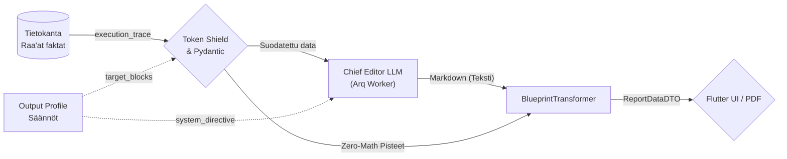
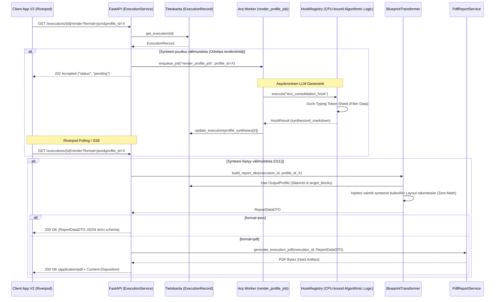

# 08: Dynaaminen Tulostusmoottori ja Osiokohtainen Synteesi

Tämä dokumentti kuvaa järjestelmän uusimman "Dynamic Rendering Engine" (tulostusmoottori) -arkkitehtuurin, joka erottaa tiedonkeruun työnkulun ja sen kielellisen generoinnin sekä visuaalisen asettelun toisistaan.

Kaikki toiminnallisuudet perustuvat tiukkaan **Backend-For-Frontend (BFF)** -jakoon, jossa palvelin ratkaisee raporttien lopullisen JSON- ja PDF-muodon (Zero-Math UI) turvallisesti erikseen eristetyssä Asynkronisessa Worker-prosessissa.

## 1. Arkkitehtuurin Pääkomponentit

Nykyaikainen tulostusarkkitehtuuri nojaa seuraaviin kerroksiin:

1. **`ExecutionService` (API Facade):** 
   Vastaa ohjaamaan pyyntöjä joko suoraan `BlueprintTransformer`ille taikka pollausta vaativaan `Arq Worker` -pohjaiseen taustatyöhön (`render_profile_job`), riippuen valitun tulostusprofiilin (`OutputProfile`) välimuistitilanteesta.
   
2. **Osiokohtainen Synteesivälimuisti (`profile_syntheses`):**
   `ExecutionRecord` on varustettu dynaamisella sanakirjalla (`dict[str, RenderedSynthesisCache]`). Yhdellä työnkululla (DAG) kerätty puhdas "Event Sourced" -tieto voidaan ajaa satojen erilaisten profiilien (esim. lyhyt Executive Summary tai pitkä 3D-data) läpi täysin toisistaan riippumatta ylikirjoittamatta synteesejä.
   * Tämän välimuistin kenttä `section_syntheses` (`dict[str, str]`) sisältää layout-kohtaiset LLM-tekstit. Kun `BlueprintTransformer` rakentaa layoutteja, se hakee `layout_id = f"layout_{idx}_{preset_view}"` avaimella tarkan osiokohtaisen synteesin ja injektoi sen `ReportLayoutDTO.synthesis_md` -kenttään.

3. **Arq Worker (`render_profile_job`):**
   Jos pyydetyn profiilin mukaista synteesiä ei vielä löydy tietokannasta, pyyntö palautetaan välittömästi HTTP `202 Accepted` ("pending") -tilassa (SSE/Polling rajapintaedellytys). Taustatyöntekijä hyödyntää puhtaasti "CPU-bound algorithmic logic" -komponenttina toimivaa `HookRegistry`ä (erityisesti determinististä `text_consolidation_hook` asynkronista suoritusta), tuottaakseen raskaat LLM-tekstit sekoittamatta synkronisia I/O -kutsuja API-kerrokseen, ja liittää ne vasta paikalleen. Tämän synteesin valmistuttua, `render_profile_job` päätteeksi Arq Worker enqueuettaa automaattisesti PDF-tuotannon uuteen työhön (`await redis.enqueue_job("generate_pdf_job", ...)`).

4. **Arq Worker (`generate_pdf_job`):**
   Uusi ketjutettu PDF-Background Worker, joka vastaanottaa valmiit synteesit. **Syy:** Tämä hajauttaa kielellisen generoinnin ja visuaalisen asettelun (Zero-Math PDF) eri asynkronisiin työprosesseihin suorituskyvyn takaamiseksi.

5. **`BlueprintTransformer` (BFF DTO Mapper & 3D Matrix Projection):**
   Kun synteesi ja data on koossa, Blueprint ottaa haltuun raakadatan (`FrozenContext`) sekä raporttipohjan (`OutputProfile`). Se pakkaa "Zero-Math" säännöillä paitsi perinteiset akselitiedot, myös täydellisen tuen 3D-matriisivisualisoinnille (kuten Illusion Detector ja hajontakuviot). Transformer mappaa saumattomasti edistyneet XAI-laajennukset ja matriisikohtaiset arvosanat suoraan valmiiseen `ReportDataDTO` muotoon. Tämä mahdollistaa moniulotteisten 3D-näkymien renderöinnin Frontendissa (tai PDF-moottorissa) täysin ilman asiakaspuolen laskentaa (Zero-Math UI).

### 1.1 Yhteenveto (Data Flow)
Koko dynaaminen tulostusketju etenee askeleittain seuraavasti:
1. **Tietokanta antaa raa'an historian:** Työnkulun koko `execution_trace` luetaan sellaisenaan.
2. **Pydantic & Token Shield suodattaa:** `OutputProfile`n asetukset (kuten `target_blocks`) aktivoivat Token Shieldin. Pydantic varmistaa, että vain profiilin sallima, tarpeellinen data pääsee eteenpäin ilman LLM'n token-tukkeumaa.
3. **Markdown-synteesi (Chief Editor LLM):** Tämä suodatettu, puhdas Pydantic-data syötetään uuden Arq Worker -taustatehtävän (`text_consolidation_hook`) avulla Chief Editor LLM:le. Output Profile ohjeistaa tekoälyä roolilla kirjoittamaan yhtenäinen asiantuntijateksti lennosta suoraan kovan datan pohjalta.
4. **BlueprintTransformer (Lopullinen yhdistäminen):** `BlueprintTransformer` ottaa Pydanticista numeeriset pisteet (Frontendin *Zero-Math UI* -matriiseja varten) ja uuden Bleach-sanitoidun Markdown-dokumentin, kooten ne yhdeksi turvalliseksi `ReportDataDTO` -paketiksi, joka siirtyy suoraan Flutteriin tai PDF-generaattoriin.

**Datan Muutosputki (Data Transformation Pipeline):**


## 2. Tulostusprosessi (Mermaid Visualisointi)

Alla on arkkitehtoninen Sequence-verkko, joka kuvaa koko tulostusprosessin (`/render` endpoint) reitityksen sekä Omni-Channel HTTP -käyttäytymisen UI:lle tai PDF-tuotannolle:



## 3. Keskeiset turvallisuus- ja skaalautuvuusvarmitukset

* **Fail-Fast reititys:** Jos Arq epäonnistuu kielellisessä synteesissä tai tietokannan profiilia ei löydy, järjestelmä palauttaa ehdottoman validointivirheen (AppException/Pydantic `ValidationError`) sen sijaan että UI kaatuisi mystiseen tyhjään ruutuun. `/render` endpoint palauttaa lisäksi aina asynkronisessa vaiheessa `HTTP 202 Accepted` ("pending"), minimoiden turhat polling-virheet.
* **Storage Fallback Mechanism:** Jos PDF haetaan oletusprofiililla ja sen staattinen tiedostopolku (`pdf_report_path`) on turmeltunut tallennustilasta, `ExecutionService` "parantaa itsensä" rinnakkaisesti fallback-reitillä; synkronisesti regeneroiden puuttuvan tiedoston levylle lennosta (tuottaen lokeihin varoituksen `[ExecutionService] Self-healed missing PDF`).
* **Pariteetti-Sopimus:** Kaikki Flutter-mallit lukevat JSONia 1:1 `ReportDataDTO` -rungolla, jolloin PDF ja selain pohjautuvat matemaattisesti virheettömästi täsmälleen samaan loogiseen puuhun.

## 4. Hard Artifact Testing Protocol (Visuaalisen Regression Hallinta)

Koko tulostusarkkitehtuurin (Dynamic Rendering Engine) elinehto on sen täydellinen determinismi. Koska järjestelmä ajaa jopa PDF-generoinnin suoraan samasta `ReportDataDTO` puusta kuin selainkäyttöliittymä, E2E-testauksessa noudatetaan pakollista **Hard Artifact Testing Protocol** -standardia:

1. **DB Mockaus (Kustannus & Nollaviive):** Ulkoinen I/O-riippuvuus ja LLM-generointi ohitetaan E2E-testeissä syöttämällä renderöintimoottorille 100 % deterministinen `ExecutionRecord`-mock. Nämä luodaan automaattisesti `polyfactory`-kirjastolla turvatun Pydantic-validoinnin kautta. Tämä takaa nanosekuntitason suoritusnopeuden eristetyssä ympäristössä.
2. **Kova Tiedosto (Visuaalinen Regressio):** Pelkkä tyyppitarkastus on kielletty yksinomaisena laadunvarmistuksena Output Management -kerroksessa. Testien on aina injektoitava mocked-data aitoon PDF-moottoriin saakka ja kirjoitettava tuotos fyysiseksi `test_report.pdf` -tiedostoksi levylle.
3. **Koneluettava Audiotoitavuus:** Tästä kovalevylle pudotettavasta artefaktista järjestelmäarkkitehdit, katselmoijat ja tekoälyagentit pystyvät visuaalisesti ja forensisesti tarkastamaan, että uudet layout-laajennukset sijoittuvat oikein rikkomatta aikaisempaa renderöintiä.

## 5. Tiedonkeruun ja Synteesin Tietomalli (Token Optimization)

Koska raporttisynteesi perustuu tekoälymallien LLM-analyysiin, olemme rakentaneet kolmikerroksisen suojamekanismin varmistamaan, ettei puhtaan tekstin synteesi tukehdu raakadataan (nk. *Token Explosion*).

### A. Amnesia Protocol (Binäärin tuhoaminen, PII eristys ja Trace-tallennus)
Kun järjestelmään syötetään massiivisia lausuntoja (esim. PDF/Word-tiedostoja), Eager Extraction tapahtuu välittömästi synkronisella API-reititinkerroksella (tai ulkoisella uuttajalla) ennen varsinaista suoritusta. Raskas muistia kuormittava binääridata ei koskaan päädy järjestelmän ytimeen saakka, sillä `WorkflowInputs` -toimialuemalli estää tämän tiukalla `prevent_base64_pollution` Pydantic `@model_validator` -säännöllä. Jos `content_base64` havaitaan, järjestelmä kaatuu välittömästi (Fail-Fast `AppException`). Kaikki inputit tallentuvat lähtökohtaisesti `execution_trace` taulukkoon `TraceEvent(event_type="input")` kapselissa. Kun `ExecutionRecord.execution_trace` kasvaa liian suureksi, se tallennetaan erikseen tiedostojärjestelmään/levylle GCS-bucketin sijaan `execution_trace_storage_path` -viitteen kautta Token Explosion -tukkeumien poistamiseksi.

### B. Duck-Typing Token Shield (Token Exhaustion Suojamuuri)
Backendin suurin arkkitehtuurinen riski dynaamisessa tulostuksessa on koko `execution_trace` laatikon sokkosyöttö LLM-mallille, mikä laukaisee API-tarjoajalla (esim. Vertex AI) "Resource Exhausted" 400 -virheen ja tukkii yli miljoonan tokenin rajat sekunneissa. Tämä estetään **"Duck-Typing Token Shield"** kerroksella:
1. **Säännötön Imurointi (Wildcard `*`):** Jos UI pyytää kaikki osiot, Token Shield ei hae kaikkea dataa, vaan iteratiivisesti poimii ainoastaan Pydantic-solmut, joista löytyy tekoälyn luoma `reasoning_trace`. Tämä on **LLM-stepin diskriminaattori** — kaikki LLM-suoritusstepit emittoivat sen dynaamisessa schemassa (`prompt_compiler.py`), mutta `raw_inputs`, `inputs` ja logic-nodet eivät. Token Shield käyttää `SynthesisStepDataDTO` DTO:ta diskriminointiin (`extra="ignore"` — vain `reasoning_trace`-kentän tarkistus).
   * *Tärkeä yksityiskohta:* Tarkistus tehdään `is None` -vertailulla (ei falsy `not`), koska tyhjä merkkijono on kelvollinen LLM-output tietyillä malleilla. Näin yhden stepin poisjääminen synteesistä ei tapahdu tyhjän thinking-outputin vuoksi.
   * *Arkkitehtuurinen Poikkeus (Graceful Degradation):* `extra="ignore"` -asetuksen käyttö Token Shieldissä rikkoo järjestelmän laajuista `extra="forbid"` Fail-Fast -sääntöä. Tämä kompromissi on kuitenkin pakollinen: sen avulla valtavat `execution_trace` -puut voidaan siivilöidä turvallisesti läpi, pudottaen raskaat rakenteet hiljaisesti pois ilman kaatumista.
2. **Erikoiskohteistettu Kutsu (Explicit `target_blocks`):** Jos UI hakee raporttiin vain tiettyjä palikoita, Token Shield ohittaa wildcard asiantuntijalogian ja purkaa Pydantic `frozen_context` rakenteesta natiivisti vain tasan nuo erikoisavaimet kielelliseen tulkkaukseen ilman muun malliston sotkeentumista päälle.
3. **Raskaan datan poisto ennen LLM-kutsua (`_compress_synthesis_payload`):** Ennen LLM-kutsuhetkiä poistuu kentät `shuffled_atoms`, `evaluations`, `quote` ja `reasoning`, jotka voivat sisältää satoja atomeja tai pitkiä ketjupäättelylokeja. Näin Chief Editor -LLM saa vain olennaisen.

## 6. Zero-Compromise Export & Reporting (Epic 41)

Tulostusmoottorin vienti- ja raportointiarkkitehtuuri noudattaa "HTML First" ja Zero-Compromise periaatteita varmistaakseen, että PDF- ja ruututulosteet ovat täysin vakaita ja heijastavat absoluuttista Pydantic-tietomallia:

### 6.1 Datan Eheyden Varmistaminen (StrictMatrixPayload)
* **Fail-Fast ja Tyyppiturvallisuus:** Järjestelmän tietokannasta luettava ajodata (ExecutionRecords) puretaan ehdottoman tiukasti `StrictMatrixPayload` -rakenteita noudattaen aina tiedon synnystä lopulliseen tulosteeseen saakka.
* Koodissa ei sallita hiljaisia `except Exception: pass` -suodattimia ("God Blocks"), jotka piilottaisivat matriisidatan rakenteelliset virheet.
* **Eksplisiittinen Tyyppikastaus:** Matriisien syvädataa luettaessa vältetään Mypy:n hylkäämä dynaaminen `union-attr` duck-typing. Tieto tyypitetään eksplisiittisesti, jotta varmistutaan tiedon virheettömästä siirtymisestä tietokannasta tulostusmoottorille ilman tiedonhäviötä. Kaikki validointivirheet (`ValidationError`) lokitetaan välittömästi.

### 6.2 Raporttien Tulostus-API ja HTML Pariteetti (HTML-First Export Strategy)
* **HTML First ja PDF:n Selaindelegointi:** Paikallisten Weasyprint-kaatumisten estämiseksi Windows-ympäristöissä tulostusmoottori tukee formaattia `format=html` suoraan `ExecutionService` -reitittimestä (`/render`). Tämä eriyttää HTML-templatoinnin raskaasta PDF-renderöinnistä, jolloin backend voi palauttaa raa'an HTML:n ja delegoida PDF-konversion suoraan selaimelle (esim. Flutter `url_launcher` tai natiivi print-to-pdf). Tämä HTML-First -strategia ohittaa backendin Weasyprint-rajoitteet kehityksessä täysin ja takaa stabiiliuden. Tämä kutsuu taustalla `PdfReportService.generate_execution_html` -metodia, joka kokoaa DTO-datan valmiiksi itsenäiseksi HTML-dokumentiksi ja palauttaa sen tiedostona `execution_{execution_id}.html`.
* **Yhtenäinen API-rajapinta:** PDF:n tai kauniin HTML-raportin generointiin ei tueta erillisiä lokaaleja CLI-skriptejä. Kaikki raportit tuotetaan yksinomaan järjestelmän ydinrajapintojen (`BlueprintTransformer` + `HtmlReportService` / `PdfReportService`) kautta, jotta tulosteiden visuaalinen ja tietosisällöllinen renderöinti on aina täydellisesti linjassa.
* **Fail-Fast Badges (Epic 42):** PDF-generaattorin Jinja2-raporttipohjat (`report_template.jinja2`) lukevat suoraan `ReportDataDTO`:n paljastamaa `strictness_level` ja `axis.evidence_type` -dataa. Näin PDF-raportit renderöivät samat visuaaliset badget ja ankaruustason ilmoitukset identtisesti Flutter-työpöytäsovelluksen (SDUI) kanssa.

### 6.3 XAI-Datan ja Matriisikoontitaulukon Synteesi
* Loppuraportti tuottaa visuaalisessa muodossa 1:1 asiakaskäyttöliittymän kanssa kaikki matriisien syvälaajennukset (kuten Valmennusvinkit, Sävy ja Korjaustoimenpiteet). Tieto virtaa rikkomattomasti `ReportDataDTO`:n kautta.
* **Kattava Matriisikoontitaulukko (Summary Table):** Raportin loppuun renderöidään automaattisesti kattava taulukko-osio. Se kokoaa matriisien tasot, perustelut ja skaalatut prosenttiarvot tiiviiksi yhteenvedoksi.

### 6.4 Pariteetti Analytiikkaviennissä (Phase 4 PDF & Flat Forensics)
Jotta analytiikkavienti (CSV/JSON Flat Export) vastaa 100 % tarkkuudella visuaalista SDUI/PDF-tilaa, myös `flattener.py` kuluttaa Pydanticin `ReportDataDTO` -rungon (`MatrixScorecardRowDTO` -kerros) raa'an työnkulun (`execution_trace`) sijaan. Tämä varmistaa Zero-Math-tilan, jossa:
1. Matriisin globaali tulos ja varoitukset flatataan yksi-yhteen raporttidatan perusteella.
2. Atomi-tason (`MatrixScorecardRowDTO`) `status`, `semantic_reasoning`, `cited_text_quote` ja lähteet viedään taulukkoon suoraan Blueprintin tuottamasta turvallisesta DTO:sta ilman tuplalaskentaa tai vanhojen Markdown-lukkien avaamista.

### C. Multi-Profile Caching & On-Demand Reprocessing (FinOps)
Koko järjestelmä tallentaa kalliin prosessin vain kerran `ExecutionRecord.execution_trace` taulukkoon Pydantic Event Sourcing -mallilla.
Kun tietty Output Profile on prosessoitu, LLM:n palauttama DTO (`RenderedSynthesisCache`) välimuistitetaan ikuiseksi osaksi itse `ExecutionRecord` -tietuetta (`profile_syntheses["prof_executive"]`).
Käyttäjä voi kuitenkin pyytää renderöinnin katselunäkymästä uuden tiivistelmän viikkoa myöhemmin toisella konfiguraatiolla. Tällöin järjestelmä ohittaa vanhan välimuistin uudelleenreitityksellä, noukkii vanhan raakadatan yhdellä tietokantahaulla ja puskee sen Token Shieldin läpi uudeksi DTO:ksi, ilman että ainuttakaan alkuperäistä kognitiivista analyysi-agenttia herätetään uudelleen.

---

## 7. SDUI-Renderöinnin Tarkat Säännöt (`BlueprintTransformer`)

`BlueprintTransformer.build_report_dto()` on universaali BFF-muuntaja, joka palvelee **sekä Flutter-näyttöä että PDF-generointia samasta `ReportDataDTO`-rakenteesta** (täydellinen pariteetti).

### A. Block-suodatus — Fail-Fast rajapinta
Stepin tuloksesta lähetetään `ReportAxisDTO`:ksi **vain** ne avaimet, joilla löytyy vastaava `PromptBlock` tietokannasta (tai legacy `score`-avain):
```python
block = blocks_by_id.get(k)
if not block and not is_legacy_score:
    continue  # reasoning_trace, _step_metadata, jne. suodatetaan POIS
```
Tämä takaa, että sisäiset diagnostiikkakentät eivät koskaan vuoda käyttöliittymälle. Lisäksi `BlueprintTransformer` kerää solmun atomi-datasta eksplisiittisesti `step_1_evidence_type` -kentän ja asettaa sen suoraan DTO-kerrokselle (`evidence_type`), tehden Zero-Trust evidenssistä ensimmäisen luokan kansalaisen SDUI:ssa.

### B. Grand Unification & Zero-Math UI Mandate (Phase 9)
Raportointiarkkitehtuuri on yhdistetty täydellisesti, mikä tarkoittaa absoluuttista Fail-Fast-pariteettia Backendin ja Frontendin (sekä PDF-moottorin) välillä:
1. **Zero-Math UI:** Frontend (Flutter) ja PDF-generaattori eivät suorita lainkaan matemaattisia operaatioita. Kaikki UI:n tarvitsemat laskennalliset arvot on esilaskettu backendissä.
2. **Dynaamiset Tasojakaumat ja Selitteet:** Matriisien jakaumat ja selitteet iteroidaan 100 % dynaamisesti backendin tarjoamista kentistä `level_breakdown` (DINA-osumat vs kokonaismäärä per taso) ja `level_names` (pre-lokalisoitu tason nimi). Käyttöliittymään ei kovakoodata käännösavaimia, vaan sisältö ja kielen lokalisointi tulee suoraan Pydantic-mallien kautta.
3. **Fail-Fast Pydantic V2:** Frontendin DTO:t noudattavat strict-tilassa Pydantic V2:n sääntöjä (`extra="forbid"`). "Graceful degradation" eli oletusarvojen käyttö käyttöliittymässä on kielletty. Jos tieto on viallista, järjestelmän tulee kaatua backendissä, eikä paikata virheitä UI-tason null-checkeillä.
4. **Ei Hallusinoitua Matematiikkaa:** Kielelliset perustelut (`justification`) puhdistetaan Regex-suodattimilla, jotta LLM:n hallusinoimat raakapisteet eivät vuoda tekstin sekaan. Pisteet näytetään vain determinististen DTO-kenttien kautta.
5. **Osiokohtainen synthesis_md:** Jokainen raportin layout (`ReportLayoutDTO`) saa oman osiokohtaisen LLM-synteesinsä `synthesis_md` -kenttään, joka kaivetaan välimuistista (`section_syntheses`) dynaamisen yksilöllisen avaimen `f"layout_{idx}_{preset_view}"` kautta.
6. **XAI Contextual Override Visualisointiohjaus:**
   * Kun `contextual_override = True` palautetaan TDA-arvioinnista, `BlueprintTransformer` kytkee pois normaalin mekaanisen `exact_quote` -sitaattilaatikon renderöinnin kyseiselle akselille.
   * Tilalle `ReportAxisDTO`:n `semantic_reasoning` -kenttään sijoitetaan tekoälyn antama laadukas perustelu ja se merkitään dynaamisen visualisointiohjauksen alle.
   * Flutter-sovellus ja PDF-moottori tunnistavat tämän ja piirtävät mekaanisen sitaatin tilalle **amber-reunaisen perustelulaatikon** käyttäen lokalisoitua otsikkoa `reportSemanticExplanationTitle` `AppLocalizations`-kautta.

### C. RowForensicsDTO ja Hierarkkinen Jäljitettävyys (Epic 88)
`BlueprintTransformer` purkaa LLM-suoritusvaiheesta generoidun `RowForensicsDTO` -objektin osaksi lopullista raporttia. Tämä takaa rikkoutumattoman (Fail-Fast) auditoitavuuden:
1. **Tasokohtainen Ryhmittely (`LevelQuotesDTO`):** Matriisien raakasitaatit on ryhmitelty täsmälleen arvioidun kriteeritason mukaan, jolloin käyttöliittymä osaa kohdistaa sitaatit oikeaan skaalapisteeseen.
2. **Opaque Stripe ID (`evq_xxxx`):** Jokainen sitaatti kantaa mukanaan asynkronisessa Worker-vaiheessa luotua yksilöivää Stripe ID:tä (`EvidenceQuoteDTO.id`). Tämä estää hajautettujen järjestelmien Soft Delete -törmäykset.
3. **MCP Verifiointi:** Asynkroninen Fuzzy Matching tarkistaa sitaattien täydellisen alkuperän lähdetekstistä. `is_mcp_verified = True` takaa hallusinaatiovapaan lähdeauditoinnin, ja valheelliset sitaatit merkitään välittömästi hylätyiksi.
4. **Soft Delete & Evidence Override (Optimistic Update):** Jos admin hylkää sitaatin käyttöliittymässä (✕-painike), tehdään asynkroninen PUT-kutsu taustajärjestelmään ja Riverpod-tilanhallinnassa suoritetaan välitön "Optimistic Update" -tilamuutos. `BlueprintTransformer` (ja Frontendin Controller) ylikirjoittaa sitaatin lipun `user_rejected = True`. Käyttöliittymä reagoi tähän yliviivaamalla tekstin punaisella opacity-maskilla ja varoittamalla keltaisella Tooltip-ikonilla rivin otsikossa, mikäli kaikki tason todisteet on hylätty (Cascading Warning). API-virheen sattuessa tilamuutos perutaan ja rajapinnan tuottama AppException käsitellään. Legacy-yhteensopivuus taataan kääntämällä litteät tekstisitaatit taaksepäin `quotes_list` -rakenteeseen.

### D. Skaalauksen kolme tilaa (`display_scale`)

| `display_scale` | Pistelähde | Rajat UI:lle |
|---|---|---|
| `original` | `raw_score` | DB:n `computed_min` / `computed_max` |
| `custom` | `raw_score` | DB:n `scale_min` / `scale_max` |
| `normalized_100` | `normalized_score` | 0 – 100 |

Backend laskee `ui_plot_ratio` valmiiksi matemaattisesti tarkan kaavan mukaan:
```python
# Laskennassa käytetään AINA alkuperäisiä matemaattisia ekstremumeja,
# riippumatta valitusta display_scale-kosmetiikasta. Arvo rajataan välille [0.0, 1.0].
ratio = (float(raw_score) - math_min) / (math_max - math_min)
ui_plot_ratio = float(max(0.0, min(1.0, ratio)))
```
Flutter ja PDF eivät tee lainkaan laskentaa, vaan ne piirtävät visualisoinnit suoraan tämän valmiin `ui_plot_ratio` [0.0 - 1.0] suhdeluvun mukaan.

### E. Akselijärjestys — `target_blocks` määrää
`OutputProfile.layouts[n].target_blocks` -lista määrää akselijärjestyksen **täsmälleen** Admin Studion määrittämässä järjestyksessä:
```python
for target_k in target_blocks:          # UI:n määräämä järjestys
    for unique_k, axis_dto in unsorted_axes.items():
        if unique_k.endswith(f"_{target_k}"):
            axes.append(axis_dto)        # akseli lisätään oikeaan kohtaan
```
Wildcard (`*`) → akselijärjestys on DAG:n steppijärjestys (criteria_block_ids aakkosjärjestys).

### F. Minimiakseli-vaatimukset — Fail-Fast
```python
if preset_view == "3d_complex" and len(axes) < 3:
    raise AppException(...)   # kaatuu ennen UI-renderöintiä
elif preset_view == "2d_compare" and len(axes) < 2:
    raise AppException(...)
```
Jos layout-konfiguraatio on virheellinen, järjestelmä kaatuu backendissä, ei Flutterissa.

### G. XAI Extensions ja Grouped Highlights
`OutputProfile.visible_block_extensions` (ja `visible_workflow_extensions`) määrää mitä XAI-laajennusryhmiä populoidaan. Extension-data poimitaan V2-skeemasta nested dict -rakenteesta:
```python
ext_dict = matrix_payload.extensions or {}
coaching = ext_dict.get("coaching")
falsification = ext_dict.get("falsification")
risk_flag = ext_dict.get("risk_flag")
```

**Map-Reduce Arkkitehtuuri XAI-laajennuksissa:**
XAI-laajennukset noudattavat tiukkaa Map-Reduce -suoritusmallia, joka erottaa tiedonkeruun ja yhdistämisen:
1. **Map (Ajoprofiili/Chunk Workers):** Kun työnkulku arvioi matriiseja, Pydantic V2 -skeema määrittelee kunkin laajennuksen muodoksi `str` (ei lista). Tämä tarkoittaa, että tekoäly tuottaa tismalleen **yhden (1) havainnon per arvioitava kriteeri/lohko**.
2. **Reduce (Tulostusprofiili/SynthesisHook):** Pääsynteesivaihe ottaa vastaan kaikki ajovaiheen raakahavainnot. Se lukee tulostusprofiilista arvon `max_extension_items` ja ohjeistaa Chief Editor -tekoälyä suodattamaan ja tiivistämään datan asetetun maksimikoon sisään.
3. **Globaalit synteesikohokohdat ja tyhjennysmandaatti:**
   * Jos synteesivälimuistista löytyy valmiiksi generoitu globaali kohokohta (`xai_highlights`), se siirretään kyseiseen laajennuskategoriaan `_is_synthesized=True` -lipulla ja se ottaa kategorian kokonaan haltuunsa.
   * **TÄRKEÄ TURVAMANDAATTI:** Mikäli globaalia synteettistä kohokohtaa ei löydy tästä kategoriasta, Järjestelmä suppressaa ja tyhjentää kaikki kyseisen ryhmän yksittäiset matriisitason raakamerkinnät kokonaan (`grouped_extensions[ext_key] = []`).

### H. XSS-suojaus (bleach) ennen PDF/SDUI
Synthesisoitu markdown sanitoidaan Bleach-kirjastolla ennen `ReportDataDTO`-konstruktiota:
```python
safe_md = bleach.clean(str(synthesis_md), tags=allowed_tags, attributes=allowed_attributes, strip=True)
```
Sallittu tagisetti kattaa kaikki markdown-muuntimet, mutta poistaa `<script>` ja muut XSS-vektorit.

## Epic 57: PDF-First -pariteetti ja A4-tulostusasettelu

Epic 57:n myötä dynaamisen tulostusmoottorin keskeiseksi suunnittelufilosofiaksi otettiin **PDF-First-pariteetti**: koska tulostettu staattinen A4-PDF asettaa kaikkein tiukimmat visuaaliset ja spatiaaliset rajoitteet, PDF-asettelu ja sen mittasuhteet sanelevat myös Flutter-käyttöliittymän vastaavat ratkaisut.

* **Deterministinen A4-raporttimalli (`report_template.jinja2`):** Raporttimalliin on toteutettu täydellinen, visuaalinen 1:1 -pariteetti Flutter-sovelluksen `VarianceGaugeWidget` -mittarin kanssa. HTML/CSS:ssä käytetään samaa suhteellista segmentoituprogressiopalkkia (Aligned 25 %, Mild 25 %, Severe 50 %) ja tyylitellään se kevyillä taustaväreillä (`#E8F5E9`, `#FFF3E0`, `#FFEBEE`).
* **Spatiaalinen sijoittelu ja mittariindikaattori:** PDF:ssä osoittava marker-kolmio asemoidaan absoluuttisesti dynaamisen prosenttilaskennan (`calc(marker_percentage% - 6px)`) avulla progressiopalkin yläpuolelle. Pisteluku sijoitetaan palkin alapuolelle, estäen kaatumiset tai sivurajojen ylitykset.
* **HTML-First Export Strategy:** Paikallisten WeasyPrint-moottorien Windows-kohtaisten kaatumisten välttämiseksi `/render` -reititin tukee formaattia `format=html` ja `format=pdf`. This HTML-First -strategia mahdollistaa raa'an, yhtenäisen HTML-tiedoston lataamisen, ja siirtää lopullisen tulostusvastuun (Print-to-PDF) suoraan selaimelle tai asiakasohjelmalle (URL-delegoinnin kautta), mikä takaa 100 % vakauden ja visualisointivarmuuden kaikissa ympäristöissä.
