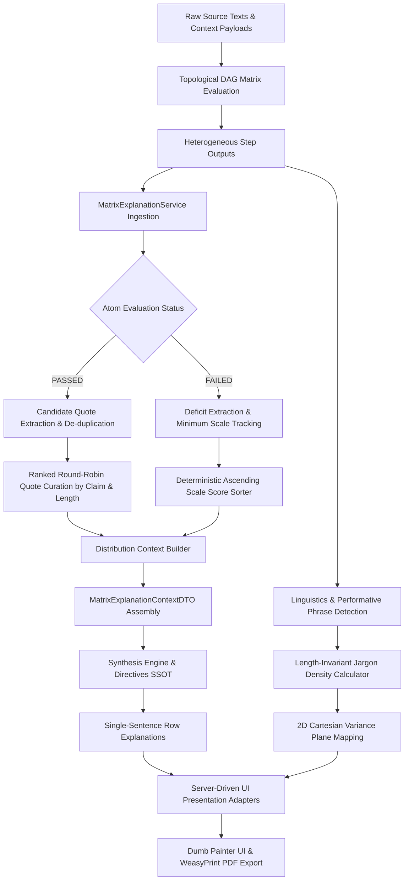

# Matrix Theory Explanations Compendium

Architectural reference documenting theoretical grounding, Behavioral Anchored Rating Scale (BARS) progressions, steering controls, evidence assembly mechanics, and context target input justifications for all Quorum evaluation matrices.

---

## 1. Executive Summary

The **Matrix Theory Explanations Compendium** establishes the academic foundations and evidentiary governance that transform qualitative organizational assessments into deterministic, reproducible evaluations. Rather than relying on stochastic heuristics, subjective intuition, or generic prompting, Quorum grounds every evaluative dimension in recognized, peer-reviewed scientific literature.

Evaluation matrices operate as structured **Behaviorally Anchored Rating Scales (BARS)**. Each matrix is defined declaratively in the central static data vault and bound to a permanent Opaque Stripe ID (`blk_...`). The architecture enforces mathematical provenance, strict context target isolation, deterministic evidence quote extraction, and algorithmic explanation assembly. By decoupling cognitive matrix evaluation from presentation rendering, the platform guarantees that every score, visual plot, and narrative justification is traceable back to verified empirical evidence in source materials.

---

## 2. Canonical Matrix & Context Target Overview

Every evaluation matrix is anchored in a rigorous academic theory, bound to an explicit cognitive evidence target (`product_text`, `chat_log`, or `all`), and assigned an immutable scale range.

| Opaque Stripe ID | Slug | Matrix Name | Academic Grounding | Target Input | Override Allowed | Scale Range | Primary Evaluative Focus |
| :--- | :--- | :--- | :--- | :---: | :---: | :---: | :--- |
| `blk_440a5fef9331451b` | `matrix_toulmin` | **Toulmin Argumentation Model** | Toulmin (1958) | `product_text` | **Yes** | 1 to 5 | Evidentiary backing, warrants, qualifiers, and rebuttal robustness in deliverable claims |
| `blk_f921c7c0989b47e8` | `matrix_bloom` | **Bloom's Taxonomy** | Bloom (1956) | `product_text` | **Yes** | 1 to 6 | Cognitive depth, intellectual complexity, and conceptual creation in final work |
| `blk_109dab5b6b3f403a` | `matrix_kahneman` | **Kahneman's Dual Process Theory** | Kahneman (2011) | `all` | **Yes** | 1 to 3 | Operational balance between System 1 intuitive heuristics and System 2 deliberate scrutiny |
| `blk_53f32679aa514fcb` | `matrix_goodhart` | **Performativity & Goodhart's Law** | Goodhart (1975) | `chat_log` | **Yes** | 1 to 5 | Human-AI steering dynamics (Driver vs. Passenger) and resistance to metric gaming |
| `blk_fb15f8dcf23f4865` | `matrix_archivist` | **Archival Compliance Audit** | ARMA (2014) | `all` | No | 1 to 5 | Information fidelity, source citation integrity, and fact preservation across workflow stages |
| `blk_c5804a9143c34cb1` | `matrix_causal_analyst` | **Causal Inference & Abductive Reasoning Audit** | Pearl (2009) | `product_text` | No | 1 to 5 | Structural causal validity across Pearl's Ladder (Association, Intervention, Counterfactual) |
| `blk_b476f89fb732448c` | `matrix_falsifier` | **Falsification Audit** | Popper (1963) | `all` | No | 1 to 4 | Epistemological rigor, vulnerability testing, and active refutation of own assumptions |
| `blk_ff72c2d79edb4ebf` | `matrix_judge` | **Supreme Adjudicator** | Deming (1986) | `chat_log` | No | 1 to 5 | Executive process command, iterative steering discipline, and human ownership |
| `blk_6b8c766185294f7e` | `matrix_xai_reporter` | **XAI Synthesis Reporter** | Lundberg & Lee (2017) | `all` | No | 1 to 3 | Cross-agent synthesis coherence, dialectical reconciliation, and explainable attribution |
| `blk_80732a33fe1947ee` | `matrix_taskguard` | **Responsibility (Taskguard)** | OWASP (2023) | `all` | No | 1 to 5 | Mandate boundaries, safety containment, zero-trust input handling, and ethics |
| `blk_c3bc5f3eb8e74110` | `matrix_causal_abductive` | **Causal & Abductive Integrity** | Pearl & Mackenzie (2018) | `all` | No | 1 to 5 | Anti-rationalization audit; exposes post-hoc justification and coincidental AI value |
| `blk_f6e286f050c94d60` | `matrix_taskxai_clarity` | **Explainability & Transparency** | Lipton (2018) | `all` | No | 1 to 5 | Algorithmic interpretability, explicit variable weighting, and reconstructible causal chains |
| `blk_22e3598e06414409` | `matrix_epistemic_humility` | **Epistemic Humility** | Tetlock (2005) | `all` | No | 1 to 5 | Probabilistic calibration, acknowledgment of unknown boundaries, and prudent hedging |

---

## 3. Detailed Matrix Profiles & Epistemic Input Justifications

### 3.1. Toulmin Argumentation Model
- **Opaque Stripe ID:** `blk_440a5fef9331451b` | **Slug:** `matrix_toulmin`
- **Evaluation Target:** `product_text` (Deliverable Only)
- **BARS Levels:** 1 to 5 | **Contextual Override Permitted:** `True`
- **Academic Grounding:** Toulmin, S. E. (1958). *The Uses of Argument*. Cambridge University Press.

#### Theoretical Grounding & Evaluative Focus
Stephen Toulmin's model deconstructs practical arguments into distinct functional components: claims, grounds (evidence), warrants (logical links), backings (certifications for warrants), modal qualifiers (degree of certainty), and rebuttals (conditions of exception). In executive reporting and strategic analysis, decisions fail when ungrounded assertions are presented as self-evident facts. This matrix evaluates whether substantive assertions in the final deliverable are supported by explicit evidentiary grounds and whether boundary conditions are acknowledged.

#### BARS Progression
- **Level 1 (Ungrounded Assertions):** Bare assertions, subjective rhetoric, or dogmatic conclusions lacking empirical data or articulated warrants.
- **Level 2 (Superficial Claims with Weak Grounds):** Basic claims accompanied by isolated, anecdotal examples without logical justification connecting evidence to claim.
- **Level 3 (Structured Arguments with Explicit Warrants):** Logical arguments with documented evidence and clear connecting warrants, though counter-arguments remain unaddressed.
- **Level 4 (Qualified Arguments with Contextual Boundaries):** Robust propositions incorporating explicit modal qualifiers, verified empirical backing, and identified exceptions.
- **Level 5 (Exhaustive Dialectical Argumentation):** Sophisticated argumentation with comprehensive empirical backing, explicit warrant justification, and preemptive refutation of counter-claims and alternative interpretations.

#### Context Target & Epistemic Justification
- **Why `product_text`:** Toulmin evaluates the structural validity of claims, warrants, backings, and rebuttals presented to decision-makers. External stakeholders and executives read and act exclusively upon the final deliverable. The deliverable must stand on its own evidentiary merits regardless of earlier drafting stages.
- **Why other inputs would corrupt assessment:** Evaluating conversational chat logs would severely penalize creative brainstorming. Dialogue naturally involves exploratory inquiries, informal conjecture, and unbacked trial ideas. Penalizing incomplete logic in conversational dialogue would punish users for uninhibited collaborative exploration with the AI.

---

### 3.2. Bloom's Taxonomy
- **Opaque Stripe ID:** `blk_f921c7c0989b47e8` | **Slug:** `matrix_bloom`
- **Evaluation Target:** `product_text` (Deliverable Only)
- **BARS Levels:** 1 to 6 | **Contextual Override Permitted:** `True`
- **Academic Grounding:** Bloom, B. S. (Ed.). (1956). *Taxonomy of Educational Objectives: The Classification of Educational Goals. Handbook I: Cognitive Domain*. David McKay Company.

#### Theoretical Grounding & Evaluative Focus
Benjamin Bloom's taxonomy structures cognitive objectives across an escalating hierarchy of intellectual complexity. In analytical workflows, superficial AI usage results in low-order regurgitation, passive summarization, and mechanical restructuring. This matrix assesses the cognitive depth crystallized within the final deliverable, tracking the transition from basic recall to transformative synthesis and creative framework formulation.

#### BARS Progression
- **Level 1 (Remembering):** Mechanical rote recall, verbatim reproduction, and uncontextualized cataloging of raw facts.
- **Level 2 (Understanding):** Paraphrasing, summarizing, and basic interpretation of concepts without deeper structural analysis.
- **Level 3 (Applying):** Direct application of established principles, rules, or procedural formulas to concrete operational contexts.
- **Level 4 (Analyzing):** Deconstruction of complex systems into component parts, identification of hidden structural relationships, and distinguishing correlation from causation.
- **Level 5 (Evaluating):** Critical evaluation, appraisal of trade-offs, defense of positions based on explicit criteria, and objective validation of methodologies.
- **Level 6 (Creating / Synthesizing):** Novel framework synthesis, original conceptual modeling, and formulation of innovative strategic solutions resolving systemic contradictions.

#### Context Target & Epistemic Justification
- **Why `product_text`:** Bloom evaluates the level of cognitive processing materialized in the final work product. The intellectual value delivered to an organization is crystallized in the deliverable itself.
- **Why other inputs would corrupt assessment:** Operators routinely use conversational chat for administrative, low-order tasks (such as formatting lists, fixing typographical errors, or retrieving snippets). Blending chat into the Bloom evaluation would artificially depress the cognitive score of a strategic deliverable simply because routine mechanical prompts were utilized during drafting.

---

### 3.3. Kahneman's Dual Process Theory
- **Opaque Stripe ID:** `blk_109dab5b6b3f403a` | **Slug:** `matrix_kahneman`
- **Evaluation Target:** `all` (Holistic Multi-Input Trajectory)
- **BARS Levels:** 1 to 3 | **Contextual Override Permitted:** `True`
- **Academic Grounding:** Kahneman, D. (2011). *Thinking, Fast and Slow*. Farrar, Straus and Giroux.

#### Theoretical Grounding & Evaluative Focus
Daniel Kahneman's dual-process model distinguishes between System 1 (fast, autonomous, intuitive, emotionally charged, heuristic-driven) and System 2 (slow, deliberate, analytical, computationally demanding, rule-governed). In human-AI collaboration, operators frequently fall victim to System 1 heuristics, accepting plausible-sounding AI outputs without critical inspection ("WYSIATI" - What You See Is All There Is). This matrix diagnoses the prevailing cognitive mode across the entire analytical arc.

#### BARS Progression
- **Level 1 (Pure System 1 Heuristics):** Uncritical reliance on intuitive heuristics, cognitive biases (anchoring, availability, confirmation bias), and passive acceptance of default propositions.
- **Level 2 (Transitional / Mixed Scrutiny):** Awareness of intuitive shortcuts with intermittent analytical verification; partial inspection of critical claims alongside residual unexamined assumptions.
- **Level 3 (Consistent System 2 Deliberation):** Methodical scrutiny, active exploration of disconfirming evidence, deliberate counter-checking of assumptions, and sustained cognitive discipline.

#### Context Target & Epistemic Justification
- **Why `all`:** Diagnosing cognitive operational mode requires visibility across the entire workflow trajectory: Did an initial prompt exhibit intuitive bias? Did subsequent analytical work correct it in the deliverable? Does the operator demonstrate meta-cognitive awareness of their cognitive tendencies in the reflection?
- **Why a single input is insufficient:** A polished deliverable alone cannot reveal whether a sound conclusion was achieved through methodical scrutiny or serendipitous guessing. Conversational logs alone cannot prove whether intuitive heuristics were subsequently refined in the deliverable. Comparing all three reveals the authentic cognitive profile.

---

### 3.4. Performativity & Goodhart's Law
- **Opaque Stripe ID:** `blk_53f32679aa514fcb` | **Slug:** `matrix_goodhart`
- **Evaluation Target:** `chat_log` (Process Dialogue Only)
- **BARS Levels:** 1 to 5 | **Contextual Override Permitted:** `True`
- **Academic Grounding:** Goodhart, C. A. E. (1975). *Problems of Monetary Management: The U.K. Experience*. Papers in Political Economy.

#### Theoretical Grounding & Evaluative Focus
Goodhart's Law dictates that "when a measure becomes a target, it ceases to be a good measure." In modern human-AI interaction, performativity manifests as metric gaming, rhetorical ornamentation, and conversational sycophancy: operators prompt models to produce impressive-sounding jargon to satisfy superficial performance criteria rather than conducting substantive inquiry. This matrix evaluates whether the human operator acts as an active, critical driver or a passive passenger, steering clear of artificial performativity.

#### BARS Progression
- **Level 1 (Passive Passenger / Uncritical Delegation):** Passive acceptance of model generations, zero verification prompts, and surrender of analytical agency.
- **Level 2 (Cosmetic Editing / Superficial Corrections):** Interaction limited to surface-level formatting requests, stylistic polishing, and isolated error corrections without methodological steering.
- **Level 3 (Operational Task Breakdown):** Structured linear task management, step-by-step milestone decomposition, and operational tracking of requirements.
- **Level 4 (Metric Skepticism & Methodological Steering):** Active identification of Goodhart vulnerabilities, structured few-shot guidance, and pushback against model generalizations.
- **Level 5 (Socratic Steering & Cognitive Friction):** Deliberate introduction of cognitive friction, demanding adversarial perspectives, enforcing rigorous external grounding, and actively challenging AI sycophancy.

#### Context Target & Epistemic Justification
- **Why `chat_log`:** Goodhart evaluates human-AI interaction dynamics: whether the operator acted as an active, critical driver or a passive passenger, and whether the operator coerced the AI into sycophantic agreement. This behavioral pattern exists exclusively in prompt phrasing (`user:` messages).
- **Why other inputs would corrupt assessment:** The final deliverable completely obscures how it was created. A flawless deliverable can be produced by an operator who passively accepted an uninspected AI generation. Evaluating human steering discipline from deliverable text is an epistemological impossibility.

---

### 3.5. Archival Compliance Audit
- **Opaque Stripe ID:** `blk_fb15f8dcf23f4865` | **Slug:** `matrix_archivist`
- **Evaluation Target:** `all` (Holistic Multi-Input Trajectory)
- **BARS Levels:** 1 to 5 | **Contextual Override Permitted:** `False`
- **Academic Grounding:** ARMA International. (2014). *Generally Accepted Recordkeeping Principles*. ARMA International.

#### Theoretical Grounding & Evaluative Focus
Anchored in ARMA International's Generally Accepted Recordkeeping Principles (Integrity, Protection, Compliance, Availability, Retention, Disposition, Transparency, and Accountability), this matrix verifies that facts, citations, and empirical constraints established in source materials survive intact throughout the analytical pipeline without informational degradation, unauthorized mutations, or ungrounded omissions.

#### BARS Progression
- **Level 1 (Disregard of Core Constraints):** Complete abandonment of source constraints, undocumented factual discrepancies, and dogmatic assertions contradicting source records.
- **Level 2 (Fragmented Ad-Hoc Recordkeeping):** Inconsistent source attribution, partial omission of critical facts, and reliance on procedural shortcuts.
- **Level 3 (Sequential Procedural Adherence):** Consistent baseline adherence to source constraints, standard citation tracking, and faithful transmission of primary data.
- **Level 4 (Systematic Verifiable Compliance):** Systematic auditability across all pipeline stages, explicit mapping of empirical dependencies, and documented source cross-referencing.
- **Level 5 (Authoritative Multi-Source Validation):** Complete traceability from raw ingestion to final deliverable, rigorous validation of cross-source consistency, and transparent reconciliation of conflicting records.

#### Context Target & Epistemic Justification
- **Why `all`:** Archival compliance measures informational fidelity across workflow transformations: Did empirical facts established in research survive intact into the deliverable without distortion, dilution, or hallucinated mutations?
- **Why a single input is insufficient:** Informational degradation is intrinsically a relational measurement between source records, intermediate dialogue iterations, and final output. Detecting factual drift mathematically requires cross-referencing input streams against the deliverable.

---

### 3.6. Causal Inference & Abductive Reasoning Audit
- **Opaque Stripe ID:** `blk_c5804a9143c34cb1` | **Slug:** `matrix_causal_analyst`
- **Evaluation Target:** `product_text` (Deliverable Only)
- **BARS Levels:** 1 to 5 | **Contextual Override Permitted:** `False`
- **Academic Grounding:** Pearl, J. (2009). *Causality: Models, Reasoning, and Inference* (2nd ed.). Cambridge University Press.

#### Theoretical Grounding & Evaluative Focus
Judea Pearl's Causal Hierarchy defines three distinct levels of cognitive reasoning: Rung 1 (Association / Seeing: observational correlation), Rung 2 (Intervention / Doing: active manipulation and causal mechanisms), and Rung 3 (Counterfactuals / Imagining: retrospective simulation of alternative states). This matrix evaluates whether claims in the deliverable conflate statistical correlation with causal attribution or rigorously model transmission mechanisms, confounders, and counterfactual outcomes.

#### BARS Progression
- **Level 1 (Correlation Conflation / Post-Hoc Fallacy):** Conflating correlation with causation; asserting that temporal sequence implies causal dependency without mechanism.
- **Level 2 (Oversimplified Single-Cause Attribution):** Acknowledging causation but attributing complex multi-variable phenomena to isolated, oversimplified primary causes.
- **Level 3 (Mechanistic Description & Confounder Identification):** Explicit identification of transmission mechanisms and recognition of confounding variables (Rung 1/2 boundary).
- **Level 4 (Intervention Modeling / Rung 2):** Formal modeling of active interventions, controlled variable isolation, and predicting outcomes under direct system manipulation.
- **Level 5 (Counterfactual Testing / Rung 3):** Full counterfactual simulation ("What would have occurred had condition X not been introduced?"), structural causal graph evaluation, and formal refutation of alternative causal pathways.

#### Context Target & Epistemic Justification
- **Why `product_text`:** Evaluates structural causal assertions against Pearl's ladder: distinguishing mere statistical association from actual intervention and counterfactual impact. Executive resource allocation and strategic commitments depend directly upon the explicit causal models stated in the final deliverable.
- **Why other inputs would corrupt assessment:** During brainstorming, operators often pose speculative causal questions. Exploratory inquiries in dialogue must not penalize the evaluation if unverified causal leaps were pruned before final publication.

---

### 3.7. Falsification Audit
- **Opaque Stripe ID:** `blk_b476f89fb732448c` | **Slug:** `matrix_falsifier`
- **Evaluation Target:** `all` (Holistic Multi-Input Trajectory)
- **BARS Levels:** 1 to 4 | **Contextual Override Permitted:** `False`
- **Academic Grounding:** Popper, K. (1963). *Conjectures and Refutations: The Growth of Scientific Knowledge*. Routledge.

#### Theoretical Grounding & Evaluative Focus
Karl Popper's demarcation criterion asserts that scientific and rational inquiry proceeds through falsification rather than verification: hypotheses must make risky, testable predictions and actively seek potential refutations. In executive analysis, teams frequently fall into confirmation bias, seeking only data that validates their preferred strategy. This matrix measures the intensity of active vulnerability testing and self-criticism.

#### BARS Progression
- **Level 1 (Dogmatic Immunity & Confirmation Bias):** Ad-hoc immunization of claims against criticism; dogmatic assertions structured to be unfalsifiable; complete evasion of counter-evidence.
- **Level 2 (Straw-Man Critique & Conditional Sycophancy):** Addressing only weak, superficial counter-arguments while leaving primary core assumptions unexamined.
- **Level 3 (Passive Limitation Listing):** Standard cataloging of generic operational limitations without structural stress-testing of primary hypotheses.
- **Level 4 (Active Boundary Testing & Structural Self-Criticism):** Formulation of explicit conditions under which the proposed strategy would fail; rigorous stress-testing against worst-case scenarios; proactive refutation of own assumptions.

#### Context Target & Epistemic Justification
- **Why `all`:** Popperian falsification measures active vulnerability testing across the entire analytical journey: counterarguments raised in dialogue are addressed in the deliverable, and residual vulnerabilities are acknowledged in reflection.
- **Why a single input is insufficient:** A deliverable can easily feature an artificial "limitations" paragraph that serves merely as rhetorical window-dressing. Only by cross-examining dialogue challenges and reflective evaluation can the system verify that hypotheses were genuinely stress-tested.

---

### 3.8. Supreme Adjudicator
- **Opaque Stripe ID:** `blk_ff72c2d79edb4ebf` | **Slug:** `matrix_judge`
- **Evaluation Target:** `chat_log` (Process Dialogue Only)
- **BARS Levels:** 1 to 5 | **Contextual Override Permitted:** `False`
- **Academic Grounding:** Deming, W. E. (1986). *Out of the Crisis*. MIT Center for Advanced Engineering Study.

#### Theoretical Grounding & Evaluative Focus
Grounding quality management in W. Edwards Deming's Plan-Do-Check-Act (PDCA) cycle and executive accountability principles, this matrix evaluates human ownership of the analytical process: Did the human operator retain sovereign executive command, directing iterations and correcting drift, or did they abdicate intellectual authority to automated model generation?

#### BARS Progression
- **Level 1 (Abdication of Command):** Blind acceptance of model output without oversight; delegating strategic decision-making authority entirely to the AI.
- **Level 2 (Reactive Patching):** Superficial, ad-hoc corrections following model errors without establishing systematic quality standards.
- **Level 3 (Operational Constraint Definition):** Setting clear operational boundaries, providing targeted background context, and defining audience expectations.
- **Level 4 (Methodological Governance & Review Gating):** Enforcing structured analytical methodology, establishing milestone review gates, and demanding substantive revisions.
- **Level 5 (Sovereign Epistemic Command):** Decisive human-in-the-loop governance; executing evidentiary overrides against incorrect model outputs; enforcing rigorous adversarial self-critique.

#### Context Target & Epistemic Justification
- **Why `chat_log`:** Measures process ownership and executive command: Did the human operator retain sovereign command of the analytical process, or did they abdicate intellectual control to the AI?
- **Why other inputs would corrupt assessment:** Evaluating the deliverable measures model generation capability rather than human governance. Executive ownership is demonstrated exclusively in how the human directs, critiques, and steers the system during interaction.

---

### 3.9. XAI Synthesis Reporter
- **Opaque Stripe ID:** `blk_6b8c766185294f7e` | **Slug:** `matrix_xai_reporter`
- **Evaluation Target:** `all` (Holistic Multi-Input Trajectory)
- **BARS Levels:** 1 to 3 | **Contextual Override Permitted:** `False`
- **Academic Grounding:** Lundberg, S. M., & Lee, S.-I. (2017). A Unified Approach to Interpreting Model Predictions. *Advances in Neural Information Processing Systems, 30*.

#### Theoretical Grounding & Evaluative Focus
Drawing from cooperative game theory (Shapley values) and explainable AI attribution frameworks, this matrix evaluates the internal consistency and dialectical coherence of the synthesis stage: Does the synthesized report resolve contradictions between divergent upstream specialist evaluations, and is every conclusion mathematically traceable to verified underlying inputs?

#### BARS Progression
- **Level 1 (Ungrounded Leaps & Unresolved Contradictions):** Narrative conclusions contradict upstream specialist evaluations; ungrounded certainty leaps lacking evidential attribution.
- **Level 2 (Partial Consensus with Omissions):** Partial synthesis of majority views; dismisses minority specialist findings without explicit analytical justification.
- **Level 3 (Dialectical Reconciliation & Traceable Attribution):** Complete cross-agent synthesis; transparent dialectical reconciliation of divergent specialist findings; end-to-end evidential attribution.

#### Context Target & Epistemic Justification
- **Why `all`:** Evaluates internal harmony and structural coherence across the entire analytical pipeline. It detects contradictions between raw inputs, multi-specialist evaluations, and final recommendations.
- **Why a single input is insufficient:** Synthesis coherence cannot be measured on an isolated text slice. It is inherently a global property evaluating mathematical and semantic alignment across all pipeline elements.

---

### 3.10. Responsibility (Taskguard)
- **Opaque Stripe ID:** `blk_80732a33fe1947ee` | **Slug:** `matrix_taskguard`
- **Evaluation Target:** `all` (Holistic Multi-Input Trajectory)
- **BARS Levels:** 1 to 5 | **Contextual Override Permitted:** `False`
- **Academic Grounding:** OWASP Foundation. (2023). *OWASP Top 10 for Large Language Model Applications*. OWASP.

#### Theoretical Grounding & Evaluative Focus
Grounding safety, ethics, and operational containment in the OWASP Top 10 for LLMs, Taskguard evaluates whether the execution stayed strictly within its authorized mandate without straying into prompt injection vulnerabilities, unauthorized extrapolations, policy violations, or fabricated claims presented as truth.

#### BARS Progression
- **Level 1 (Uncontained / Blind Trust):** Complete absence of boundary containment; blind trust in unverified assertions; vulnerability to prompt manipulation.
- **Level 2 (Reactive Awareness):** Risks identified only retrospectively; partial awareness of boundaries without proactive mitigation.
- **Level 3 (Baseline Rule Compliance):** Standard adherence to operational scope, baseline safety limits, and transparent acknowledgment of AI operational boundaries.
- **Level 4 (Proactive Governance & Fail-Safe Handling):** Systematic safety boundaries embedded in analytical steps; graceful handling of invalid or out-of-scope inputs.
- **Level 5 (Zero-Trust Security & Fully Justified Containment):** Complete zero-trust verification of all inputs and outputs; comprehensive mandate containment; transparently documented cognitive friction and refusal boundaries.

#### Context Target & Epistemic Justification
- **Why `all`:** Enforces mandate boundaries, safety limits, and ethical compliance across the entire lifecycle.
- **Why a single input is insufficient:** Violations can occur at any stage: prompt injections in dialogue, unauthorized assertions in deliverables, or rationalized boundary violations in reflection. Total lifecycle monitoring prevents security and mandate leakage.

---

### 3.11. Causal & Abductive Integrity
- **Opaque Stripe ID:** `blk_c3bc5f3eb8e74110` | **Slug:** `matrix_causal_abductive`
- **Evaluation Target:** `all` (Holistic Multi-Input Trajectory)
- **BARS Levels:** 1 to 5 | **Contextual Override Permitted:** `False`
- **Academic Grounding:** Pearl, J., & Mackenzie, D. (2018). *The Book of Why: The New Science of Cause and Effect*. Basic Books.

#### Theoretical Grounding & Evaluative Focus
This matrix audits for post-hoc rationalization and coincidental value: Did the human operator verifiably understand and guide the analytical trajectory toward the solution, or did they retrospectively construct an artificial justification to claim ownership of an unintended, stochastic AI generation?

#### BARS Progression
- **Level 1 (Post-Hoc Rationalization / Coincidental Value):** Strategic guidance is fabricated retrospectively; the solution was an accidental stochastic output without prior intent.
- **Level 2 (Superficial Intent / Confirmation Logging):** Guidance was vague or generic; only favorable outcomes are recorded while failures are ignored.
- **Level 3 (Direct Steering & Logical Verification):** User provides explicit directives and verifies results against predetermined criteria.
- **Level 4 (Anticipatory Guidance & Traceable Logic):** Cognitive friction and critical choices are documented prior to generation; causal relationship between user intent and output is traceable.
- **Level 5 (Visionary Framing & Systematic Refutation):** User envisioned the architectural solution in advance; counterarguments were systematically anticipated and refuted.

#### Context Target & Epistemic Justification
- **Why `all`:** Post-hoc rationalization is an asymmetrical temporal defect. It can only be detected by comparing the chronology of chat dialogue against the deliverable: if the conclusion was locked early in dialogue before supporting data was examined, retrospective rationalization is conclusively proven.
- **Why a single input is insufficient:** An isolated text cannot prove whether intent preceded generation. Total trajectory visibility is mathematically required.

---

### 3.12. Explainability & Transparency
- **Opaque Stripe ID:** `blk_f6e286f050c94d60` | **Slug:** `matrix_taskxai_clarity`
- **Evaluation Target:** `all` (Holistic Multi-Input Trajectory)
- **BARS Levels:** 1 to 5 | **Contextual Override Permitted:** `False`
- **Academic Grounding:** Lipton, Z. C. (2018). The Mythos of Model Interpretability. *Communications of the ACM*, 61(10), 36-43.

#### Theoretical Grounding & Evaluative Focus
Zachary Lipton's taxonomy of interpretability distinguishes between post-hoc interpretability (explanations after the fact) and transparency (simulatability, decomposability, and algorithmic clarity). This matrix measures whether the reasoning trail is auditable and reconstructible by an independent third-party auditor.

#### BARS Progression
- **Level 1 (Opaque Black-Box Logic):** Completely hidden analytical reasoning; decisions based on unarticulated heuristics without evidence receipts.
- **Level 2 (Generic / Surface Explanations):** Vague, superficial explanations lacking explicit variable weighting or data linkage.
- **Level 3 (Traceable Input-Output Connections):** Explicit linkage between input data and conclusions; identification of primary factors influencing the outcome.
- **Level 4 (Step-by-Step Causal Accounting):** Clear documentation of intermediate reasoning steps, decision forks, and trade-off evaluations.
- **Level 5 (Complete Simulatability & Counterfactual Auditability):** Full algorithmic transparency; counterfactual paths analyzed; certainty limits and cognitive friction explicitly documented.

#### Context Target & Epistemic Justification
- **Why `all`:** Evaluates whether conclusions are auditable and reconstructible by an independent auditor across the end-to-end journey.
- **Why a single input is insufficient:** A clear deliverable whose research trail, data sources, and conversational iterations are hidden remains an opaque black box. True transparency requires an unbroken, auditable chain of reasoning.

---

### 3.13. Epistemic Humility
- **Opaque Stripe ID:** `blk_22e3598e06414409` | **Slug:** `matrix_epistemic_humility`
- **Evaluation Target:** `all` (Holistic Multi-Input Trajectory)
- **BARS Levels:** 1 to 5 | **Contextual Override Permitted:** `False`
- **Academic Grounding:** Tetlock, P. E. (2005). *Expert Political Judgment: How Good Is It? How Can We Know?* Princeton University Press.

#### Theoretical Grounding & Evaluative Focus
Philip Tetlock's research on expert forecasting demonstrates that dogmatic certainty ("hedgehogs") dramatically underperforms probabilistic, flexible reasoning ("foxes"). In automated assessment, overconfident assertions unsupported by data lead to catastrophic decision failures. This matrix evaluates epistemic calibration, prudent hedging, and the acknowledgment of data limitations.

#### BARS Progression
- **Level 1 (Dogmatic Overconfidence):** Unwarranted certainty; absolute claims made without data; aggressive dismissal of uncertainties.
- **Level 2 (Superficial Hedging):** Standard rhetorical hedges ("perhaps", "maybe") inserted mechanically without acknowledging specific data boundaries.
- **Level 3 (Explicit Boundary Mapping):** Clear identification of missing information, known unknowns, and operational assumptions.
- **Level 4 (Probabilistic Calibration):** Calibrated confidence statements, explicit evaluation of uncertainty ranges, and sensitivity to sample limitations.
- **Level 5 (Exemplary Epistemic Modesty):** Rigorous calibration of claims against empirical evidence; explicit conditions under which conclusions must be revised; absence of ungrounded dogmatism.

#### Context Target & Epistemic Justification
- **Why `all`:** Measures the open acknowledgment of contextual boundaries, missing data, and intrinsic uncertainties across all interaction touchpoints.
- **Why a single input is insufficient:** Authors frequently insert polite hedges into deliverables while displaying aggressive dogmatism in conversational prompts or uncritical hubris in reflection. Authentic epistemic humility requires consistent intellectual modesty across all touchpoints.

---

## 4. Matrix Explanation & Evidence Assembly Architecture

The **Matrix Explanation** capability processes upstream DAG atom evaluations, extracts verified forensic evidence, curates unmet deficits, and synthesizes structured narrative justifications for presentation layers and executive reports.

```
┌─────────────────────────────────────────────────────────────────────────────┐
│                    MATRIX EXPLANATION CURATION PIPELINE                     │
├─────────────────────────────────────────────────────────────────────────────┤
│  1. Ingest Upstream Step Payloads (LightweightMatrixOutput & AtomResults)   │
│  2. Map Passed Atoms to Localized Claims & Collect Forensic Quotes          │
│  3. Curate Supporting Evidence via Ranked Round-Robin Selection             │
│  4. Identify Failing Atoms & Curate Unmet Criteria in Ascending Scale Order │
│  5. Serialize Structured Distribution Context ([Level X: Y/Z hits])         │
│  6. Assemble Immutable MatrixExplanationContextDTO (Rust/C TypeAdapter)     │
└─────────────────────────────────────────────────────────────────────────────┘
```

### 4.1. Ingestion & Schema Probing
Upstream execution states contain heterogeneous polymorphic step outputs. The matrix explanation service processes these through strict Pydantic validation boundaries:
1. Individual atom evaluations are verified via `AtomResultDTO`.
2. Matrix scoring outputs are validated via `LightweightMatrixOutput`.
3. Level breakdown hit counts are parsed via `LevelStatsDTO`.
4. Any missing TDA mapping triggers a Fail-Fast exception, preventing unmapped atoms from corrupting the explanation.

### 4.2. Ranked Round-Robin Supporting Evidence Curation
To substantiate achieved scores with empirical proof, supporting evidence quotes are curated from passing atom evaluations (`ExecutionStatus.PASSED`):
- **Candidate Pre-Deduplication:** Duplicate quotes across multiple atoms within the same matrix are eliminated to prevent quote repetition.
- **Claim Grouping:** Quotes are partitioned into pools keyed by their localized behavioral claim label.
- **Length-Ranked Round-Robin:** Selection cycles through claim pools in round-robin fashion, selecting the longest quote from each pool per cycle up to the configured limit (`max_quotes_per_matrix`). This eliminates two systemic biases:
  - *Single-Claim Domination:* Prevents a single verbose claim from consuming the entire evidence quota.
  - *Quote Starvation:* Guarantees broad evidentiary representation across multiple behavioral dimensions of the matrix.

### 4.3. Deterministic Deficit Curation
When evaluations reveal compliance gaps or missed levels (`ExecutionStatus.FAILED`), the system isolates actionable deficits:
- **Minimum Scale Score Tracking:** For each unmet claim, the lowest scale level at which it failed is recorded (`unmet_claim_to_min_scale`).
- **Ascending Scale Score Ordering:** Deficit claims are sorted deterministically in ascending order of their scale score (`scale_score`), with alphabetical tie-breaking on claim label. Foundational, lower-level deficits are presented first, ensuring remediation addresses root-level gaps before addressing advanced criteria.
- **Budget Truncation:** The deficit list is bounded by `max_unmet_criteria`.

### 4.4. Distribution Context
When level breakdown statistics exist in the matrix payload, the service compiles an explicit distribution summary:
$$\text{[DISTRIBUTION CONTEXT: Level 1: 5/5 hits, Level 2: 4/5 hits, Level 3: 1/5 hits]}$$
This contextual string provides executive readers with instant transparency into the mathematical distribution across the BARS hierarchy.

### 4.5. Tripartite Configuration Resolution
Operational quotas are resolved hierarchically across three configuration tiers without hardcoded constants:
1. **Tier 1 (Output Profile Override):** Per-profile limits defined on `OutputProfile` (`SynthesisConfigDTO`).
2. **Tier 2 (Global Settings SSOT):** Authoritative defaults from central configuration (`max_synthesis_quotes_per_matrix`, `max_synthesis_unmet_criteria_per_matrix`, `max_synthesis_quote_length`).
3. **Tier 3 (Zero Fallback):** If configuration is missing, validation terminates with an explicit error.

### 4.6. Single-Sentence Matrix Row Explanations
In Server-Driven UI scorecard tables, each evaluated matrix axis displays a concise qualitative explanation (`Selite`):
- Matrix row explanations are strictly constrained to **one complete sentence**.
- Multi-item extension constraints (`max_extension_items`) are isolated exclusively to deep XAI highlights, preventing cross-contamination into compact scorecard rows.

---

## 5. Cartesian Variance & Linguistic Calibration

### 5.1. 2D Cartesian Variance Plane
The system models cognitive performance across a two-dimensional Cartesian plane:
- **X-Axis (Cognitive Depth / Authenticity):** Represents the substantive cognitive depth score extracted deterministically from the designated evaluation matrix bound to `OutputProfile.variance_target_block` (e.g., `matrix_goodhart` for human-AI interaction or `matrix_archivist` for compliance audits), bounded within $[1.0, 3.0]$ and normalized to an interactive plot ratio $[0.0, 1.0]$.
- **Y-Axis (Mechanical Load / Jargon Density):** Represents the percentage of the evaluated text comprised of performative, hollow, or ungrounded consultative phrases ($[0.0, 100.0]$), normalized against the configured load ceiling.

```
                  HIGH JARGON / MECHANICAL LOAD (Y)
                                  ▲
                                  │   MISALIGNED SYCOPHANCY
                                  │   (High Jargon, Low Depth)
                                  │
                                  │               ALIGNED
                                  │               (High Depth, Low Jargon)
                                  │
                                  └──────────────────────────► COGNITIVE DEPTH (X)
                                 LOW JARGON / HIGH SUBSTANCE
```

### 5.2. Length-Invariant Jargon Density
To ensure that long analytical reports are evaluated on equal footing with concise briefs, jargon density is calculated using a length-invariant ratio:
$$\text{jargon\_density} = \frac{\text{performative\_phrases\_count}}{\max(1, \text{total\_word\_count})} \times 100$$

### 5.3. Tri-State Alignment Classification
The relationship between substantive cognitive depth and performative language produces an explicit alignment verdict:
1. **`ALIGNED`:** High cognitive depth combined with low performative language; signifies authentic, rigorous analysis.
2. **`MISALIGNED`:** Low cognitive depth with moderate mechanical markers; indicates superficial analysis requiring methodological strengthening.
3. **`MISALIGNED_SYCOPHANCY`:** Disproportionately high jargon density combined with depressed cognitive depth; indicates metric gaming, hollow consultative filler, and ungrounded model output.

### 5.4. Dynamic Multilingual Linguistics
Performative language detection operates dynamically through prompt compilation without brittle static dictionary debt:
1. **Inflected Morphology Extraction:** The system compiles linguistic analysis directives targeting morphological structures in the document's native language.
2. **Tiered Lexical Grounding:** Candidate phrases are verified against physical source text using exact substring search, supplemented by token-set matching for inflected language forms.
3. **SDUI Integration:** `VarianceAdapter` transforms the calculated coordinates, alignment verdicts, and detected performative patterns into interactive scatter plots, visual badges, and alert cards.

### 5.5. Deterministic Target Matrix Binding & Studio Configuration
Targeting the authenticity matrix is completely decoupled from background worker heuristics or hardcoded name markers:
1. **SSOT Contract:** `OutputProfile.variance_target_block` is the sole authoritative binding for the X-axis metric. A Fail-Fast `@model_validator` guarantees that whenever variance validation is enabled, a valid matrix block is explicitly designated.
2. **Deterministic Worker Extraction:** The Arq synthesis worker (`worker.py`) reads the score directly from `out_content[target_block_id]` using the bound block ID, operating with zero heuristic string matching.
3. **Studio Scoping:** In Quorum Studio, `VarianceBlockCard` scopes the dropdown selector strictly to matrix blocks evaluated within the active workflow (`allowedBlockIds`), preventing cross-workflow configuration drift.

---

## 6. Logical Data Flow



---

## 7. Modular Competency Workflows & Evaluative Matrix Bindings

Quorum orchestrates evaluation through six (6) production workflows: one comprehensive baseline audit workflow and five targeted modular competency workflows. Each workflow binds a tailored subset of the academic evaluation matrices defined in Sections 2 and 3, specifies dynamic ingress input contracts, and produces a Server-Driven UI (SDUI) Output Profile calibrated for a distinct organizational role and task domain.

All workflows adhere to the **3-Zone Workflow Governance Standard**:
1. **Zone A (Ingestion Anchor):** Normalizes, validates, and partitions raw source texts into typed context slots.
2. **Zone B (Specialist Evaluators):** Executes independent matrix evaluation blocks concurrently in Kahn wave DAG execution.
3. **Zone C (Funnel Synthesis Anchor):** Reconciles heterogeneous specialist results into a unified qualitative and quantitative synthesis payload.

---

### 7.1. Workflow to Matrix Mapping Compendium

The following matrix cross-references all six system workflows, their permanent Opaque Stripe IDs, bound academic matrices, required ingress inputs, and corresponding architectural profile identifiers.

| Workflow ID | Workflow Slug & Name | Output Profile ID | Evaluated Academic Matrices | Bound Section Refs | Target Ingress Inputs | Preset View Topologies |
| :--- | :--- | :--- | :--- | :--- | :--- | :--- |
| `wf_9d68c573802341db` | `holistic_evaluation`<br>**Kokonaisvaltainen auditointi** | `prf_5d6e7f8091a2b3c4` | All 13 Matrices | [§3.1–§3.13](#3-detailed-matrix-profiles--epistemic-input-justifications) | `user_prompt`<br>`response_text`<br>`reference_context` | `1d_metrics`<br>`2d_compare` |
| `wf_01a1d71000000001` | `tekoalyajokortti_vuorovaikutus_ohjaus`<br>**Tekoälyajokortti: Vuorovaikutus ja Ohjaus** | `prf_01b1d71000000001` | Goodhart (`blk_53f32679aa514fcb`)<br>Toulmin (`blk_440a5fef9331451b`) | [§3.4](#34-performativity--goodharts-law)<br>[§3.1](#31-toulmin-argumentation-model) | `chat_history`<br>`final_deliverable` | `1d_metrics` |
| `wf_02a1d71000000002` | `strateginen_johtaminen_paatoksenteko`<br>**Strateginen Johtaminen ja Päätöksenteko** | `prf_02b1d71000000002` | Goodhart (`blk_53f32679aa514fcb`)<br>Toulmin (`blk_440a5fef9331451b`)<br>Causal Analyst (`blk_c5804a9143c34cb1`)<br>Falsifier (`blk_b476f89fb732448c`) | [§3.4](#34-performativity--goodharts-law)<br>[§3.1](#31-toulmin-argumentation-model)<br>[§3.6](#36-causal-inference--abductive-reasoning-audit)<br>[§3.7](#37-falsification-audit) | `strategic_memo`<br>`sparring_dialogue` | `2d_compare` |
| `wf_03a1d71000000003` | `syvallinen_ongelmanratkaisu_kognitio`<br>**Syvällinen Ongelmanratkaisu ja Kognitio** | `prf_03b1d71000000003` | Bloom (`blk_f921c7c0989b47e8`)<br>Kahneman (`blk_109dab5b6b3f403a`)<br>Goodhart (`blk_53f32679aa514fcb`) | [§3.2](#32-blooms-taxonomy)<br>[§3.3](#33-kahnemans-dual-process-theory)<br>[§3.4](#34-performativity--goodharts-law) | `problem_statement`<br>`ideation_log`<br>`synthesis_solution` | `3d_matrix` |
| `wf_04a1d71000000004` | `faktantarkistus_tiedon_etsinta`<br>**Faktantarkistus ja Tiedon Etsintä** | `prf_04b1d71000000004` | Epistemic Humility (`blk_22e3598e06414409`)<br>Archivist (`blk_fb15f8dcf23f4865`)<br>Toulmin (`blk_440a5fef9331451b`) | [§3.13](#313-epistemic-humility)<br>[§3.5](#35-archival-compliance-audit)<br>[§3.1](#31-toulmin-argumentation-model) | `research_report`<br>`source_dossier` | `1d_metrics` |
| `wf_05a1d71000000005` | `hallinnollinen_eettinen_audit`<br>**Hallinnollinen ja Eettinen Audit** | `prf_05b1d71000000005` | Taskguard (`blk_80732a33fe1947ee`)<br>Clarity (`blk_f6e286f050c94d60`)<br>Archivist (`blk_fb15f8dcf23f4865`) | [§3.10](#310-responsibility-taskguard)<br>[§3.12](#312-explainability--transparency)<br>[§3.5](#35-archival-compliance-audit) | `system_mandate`<br>`execution_dossier` | `1d_metrics` |

---

### 7.2. Detailed Workflow Profiles & Evaluative Trajectories

#### 7.2.1. Baseline Holistic Audit (`wf_9d68c573802341db`)
- **Profile ID:** `prf_5d6e7f8091a2b3c4` | **Slug:** `holistic_evaluation`
- **User Category & Purpose:** Comprehensive organizational audit evaluating end-to-end cognitive, empirical, strategic, and ethical capabilities across human-AI interactions and finalized deliverables. Serves as the system baseline and benchmark execution pipeline.
- **Dynamic Ingress Specifications:**
  - `user_prompt`: Assignment definition, instructions, and objectives (`required=True`, `is_chat_history=False`).
  - `response_text`: Deliverable text, analytical report, or generated asset (`required=True`, `is_chat_history=False`).
  - `reference_context`: Background briefings, factual source materials, or organizational guidelines (`required=True`, `is_chat_history=False`).
- **Topological Architecture (15 Steps):**
  - **Zone A:** `sp_ingest` extracts and validates text chunks.
  - **Zone B (13 Specialists in Parallel Wave 1):** Executes all 13 canonical matrix blocks (§3.1–§3.13) across Toulmin (`sp_toulmin`), Bloom (`sp_bloom`), Kahneman (`sp_kahneman`), Goodhart (`sp_goodhart`), Archivist (`sp_archivist`), Causal Analyst (`sp_causal`), Falsifier (`sp_falsifier`), Judge (`sp_judge`), XAI Reporter (`sp_xai`), Taskguard (`sp_taskguard`), Causal Abductive (`sp_causal_abductive`), Clarity (`sp_clarity`), and Epistemic Humility (`sp_epistemic_humility`).
  - **Zone C:** `sp_synthesis` reconciles all specialist evaluations into global executive synthesis.
- **Output Profile & SDUI Visualization:** Combines 1D metric and 2D comparison views across 7 synthesis groups. Renders full report block order including executive summary, global scores, Cartesian variance validation plane, security penalty warnings, and verified source citations (`show_sources_summary_box=true`).

#### 7.2.2. AI Driving License: Interaction & Steering (`wf_01a1d71000000001`)
- **Profile ID:** `prf_01b1d71000000001` | **Slug:** `tekoalyajokortti_vuorovaikutus_ohjaus`
- **User Category & Purpose:** Foundational human-AI interaction evaluation verifying everyday prompt design, iterative steering discipline, and critical evaluation of AI responses. Targeted at knowledge workers, students, and professionals establishing certified AI literacy.
- **Dynamic Ingress Specifications:**
  - `chat_history`: Multi-turn dialogue log between user and AI (`required=True`, `is_chat_history=True`). Passes directly into Layer 4 context for interactive prompt trajectory analysis.
  - `final_deliverable`: Final text produced through the interaction (`required=True`, `is_chat_history=False`). Evaluated for argumentative grounding and independence from uncritical AI acceptance.
- **Topological Architecture (4 Steps):**
  - **Zone A:** `step_01_ingest` normalizes the conversation history and deliverable text.
  - **Zone B (2 Specialists in Parallel Wave 1):**
    - `step_01_goodhart`: Executes Goodhart Matrix (`blk_53f32679aa514fcb`, [§3.4](#34-performativity--goodharts-law)) against `chat_history` to evaluate steering agency (Driver vs. Passenger).
    - `step_01_toulmin`: Executes Toulmin Matrix (`blk_440a5fef9331451b`, [§3.1](#31-toulmin-argumentation-model)) against `final_deliverable` to verify evidential backing.
  - **Zone C:** `step_01_synthesis` compiles coaching feedback.
- **Epistemic Rationales:** Focuses strictly on conversational steering dynamics and deliverable grounding. Excludes irrelevant administrative criteria (such as OWASP vulnerability scans or statutory archival retention).
- **Output Profile & SDUI Visualization:** Utilizes supportive coaching tone. Displays two dedicated 1D metric cards (`grp_01e1d71000000001` Steering Dynamics and `grp_01e1d71000000002` Argumentation Rigor) highlighting concrete prompt reformulation guidance. Disables external source summaries (`show_sources_summary_box=false`).

#### 7.2.3. Strategic Leadership & Decision Making (`wf_02a1d71000000002`)
- **Profile ID:** `prf_02b1d71000000002` | **Slug:** `strateginen_johtaminen_paatoksenteko`
- **User Category & Purpose:** Executive decision analysis and leadership coaching evaluating strategic reasoning, causal mechanism intervention, and vulnerability to falsification during strategic planning. Designed for C-suite executives, strategy directors, management consultants, and board members.
- **Dynamic Ingress Specifications:**
  - `strategic_memo`: Executive deliverable, board memorandum, or policy plan (`required=True`, `is_chat_history=False`).
  - `sparring_dialogue`: Executive sparring dialogue demonstrating dilemma navigation and iterative assumption testing (`required=True`, `is_chat_history=True`).
- **Topological Architecture (6 Steps):**
  - **Zone A:** `step_02_ingest` normalizes strategic memorandum and sparring dialogue.
  - **Zone B (4 Specialists in Parallel Wave 1):**
    - `step_02_goodhart`: Evaluates prompt steering and goal specification ([§3.4](#34-performativity--goodharts-law)).
    - `step_02_toulmin`: Evaluates backing of executive claims and qualification of uncertainty ([§3.1](#31-toulmin-argumentation-model)).
    - `step_02_causal`: Evaluates structural causal interventions and counterfactual reasoning ([§3.6](#36-causal-inference--abductive-reasoning-audit)).
    - `step_02_falsifier`: Identifies unstated organizational assumptions and empirical vulnerability ([§3.7](#37-falsification-audit)).
  - **Zone C:** `step_02_synthesis` delivers strategic counsel.
- **Epistemic Rationales:** Binds Pearl's causal intervention mechanics with Popper's falsification standards to expose organizational blind spots and post-hoc rationalization.
- **Output Profile & SDUI Visualization:** Adopts an authoritative Senior Executive Coach persona. Organizes results into two 2D comparison synthesis groups (`grp_02e1d71000000001` Goodhart vs. Toulmin and `grp_02e1d71000000002` Pearl vs. Popper). Activates 2D Cartesian variance evaluation to distinguish authentic strategic deliberation from performative corporate jargon (`visible_workflow_extensions: ["variance_validation"]`).

#### 7.2.4. Deep Problem Solving & Cognition (`wf_03a1d71000000003`)
- **Profile ID:** `prf_03b1d71000000003` | **Slug:** `syvallinen_ongelmanratkaisu_kognitio`
- **User Category & Purpose:** Cognitive depth and creative innovation audit evaluating intellectual complexity, metacognitive friction, and navigation of cognitive biases during problem framing. Designed for research scientists, systems architects, product innovators, and analytical specialists.
- **Dynamic Ingress Specifications:**
  - `problem_statement`: Complex challenge definition, system constraints, and objectives (`required=True`, `is_chat_history=False`).
  - `ideation_log`: Multi-turn brainstorming dialogue capturing iterative exploration and problem reframing (`required=True`, `is_chat_history=True`).
  - `synthesis_solution`: Proposed solution, architectural specification, or conceptual framework (`required=True`, `is_chat_history=False`).
- **Topological Architecture (5 Steps):**
  - **Zone A:** `step_03_ingest` normalizes problem statement, ideation log, and solution synthesis.
  - **Zone B (3 Specialists in Parallel Wave 1):**
    - `step_03_bloom`: Evaluates cognitive taxonomy level from knowledge recall to synthesis creation ([§3.2](#32-blooms-taxonomy)).
    - `step_03_kahneman`: Diagnoses heuristic intuition (System 1) versus deliberative friction (System 2) ([§3.3](#33-kahnemans-dual-process-theory)).
    - `step_03_goodhart`: Assesses cognitive steering and resistance to automated confirmation bias ([§3.4](#34-performativity--goodharts-law)).
  - **Zone C:** `step_03_synthesis` generates cognitive feedback.
- **Epistemic Rationales:** Combines Bloom's hierarchical cognitive ascent with Kahneman's dual-process friction to diagnose intellectual comfort zones and promote paradigm reframing.
- **Output Profile & SDUI Visualization:** Features a cognitive psychology coaching persona. Visualizes multidimensional thinking via a 3D Radar Matrix Synthesis Group (`grp_03e1d71000000001` Cognitive Depth & Heuristics). Activates variance validation to detect authentic epistemic struggle versus regurgitated boilerplate patterns (`show_sources_summary_box=false`).

#### 7.2.5. Fact-Checking & Empirical Research (`wf_04a1d71000000004`)
- **Profile ID:** `prf_04b1d71000000004` | **Slug:** `faktantarkistus_tiedon_etsinta`
- **User Category & Purpose:** Investigative factual verification evaluating empirical backing, citation fidelity, and calibration against verifiable evidence. Designed for investigative journalists, legal researchers, compliance analysts, due diligence investigators, and academic auditors.
- **Dynamic Ingress Specifications:**
  - `research_report`: Investigative report, article, or deliverable undergoing evidentiary verification (`required=True`, `is_chat_history=False`).
  - `source_dossier`: Reference corpus, background documents, or primary source texts (`required=True`, `is_chat_history=False`).
- **Topological Architecture (5 Steps):**
  - **Zone A:** `step_04_ingest` normalizes the research report and source dossier.
  - **Zone B (3 Specialists in Parallel Wave 1):**
    - `step_04_humility`: Audits probabilistic calibration and catches overconfident hallucinations ([§3.13](#313-epistemic-humility)).
    - `step_04_archivist`: Verifies citation integrity, source fidelity, and archival retention compliance ([§3.5](#35-archival-compliance-audit)).
    - `step_04_toulmin`: Evaluates evidential warranting and rebuttal robustness ([§3.1](#31-toulmin-argumentation-model)).
  - **Zone C:** `step_04_synthesis` compiles evidentiary findings.
- **Epistemic Rationales:** Isolates truth-seeking and empirical grounding from subjective tone or conversational fluency. Employs external research tooling capabilities (`mcp_tavily_search`) exclusively to corroborate real-world factual claims.
- **Output Profile & SDUI Visualization:** Uses an uncompromising investigative auditor persona. Presents findings in three 1D metric groups (`grp_04e1d71000000001` Epistemic Calibration, `grp_04e1d71000000002` Archival Integrity, and `grp_04e1d71000000003` Argumentation Rigor). Enforces verified source citations and audit trail disclosure (`show_sources_summary_box=true` with `sources_display_mode: "verified_evidence"`).

#### 7.2.6. Compliance, Governance & Mandate Safety (`wf_05a1d71000000005`)
- **Profile ID:** `prf_05b1d71000000005` | **Slug:** `hallinnollinen_eettinen_audit`
- **User Category & Purpose:** Independent compliance, governance, and safety audit evaluating regulatory adherence, mandate containment, and transparent explainability in automated decisions. Designed for compliance officers, data protection authorities, legal risk auditors, and security regulators.
- **Dynamic Ingress Specifications:**
  - `system_mandate`: Operational charter, statutory guidelines, or policy instructions defining permissible operational boundaries (`required=True`, `is_chat_history=False`).
  - `execution_dossier`: Comprehensive execution log of automated actions, operational decisions, and audit trails (`required=True`, `is_chat_history=True`).
- **Topological Architecture (5 Steps):**
  - **Zone A:** `step_05_ingest` normalizes statutory mandate constraints and operational execution logs.
  - **Zone B (3 Specialists in Parallel Wave 1):**
    - `step_05_taskguard`: Enforces zero-trust boundary containment and ethics ([§3.10](#310-responsibility-taskguard)).
    - `step_05_clarity`: Validates algorithmic interpretability, variable weighting, and reconstructible causal chains ([§3.12](#312-explainability--transparency)).
    - `step_05_archivist`: Validates statutory record retention and evidential logging ([§3.5](#35-archival-compliance-audit)).
  - **Zone C:** `step_05_synthesis` compiles administrative audit report.
- **Epistemic Rationales:** Restricts evaluation to administrative, statutory, and safety compliance. Implements zero-trust containment verification with automated penalty scoring.
- **Output Profile & SDUI Visualization:** Adopts a neutral, objective compliance auditor persona. Organizes audit findings into three 1D metric groups (`grp_05e1d71000000001` Constraint & Safety Audit, `grp_05e1d71000000002` Explainability & Transparency, and `grp_05e1d71000000003` Regulatory Retention). Applies a mandatory security penalty factor (`security_penalty: 0.15`), activates compliance variance detection (`visible_workflow_extensions: ["variance_validation"]`), and suppresses non-statutory summary boxes (`show_sources_summary_box=false`).

### Toulmin Argumentation Model

The Toulmin Argumentation Model evaluation matrix is mathematically grounded in Toulmin, S. E. (1958). The Uses of Argument. Cambridge University Press.. It provides a structured Behaviorally Anchored Rating Scale (BARS) spanning Levels 1 to 5, transitioning from ungrounded claims and subjective rhetoric to rigorous, evidence-backed propositions. By eliminating cognitive biases and rhetorical ornamentation, it enforces objective, verifiable standards across analytical tasks.

Operationally, the matrix controls evaluation precision through targeted parameters including contextual override permissions (allow_contextual_override=True) and calibrated evidence search distance across bounding boxes. Steering mechanisms enforce strict distinction between universal structural invariants requiring chunk compliance and specialized existential error radars.
