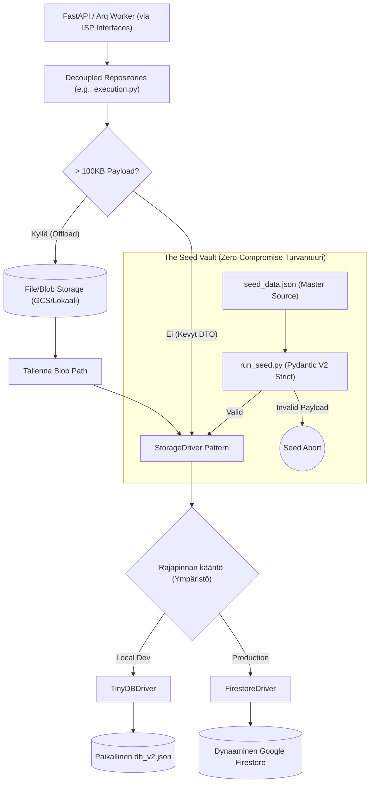
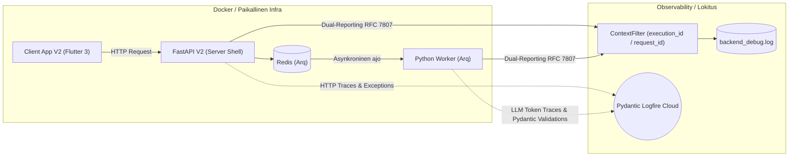

# 09: Tietokanta, Lokitus ja Infrastruktuuri (Persistence & Observability)

Cognitive Quorum hylkää suorat tietokantakohtaiset rutiinit tai perinteiset paksut ORM:t (Object-Relational Mapping). Järjestelmä operoi asynkronisen **Storage Driver Pattern** -arkkitehtuurin kautta, joka mahdollistaa koodin saumattoman siirrettävyyden pilven ja lokaalin koneen välillä (Environment Sovereignty) ilman pienimpiäkään muutoksia liiketoimintalogiikkaan.

## 1. Interface Segregation and Unified Repository

Kaika backendin datakutsut reititetään ISP-yhteensopivien rajapintojen (Interface Segregation Principle) kautta. Service-kerros ei koskaan tunne "God Class" -monolyyttiä, vaan injektoi ainoastaan omia, tiukasti rajattuja interface-abstraktioitaan (esim. `IWorkflowRepository`, `IExecutionRepository`, `ISystemRepository`, `IIdentityRepository`, `IComponentRepository`). Taustalla asynkronisista I/O-operaatioista ja Storage Driver -logiikasta vastaa erikoistuneet rinnakkaisluokat, jotka injektoivat ajuriksi joko `TinyDBDriver` (Local Dev) tai `FirestoreDriver` (Tuotanto).

### Phase 9: "Big Bang" Repository Decoupling

Vanha arkkitehtuuri nojasi yhteen raskaaseen `AbstractWorkflowRepository` / `UnifiedWorkflowRepository` -luokkaan, joka vastasi kaikista CRUD-operaatioista koko järjestelmässä. Tämä "God Class" -anti-pattern aiheutti massiivisia riippuvuusongelmia ja rikkoi yksittäisvastuuperiaatetta (SRP).

Phase 9 -päivityksessä koko järjestelmä refaktoroitiin noudattamaan ISP-eristystä (Interface Segregation Principle):
1. **Decoupled Repositories:** Vanha monolyytti on pilkottu roolipohjaisiin abstrakteihin rajapintoihin, jotka sijaitsevat `database/repositories/` -hakemistossa (esim. `audit.py`, `execution.py`, `identity.py`, `system.py`, `workflow.py`).
2. **Riippuvuuksien Injektointi (Dependency Injection):** API-palvelut ja Service-kerros luottavat nyt yksinomaan näihin tiukasti rajattuihin rajapintoihin yhden valtavan tietokantaluokan sijaan. Tämä eristys varmistaa 100% Pydantic V2 -rakenteellisen eheyden (Structural Integrity) koko arkkitehtuurissa.
3. **HookDependencies (The Contract):** Koukuille ei enää injektoida yleistä `repository`-oliota, vaan tiukasti tyypitetty `HookDependencies` -luokka, josta jokainen abstrahoitu instanssi (`exec_repo`, `workflow_repo`, `comp_repo` jne.) löytyy omasta nimiavaruudestaan.
4. **Pydantic V2 Strict Mocks:** Testiautomaatio on pakotettu käyttämään täydellisiä mock-toteutuksia MagicMock/AsyncMock -luokkien sijaan, silloin kun arkkitehtuuri odottaa täyttä Pydantic V2 -oliota tai tarkasti tyypitettyä sanakirjaa. Ainoa sallittu LLM-mockaus tapahtuu ohjatusti `backend_v2/llm/mock_data.py` -vakiovastausten avulla testiautomaatiossa.

### Raskaiden Blobien Offload (Firestore Limits)
Tapahtumaperusteisen historiikin (Event Sourcing) myötä tietokantaan syntyy massiivisia Data Transfer -objekteja (`execution_trace`). Koska Googlen Firestore rajoittaa yhden tiedoston koon maksimissaan yhden (1) megatavun suuruiseksi, repository ratkaisee rajoitteen abstraktisti lennossa:
* `_offload_payloads()` -metodi huomaa, jos avainkentät lähestyvät 100 kilotavun soft-rajaa. Mikäli raja ylittyy, Abstrakti Repository ohjaa valtavan JSON-merkkijonon tiedostopalvelimelle (GCS Bucket tai lokaali levy) pelkkänä binääripakettina, tallentaen itse päätietokantaan vain polkureferenssin (`..._storage_path`).
* Kun data haetaan API:lle (`_hydrate_payloads()`), repository lataa ja liimaa Blobien sisällön takaisin alkuperäiseen rakenteeseen saumattomasti.

### Decoupled MCP Audit Trails
Ennen mahdollisia Blob-siirtoja `_offload_payloads()` poimii `frozen_context` -paketista erilleen tekoälyn työkalukutsut (`mcp_tool_audit`). Blob-storagen sijaan nämä MCP-lokit ohjataan tallennettavaksi täysin erillisinä dokumentteina tietokannan `executions/{doc_id}/audit_trails` -alakokoelmaan, mikä mahdollistaa helpomman selaamisen ja analysoinnin.

### Työnkulkujen Versiointi (System Sovereignty)
Backend API:sta tulevat päivityspyynnöt ohjataan `AppendOnlyRepository` -luokan kautta. Tämä toteuttaa tiukan **Append-Only** -protokollan forensisen jäljitettävyyden vaalimiseksi. Sen sijaan että data ylikirjoitettaisiin, vanha tietue merkitään `{"is_latest": False}` ja uusi tietue luodaan vanhan ID:n pohjalta käyttämällä `_increment_version` -metodia. Tämä arkkitehtuurillinen System Sovereignty varmistaa, että vanhat ajot pysyvät pysyvästi kytkettyinä juuri niihin historiallisiin konfiguraatioihin, joilla ne alunperin suoritettiin.

## 2. API ja Pydantic (SSOT Validation)

Järjestelmä noudattaa tarkkaa rajapintaeristystä (Controller-Service-Repository).
Repository-kerros on jo kehittynyt validoimaan kriittisen datan lennossa: esimerkiksi `get_execution()` ja `get_workflow_definition()` palauttavat natiivisti Pydantic V2 -objekteja. Listahakujen kohdalla repository-kerros soveltaa Graceful Degradation -mallia: korruptoituneet yksittäiset tietueet lokitetaan ja ohitetaan, jottei yksi viallinen dokumentti kaada koko listausta 500/400 Server Errorilla. Yksittäisten hakujen ja API-rajapinnan rajalla odottamattomat kentät (`extra="forbid"`) katkaisevat edelleen pyynnön Fail-Fast -säännön mukaisesti ennemmin kuin sallisivat virheellisen järjestelmätiedon valua UI:n puolelle haamuvikoina.

## 3. The Seed Vault (Nollatoleranssi)

Globaalien järjestelmäkonfiguraatioiden (PromptBlocks, Workflow DAGs, Output Profiles) perustiheys on irrotettu tuotantokannasta turvalliseen **Seed Vault** -järjestelmään (`backend_v2/seed/`).

* **Epic 60 Decoupled Blocks Persistence:**
  `seed_data.json` -tiedostossa kaikki dynaamiset ohjeet ja matriisit on tallennettu itsenäisinä `PromptBlock` -tietueina tyypin ja kategorian mukaan. `Workflow` ja `Step` -skeemat viittaavat näihin lohkoihin erillisten Opaque Stripe ID -kenttien (`role_block_id`, `extraction_protocol_block_id`, `criteria_block_ids`) kautta flat-listan sijaan. Tämä ehkäisee skeemavirheitä ja dynaamisen mallin kääntämisessä tapahtuvia kaatumisia asynkronisessa worker-prosessissa.
* **Double-Lock Override Persistence:**
  Siemendatan `TDAAssertion` -säännöt sisältävät sääntökohtaiset `allow_contextual_override: bool` -kytkimet, ja `Workflow` -tietueet sisältävät ylätason `enable_contextual_overrides: bool` -kytkimet. Nämä kytkimet tallentuvat immutaabelisti ja ne hydratedaan suoraan Pydantic-kerrokseen System 2 -kaksoislukitusta varten.
* **ModelProfile ja Dynaamiset Ympäristömuuttujat (Epic 62):**
  Tehostettu `ModelProfile`-persistointi tallentaa ja siirtää `caching_strategy`-asetukset sekä joustavan `additional_params`-sanakirjan suoraan `seed_data.json`-tiedostoon osana mallin rekisteriä. Tämä eliminoi kovakoodatut pilvisijainnit (kuten Google Cloud `us-central1` Vertex AI -konesalit) taustakoodista ja mahdollistaa niiden suvereenin hallinnan tietokantatasolla dynaamisten ympäristömuuttujien (`${VERTEX_LOCATION}`) kautta, jotka ratkaistaan I/O-ajon aikana.
* **Manuaalinen muokkauskielto (Seed Mutation Protocol):** `.db` tai `db_v2.json` suora manuaalinen muokkaus kehittäjien tai tekoälyn toimesta on ehdottoman kielletty. Tämä koskee myös `seed_data.json` -tiedostoa: jopa pienet muutokset aiheuttavat tuhoisan skeema-driftin.
* **Source of Truth:** Lokaalit tai globaalit testidata ja vakiot asuvat pelkästään mastertiedostossa `backend_v2/seed/seed_data.json`.
* **Kielto sed/awk -käytölle:** JSON-dataa ei saa koskaan muokata lennosta terminaalikomennoilla.
* **Backup & Scripting Mandatory:** Jokainen rakenteellinen datamuutos `seed_data.json` -tiedostoon TEHDÄÄN AINA erillisellä lyhytikäisellä Python-skriptillä. Skriptin on ladattava JSON, otettava varmuuskopio `backend_v2/seed/backups/` -hakemistoon, muokattava dataa ja lopuksi kirjoitettava se takaisin tiedostoon. Skriptin ajon yhteydessä datan on läpäistävä Pydantic V2 -mallien validointi.
* **TDAAssertion ja Atomisaation Determinismi:** Aiempi LLM-pohjainen `atomization_cache.json` on tuhottu. `PromptBlock`-objektien "micro_atoms" -rakenne on korvattu tiukasti tyypitetyllä `tda_assertions` -listalla `seed_data.json` -tiedostossa. Tällä varmistetaan, että kaikki väitteiden arviointisäännöt ja käänteisen logiikan (Inverse Logic / Vice) säännöt ovat täysin deterministisiä, 100% arkkitehtuurin SSOT-mallin mukaisia ja injektoidaan PromptCompilerin kautta lennossa (Hybrid Prompting) täysin ilman LLM-pohjaista atomisaatiota.
* **Opaque Stripe IDs:** Kaikissa luoduissa tunnisteissa on seurattava ehdotonta Opaque ID -mallia. Ihmisluettavia semanttisia avaimia on kielletty käyttämästä. Opaque-mallit varmistavat aukottoman globaalin tason tietokantaintegritaation ja eristävät dataobjektien viittaukset nimien muutoksista.
* **Tietokannan Rakenteellinen Koskemattomuus:** 
  - Järjestelmän tietomalli nojaa tiukasti relaatiomaiseen Single Source of Truth -malliin. Esimerkiksi **Tulostusprofiilit (Output Profiles)** asuvat *ainoastaan* globaalissa `output_profiles`-Pääkokoelmassa.
  - Vaikka kooditason Pydantic-mallit esittelisivät upotettuja rakenteita, näitä upotettuja rakenteita **EI KOSKAAN** saa fyysisesti tallentaa tai siirtää `seed_data.json` -tiedostoon. Backendin Service-kerros on vastuussa datan dynaamisesta kokoamisesta lennossa silloin kun käyttöliittymä sitä pyytää.
* **Tietokannan Resetointistrategiat (Hard vs Soft):** Arkkitehtuuri on jaettu kahteen eri nollausmalliin.
  - **Hard Reset (`run_seed.py`):** Pudottaa kaikki tietokannan taulut (`db.drop_tables()`) ja rakentaa arkkitehtuurin puhtaalta pöydältä luomalla uudet Validoidut Pydantic-oliot `seed_data.json`-lähteestä. Tuhoaa prosessin aikana automaattisesti myös kaikki fyysiset artifaktit (`data/files/executions`) jotta levyasema pysyy puhtaana.
  - **Soft Reset (`wipe_user_data.py`):** Kirurginen resetointi, joka tyhjentää ainoastaan käynnissä olevat dynaamiset suoritukset ja työnkulut, säilyttäen järjestelmäkonfiguraatiot koskemattomina ja poistaen fyysiset orvot tiedostot.
* **Tietokannan Sadonkorjuustrategia (Inverse Merge):** 
  - **Surgical Extraction (`harvest_output_profile.py`):** Tämä skripti lukee yksinomaan halutun taulun lokaalitiokannasta, suorittaa tarvittaessa konversiot ja injektoi datan takaisin `seed_data.json` -tiedostoon ohittaen käsin muokkaamisen riskit. Tämä takaa datan siirtymisen käyttöliittymästä versionhallintaan täysin turvallisesti.
* Data astuu virallisesti voimaan vasta kun komento (`uv run python backend_v2/seed/run_seed.py local`) puhdistaa ja todentaa `seed_data.json`:in Pydantic-mallien läpi nollavirhein.

## Epic 57: Varianssitulosten ja laajennusten tallennus (Persistence)

Epic 57 -uudistuksen myötä syntyneet uudet datarakenteet integroidaan saumattomasti Append-Only -tietokanta-arkkitehtuuriin:

* **In-Memory & Frozen Contexts:** `generate_report_hook` -suorituksen laskema varianssidata (`VarianceValidationExtension`) ei muuta olemassa olevaa historiallista suoritusdataa. Se tallennetaan osaksi `ExecutionRecord`-tietuetta (`profile_syntheses["prof_X"].output_extensions`), mikä lukitsee tuloksen ikuiseksi **Frozen Context** -snapshotiksi.
* **Storage Driver & JSON-tallennus:** Sekä lokaali `TinyDBDriver` (joka operoi `db_v2.json`-tiedoston kautta) että pilven `FirestoreDriver` tallentavat `VarianceValidationExtension`-objektit litteinä JSON-tietueina. Pydantic-kerroksen `@field_validator`-säännöt hoitavat dynaamisen tyyppimuunnoksen takaisin strict-tyyppisiksi laajennuksiksi (hydraatio), kun tietue ladataan takaisin muistiin.
* **Mock-auth & Test Data Seeding:** Paikallista kehitystä ja integraatiotestausta varten `seed_data.json` siemennetään `run_seed.py local` -skriptillä, joka validoi kaikki matriisit ja askeleet Pydantic V2 -tiukkuudella varmistaen, että testiajot pystyvät matkimaan kognitiivisia asiantuntijatuloksia ja triggeröimään mekaanis-kognitiivisen ristiinvertailun.

---

## 4. Infrastruktuuri ja Lokitus (Observability)

Järjestelmä operoi asynkronisen Python FastAPI -arkkitehtuurin, raskaiden Arq / Redis -taustatyöntekijöiden ja Docker-konttien päällä. Koska taiteellisen asiantuntijajärjestelmän debuggaus on perinteisesti tuskaista ("miksi tekoäly tuotti huonon tuloksen?"), Cognitive Quorum panostaa massiivisesti "Forensic Sovereignty" -tyyliseen jäljitettävyyteen.

### 4.1. Lokitus (The ContextFilter Mandate)

Lokitus (`backend_v2/logging_config.py`) ei ole vain tekstivirtaa, vaan arkkitehtuurisesti kytketty The Zero-Compromise Pledgen "Fail-Fast" periaatteisiin.

1. **Kontekstisidonnaisuus (`ContextFilter`):** Jokainen taustaprosessiin (Worker) tai reitittimeen (API) syntyvä lokirivi, oli se sitten tietokantavirhe tai LLM-integraation varoitus, ohjataan `ContextFilter`:n läpi. Tämä injektoi lokiriville *aina* aktiivisen `execution_id`:n (tai oletuksena `request_id`). Tämän ansiosta massiivisesta serverin lokitiedostosta (`backend_debug.log`) pystytään greppaamaan sekunneissa kaikki yhtä tiettyä työnkulkua koskettavat 100 eri I/O -kutsua. Oletuksena lokitiedosto käyttää kehittäjäystävällistä Standard Dev Formatteria, mutta se voidaan kytkeä tiukkaan koneelliseen `JSONFormatter`-tilaan `use_json_logging`-asetuksella.
2. **Dual-Reporting (RFC 7807):** Järjestelmän on ehdottomasti estetty nielemästä virheitä lennossa. Kun koodi kaatuu odottamattomaan poikkeukseen, sitä ei "hoideta pois", vaan se työnnetään ensin rakenteellisena `logger.error` viestinä talteen (mukaanlukien täysi Stack Trace ja virhekoodi), ja uudelleenheitetään asiakkaalle puhtaana Pydantic-validoituna `AppException` (RFC 7807 Problem Details) rakenteena vian selvittämiseksi. `main.py` määrittelee erilliset exception handlerit (`AppException`, `RequestValidationError`, `StarletteHTTPException` ja globaali `Exception`). Nämä palauttavat aina validin `application/problem+json` -vastauksen ja injektoivat `extensions`-lohkoon asiakkaalle (Flutterille) koneellisesti luettavan `error_code`:n lokalisointia (L10n) varten. Turvallisuus: HTTP-payloadien ja asiakastietojen raakalokitus on ehdottomasti kielletty.
3. **Event Sourcing -liiketoimintalokit (`execution_trace`):** Järjestelmän ensisijainen liiketoimintatason jäljitettävyys ei nojaa vain tekstitiedostoihin, vaan Event Sourcing -tyyliseen `WorkflowState`-malliin (`backend_v2/models/state.py`). Jokainen ajo ylläpitää `execution_trace`-listaa (muuttumaton loki `TraceEvent`-olioita), joka taltioi tapahtuman tyypin (`input`, `reasoning`, `decision`, `error`, `output`, `tombstone`). Tämä sisältää muun muassa `ReasoningTrace`-mallilla piilotetun Chain-of-Thought -prosessin sekä `ErrorTraceEvent`-tapahtumat strukturoitua vianjäljitystä varten. `StateProjector` tiivistää nämä lokit dynaamisesti asiakkaalle luettavaksi tilaksi O(1)-ajassa.

### 4.2. Forensic Sovereignty, Epic 60 Decoupling ja Contextual Override Lokitus

Jotta tekoälyn suoritus on sataprosenttisen todistettavaa (Explainable AI / Forensic Sovereignty), jokainen työnkulun askeleen suoritus lokitetaan ja taltioidaan tietokantaan kirurgisen tarkasti:

* **Epic 60 Decoupled Logging:**
  Menneisyydessä (V1) askeleen ajo tallensi vain epämääräisen flat-listan prompt-lohkoista. Epic 60:n myötä askeleen suoritustila (`StepState`) lukitsee ja tallentaa eksplisiittisesti käytetyt rooli-id:t (`role_block_id`), protokolla-id:t (`extraction_protocol_block_id`) ja kriteeri-id:t (`criteria_block_ids`). Tämän ansiosta kehittäjä tai auditointijärjestelmä voi dynaamisesti eristää ja todentaa tismalleen, mikä rooli tai säännöstö on vaikuttanut tekoälyn asenteeseen kullakin ajanhetkellä.
* **Contextual Override Audit Trail:**
  Kun System 2 -ohitusventtiili (Claim-Level Contextual Override) laukeaa, suorituksen audit-lokiin (`TraceEvent`) kirjataan täydellinen todistusketju:
  - Tieto `contextual_override = True` -tapahtumasta.
  - Vahvistus Double-Lock Authorization -kytkimistä (Workflow `enable_contextual_overrides` ja Assertion `allow_contextual_override` tiloista).
  - Pydantic-validointitunnus laiskuuden eston (Anti-Laziness Mandate) läpimenosta, sisältäen perustelun pituuden (merkkiä) ja spatiaalisen lähdeankkurin (esim. sivu 12, kappale 3).
  - Mahdolliset `Self-Healing` -uudelleenyritykset ja niiden tarkat JSON-skeemavirheet.

Tämä takaa aukottoman ja rikkoutumattoman forensisen audit-ketjun.

### 4.3. Pydantic Logfire & LLM Observability

Tekoälyn toimintakyky ei saa ikinä olla Musta Laatikko. Järjestelmä on integroitu suoraan Pydanticin viralliseen Logfire-pilveen (`logfire.configure`).
* Kaikki HTTP-pyynnöt ja tekoälyintegraatiot säteilytetään suoraan kojelautaan pilveen vianjäljitystä varten. Arq Redis -instrumentaatio on kuitenkin disabloitu konsolispämmin estämiseksi, ja LiteLLM:n debug-tulokset on hiljennetty.
* Tämä paljastaa tarkasti kauan mallilla meni generoida tietty Pydantic Structured Output, paljonko se maksoi (Token usage), ja kaatuiko kysely rikkinäiseen Pydantic-skeeman luontiin.
* **Telemetrian hienosäätö ja kestävyys:** Logfire käyttää EU-endpointtia. Ympäristötasolla Windows 11 cp1252-kaatumiset estetään kytkemällä pois Logfiren konsoliviejä (`LOGFIRE_CONSOLE="false"`) ja pakkokoodaamalla `sys.stdout.reconfigure(encoding="utf-8")`. Paikalliskehityksessä pilvitelemetria voidaan kytkeä pois päältä `DISABLE_LOGFIRE` -ympäristömuuttujalla.
* **API-tason Middlewaret:** API-integraatio nojaa middleware-kerrokseen. `RequestIdMiddleware` injektoi `X-Request-ID`:n `ContextFilter`ille telemetriakäsittelyä varten, ja `LocalizationMiddleware` asettaa oikean L10n-kielen dynaamisia virheviestejä varten.

### 4.4. Infrastruktuuri ja Ympäristöt

Quorum pohjaa kontitettuun "Infrastructure as Code" -toimintamalliin. Siksi järjestelmällä ei ole erillistä paikallisista eroja koskevaa ydinlogiikkaa. 

* **Worker Queue (Arq + Redis):** Kun asiakas laukaisee evaluaation, FastAPI -päärajapinta tallentaa Pydantic-mallit tietokantaan, lähettää tiedon sadasosasekunneissa Arq-palvelimelle, joka aloittaa raskaiden tekoälymallien asynkronisen ohjaamisen eristetyssä Worker-säikeessä.
* **Paikallinen Ajo:** Kehittäjät hyödyntävät käynnistysrutiineja kuten `run_local.bat` ja docker-compose -infrastruktuuria, nostaen paikallisen Redis-ilmentymän sekunneissa kehityskäyttöön varmistaen täydellisen pilvipariteetin.

### 4.5. Frontend Observability (Flutter & AppErrorBoundary)

Vastaavasti kuin palvelinpuolella, Front-Endin (Flutter) arkkitehtuuri on immuuni hiljaisille virheiden nielemisille. Asiakassovellus on kiedottu globaaliin `AppErrorBoundary` -luokkaan, joka ottaa kiinni kaikki renderöintivirheet. Koska rikkinäisen komponentin jättäminen visuaalisesti näkymättömiin on estetty, poikkeukset lokitetaan ja tallennetaan `LoggerServiceProvider`:n kautta lokaaliin `client_debug.log` -tiedostoon.

Vaikka puuttuva Pydantic/JSON-data kaataa parserin nativisti datavirhelyöntien paljastamiseksi ("Fail-Fast"), sovelletaan verkkoliikenteen osalta silti ohjeistusta "Graceful Network Degradation". Verkkovirheet ja aikakatkaisut otetaan kiinni alemman tason rajapinnoissa ja ohjelmisto heikkenee tällöin hallitusti lataustilaan romahtamatta koskaan kokonaan punaiseen virheruutuun, turvaten graafisen työtilan eheyden.

### Epic 57: Varianssimoottorin lokitus ja ContextFilter-seuranta

Explainable AI -vaatimusten mukaisesti varianssimoottorin ja asynkronisten raportointikoukkujen toiminta on täysin läpinäkyvää ja jäljitettävää lokitasolla:

* **Matemaattisen laskennan lokitiedot:** Varianssin laskuvaiheessa `variance_engine.py` tulostaa aina informatiivisen lokiviestin (`logger.info`) kunkin ajon varianssilaskun parametreista:
  `Calculated mechanical-cognitive variance: score=<A>, count=
, variance=<V>, verdict=<verdict>`
* **ContextFilter & execution_id ankkurointi:** `logging_config.py`-moduulin `ContextFilter` varmistaa, että asynkronisen Worker-suorituksen (`render_profile_job`) aikana tulostuva varianssiloki leimataan automaattisesti aktiivisella `execution_id`-tunnuksella. Tämä mahdollistaa sen, että auditoija voi grepata yhdellä komennolla kyseisen suorituksen koko elinkaaren (pre-hookit -> LLM-agentit -> varianssilaskennat -> DTO-generoinnit) suoraan `backend_debug.log`-tiedostosta.
