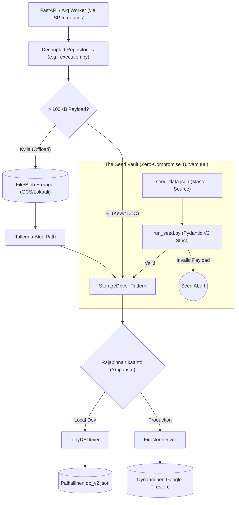

# 09: Tietokanta, Storage Driver ja Repository (Persistence)

Cognitive Quorum hylkää suorat tietokantakohtaiset rutiinit tai perinteiset paksut ORM:t (Object-Relational Mapping). Järjestelmä operoi asynkronisen **Storage Driver Pattern** -arkkitehtuurin kautta, joka mahdollistaa koodin saumattoman siirrettävyyden pilven ja lokaalin koneen välillä (Environment Sovereignty) ilman pienimpiäkään muutoksia liiketoimintalogiikkaan.

## 1. Interface Segregation and Unified Repository

Kaika backendin datakutsut reititetään ISP-yhteensopivien rajapintojen (Interface Segregation Principle) kautta. Service-kerros ei koskaan tunne "God Class" -monolyyttiä, vaan injektoi ainoastaan omia, tiukasti rajattuja interface-abstraktioitaan (esim. `IWorkflowRepository`, `IExecutionRepository`, `ISystemRepository`, `IIdentityRepository`, `IComponentRepository`). Taustalla asynkronisista I/O-operaatioista ja Storage Driver -logiikasta vastaa erikoistuneet rinnakkaisluokat, jotka injektoivat ajuriksi joko `TinyDBDriver` (Local Dev) tai `FirestoreDriver` (Tuotanto).

### Phase 9: "Big Bang" Repository Decoupling

Vanha arkkitehtuuri nojasi yhteen raskaaseen `AbstractWorkflowRepository` / `UnifiedWorkflowRepository` -luokkaan, joka vastasi kaikista CRUD-operaatioista koko järjestelmässä. Tämä "God Class" -anti-pattern aiheutti massiivisia riippuvuusongelmia ja rikkoi yksittäisvastuuperiaatetta (SRP).

Phase 9 -päivityksessä koko järjestelmä refaktoroitiin noudattamaan ISP-eristystä (Interface Segregation Principle):
1. **Decoupled Repositories:** Vanha monolyytti on pilkottu roolipohjaisiin abstrakteihin rajapintoihin, jotka sijaitsevat `database/repositories/` -hakemistossa (esim. `audit.py`, `execution.py`, `identity.py`, `system.py`, `workflow.py`).
2. **Riippuvuuksien Injektointi (Dependency Injection):** API-palvelut ja Service-kerros luottavat nyt yksinomaan näihin tiukasti rajattuihin rajapintoihin yhden valtavan tietokantaluokan sijaan. Tämä eristys varmistaa 100% Pydantic V2 -rakenteellisen eheyden (Structural Integrity) koko arkkitehtuurissa.
3. **HookDependencies (The Contract):** Koukuille ei enää injektoida yleistä `repository`-oliota, vaan tiukasti tyypitetty `HookDependencies` -luokka, josta jokainen abstrahoitu instanssi (`exec_repo`, `workflow_repo`, `comp_repo` jne.) löytyy omasta nimiavaruudestaan.
4. **Pydantic V2 Strict Mocks:** Testiautomaatio on pakotettu käyttämään täydellisiä mock-toteutuksia MagicMock/AsyncMock -luokkien sijaan, silloin kun arkkitehtuuri odottaa täyttä Pydantic V2 -oliota tai tarkasti tyypitettyä sanakirjaa. Ainoa sallittu LLM-mockaus tapahtuu ohjatusti `backend_v2/llm/mock_data.py` -vakiovastausten avulla testiautomaatiossa.

### Raskaiden Blobien Offload (Firestore Limits)
Tapahtumaperusteisen historiikin (Event Sourcing) myötä tietokantaan syntyy massiivisia Data Transfer -objekteja (`execution_trace`). Koska Googlen Firestore rajoittaa yhden tiedoston koon maksimissaan yhden (1) megatavun suuruiseksi, repository ratkaisee rajoitteen abstraktisti lennossa:
* `_offload_payloads()` -metodi huomaa, jos avainkentät lähestyvät 100 kilotavun soft-rajaa. Mikäli raja ylittyy, Abstrakti Repository ohjaa valtavan JSON-merkkijonon tiedostopalvelimelle (GCS Bucket tai lokaali levy) pelkkänä binääripakettina, tallentaen itse päätietokantaan vain polkureferenssin (`..._storage_path`).
* Kun data haetaan API:lle (`_hydrate_payloads()`), repository lataa ja liimaa Blobien sisällön takaisin alkuperäiseen rakenteeseen saumattomasti.

### Decoupled MCP Audit Trails
Ennen mahdollisia Blob-siirtoja `_offload_payloads()` poimii `frozen_context` -paketista erilleen tekoälyn työkalukutsut (`mcp_tool_audit`). Blob-storagen sijaan nämä MCP-lokit ohjataan tallennettavaksi täysin erillisinä dokumentteina tietokannan `executions/{doc_id}/audit_trails` -alakokoelmaan, mikä mahdollistaa helpomman selaamisen ja analysoinnin.

### Työnkulkujen Versiointi (System Sovereignty)
Backend API:sta tulevat päivityspyynnöt ohjataan `AppendOnlyRepository` -luokan kautta. Tämä toteuttaa tiukan **Append-Only** -protokollan forensisen jäljitettävyyden vaalimiseksi. Sen sijaan että data ylikirjoitettaisiin, vanha tietue merkitään `{"is_latest": False}` ja uusi tietue luodaan vanhan ID:n pohjalta käyttämällä `_increment_version` -metodia. Tämä arkkitehtuurillinen System Sovereignty varmistaa, että vanhat ajot pysyvät pysyvästi kytkettyinä juuri niihin historiallisiin konfiguraatioihin, joilla ne alunperin suoritettiin.

## 2. API ja Pydantic (SSOT Validation)

Järjestelmä noudattaa tarkkaa rajapintaeristystä (Controller-Service-Repository).
Repository-kerros on jo kehittynyt validoimaan kriittisen datan lennossa: esimerkiksi `get_execution()` ja `get_workflow_definition()` palauttavat natiivisti Pydantic V2 -objekteja. Listahakujen kohdalla repository-kerros soveltaa Graceful Degradation -mallia: korruptoituneet yksittäiset tietueet lokitetaan ja ohitetaan, jottei yksi viallinen dokumentti kaada koko listausta 500/400 Server Errorilla. Yksittäisten hakujen ja API-rajapinnan rajalla odottamattomat kentät (`extra="forbid"`) katkaisevat edelleen pyynnön Fail-Fast -säännön mukaisesti ennemmin kuin sallisivat virheellisen järjestelmätiedon valua UI:n puolelle haamuvikoina.

## 3. The Seed Vault (Nollatoleranssi)

Globaalien järjestelmäkonfiguraatioiden (PromptBlocks, Workflow DAGs, Output Profiles) perustiheys on irrotettu tuotantokannasta turvalliseen **Seed Vault** -järjestelmään (`backend_v2/seed/`).

* **Epic 60 Decoupled Blocks Persistence:**
  `seed_data.json` -tiedostossa kaikki dynaamiset ohjeet ja matriisit on tallennettu itsenäisinä `PromptBlock` -tietueina tyypin ja kategorian mukaan. `Workflow` ja `Step` -skeemat viittaavat näihin lohkoihin erillisten Opaque Stripe ID -kenttien (`role_block_id`, `extraction_protocol_block_id`, `criteria_block_ids`) kautta flat-listan sijaan. Tämä ehkäisee skeemavirheitä ja dynaamisen mallin kääntämisessä tapahtuvia kaatumisia asynkronisessa worker-prosessissa.
* **Double-Lock Override Persistence:**
  Siemendatan `TDAAssertion` -säännöt sisältävät sääntökohtaiset `allow_contextual_override: bool` -kytkimet, ja `Workflow` -tietueet sisältävät ylätason `enable_contextual_overrides: bool` -kytkimet. Nämä kytkimet tallentuvat immutaabelisti ja ne hydratedaan suoraan Pydantic-kerrokseen System 2 -kaksoislukitusta varten.
* **ModelProfile ja Dynaamiset Ympäristömuuttujat (Epic 62):**
  Tehostettu `ModelProfile`-persistointi tallentaa ja siirtää `caching_strategy`-asetukset sekä joustavan `additional_params`-sanakirjan suoraan `seed_data.json`-tiedostoon osana mallin rekisteriä. Tämä eliminoi kovakoodatut pilvisijainnit (kuten Google Cloud `us-central1` Vertex AI -konesalit) taustakoodista ja mahdollistaa niiden suvereenin hallinnan tietokantatasolla dynaamisten ympäristömuuttujien (`${VERTEX_LOCATION}`) kautta, jotka ratkaistaan I/O-ajon aikana.
* **Manuaalinen muokkauskielto (Seed Mutation Protocol):** `.db` tai `db_v2.json` suora manuaalinen muokkaus kehittäjien tai tekoälyn toimesta on ehdottoman kielletty. Tämä koskee myös `seed_data.json` -tiedostoa: jopa pienet muutokset aiheuttavat tuhoisan skeema-driftin.
* **Source of Truth:** Lokaalit tai globaalit testidata ja vakiot asuvat pelkästään mastertiedostossa `backend_v2/seed/seed_data.json`.
* **Kielto sed/awk -käytölle:** JSON-dataa ei saa koskaan muokata lennosta terminaalikomennoilla.
* **Backup & Scripting Mandatory:** Jokainen rakenteellinen datamuutos `seed_data.json` -tiedostoon TEHDÄÄN AINA erillisellä lyhytikäisellä Python-skriptillä. Skriptin on ladattava JSON, otettava varmuuskopio `backend_v2/seed/backups/` -hakemistoon, muokattava dataa ja lopuksi kirjoitettava se takaisin tiedostoon. Skriptin ajon yhteydessä datan on läpäistävä Pydantic V2 -mallien validointi.
* **TDAAssertion ja Atomisaation Determinismi:** Aiempi LLM-pohjainen `atomization_cache.json` on tuhottu. `PromptBlock`-objektien "micro_atoms" -rakenne on korvattu tiukasti tyypitetyllä `tda_assertions` -listalla `seed_data.json` -tiedostossa. Tällä varmistetaan, että kaikki väitteiden arviointisäännöt ja käänteisen logiikan (Inverse Logic / Vice) säännöt ovat täysin deterministisiä, 100% arkkitehtuurin SSOT-mallin mukaisia ja injektoidaan PromptCompilerin kautta lennossa (Hybrid Prompting) täysin ilman LLM-pohjaista atomisaatiota.
* **Opaque Stripe IDs:** Kaikissa luoduissa tunnisteissa on seurattava ehdotonta Opaque ID -mallia. Ihmisluettavia semanttisia avaimia on kielletty käyttämästä. Opaque-mallit varmistavat aukottoman globaalin tason tietokantaintegritaation ja eristävät dataobjektien viittaukset nimien muutoksista.
* **Tietokannan Rakenteellinen Koskemattomuus:** 
  - Järjestelmän tietomalli nojaa tiukasti relaatiomaiseen Single Source of Truth -malliin. Esimerkiksi **Tulostusprofiilit (Output Profiles)** asuvat *ainoastaan* globaalissa `output_profiles`-Pääkokoelmassa.
  - Vaikka kooditason Pydantic-mallit esittelisivät upotettuja rakenteita, näitä upotettuja rakenteita **EI KOSKAAN** saa fyysisesti tallentaa tai siirtää `seed_data.json` -tiedostoon. Backendin Service-kerros on vastuussa datan dynaamisesta kokoamisesta lennossa silloin kun käyttöliittymä sitä pyytää.
* **Tietokannan Resetointistrategiat (Hard vs Soft):** Arkkitehtuuri on jaettu kahteen eri nollausmalliin.
  - **Hard Reset (`run_seed.py`):** Pudottaa kaikki tietokannan taulut (`db.drop_tables()`) ja rakentaa arkkitehtuurin puhtaalta pöydältä luomalla uudet Validoidut Pydantic-oliot `seed_data.json`-lähteestä. Tuhoaa prosessin aikana automaattisesti myös kaikki fyysiset artifaktit (`data/files/executions`) jotta levyasema pysyy puhtaana.
  - **Soft Reset (`wipe_user_data.py`):** Kirurginen resetointi, joka tyhjentää ainoastaan käynnissä olevat dynaamiset suoritukset ja työnkulut, säilyttäen järjestelmäkonfiguraatiot koskemattomina ja poistaen fyysiset orvot tiedostot.
* **Tietokannan Sadonkorjuustrategia (Inverse Merge):** 
  - **Surgical Extraction (`harvest_output_profile.py`):** Tämä skripti lukee yksinomaan halutun taulun lokaalitiokannasta, suorittaa tarvittaessa konversiot ja injektoi datan takaisin `seed_data.json` -tiedostoon ohittaen käsin muokkaamisen riskit. Tämä takaa datan siirtymisen käyttöliittymästä versionhallintaan täysin turvallisesti.
* Data astuu virallisesti voimaan vasta kun komento (`uv run python backend_v2/seed/run_seed.py local`) puhdistaa ja todentaa `seed_data.json`:in Pydantic-mallien läpi nollavirhein.

## Epic 57: Varianssitulosten ja laajennusten tallennus (Persistence)

Epic 57 -uudistuksen myötä syntyneet uudet datarakenteet integroidaan saumattomasti Append-Only -tietokanta-arkkitehtuuriin:

* **In-Memory & Frozen Contexts:** `generate_report_hook` -suorituksen laskema varianssidata (`VarianceValidationExtension`) ei muuta olemassa olevaa historiallista suoritusdataa. Se tallennetaan osaksi `ExecutionRecord`-tietuetta (`profile_syntheses["prof_X"].output_extensions`), mikä lukitsee tuloksen ikuiseksi **Frozen Context** -snapshotiksi.
* **Storage Driver & JSON-tallennus:** Sekä lokaali `TinyDBDriver` (joka operoi `db_v2.json`-tiedoston kautta) että pilven `FirestoreDriver` tallentavat `VarianceValidationExtension`-objektit litteinä JSON-tietueina. Pydantic-kerroksen `@field_validator`-säännöt hoitavat dynaamisen tyyppimuunnoksen takaisin strict-tyyppisiksi laajennuksiksi (hydraatio), kun tietue ladataan takaisin muistiin.
* **Mock-auth & Test Data Seeding:** Paikallista kehitystä ja integraatiotestausta varten `seed_data.json` siemennetään `run_seed.py local` -skriptillä, joka validoi kaikki matriisit ja askeleet Pydantic V2 -tiukkuudella varmistaen, että testiajot pystyvät matkimaan kognitiivisia asiantuntijatuloksia ja triggeröimään mekaanis-kognitiivisen ristiinvertailun.

 

➡️ **Seuraavaksi:** Kirjan päätteeksi lue [10_infrastructure_and_logs.md](./10_infrastructure_and_logs.md), joka kertoo, miten ylläpidämme järjestelmän havainnoitavuutta (Logfire) ja paikannamme virheitä asynkronisen kaaoksen keskeltä.
