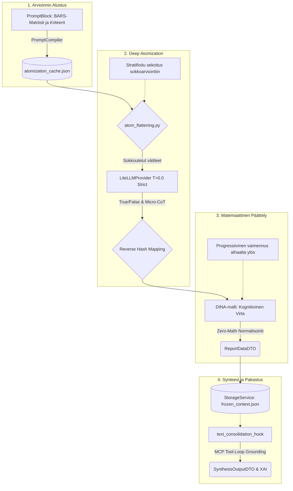
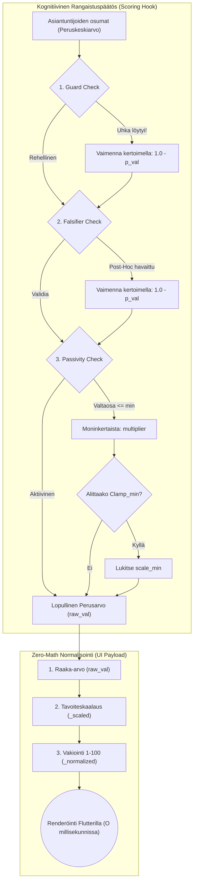

# 09: Kognitiivinen Arviointiarkkitehtuuri ja Pisteytys (DINA-malli)

Tämä luku kuvaa asiantuntija-arviointijärjestelmän ydintä, jonka vastuulla on purkaa laajoja aineistoja mitattaviksi subatomisiksi yksiköiksi ("Deep Atomization") ja muuntaa ne matemaattisesti jatkuviksi, vikasietoisiksi arvosanoiksi (Cognitive Diagnostic Dampening). Järjestelmä on toteutettu Universal Quality Gate -vaatimusten mukaisesti, noudattaen ehdotonta Pydantic Fail-Fast -protokollaa, RFC 7807 virheenkäsittelyä ja Zero-Math UI -mandattia.

## Arkkitehtuurin Yleiskuva (Mermaid Visualisointi)

Alla oleva vuokaavio kuvaa kognitiivisen arviointimoottorin datavirran aina holististen asiakirjojen atomisoinnista lopulliseen Zero-Math normalisointiin ja XAI-synteesiin saakka:

## 1. Miten Atomisoidut Väitteet Syntyvät?

Järjestelmän arviointi luottaa atomisaatioon, missä matriisin kriteerit on valmiiksi pureskeltu pienimpiin mahdollisiin logiikkayksiköihin.

**Dynaaminen Pydantic-mallinnus:**
Atomisoidut väitteet ja ohjeistukset luodaan järjestelmään dynaamisesti `PromptCompiler` ja `BlueprintTransformer` -moduulien avulla. Työkalu analysoi laajat asiantuntijakriteerit (`PromptBlock`) ja purkaa ne tiukasti tyypitettyihin Pydantic-rakenteisiin, estäen hallusinaatiot. `atomization_cache.json` huolehtii lokaalista välimuistista "Deep Atomization" -vaiheessa, eliminoiden tarpeettomat LLM-kutsut ja taaten deterministisen ajon konfiguraatiovaiheessa (Seeding).

## 2. Deep Atomization (Syvä Atomisaatio asynkronisessa ajossa)

Perinteinen LLM-pohjainen lausuntojen arviointi kykenee harvoin tuottamaan tiukkoja, luotettavia arvosanoja. Järjestelmä ratkaisee tämän pilkkomalla arvioinnin suoritusvaiheessa:

1. **Rajoittamaton Otanta ja Globaali Sokkosekoitus (Runtime Flattening):**
   Välttääksemme LLM:n rakenteellisen ennakkoasenteen (Hierarchy Bias), kaikki atomit viedään `atom_flattening.py` -hookkiin. Epic 23:n myötä olemme poistaneet keinotekoiset otantarajoittimet (kuten `STRATIFIED_3`), asettamalla globaaliksi vakioksi `SystemConcurrency.MATRIX_SAMPLING_LIMIT = 0` (ALL). Tämä mahdollistaa teoriassa rajattoman kysymysmassan sisäänluvun. Jos satunnaisotantaa poikkeuksellisesti vaaditaan (arvo > 0), haku ohjautuu deterministisesti:
   - **Skaalan sisäinen satunnaistus:** Otanta käyttää kryptografista siemenlukua muodossa `secure_seed = f"{state.execution_id}_{block.id}_scale_{scale.score}"`.
   - **Globaali sokkosekoitus:** Lopullinen atomilistan globaali sokkosekoitus purkaa data-alkiot täysin epäjärjestykseen sokeuttaen tekoälyn. Sekoitus sidotaan suorituksen globaaliin siemenlukuun `state.execution_id`.
   (Lähde: backend_v2/hooks/atom_flattening.py, funktio: process_matrix_flattening)
2. **Asynkroninen Map-Reduce Orchestration (ChunkingService):**
   Jotta satojen kysymysten yhtäaikainen sokea arviointi ei johtaisi Timeout/429 Rate Limit -kaatumisiin tai json-skeeman rikkoutumiseen LLM:n muistin loppuessa (Token Explosion), `LLMNodeStrategy` suorittaa Map-Reduce -operaation. Massiivinen kysymyslista luovutetaan `ChunkingService`-komponentille, joka pilkkoo sen turvallisiin Opaque Stripe ID -suojattuihin osiin (`SystemConcurrency.LLM_MAX_CHUNK_SIZE`-sääntöjen mukaisesti). Palikat ajetaan vahvasti rinnakkain `asyncio.TaskGroup` ja `Semaphore` -varmistuksin. Lopulta erilliset rakenteelliset vastaukset parsitaan takaisin yhtenäiseksi `List[FlattenedAtomResult]` -paketiksi täydellisellä 1:1 osumatarkkuudella.
3. **Eristetty Runtime AI (T=0.0):**
   LLM suorittaa kunkin Map-Reduce -lohkon arvioinnin tiukassa "Strict Mode" -tilassa, missä `LiteLLMProvider` vaatii koodilta absoluuttisesti TPM/RPM-rajoitusten määrittämistä. Jos Pydantic-validaatio epäonnistuu yksittäisessä chunkissa, arkkitehtuuri ei yritä "arvailla" fallback-arvoja (Zero-Fallback), vaan nostaa välittömästi RFC 7807 `AppException` -virheen (Fail-Fast).
4. **Paluu Rakennetilaan:**
   Kun kaikki asynkroniset LLM-palat on suoritettu ja vastaukset (True/False & Micro-CoT -perustelut) on sulatettu yhteen, arviointimoottori tekee käänteisen hajautuksen (Reverse Hash Mapping) liittääkseen tulokset takaisin oikeisiin `ReportDataDTO`-mallin mukaisiin dynaamisiin matriisiskaalatasoihin.

## 3. Pisteytyslogiikka: Progressive Dampening (DINA-malli)

Pelkkä osumien aritmeettinen painotettu keskiarvo johtaisi "Sycophancy"-ongelmaan: Jos alimmat faktat (Taso 1) uupuvat kohdetekstistä, mutta malli kehuu keksittyjä strategioita vuolaasti (Taso 5), aritmeettinen keskiarvo antaa vaarallisen hyväksyvän lopputuloksen.

Järjestelmä hyödyntää ratkaisuna **Kognitiivista Diagnostiikkamallia (Cognitive Diagnostic Dampening - DINA)**.

### Matemaattinen Malli (Kognitiivinen Virta)
Pisteytysmalli rakentuu jatkumoon, jossa alimmat tasot portinvartijoina määrittävät kognitiivisen virtauksen (*Cognitive Flow*) vahvuuden kerroin kerrokselta ylöspäin.

* Arvosana lähtee rakentumaan perusarvosta `scale_min` (yleensä 1.0) jolloin virtakerroin `modifier` vastaa suoraan ensimmäisen tason onnistumisprosenttia.
* Ylemmillä tasoilla jokainen saavutettu atomi tuo pisteitä ohjelmistolle **vain sen verran, minkä alapuolelta tuleva virta sallii** (`achieved_score += step_value * hit_rate * modifier`).
* Itse virtakerroin vaimentuu edelleen kuluvan tason onnistumisprosentilla (`modifier *= hit_rate`).

**Lopputulos:** DINA-laskennan tulokset normalisoidaan täsmällisesti `scales.score` -rajoissa backend-kerroksessa. Kokonaislaskenta ei vuoda ulos abstrakteja liukulukuja, vaan noudattaa tarkkaa mypy/Pydantic "Zero-Math" säännöstöä, mikä pakottaa tiukan tyyppiturvallisuuden matemaattisiin operaatioihin.

### Rangaistusmekanismit (Penalty Logic)

Järjestelmä alentaa kognitiivisen arviointimoottorin määrittämää perusarvosanaa erilaisten rangaistusten (Penalties) avulla. Rangaistukset toteutuvat tiukasti seuraavien sääntöjen ja metodien mukaisesti:

- **Turvallisuusuhat (Security Threat):** Järjestelmä tarkistaa suorituksen Guard-asteelta (Security Check), onko turvallisuusuhka havaittu (`threat_detected`). (Lähde: backend_v2/hooks/scoring.py, funktio: _extract_guard_flag)
  - Jos uhka on havaittu ja asetuksissa määritetty `scoring_security_penalty` on suurempi kuin nolla, loppuarvosanaa lasketaan kertomalla se vaimennuskertoimella `(1.0 - p_val)`. (Lähde: backend_v2/hooks/scoring.py, funktio: apply_scoring_logic_hook)

- **Jälkikäteisrationalisointi (Post-Hoc Rationalization):** Järjestelmä tarkastaa Falsifier- tai Panel-moduulin tuottamasta datasta `post_hoc_rationalization` -lipun, jolla testataan argumentoinnin pitävyyttä. (Lähde: backend_v2/hooks/scoring.py, funktio: _calculate_falsifier_penalty)
  - Mikäli lippu on aktiivinen ja asetuksissa määritetty `scoring_post_hoc_penalty` on suurempi kuin nolla, loppuarvosanaa pienennetään kertomalla se vaimennuskertoimella `(1.0 - p_val)`. (Lähde: backend_v2/hooks/scoring.py, funktio: apply_scoring_logic_hook)

- **Passiivisuusrangaistus (Passivity Penalty):** Tuomaristomoduulin ("Judge" tai V2 Matriisi) tuottamia arvosanoja analysoidaan puutteellisten laatutasojen varalta. Jos minkä tahansa ulottuvuuden (dimension) saama arvosana on yhtä suuri tai pienempi kuin määritetty minimiarvo `scale_min` (oletus V2 matriiseille on 1.0), passiivisuusrangaistus aktivoituu. (Lähde: backend_v2/hooks/scoring.py, funktio: enforce_passivity_penalty_hook)
  - Rangaistuksen aktivoituessa, kokonaisarvosanaa (tai kyseisen matriisi-dimension osaarvosanaa) lasketaan kertomalla se asetusarvolla `multiplier` (`scoring_passivity_multiplier`). (Lähde: backend_v2/hooks/scoring.py, funktio: enforce_passivity_penalty_hook)
  - Puristussääntö (Safety Clamp): Mikäli laskettu uusi arvosana vaimennetaan niin pieneksi, että se alittaa sallitun minimiarvon `scale_min`, järjestelmä lukitsee eli puristaa tuloksen ehdottomaan alarajaan `new_score = scale_min`. (Lähde: backend_v2/hooks/scoring.py, funktio: enforce_passivity_penalty_hook)

#### Scoring Hook Pipelines (Mermaid Visualisointi)

Alla oleva vuokaavio konkretisoi edellä kuvatun matemaattisen Rangaistus- ja Normalisointilogiikan askel askeleelta, varmistaen Flutterin täydellisen Zero-Math pariteetin:

## 4. eXplainable AI (XAI), Audit Trail ja Agentic Grounding

Laskentamoottori hyödyntää MCP (Model Context Protocol) tool-calling -arkkitehtuuria yhdistääkseen laskut puhtaaksi, todistettavaksi ihmiskieliseksi XAI-tulkinnaksi.

**Kaksivaiheinen Agenttiarkkitehtuuri (Two-Pass Agentic Hook):**
Järjestelmä käyttää `text_consolidation_hook` -moduulia, joka suorittaa synteesin kahdessa vaiheessa:
1. **Tutkiva vaihe (`execute_tool_loop`):** MCP Tool-calling -ominaisuuksia hyödyntävä "ajattelu"-luuppi tekee tiedonhankintaa ja rakentaa Micro-CoT -päättelyketjut dynaamisesti luettuaan dokumentit/verkon asiasanoja.
2. **Rakenteistettu vaihe (Structured Output):** Vain onnistuneen tool-loopin jälkeen data pakotetaan tiukkaan `SynthesisOutputDTO` / `XAIOutputDTO` -skeemaan finalisointia varten.

**XAIOutputDTO -rakenne (Strictly Typed):**
Tekoälyn rakenteistettu XAI-synteesi pakotetaan seuraavaan Pydantic-malliin, jonka jokainen kenttä on pakollinen yhtenäisen laadun takaamiseksi:

- `executive_summary`: Korkean tason tiivistelmä (High-level summary).
- `verified_facts`: Synteesi todennetuista faktoista (Synthesis of facts).
- `cognitive_behavior`: Synteesi Profiler- ja Falsifier-moduulien löydöksistä (Synthesis of Profiler and Falsifier findings).
- `causal_chain`: Synteesi syy-seuraussuhteista ja Logician-moduulin havainnoista (Synthesis of Causal and Logician findings).
- `analysis_strengths`: Tunnistetut vahvuudet (Strengths identified).
- `analysis_weaknesses`: Tunnistetut heikkoudet (Weaknesses identified).
- `analysis_opportunities`: Tunnistetut mahdollisuudet (Opportunities identified).
- `analysis_recommendations`: Suositukset toimenpiteille (Recommendations).

*Pydantic-validointi:* Kenttien oikeellisuus varmistetaan Pydanticin `@field_validator`-metodeilla (esim. `validate_non_empty`), jotka estävät ehdottomasti tyhjien tai puhtaasti välilyöntejä sisältävien merkkijonojen ohittamisen järjestelmään vikatilanteissa.
(Lähde: backend_v2/models/domain/xai.py, luokka: XAIOutputDTO)

Jokaista lasketun tuloksen taustaa varten luodaan ihmiskieliset lokit ja ne tallennetaan `frozen_context.json` -tiedostoon. Nämä perustelut ovat Native English Generation -säännön alaisia, minimoiden satunnaisen harhautumisen lokituksessa ja antaen käyttäjälle absoluuttista todistettavuutta tulosten synnystä.

## 5. UI Rendering ja Zero-Math Pariteetti

Graafinen käyttöliittymä (Flutter Client) on alistettu tiukkaan **Zero-Math sääntöön** koko tuotantoketjun pituudelta ottamalla käyttöön vikasietoinen "De-Generator" pattern.

Kaikki pistelaskennan desimaalit, normalisoinnit sekä tasojen kynnysarvojen suhteutus kootaan pelkästään Pythonin backendillä (esim. `ReportDataDTO` muotoon). Frontend olettaa aina saavansa valmiiksi arvoiltaan yhdenmukaistettua dataa, piirtäen graafiset hajontakuviot (esim. 3D Illusion Detector matrix) suoraan valmiiden matemaattisten tulosten ilmentyminä ohittaen tarpeen asiakaspohjaiselle matemaattiselle logiikalle kokonaan. 

**Backendin Datan Normalisointiprosessi (Valmistelu UI:ta varten):**
Data ratkaistaan kolmiportaisella rakenteella `normalize_matrix_scores_hook` -funktion sisällä:
1. **Alkuperäinen arvo (`raw_val`):** AI:n laskema alkuperäistulos (esim. DINA-vaimennuksen suora liukuluku).
2. **Suhteutettu arvo (`_scaled`):** Kustomoituun tavoiteskaalaan (esim. matriisin oma skaala) matemaattisesti suhteutettu lopullinen arvo.
3. **Normalisoitu arvo (`_normalized`):** Yhteismitallinen 1–100 vakioitu arvo (esim. 100-jakoinen prosenttiskaala), joka mahdollistaa jopa erilaisten alkuperäisskaalojen saumattoman graafisen vertailun.

*Zero-Math Mandaatti:* Tämä hook-arkkitehtuuri varmistaa sen, ettei UI:n (Flutter) tarvitse ikinä suorittaa liukulukulaskentaa (Floating point math). Backend tallentaa ja injektoi valmiiksi lasketut avaimet, kuten `[pb_id]_scaled` ja `[pb_id]_normalized`, lennosta suoraan valmiiseen payload-sanakirjaan. Jos Pydantic API rajoittaa ulostuloa tai data puuttuu, backend nostaa puhtaan `AppException` RFC 7807 Payloadin, jonka Flutter UI renderöi virhekomponenttina yhdellä askeleella.
(Lähde: backend_v2/hooks/scoring.py, funktio: normalize_matrix_scores_hook)

## 6. Tietorakenteet ja Tallennus (Storage & Persistence)

Arviointiarkkitehtuurin tilanhallinta ja datan tallennus on "Event Sourced" -yhteensopiva.

### A. Atomisoidut Väittämät (Konfiguraatio / Siemendata)
Atomit (`micro_atoms`) luodaan järjestelmän siemennysvaiheessa. Pysyvä siemendata luetaan hakemistosta `backend_v2/seed/`. Välimuistitiedosto `backend_v2/seed/atomization_cache.json` estää LLM:ää atomisoimasta vanhoja kriteereitä jatkuvasti uudelleen, taaten nopeat siemennysajot (`run_seed.py local`).

### B. Raaka-arvioinnit ja True/False -tulokset (Suoritustila)
Tekoälyn tekemä sokea atomien arviointityö tallentuu prosessidatana paikallisesti kehityksessä `data/db_v2.json` -tiedoston `executions`-taulukkoon. Koska säilytämme raaan lokin (Execution Trace), jokaista `True/False` arviota (Micro-CoT) voidaan analysoida audit-loopissa jälkikäteen ilman toistoja.

### C. Lopulliset arvosanat ja XAI-perustelut (Output-tila)
Itse matemaattinen päättely (DINA-laskenta) muodostetaan vasta aivan lopuksi `scoring.py` -hookissa.
Lopulliset rakenteet paketoidaan ja pakastetaan `StorageService` (FileDriver) -rajapinnan läpi polkuun `data/files/executions/exe_{id}/frozen_context.json`. Asiakassovellus kykenee lukemaan valmiin UI-datan suoraan FileDriverin yli nanosekunneissa suorittamatta raskaita laskelmia, täyttäen Zero-Math säännön ja pitäen järjestelmän Opaque Stripe ID relaatiot puhtaina ja rikkoutumattomina.

## 7. FinOps ja Token-hallinnan Arkkitehtuuri (Rate-Limit Resurssien Suojaus)

Kognitiivinen arviointimoottori käsittelee valtavia datamassoja (satoja atomeja per matriisi kerrottuna kymmenillä vaiheilla). Jotta LLM-malleille generoitava konteksti ei paisuisi liikaa ja laukaisisi API-toimittajien (esim. Vertex AI) `429 Resource Exhausted / Rate Limit` -rajoituksia, järjestelmässä on sisäänrakennettu älykäs **FinOps-kontekstikompressio**.

Kompressio suoritetaan rekursiivisen avaintenpoiston (stripping) avulla juuri ennen datan viemistä seuraavalle tekoälysolmulle. Toimintalogiikka noudattaa ehdottomasti mandaattia: *"Atomisoiduista kentistä LLM-kontekstiin välitetään vain true/false, mutta matriiseista ja prompteista välitetään rikkaat tekstikentät"*.

**Mekanismin ytimen toiminta:**
1. **Atomi-tason Kompressio:** Järjestelmä siivoaa dynaamisista ajotiloista LLM-solmulle lukukelvottomat ja hyödyttömät metadatat (esim. MD5 `atom_id`) sekä satojen kysymysten raskaat sanalliset Micro-CoT -perustelut (`reasoning`, `quote`). Myös raa'at sekoitetut kysymysmassat (`shuffled_atoms`) hävitetään varhaisilta askeleilta. `evaluations`-lista tiivistetään näin sadoista tuhansista merkeistä puhtaaksi ja kevyeksi totuusarvolistaksi (esim. `[True, False, True, ...]`).
2. **Matriisi-tason Syväanalyysin Säilytys:** Aggressiivisesta token-leikkurista huolimatta kaikki matriisien asiantuntijasolmujen (kuten Profiler, Falsifier) tuottamat laajat holistiset synteesit (esim. `reasoning_trace`, `evaluation_notes`, `step_3_logical_friction`) integroidaan koskemattomana. 

Tällä arkkitehtuurilla alemman tason "Zero-Trust" askeleet tuottavat valtavasti kovaa dataa, mutta huipulla toimiva XAI Reporter näkee vain datasta puhdistetun kokonaisanalyysin, jolloin se pystyy laatimaan täydellisen loppuraportin ilman token-tukehtumisen riskiä. (Lähde: `backend_v2/services/orchestrator/strategies/llm.py`)

## 8. Rakenteellinen Resilienssi (Self-Healing Citations)

Globaali arkkitehtuuri nojaa "Fail-Fast"-periaatteeseen, mutta rakenteellisen JSON-datan palautuksessa LLM-malleilla on taipumus lyhentää tarkkoja viitemerkkijonoja (esim. leikkaamalla pitempi kirjallisuusviite vain muotoon `[1]`), mikäli konteksti on raskas. 

Ennaltaehkäisemään tällaiset triviaalit Pydanticin `Literal`-tyyppien rikkoutumiset järjestelmä injektoi suoritusvaiheessa `PromptCompiler`:in dynaamisiin luokkiin (`MicroCotBase`) ns. **Self-Healing -mekanismin**. 
Pydanticin `model_validator(mode="before")` purkaa sisään tulevan raw-objektin ennen varsinaista muototarkastusta. Mikäli mekanismi huomaa viittauksen edes osittain vastaavan alun perin vaadittua tiukkaa teorialähdettä, se korjaa kentän arvon lennosta täsmäämään alkuperäiseen kovakoodattuun matriisikonfiguraation merkkijonoon. Näin saavutetaan sataprosenttinen Pydantic-turvallisuus puutteellisesta tekoälygeneroinnista huolimatta ilman, että jouduttaisiin peruuttelemaan tai luottamaan vaarallisiin regex-koristeisiin.
