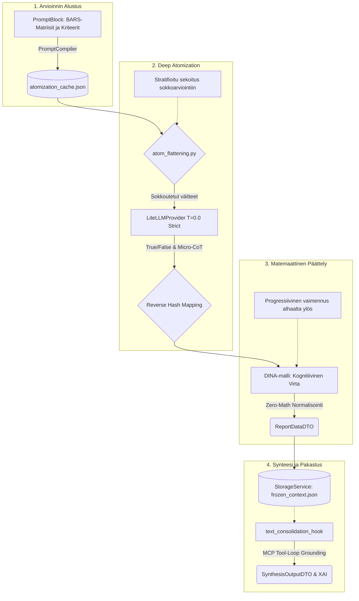

# 09: Kognitiivinen Arviointiarkkitehtuuri ja Pisteytys (DINA-malli)

Tämä luku kuvaa asiantuntija-arviointijärjestelmän ydintä, jonka vastuulla on purkaa laajoja aineistoja mitattaviksi subatomisiksi yksiköiksi ("Deep Atomization") ja muuntaa ne matemaattisesti jatkuviksi, vikasietoisiksi arvosanoiksi (Cognitive Diagnostic Dampening). Järjestelmä on toteutettu Universal Quality Gate -vaatimusten mukaisesti, noudattaen ehdotonta Pydantic Fail-Fast -protokollaa, RFC 7807 virheenkäsittelyä ja Zero-Math UI -mandattia.

## Arkkitehtuurin Yleiskuva (Mermaid Visualisointi)

Alla oleva vuokaavio kuvaa kognitiivisen arviointimoottorin datavirran aina holististen asiakirjojen atomisoinnista lopulliseen Zero-Math normalisointiin ja XAI-synteesiin saakka:

## 1. Miten Atomisoidut Väitteet Syntyvät?

Järjestelmän arviointi luottaa atomisaatioon, missä matriisin kriteerit on valmiiksi pureskeltu pienimpiin mahdollisiin logiikkayksiköihin.

**Dynaaminen Pydantic-mallinnus:**
Atomisoidut väitteet ja ohjeistukset luodaan järjestelmään dynaamisesti `PromptCompiler` ja `BlueprintTransformer` -moduulien avulla. Työkalu analysoi laajat asiantuntijakriteerit (`PromptBlock`) ja purkaa ne tiukasti tyypitettyihin Pydantic-rakenteisiin, estäen hallusinaatiot. `atomization_cache.json` huolehtii lokaalista välimuistista "Deep Atomization" -vaiheessa, eliminoiden tarpeettomat LLM-kutsut ja taaten deterministisen ajon konfiguraatiovaiheessa (Seeding).

## 2. Deep Atomization (Syvä Atomisaatio asynkronisessa ajossa)

Perinteinen LLM-pohjainen lausuntojen arviointi kykenee harvoin tuottamaan tiukkoja, luotettavia arvosanoja. Järjestelmä ratkaisee tämän pilkkomalla arvioinnin suoritusvaiheessa:

1. **Sokkoarviointi ja Stratifioitu Otoksen Sekoitus (Runtime Flattening):**
   Välttääksemme LLM:n rakenteellisen ennakkoasenteen (Hierarchy Bias), kaikki atomit viedään `atom_flattening.py` -hookkiin. Hookki soveltaa stratifioitua valintaa ja sekoittaa atomit täysin sokeaan järjestykseen (`hashlib` + kryptografinen siemenluku).
2. **Eristetty Runtime AI (T=0.0):**
   LLM suorittaa arvioinnin tiukassa "Strict Mode" -tilassa, missä `LiteLLMProvider` vaatii koodilta absoluuttisesti TPM/RPM-rajoitusten määrittämistä. Jos Pydantic-validaatio epäonnistuu, arkkitehtuuri ei yritä "arvailla" fallback-arvoja (Zero-Fallback), vaan nostaa välittömästi RFC 7807 `AppException` -virheen.
3. **Paluu Rakennetilaan:**
   Kun LLM on palauttanut True/False-binääritulokset perusteluineen, arviointimoottori tekee käänteisen hajautuksen (Reverse Hash Mapping) liittääkseen tulokset takaisin oikeisiin `ReportDataDTO`-mallin mukaisille skaalatasoille. Tasot mukailevat aina käytettyä BARS-matriisia (esim. 1–5, 0–3 tai muu dynaaminen kynnysarvo).

## 3. Pisteytyslogiikka: Progressive Dampening (DINA-malli)

Pelkkä osumien aritmeettinen painotettu keskiarvo johtaisi "Sycophancy"-ongelmaan: Jos alimmat faktat (Taso 1) uupuvat kohdetekstistä, mutta malli kehuu keksittyjä strategioita vuolaasti (Taso 5), aritmeettinen keskiarvo antaa vaarallisen hyväksyvän lopputuloksen.

Järjestelmä hyödyntää ratkaisuna **Kognitiivista Diagnostiikkamallia (Cognitive Diagnostic Dampening - DINA)**.

### Matemaattinen Malli (Kognitiivinen Virta)
Pisteytysmalli rakentuu jatkumoon, jossa alimmat tasot portinvartijoina määrittävät kognitiivisen virtauksen (*Cognitive Flow*) vahvuuden kerroin kerrokselta ylöspäin.

* Arvosana lähtee rakentumaan perusarvosta `scale_min` (yleensä 1.0) jolloin virtakerroin `modifier` vastaa suoraan ensimmäisen tason onnistumisprosenttia.
* Ylemmillä tasoilla jokainen saavutettu atomi tuo pisteitä ohjelmistolle **vain sen verran, minkä alapuolelta tuleva virta sallii** (`achieved_score += step_value * hit_rate * modifier`).
* Itse virtakerroin vaimentuu edelleen kuluvan tason onnistumisprosentilla (`modifier *= hit_rate`).

**Lopputulos:** DINA-laskennan tulokset normalisoidaan täsmällisesti `scales.score` -rajoissa backend-kerroksessa. Kokonaislaskenta ei vuoda ulos abstrakteja liukulukuja, vaan noudattaa tarkkaa mypy/Pydantic "Zero-Math" säännöstöä, mikä pakottaa tiukan tyyppiturvallisuuden matemaattisiin operaatioihin.

## 4. eXplainable AI (XAI), Audit Trail ja Agentic Grounding

Laskentamoottori hyödyntää MCP (Model Context Protocol) tool-calling -arkkitehtuuria yhdistääkseen laskut puhtaaksi, todistettavaksi ihmiskieliseksi XAI-tulkinnaksi.

**Kaksivaiheinen Agenttiarkkitehtuuri (Two-Pass Agentic Hook):**
Järjestelmä käyttää `text_consolidation_hook` -moduulia, joka suorittaa synteesin kahdessa vaiheessa:
1. **Tutkiva vaihe (`execute_tool_loop`):** MCP Tool-calling -ominaisuuksia hyödyntävä "ajattelu"-luuppi tekee tiedonhankintaa ja rakentaa Micro-CoT -päättelyketjut dynaamisesti luettuaan dokumentit/verkon asiasanoja.
2. **Rakenteistettu vaihe (Structured Output):** Vain onnistuneen tool-loopin jälkeen data pakotetaan tiukkaan `SynthesisOutputDTO` -skeemaan finalisointia varten.

Jokaista lasketun tuloksen taustaa varten luodaan ihmiskieliset lokit ja ne tallennetaan `frozen_context.json` -tiedostoon. Nämä perustelut ovat Native English Generation -säännön alaisia, minimoiden satunnaisen harhautumisen lokituksessa ja antaen käyttäjälle absoluuttista todistettavuutta tulosten synnystä.

## 5. UI Rendering ja Zero-Math Pariteetti

Graafinen käyttöliittymä (Flutter Client) on alistettu tiukkaan **Zero-Math sääntöön** koko tuotantoketjun pituudelta ottamalla käyttöön vikasietoinen "De-Generator" pattern.

Kaikki pistelaskennan desimaalit, normalisoinnit sekä tasojen kynnysarvojen suhteutus kootaan pelkästään Pythonin backendillä (esim. `ReportDataDTO` muotoon). Frontend olettaa aina saavansa valmiiksi arvoiltaan yhdenmukaistettua dataa, piirtäen graafiset hajontakuviot (esim. 3D Illusion Detector matrix) suoraan valmiiden matemaattisten tulosten ilmentyminä ohittaen tarpeen asiakaspohjaiselle matemaattiselle logiikalle kokonaan. Jos Pydantic API rajoittaa ulostuloa, backend nostaa puhtaan `AppException` RFC 7807 Payloadin, jonka Flutter UI renderöi yksivaiheisesti.

## 6. Tietorakenteet ja Tallennus (Storage & Persistence)

Arviointiarkkitehtuurin tilanhallinta ja datan tallennus on "Event Sourced" -yhteensopiva.

### A. Atomisoidut Väittämät (Konfiguraatio / Siemendata)
Atomit (`micro_atoms`) luodaan järjestelmän siemennysvaiheessa. Pysyvä siemendata luetaan hakemistosta `backend_v2/seed/`. Välimuistitiedosto `backend_v2/seed/atomization_cache.json` estää LLM:ää atomisoimasta vanhoja kriteereitä jatkuvasti uudelleen, taaten nopeat siemennysajot (`run_seed.py local`).

### B. Raaka-arvioinnit ja True/False -tulokset (Suoritustila)
Tekoälyn tekemä sokea atomien arviointityö tallentuu prosessidatana paikallisesti kehityksessä `data/db_v2.json` -tiedoston `executions`-taulukkoon. Koska säilytämme raaan lokin (Execution Trace), jokaista `True/False` arviota (Micro-CoT) voidaan analysoida audit-loopissa jälkikäteen ilman toistoja.

### C. Lopulliset arvosanat ja XAI-perustelut (Output-tila)
Itse matemaattinen päättely (DINA-laskenta) muodostetaan vasta aivan lopuksi `scoring.py` -hookissa.
Lopulliset rakenteet paketoidaan ja pakastetaan `StorageService` (FileDriver) -rajapinnan läpi polkuun `data/files/executions/exe_{id}/frozen_context.json`. Asiakassovellus kykenee lukemaan valmiin UI-datan suoraan FileDriverin yli nanosekunneissa suorittamatta raskaita laskelmia, täyttäen Zero-Math säännön ja pitäen järjestelmän Opaque Stripe ID relaatiot puhtaina ja rikkoutumattomina.
