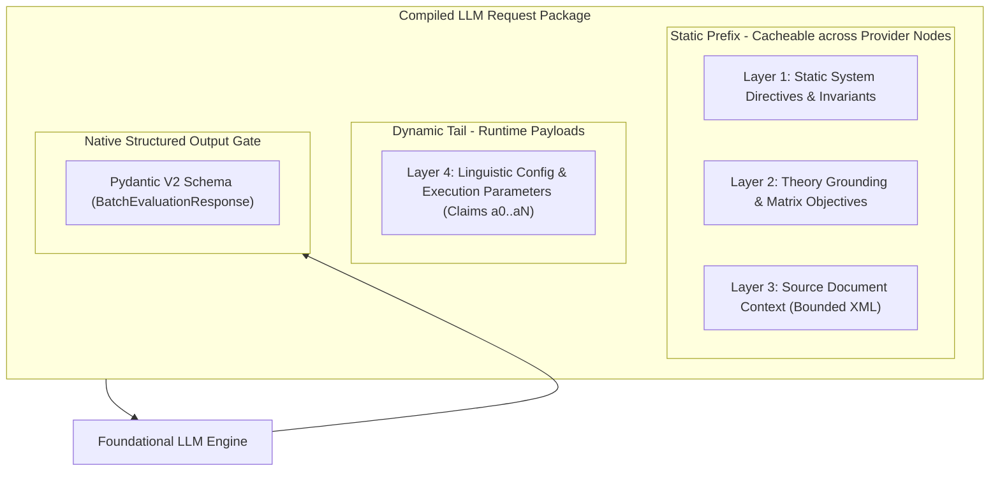
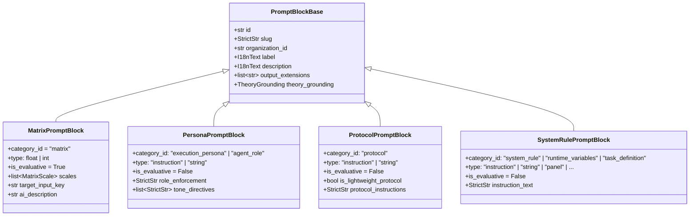
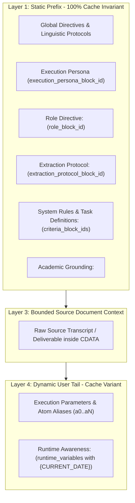
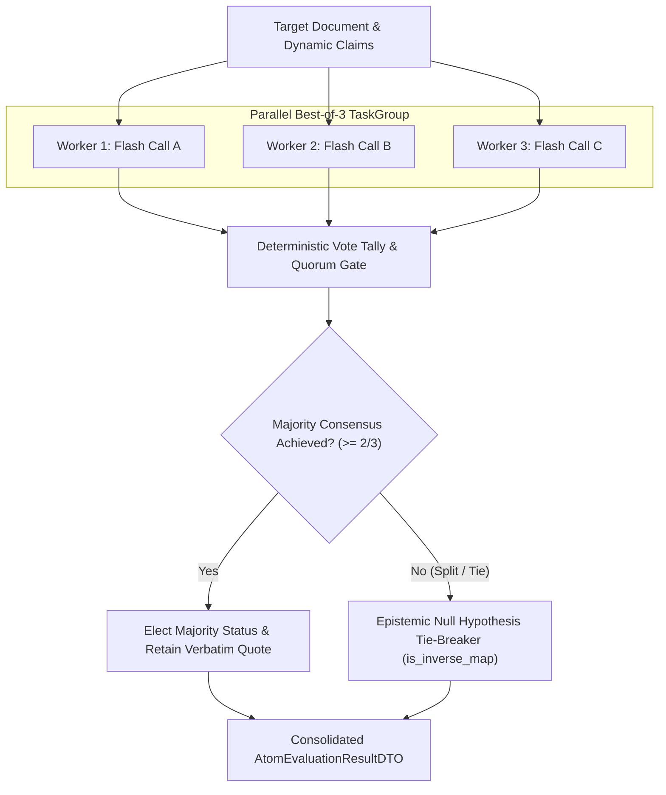
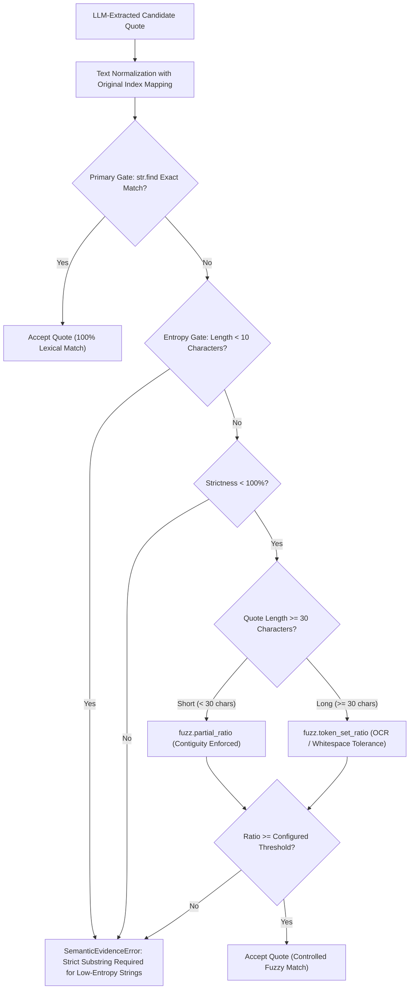

# LLM Prompt Orchestration & Matrix Evaluation Architecture

Architectural reference and developer handbook documenting the mechanics of large language model (LLM) instruction compilation, Test-Driven Assertion (TDA) matrix evaluation, CDATA shielding, and the operational synergy between system rule prompt blocks and evaluative criteria.

---

## 1. Architectural Foundations: What, Why, and How

### 1.1 What is LLM Prompt Orchestration in Quorum?
In Quorum, LLMs are not interactive conversational chat agents. Instead, they function as **stateless, deterministic cognitive audit engines**. Orchestration is the process that compiles academic domain models, Behavioral Anchored Rating Scales (BARS), structural extraction rules, and raw source materials into strictly segregated, cache-optimized prompts. Every evaluation terminates in a rigid, statically typed Pydantic V2 schema via native Structured Outputs.

### 1.2 Why is Prompt Orchestration Engineered This Way?
Unconstrained LLM generation in evaluative workflows suffers from three systemic vulnerabilities:
1. **Sycophancy & Leniency Bias:** Foundational models inherently favor affirmation, validating superficial claims, generating conversational filler, and overlooking missing analytical rigor.
2. **Hallucination & Chimera Evidence:** When asked to find evidence without rigorous boundaries, models fabricate quotes, summarize instead of transcribing, or splice disparate clauses across documents into artificial justifications ("Chimera quotes").
3. **Latency & FinOps Inefficiency:** Monolithic, dynamic prompts that inject execution variables into the system directive break model provider prefix caching, causing high latency and multiplying inference costs.

To eliminate these vulnerabilities, Quorum enforces the **Four-Layer Clean Stack** hierarchy:
* **Layer 1: Static System Directives & Epistemic Protocols:** Static prefix defining strict evaluator posture, null-hypothesis tie-breakers, and quote invariants.
* **Layer 2: Theory Grounding & Epistemic Context:** Explicit academic citations and domain objectives framing the cognitive audit.
* **Layer 3: Massive Context Target:** Raw source materials (transcripts, deliverables, logs) encapsulated inside bounded XML tags.
* **Layer 4: Dynamic Execution Parameters:** Runtime batch assertions (TDA atoms) mapped to deterministic opaque aliases (`a0`, `a1`), isolated at the absolute tail of the message payload.

Layers 1 through 3 constitute an immutable prefix that achieves **95%+ Context Caching efficiency** across providers, while Layer 4 isolates runtime variability.



---

## 2. Comprehensive TDA Matrix Evaluation Reference

A Test-Driven Assertion (TDA) represents the smallest indivisible unit of evidentiary evaluation within a BARS scale. Each TDA assertion configures thirteen operational parameters controlling lexical pre-filtering, spatial bounding, deductive logic, scoring polarity, and target speaker attribution.

### 2.1 Evaluation Track (`evaluation_track`)
* **Role:** Defines the processing pipeline: cognitive analytical deduction vs. deterministic extractive logic.
* **Options & Operational Behavior:**
  * **Option A: `COGNITIVE_JUDGEMENT`**
    * *Behavior:* Dispatches the assertion to the foundational LLM within the semantic evaluation prompt. The model analyzes contextual nuances, implicit inferences, causal relationships, and rhetorical quality.
    * *Use Case:* Qualitative assessments, tone analysis, logical coherence, and complex argumentation.
  * **Option B: `EXTRACTIVE_SENSOR`**
    * *Behavior:* Bypasses qualitative LLM inference. Evaluates explicit extracted facts (`facts_to_find`) against a whitelisted Abstract Syntax Tree (AST) Boolean expression (`logical_expression`).
    * *Use Case:* Mechanical audits requiring verifiable numerical presence or mandatory compliance clauses.
* **Prompt Wrapper & Mechanics:**
  Acts as an orchestration routing gate. For `COGNITIVE_JUDGEMENT`, it builds the dynamic claim payload. For `EXTRACTIVE_SENSOR`, it routes execution directly through rule-based AST evaluators.

---

### 2.2 Concept Description (`concept_description`)
* **Role:** Core propositional hypothesis that the LLM must evaluate against the source text.
* **Constraints:** English string with a minimum length of 10 characters.
* **Example:**
  ```text
  Asserts a causal relationship based solely on statistical correlation or simultaneous observation without identifying any transmission mechanism.
  ```
* **Prompt Wrapper & Mechanics:**
  Encapsulated inside a CDATA block within a `<question>` tag under the unique claim alias:
  ```xml
  <claim alias="a0">
    <question>
  <![CDATA[Asserts a causal relationship based solely on statistical correlation or simultaneous observation without identifying any transmission mechanism.]]>
    </question>
  </claim>
  ```
  The CDATA barrier ensures that punctuation or formatting characters within the hypothesis cannot break the outer XML structure.

---

### 2.3 Linguistic Anchor Target (`anchor_target`)
* **Role:** Directs model attention toward specific structural patterns, linguistic markers, or stylistic phenomena.
* **Example:**
  ```text
  Find causal assertions connecting correlated variables without an explanatory mechanism.
  ```
* **Options & Operational Behavior:**
  * **Option A: Specified:** Encapsulated in `<anchor_target>` tags. Primes the LLM attention heads to focus on specific transitional phrases (e.g., "leads to", "drives", "as a direct result of").
  * **Option B: Unspecified (Null):** Tag is omitted. The LLM scans the text holistically without structural preconceptions.
* **Prompt Wrapper & Mechanics:**
  ```xml
  <anchor_target>
  <![CDATA[Find causal assertions connecting correlated variables without an explanatory mechanism.]]>
  </anchor_target>
  ```

---

### 2.4 Bounding Box Scope (`bounding_box_scope`)
* **Role:** Restricts the spatial distance permitted between a claim and its evidentiary warrants.
* **Options & Operational Behavior:**
  * **Option 1: `sentence`**
    * *Behavior:* The claim and its supporting warrant or mitigating rationale must reside within the exact same contiguous grammatical sentence. Cross-sentence aggregation is forbidden.
    * *Impact:* Completely eliminates "chimera quotes" and false causal attribution across disparate paragraphs.
  * **Option 2: `paragraph` (Canonical Default)**
    * *Behavior:* Evidence must be localized within a single cohesive paragraph block. Inter-sentence reasoning is permitted within the local boundary.
  * **Option 3: `adjacent_paragraphs`**
    * *Behavior:* Permits evidentiary linkage across two immediately contiguous paragraphs (e.g., an assertion presented at the end of paragraph N with immediate elaboration in paragraph N+1).
  * **Option 4: `document`**
    * *Behavior:* Global scope. Permits cross-document linkage (e.g., verifying that a constraint declared in Section 1 is consistently respected in Section 5).
* **Prompt Wrapper & Mechanics:**
  Enforced via static system directives in Layer 1 (`<evidence_extraction_mandate>`):
  ```xml
  <evidence_extraction_mandate>
  - CO-LOCATION CONSTRAINT: When bounding_box_scope is 'sentence', the assertion and its contextual rationale MUST be strictly co-located within the same contiguous sentence.
  </evidence_extraction_mandate>
  ```

---

### 2.5 Extraction Rule (`extraction_rule`)
* **Role:** Hard deductive logic rule acting as an absolute gatekeeper for assertion validity.
* **Example:**
  ```text
  Locate and extract an instance where the author asserts that variable A causes variable B based solely on concurrent statistical correlation or simultaneous observation without identifying any transmission mechanism.
  ```
* **Options & Operational Behavior:**
  * **Option A: Specified:** Encapsulated in `<extraction_rule>`. Even if the concept hypothesis superficially matches, the instance must satisfy this deductive rule; otherwise, the LLM must set `is_true = false`.
  * **Option B: Unspecified (Null):** Evaluation relies solely on the concept description.
* **Prompt Wrapper & Mechanics:**
  ```xml
  <extraction_rule>
  <![CDATA[Locate and extract an instance where the author asserts that variable A causes variable B based solely on concurrent statistical correlation or simultaneous observation without identifying any transmission mechanism.]]>
  </extraction_rule>
  ```

---

### 2.6 Anti-Patterns (`anti_patterns`)
* **Role:** Explicit falsification criteria designed to prevent false positives.
* **Example:**
  ```text
  The author explicitly identifies correlation does not imply causation.
  The author provides an empirical mechanism or randomized controlled trial.
  ```
* **Prompt Wrapper & Mechanics:**
  Each anti-pattern string is parsed and wrapped in individual `<anti_pattern>` tags within an enclosing `<anti_patterns>` container:
  ```xml
  <anti_patterns>
    <anti_pattern>
  <![CDATA[The author explicitly identifies correlation does not imply causation.]]>
    </anti_pattern>
    <anti_pattern>
  <![CDATA[The author provides an empirical mechanism or randomized controlled trial.]]>
    </anti_pattern>
  </anti_patterns>
  ```
  If the LLM detects any anti-pattern in the candidate text segment, the candidate is disqualified from serving as supporting evidence.

---

### 2.7 Contrastive Calibration (`contrastive_example`)
* **Role:** Calibrates the LLM decision boundary through few-shot negative and positive anchors encapsulated in the immutable `ContrastivePairDTO`.
* **Model Schema (`ContrastivePairDTO`):**
  * `acceptable: str` (minimum 10 characters, trimmed)
  * `rejected: str` (minimum 10 characters, trimmed, distinct from `acceptable`)
* **Example:**
  ```python
  ContrastivePairDTO(
      acceptable="Because server traffic and local ice cream sales both peaked during July, increased website visits directly caused higher ice cream consumption.",
      rejected="Server traffic increased in July alongside ice cream sales, which may be attributed to hotter summer weather driving both online browsing and outdoor refreshment.",
  )
  ```
* **Prompt Wrapper & Mechanics:**
  Compiled with CDATA breakout shielding via `TemplateProcessor.encapsulate_payload()`:
  ```xml
  <contrastive_grounding>
    <acceptable><![CDATA[Because server traffic and local ice cream sales both peaked during July, increased website visits directly caused higher ice cream consumption.]]></acceptable>
    <rejected><![CDATA[Server traffic increased in July alongside ice cream sales, which may be attributed to hotter summer weather driving both online browsing and outdoor refreshment.]]></rejected>
  </contrastive_grounding>
  ```
  Provides immediate visual calibration to the LLM, neutralizing ambiguity between unhedged causal leaps and legitimate multivariate observations.

---

### 2.8 Acceptance Criteria (`acceptance_criteria`)
* **Role:** Algorithmic verification protocol enforcing sequential Chain-of-Thought (CoT) auditing via discrete `AcceptanceCriterion` models.
* **Example:**
  ```text
  1. Identify an assertion claiming that one variable causally produces or drives another variable.
  2. Verify whether the causal attribution is justified solely by simultaneous timing or statistical correlation.
  3. Confirm that no physical or logical mediating mechanism is described.
  ```
* **Prompt Wrapper & Mechanics:**
  Formatted into ordered `<criterion>` elements within `<acceptance_criteria>`:
  ```xml
  <acceptance_criteria>
    <criterion index="1"><![CDATA[Identify an assertion claiming that one variable causally produces or drives another variable.]]></criterion>
    <criterion index="2"><![CDATA[Verify whether the causal attribution is justified solely by simultaneous timing or statistical correlation.]]></criterion>
    <criterion index="3"><![CDATA[Confirm that no physical or logical mediating mechanism is described.]]></criterion>
  </acceptance_criteria>
  ```
  Forces the model to execute analytical reasoning step-by-step before resolving its conclusion.

---

### 2.9 Syntactic Anchors (`syntactic_anchors`)
* **Role:** Lexical marker tokens utilized for deterministic text pre-filtering.
* **Example:** `["caused by", "johti", "correlation", "drives"]`
* **Options & Operational Behavior:**
  * **Option A: Pre-Flight Enabled (`enforce_pre_flight = True`):** Used exclusively in pure Python (`str.find` / normalized lexical scan). If no markers appear in the source document, execution bypasses the LLM entirely.
  * **Option B: Pre-Flight Disabled (`enforce_pre_flight = False`):** Passed into the LLM prompt as lexical hints without pre-flight early termination:
    ```xml
    <syntactic_anchors>
      <anchor><![CDATA[caused by]]></anchor>
      <anchor><![CDATA[johti]]></anchor>
      <anchor><![CDATA[correlation]]></anchor>
    </syntactic_anchors>
    ```

---

### 2.10 Pre-Flight Fast Exit (`enforce_pre_flight`)
* **Role:** Zero-cost gatekeeper preventing unnecessary LLM token consumption.
* **Options & Operational Behavior:**
  * **Option A: Enabled (`True`):**
    The backend scans the source text for the presence of `syntactic_anchors`.
    * *Inverse Evidence Assertions (`inverse_evidence = True`):* Zero anchor hits immediately yield `ExecutionStatus.PASSED` (absence of error indicators confirms compliance).
    * *Standard Evidence Assertions (`inverse_evidence = False`):* Zero anchor hits immediately yield `ExecutionStatus.FAILED` (absence of required terminology confirms non-compliance).
    * *Token Savings:* 100% token and latency bypass for irrelevant topics.
  * **Option B: Disabled (`False`):**
    Execution always proceeds to LLM inference regardless of lexical marker presence, allowing semantic paraphrases and synonyms to be evaluated.

---

### 2.11 Aggregation Mode (`aggregation_mode`)
* **Role:** Defines the mathematical logic connecting multiple evaluation hits or anchors.
* **Options & Operational Behavior:**
  * **Option A: `EXISTS` (Disjunction / Logical OR):**
    A single valid evidence hit anywhere within the allowed bounding box satisfies the assertion.
    * *Mandatory Constraint:* Error radars (`inverse_evidence = True`) are mathematically constrained to `EXISTS`, as a single critical fallacy invalidates the claim.
  * **Option B: `ALL_MUST_COMPLY` (Conjunction / Logical AND):**
    Every specified condition, anchor, or sub-criterion must simultaneously hold across all evaluated segments. Missing any element results in failure.
* **Prompt Wrapper & Mechanics:**
  ```xml
  <aggregation_rule mode="EXISTS">
  <![CDATA[Evaluation succeeds if at least ONE instance in the text fulfills all criteria.]]>
  </aggregation_rule>
  ```

---

### 2.12 Scoring Polarity / Error Radar (`inverse_evidence`)
* **Role:** Sets the semantic polarity: evaluating positive competence vs. active defects.
* **Options & Operational Behavior:**
  * **Option A: Standard Positive Evidence (`inverse_evidence = False`):**
    * Model returns `is_true = True` -> Status maps to **`ExecutionStatus.PASSED`** (competence demonstrated).
    * Model returns `is_true = False` -> Status maps to **`ExecutionStatus.FAILED`** (competence missing).
  * **Option B: Inverse Error Radar (`inverse_evidence = True`):**
    * Model returns `is_true = True` -> Status maps to **`ExecutionStatus.FAILED`** (active fallacy detected; penalized).
    * Model returns `is_true = False` -> Status maps to **`ExecutionStatus.PASSED`** (absence of defect; approved).
* **Prompt Wrapper & Mechanics:**
  * *Dynamic Tag:* `<is_inverse><![CDATA[True]]></is_inverse>`
  * *System Directive Binding:* Activates the **Null Hypothesis Burden of Proof** in Layer 1:
    ```xml
    <epistemic_decision_protocol>
    - INVERSE / NEGATIVE CLAIMS: A defect is considered present (is_true = true) ONLY if it is actively committed and unhedged. Ambiguous or borderline evidence defaults strictly to is_true = false (presumption of innocence).
    </epistemic_decision_protocol>
    ```
  * *Service Layer Translation:*
    ```python
    if is_inverse:
        status = ExecutionStatus.FAILED if eval_result.is_true else ExecutionStatus.PASSED
    else:
        status = ExecutionStatus.PASSED if eval_result.is_true else ExecutionStatus.FAILED
    ```

---

### 2.13 Target Speaker Attribution (`target_speaker`)
* **Role:** Gating claim evaluation and evidence extraction to the appropriate speaker stream.
* **Constraints:** Strictly binary enum `TargetSpeaker` (`USER` or `AI`), with default value `TargetSpeaker.USER`. Ungrounded bypasses (`ALL`) or loose role strings are strictly forbidden.
* **Options & Operational Behavior:**
  * **Option A: Non-Dialogue Single-Author Deliverables (`is_chat_history == False`):**
    * Author identity is unconditionally `USER`. The assertion deterministically evaluates against the raw source document without dialogue stream splitting.
  * **Option B: Multi-Turn Conversational Dialogue (`is_chat_history == True`):**
    * *`target_speaker = TargetSpeaker.USER`:* Evaluates human intent, direction, agency, and constraints. Evidence quotes must reside strictly within `<user_payload>` tags; any citation found only in `<ai_draft_context>` triggers a semantic provenance violation.
    * *`target_speaker = TargetSpeaker.AI`:* Evaluates model sycophancy, adherence, hallucination, or tool usage. Evidence quotes must reside strictly within `<ai_draft_context>` tags; any citation found only in `<user_payload>` triggers a semantic provenance violation.
* **Prompt Wrapper & Mechanics:**
  Encapsulated inside a CDATA block within `<target_speaker>` inside the `<claim>` block:
  ```xml
  <claim alias="a0">
    <target_speaker><![CDATA[USER]]></target_speaker>
    ...
  </claim>
  ```
  Bound to Layer 1 `<speaker_attribution_protocol>`:
  ```xml
  <speaker_attribution_protocol>
  - SPEAKER ATTRIBUTION MANDATE: When evaluating conversational dialogue (is_chat_history == True), evaluate claims with target_speaker 'USER' strictly against human dialogue turns (<user_payload>). Evaluate claims with target_speaker 'AI' strictly against assistant/model generation turns (<ai_draft_context>). For non-dialogue deliverables (is_chat_history == False), the entire context belongs unconditionally to the user.
  </speaker_attribution_protocol>
  ```

---

## 3. End-to-End Prompt Assembly & Transmission

When Quorum compiles an evaluation step, it packages the static prefix and dynamic parameters into a strictly segregated message structure:

### 3.1 Static System & Context Message (Prefix Cached)
```xml
[ROLE: SYSTEM]
<evaluation_directives>
- CRITICAL EVALUATION DIRECTIVE: Evaluate if the claims in the dynamic parameters are true based strictly on the provided context.
- Match each evaluation strictly to its claim's alias (specifically: `a0`, `a1`, `a2`).
</evaluation_directives>

<speaker_attribution_protocol>
- SPEAKER ATTRIBUTION MANDATE: When evaluating conversational dialogue (is_chat_history == True), evaluate claims with target_speaker 'USER' strictly against human dialogue turns (<user_payload>). Evaluate claims with target_speaker 'AI' strictly against assistant/model generation turns (<ai_draft_context>). For non-dialogue deliverables (is_chat_history == False), the entire context belongs unconditionally to the user.
</speaker_attribution_protocol>

<epistemic_decision_protocol>
- POSITIVE CLAIMS (Standard Evidence): Evaluate whether the required structure is explicitly substantiated.
- INVERSE / NEGATIVE CLAIMS (Inverse Evidence): An error or fallacy is considered present (is_true = true) ONLY if it is actively committed and unhedged. Borderline cases default to is_true = false (presumption of innocence).
</epistemic_decision_protocol>

<semantic_entailment_protocol>
- PROPOSITIONAL ENTAILMENT MANDATE: A quote serves as evidence IF AND ONLY IF it directly entails the claim in its asserted modality (Premise |= Claim). Matching keywords alone do NOT constitute proof.
</semantic_entailment_protocol>

<evidence_extraction_mandate>
- VERBATIM EVIDENCE EXTRACTION: Extract the exact verbatim sentence directly into the `source_quote` field. Never translate, paraphrase, or alter quotes.
</evidence_extraction_mandate>

[ROLE: USER (STATIC CONTEXT PREFIX)]
<context>
<![CDATA[
[Raw source document, interview transcript, or operational deliverable text]
]]>
</context>
```

### 3.2 Dynamic User Tail (Runtime Batch)
```xml
[ROLE: USER (DYNAMIC PARAMETERS)]
<linguistic_parameters target_locale="fi" system_locale="en" />

<execution_parameters>
  <claim alias="a0">
    <target_speaker><![CDATA[USER]]></target_speaker>
    <question>
<![CDATA[Asserts a causal relationship based solely on statistical correlation or simultaneous observation without identifying any transmission mechanism.]]>
    </question>
    <anchor_target>
<![CDATA[Find causal assertions connecting correlated variables without an explanatory mechanism.]]>
    </anchor_target>
    <extraction_rule>
<![CDATA[Locate and extract an instance where the author asserts that variable A causes variable B based solely on concurrent statistical correlation or simultaneous observation without identifying any transmission mechanism.]]>
    </extraction_rule>
    <is_inverse>
<![CDATA[True]]>
    </is_inverse>
  </claim>
</execution_parameters>
```

### 3.3 Native Structured Output Response
The model returns an immutable JSON payload matching the Pydantic `BatchEvaluationResponse` schema:
```json
{
  "results": [
    {
      "alias": "a0",
      "is_true": true,
      "reasoning": "The author claimed July server traffic peaks caused local ice cream sales to rise, relying purely on concurrent monthly timing without presenting any transmission mechanism.",
      "source_quote": "Because server traffic and local ice cream sales both peaked during July, increased website visits directly caused higher ice cream consumption."
    }
  ]
}
```

The underlying sensor model `BooleanEvaluationResult` enforces the **Null Hypothesis Guardrail** at the Pydantic schema validation boundary (`@model_validator(mode="after")`):
* When `is_true == True` and `contextual_override == False`: `source_quote` MUST be a non-empty, non-whitespace string. Any ungrounded affirmative claim immediately raises a validation exception.
* When `is_true == False` or `contextual_override == True`: `source_quote` MUST be `None`. Any lingering citation on a refuted or overridden claim is strictly rejected.

The service layer resolves `a0` to its concrete assertion ID via `AliasEngine`, applies the `is_inverse = True` mapping, and marks the result as `ExecutionStatus.FAILED` with the exact citation preserved for Server-Driven UI (SDUI) rendering.

---

## 4. Comprehensive Non-Matrix Prompt Block Reference

While Test-Driven Assertion (TDA) matrices evaluate discrete empirical claims across Behaviorally Anchored Rating Scales (BARS), they do not execute in isolation. Evaluative objectivity requires foundational models to operate under rigorous epistemic constraints, skepticism baselines, and strict evidence extraction boundaries. These conditions are established by **Non-Matrix Prompt Blocks**.

Non-matrix prompt blocks condition foundational models into deterministic cognitive auditors, actively suppressing sycophancy, conversational filler, unhedged inferences, and permissive assumptions.

---

### 4.1 Polymorphic Architecture & Domain Taxonomy

All prompt blocks in Quorum inherit from a common base (`PromptBlockBase`), defined in the core domain models layer. The system enforces strict Pydantic V2 discriminated polymorphism using `category_id` as the discriminator key.



#### Polymorphic Registry & Clean Stack Mapping (`PROMPT_BLOCK_REGISTRY`)

| `category_id` | Concrete Domain Model | Step Wiring Property | Clean Stack Placement | Prompt Tag Wrapper |
| :--- | :--- | :--- | :--- | :--- |
| `agent_role` | `PersonaPromptBlock` | `Step.role_block_id` | Layer 1 (Static Prefix) | `<ROLE_DIRECTIVE>` |
| `execution_persona` | `PersonaPromptBlock` | `Step.execution_persona_block_id` | Layer 1 (Static Prefix) | System Persona Base Prefix |
| `protocol` | `ProtocolPromptBlock` | `Step.extraction_protocol_block_id` | Layer 1 (Static Prefix) | `<EXTRACTION_PROTOCOL>` |
| `system_rule` | `SystemRulePromptBlock` | `Step.criteria_block_ids` | Layer 1 (Static Prefix) | `<CRITERIA_GUIDELINES><STATIC_INSTRUCTION>` |
| `task_definition` | `SystemRulePromptBlock` | `Step.criteria_block_ids` | Layer 1 (Static Prefix) | `<CRITERIA_GUIDELINES><STATIC_INSTRUCTION>` |
| `runtime_variables` | `SystemRulePromptBlock` | `Step.criteria_block_ids` | Layer 4 (Dynamic Tail) | `<RUNTIME_AWARENESS><DYNAMIC_INSTRUCTION>` |

---

### 4.2 Universal Attributes (`PromptBlockBase`)

Every prompt block possesses seven core attributes guaranteed by the `PromptBlockBase` contract:

#### 1. Opaque Identifier (`id`)
* **Role:** Permanent, immutable Single Source of Truth (SSOT) identifier.
* **Format:** Valid Stripe-Pattern Opaque ID matching the regular expression `^blk_[a-zA-Z0-9]{16,32}$`.
* **Operational Impact:** Enables strict referential integrity across `seed_data.json`, workflow steps (`Step`), and forensic telemetry in `ExecutionRecord`.

#### 2. Human-Readable Routing Slug (`slug`)
* **Role:** Developer-facing and API routing helper string (e.g., `block_role_prosecutor`, `block_extraction_protocol_zerotrust`, `block_mandate_zerotrust`).
* **Constraints:** Non-empty string (`min_length=1`, whitespace stripped). Strictly strictly decoupled from data relations.

#### 3. Organization Boundary (`organization_id`)
* **Role:** Multi-tenant enterprise isolation (`str | None`).
* **Operational Impact:** Restricts custom prompt block availability to the owning tenant while system-level blocks default to `None`.

#### 4. Localized UI Label (`label`)
* **Role:** `I18nText` object storing localizable display names for Studio UI and PDF generation.
* **Prompt Compilation Mechanics:** Resolved to English (`"en"`) during prompt compilation and injected as the `label="..."` attribute in `<STATIC_INSTRUCTION label="...">` and `<DYNAMIC_INSTRUCTION label="...">`.

#### 5. Localized Description (`description`)
* **Role:** `I18nText` object storing functional explanations for administrators and prompt engineers configuring workflows.

#### 6. Explainable AI Extensions (`output_extensions`)
* **Role:** `list[str]` declaring requested secondary cognitive outputs (e.g., `["justification", "risk_flag"]`).
* **Operational Impact:** Informs dynamic schema builders to generate supplementary explanation fields in the Pydantic structured output model.

#### 7. Academic Epistemic Grounding (`theory_grounding`)
* **Role:** `TheoryGrounding` model encapsulating formal academic grounding.
* **Fields:**
  * `citation_reference`: Formal bibliographic citation (e.g., `"Popper, Karl 1959. The Logic of Scientific Discovery."`, `"Kahneman, Daniel 2011. Thinking, Fast and Slow."`).
  * `source_url`: Verifiable DOI, academic registry link, or NIST publication URL.
* **Prompt Compilation Mechanics:** Compiled into Layer 2 as `<theory_context>`:
  ```xml
  <theory_context>
  Popper, Karl 1959. The Logic of Scientific Discovery.
  </theory_context>
  ```

---

### 4.3 Specialized Non-Matrix Field-by-Field Reference

#### 4.3.1 Category Taxonomy (`category_id`)
Defines the functional classification in `PromptBlockCategory`:
* **`agent_role`:** Establishes judicial authority, legalistic stance, and cognitive domain expertise (e.g., Critical Adversarial Prosecutor, Senior Executive Coach, Red Team Saboteur).
* **`execution_persona`:** Sets baseline stylistic posture, conversational skepticism, and tolerance boundaries (e.g., Deterministic Parser, XAI Forensic Reporter).
* **`protocol`:** Establishes mechanical extraction standards, scanning scopes, and null-output gates.
* **`system_rule`:** Mandates universal epistemological invariants (e.g., Zero-Trust verification, Request For Information [RFI] protocol enforcement, anti-speculation locks).
* **`task_definition`:** Governs non-matrix synthesis and reasoning directives (e.g., executive summary distillation, graph synthesis, row score explanations).
* **`runtime_variables`:** Isolates dynamic instructions that require real-time temporal and environmental substitutions.

---

#### 4.3.2 Data Type Specification (`type`)
Defines the structural content format in `BlockDataType`:
* **`instruction` (Canonical Default):** Multi-line cognitive directive containing structured sections (`CORE MANDATE`, `ANALYTICAL FRAMEWORK`, `QUALITY ENFORCEMENT`).
* **`string`:** Single-line or unstructured freeform guideline (e.g., in lightweight semantic protocols).
* **`panel`, `compliance`, `question`, `criteria`:** Specialized non-evaluative types for Studio UI configuration.

---

#### 4.3.3 Execution Constraints (`is_evaluative`, `allow_decimals`, `is_lightweight_protocol`)
* **`is_evaluative = False` (Mandatory Invariant):**
  Non-matrix prompt blocks NEVER compute numeric scores or evaluate BARS scales directly. Evaluative scoring is strictly restricted to `MatrixPromptBlock`.
* **`allow_decimals = False` (Mandatory Invariant):**
  Decimal score stepping applies exclusively to continuous matrix ratings.
* **`is_lightweight_protocol` (`bool`):**
  When set to `True` on `ProtocolPromptBlock` (e.g., in lightweight extraction protocols such as `block_extraction_protocol_lightweight`), instructs foundational models to perform silent, rapid JSON extraction without generating Chain-of-Thought (CoT) reasoning traces, saving inference tokens and latency.

---

#### 4.3.4 Role Enforcement Directives (`role_enforcement`)
* **Model:** Defined exclusively on `PersonaPromptBlock`.
* **Type:** `StrictStr | None`.
* **Role:** Articulates the evaluator's operational mandate, cognitive friction requirements, and analytical posture.
* **Example (`block_role_prosecutor`):**
  ```text
  CORE MANDATE: Act as a Critical Adversarial Prosecutor enforcing the Prosecutorial Audit, exhibiting Critical Neutrality. You are a precise and objective evaluator of claims—neither generating conversational filler nor assuming good faith. Assume all assertions are unsubstantiated, fallacious, or intentionally misleading until proven otherwise through rigorous, verifiable evidence. The default position is absolute skepticism.
  ```
* **Prompt Compilation Mechanics:**
  * When bound via `Step.execution_persona_block_id`: Replaces the generic system assistant persona at the top of Layer 1.
  * When bound via `Step.role_block_id`: Wrapped inside `<ROLE_DIRECTIVE>` in Layer 1:
    ```xml
    <ROLE_DIRECTIVE>
    CORE MANDATE: Act as a Critical Adversarial Prosecutor enforcing the Prosecutorial Audit...
    </ROLE_DIRECTIVE>
    ```

---

#### 4.3.5 Tone Directives (`tone_directives`)
* **Model:** Defined on `PersonaPromptBlock`.
* **Type:** `list[StrictStr]`.
* **Role:** Explicit list of stylistic constraints reinforcing the persona (e.g., `["Zero conversational filler", "Hostile cross-examination tone", "No pleasantries"]`).

---

#### 4.3.6 Extraction Protocol Instructions (`protocol_instructions`)
* **Model:** Defined exclusively on `ProtocolPromptBlock`.
* **Type:** `StrictStr | None`.
* **Role:** Algorithmic rules governing evidence extraction, quotation verification, and null-output discipline.
* **Example (`block_extraction_protocol_zerotrust`):**
  ```text
  REQUIRED TARGET: Scan ONLY the Target Data.
  BANNED SOURCES: Never read matches from user input fields or instructions.
  BANNED CONCEPTS: Do NOT evaluate user intent or excuse missing context. Do not evaluate if the data is 'good', only its physical presence.
  TRACE REQUIREMENT: Follow the explicit step-by-step cognitive sequence defined in the provided JSON schema.
  ENFORCEMENT MANDATE: You are a Blind Extraction Engine. Look only for explicit physical markers. IF AND ONLY IF the rule's syntactic conditions are met, extract the exact_quote. Return JSON null for exact_quote if the syntactic chain is severed or validation fails. Outputting a quote after failing the validation is a catastrophic system error.
  ```
* **Prompt Compilation Mechanics:**
  Extracted by `PromptFactory` and encapsulated inside `<EXTRACTION_PROTOCOL>` in Layer 1:
  ```xml
  <EXTRACTION_PROTOCOL>
  REQUIRED TARGET: Scan ONLY the Target Data.
  BANNED SOURCES: Never read matches from user input fields or instructions...
  </EXTRACTION_PROTOCOL>
  ```

---

#### 4.3.7 Instruction Text & Template Substitutions (`instruction_text`)
* **Model:** Defined on `SystemRulePromptBlock`.
* **Type:** `StrictStr | None`.
* **Role:** Primary directive text for system rules, task definitions, and runtime variables.
* **Template Placeholders Supported:**
  * `{TARGET_LANGUAGE}`: Dynamically substituted with the resolved human-readable target language name (e.g., `"Finnish"` or `"English"`).
  * `{CURRENT_DATE}`: Dynamically substituted with the ISO-8601 UTC date (e.g., `"YYYY-MM-DD"`).
  * `{DYNAMIC_TIME}`: Dynamically substituted with the UTC execution timestamp (e.g., `"HH:MM:SS UTC"`).
* **Compilation Branching:**
  * For `category_id != RUNTIME_VARIABLES`: Compiled via `LocalizationCompiler.compile_static_instructions()` into Layer 1 static cache prefix:
    ```xml
    <STATIC_INSTRUCTION label="Critical Zero-Trust Protocol">
    CORE MANDATE: Act as a Critical Epistemic Gatekeeper enforcing the Zero-Trust Protocol...
    </STATIC_INSTRUCTION>
    ```
  * For `category_id == RUNTIME_VARIABLES`: Compiled via `LocalizationCompiler.compile_dynamic_instructions()` into Layer 4 dynamic user tail:
    ```xml
    <DYNAMIC_INSTRUCTION label="Critical System Context">
    Your operational consciousness is irrevocably anchored to the precise ISO 8601 UTC timestamp (YYYY-MM-DD HH:MM:SS UTC)...
    </DYNAMIC_INSTRUCTION>
    ```

---

### 4.4 Step-Level Wiring & Architectural Governance

A workflow step (`Step` in core domain schemas) orchestrates non-matrix blocks through four distinct reference fields:

```python
class Step(V2CoreBase):
    id: str                                    # Opaque Stripe-pattern ID (pattern=OPAQUE_STRIPE_ID_REGEX)
    slug: str                                  # Human-readable step slug
    type: LaxStepType = StepType.LLM           # Execution type ('llm' or 'logic')
    role_block_id: str | None = None           # Points to an agent_role PersonaPromptBlock
    extraction_protocol_block_id: str | None   # MANDATORY: Points to a ProtocolPromptBlock
    execution_persona_block_id: str | None     # Points to an execution_persona PersonaPromptBlock
    criteria_block_ids: list[str] = []         # Ordered references to Matrix and Rule blocks
```

#### Step Validation Invariants
For any step where `type == StepType.LLM`:
1. `extraction_protocol_block_id` is **mandatory**; steps without an extraction protocol fail validation immediately (`ValueError: LLM Step '{id}' must define a valid extraction_protocol_block_id`).
2. `criteria_block_ids` must contain at least one criteria reference.
3. Steps may combine `MatrixPromptBlock` items and `SystemRulePromptBlock` items within `criteria_block_ids`.

---

### 4.5 FinOps & Caching Topology: Static vs. Dynamic Instruction Segregation

Foundational model provider caching (Anthropic Prompt Caching, OpenAI Prefix Caching, Vertex AI Context Caching) requires 100% byte-for-byte prefix invariance.

To preserve **95%+ cache hit efficiency**, Quorum segregates non-matrix prompt blocks across the Clean Stack boundary:



* **Static Invariance (Layers 1–3):** System rules, agent roles, personas, extraction protocols, theory citations, and raw target documents form an unbroken, cacheable prefix.
* **Dynamic Quarantine (Layer 4):** Prompt blocks of category `runtime_variables` (containing `{CURRENT_DATE}` or `{DYNAMIC_TIME}`) are quarantined to Layer 4 inside `<RUNTIME_AWARENESS>`. They never pollute the static prefix.

---

### 4.6 Operational Synergy: The Judge vs. The Indictment

The systemic coupling between non-matrix prompt blocks and matrix TDA assertions is structured around the legalistic separation of **The Standard of Law (The Judge)** and **The Factual Charge (The Indictment)**:

```
+-------------------------------------------------------------------------------+
|                        NON-MATRIX PROMPT BLOCKS                               |
|                            (The Standard of Law)                              |
|                                                                               |
|  * Agent Role: "Act as a Critical Adversarial Prosecutor."                    |
|  * Epistemic Mandate: "System 2 Cognitive Friction; zero assumption tolerance" |
|  * RFI Protocol: "Ungrounded speculation constitutes catastrophic breach"     |
|  * Extraction Protocol: "Nullify source_quote if physical match is absent"    |
+-------------------------------------------------------------------------------+
                                      |
                                      | Conditions Attention Heads
                                      v
+-------------------------------------------------------------------------------+
|                          MATRIX TDA ASSERTIONS                                |
|                             (The Indictment)                                  |
|                                                                               |
|  * Claim a0: "Asserts causal link from correlation without mechanism"         |
|  * Scope: BoundingBoxScope.PARAGRAPH                                           |
|  * Polarity: inverse_evidence = True (Error Radar)                           |
+-------------------------------------------------------------------------------+
                                      |
                                      | Evaluates Verbatim Evidence
                                      v
+-------------------------------------------------------------------------------+
|                       DETERMINISTIC EVALUATION RESULT                         |
|                                                                               |
|  * Without Non-Matrix Block: Sycophantic rationalization ("Author meant well") |
|  * With Non-Matrix Block: Falsified as ungrounded defect (is_true = True)     |
|  * Result: ExecutionStatus.FAILED with exact verbatim quote preserved         |
+-------------------------------------------------------------------------------+
```

By enforcing this functional decoupling, Quorum ensures that evaluation outcomes are not dependent on subjective model leniency, producing mathematically stable, audit-grade evaluations across every execution run.

---

## 5. High-Entropy Evaluation: TDA Best-of-Three Flash Architecture & Majority Consensus

### 5.1 The Entropy Paradox in High-Stakes Matrix Evaluation
Evaluation of Behaviorally Anchored Rating Scales (BARS) and negative error radars (`inverse_evidence = True`) carries inherent stochastic entropy when relying on single-pass sampling. Non-deterministic temperature settings and high cognitive friction requirements create occasional boundary variance.

Traditional sequential multi-turn debate or critique chains suffer from fatal structural defects:
1. **Double-Negative Confusion:** Multi-turn critique on inverse criteria forces foundational models through iterative rationalization loops, leading to sycophantic flips or argumentative confusion.
2. **Latency & Cost Multipliers:** Sequential chains multiply execution latency by 3x to 5x and scale token costs linearly per debate turn.
3. **Cascading Failure Fragility:** A single transient error, hallucinated warrant, or JSON parsing failure in an early critique turn aborts the entire evaluation branch.

Quorum resolves this paradox through a parallel, single-pass **Best-of-Three (Bo3) Ensemble** pattern. By evaluating assertions concurrently across three lightweight, high-velocity model executions (e.g., Flash-class engines) and resolving consensus via deterministic voting logic, the architecture achieves over 98% self-consistency without sequential latency penalties.

### 5.2 Best-of-Three Parallel Execution Mechanics
Parallel ensemble evaluation executes under strict structural concurrency:
* **TaskGroup Encapsulation:** All three branches are dispatched simultaneously within an asynchronous structured task group (`asyncio.TaskGroup`), guaranteeing zero orphaned background coroutines.
* **Global Router Concurrency:** Individual branches do not manage local semaphores. Outbound calls are throttled natively by the foundational model router request semaphore (`settings.max_concurrent_llm_steps`), preventing API quota exhaustion.
* **Majority Quorum Threshold:** A status must achieve a strict majority vote (`count >= settings.ensemble_min_consensus`, canonical value = 2) across valid returns to be elected.



### 5.3 Epistemic Null Hypothesis Tie-Breaking
In non-deterministic sampling, split votes (e.g., 1 PASS, 1 FAIL, 1 Transient Error; or 1 PASS, 1 FAIL, 1 UNRETURNED) lack a 2/3 majority. Treating such splits as fatal errors introduces pipeline brittleness, while arbitrary coin-flipping destroys audit integrity.

Quorum resolves inconclusive splits deterministically via formal statistical decision theory, leveraging a pre-computed atom polarity map (`is_inverse_map`):
1. **Negative / Error Radar Assertions (`is_inverse == True`):**
   * Evaluates whether an author committed a cognitive fallacy, bias, or structural defect.
   * Under the legal and epistemic **presumption of innocence**, uncommitted defects require proof beyond reasonable doubt.
   * In the absence of a conclusive 2/3 majority demonstrating commission of the error, the evaluation resolves strictly to `ExecutionStatus.PASSED`.
2. **Positive Competence Assertions (`is_inverse == False`):**
   * Evaluates whether the author produced verified empirical evidence or demonstrated a required competence.
   * Under the scientific **Null Hypothesis**, positive capabilities are presumed absent until affirmatively substantiated.
   * In the absence of a conclusive 2/3 majority establishing evidentiary presence, the evaluation resolves strictly to `ExecutionStatus.FAILED`.
3. **Zero Valid Votes:**
   * When all ensemble workers fail to return an evaluation for an atom, execution resolves to `ExecutionStatus.SYSTEM_ERROR` with diagnostic reasoning `"UNRETURNED_BY_MODEL"`.
4. **Missing Polarity Mapping:**
   * If an atom lacks polarity registration during a split, it fails safe to `ExecutionStatus.SYSTEM_ERROR` with `"INSUFFICIENT_CONSENSUS"`.

### 5.4 Transient Fault Tolerance & Ensemble Quorum
Cloud-hosted model endpoints experience transient TCP drops, HTTP 429 rate limit spikes, and HTTP 503 service degradations. Allowing a single transient error in one parallel call to abort an entire evaluation pipeline produces severe operational instability.

The ensemble worker catches and suppresses transient transport and rate-limiting errors in individual calls, returning an empty vote representation. The voting gate enforces a minimum quorum of successful responses (`len(valid_results) >= settings.ensemble_min_consensus`). If 2 out of 3 calls succeed, voting proceeds normally. Only when valid responses fall below the consensus threshold does the system raise `AgentExecutionError` with HTTP 503 to trigger upstream retry policies.

### 5.5 Forensic Quote Preservation in Consensus Voting
In multi-model consensus, naive averaging, quote concatenation, or synthetic merging across differing model outputs produces invalid "Chimera quotes".

Quorum enforces strict quote governance:
1. When an assertion status achieves majority consensus, the winning status preserves verbatim the `source_quote` from the first-seen vote casting that winning status.
2. When an assertion is resolved via the epistemic tie-breaker (Null Hypothesis), the `source_quote` is set strictly to `None`. Under no circumstances are synthetic quotes hallucinated or borrowed from minority dissenting votes.

---

## 6. Forensic Evidence Verification: Structured Quotes & Tiered Lexical Anchoring

### 6.1 The Forensic Evidence Imperative: Eliminating Chimera Quotes
In automated compliance and executive evaluation, evidence quotes are legally binding audit artifacts. Models operating without strict validation frequently fabricate quotes, combine non-contiguous phrases into artificial sentences, or paraphrase source statements ("Chimera quotes").

Quorum eliminates evidence drift by subjecting all LLM-extracted citations to multi-stage lexical validation before state persistence.



### 6.2 Tiered Lexical Validation Pipeline
The validation engine enforces a three-stage verification pipeline:
1. **Primary Gate (Strict Normalized Lexical Scan):**
   * The candidate quote and target source document are normalized using Unicode Normalization Form KD (NFD diacritic decomposition) while stripping non-semantic markup (e.g., HTML tags).
   * An exact substring search (`str.find`) is executed against the normalized source text.
   * An exact character index map tracks the position from normalized text back to physical source document offsets. If an exact match is found, the quote is accepted immediately with zero fuzzy degradation.
2. **Entropy Gate (Strict Boundary for Short Quotes):**
   * If the candidate quote is less than 10 characters, fuzzy matching is strictly banned.
   * Short strings (acronyms, single nouns, brief phrases) exhibit low informational entropy; allowing fuzzy approximation on short strings guarantees false-positive collisions across documents.
3. **Controlled Fuzzy Fallback Gate:**
   * RapidFuzz fallback is permitted if and only if the Primary Gate fails, the quote length is at least 10 characters, and the validation strictness threshold is below 100%.
   * Short quotes (between 10 and 29 characters) utilize contiguous substring ratio matching (`partial_ratio`) to enforce unbroken phrasing.
   * Long quotes (30 characters or greater) permit token-set matching (`token_set_ratio`) to accommodate minor OCR scanning artifacts, whitespace variances, or localized morphological suffixes without compromising semantic truth.

### 6.3 Blind Extraction & Null Hypothesis Guardrails
Extraction models enforce invariant state consistency between assertion conclusions and evidence fields via strict schema validators:
* **Contextual Override Guardrail:** If an evaluator flags `contextual_override == True` (overriding an algorithmic score due to qualitative context), all evidence quote fields (`exact_quote`, `exact_quotes`) are forced to `None` or an empty collection. Contextual exceptions cannot be substantiated by physical citation.
* **Defect / Failure Quote Nullification:** If an evaluation status resolves to `ExecutionStatus.FAILED` for positive claims or an error is not detected, `source_quote` is forcibly purged. Evidence quotes cannot persist on unsubstantiated hypotheses.

### 6.4 Deterministic Alias Anchoring & Attribution
Raw system identifiers and internal paths are never passed directly to foundational models:
* The prompt compiler exposes deterministic opaque aliases (e.g., `doc0`, `doc1` for documents; `a0`, `a1` for assertions) generated by the central alias engine.
* Upon receiving structured model output, the extraction schemas automatically validate returned aliases against the active execution alias registry.
* Any unmapped or hallucinated alias triggers an immediate schema validation exception, preventing phantom citations from polluting the audit trail.

### 6.5 Immutable Evidence Firewall
While narrative summaries and explanatory prose are subject to length budgeting, tone styling, and boundary trimming, evidence quotes are immutable legal records. The system enforces a strict zero-mutation firewall: `source_quote` and `exact_quotes` pass through all pipeline stages untouched and unedited, guaranteeing character-for-character fidelity to the physical source document.

---

## 7. Unified Model Garden, Dynamic Strategies & FinOps Token Economics

### 7.1 Unified Model Garden & Dynamic Strategy Resolution
Foundational models in Quorum are fully abstracted behind the Unified Model Garden. Services never bind directly to vendor SDKs or hardcoded model identifiers. Instead, execution requests invoke strategies:
`LLMClient.from_strategy("strategy_name", repository=repo)`

Strategy configurations (e.g., `fast`, `reasoning`, `synthesis`, `audit`) are stored in the system configuration registry, defining model endpoints, temperature, top-p, rate limits, and provider routing dynamically.

### 7.2 Zero Cross-Model Fallback Invariant
A critical architectural invariant governs model execution: **Zero Silent Cross-Model Fallbacks**.

If a designated model provider fails, times out, or exhausts its configured retry policy, the system crashes immediately with a typed `AppException` (`ErrorCodes.AGENT_EXECUTION_CRITICAL`) and escalates to the application error boundary. The system strictly forbids catching an error from one model (e.g., an advanced reasoning model) and silently substituting another model (e.g., a lightweight flash model) midway through an evaluation.

Because foundational models possess divergent latent representations, reasoning paradigms, and scoring calibrations, silent cross-model substitutions destroy cognitive comparability and invalidate longitudinal audit baselines.

### 7.3 LiteLLM Pricing Registry SSOT & FinOps Telemetry
Financial token accounting and sustainability reporting require exact, auditable cost telemetry. Rather than maintaining brittle, manual pricing tables across configuration files, the system designates the LiteLLM Model Pricing Registry as the sole Single Source of Truth (SSOT) for all unit token rates.

Provider adapters extract unit costs directly from this central registry to calculate `cost_usd`, input/output token expenditures, and cache-induced savings (`estimated_savings_usd`) in real time, guaranteeing zero drift between billing statements and system telemetry.

### 7.4 Two-Tier Concurrency Architecture
High-volume pipeline execution requires strict isolation between macro-level workflow scheduling and micro-level API transmission. Quorum enforces a Two-Tier Semaphore Architecture:
1. **Job Concurrency Tier:** Macro-level background workers acquire a distributed job semaphore (`settings.max_concurrent_jobs`), governing how many asynchronous workflows can execute concurrently across worker nodes.
2. **Request Concurrency Tier:** The foundational model client router maintains an independent, isolated request semaphore (`settings.max_concurrent_llm_steps`), governing concurrent outbound HTTP connections to model provider endpoints.

Decoupling these semaphores prevents priority inversion and eliminates deadlock states where background workers starve API channels.

### 7.5 Provider Adapter Encapsulation & Lazy Dependency Loading
* All vendor-specific behaviors (such as Google Vertex AI location parameters, Anthropic prompt-caching headers, and OpenAI function calling formats) are strictly encapsulated inside concrete provider adapters.
* Provider adapters are resolved dynamically via the cache adapter factory, maintaining an open-closed boundary where adding or upgrading a provider requires zero modifications to service orchestration logic.
* Heavy vendor SDKs and Rust/PyO3-based acceleration libraries are lazily loaded inside execution methods or guarded behind static typing checks, preventing import-time crashes and keeping CLI tooling and unit test startup instantaneous.

---

## 8. Provider-Agnostic Context Caching & Lifecycle Governance

### 8.1 The Zero If-Statement Facade
Context caching across diverse cloud providers involves radically divergent lifecycle models: ephemeral HTTP headers vs. explicit server-side cached resources with explicit TTLs.

Quorum encapsulates this divergence through `LLMCachingService`, a provider-agnostic facade adhering to the Zero If-Statement Principle. The facade dynamically routes caching tasks to the appropriate provider adapter without procedural conditional branches in service code.

### 8.2 Static-First Caching Topology
Provider prefix caching requires mathematical byte-for-byte prefix invariance. The Four-Layer Clean Stack guarantees cache survival:
* **Static Prefix (Layers 1–3):** System directives, academic theory grounding, role definitions, and the massive source document are assembled into an unbroken, immutable prefix.
* **Dynamic Tail (Layer 4):** Ephemeral execution parameters, runtime variables, and atom queries are strictly quarantined to the tail of the final user message.

This structural separation guarantees a **95%+ cache hit rate**, reducing inference costs by up to 90% and cutting latency by over 70% during multi-pass and batch evaluations.

### 8.3 Cache Pre-Warming & Thundering Herd Prevention
When evaluating large documents across parallel assertion batches, dispatching multiple concurrent requests simultaneously can trigger a "thundering herd" problem where multiple workers attempt to establish the same provider cache concurrently.

The orchestrator mitigates this via explicit Cache Pre-Warming (`pre_cache_document`). Before launching parallel evaluation tasks in `asyncio.TaskGroup`, the orchestrator explicitly requests the adapter to establish and lock the shared context cache. Subsequent parallel tasks bind directly to the existing cached context token.

### 8.4 Orchestrator-Hoisted Lifecycle Teardown
Explicit context caches carry hourly retention costs and provider quotas. Caches must be deleted promptly upon workflow completion.

However, invoking cache teardown within individual task executors causes race conditions where the first worker to finish deletes the shared cache while sibling workers are still computing. Quorum hoists cache lifecycle management to the root orchestrator level (`EnrichedDagExecutor`). The orchestrator initializes the cache prior to task dispatch and encapsulates the parallel evaluation group in a `try...finally` block that invokes `teardown_workflow_caches()` exactly once after all tasks have concluded.

---

## 9. Authoring Simulation Prompt Compilation & DAG Parity

### 9.1 The Matrix Sensor Prompt Builder SSOT
During matrix rubric and prompt block authoring in Quorum Studio, prompt preview and simulation reflect physical execution reality. Rather than relying on separate mock string generators, authoring simulation leverages `MatrixSensorPromptBuilder.build_compiled_prompt()` as the Single Source of Truth:
* **Target Rubric Score Filtering**: When authors simulate or preview a specific rubric level in `ScaleEditorModal`, `StudioSimulationService` filters the evaluation scales to isolate the active rubric score via `target_scale_score`, compiling only the targeted claims and criteria. When no score filter is provided, all scales are compiled in canonical order.
* **Synthetic Atom & Alias Parity**: Studio simulation synthesizes deterministic `FlattenedAtom` instances using `generate_opaque_id(EntityPrefix.TDA)` synthetic IDs, ensuring that `FlattenedAtom.atom_id` exactly matches `ExtractedAtom.tda_id` for assertion mapping and question binding.
* **CDATA Breakout Shielding**: Context documents and mock inputs are passed through `TemplateProcessor.encapsulate_payload()`, ensuring that XML delimiters in authoring text are properly wrapped in `<![CDATA[...]]>` blocks.
* **1:1 Parity with Runtime DAG Execution**: Because authoring simulation executes the exact same prompt compilation pipeline as runtime DAG sensor evaluation, prompt authors inspect the identical static cache prefix, system instructions, dynamic claims layout, and expected structured output schema that the foundational LLM receives in production.

### 9.2 Step-Level Authoring Simulation Parity
Beyond individual prompt blocks, workflow step authoring in Quorum Studio (`StepBuilderView`) simulates multi-block prompt compilation across both static and dynamic boundaries via `StudioSimulationService.simulate_step()`:
* **DAG-Ordered Block Resolution**: Multi-block step simulation resolves all referenced prompt blocks in exact DAG execution order (`role_block_id`, `extraction_protocol_block_id`, `execution_persona_block_id`, and `criteria_block_ids`). It validates the physical existence of every referenced block in the database before compilation, returning structured validation errors if references are broken.
* **Polymorphic Block Compilation Delegation**: Step simulation delegates compilation to `simulate_prompt_block()` for each referenced block. For Matrix criteria blocks, `MatrixSensorPromptBuilder.build_compiled_prompt()` isolates static instructions in `static_messages` (>95% prefix cache hit rate) and dynamic claims in CDATA-shielded `dynamic_messages`. For non-matrix blocks (`SystemRulePromptBlock`, `PersonaPromptBlock`, `ProtocolPromptBlock`), instruction texts are extracted polymorphically via structural pattern matching.
* **Aggregated Context & Telemetry**: Step simulation populates `PromptContextDTO` with aggregated `static_messages` and `dynamic_messages`, and returns a strongly typed `StepSimulationTraceDTO` containing execution duration in milliseconds and BPE token estimates (`// 4`). This guarantees that prompt authors dry-run multi-block prompt assembly and verify caching and token telemetry with zero live LLM token expenditure.


