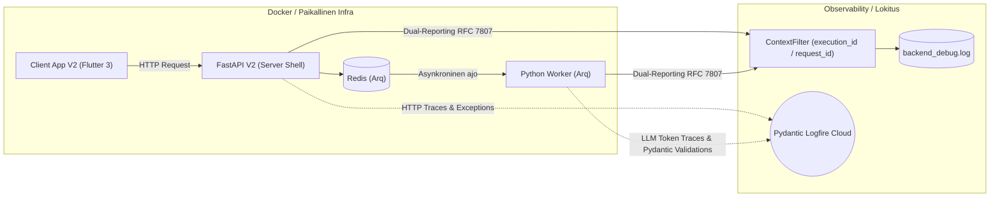

# 10: Infrastruktuuri ja Lokitus (Observability)

Järjestelmä operoi asynkronisen Python FastAPI -arkkitehtuurin, raskaiden Arq / Redis -taustatyöntekijöiden ja Docker-konttien päällä. Koska taiteellisen asiantuntijajärjestelmän debuggaus on perinteisesti tuskaista ("miksi tekoäly tuotti huonon tuloksen?"), Cognitive Quorum panostaa massiivisesti "Forensic Sovereignty" -tyyliseen jäljitettävyyteen.

## 1. Lokitus (The ContextFilter Mandate)

Lokitus (`backend_v2/logging_config.py`) ei ole vain tekstivirtaa, vaan arkkitehtuurisesti kytketty The Zero-Compromise Pledgen "Fail-Fast" periaatteisiin.

1. **Kontekstisidonnaisuus (`ContextFilter`):** Jokainen taustaprosessiin (Worker) tai reitittimeen (API) syntyvä lokirivi, oli se sitten tietokantavirhe tai LLM-integraation varoitus, ohjataan `ContextFilter`:n läpi. Tämä injektoi lokiriville *aina* aktiivisen `execution_id`:n (tai oletuksena `request_id`). Tämän ansiosta massiivisesta serverin lokitiedostosta (`backend_debug.log`) pystytään greppaamaan sekunneissa kaikki yhtä tiettyä työnkulkua koskettavat 100 eri I/O -kutsua. Oletuksena lokitiedosto käyttää kehittäjäystävällistä Standard Dev Formatteria, mutta se voidaan kytkeä tiukkaan koneelliseen `JSONFormatter`-tilaan `use_json_logging`-asetuksella.
2. **Dual-Reporting (RFC 7807):** Järjestelmän on ehdottomasti estetty nielemästä virheitä lennossa. Kun koodi kaatuu odottamattomaan poikkeukseen, sitä ei "hoideta pois", vaan se työnnetään ensin rakenteellisena `logger.error` viestinä talteen (mukaanlukien täysi Stack Trace ja virhekoodi), ja uudelleenheitetään asiakkaalle puhtaana Pydantic-validoituna `AppException` (RFC 7807 Problem Details) rakenteena vian selvittämiseksi. `main.py` määrittelee erilliset exception handlerit (`AppException`, `RequestValidationError`, `StarletteHTTPException` ja globaali `Exception`). Nämä palauttavat aina validin `application/problem+json` -vastauksen ja injektoivat `extensions`-lohkoon asiakkaalle (Flutterille) koneellisesti luettavan `error_code`:n lokalisointia (L10n) varten. Turvallisuus: HTTP-payloadien ja asiakastietojen raakalokitus on ehdottomasti kielletty.
3. **Event Sourcing -liiketoimintalokit (`execution_trace`):** Järjestelmän ensisijainen liiketoimintatason jäljitettävyys ei nojaa vain tekstitiedostoihin, vaan Event Sourcing -tyyliseen `WorkflowState`-malliin (`backend_v2/models/state.py`). Jokainen ajo ylläpitää `execution_trace`-listaa (muuttumaton loki `TraceEvent`-olioita), joka taltioi tapahtuman tyypin (`input`, `reasoning`, `decision`, `error`, `output`, `tombstone`). Tämä sisältää muun muassa `ReasoningTrace`-mallilla piilotetun Chain-of-Thought -prosessin sekä `ErrorTraceEvent`-tapahtumat strukturoitua vianjäljitystä varten. `StateProjector` tiivistää nämä lokit dynaamisesti asiakkaalle luettavaksi tilaksi O(1)-ajassa.

## 2. Forensic Sovereignty, Epic 60 Decoupling ja Contextual Override Lokitus

Jotta tekoälyn suoritus on sataprosenttisen todistettavaa (Explainable AI / Forensic Sovereignty), jokainen työnkulun askeleen suoritus lokitetaan ja taltioidaan tietokantaan kirurgisen tarkasti:

* **Epic 60 Decoupled Logging:**
  Menneisyydessä (V1) askeleen ajo tallensi vain epämääräisen flat-listan prompt-lohkoista. Epic 60:n myötä askeleen suoritustila (`StepState`) lukitsee ja tallentaa eksplisiittisesti käytetyt rooli-id:t (`role_block_id`), protokolla-id:t (`extraction_protocol_block_id`) ja kriteeri-id:t (`criteria_block_ids`). Tämän ansiosta kehittäjä tai auditointijärjestelmä voi dynaamisesti eristää ja todentaa tismalleen, mikä rooli tai säännöstö on vaikuttanut tekoälyn asenteeseen kullakin ajanhetkellä.
* **Contextual Override Audit Trail:**
  Kun System 2 -ohitusventtiili (Claim-Level Contextual Override) laukeaa, suorituksen audit-lokiin (`TraceEvent`) kirjataan täydellinen todistusketju:
  - Tieto `contextual_override = True` -tapahtumasta.
  - Vahvistus Double-Lock Authorization -kytkimistä (Workflow `enable_contextual_overrides` ja Assertion `allow_contextual_override` tiloista).
  - Pydantic-validointitunnus laiskuuden eston (Anti-Laziness Mandate) läpimenosta, sisältäen perustelun pituuden (merkkiä) ja spatiaalisen lähdeankkurin (esim. sivu 12, kappale 3).
  - Mahdolliset `Self-Healing` -uudelleenyritykset ja niiden tarkat JSON-skeemavirheet.

Tämä takaa aukottoman ja rikkoutumattoman forensisen audit-ketjun.

## 3. Pydantic Logfire & LLM Observability

Tekoälyn toimintakyky ei saa ikinä olla Musta Laatikko. Järjestelmä on integroitu suoraan Pydanticin viralliseen Logfire-pilveen (`logfire.configure`).
* Kaikki HTTP-pyynnöt ja tekoälyintegraatiot säteilytetään suoraan kojelautaan pilveen vianjäljitystä varten. Arq Redis -instrumentaatio on kuitenkin disabloitu konsolispämmin estämiseksi, ja LiteLLM:n debug-tulokset on hiljennetty.
* Tämä paljastaa tarkasti kauan mallilla meni generoida tietty Pydantic Structured Output, paljonko se maksoi (Token usage), ja kaatuiko kysely rikkinäiseen Pydantic-skeeman luontiin.
* **Telemetrian hienosäätö ja kestävyys:** Logfire käyttää EU-endpointtia. Ympäristötasolla Windows 11 cp1252-kaatumiset estetään kytkemällä pois Logfiren konsoliviejä (`LOGFIRE_CONSOLE="false"`) ja pakkokoodaamalla `sys.stdout.reconfigure(encoding="utf-8")`. Paikalliskehityksessä pilvitelemetria voidaan kytkeä pois päältä `DISABLE_LOGFIRE` -ympäristömuuttujalla.
* **API-tason Middlewaret:** API-integraatio nojaa middleware-kerrokseen. `RequestIdMiddleware` injektoi `X-Request-ID`:n `ContextFilter`ille telemetriakäsittelyä varten, ja `LocalizationMiddleware` asettaa oikean L10n-kielen dynaamisia virheviestejä varten.

## 4. Infrastruktuuri ja Ympäristöt

Quorum pohjaa kontitettuun "Infrastructure as Code" -toimintamalliin. Siksi järjestelmällä ei ole erillistä paikallisista eroja koskevaa ydinlogiikkaa. 

* **Worker Queue (Arq + Redis):** Kun asiakas laukaisee evaluaation, FastAPI -päärajapinta tallentaa Pydantic-mallit tietokantaan, lähettää tiedon sadasosasekunneissa Arq-palvelimelle, joka aloittaa raskaiden tekoälymallien asynkronisen ohjaamisen eristetyssä Worker-säikeessä.
* **Paikallinen Ajo:** Kehittäjät hyödyntävät käynnistysrutiineja kuten `run_local.bat` ja docker-compose -infrastruktuuria, nostaen paikallisen Redis-ilmentymän sekunneissa kehityskäyttöön varmistaen täydellisen pilvipariteetin.

## 5. Frontend Observability (Flutter & AppErrorBoundary)

Vastaavasti kuin palvelinpuolella, Front-Endin (Flutter) arkkitehtuuri on immuuni hiljaisille virheiden nielemisille. Asiakassovellus on kiedottu globaaliin `AppErrorBoundary` -luokkaan, joka ottaa kiinni kaikki renderöintivirheet. Koska rikkinäisen komponentin jättäminen visuaalisesti näkymättömiin on estetty, poikkeukset lokitetaan ja tallennetaan `LoggerServiceProvider`:n kautta lokaaliin `client_debug.log` -tiedostoon.

Vaikka puuttuva Pydantic/JSON-data kaataa parserin nativisti datavirhelyöntien paljastamiseksi ("Fail-Fast"), sovelletaan verkkoliikenteen osalta silti ohjeistusta "Graceful Network Degradation". Verkkovirheet ja aikakatkaisut otetaan kiinni alemman tason rajapinnoissa ja ohjelmisto heikkenee tällöin hallitusti lataustilaan romahtamatta koskaan kokonaan punaiseen virheruutuun, turvaten graafisen työtilan eheyden.

 

➡️ **Seuraavaksi:** Kirjan päätteeksi lue [11_empirical_scoring_report.md](./11_empirical_scoring_report.md), joka dokumentoi matemaattisen arviointimoottorin toiminnan käytännössä empiiristen testitulosten valossa.
