# 00: Järjestelmäkonteksti ja Executive Summary (C4)

> [!IMPORTANT]
> **TIUKKA ARKKITEHTUURIMALLI (FAIL-FAST & STRICT SCHEMA)**
> Tämä dokumentaatio kuvaa järjestelmän nykytilaa, joka perustuu Pydantic V2 Strict -tilaan ja Flutter Freezed -malleihin. Arkkitehtuurissa ei sallita virheiden nielentää (try-except pass), implisiittisiä oletusarvoja tai luksumattomia tiedonsiirtoja. Järjestelmä nojaa "Fail-Fast" periaatteeseen, tiukkaan Opaque ID -reititykseen sekä Pydantic V2:n Rust-ytimeen perustuvaan nopeaan validointiin.

Cognitive Quorum on dynaaminen, Feature-First (Flutter) ja Strict Async Monolith (FastAPI) arkkitehtuuriin pohjautuva, sataprosenttisesti auditoitava tekoälyorkestraattori B2B SaaS -ympäristöön.

## Ongelma ja Ratkaisu

**Ongelma (Mittaamisen kriisi):** Generatiivisen tekoälyn myötä tietotyö kohtaa laadullisen mittaamisen haasteen. Pelkkään yhteen monoliittiseen tekoälymalliin nojaaminen johtaa *myötäilyvinoumaan* (Sycophancy) sekä hallusinaatioihin. Yksittäinen tekoälymalli ei kykene itsenäisesti falsifioimaan omaa suoritustaan tai tunnistamaan loogisia syy-seuraus -virheitään monimutkaisissa prosesseissa.

**Ratkaisu (Moniagenttijärjestelmä - Quorum):** B2B SaaS -alusta, jonka avulla rakennetaan turvallisesti eristettyjä ja auditoitavia rinnakkaisia tekoälyketjuja (DAG - Directed Acyclic Graph). Järjestelmä hajauttaa tehtävät "Kognitiiviselle Kvoorumille" eri rooleihin (esim. Analyytikko, Falsifioija, Tuomari). Prosessi noudattaa systemaattista sokkoarviointia (Blind Audit), mikä takaa tulosten luotettavuuden (Reliability) asiantuntijuuden syvyydestä (Validity) tinkimättä.

### Loppukäyttäjät
Quorumin käyttäjäkunta jakautuu kahteen rooliin: asiantuntijat (Manager), jotka mallintavat joustavia tekoälyputkia graafisessa Workflow Studiossa täysin ilman koodia (No-Code), sekä tuotannon loppukäyttäjät (Member), jotka syöttävät järjestelmään aineistoa (esim. PDF-dokumentteja) ja saavat takaisin läpinäkyviä XAI-raportteja (Explainable AI).

## Brändisanasto (Glossary)

* **Quorum (Kognitiivinen Kvoorum):** Alustan metodologinen sydän. Koosteoppimisesta (Ensemble Learning) ja moniagenttidebatista syntyvä luotettavuus.
* **Blueprint:** Järjestelmän dynaaminen ohjausmalli, joka sitoo yhteen käyttöliittymän renderöintisäännöt ja backendin tekoälytulokset.
* **The Blind Audit (Kognitiivinen Riippumattomuus):** Agentit suoritetaan työnkuluissa sokkona. Ne eivät näe rinnakkaisten agenttien väliarvioita.
* **Fail-Fast:** Palvelin ei koskaan paikkaa puuttuvaa dataa oletusarvoilla, vaan kaatuu ja palauttaa RFC 7807 -standardin mukaisen virheen välittömästi.

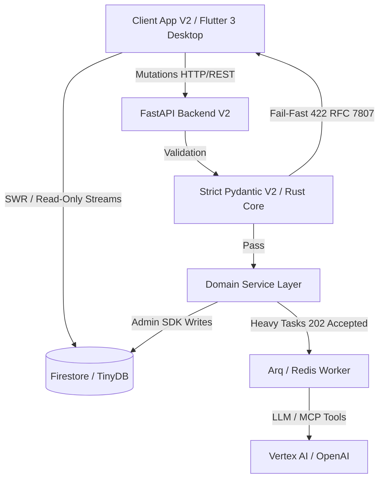

## Arkkitehtuurin Ydinfilosofiat

1. **CQRS-malli (Read/Write Separation):** Flutter-käyttöliittymä on tietokannan suhteen täysin **Read-Only**. Kaikki mutaatiot (mukaan lukien asetuksien ja työnkulkujen muutokset) kulkevat keskitetysti Python FastAPI -backendin reitittimien kautta.
2. **Fail-Fast -periaate:** Niellyt virheet ja vaimennetut ohitukset (esim. puuttuvan datan paikkaaminen oletusarvoilla) ovat koodikannassa ehdottomasti kiellettyjä. Puuttuva tai virheellinen data aiheuttaa välittömän 400/422 -virheen (RFC 7807 Problem Details), estäen arkkitehtuurillisen mätänemisen.
3. **Strict Pydantic V2 & Flutter Freezed -pariteetti:** Backendin rajapinnat validoivat datan Pydanticin Ruoste-ytimeen perustuvalla `model_validate_json` -metodilla, torjuen tuntemattomat avaimet (`extra='forbid'`). Frontend purkaa saapuvan datan Riverpod Isolate -säikeissä yhtä tiukasti kiellettyjen avaimien säännöllä (`disallow_unrecognized_keys: true`).
4. **Taustaprosessointi (Asynkroninen Arq Worker):** Raskaat tekoälyajot (DAG-ketjut) eristetään synkronisesta HTTP-käsittelystä. Reititin palauttaa asiakkaalle välittömästi `202 Accepted`, ja työnkulkua ajetaan asynkronisessa Arq/Redis-taustajonossa.
5. **Kognitiivinen Riippumattomuus:** Tekoälyagentit eristetään (Blind Audit) toisistaan rinnakkaisissa työnkuluissa (Workflow ja HookStates), jotta vältetään ketjuuntuvat hallusinaatiot.
6. **Opaque Stripe ID -reititys:** Järjestelmän tietokanta-avaimet, Pydantic-relaatiot ja GoRouter-reititykset perustuvat puhtaasti järjestelmässä generoituihin Stripe-tyyppisiin tunnisteisiin (esim. `org_abc123`). Ihmisluettavia slugeja (kuten `/users/risto`) ei käytetä järjestelmän sisäisessä verkkologiikassa eikä Pydantic-malleissa.

<br><hr>

➡️ **Seuraavaksi:** Siirry lukemaan [01_engine_architecture.md](./01_engine_architecture.md), joka avaa järjestelmän tärkeimmän ydinfilosofian (Moottoriarkkitehtuuri) ja selittää, miten dynaaminen data käännetään staattiseksi Pydantic-malliksi.
# 10. Engine Architecture & Schema-Driven Routing

## Arkkitehtuuridokumenttien Roolijako (Lukemisopas)

Cognitive Quorum V2:n monimutkainen arviointi- ja pisteytysjärjestelmä on jaettu neljään eri dokumenttiin, joista jokainen vastaa tiettyyn kysymykseen:

* **Miksi?** Tämä dokumentti (`10_engine_architecture_and_schema_routing.md`) on ylätason konsepti. Se selittää *miksi* moottori eristää matematiikan LLM:stä (Tripartite) ja miksi järjestelmä ei luota dynaamisiin sanakirjoihin.
* **Miten?** Dokumentti `09_evaluation_and_scoring.md` kuvaa DINA-mallin ja CDM:n (Cognitive Diagnostic Model). Se kertoo *miten* se matematiikka ja rangaistukset fyysisesti lasketaan kaavojen tasolla.
* **Missä?** Dokumentti `04_hooks_and_llm.md` on toteutuskatalogi. Se kertoo *missä* tiedostoissa (esim. `scoring.py`, `integrity.py`) nämä ylätason säännöt fyysisesti asuvat ja mitä kyseiset funktiot tekevät.
* **Mitä?** Dokumentti `02_domain_models.md` on järjestelmän hermosto. Se kertoo *mitä* laatikkoja (Pydantic-rakenteet kuten `LightweightMatrixOutput` ja `ExecutionRecord`) tämä koko koneisto liikuttelee ja mihin muottiin data on pakotettava.

---


## Filosofia: Pelimoottori vs. Pelikenttä

Cognitive Quorum V2:n backend ei ole perinteinen, kovakoodattuja liiketoimintapolkuja suorittava monoliitti. Se on suunniteltu **Moottoriarkkitehtuurin (Engine Architecture / Rule Engine Pattern)** mukaisesti, jossa järjestelmä on jaettu kahteen täysin eristettyyn vastuualueeseen:

1. **Staattinen Moottori (Koodi):** Kiveen hakatut fysiikan lait ja turvarajat. Pydantic-mallit (esim. `GuardOutput`, `EvaluationResult`) ovat muuttumattomia (`frozen=True`) ja kieltävät kaiken ylimääräisen datan (`extra="forbid"`). Tämä vastaa pelimoottoria (esim. Unreal Engine).
2. **Dynaaminen Kenttä (Tietokanta):** Admin Studiosta käsin rakennettavat työnkulut, DAG-graafit (Directed Acyclic Graph), promptit ja askeleet (Steps). Nämä elävät `seed_data.json` -tietokannassa. Tämä vastaa pelikenttää, jota pelimoottori pyörittää.

Tämän erottelun ansiosta järjestelmä kykenee toteuttamaan **Zero-Deploy joustavuutta**: Pääkäyttäjä voi rakentaa loputtomasti uusia liiketoimintaprosesseja ja tekoälyagentteja tietokantaan, eikä ohjelmistokehittäjän tarvitse julkaista uutta koodiversiota, kunhan uudet askeleet noudattavat moottorin staattisia rajapintoja.

## Kaaoksen hallinta: Dynamic Schema Compilation ja TypeAdapter-pakotus

Tekoäly (LLM) on luonteeltaan vapaamuotoinen tekstin tuottaja. Jos sallisimme backendin logiikan muovautua dynaamisesti tietokannan ja LLM:n mukana, järjestelmä menettäisi tyyppiturvallisuutensa ja kaatuisi hiljaisesti (Silent Failures). 

Cognitive Quorum V2:n arkkitehtuuri ratkaisee tämän kaksivaiheisella **Dynamic Schema Compilation & Hook Interception** -mallilla. Se sitoo tietokannan vapauden tiukkaan koodiin ilman purkkaviritelmiä:

### Vaihe 1: Dynaamisen Pydantic-mallin kääntäminen lennosta (PromptCompiler)
Kun dynaaminen työnkulku ajetaan, järjestelmä ei kysy tietokannalta staattisen mallin nimeä. Sen sijaan koodi (PromptCompiler) lukee askeleeseen liitetyt arviointikriteerit (`PromptBlock`) ja rakentaa lennosta täysin uuden Pydantic-luokan (Dynamic Model). 

Palvelu päättelee liiketoimintalogiikasta rakenteen:
* **Output Extensions:** Jos kriteerille on aktivoitu Admin Studiossa `falsification`, luokkaan injektoidaan vaatimus: `step_2_falsification: str`. Jos `risk_flag`, vaaditaan `bool`.
* **Theory Grounding (Kirjallisuuslähteet):** Jos arviointi pohjautuu lakiin tai teoriaan, kääntäjä luo `Literal[<tarkka_lainaus>]` -kentän, joka **pakottaa** tekoälyn palauttamaan täsmälleen saman merkkijonon.
* Kääntäjä paketoi tämän `strict=True` ja `frozen=True` -luokaksi (Pydanticin `create_model` -funktiolla), jota tekoälyn on pakko noudattaa OpenAI:n Structured Outputs -rajapinnassa.

### Vaihe 2: Post-Hook TypeAdapter-sitominen
Jotta koko järjestelmän (pelimoottorin) integriteetti säilyy, dynaamisen mallin antama JSON-tulos täytyy vielä validoida järjestelmän staattisiin ydinmalleihin.

Suorituksen jälkeen LLM:n tuottama JSON-tulos ajetaan **Integrity Hookien** (esim. `verify_citation_integrity`) läpi. Näissä hookeissa käytetään Pydanticin `TypeAdapter`ia, joka "pakottaa" dynaamisen tuloksen kiveen hakattuun staattiseen luokkaan (esim. `EvaluationResult` tai `AnalystOutput`). Jos dynaaminen JSON ei vastaa ydinscheman tiukkoja minimivaatimuksia, validointi epäonnistuu välittömästi (Fail-Fast). 

*(Huom: Natiiveissa Python-logiikka-askeleissa (ei LLM) sidonta tehdään suoraan `TaskRegistry`n kautta koodissa `input_schema` / `output_schema` -määrityksillä.)*

## Tripartite Matrix Scoring (Matematiikan Eristäminen)

Moottoriarkkitehtuuri eristää myös LLM:n ja matemaattisen pisteytyksen toisistaan **Tripartite (Kolmiosaisella)** rakenteella. Tekoälyä ei koskaan päästetä keksimään numeerisia arvosanoja hatusta.

1. **Sokko-käännös (PromptCompiler):** Kun askeleessa on matriiseja (kriteereitä arvosanoilla), kääntäjä injektoi ne LLM:n promptiin `<EVALUATION_RUBRICS>` -lohkona. Samalla se injektoi ankaran `<ANTI_SCORE_MANDATE>` -käskyn, joka kieltää tekoälyä antamasta lopullista arvosanaa.
2. **Boolean-Kytkimet (LLM-suoritus):** LLM:n dynaaminen skeema pakottaa sen antamaan ainoastaan `True/False` -päätöksen (`step_5_boolean`) ja perustelun jokaista matriisin yksittäistä faktaväittämää kohden.
3. **Deterministinen Matematiikka (Scoring Hook):** JSON-tuloksen palattua `backend_v2/hooks/scoring.py` -tiedoston `matrix_scoring_hook` ottaa ohjat. Se lukee tekoälyn asettamat True/False -kytkimet ja laskee tarkan, deterministisen arvosanan (raw_score ja normalized_score) askeleen strategian perusteella. Lopuksi hook pakottaa sekä tulokset että lasketun matematiikan staattiseen `LightweightMatrixOutput` -domainmalliin.

Tämä takaa, että tekoäly toimii vain "sokeana liukuhihnatyöläisenä" etsien faktoja, kun taas lopullinen pisteytys tapahtuu 100% varmalla Python-koodilla sääntömoottorin sisällä.


## Arkkitehtuurikaavio

Alla oleva Mermaid-kaavio havainnollistaa, miten dynaaminen tietokanta (vasemmalla) muuntuu LLM-moottorin kautta staattiseksi, tyyppiturvalliseksi Pydantic-malliksi (oikealla).

```mermaid
graph TD
    subgraph "Dynaaminen Tietokanta (TinyDB/Firestore)"
        DB1["Workflow (Työnkulku)"]
        DB2["Step (Askel esim. stp_123)"]
        DB3["PromptBlock (Kriteerit, XAI Extensions)"]
        
        DB1 --> DB2
        DB2 --> DB3
    end

    subgraph "Moottori: Dynamic Compiler & Task Executor"
        E1(("PromptCompiler<br>(Dynamic Schema)"))
        E2["LLM Client<br>(Structured Output)"]
        
        DB3 -.->|Lukee metadatan| E1
        E1 -->|"1. create_model(strict=True)"| E2
    end

    subgraph "Moottori: Hook Interception & Registry"
        H1["Integrity Hooks"]
        H2{{"TypeAdapter<br>(AnalystOutput | EvaluationResult)"}}
    end

    subgraph "Staattinen Domain (Python/Pydantic)"
        M1["EvaluationResult"]
        M2["AnalystOutput"]
        M3["GuardOutput (TaskRegistry)"]
        
        M1 -.- M1a["frozen=True<br>extra='forbid'"]
    end
    
    E2 -->|2. Palauttaa raa'an JSONin| H1
    H1 --> H2
    H2 -->|3. Pakottaa staattiseen muotoon| M1
    H2 --> M2
    
    DB2 -.->|Logic Step (ei LLM)| M3
    
    M1 --> OUT[("Turvallinen, tyyppitarkastettu<br>Dynaaminen Suoritus")]
    M2 --> OUT
    M3 --> OUT

    style E1 fill:#81ecec,stroke:#00cec9,stroke-width:2px,color:#2d3436
    style H2 fill:#ffeaa7,stroke:#fdcb6e,stroke-width:2px,color:#2d3436
    style M1 fill:#55efc4,stroke:#00b894,stroke-width:3px,color:#2d3436
    style M1a fill:#ff7675,color:#fff
```

### Yhteenveto

"Duct tape" -purkkaviritys olisi sitä, että koodissa jouduttaisiin avaamaan sanakirjoja (`dict.get("score")`) ja yrittää onkia niistä lennosta muuttuvia kenttiä hiljaisin virhein. V2:n **Engine Architecture** tekee täsmälleen päinvastoin: se luo tiukan dynaamisen mallin askeleen kriteereistä lennosta (PromptCompiler), ja sen jälkeen Post-Hookit pakottavat (`TypeAdapter`) tulokset äärimmäisen kovaan ja rajalliseen joukkoon fyysisiä rakenteita (Domain Models). Tämä tarjoaa pelikentälle loputtoman variaation menettämättä pelimoottorin absoluuttista tyyppiturvallisuutta.

<br><hr>

➡️ **Seuraavaksi:** Kun moottorin filosofia on ymmärretty, siirry lukemaan [02_domain_models.md](./02_domain_models.md), joka listaa ne fyysiset Pydantic-laatikot, joita moottori liikuttelee.
# 02: Pydantic V2 Datamallit ja Verkkotopologia (Domain)

Cognitive Quorum rakentuu vahvasti tyypitettyjen, "Fail-Fast" periaatetta noudattavien Pydantic V2 -mallien varaan. Nämä mallit muodostavat backendin hermoston (Single Source of Truth), johon koko järjestelmän toiminta (FastAPI-reititys, tietokantamuutokset ja käyttöliittymän renderöinti) perustuu.

## V2CoreBase ja Tiukka Validointi (Strict Nirvana)

Kaikki järjestelmän ydinmallit perivät `V2CoreBase`-luokan. Tämä asettaa arkkitehtuurille ehdottoman tiukat säännöt, joilla estetään "hiljaiset virheet" ja kognition lipsuminen vuotavien rajapintojen läpi.

```python
class V2CoreBase(BaseModel):
    model_config = ConfigDict(strict=True, extra="forbid")
```

1. **Rust Core Parsing:** FastAPI-reitittimissä JSON puretaan suoraan `model_validate_json()` -metodilla, hyödyntäen Pydantic V2:n Rust-moottoria ohi hitaiden Python-kirjastojen.
2. **Extra='forbid':** Jos käyttöliittymä, LLM tai taustajärjestelmä lähettää malliin kuulumatonta (esim. hallusinoitua tai vanhentunutta) dataa, koodi kaatuu välittömästi (Validation Error 422). Järjestelmä ei koskaan niele tuntemattomia avaimia.
3. **No-String Mandate (I18nText):** Kaikki käyttöliittymään päätyvä teksti on kapseloitu `I18nText` Pydantic-malliin. Se pakottaa ("English-Only Mandate"), että kaikesta tekstistä löytyy englanninkielinen perusversio, johon kieli-middleware voi nojata silloinkin kun käännös puuttuu. Tekoälyn kognitiiviset ohjeet puolestaan eristetään yksinomaan englanninkielisiin `ai_description` -kenttiin UI-lokalisaatiosta irralliseksi.
4. **Zero-Duck-Typing:** "Duck-typing" -jäänteet (kuten `isinstance(x, dict)` tai hiljaiset `.get("id")` -kutsut) ovat ankarasti kiellettyjä Service- ja Controller-kerroksissa. Payloadin on täsmättävä täydellisesti Pydantic-rakenteeseen, eikä funktioiden sisällä tehdä arvailuja saapuvan tiedon muodosta.

## Ydinmallisto ja Opaque ID -reititys

Järjestelmä hylkää ihmisluettavat "slugit" identifioijina taustalogiikassa. Kaikki relaatiot ja datamallit pakottavat joustavan "Opaque Stripe ID" -reitityksen (esim. `blk_abc12345`), joka takaa sen, että mallien sisäiset ihmisluettavat nimimuutokset eivät koskaan riko järjestelmän topologiaa.

```mermaid
classDiagram
    class V2CoreBase{
        <<Pydantic>>
        +ConfigDict strict=True
        +ConfigDict extra="forbid"
        +model_validate()
    }

    class I18nText{
        +String default_locale
        +dict translations
    }

    class ExpectedInput{
        +String input_key
        +I18nText label
        +I18nText description
        +String ai_description
        +bool required
        +bool is_chat_history
        +List~String~ input_modes
        +List~QuestionnaireItem~ questionnaire_definition
    }

    class Workflow{
        +String id (Opaque Stripe ID 'wor_')
        +String slug
        +I18nText name
        +I18nText description
        +String status
        +int version
        +bool is_public
        +String organization_id
        +dict ui_schema
        +dict output_profiles
        +String default_profile_id
        +List~ExpectedInput~ expected_inputs
        +List~StepRule~ steps
        +validate_dag_integrity()
    }

    class StepRule{
        +String id
        +String task_blueprint (Opaque Step ID 'stp_')
        +float ui_pos_x
        +float ui_pos_y
        +List~String~ depends_on
        +dict input_mappings
    }
    
    class Step{
        +String id
        +String slug
        +I18nText name
        +I18nText description
        +Literal type
        +String hook
        +Literal safety
        +List~String~ pre_hooks
        +List~String~ post_hooks
        +List~String~ allowed_mcp_tools
        +String model_strategy
        +List~String~ expected_inputs
        +dict output_schema
        +List~String~ prompt_blocks
    }

    class TheoryGrounding{
        +String source_url
        +String citation_reference
    }

    class PromptBlock{
        +String id (Opaque Block ID 'blk_')
        +String slug
        +I18nText label
        +I18nText description
        +String ai_description
        +String category_id
        +bool is_evaluative
        +BlockDataType type
        +bool allow_decimals
        +int scale_min
        +int scale_max
        +List~String~ output_extensions
        +TheoryGrounding theory_grounding
        +List~MatrixScale~ scales
        +List~MatrixRow~ rows
        +List~I18nText~ columns
        +validate_block_consistency()
    }

    class ExecutionRecord{
        <<Event Sourcing Root>>
        +String id
        +String workflow_id
        +ExecutionStatus status
        +String active_profile_id
        +WorkflowInputs raw_inputs
        +FrozenContext frozen_context
        +String frozen_context_storage_path
        +List~TraceEvent~ execution_trace
        +String execution_trace_storage_path
        +String pdf_report_path
        +String output_profile_id
        +dict step_states
        +dict profile_syntheses
        +int duration_ms
        +dict models_used
        +dict metadata
        +String error
        +datetime created_at
        +datetime updated_at
        +datetime completed_at
        +String created_by
        +String organization_id
    }

    class OutputProfile{
        +String id
        +String slug
        +String workflow_id
        +I18nText name
        +I18nText description
        +List~String~ visible_metadata
        +List~String~ visible_extensions
        +int max_extension_items
        +String display_scale
        +bool include_diagnostic_scorecard
        +SynthesisConfigDTO synthesis
        +List~OutputLayoutBlock~ layouts
    }

    class OutputLayoutBlock{
        +Literal preset_view
        +I18nText title
        +I18nText description
        +List~String~ steps
        +List~String~ target_blocks
        +Literal text_delivery_mode
        +SynthesisConfigDTO synthesis
        +String synthesis_md
    }

    class SynthesisConfigDTO{
        +String system_prompt
        +int length_constraint
        +I18nText preamble_text
        +HistoricalContextMode historical_context_mode
        +bool enable_pii_masking
        +List allowed_exports
        +bool omit_empty_sections
        +List~String~ allowed_mcp_tools
    }

    class BaseResponseDTO{
        <<API Boundary Sovereignty>>
        +str id
    }

    class ReportDataDTO{
        +String workflow_id
        +String profile_id
        +I18nText profile_name
        +dict available_profiles
        +float global_score
        +bool has_warning
        +String synthesized_markdown
        +List~String~ visible_metadata
        +datetime created_at
        +String org_name
        +float cost_estimate
        +int total_tokens
        +int prompt_tokens
        +int completion_tokens
        +int reasoning_tokens
        +List~MCPAuditTrace~ mcp_tool_audit
        +dict grouped_extensions
        +List~String~ penalties_applied
        +List~ReportLayoutDTO~ layouts
    }

    class ReportLayoutDTO{
        +Literal preset_view
        +I18nText title
        +I18nText description
        +List~ReportAxisDTO~ axes
        +Literal text_delivery_mode
        +SynthesisConfigDTO synthesis
        +String synthesis_md
    }

    class ModelProfile{
        +String provider
        +String model_name
        +float temperature
        +float top_p
        +int top_k
        +int tpm_limit
        +int rpm_limit
        +int max_tokens
        +List~String~ allowed_tools
        +bool supports_grounding
        +String api_key
        +String parsing_mode
        +String caching_strategy
        +bool is_active
    }

    class AllowedMCPTool{
        +String tool_id
        +I18nText name
        +String description
        +dict input_schema
    }

    class XAIExtension{
        <<Discriminated Union>>
        +extension_type
    }

    class LightweightMatrixOutput{
        +float raw_score
        +float normalized_score
        +str level_breakdown
        +str justification
        +dict evaluated_atoms
        +dict extensions
    }
    
    class StepOutputDTO{
        <<Structured State Envelope>>
        +str step_id
        +str block_id
        +Literal data_type
        +Any payload
    }
    
    class StrictMatrixPayload{
        <<RootModel>>
    }

    class SynthesisStepDataDTO{
        +Any reasoning_trace
    }

    class SynthesisMetadataDTO{
        +str target_locale
        +dict token_usage
    }

    V2CoreBase <|-- I18nText
    V2CoreBase <|-- ExpectedInput
    V2CoreBase <|-- Workflow
    V2CoreBase <|-- StepRule
    V2CoreBase <|-- Step
    V2CoreBase <|-- TheoryGrounding
    V2CoreBase <|-- PromptBlock
    V2CoreBase <|-- ExecutionRecord
    V2CoreBase <|-- OutputProfile
    V2CoreBase <|-- OutputLayoutBlock
    V2CoreBase <|-- SynthesisConfigDTO
    BaseResponseDTO <|-- ReportDataDTO
    BaseResponseDTO <|-- ReportLayoutDTO
    V2CoreBase <|-- ModelProfile
    V2CoreBase <|-- AllowedMCPTool
    V2CoreBase <|-- LightweightMatrixOutput
    V2CoreBase <|-- StepOutputDTO
    V2CoreBase <|-- StrictMatrixPayload
    V2CoreBase <|-- SynthesisStepDataDTO
    V2CoreBase <|-- SynthesisMetadataDTO

    Workflow *-- ExpectedInput : "määrittää syötteet"
    Workflow *-- StepRule : "sisältää (Opaque DAG Nodes)"
    Workflow ..> OutputProfile : "Dynaaminen injektio API-kerroksessa (EI TALLENNETA KANTAAN!)"
    StepRule --> Step : "viittaa (Blueprint Reference)"
    Step --> PromptBlock : "fuusioi kognition"
    PromptBlock *-- TheoryGrounding : "yhdistää lähdeaineistoon"
    OutputProfile *-- OutputLayoutBlock : "sisältää (Layouts)"
    OutputLayoutBlock --> SynthesisConfigDTO : "määrittelee XAI-synteesin"
    ReportDataDTO *-- ReportLayoutDTO : "koostaa UI-näkymän"
    ReportDataDTO *-- XAIExtension : "polymorfinen rikastus"
    LightweightMatrixOutput --> XAIExtension : "laajennosdata"
```

### Keskeiset Arkkitehtuuriset Kokonaisuudet

1. **PromptBlock (Unified Directive Model):**
   * Työnkulun pienin atomaarinen osa. Tämä malli fuusioi sisäänsä arviointimatriisit (BARS, Bipolar), odotetut datatyypit sekä tekoälyn suoritusohjeet (`ai_description`).
   * Validointi (`validate_block_consistency`) pakottaa raskailla säännöillä sen, että matriisin min/max -arvot ja niihin linkitetyt asteikot (MatrixScale) ovat strukturaalisesti virheettömiä. Uudet kentät, kuten `output_extensions` sallivat XAI-laajennusten generoimisen, ja `TheoryGrounding` kytkee matriisit suoraan organisaation omaan data- ja teoriapohjaan dokumentoimalla tarkan lähteen ja siihen liittyvän viittauksen.

2. **Step ja StepRule (Opaque Nodes):**
   * **Step:** Eristetty, uudelleenkäytettävä logiikkamalli. Tukee vahvasti erittelyä joko dynaamiseksi lausekepohjaiseksi säännöksi (`type: logic`), jolloin se suorittaa ns. natiivia Python-koodia määritetyllä `hook`-funktiolla, tai neuroverkkomalliksi (`type: llm`), jossa kognitio ohjautuu LLM:lle. Malli integroi esi- ja jälkikäsittelyn koukkuihin (`pre_hooks`, `post_hooks`) ja estää hallusinoinnit lukitsemalla vain ennalta määritellyt ulkoiset MCP-työkalut (`allowed_mcp_tools`). Askeleilla tuki myös mallistrategialle (`model_strategy`) tehokkuuden säätöä varten.
   * **StepRule:** Määrittelee solmun todellisen paikan työnkulun verkossa (Directed Acyclic Graph). Sisältää UI-koordinaatit (`ui_pos_x`, `ui_pos_y`), riippuvuudet (`depends_on`) ja datan syötelokeroinnin (`input_mappings`), joilla muiden askelten injektoimat lokaalit syötteet ja dynaamiset parametrit parsitaan LLM:lle.

3. **Workflow (DAG Orchestrator):**
   * Kokoaa yhteen StepRulet, PromptBlockien viittaukset, Output Profilet sekä myös dynaamiset odotetut syötteet (`ExpectedInput`), jotka määrittävät, mitä ulkopuolista dataa käyttäjältä tai järjestelmältä pyydetään ajon aikana. `ExpectedInput` luo vahvat syötelokerot (`input_mappings`), jotka reitittävät tiedot ohjatusti oikeille DAG-askelille.
   * Järjestelmä estää puutteelliset Workflown tilat ennen ajoa: `validate_dag_integrity` suorittaa Depth-First Search (DFS) -algoritmin, joka paljastaa työnkulun solmukohdista syklit (kehät) pystyen katkaisemaan suorituksen (RFC 7807) ennen ajon alkua. Se on absoluuttinen vaatimus turvalliselle asynkroniselle taustaprosessoinnille.
   * **E2E Orchestration Fail-Fast:** Rajapinta kaatuu välittömästi (HTTP 400 Validation Error), mikäli työnkulun `expected_inputs` -määritelmät (esim. `chat_log`) puuttuvat ajopyynnön `raw_inputs` -payloadista. Asiakassovellukset (esim. Dart E2E-skriptit) EIVÄT SAA käyttää keksittyjä syötteitä tai hardkoodattuja Opaque ID -tunnisteita (`prof_123`). Niiden on haettava ID:t dynaamisesti ja lähetettävä täsmälleen oikeat, validit syötteet.

## Järjestelmäkonfiguraatiot ja Mallit

Pydantic-kirjasto on laajennettu hallinnoimaan työnkulkujen lisäksi koko järjestelmän laajuisia asetuksia, joilla tekoälyagenttien kyvykkyyksiä ohjataan koodin ulkopuolelta.
* **SystemConfigModelRegistry:** Ohjaa litteää tekoälymallien rekisteröintiä (esim. OpenAI, Google) kytkemällä mallin spesifikaatiot `ModelProfile` -objekteihin. Tämä sallii järjestelmän kognitiivisten moottoreiden vaihtamisen ilman käyttökatkoja.
* **SystemConfigMCPGateways:** Rekisteröi sallitut, LLM-kutsuttavat ulkoiset työkalut käyttäen ohjattua `AllowedMCPTool` -mallia, jossa erotetaan I18n-lokalisoitavissa oleva käyttöliittymän nimi mallille luovutettavasta konerakenteesta (`input_schema`, `description`). Näin MCP-kyvykkyyksien salliminen on tiukasti säänneltyä.

## Suoritusmallit ja Event Sourcing

Työnkulun ajanhetkellinen tila ja lopullinen valmis raportti tallennetaan tiukkaan Event Sourcing -malliseen arkkitehtuuriin.

1. **ExecutionRecord:** Tallentaa tekoälyajon koko elinkaaren. Se lukitsee sisäänsä tarkan `FrozenContext` kopion kaikista siinä hetkessä käytetyistä PromptBlockeista ja säännöistä. Tämän konseptin ansiosta kone pystyy kuukausia myöhemmin selittämään tarkasti, miksi tekoäly on tietyt päätökset tehnyt (Explainable AI / Forensic Sovereignty).
2. **TraceEvent & MCPAuditTrace:** Työn lennossa, taustaprosessi lähettää atomisia `TraceEvent`-objekteja tilanteesta tietokantaan. Samalla kaikki Vertex AI-hakujen tai vastaavien ulkoisten MCP-työkalujen haut tallentuvat `MCPAuditTrace`-jäljeksi lokiin. MCPAuditTrace kirjaa ylös tarkan latenssin (`duration_ms`), työkalun käyttämän tietolähteen (`source_urls`), ja täsmällisen numeerisen/tekstillisen vastineen (`response_summary`). Tämä varmistaa koko työkalun logiikkaan läpinäkyvän, auditointikelpoisen forensisen jäljen.
3. **Structured State Envelopes (`StepOutputDTO`):** Execution-jäljet eivät enää koskaan projisoidu irrallisiksi, litteiksi sanakirjoiksi (flat dictionaries). `StateProjector` taittaa ajon tilan tiukasti muotoon `List[StepOutputDTO]`. Tämä varmistaa täydellisen tyyppiturvallisuuden koko suoritusketjun ja DAG-orkestraation läpi poistaen "villiin" dot-notaatioon (`$steps.x.y`) liittyvät kaatumisriskit.

## Phase 9: Strict Hook DTOs & Micro-CoT Validation

Järjestelmän taustakoukuissa (hooks) toteutetaan "Zero-Duck-Typing" ja Fail-Fast arkkitehtuurit korvaamalla dynaamiset dictionary-objektit tiukoilla Pydantic V2 -malleilla:

1. **Synthesis (synthesis.py):**
   * Pydantic V2 DTOt `SynthesisStepDataDTO` ja `SynthesisMetadataDTO` ottavat tiukasti vastaan synteesiprosessin injektiot. Erityisesti `SynthesisMetadataDTO` pakottaa eksaktin `step_results`-kentän olemassaolon, mikä estää askeleiden taustatulosten joutumisen orvoiksi ja pysäyttää suorituksen Fail-Fast -mallilla (HTTP 400), jos dataa puuttuu. Ne purkavat tarvittavat flagit generic step-outputeista ilman riskiä avainvirheistä (KeyErrors) ja mahdollistavat mallien lukitsemisen `frozen=True`.

2. **Scoring ja Arviointi (scoring.py & lightweight_matrix.py):**
   * Legacy-aikakauden dictionary-pohjaiset pisteytykset on korvattu RootModeliin perustuvalla `StrictMatrixPayload` -injektiolla ja `LightweightMatrixOutput` -mallilla. Tämä varmistaa, että matriisin suoritteet – mukaan lukien dynaamisesti luodut `MicroCotDTO` (Micro Chain of Thought) erittelyt – on validoitu ennalta.
   * Moduuleissa kuten falsifier ja guard käytetään `StepGuardDTO`, `StepFalsifierDTO` ja `StepPanelDTO` malleja, jotka perivät `ReasoningTrace` -pohjan lukiten mallien rakenteen Fail-Fast periaatteen mukaiseksi.

## Polymorfinen XAI-injektio (Discriminated Unions)

Tekoälyn tuottamat selittävyyskomponentit ("Explainable AI") toteutetaan **Discriminated Union** -rakenteella (`models/domain/xai.py`).

* **XAIExtension:** Kaikki laajennustyypit (esim. `CitationExtension`, `RiskFlagExtension`, `EmotionalSentimentExtension`) ovat erillisiä lukittuja (`frozen=True, extra="forbid"`) malleja.
* Yhdistävä `XAIExtension` DTO tunnistaa oikean aliluokan dynaamisesti `extension_type` Literal-kentän perusteella.
* **Token Shielding ja Turvallisuus:** Tämä polymorfisuus suojaa järjestelmän käyttöliittymää (Flutter). Jos taustalla toimiva tekoälymalli hallusinoi vääränlaisen laajennustyypin tai sen kentät ovat rikki, Pydantic hylkää palasen välittömästi reitityksessä. Sovellus ei näin koskaan yritä renderöidä korruptoitunutta laajennusta, taaten Token Shielding -tason vikasietoisuuden.

<br><hr>

➡️ **Seuraavaksi:** Nyt kun domain-laatikot on määritelty, siirry lukemaan [03_api_and_async_core.md](./03_api_and_async_core.md), joka näyttää, miten API-reitittimet ja Arq-taustajonot vastaanottavat nämä laatikot ja estävät järjestelmän ylikuormittumisen.
# 01: API-kerros ja Asynkroninen tapahtumahallinta (Core)

Cognitive Quorum rakentuu järeän asynkronisen Python 3.14 FastAPI -kerroksen ja tilattomien reitittimien varaan. Järjestelmä on optimoitu raskaiden tekoäly-DAG:ien käsittelyyn "Fire and Forget" -mallilla (rajapinnat palauttavat nopeasti 202 Accepted). Käyttöliittymä (Flutter) lukee tulokset ja tilamuutokset asynkronisesti erillisen synkronointimekanismin kautta (Firestore snapshots tai Riverpod polling).

## Asynkroninen tapahtumahallinta (Event-Driven Loop)

Kognitiivisesti raskaat tekoälyajot ja raporttien kääntämiset prosessoidaan API-kerroksen ulkopuolella taustalla. Alla oleva sekvenssikaavio havainnollistaa työnkulun asynkronisen elinkaaren ja Fail-Fast Pydantic -kardinaalisuojan:

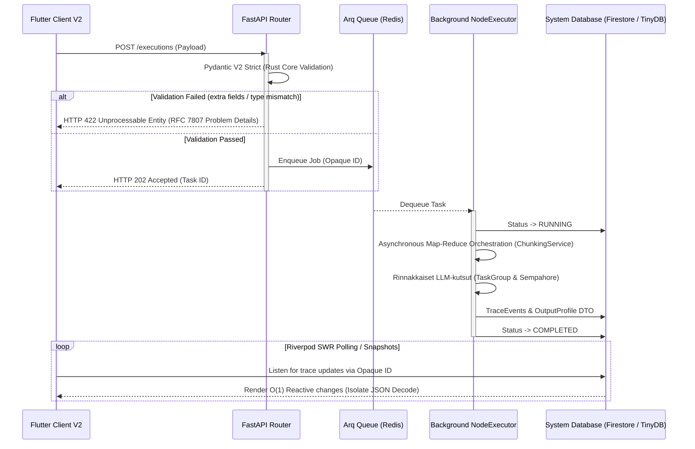

1. **Optimistinen vastaanotto (FastAPI):** Kun asiakas lähettää suorituspyynnön, FastAPI delegoi raskaan työn Arq-taustajonolle (Redis) ja palauttaa välittömästi HTTP 202 -vastauksen.
2. **Taustaprosessointi ja Map-Reduce (Arq Worker):** Itsenäinen Worker-prosessi purkaa jonon. Mikäli käsiteltävänä on massiivinen määrä atomeja (kysymyksiä), se välitetään ohjaustasolla `ChunkingService`-komponentille. Järjestelmä orkestroi tiukat `SystemConcurrency.LLM_MAX_CHUNK_SIZE` -rajat (oletus 40) ja ajaa klusterin rinnakkain `asyncio.TaskGroup`- ja `Semaphore`-työkalujen avulla ilman pelkoa API-rajoihin osumisesta (Token Explosion). Kaikki kootaan deterministisesti yhteen tulokseen.
3. **Reaktiivinen UI-päivitys:** Käyttöliittymä kuuntelee tietokannan tapahtumia ja päivittää näkymät (esim. XAI-raportit) heti kun taustaprosessi on valmis ja tietokannan tila päivittyy arvoon `COMPLETED`.

## Hakemistorakenne: Kognition ja rajapintojen erotus

Koodikannassa ohjaustaso asuu vahvasti rajatuissa kansioissa. Tärkein sääntö on, että kognitio (LLM-kutsut, skoraus) ei saa siirtyä rajapintoihin, vaan routers-kerros on "aneeminen" (Anemic pattern).

### `backend_v2/api/routers/` (FastAPI Control Plane)
Ylin REST-rajapintakerros vastaa HTTP-pyyntöihin. *(Huom: Vaikka reitittimet sijaitsevat fyysisesti `routers/`-kansiossa ja vanha `api/v2/`-kansio on deprikoitu arkkitehtuurista, kaikki reitittimet julkaistaan ohjelmallisesti `main.py`:ssä asettamalla niille etuliite `/api/v2`.)* Se pysäyttää virheellisen datan RFC 7807 -turvamuuriin (Pydantic ValidationError) ennen kuin se siirtää vastuun Services-kerrokselle.

**API Boundary Sovereignty (BaseResponseDTO):** Järjestelmä käyttää keskitettyä `BaseResponseDTO` -rakennetta palauttaessaan objekteja rajapinnoista. Tämä takaa monivuokralaiseristyksen (multi-tenant isolation) suodattamalla piilotetut tietokantamuuttujat (esim. `organization_id`) automaattisesti pois paluukuormasta. Reitittimien ei enää tarvitse käsitellä epävarmoja `exclude=True` -määrityksiä paikallisesti, mikä estää inhimilliset virheet ja "API Boundary Leakage Trap" -haavoittuvuudet.

- **`execution/`**: Työnkulkujen asynkronisten ajojen ominaisuudet, koostaen tiedostot `executions.py` (ajojen aloitus ja historian haku), `scorecard.py` (piste- ja diagnostiikkaraporttien koonti jäädytetyistä ajoista) sekä ajonaikaisen työnkulkujen kytkennän `workflows.py`.
  - **Fail-Fast Hydration & Zero Defaults (Epic 42):** DTO-mallit (kuten `ExecutionCreate` ja `ExecutionRecord`) vaativat ehdottomasti työnkulkukohtaisen `strictness_level: int = Field(..., ge=0, le=100)` -arvon. Järjestelmä hylkää Pydantic-tasolla kaikki pyynnöt, joista ankaruustaso puuttuu (ei oletusarvoja, "Zero Defaults" -mandaatti).
  - **Execution Cache Hashing:** `strictness_level` on pakollinen komponentti ajojen välimuistiavaimessa (Cache Key Hash). Jos työnkulun ankaruustaso muuttuu, koko DAG-verkko vaatii uudelleenajon, taaten eheyden tekoälyn asiantuntijalogian ja tallennetun tuloksen välillä.
- **`iam/`**: Identiteetin ja organisaatiotason hallinta (Tenant Isolation) tukeutuen tiedostoihin `auth.py`, `organizations.py` ja `users.py`.
- **`studio/`**: "Cognitive Studio" hallitsee suoraan arkkitehtuurisia Pydantic-rakennuspalikoita. Kansion alla elää koko dynaamisten Blueprinttien CRUD-operaatiot erillisinä tiedostoina: `prompt_blocks.py`, `steps.py` ja `workflows.py`, sekä järjestelmän fyysiset hallintareitittimet: `mcp_gateways.py`, `model_registry.py` ja `system_configs.py`.
- **`output_profiles.py`**: Yksittäinen reititintiedosto (ei kansio) tulostusprofiilien ja näkymien (SDUI) hallintaan.
- **`system/`**: Järjestelmän infrastruktuurioperaatiot tiedostoina, kuten terveystarkistukset (`health.py`) ja telemetria (`telemetry.py`). (Ohjelmalliset konfiguraatiot ovat täysin siirretty `studio/` -reitittimen alaisuuteen.)

### `backend_v2/core/` (Arkkitehtuuriresurssit)
Sisältää sovelluksen kriittisen asynkronisen infran ja rekisterit, jotka hallinnoivat järjestelmän toimintaa taustalla.
- **`hook_registry.py`**: Suorituksenaikaiset välityspalvelut (hooks), jotka vaikuttavat malleihin suorituksen aikana.
- **`registry.py`**: `TaskRegistry` toimii kriittisenä V2 Adapterina. Se käärii vanhat Class-Based Agentit yhdenmukaisiksi tehtäviksi (Tasks), hoitaa dynaamisen promptien purkamisen kantaan tallennetuista paloista (`ComponentRegistry`), injektoi ajonaikaiset muuttujat (kuten `{{INPUTS_JSON}}`, `{{CURRENT_DATE}}`) ja varmistaa tulosten Strict Mode -validoinnin.
- **`rate_limit.py` / `security.py`**: API:n tiukat rajoitteet ja tietoturvamääritykset (RateLimiter, CORS).

### The Entrypoint: `backend_v2/main.py`
Järjestelmän juurikäynnistäjä, joka sitoo arkkitehtuurin kasaan:
1. **Lifespan Management & Telemetry:** 
   - Ennen Arq-poolin alustamista sovellus käynnistää (importtaa) `backend_v2.hooks` -moduulin. Tämä lataa kaikki `@hook_trigger`-dekoraattorit muistiin reaaliaikaista Hook Registryn käyttöä varten (dynaaminen ajonaikainen kognitiomutaatio).
   - Alustaa Arq Redis -poolin (FakeRedis fallback-mekanismein) vikasietoisuuden takaajana.
   - Välittömästi FastAPI-applikaation luonnin jälkeen logfire instrumentoidaan `logfire.instrument_fastapi(app)` avulla, turvaten telemetrian kirjaamisen jo ennen middlewarejen käynnistystä ja "One Truth Error Protocol" -jäljitettävyyden takaamiseksi.
2. **Middlewaret:** Middleware-ketju suoritetaan tarkassa arkkitehtuurisessa järjestyksessä heti telemetrian (`logfire`) injektoinnin jälkeen:
   - `CORSMiddleware` avaa rajapinnat asiakasohjelmalle (Flutter Client V2).
   - `RequestIdMiddleware` luo ja injektoi `X-Request-ID` -tunnisteen pyyntökontekstiin hajautettua jäljitettävyyttä varten.
   - `LocalizationMiddleware` parsii asiakkaan pyytämän kielen (`Accept-Language`) globaaliin kontekstiin dynaamisia käännöksiä varten.
3. **Global Error Catchers:** Sieppaa kaikki virheet ja muuntaa ne RFC 7807 "Problem Details" -muotoon Fail-Fast -periaatetta noudattaen. Pydantic-virheiden (`RequestValidationError`) lisäksi tämä sisältää reititystason rate limit -ylitysten (`RateLimitExceeded`) kiinnioton sekä yleisten HTTP-poikkeusten (esim. 401, 403, 404) kääntämisen suoraan sisäisiin `ErrorCodes`-enumeraatioihin, jolloin client-sovellus kykenee esittämään virheet oikealla kielellä lokalisaatioavainten kautta.

<br><hr>

➡️ **Seuraavaksi:** Kun API-vastaanotto ja jonotus on ymmärretty, siirry lukemaan [04_workflow_and_dag.md](./04_workflow_and_dag.md), joka selittää, kuinka sisään tullut työ pilkotaan ja orkestroidaan jättimäiseksi rinnakkaiseksi verkoksi (DAG).
# 03: Palvelukerros ja DAG-moottori (Business Services)

Cognitive Quorumin `backend_v2/services/` -hakemisto sisältää järjestelmän ydinälyn. Kaikki liiketoimintalogiikat, työnkulkujen (DAG) suoritus ja "Backend-For-Frontend" (BFF) -raporttigenerointi suoritetaan tässä kerroksessa turvallisesti eristettynä HTTP-rajapinnoista (Routers).

## Execution Service (Orkestraation portinvartija)

`execution.py` (`ExecutionService`) toimii järjestelmän primäärinä portinvartijana työnkulkujen (DAG) käynnistämiselle ja jatkamiselle (`start_execution`, `resume_execution`). Palvelu ohjaa laajasti asynkronista suoritusta ja tulosten hallintaa:
* **Ingress ja Validointi:** Suorittaa raskaat "Fail-Fast" Pydantic-validoinnit työnkulun ingress-vaiheessa ja generoi dynaamiset käyttöliittymän vihjeet (SDUI) vastaustilan hallintaan.
* **Asynkroninen Raportointi (Epic 14):** Tukee asynkronista raportointia (`render_execution` -> `render_profile_job` Arq jonoon). Tämä ehkäisee käyttöliittymän "infinite loop" -kyselyitä luomalla deterministisen työtunnisteen jota käyttöliittymä voi pollausturvallisesti kuunnella.
* **Force Re-render:** Tarjoaa `clear_profile_synthesis` -funktion, jolla käyttäjä voi pakottaa yksittäisen output profiilin (ja siihen kytketyn PDF:n) tuhoamisen ja uudelleengeneroinnin tietokannasta.
* **Tenant Isolation:** Rajaa tiedon tiukan "Tenant Isolation" -periaatteen mukaisesti. Rajoite on vahvistettu kaikissa perustoiminnoissa (`list_executions`, `get_execution`, `delete_execution`), estäen ristiinlukemisen.
* **FinOps:** Valvoo puitebudjettia "Circuit Breaker" -rajoitteilla yhteistyössä `usage_service.py`:n kanssa suojellakseen osakkaiden kukkaroita karkaavalta AI-kulutukselta.

## Pyynnön Elinkaari ja Kognitiivinen Kuorma (Call Stack)

Yhden LLM-pyynnön matka HTTP-rajapinnasta varsinaiseen kielimalliin on jaettu useaan tiukkaan vastuualueeseen (Single Responsibility). Tämä eristys on teknisesti välttämätön skaalautuvuuden, tietoturvan ja virheiden hallinnan vuoksi, mutta se tekee koodin seuraamisesta aluksi hidasta.

Alla oleva sekvenssikaavio havainnollistaa täydellisen kutsuketjun (`Call Stack`), jotta koodikannassa navigoiminen helpottuisi:

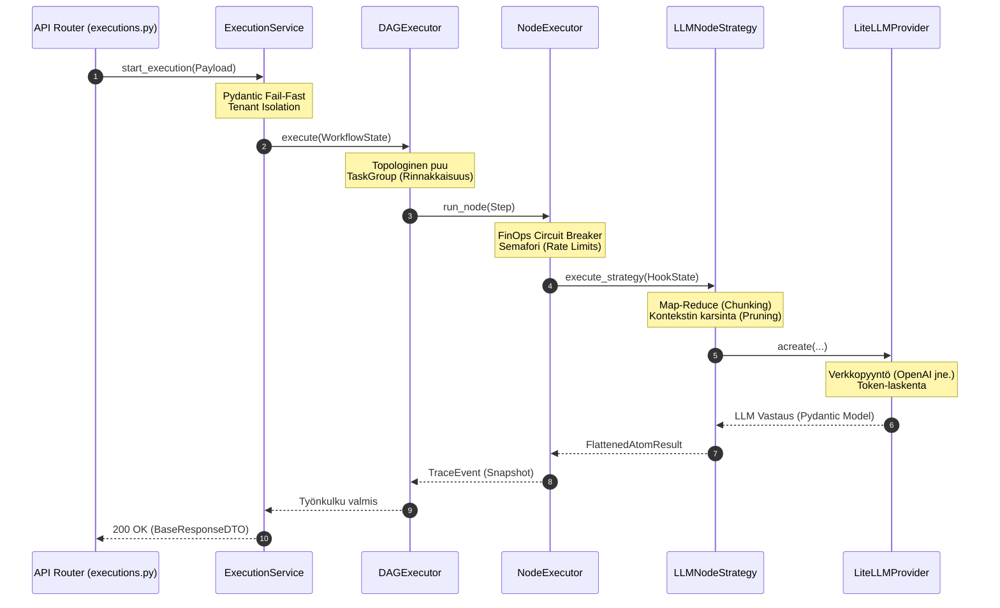

**Abstraktioiden oikeutus:**
1. **API Router** on tyhmä ("Anemic Router") – se hoitaa vain HTTP-liikenteen.
2. **ExecutionService** vastaa käyttöoikeuksista ja tietokantatransaktioista.
3. **DAGExecutor** ymmärtää verkkorakenteen, mutta ei tiedä mitä yksittäinen solmu tekee.
4. **NodeExecutor** vastaa yhden solmun rahankäytön (FinOps) rajoittamisesta ja virheiden nappaamisesta.
5. **LLMNodeStrategy** vastaa pelkästään promptien kääntämisestä (PromptCompiler) ja kontekstin rajaamisesta.
6. **LiteLLMProvider** on fyysinen verkkokerros, joka voi vaihtua lennosta (OpenAI -> Anthropic).

## DAG-moottori: Arkkitehtuuri ja Asynkronisuus

Työnkulkujen orkesterointi on keskitetty `services/orchestrator/dag_executor.py` -moduuliin. Moottori ei ylläpidä paksua ajonaikaista muistitilaa vaan perustuu puhtaalle Event Sourcing -mallille. Arkkitehtuuri on pilkottu neljään eristettyyn komponenttiin:

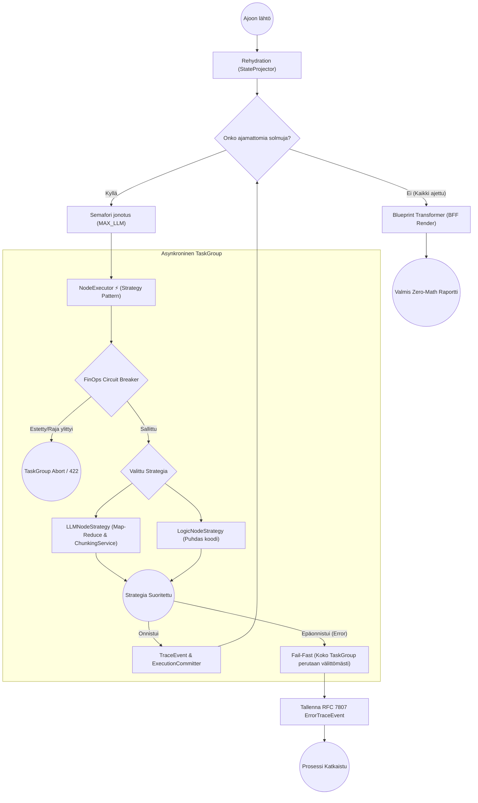

1. **DAGCompilerService (Shift-Left Pre-Flight Compilation):** 
   * Esivalmistelee ja validoi ylätason riippuvuudet staattisen analytiikan avulla jo työnkulkujen tallennusvaiheessa.
   * Etsii DFS-algoritmilla syklisiä riippuvuuksia (Infinite Loops) ja varmistaa topologisen analyysin (Kahn's iteration) avulla, että eteenpäin suunnatut muuttujaviittaukset (`$inputs`, `$steps`) ovat varmasti saatavilla suorituksen aikana. Tämä Shift-Left -validointi estää API-kustannuksia tuhlaavat myöhäisvaiheen kaatumiset ja umpikujat (Deadlocks).
2. **DAGExecutor (Orkestraattori):** 
   * Vastaa verkon topologian (Dependency Graph) varmistamisesta ja solmujen rinnakkaisajosta. Ennen topologian aloitusta suoritetaan Pre-Hydration: moottori kutsuu Hook-rekisterin `input_processing` -tilaa eristetyllä `HookState`lla purkaakseen ja esikäsitelläkseen datan ajoa varten.
   * Suorittaa solmut (StepRule) natiiveina `asyncio.TaskGroup` -kapselointeina. Jos yksikin solmu sadoista kaatuu asynkronisen ajon aikana palamattomasti, `TaskGroup` perutaan ja ajon resurssit (esim. tekeillä olevat roikkuvat HTTP-pyynnöt LLM:lle) tapetaan automaattisesti taaten täydellisen "Fail-Fast" nollavuototilan.
   * Hallinnoi ajonaikaista rinnakkaiskattoa vahvan semaforin (`SystemConcurrency.MAX_CONCURRENT_LLM_STEPS`) avulla suojellakseen ulkoisia API-rajoitteita (Rate Limiting).
   * Lukee työnkulun `strictness_level` -parametrin DTO:sta ja reitittää sen eteenpäin koko verkon topologian läpi, jotta jokainen `LLMTaskExecutor` -solmu toimii samassa vaatimustilassa.
3. **NodeExecutor (Yksittäisen tason äly - Strategy Pattern):** 
   * Kapseloi askeleen ajologiikan (`LLMNodeStrategy` tai `LogicNodeStrategy`) täyteen eristykseen. `LLMNodeStrategy` ei ole vain putki, vaan itsessään laaja Map-Reduce -orkestraattori, joka ottaa vastaan rajattoman atomisen matriisin (`MATRIX_SAMPLING_LIMIT = 0`), pilkkoo sen `ChunkingService`:n avulla turvallisiin massapaloihin välttyäkseen Token-ylikuormalta, ajaa palat rinnakkain, ja yhdistää tulokset deterministisesti (`FlattenedAtomResult`).
   * Välittää `validation_context`:in (esim. ankaruustason) Pydantic V2 `.model_validate_json()` -metodille. Tämä mahdollistaa dynaamisen, kontekstuaalisen Pydantic-validoinnin (esim. hylkäämään implisiittisen logiikan tiukoilla Strictness-tasoilla) heti datan saapuessa kielimallilta.
   * Suorittaa ns. "FinOps Circuit Breaker" -tarkistuksen ennen kutsua taatakseen, ettei asiakas ylitä budjettia sadoilla käskyillä.
   * Ei itse tallenna tietoa tietokantaan, vaan palauttaa `TraceEvent` tai virtuaalisesti siepatun `ErrorTraceEvent` -lokituksen deterministisestä lopputulemasta.
4. **ExecutionCommitter (Event Sourcing -tallennin):** 
   * Ottaa vastaan ajonaikaisen JSON-lokijonon ja puskee "Snapshotit" (`execution_trace` / `step_states`) alastomana Pydantic-datana tuettuihin tallennuskerroksiin (`repository.py`).
   * Pysyy täysin tietämättömänä itse logiikasta varmistaen vain nopeimmat asynkroniset tietokantasiirrot ajon edetessä "Optimistic UI" tukea varten.

### Orkestraattorin apukomponentit

* **`prompt_compiler.py`:** Dynaamisten Pydantic-skeemojen ("Two-Tier schema") lennosta generoiva käännin V2 Structured Outputs -käyttöön. Käännin sisältää "Self-Healing citation" -logiikan, joka korjaa LLM:n palauttamat puolittaiset viitetekstit oikeiksi sallittujen lähteiden perusteella. Ehkäisee Pydantic-käännösten räjähtämisen suurissa yli 200 askeleen DAG-ajoissa hyödyntämällä LRU-välimuistia.
* **`atomizer.py`:** Vastaa "Deep Atomization" -käsittelystä tallennusvaiheessa. Purkaa LLM:n avulla evaluointikriteerit täsmälleen 15 mikrootomiin ja obfuskoi asiantuntijatermit (Scaffolded exceptions) estääkseen kontekstipakoilua (Context Drift).
* **`chunk_accumulator.py`:** Kokoaa turvallisesti yhteen Map-Reduce -suoritusten LLM-palaset (chunks). Pakottaa arkkitehtuurin "No Naked Dicts in State" -säännön siirtämällä sanakirjojen hallinnan ja stringien (esim. `reasoning_trace`) yhdistämisen orkestraattorin pääsilmukasta testattavaan erilliskomponenttiin.
* **`context_router.py`:** Eristää UI-lähtöisen reitityksen ja datan karsinnan (`route_and_prune`). Poimii raskaasta suorituspuusta (`trace_event`) täsmälleen vain ne XAI-laajennokset, joita käyttöliittymän valittu `OutputProfileConfig` eksplisiittisesti vaatii. Toimii myös "Fail-Fast" portinvartijana muuttujien reitityksessä (`normalize_and_validate_variable`), hyläten välittömästi orvot viittaukset (Orphaned Steps) sekä vanhentuneet V1-tyyliset `.output`-polut (`400 Bad Request`). Enää ei sallita "duck-typing"-oikoteitä, vaan kaikki polut ohjataan ja validoidaan noudattamaan puhdasta V2-nomenklatuuria (Code is Truth).

> **Syväsukellus NodeExecutorin kerrokseen:** Tarkempi arkkitehtuurikuvaus yksittäisen tason älystä ja kontekstin rakentamisesta löytyy dokumentista [03b: Orchestraattoristrategiat ja Kontekstin Rakennus](./03b_orchestrator_strategies.md).

### Rehydration (Kesken jääneen työn jatkaminen)
DAG-moottorin nojatessa Event Sourcingiin (aiemmin mainittu `execution_trace`), pystyy prosessi tarvittaessa toipumaan mistä tahansa ulospäin näkyvästä konesaliradasta:
1. Orkestraattori hakee lukitun työn tietokannasta ("Rehydration").
2. `StateProjector` -luokka pyöräyttää kaikki vanhat muistiinkirjatut taustalokit järjestyksessä kerralla muokatakseen sisäisen "Virtual State"n haluttuun pisteeseen.
3. NodeExecutor herättää eloon vain ne solmut, joiden tila oli lokitettu arvoon `pending` tai `failed`, pakoen sokeita massaoletuksia.

## Admin Studio Service (Ideointi ja mallinnus)

`studio.py` (`Admin Studio Service`) hallinnoi koko järjestelmän domain-malleja (Workflows, Steps, PromptBlocks, OutputProfiles) sekä ylätason `SystemConfig` tiedostoja. Tämä palvelu kapseloi sisäänsä keskitetyn järjestelmänhallinnan logiikan:
* Suorittaa raskaampia graafioperaatioita, kuten työnkulkujen "Shallow-Deep Copy" kloonauksia, säilyttäen tiukan rakenteellisen eheyden.
* Tarjoaa `simulate_workflow()` -graafivalidoinnin etukäteen tapahtuvalle simulaatiolle.
* Valvoo ohi reitittimien kulkevia RBAC-tarkastuksia ja laajoja päivityksiä Admin Studio -toiminnoille.

## Tiedostojen renderöinti, BFF ja Ulkoiset (MCP) Palvelut

`backend_v2/services/blueprint.py` on järjestelmän näkyvin "Backend-For-Frontend" kerroksen muotoilija. Koska Frontendissä vaikuttaa tiukka nollalaskennan "Zero-Math UI" -sääntö, kaikki graafiset pisteytyslokiikat on sidottu yksinomaan tänne.

* Ajossa `BlueprintTransformer` lukee valitun `OutputProfile` -konfiguraation (esim. Executive Summary -näkymä vs. Syvällinen 3D-verkkokuvio). Se analysoi työnkulun lopullisen "FrozenContextin".
* **Zero-Math sääntö:** Blueprint paketoi numeeriset skaalaimet ja värimuunnokset valmiiseen `ReportLayoutDTO` -mallistoon (Akselit, pisteet ja XAI "Missing Context" liputukset). Käyttöliittymä, tai PDF-generaattori ei joudu koskaan miettimään miten x/y korrelaatio ratkaistaan saati mistä teksti pöllittiin (Citation Integrity/Hallucination Flag), sillä ne kaikki ovat puhtaasti palvelimen päättelemässä DTO-putkessa.

**Virtuaaliset Järjestelmäaskeleet ja Raportin Generointi (Arq Worker)**
Suorituksen (Execution) matemaattinen pisteytys ja loppuraportin renderöinti on irrotettu DAG-verkosta omiin **Virtuaalisiin Järjestelmäaskeleisiin** (esim. `sys_render_<profile>`). Kun LLM-työnkulku valmistuu, taustajärjestelmä siirtää vastuun Arq Workerille (`render_profile_job`). 
Tämä työntekijä lukee `OutputProfile`:n ja syöttää tarvittavat `strictness_level` ja `scoring_strategy` -arvot matemaattisille moottoreille lennosta, luoden `ReportDataDTO`:n. Työntekijä hallinnoi virtuaalisen askeleen `status`-päivityksiä (running, completed, failed) suoraan tietokantaan mahdollistaen tarkan seurannan (Server-Sent Events) ennen koko ExecutionRecord-tilan sulkemista.

**PdfReportService (`pdf_generator.py`)**
Toimii BlueprintTransformer-luokan rinnalla ja hyödyntää samaista Layout DTO -pohjaa dynaamisten PDF-tiedostojen rakentamisessa (Jinja2 & WeasyPrint). Palvelu toimii puhtaana datamuuntimena palauttaen PDF-tavuvirran, kun taas asynkroninen Arq-työntekijä ja `Storage_driver` hoitavat lopullisen tiedostojen tallennuksen ja tietokannan päivityksen rinnakkaisesti työnkulun ajon kanssa.

**Machine Control Protocol (MCP)**
Järjestelmään sisältyy `mcp/` -hakemisto, joka toimii agenttisten verkkohakujen ja tekoälyn ulkoisten toimintojen rajapintana. Palvelut kuten `mcp_tool_loop.py` ja luokat kuten `tavily_search_client.py` kykenevät tekemään itsenäistä verkkohakua ulkopuolisista viitekehyksistä, laajentaen suppeaa staattista kontekstia merkittävästi. Moottori käyttää näitä LLM:n orkestroimana asynkronisesti tarvittavan tiedon hakemiseen.

## Tukipalvelut ja Apuohjelmat (Utility Services)

Järjestelmän taustalla toimii joukko erikoistuneita apupalveluita (Utilities), jotka noudattavat V2-arkkitehtuurin Fail-Fast -sääntöjä:

* **`chat_parser.py` (ChatParserService):** Erottaa LLM:n (ChatParser-strategia) avulla ihmisen ja tekoälyn välisen keskustelun puhtaaksi Pydantic `ChatHistoryDTO`:ksi. Siivoaa esimerkiksi selaimeen copy-pastetetun ChatGPT-keskustelun turhasta UI-roskasta, soveltaen Fail-Fast -validointia sekaviin syötteisiin.
* **`localization.py` (LocalizationService):** Hoitaa SDUI-skeemojen palvelinpuolen käännökset (esim. `x-ui-label` ja `label`). Hyödyntää `ContextVar`-pohjaista kielen valintaa pyynnön elinkaaren aikana. Noudattaa tiukkaa "No Fallbacks" -sääntöä käännösten suhteen nostamalla virheen, jos sanastoa ei löydy, taaten datan eheyden käyttöliittymäkerroksessa.
* **`flattener.py` (FlatFileService):** Muuntaa nested-muotoisen DAG:n monimutkaisen suoritustuloksen yksiulotteiseksi tietorakenteeksi (esim. `[step_id]_[key] = value`) analytiikkaa ja CSV-vientiä varten hyödyntämällä `StateProjector.fold_trace` ominaisuutta.
* **`progress.py` (ProgressTracker):** Hallinnoi asynkronisten prosessien edistymistä vakiomuotoisella tilakoneella (`started`, `running`, `completed`, `failed`). Toteuttaa Strategy-tyyppisen kuvion, joka skaalautuu erilaisiin tallennustarpeisiin (`DatabaseProgressTracker` DAG-ajoille, `InMemoryProgressTracker` API-testeille, `ProgressService` Redis-tapahtumille).
* **`pii_analyzer.py` (PIIAnalyzerService):** Vastaa tietoturvasta hyödyntäen Microsoft Presidiota ja SpaCyä PII-datan maskaukseen. Singleton-palvelu on optimoitu "Lazy Loading" -tekniikalla, eli raskas kielimalli ladataan muistiin vasta kun tietoturvamaskaus aktivoidaan, mikä säästää kallista RAM-muistia järjestelmän käynnistyksessä.
* **`usage_service.py` (UsageService):** Vastaa LLM-tokenien kulutuksen ja kustannusten (LiteLLM) kirjaamisesta immutaabelisti. Toimii lisäksi "FinOps Circuit Breaker" -komponenttina, joka tarkistaa dynaamisesti organisaation kiintiöt (`quota_limit`) ja katkaisee (Fail-Fast) lisäajot yli sallitun budjetin.
* **`drivers/`:** Tiedostoajurien rajapinta, joka sisältää tuen lokaalille tiedostojärjestelmälle (`local_file_driver.py`) sekä pilvitallennukselle (`gcs_file_driver.py`) abstrahoiden säilytyskerroksen ydinlogiikasta.

## IAM ja Identiteetti

`services/auth.py` valvoo ja todentaa pyynnöt erillisten Custom Claims tai Firebase SDK -tokentapaisten puitteissa (JWT). Moduulissa käsitellään organisaation vaihto-operaatiot (Tenant Isolation), tuetaan sisäänrakennettuina "Bring Your Own Key" (BYOK) hallintoa ja varmennetaan, etteivät ristiin organisaatiot tallenna dataa väärillä `org_` prefikseillä. Lokaalissa "Mock_DB"-tilassa tämä osio ohitetaan ylikuormittavien HTTP-viiveiden estämiseksi ja valtuutetaan keinotekoinen rooli rajapintatestejä varten.

# Orchestraattoristrategiat ja Kontekstin Rakennus

Tämä dokumentti syventää `03_business_services_and_dag.md` -kuvausta purkamalla työnkulkumoottorin strategiakerroksen (`backend_v2/services/orchestrator/strategies/`). Strategiakerros vastaa työnkulkujen yksittäisten solmujen (Step) täytäntöönpanosta NodeExecutorin alaisuudessa.

Arkkitehtuuri perustuu Strategy-suunnittelumalliin, jossa solmun tyyppi (esim. `llm` tai `logic`) määrittää käytettävän suoritusstrategian. Kerros noudattaa tiukasti Quorumin Fail-Fast -periaatteita: virheet nostetaan välittömästi ja tila on vahvasti tyypitetty.

## `BaseNodeStrategy` (base.py)
Kaikkien strategioiden kantaluokka, joka määrittelee solmun suorituksen rajapinnan ja jakaa yhteiset operaatiot.

- **Hookien suoritussilmukka:** Abstrahoi Pre- ja Post-hookien suorituksen (`run_pre_hooks`, `run_post_hooks`) ulos ydinlogiikasta. Silmukka iteroi solmun (Blueprint) määrittämät hookit ja yhdistää (deep merge) niiden palauttaman tilamuutoksen askeleen tilaan.
- **`HookState` ja `HookDependencies` injektio:** Hookeille injektoidaan aina vahvasti tyypitetty `HookState` (sisältäen instanssikohtaiset muuttujat, kuten `execution_id` ja `inputs`) sekä `HookDependencies` (joka tarjoaa pääsyn esim. repository-kerrokseen).
- **Fail-Fast ja Circuit Breaker:** Sisältää `assert_quota`-metodin ("Denial of Wallet" -suoja), joka tarkistaa organisaation token-rajat ennen ajoa. Jos raja ylittyy, luokka lokittaa ensin virheen (`logger.warning`) ja heittää välittömästi `AppException`-poikkeuksen. Myös hookien palauttama `success=False` lokitetaan varoituksena RFC 7807 -jäljitettävyyden takaamiseksi.

## `LLMNodeStrategy` (llm.py)
Vastaa tekoälysolmujen (LLM Step) raskaasta orkestroinnista dynaamisen mallintamisen ja token-optimoinnin avulla.

- **Schema Map -rakentaminen:** Työnkulun ajon yhteydessä rakennetaan dynaaminen `schema_map`. Se lukee tietokannasta kaikki PromptBlockit ja tunnistaa matriisiblokit (`_SCHEMA_BLOCK_MATRIX`) sekä tavalliset tekstiblokit (`_SCHEMA_BLOCK_TEXT`). Tämän lisäksi järjestelmä rekisteröi täydellisen "Code is Truth" -periaatteen mukaisesti kaikki sallitut lisäkentät (kuten Blueprintin `output_extensions`) reititystokenilla `_SCHEMA_BLOCK_EXTENSION` ja globaalit järjestelmäavaimet tokenilla `_SCHEMA_BLOCK_SYSTEM`. Tämä poistaa kaiken duck-typing-arvailun ja muodostaa aukottoman sallintalistan (allowlist) datan karsinnalle.
- **PromptBlock Fail-Fast Validointi:** Hakee askeleen vaatimat PromptBlockit tietokannasta ja validoi ne heti. Mikäli blokkia ei löydy, strategia ei yritä luoda oletusarvoja vaan heittää välittömästi `AppException`-virheen.
- **Map-Reduce Orkestraatio:** Kun askeleessa on matriisiblokkeja ja `shuffled_atoms`-syöte, LLM-solmu jakaa datan `ChunkingService`:n avulla turvallisiin massapaloihin (Map). Palat ajetaan rinnakkain `ChunkWorker`:in avulla ja lopulta tulokset yhdistetään (Reduce) deterministisesti `ChunkAccumulator`:illa.

## `LogicNodeStrategy` (logic.py)
Käsittelee puhtaasti ohjelmalliset askeleet (Native/Logic Step) delegoimalla varsinaisen suorituksen Hook Registrylle.

- **Hook Lookup:** Hakee solmuun kytketyn logiikka-hookin nimen suoraan `hook_registry`:stä Blueprintin perusteella.
- **Tilan evaluointi:** Evaluoi nykyisen tilan (`$inputs` / `$steps`) StateProjectorista ja kokoaa sen tiukasti tyypitettyyn `HookState`:en ennen logiikkahookin asynkronista kutsumista.
- **Fail-Fast:** Jos primaarisen logiikkahookin suoritus palauttaa `success=False`, `LogicNodeStrategy` lokittaa välittömästi kriittisen tason virheen (`logger.error`) ja heittää `AppException`-virheen (ErrorCodes.AGENT_EXECUTION_CRITICAL). Hiljaisia epäonnistumisia ("silent fallbacks") ei sallita ohjelmallisessa logiikassa.

## `ContextBuilder` (context_builder.py)
Vastaa LLM-kontekstin rakentamisesta, muuttujamappausten resoluutiosta ja datan karsimisesta ennen token-vientiä.

- **`schema_map`-pohjainen karsinta (Allowlist):** LLM-kontekstin rakentamisessa sovelletaan tiukkaa Fail-Fast -sallintalistaa. Vain `schema_map`-sanakirjaan eksplisiittisesti rekisteröidyt avaimet päästetään läpi. Jos avainta ei löydy rekisteristä (esim. massiiviset `evaluations`- tai `shuffled_atoms`-taulukot), se pudotetaan säälimättä (Ruthless Pruning). Tämä takaa, ettei LLM-konteksti ylitä 100 000 tokenin turvarajaa.
- **`_process_trace_event` Arkkitehtuuri:** Tämä ydinmetodi käsittelee askeleen (Step) aiemman output-lokituksen. Jos solmun tietotyyppi on `MATRIX`, metodi varmistaa, että data on kelvollinen sanakirja parsien sen tiukalla `LightweightMatrixOutput`-skeemalla, ja käyttää `ContextRouter.route_and_prune` -funktiota datan rajaamiseen ulostuloprofiilin (Output Profile) mukaisesti. Kaikki rakenteelliset poikkeamat kaatuvat Fail-Fast -periaatteen mukaisesti.
- **Fail-Fast -ehdottomuus:** Kaikki oletukset ovat ohjelmallisesti kiellettyjä. LLM-kontekstiin lisättävät metadatat (kuten `reasoning_trace` tai `_step_metadata`) pääsevät läpi ainoastaan, jos ne on eksplisiittisesti määritelty tietokannan Blueprintissä (`output_extensions`) tai kiinteinä globaaleina järjestelmäavaimina. Tuntemattomien avainten passthrough-ohitukset eivät ole sallittuja.

## Arkkitehtoninen Rajoite: Täyden Asynkronisuuden Illuusio (The CPU Trap)

Vaikka `DAGExecutor` hyödyntää `asyncio.TaskGroup`-kapselointeja ja modernia asynkronista rinnakkaisajoa, järjestelmässä on tehty tietoinen arkkitehtoninen päätös pitää tietyt komponentit (kuten `PromptCompiler`) puhtaasti synkronisina.

### 1. CPU-pullonkaulan Harha (The CPU Trap)
Asynkronisuus (`async/await`) nopeuttaa ainoastaan I/O-operaatioita (kuten verkko- tai tietokantahakuja). `PromptCompiler.py` on massiivinen komponentti, jonka ydinlogiikka koostuu raskaasta merkkijonojen manipuloinnista, regex-etsinnästä ja synkronisesta Pydantic-validoinnista. Nämä ovat täysin **CPU-riippuvaisia** tehtäviä. Vaikka `PromptCompiler` muutettaisiin asynkroniseksi, sen suorittama raskas tekstinmurskaus blokkaisi Pythonin tapahtumasilmukan (GIL) silti. Asynkronisuus toisi vain illuusion rinnakkaisuudesta, mutta lisäisi coroutine-overheadia. 

Vaihtoehdot: Jos CPU-pullonkauloja halutaan tulevaisuudessa todella hajauttaa, raskaat tekstikokoamiset pitää siirtää joko natiiviin Rust-kerrokseen (jota Pydantic V2 osittain tekee) tai omiin eristettyihin Multiprocessing-säikeisiin, ei asynkronisiin rutiineihin.

### 2. Virheiden Hallinnan Monimutkaisuus (Fail-Fast Rinnakkaisuudessa)
Täysin asynkronisen (100% async) I/O- ja CPU-arkkitehtuurin toinen rajoittava tekijä on "Fail-Fast" -periaatteen monimutkaisuus vapaassa rinnakkaisuudessa. Jos järjestelmä ajaa useita asynkronisia alitehtäviä rinnakkain ja yksi niistä kaatuu Pydantic-validointiin, kaikkien muiden orpojen tehtävien turvallinen peruuttaminen (cancel) vaatii rutiineja, jotta muisti ja yhteyspoolit eivät vuoda. Tästä syystä rinnakkaisuus on järjestelmässä keskitetty tiukasti valvottuihin `TaskGroup`-semaforeihin orkestraattorin juurella, eikä asynkronisuutta "tartuteta" syvälle synkronisiin datamuuntimiin.

<br><hr>

➡️ **Seuraavaksi:** Nyt kun tiedät, miten DAG-verkko etenee solmusta toiseen, lue [05_llm_and_hooks.md](./05_llm_and_hooks.md). Se sukeltaa yksittäisen solmun sisään ja selittää, miten Hookit ohjaavat sokeaa tekoälyä.
# 04: Natiivit Hookit ja Kieli-integraatiot (LLM)

Cognitive Quorum -järjestelmässä puhtaat työnkulkujen kognitiiviset lisäosat ja ulkoiset tekoälyintegraatiot on eriytetty vahvasti `hooks/` ja `llm/` kerroksiin. Tämä mahdollistaa deterministisen laadunvarmistuksen ohi LLM:n mustan laatikon hallusinaatioiden.

## The Hook Layer (`backend_v2/hooks/`)

Natiivit Python-koukut (Hooks) ovat tilattomia funktioita, joita työnkulun solmut kutsuvat ennen (Pre-Hook) tai jälkeen (Post-Hook) varsinaisen LLM-kutsun. Hookeilla on pääsy työnkulun siihenastiseen `HookState`-kontekstiin ja ne on rekisteröity järjestelmään `hook_registry.py`:n kautta.

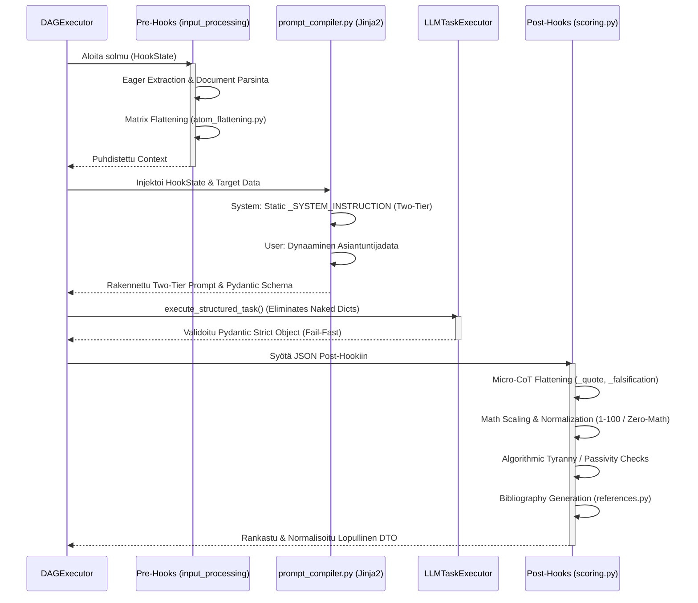

### Hook-kerroksen Arkkitehtuurin Invariantit (Phase 9)

Kaikki hookit noudattavat **Explicit Routing** ja **Zero Silent Data Loss** -periaatteita (Pydantic V2 `extra="forbid"`):
* **Kielto Hiljaiselle Siivoukselle (No Silent Scrubbing):** Hookit eivät saa koskaan syöttää koko massiivista `state.inputs` -sanakirjaa suoraan Pydantic-malleihin luottaen siihen, että `extra="ignore"` siivoaisi tuntemattomat kentät pois.
* **Eksplisiittinen Reititys (Explicit Routing):** Hookien (kuten `validation.py` tai `translation_hook.py`) tulee poimia manuaalisesti ja tyyppiturvallisesti vain ne kentät joita ne tarvitsevat (esim. `{"language": state.inputs.get("language")}`) ennen DTO-validaatiota. Tämä estää satunnaiset kaatumiset ja tekee datan kulusta täysin determinististä.
* **Token Explosion Prevention:** Erottamalla matriisi-data (dynaamiset rakenteet) ja Observability-data (esim. `true_atoms_count` `reporting.py`:ssä) toisistaan ennen validointia, taataan ettei valtavia päättelyketjuja tai historiatietoja ladata turhaan muistiin, mikä pitää järjestelmän äärimmäisen nopeana.

### Keskeisimmät Hook-vastuut

1. **Scoring ja Arviointien Normalisointi (`scoring.py`):**
   * **Micro-CoT (Chain of Thought) Vastausten Litistäminen (Post-Execution):** LLM vastaa tyypillisesti monivaiheisella syy-seuraus -verkolla. V2-arkkitehtuurissa tulokset parsitaan tiukan `MicroCotDTO`-adapterin läpi ja XAI-laajennukset (Explainable AI, esim. Falsification, Coaching, Citation) tallennetaan tiukasti `LightweightMatrixOutput`-mallin `extensions`-sanakirjaan hyödyntäen `XaiExtensionType`-enumia (esim. Stripe ID:n suffiksina `_coaching`), eikä niitä enää vuodeta root-tason vapaamuotoisiksi avaimiksi.
   * **Nollalaskenta (Zero-Math UI) ja CDM:** V1-mallin mukaiset vapaat sanakirja-avaimet (kuten `_scaled` tai `_normalized`) on poistettu. V2 käyttää yksinomaan tyyppiturvallisia `raw_score` ja `normalized_score` -kenttiä. Pisteiden aggregointi pohjautuu Cognitive Diagnostic Model (CDM) -malliin ja sen hyödyntämään progressiiviseen vaimennukseen (Square Root Dampening, `calculate_progressive_dampening_score`), mikä luo natiivisti gaussisen varianssin ilman keinotekoista lattiaa.
   * **Passivity Penalty:** Havaitsee tilanteet, joissa LLM valitsee järjestelmällisesti arviointiasteikon pienimmän vaivan tien (minimi score), jolloin tekoälylle annetaan matemaattinen rangaistuskerroin (`enforce_passivity_penalty`).
   * **Post-Hoc Rationalization & Security Threat -rangaistukset:** Havaitsee turvallisuusuhkat (`_extract_guard_flag`) ja jälkikäteisrationalisoinnin Falsifier-agentin datasta (`_calculate_falsifier_penalty`), devalvoiden loppupisteitä määritettyjen asetusten mukaisesti.

2. **Integriteetti ja Turvallisuus (`integrity.py` & `security.py`):**
   * Validointihookit, jotka pysäyttävät suorituksen, jos sisältö osuu estettyihin avainsanoihin tai jos kognition palauttamat lainaukset (Citations) eivät täsmää alkuperäiseen dokumenttiin (Source Hallucination).

3. **Informaation Pre-prosessointi (`input_processing.py`):**
   * Huolehtii mm. massiivisten PDF/Word -tiedostojen ennakkojaottelusta, metatiedustelusta ja normalisoinnista "Eager Extraction" -malliin ennen kalliita LLM-kutsuja.

4. **Raportointi ja Synteesi (`reporting.py` & `synthesis.py`):**

   #### `synthesis.py` — `text_consolidation_hook`
   Synteesikoukku on koko tulostusputken ydin: se muuntaa kaikkien DAG-steppien raakadatan yhdeksi tai useaksi LLM-syntetisoituksi markdown-tekstiksi per `OutputProfile`.

   **Vaiheen 2 Arkkitehtuurin Invariantit (Fail-Fast & Integrity):**
   * **Strict Schema Validation:** `SynthesisMetadataDTO` pakottaa, että suorituksen metadatassa on aina `step_results`-sanakirja. Jos taustaprosessi ei ole tallentanut tuloksiaan, rajapinta ei "arvaa" tai salli tyhjää tulostetta, vaan vaatii eksaktin tietorakenteen.
   * **Zero Orphaned Data (Data Funnel):** Järjestelmä yhdistää alkuperäiset syötteet (`state.inputs`) ja askeleiden lopputulemat (`state.metadata.step_results`) deterministisesti yhteiseen `combined_source_data`-objektiin. LLM saa käyttöönsä koko suorituksen kognitiivisen historian.
   * **Fail-Fast -pysäytys:** Jos `step_results` puuttuu tai on tyhjä, `text_consolidation_hook` kaatuu välittömästi (HTTP 400) ennen LLM:n käynnistämistä, taaten ettei synteesiä generoida puutteellisella matemaattisella todisteketjulla.

   Käyttöliittymä määrää kaiken:

   * **`synthesis.system_prompt`** — Globaali Kognitiivinen Blueprint (puuttuvana Fail-Fast, ei fallbackia).
   * **`synthesis.preamble_text`** (I18n) — Toniohjaus LLM:lle (käännetään `target_locale`-kielen mukaan).
   * **`synthesis.length_constraint`** — Globaali merkkirajoitus.
   * **`synthesis.enable_pii_masking`** — PII-maskaus ennen LLM-kutsua (`sanitize_text()`).
   * **`synthesis.historical_context_mode`** — Historiallisten synteesien käyttö (DISABLED / SLIDING_WINDOW_3).
   * **`layouts[n].synthesis.system_prompt`** — Osiokohtainen Blueprint ja preamble (per layout).
   * **`visible_extensions`** — XAI-laajennusluettelo, joka annetaan LLM:lle keruu-mandaattina.

   Synteesi tuottaa kolme erillistä `state_delta`-kenttää:
   - `synthesized_markdown` — globaali teksti
   - `section_syntheses` (`dict[layout_id, markdown]`) — layoutkohtaiset tekstit
   - `xai_highlights` — extension-korostukset (coaching, falsification, ...)

   **Token Shield — `_compress_synthesis_payload()`:**
   Ennen LLM-kutsuhetkeä poistetaan raskaat kentät (`shuffled_atoms`, `evaluations`, `quote`, `reasoning`), jotta Chief Editor -LLM saa vain perustelut ja pisteet — ei atomitason lokeja.

   **LLM-step-diskriminaattori (`reasoning_trace is None`):**
   Wildcard-moodissa (`target_blocks = *`) vain ne stepit siirretään synteesikontekstiin, joiden `reasoning_trace`-kenttä **ei ole `None`**. Tämä suodattaa automaattisesti pois `raw_inputs`-, `inputs`- ja logic-node-tapahtumat, jotka eivät emitä `reasoning_trace`-kenttää dynaamisessa schemassa. Tarkistus tehdään eksplisiittisesti `is None` -vertailulla (ei falsy `not`), jotta mallit joilla on tyhjä thinking-output eivät katoa kontekstista.

   **Käännösputki:** Jos `target_locale != "en"`, valmis englanninkielinen markdown siirretään `translation_hook`:lle, joka palauttaa lokalisoidun version. Osiokohtaiset synteesit käännetään erikseen.

   #### `reporting.py` — `generate_report_hook`
   Raportointi-koukku kokoaa `ReportContextDTO`:n kaikista agenttiluokista heti suorituksen jälkeen (Logic Node -polku). Se käyttää **`GlobalContextVarsDTO`** -skeemaa, jossa jokainen looginen rooli (`step_xai`, `step_judge`, `step_overseer`, jne.) on tyyppiturvallisesti määritelty (`strict=True, extra="forbid"`).

   > **Tyyppierittely:** `state.inputs` sisältää DAG-stepit opaakin step-ID:n avaimella (esim. `sr_5f3dd7`). `state.global_context_vars` sisältää hook-tason kontekstin loogisilla roolinämillä (`step_xai`, `step_judge`, ...). Nämä ovat erillisiä — intentionaalinen arkkitehtuurinen erottelu.

   **Score-aggregointi:** MATRIX-blokkit poimitaan suoraan `state.inputs`-hakemistosta `LightweightMatrixOutput`-DTO:n kautta, ei `GlobalContextVarsDTO`:sta (token explosion -esto). `MatrixObservabilityDTO` (`extra="ignore"`) suodattaa hiljaisesti pois raskaan blokki-sisaltön.

   **Score-yhteenveto:** Käytetään `step_scoreengine1.score_summary.normalized_score` -arvoa jos saatavilla, muuten lasketaan MATRIX-pisteiden keskiarvo itse.

5. **Konteksti ja Metatieto (`context_mapper.py`, `metadata.py` & `hydration.py`):**
   * Tilanhallinta ja datan liimaaminen.

6. **Käännökset (`translation_hook.py`):**
   * Hoitaa natiivikielen lokalisoinnin LLM-ajon jälkeen.

7. **Metriikat ja Heuristiikka (`metrics.py`):**
   * Dokumentoi objektiivisen tekstianalytiikan (sanojen määrä, lauseiden pituus), *Control Ratio* (Human vs AI -tekstisuhde), sekä käyttäytymisen heuristiikat (*Say-Do Gap*, *Automation Bias*, *Illusion of Competence*).

8. **Validointihookit (`validation.py`):**
   * Rakennetarkistuksien lisäksi huolehtii tekstien minimipituuden validoinnista (`verify_structure`) raskaalla Fail-Fast -periaatteella. Vastaa myös tuotosten kielen vuotamisen heuristisesta tarkistuksesta (`verify_output_language`).

9. **Arkistointi ja Ennakkotapaukset (`archival.py`):**
   * Sisältää `retrieve_precedent` -hookin, joka hakee aiemmat arvioinnit ("Case Law") oppimismateriaaliksi lennossa asiantuntijoille ja tekoälylle.

10. **Kielitiede ja Performativiteetti (`linguistics.py`):**
    * Vastaa tekoälyn ominaisen korusanaston (esim. "delve into", "kattava katsaus") tunnistavasta `detect_performative_patterns` -hookista. Tunnistettavien lausekkeiden laajuus on määritetty globaalissa `PERFORMATIVE_PATTERNS` -diktionaryssa.

11. **LLM Kontekstihook (`llm.py`):**
    * `configure_llm_context` -hook hakee ja injektoi kulloisenkin strategian (esim. `fast`, `reasoning`) kontekstiin ja reitittää mallin valinnan Model Registryn tietojen perusteella dynaamisesti.

12. **Datan Ennakko-Litistäminen (`atom_flattening.py`):**
    * Vastaa `MatrixScale`-rakenteiden (kuten 75-atomiset kyselyt) litistämisestä sokeaksi listaksi (Pre-Execution Flattening) ennen LLM-kontekstin luontia. Hyödyntää ositettua satunnaisotantaa (Stratified Random Sampling) vähentämään LLM-kontekstiväsymystä ja estämään JSON-token -räjähdyksen.

13. **Lähdeluettelogeneraatio (`references.py`):**
    * Vastaa eksplisiittisten ja implisiittisten viittausten haravoinnista tekstistä (Bibliography Generation). V2-versiossa toistaiseksi kehitysvaiheessa (Stub), joka tuottaa Dummy-viitteitä.

## Tekoälyintegraatiot (`backend_v2/llm/`)

Kieli-integraatiokerros erottaa ulkoiset mallintarjoajat (Vertex AI, OpenAI) järjestelmän sisäisestä asynkronisesta ytimestä.

### Rakenne ja Validointi

* **`handler.py`:** Selittää sen roolin korkean tason operaatioissa, kuten mallien löytämisessä ulkoisista rajapinnoista (Google Vertex Model Garden, OpenAI) ja saatavuuden validoinnissa (`fetch_all_available_models`).
* **`mock.py` & `mock_data.py`:** Nämä mahdollistavat testauksen (Rule: `mocking_mandate_for_llm`), joka tyystin kieltää suorat LLM-HTTP-kutsut CI/CD:ssä ja yksikkötesteissä. Ne eristävät HTTP-kutsut ja palauttavat staattisia JSON-fixtuureja Pydantic-malleihin pakottaen paikallisten fixtuurien käytön verkkovikaisten / aikaa vievien asynkronisten kutsujen sijaan.
* **`client.py` & `provider.py`:** Huolehtivat rajapintatason (HTTP) kommunikaatiosta, asynkronisista aikatasauksista (Retry/Rate Limit) sekä erilaisten mallien `Parsing Mode`ista (esim. JSON Structured Output -pakotukset `GEMINI_JSON` modessa).
* **`schema_builder.py`:** Generoi natiivista Pydantic V2 `Step.output_schema` määrityksestä lennossa tekoälylle tarkan JSON-skeeman (Function Calling / Structured Output). Pakottaa LLM:n rakentamaan syntaktisesti 100% oikeaa objektidataa.
* **Abstraktion pakotus:** LLM-moduulit *eivät koskaan* rakenna työnkulun dynaamisia prompteja itse. Promptsien Jinja2-kokoaminen ja teoria-aineistojen injektointi suoritetaan erillisessä raskaassa `prompt_compiler.py` Service-kerroksen aggregaatissa (*Frozen Architectural Cornerstone*), eikä sitä muokata suoraan injektioriskien vuoksi. Tämän säännön avulla yksittäisen LLM-toteutuksen voi korvata hetkessä toisella (esim. Vertex AI -> Anthropic) ilman minkäänlaisia muutoksia kognitiivisen logiikan reititykseen, ja valmis tekstinäyte tarjoillaan puhtaana LLM-klientin suoritettavaksi.

### High-Fidelity Prompting & 100% Caching Efficiency (Phase 9 Standard)

V2-arkkitehtuuri on optimoitu API-kulujen minimoimiseksi ja latenssin eliminoimiseksi hyödyntäen fundamentaalimallien (kuten Gemini 1.5 Pro) **Prompt Caching** -ominaisuutta.
* **Täydellinen Eristys:** Järjestelmä kieltää dynaamisten muuttujien (esim. `target_language`, pituusrajoitukset, päivämäärät) upottamisen suoraan sääntölauseisiin f-stringeillä. Tällainen toiminta ("Attention Dilution") muuttaa promptia jokaisella suorituksella ja estää välimuistin käytön.
* **XML-Standardi & Strictness Calibration (Epic 42):** Kaikki dynaamiset suoritusparametrit pakotetaan tiukasti eristettyyn `<execution_parameters>`-tagiin User-viestin aivan alkuun. Erityisesti työnkulun ankaruustaso (0-100) injektoidaan kutsumalla `prompt_compiler.calibrate_strictness(level)`, joka generoi lennosta `<STRICTNESS_CALIBRATION>` -blokin. Tämä ohjaa mallin evidenssivaatimuksia rikkomatta System-promptin staattista välimuistia. Raakadata kääritään eksklusiivisesti `<source_data>` tai `<matrix_input>` -tageihin.
* **Staattiset Säännöt & EvidenceType:** Varsinainen kognitiivinen Blueprint (`<objective>` ja `<rules>`) pidetään aina 100% staattisena. Tämän ansiosta jopa 95% syötteestä pysyy muuttumattomana eri asiakkaiden ja suoritusten välillä, mahdollistaen maksimaalisen Token Caching -säästön. LLM pakotetaan tuottamaan luokittelu perustuen `EvidenceType` -enumiin (`EXPLICIT_QUOTE`, `IMPLIED_INTENT`, `NO_EVIDENCE`), joka sitoo kielellisen generoinnin suoraan strukturoituun Pydantic-validaatioon.

### Model Context Protocol (MCP) Tool Loop

V2.6 arkkitehtuuri on tuonut mukanaan Model Context Protocol (MCP) -integraatiot, jotka mahdollistavat LLM-mallien turvallisen työkalujen käytön (`services/mcp/`). MCP Tool Loop -malli eristää dynaamisen työkalukutsun (esim. shell-komennot, tietokantahaut) turvalliseen, pydantic-validoituun "hiekkalaatikkoon" (Sandbox Loop). 
* Jokainen työkalun kutsu ja palautus lokitetaan systemaattisesti ja validoidaan strict-skeemojen läpi ennen LLM:lle palauttamista. 
* Tämä arkkitehtuuri estää LLM:n hallusinoimat vapaamuotoiset argumentit kaatamasta järjestelmää, noudattaen ehdotonta Fail-Fast -standardia. Työkalukehä ei koskaan palauta paljaita sanakirjoja (Naked Dicts), vaan pakottaa tarkasti rajatun Pydantic V2 objektin.

### Injektiosuojat, Roolien Eristäminen ja Natiivikieli (Mandates)

Kaikki backendin sisäisen infrastruktuurin LLM-työkalut (kuten raakadatan parsinta tai Post-Hook -kerroksessa tapahtuvat lennosta kääntämiset) noudattavat lukittua **"Two-Tier" roolierottelua** ja **"Native English" mandaattia**. Tämä turvaa järjestelmän suorilta ja epäsuorilta Prompt Injection -hyökkäyksiltä ja maksimoi tekoälyn loogisen päättelykyvyn:

*   **Native English Generation Mandate:** LLM ei koskaan tuota alkuperäistä kognitiivista päättelyään (kuten arvioita tai työnkulkujen hypoteeseja) suoraan ei-englannin kielellä. Tämän säännön tarkoitus on välttää "Intelligence Dropping", jossa tekoäly uhraa resurssejaan kieliopilliseen kääntämiseen päättelyn sijaan. Kaikki luodaan ensin englanniksi ja mahdollinen lokalisointi suoritetaan irrallisessa Post-Hook kääntäjässä (`translation_hook.py`) lennosta ennen käyttöliittymään toimittamista.
*   **Roolien Ehdoton Eristäminen (`system` vs `user`):** LLM:ää ei koskaan ohjeisteta dynaamisella `run_chat()` -yhdistelmämerkkijonolla (esim. "Olet asiantuntija. Tässä data: [DATA]"). Kaikki infrastruktuurin parserointiohjeet eristetään tiedoston yläosaan globaaliksi `_SYSTEM_INSTRUCTION` vakioksi. Niitä EIKÄ koskaan viedä tietokantaan, jotta vältytään vahinkomuokkauksilta, jotka voisivat triggeröidä välittömän 500 Pydantic kaatumisen. Opetus välitetään mallille Pydanticin läpi yksinomaisessa `{"role": "system"}` -viestissä. Kaikki ulkopuolinen, tuntematon tuontidata työnnetään täysin erilliseen `{"role": "user"}` -viestiin (Ns. Likainen laatikko) hyödyntäen aitoa Hybrid Prompting (Markdown + XML tags) lähestymistä.
*   **Zero-Fallback ja Centralized Routing:** Sisäiset LLM-työkalut erillisine arkkitehtuurin vastuineen (esim. `chat_parser.py` tai `translation_hook.py`) eivät koskaan instansoi omia kääreitään tai käytä API-mallien suoria SDK-kutsuja. Kaikki sisäiset työkalut ohjataan nyt poikkeuksetta keskitetyn `LLMTaskExecutor.execute_structured_task()` (tai `execute_chat_task`) reitityksen kautta, sen sijaan että ne kutsuisivat suoraan `LLMClient`:n omia metodeja. Tämä eliminoi täysin vaarallisten paljaiden sanakirjojen (Naked Dicts) käytön ja pakottaa tiukan Fail-Fast Pydantic-validoinnin heti rajapinnassa. Tämä takaa, että FinOps-kustannusseuranta, toipumislogiikka (erilliset logical/schema retry-budjetit) ja Fail-Fast Rate Limitit pätevät koko järjestelmään keskitetysti.
*   **Fail-Fast Hook-Tiloissa (Frozen State):** Arkkitehtuurin suojelutradition mukaisesti ydinmallit, kuten (State) siirtymäluokka `HookState`, on Pydantic V2:ssa sinetöity parametrilla `frozen=True`. Hookit saavat lukea historiadataa ohjelmoidusti, mutta ne EIVÄT VOI mutatoida sisääntulevaa sysäystilaa matkan varrella. Jos kehittäjä yrittää muuttaa tilaa (esim. `state.inputs = ...`), järjestelmä kaatuu välittömästi Error Code -ilmoitukseen (`Instance is frozen`). Tämä kieltää sivuvaikutukset (Side Effects). Datamuutokset on palautettava puhtaana `HookResult(state_delta={...})` -objektina koottavaksi isäntäsovelluksessa.
*   **Data Leak Prevention (DLP):** Riippumatta siitä, katkeaako LLM:n synteesi pahantahtoiseen injektioon vai viattomaan JSON Schema Pydantic-validaatioon, lokiin ei *koskaan* tulosteta raakaa käyttäjädataa tai dynaamisia prompteja (PII-vuotoriski / Tietoturvakompromissi). Kaikkiin backendin logfire / logger -lokeihin ja audit-tietokantaan injektoidaan virhetilanteessa vain turvallinen, RFC 7807 -yhteensopiva matemaattinen `ErrorCode` sekä palautuksen Trace ID.

## LLM-Arkkitehtuurin Tiukat Rajoitteet ja Vaikutukset (Politiikka)

Järjestelmän tekoälynhallinta on rajattu poikkeuksellisen tiukilla, järjestelmätason laajuuksilla säännöillä (määritetty `.agents/rules/05_llm_architecture.md`), jotka estävät holtittoman ja hallusinaatioherkän koodauksen. Nämä ohjelmalliset lait nojaavat kolmeen pääperiaatteeseen: **Tietoturva (DLP), FinOps-kustannushallinta ja Deterministinen Laatu (Fail-Fast).**

### 1. Keskitetty hallinta ja FinOps-kontrolli
* **Kielto Bloatwarelle ja Suorille SDK-kutsuille:** Kolmannen osapuolen kirjastot (kuten LangChain tai CrewAI) ja suorat `openai.ChatCompletion` -kutsut on ankarasti kielletty rakenteesta.
* **Peruste (Architecture):** Kaiken liikenteen on kuljettava matalan tason (Low-Level) ratkaisussamme `LLMClient.from_strategy()` -luokan kautta. Tämä takaa keskitetyn Single Source of Truth -reitityksen (SSOT).
* **Vaikutus (Impact):** Token-seuranta, API-laskutus ja mallien dynaaminen vaihtaminen (Model Registry) säilyvät kirurgisen tarkkoina. Yksikään palvelu ei voi "vuotaa" taustalle kyselyitä ohittamatta seurantaa.

### 2. Tiukka Rinnakkaisuus ja Jäähylogiikka (Concurrency)
* **Kielto Ikuisille Silmukoille:** Vapaat "Self-Heal" -algoritmit, jotka yrittävät hakea tekoälyltä vastausta sekunnin välein JSON-virheen sattuessa, ovat estettyjä.
* **Peruste (Architecture):** Rinnakkaisuus on sidottu globaaliin `SystemConcurrency.LLM_MAX_RETRIES` ja `MAX_CONCURRENT_LLM_STEPS` vakioihin. Kun esim. Vertex AI:n 15 pyynnön minuuttiraja (Rate Limit) täyttyy, ohjelmisto lukitsee vastaukset kylmän rauhallisella 65 sekunnin jäähymekanismilla (Cooldown).
* **Vaikutus (Impact):** Tekoälyajo (esim. tuhansien solmujen atomisointi) saattaa teknisesti viivästyä jäähysyklien vuoksi, mutta se tekee infra- tai ilmaistason API:n kaatamisen ja laskutuksen räjähtämisen mahdottomaksi. Ohjelmisto ryömii ennemmin turvallisesti maaliin kuin kaatuu.

### 3. Arkkitehtuurinen Tietoturva (Data Leak Prevention / DLP)
* **Kielto Raakojen Logien Kirjoittamiselle:** Käyttäjän syöttämiä PII (Personally Identifiable Information) -tietoja tai raakoja prompteja ei koskaan logiteta backendin palvelinlokeihin. Hyökkäykset joudutaan eristämään.
* **Peruste (Architecture):** Tuntematon, ulkoinen data kääritään aina XML-fensseihin (`<user_payload>`) estämään Prompt Injection. Jos malli kaatuu tekoälyn "kapinaan" tai vialliseen Pydantic-rakenteeseen, lokiin kirjataan yksinomaan kryptinen mutta turvallinen `ErrorCode` (esim. `AGENT_EXECUTION_CRITICAL`) ja jäljitettävä `Trace ID`.

### 4. Ephemeral Caching ja Äärimmäinen Rakenteellisuus
* **Kielto Dynaamisille Järjestelmäprompteille:** Kellonaikojen, muuttujien ja UUID-vakiotunnisteiden upottaminen `_SYSTEM_INSTRUCTION` muuttujiin on arkkitehtuurisesti kielletty.
* **Kielto Vapaalle Tekstille:** LLM ei saa *koskaan* muodostaa vapaamuotoisia Markdown-vastauspaketteja (ellet haluta vain raakaa UI-tulostetta).
* **Peruste (Architecture):** Tekoälyohjauksesta erotetaan "Staattinen rooli" ja "Dynaaminen data". Pitämällä systeemi-prompti 100% staattisena, järjestelmä voi säästää satoja tuhansia tokeneita sekunnissa API-tarjoajien (Vertex/OpenAI) natiivilla Context Caching -ominaisuudella. Koska kaikki kognitio pakotetaan `run_structured_task()` kehyksen (Structured Outputs) läpi Pydantic-skeemaan, Flutter-asiakas voi luottaa sokeasti rakenteelliseen (Zero-Math) SDUI-ohjausdataan palautussilmukassa.
* **Vaikutus (Impact):** Teoria joustavasta tekoälystä korvataan täydellä determinismillä. Jos tekoäly tuottaa skeemassa vaaditun `float` arvon sijasta `string` arvon, "Fail-Fast" tuhoaa tuloksen armotta, suojellen koko lopullisen käyttöliittymän eheyttä pienten datakorruption aiheuttamien vääristymien sijaan.

### 5. PromptBlock-fuusio ja Deterministinen Laadunvarmistus
* **Kielto Asteikkojen Hallusinaatiolle:** LLM ei saa koskaan arvioida tekstejä oman mielikuvituksensa puitteissa tai laskea itse matemaattisia rajoja (kuten `math_min` ja `math_max`).
* **Peruste (Architecture):** `prompt_compiler.py` hyödyntää PromptBlock Fusion -strategiaa, jossa tietokannasta (UI-konfiguraatio) tulevat `scales`-arvot ja selitteet injektoidaan staattisesti suoraan XML-rakenteeseen (`<MATRIX>`, `<EVALUATION_RUBRICS>`, `<DIRECTIVE>`). Tämä takaa *Single Source of Truth* -pariteetin: LLM näkee tismalleen saman arviointikriteeristön kuin loppukäyttäjä. Lisäksi LLM pakotetaan `<ANTI_SYCOPHANCY_MANDATE>`-säännöllä toimimaan kylmän analyyttisenä auditoijana välttäen "miellyttämisen tarvetta" (sycophancy).
* **Vaikutus (Impact):** Tekoäly muuttuu arvaamattomasta tekstintuottajasta deterministiseksi datamoottoriksi. Koska rajalaskennat suoritetaan eristetysti backendin Scoring Hookeissa, LLM ei voi hallusinoida laittomia arvosanoja. Tämä varmistaa arviointitulosten ehdottoman objektiivisuuden ja matemaattisen turvallisuuden.

<br><hr>

➡️ **Seuraavaksi:** Kun tiedät missä Hookeissa asiat tapahtuvat, lue [06_evaluation_and_scoring.md](./06_evaluation_and_scoring.md), joka pureutuu siihen raskaaseen matematiikkaan ja rangaistuksiin, joita nämä Hookit laskevat LLM:n tuottamasta datasta.
# 09: Kognitiivinen Arviointiarkkitehtuuri ja Pisteytys (DINA-malli)

Tämä luku kuvaa asiantuntija-arviointijärjestelmän ydintä, jonka vastuulla on purkaa laajoja aineistoja mitattaviksi subatomisiksi yksiköiksi ("Deep Atomization") ja muuntaa ne matemaattisesti jatkuviksi, vikasietoisiksi arvosanoiksi (Cognitive Diagnostic Dampening). Järjestelmä on toteutettu Universal Quality Gate -vaatimusten mukaisesti, noudattaen ehdotonta Pydantic Fail-Fast -protokollaa, RFC 7807 virheenkäsittelyä ja Zero-Math UI -mandattia.

## Arkkitehtuurin Yleiskuva (Mermaid Visualisointi)

Alla oleva vuokaavio kuvaa kognitiivisen arviointimoottorin datavirran aina holististen asiakirjojen atomisoinnista lopulliseen Zero-Math normalisointiin ja XAI-synteesiin saakka:

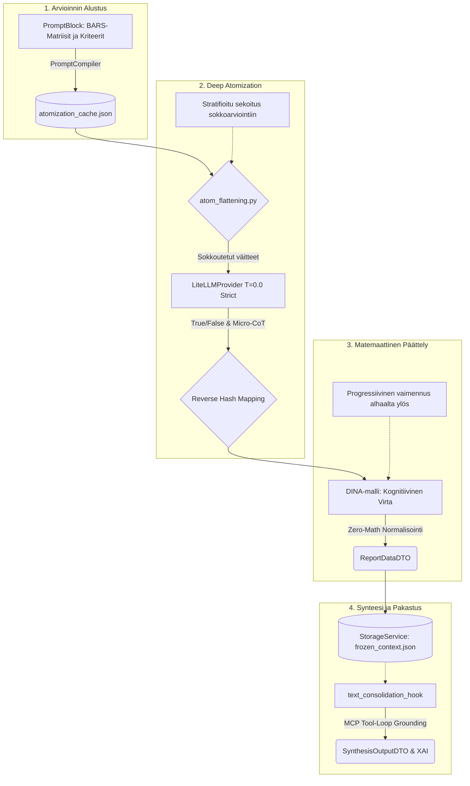


## 1. Miten Atomisoidut Väitteet Syntyvät?

Järjestelmän arviointi luottaa atomisaatioon, missä matriisin kriteerit on valmiiksi pureskeltu pienimpiin mahdollisiin logiikkayksiköihin.

**Dynaaminen Pydantic-mallinnus ja LLM-Seeding:**
Atomisoidut väitteet ja ohjeistukset luodaan järjestelmään dynaamisesti `PromptCompiler` ja `BlueprintTransformer` -moduulien avulla. Erityisen kriittistä on **Dynaaminen Seeding-Atomisaatio**: Kun järjestelmän paikallinen tietokanta alustetaan (`run_seed.py`), `PromptAtomizer` -tekoälymoduuli tarttuu väliin ja purkaa asiantuntijoiden määrittämät raskaat arviointikriteerit (`ai_description`) automaattisesti lennosta **absoluuttisesti 15 erilliseksi mikro-väitteeksi** (`micro_atoms`). Poikkeamat tästä (esim. 14 tai 16 väitettä) rikkovat järjestelmän osumien aggregaatiomatematiikan ja hylätään Fail-Fast -säännön mukaisesti. Tämä luo kantaan massiivisen tiheän, syvästi atomisoidun rakenteen. `atomization_cache.json` huolehtii lokaalista välimuistista tässä "Deep Atomization" -vaiheessa, eliminoiden tarpeettomat LLM-kutsut myöhemmissä seed-käynnistyksissä.

### Tasokohtainen Atomien Kertolasku (Dynamic Atom Aggregation)
Järjestelmän litteiden osumien kokonaismäärä (Denominator / Total Atoms) vaihtelee dynaamisesti arvosteluskaalojen (esim. T1 vs. T5) välillä. On arkkitehtuurinen välttämättömyys, että "läpikäytyjen atomisoitujen väitteiden määrä" ei ole kaikilla tasoilla sama.

Tämä vaihtelu on täysin deterministinen ja syntyy suoraan tietokantakonfiguraation ja Map-Reduce -lohkomisen tulosta:
1. **Vaatimustason kasvava ankaruus:** Kohdetta arvioitaessa, ylemmille huipputasoille (T4, T5 - Erinomainen) on matriisiin tyypillisesti konfiguroitu huomattavasti enemmän mikroväitteitä (`claims`) kuin perustasoille (T1, T2 - Heikko). Korkean laaduntason todistaminen vaatii kognitiivisessa mittauksessa laajemman joukon ehtojen samanaikaista täyttymistä.
2. **Kertautuminen Map-Reduce-palasissa:** Lopullinen sokeiden osumien maksimimäärä, jonka tekoäly tuottaa yhdelle Matrix-tasolle asynkronisen ajon aikana, on kaavalla: `Tasolle määritettyjen väitteiden lukumäärä x Map-Reduce -chunkkien lukumäärä`.

Jos esimerkiksi T1-tasolle on tietokannassa määritetty 3 ehtoa ja T5-tasolle 6 ehtoa, ja teksti aggregoituna pilkotaan 15 analyysipalaan, T1:stä syntyy lennosta 45 atomia (3x15) ja T5:stä 90 atomia (6x15) tekoälyn pureskeltavaksi. Luku heijastaa suoraan kyseisen tason kognitiivista vaativuustasoa arviointihetkellä.

## 2. Deep Atomization (Syvä Atomisaatio asynkronisessa ajossa)

Perinteinen LLM-pohjainen lausuntojen arviointi kykenee harvoin tuottamaan tiukkoja, luotettavia arvosanoja. Järjestelmä ratkaisee tämän pilkkomalla arvioinnin suoritusvaiheessa:

1. **Rajoittamaton Otanta ja Globaali Sokkosekoitus (Runtime Flattening):**
   Välttääksemme LLM:n rakenteellisen ennakkoasenteen (Hierarchy Bias), kaikki atomit viedään `atom_flattening.py` -hookkiin. Epic 23:n myötä olemme poistaneet keinotekoiset otantarajoittimet (kuten `STRATIFIED_3`), asettamalla globaaliksi vakioksi `SystemConcurrency.MATRIX_SAMPLING_LIMIT = 0` (ALL). Tämä mahdollistaa teoriassa rajattoman kysymysmassan sisäänluvun. Jos satunnaisotantaa poikkeuksellisesti vaaditaan (arvo > 0), haku ohjautuu deterministisesti:
   - **Skaalan sisäinen satunnaistus:** Otanta käyttää kryptografista siemenlukua muodossa `secure_seed = f"{state.execution_id}_{block.id}_scale_{scale.score}"`.
   - **Globaali sokkosekoitus:** Lopullinen atomilistan globaali sokkosekoitus purkaa data-alkiot täysin epäjärjestykseen sokeuttaen tekoälyn. Sekoitus sidotaan suorituksen globaaliin siemenlukuun `state.execution_id`.
   (Lähde: backend_v2/hooks/atom_flattening.py, funktio: process_matrix_flattening)
2. **Asynkroninen Map-Reduce Orchestration (ChunkingService):**
   Jotta satojen kysymysten yhtäaikainen sokea arviointi ei johtaisi Timeout/429 Rate Limit -kaatumisiin tai json-skeeman rikkoutumiseen LLM:n muistin loppuessa (Token Explosion), `LLMNodeStrategy` suorittaa Map-Reduce -operaation. Massiivinen kysymyslista luovutetaan `ChunkingService`-komponentille, joka pilkkoo sen turvallisiin Opaque Stripe ID -suojattuihin osiin (`SystemConcurrency.LLM_MAX_CHUNK_SIZE`-sääntöjen mukaisesti). Palikat ajetaan vahvasti rinnakkain `asyncio.TaskGroup` ja `Semaphore` -varmistuksin. Lopulta erilliset rakenteelliset vastaukset parsitaan takaisin yhtenäiseksi `List[FlattenedAtomResult]` -paketiksi täydellisellä 1:1 osumatarkkuudella.
3. **Eristetty Runtime AI (T=0.0):**
   LLM suorittaa kunkin Map-Reduce -lohkon arvioinnin tiukassa "Strict Mode" -tilassa, missä `LiteLLMProvider` vaatii koodilta absoluuttisesti TPM/RPM-rajoitusten määrittämistä. Jos Pydantic-validaatio epäonnistuu yksittäisessä chunkissa, arkkitehtuuri ei yritä "arvailla" fallback-arvoja (Zero-Fallback), vaan nostaa välittömästi RFC 7807 `AppException` -virheen (Fail-Fast).
4. **Paluu Rakennetilaan ja Käänteinen Hajautus (Reverse Hash Mapping):**
   Kun kaikki asynkroniset LLM-palat on suoritettu ja vastaukset (True/False & Micro-CoT -perustelut) on sulatettu massiiviseksi yhteiseksi Boolean-listaksi, asynkronisen moottorin on osattava palauttaa sokeat osumat takaisin alkuperäisiin matriiseihinsa ja vaatimustasoilleen. 
   Tämä ratkaistaan nojaten dynaamiseen **Ephemeral Runtime ID -mäppäykseen (In-Memory)**:
   - Aiemmin (V1) järjestelmä käytti lennosta generoitua MD5-tiivistettä tekstin perusteella ("Content-Addressable ID"). Tämä on nyt **ankarasti kielletty** (Epic 48: MD5 Hashery-Deprekaatio), sillä se aiheutti Hash Collision -haavoittuvuuksia samankaltaisilla kysymyksillä ja turhaa kryptografista kuormaa.
   - Pysyvien tietokanta-ID:iden generointi sadoille alikysymyksille paisuttaisi Seed-kantaa tarpeettomasti. Sen sijaan `atom_flattening.py` generoi suorituksen aikana jokaiselle litteytetylle väitteelle puhtaasti tilapäisen, sekventiaalisen tunnisteen (esim. `atom_1`, `atom_2` tai lyhyt ULID).
   - LLM palauttaa vastauksessaan yksinomaan tämän lyhyen ajonaikaisen tunnisteen yhdessä TRUEn tai FALSEn kanssa. Asynkroninen moottori käyttää O(1) muistihakemistoa (in-memory map) kohdistaakseen tulokset takaisin matriisin tasoille 100 % deterministisesti ilman törmäyksen vaaraa.

### Nollahypoteesi ja Antagonistinen Syyttäjä (Epic 27 Pydantic-puhdistus)
Jotta arviointi olisi matemaattisesti stabiili eikä altis tekoälyn mielistelylle (Sycophancy) tai ympäripyöreälle "Pydantic-skitsofrenialle" (tekoäly yrittää antaa pisteitä aiempien rakenteiden perusteella), kaikki arviointi nojaa **Nollahypoteesi-mandaattiin**. LLM toimi puhtaasti "Antagonistisena syyttäjänä":
* Jokaisen väittämän oletusarvo on aluksi `FALSE` ("Evaluate as FALSE").
* LLM kääntää atomin arvoksi `TRUE` ainoastaan, jos se kykenee poimimaan aineistosta eksplisiittisen, kiistattoman todisteen. 
* LLM:ltä on täysin riistetty kyky palauttaa itse valmiita numeerisia lukuja kuten jatkuvia kokonaisarvosanoja. Tämä logiikka (Zero-Math Payload) pienentää Map-Reduce -töiden palauttamia JSON-rakenteita kriittisesti, pysäyttäen raskaisiin Token-määriin liittyvät "Arq Worker Timeout" -ylikuormittumiset.

**DRY-Abstrahoitu Lainsäädäntö (`atom_flattening.py`):**
Koska arvioidut lauseet voivat nykymallissa olla täysin dynaamisesti luotuja `micro_atoms`-kysymyksiä (joita tekoäly luo tietokantaa seedatessa), itse asiantuntijatietokanta (`seed_data.json`) on puhdistettu toistuvista ja raskaista säännöistä. Nollahypoteesi on kovakoodattu puhtaasti taustajärjestelmän arviointiputkeen. Map-reduce -vaiheessa `atom_flattening.py` -hookki ohjelmallisesti "liimaa" absoluuttisen säännön (*ENFORCEMENT: Evaluate as FALSE immediately unless explicit, documented evidence is provided.*) jokaisen sokean mikro-atomin perään lennosta. Tämä arkkitehtuuri takaa, ettei LLM pääse "irti hihnasta" edes satojen uusien, lennosta generoitujen lyhyiden kysymysten keskellä.

### Laajennuskäsittely ja Pydantic-purku (Extensions & Evaluations)
Asynkronisen moottorin suorittama datan jäsennys tapahtuu Zero-Compromise Pydantic V2 -hengessä. 
* **Laajennusten Tiukennus (`output_extensions`):** `PromptBlock` (blk_) `output_extensions` (kuten `scoring_matrix`, `micro_atoms`) luetaan tiukasti Pydantic-olioihin ajon aikana. Järjestelmä ei salli "graceful degradation" -tilaa: mikäli tekoäly palauttaa viallista dataa näiden laajennusten osalta, dataa ei hiljaisesti ohiteta `.get()` -purkalla tai pudoteta pois, vaan rajapinta nostaa virheen heti.
* **Evaluations Dict Parsing:** Myös `evaluations`-vastausten jäsentely on ehdottoman tiukkaa. Järjestelmä ei hyväksy löysää parserointia. Pienikin poikkeama mallinnetuista `micro_atoms` -kentistä kaataa asynkronisen kerroksen (RFC 7807), eikä oletuksena yritetä tarjota "tyhjää dictiä `{}`" pelastamaan LLM:n rakenteellista hallusinaatiota. Tällä taataan, että jatkolaskenta ei koskaan operoi korruptoituneella aineistolla.

## 3. Zero-Trust Pydantic Validation & Anti-Laziness Mandate (Epic 42)

Evaluointiarkkitehtuuri on kytketty "Zero-Trust" -kehikon taakse torjumaan LLM-mallien yleisimmät ongelmat: laiskuus, keksitty asiantuntijapuhe ja suorat hallusinaatiot.

### A. Alphabetical Keys Hack (Micro-CoT)
Tekoäly pyrkii usein luomaan päätöksen (`is_true: bool`) ensin, ja vasta sitten keksimään sille perustelut ("Post-Hoc Rationalization"). Tämä estetään arkkitehtuurissa pakottamalla LLM Pydantic `AtomResponse`-skeeman avulla tuottamaan päättelyketju tarkassa aakkosjärjestyksessä. Skeeman avaimet on nimetty fyysisesti numeerisin etuliittein:
1. `step_1_evidence_type`: Tekoäly valitsee evidenssin tason (`EXPLICIT_QUOTE`, `IMPLIED_INTENT`, `NO_EVIDENCE`).
2. `step_2_quote`: Suora, muokkaamaton lainaus materiaalista.
3. `step_3_implicit_justification`: Implisiittinen asiantuntijapäättely, jos suoraa lainausta ei ole.
4. `step_4_reasoning`: Vapaa asiantuntijaharkinta.
5. `step_5_boolean`: Vasta viimeisenä lopullinen päätös `is_true`.

Tämä "Alphabetical Keys" -mekanismi pakottaa automaattisen Attention-mekanismin lukemaan omat perustelunsa (step 1-4) ennen arvion (step 5) generoimista, mikä tutkitusti eliminoi laiskan oikaisun ja vahvistaa determinismiä.

### B. Anti-Laziness Pydantic Validations
Kun LLM palauttaa vastauksen, Pydantic V2 `@model_validator(mode='after')` tekee ankaran ristitarkastuksen suoritetun työnkulun ankaruustason (`strictness_level`) ja `validation_context` -objektin avulla:
* **Explicit Quote Check:** Jos `step_1_evidence_type` on `EXPLICIT_QUOTE`, järjestelmä vaatii, että `step_2_quote` on täytetty. Muutoin se hylkää vastauksen.
* **Physical Word-Count Blocker:** Jos näyttö perustuu implisiittiseen päättelyyn (`IMPLIED_INTENT`), järjestelmä estää "konsulttipuheen" asettamalla fyysisen sanamäärärajan (esim. vähintään 20 sanaa). Jos selitys on laiska (esim. "Perustuu rivien välistä luettuun dataan"), Pydantic nostaa `ValueError` -virheen.
* **Strictness Threshold (>= 70):** Mikäli työnkulun käyttäjä on asettanut ankaruustasoksi vähintään 70, `IMPLIED_INTENT` hylätään automaattisesti kokonaan. Tällöin vain `EXPLICIT_QUOTE` tai `NO_EVIDENCE` hyväksytään järjestelmään, mikä muuttaa koko tekoälyn laskennan armottoman faktapohjaiseksi auditointikoneeksi ilman tulkinnanvaraisuuksia.

## 4. Pisteytyslogiikka: Soft Scoring V3 (Lerp, Sigmoid, MAD) ja Kireystasot

Epic 47 myötä järjestelmä on siirtynyt kovan "Square Root Dampening" ja ehdottomien kynnysarvojen ajasta kohti **Soft Scoring V3** -arkkitehtuuria. Tämä uusi arviointimoottori eliminoi luonnottomat matemaattiset jyrkänteet (cliff effects) ja mahdollistaa joustavan mutta deterministisen kognitiivisen arvioinnin soveltamalla lineaarista interpolaatiota (Lerp), loogisia Sigmoid-käyriä ja MAD-pohjaista poikkeamien torjuntaa.

### Forensic Sovereignty ja Kaksinkertainen Pisteytys (Double Scoring)
Epic 47 irrotti matemaattisen pisteytyksen lopullisesti sidotusta suoritusvaiheesta (Execution) käyttäen "Forensic Sovereignty" -arkkitehtuuria. Vaikka tavoitteena on "Decoupling" (eriytetty pisteytys), järjestelmä suorittaa matemaattisen laskennan tietoisesti kahteen kertaan:

1. **DAG-vaiheen Baseline-laskenta (Historiallinen sormenjälki):** 
   Itse työnkulun ajon (Execution) yhteydessä `matrix_scoring_hook` tallentaa sokeat faktat (`level_breakdown`) ja suorittaa niille matemaattisen laskennan työnkulun sen hetkisellä *oletuskireydellä*. Tämä luo tietokantaan (`execution.step_states`) ikuisen "Baseline"-tuloksen. Tämän ainoa arkkitehtoninen tarkoitus on luoda ja säilöä rikas **XAI-loki (Explainable AI)**, joka sisältää tarkan matemaattisen selityksen siitä, miten tekoäly tuotti arvosanan reaaliajassa (esim. "Osuma-aste 0% -> Sovelletaan liukuvaa rangaistusta 0.85").
2. **Virtuaaliset Järjestelmäaskeleet ja Worker-synteesi (SSOT):**
   Kun lopullinen PDF- tai käyttöliittymäraportti luodaan, Arq Worker käynnistää asynkronisen virtuaaliaskeleen (esim. `sys_render_default`). Worker *ohittaa täysin* aiemmat Baseline-pisteet ja XAI-lokin. Se lukee vain muuttumattomat faktat (`level_breakdown`) ja suorittaa täysin uuden matemaattisen laskennan käyttäjän valitseman uuden `OutputProfile` -konfiguraation kireystasolla. Tämän uuden ajon luomaa XAI-lokia ei enää tallenneta, sillä loppukäyttäjälle tuotetaan vain matemaattisesti puhtaat, uuteen profiiliin perustuvat loppupisteet (Scorecard).

Tämä arkkitehtoninen "poikkeus" takaa, että tietokantaan ei synny datapaisumusta miljoonista eri XAI-lokeista jokaisen käyttäjän tekemän PDF-tulosteen yhteydessä, mutta säilyttää silti alkuperäisen auditoitavan matemaattisen jäljen devaajille. SSOT (Single Source of Truth) loppukäyttäjän esityskerroksessa on aina Workerin tuottama tuloste, joten arvot eivät voi mennä ristiin.

### Matemaattiset Moottorit (Mathematical Engines)

Arviointijärjestelmä sisältää neljä täysin Zero-Math UI -pariteettia noudattavaa laskentamoottoria, joiden toimintaa ohjaa dynaaminen **StrictnessConfig** (Kireystaso 0-100). Mitä korkeampi kireystaso, sitä vähemmän anteeksiantoa (forgiveness) järjestelmä antaa.

1. **Syväarvostelu (Progressive Dampening - DINA V3):** 
   Tämä moottori hyödyntää lineaarista interpolaatiota (Lerp) lieventääkseen alempien kognitiivisten tasojen puutteita (`effective_hit_rate = base_forgiveness + (hit_rate * (1.0 - base_forgiveness))`). Vaimennukseen sovelletaan kireystason perusteella dynaamista eksponenttia, jolloin täydellinenkään ylemmän tason suoritus ei voi kompensoida täysin murentunutta perustaa, mutta pisteet eivät romahda absoluuttisesti nollaan yksittäisen virheen takia.
2. **Koearvostelu (Soft Waterfall - Guttman V3):** 
   Tiukka compliance-moottori. Jos tavoitekynnys (threshold) alitetaan, järjestelmä ei enää lukitse koko pisteytystä "rikkinäisiin tikapuihin", vaan laskee vajauksen (`shortfall`) ja soveltaa **liukuvaa rangaistuskerrointa** (sliding penalty multiplier) kaikkiin myöhempiin tasoihin kaskadoituvasti.
3. **Painotettu Keskiarvo (Sigmoid Scaling):** 
   Laskee matriisin tason perusteella painotetun suhdeluvun ja skaalaa tuloksen ulos **Sigmoid (logistic) -käyrällä** (`raw_sigmoid = 1 / (1 + math.exp(-steepness * (hit_rate - midpoint)))`). Kireystaso liikuttaa Sigmoidin keskipistettä, jolloin tiukempi kireystaso vaatii eksponentiaalisesti puhtaampaa osumaprosenttia korkean arvosanan saamiseksi. Järjestelmä suorittaa täyden matemaattisen normalisoinnin absoluuttisten ääripäiden väliin.
4. **Lineaarinen Keskiarvo (MAD Outlier Rejection):** 
   Puhtaassa keskiarvossa järjestelmä on alttiimpi datapisteille, jotka heikentävät muuten vahvaa profiilia. Tämä moottori tunnistaa tilastolliset anomaliat hyödyntämällä **Median Absolute Deviation (MAD)** -menetelmää. Jos yksittäinen taso poikkeaa merkittävästi aggregaatin mediaanista (`hit_rate < median - 3.0 * MAD` ja `hit_rate < 0.30`), tason painoarvoa alennetaan (0.25x), suojellen näin kokonaisarvosanaa perusteettomilta romahduksilta.

### Kireystason Kalibrointi (Strictness Level 0–100)
Matemaattiset moottorit ovat armottomia algoritmeja, mutta tekoälyn kykyä "löytää" osumia säädetään dynaamisesti Kireystasolla. Kireystaso ohjaa myös Pydantic V2 -kerroksen validointia.

* **0–40 (Joustava / Flexible):** Tekoäly saa lukea rivien välistä (`IMPLIED_INTENT`). Malli löytää osumia helposti ja anteeksianto on korkea (Lerp forgiveness 1.0 - 0.6).
* **50 (Oletus / Balanced):** Objektiivinen kultainen keskitie. Vaatii usein suoraa lainausta, mutta sallii implisiittisen perustelun laadukkaalla CoT-ketjulla. Sigmoidin keskipiste on matemaattisessa ytimessä.
* **70–89 (Tiukka / Strict):** Pydantic hylkää implisiittiset tulkinnat. Vain eksakti lainaus (`EXPLICIT_QUOTE`) kelpuutetaan. Kognitiiviset vaimennukset ovat jyrkkiä ja anteeksianto on lähellä nollaa.
* **90–100 (Absoluuttinen / Absolute):** Nollatoleranssi virheille. Aktivoi `ANTI_SYCOPHANCY_MANDATE` -tilan.

### Empiirinen Esimerkki: Yhden Datan 4 Vaihdetta (The 4 Gears)
Järjestelmän arkkitehtoninen vahvuus on SSOT (Single Source of Truth) -mallissa, jossa tekoäly lukee dokumentin vain kerran ja tuottaa raa'an asiantuntijadatan (hits/total). Tämän jälkeen matematiikka ja kireystaso ("linssi") ratkaisevat lopullisen tuomion ja XAI-synteesin sävyn täysin dynaamisesti samasta datasta. Toukokuun 2026 testiajo (Sitra Supermegatrendit) todisti tämän:

1. **Koearvostelu + Ehdottomuus 100 ("Portinvartija"):** Fail-fast -logiikka karsi heikot tasot pois armotta. Arvosana romahti (44.40). Synteesi-LLM luki heikon arvosanan ja omaksui välittömästi armottoman auditoijan roolin, nostaen esiin keksityt päivämäärät ja hauraan logiikan.
2. **Syväarvostelu + Ehdottomuus 100 ("Ketjunheikkous"):** DINA-vaimennus etsi loogisen ketjun heikoimman lenkin ja kertoi koko rakennelman arvon lähelle nollaa (Arvosana 7.00). Tuloksena oli absoluuttinen hylkäys ja säälimätön Johdon Yhteenveto.
3. **Koearvostelu + Täysi Joustavuus 0 ("Aivoriihi"):** Läpäisykynnys laski pohjamutiin. Sama raakadata (jopa <50% osumia osassa matriiseja) riitti täydelliseen läpäisyyn (Arvosana 100.00). Synteesi-LLM sokeutui matematiikalle, antoi faktavirheet anteeksi ja kirjoitti puhtaan ylistävän valmennuspuheen.
4. **Painotettu Keskiarvo + Tasapainoinen 50 ("Kultainen Keskitie"):** Perustasojen osumia painotettiin enemmän, ja kireystaso poisti ääri-ilmiöt (Arvosana 64.20). Synteesi-LLM omaksui rakentavan konsultin roolin: se tunnusti vahvuudet, mutta käytti faktavirhettä (keksitty päivämäärä) *pedagogisena esimerkkinä* oppimiselle, ei rangaistusvälineenä.

Tämä todistaa, että **Synteesi-LLM reagoi dynaamisesti jälkikäteen laskettuun matemaattiseen arvosanaan**. Matematiikka ohjaa tekoälyn asennetta.

### Rangaistusmekanismit (Penalty Logic)

Järjestelmä alentaa kognitiivisen arviointimoottorin määrittämää perusarvosanaa erilaisten rangaistusten (Penalties) avulla. Rangaistukset toteutuvat tiukasti seuraavien sääntöjen ja metodien mukaisesti:

- **Turvallisuusuhat (Security Threat):** Järjestelmä tarkistaa suorituksen Guard-asteelta (Security Check), onko turvallisuusuhka havaittu (`threat_detected`). (Lähde: backend_v2/hooks/scoring.py, funktio: _extract_guard_flag)
  - Jos uhka on havaittu ja asetuksissa määritetty `scoring_security_penalty` on suurempi kuin nolla, kyseinen rangaistusprosentti (`p_val`) lisätään kokonaisrangaistuskertoimeen (`total_penalty_factor`). (Lähde: backend_v2/hooks/scoring.py, funktio: apply_scoring_logic_hook)

- **Jälkikäteisrationalisointi (Post-Hoc Rationalization):** Järjestelmä tarkastaa Falsifier- tai Panel-moduulin tuottamasta datasta `post_hoc_rationalization` -lipun, jolla testataan argumentoinnin pitävyyttä. (Lähde: backend_v2/hooks/scoring.py, funktio: _calculate_falsifier_penalty)
  - Mikäli lippu on aktiivinen ja asetuksissa määritetty `scoring_post_hoc_penalty` on suurempi kuin nolla, kyseinen rangaistusprosentti (`p_val`) lisätään kokonaisrangaistuskertoimeen (`total_penalty_factor`). (Lähde: backend_v2/hooks/scoring.py, funktio: apply_scoring_logic_hook)

- **Kaksinkertaisen rangaistuksen esto (Double Jeopardy Cap):** Kaikki yllä asetetut rangaistukset (Security, Post-Hoc) summataan yhteen ja rajataan maksimivähennykseen (`ScoringCalibrationThresholds.PENALTY_CAP`, esim. 25%). Vasta tämän jälkeen loppuarvosanaa pienennetään yhdistetyllä vaimennuskertoimella `(1.0 - effective_penalty)`. (Lähde: backend_v2/hooks/scoring.py, funktio: apply_scoring_logic_hook)

- **Passiivisuusrangaistus (Passivity Penalty):** Tuomaristomoduulin ("Judge" tai V2 Matriisi) tuottamia arvosanoja analysoidaan puutteellisten laatutasojen varalta. Jos minkä tahansa ulottuvuuden (dimension) saama arvosana on yhtä suuri tai pienempi kuin määritetty minimiarvo `scale_min` (oletus V2 matriiseille on 1.0), passiivisuusrangaistus aktivoituu. (Lähde: backend_v2/hooks/scoring.py, funktio: enforce_passivity_penalty_hook)
  - Rangaistuksen aktivoituessa, kokonaisarvosanaa (tai kyseisen matriisi-dimension osaarvosanaa) lasketaan kertomalla se asetusarvolla `multiplier` (`scoring_passivity_multiplier`). (Lähde: backend_v2/hooks/scoring.py, funktio: enforce_passivity_penalty_hook)
  - Puristussääntö (Safety Clamp): Mikäli laskettu uusi arvosana vaimennetaan niin pieneksi, että se alittaa sallitun minimiarvon `scale_min`, järjestelmä lukitsee eli puristaa tuloksen ehdottomaan alarajaan `new_score = scale_min`. (Lähde: backend_v2/hooks/scoring.py, funktio: enforce_passivity_penalty_hook)

#### Scoring Hook Pipelines (Mermaid Visualisointi)

Alla oleva vuokaavio konkretisoi edellä kuvatun matemaattisen Rangaistus- ja Normalisointilogiikan askel askeleelta, varmistaen Flutterin täydellisen Zero-Math pariteetin:

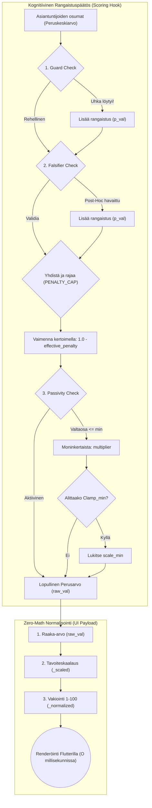

## 4. eXplainable AI (XAI), Audit Trail ja Agentic Grounding

Laskentamoottori hyödyntää MCP (Model Context Protocol) tool-calling -arkkitehtuuria yhdistääkseen laskut puhtaaksi, todistettavaksi ihmiskieliseksi XAI-tulkinnaksi.

**Kaksivaiheinen Agenttiarkkitehtuuri (Two-Pass Agentic Hook):**
Järjestelmä käyttää `text_consolidation_hook` -moduulia, joka suorittaa synteesin kahdessa vaiheessa:
1. **Tutkiva vaihe (`execute_tool_loop`):** MCP Tool-calling -ominaisuuksia hyödyntävä "ajattelu"-luuppi tekee tiedonhankintaa ja rakentaa Micro-CoT -päättelyketjut dynaamisesti luettuaan dokumentit/verkon asiasanoja.
2. **Rakenteistettu vaihe (Structured Output):** Vain onnistuneen tool-loopin jälkeen data pakotetaan tiukkaan `SynthesisOutputDTO` / `XAIOutputDTO` -skeemaan finalisointia varten.

**XAIOutputDTO -rakenne (Strictly Typed):**
Tekoälyn rakenteistettu XAI-synteesi pakotetaan seuraavaan Pydantic-malliin, jonka jokainen kenttä on pakollinen yhtenäisen laadun takaamiseksi:

- `executive_summary`: Korkean tason tiivistelmä (High-level summary).
- `verified_facts`: Synteesi todennetuista faktoista (Synthesis of facts).
- `cognitive_behavior`: Synteesi Profiler- ja Falsifier-moduulien löydöksistä (Synthesis of Profiler and Falsifier findings).
- `causal_chain`: Synteesi syy-seuraussuhteista ja Logician-moduulin havainnoista (Synthesis of Causal and Logician findings).
- `analysis_strengths`: Tunnistetut vahvuudet (Strengths identified).
- `analysis_weaknesses`: Tunnistetut heikkoudet (Weaknesses identified).
- `analysis_opportunities`: Tunnistetut mahdollisuudet (Opportunities identified).
- `analysis_recommendations`: Suositukset toimenpiteille (Recommendations).
- `final_verdict`: Lopullinen päätelmä (Final conclusion).
- `confidence_score`: Luottamusluku (0.0-1.0).

*Pydantic-validointi:* Kenttien oikeellisuus varmistetaan Pydanticin `@field_validator`-metodeilla (esim. `validate_non_empty`), jotka estävät ehdottomasti tyhjien tai puhtaasti välilyöntejä sisältävien merkkijonojen ohittamisen järjestelmään vikatilanteissa.
(Lähde: backend_v2/models/domain/xai.py, luokka: XAIOutputDTO)

Jokaista lasketun tuloksen taustaa varten luodaan ihmiskieliset lokit ja ne tallennetaan `frozen_context.json` -tiedostoon. Nämä perustelut ovat Native English Generation -säännön alaisia, minimoiden satunnaisen harhautumisen lokituksessa ja antaen käyttäjälle absoluuttista todistettavuutta tulosten synnystä.

## 5. UI Rendering ja Zero-Math Pariteetti

Graafinen käyttöliittymä (Flutter Client) on alistettu tiukkaan **Zero-Math sääntöön** koko tuotantoketjun pituudelta ottamalla käyttöön vikasietoinen "De-Generator" pattern.

Kaikki pistelaskennan desimaalit, normalisoinnit sekä tasojen kynnysarvojen suhteutus kootaan pelkästään Pythonin backendillä (esim. `ReportDataDTO` muotoon). Frontend olettaa aina saavansa valmiiksi arvoiltaan yhdenmukaistettua dataa, piirtäen graafiset hajontakuviot (esim. 3D Illusion Detector matrix) suoraan valmiiden matemaattisten tulosten ilmentyminä ohittaen tarpeen asiakaspohjaiselle matemaattiselle logiikalle kokonaan. 

**Backendin Datan Normalisointiprosessi (Valmistelu UI:ta varten):**
Data ratkaistaan kolmiportaisella rakenteella `normalize_matrix_scores_hook` -funktion sisällä:
1. **Alkuperäinen arvo (`raw_val`):** AI:n laskema alkuperäistulos (esim. DINA-vaimennuksen suora liukuluku).
2. **Suhteutettu arvo (`_scaled`):** Kustomoituun tavoiteskaalaan (esim. matriisin oma skaala) matemaattisesti suhteutettu lopullinen arvo.
3. **Normalisoitu arvo (`_normalized`):** Yhteismitallinen 1–100 vakioitu arvo (esim. 100-jakoinen prosenttiskaala), joka mahdollistaa jopa erilaisten alkuperäisskaalojen saumattoman graafisen vertailun.

*Zero-Math Mandaatti:* Tämä hook-arkkitehtuuri varmistaa sen, ettei UI:n (Flutter) tarvitse ikinä suorittaa liukulukulaskentaa (Floating point math). Backend tallentaa ja injektoi valmiiksi lasketut avaimet, kuten `[pb_id]_scaled` ja `[pb_id]_normalized`, lennosta suoraan valmiiseen payload-sanakirjaan. Jos Pydantic API rajoittaa ulostuloa tai data puuttuu, backend nostaa puhtaan `AppException` RFC 7807 Payloadin, jonka Flutter UI renderöi virhekomponenttina yhdellä askeleella.
(Lähde: backend_v2/hooks/scoring.py, funktio: normalize_matrix_scores_hook)

## 6. Tietorakenteet ja Tallennus (Storage & Persistence)

Arviointiarkkitehtuurin tilanhallinta ja datan tallennus on "Event Sourced" -yhteensopiva.

### A. Atomisoidut Väittämät (Konfiguraatio / Siemendata)
Atomit (`micro_atoms`) luodaan järjestelmän siemennysvaiheessa. Pysyvä siemendata luetaan hakemistosta `backend_v2/seed/`. Välimuistitiedosto `backend_v2/seed/atomization_cache.json` estää LLM:ää atomisoimasta vanhoja kriteereitä jatkuvasti uudelleen, taaten nopeat siemennysajot (`run_seed.py local`).

### B. Raaka-arvioinnit ja True/False -tulokset (Suoritustila)
Tekoälyn tekemä sokea atomien arviointityö tallentuu prosessidatana paikallisesti kehityksessä `data/db_v2.json` -tiedoston `executions`-taulukkoon. Koska säilytämme raaan lokin (Execution Trace), jokaista `True/False` arviota (Micro-CoT) voidaan analysoida audit-loopissa jälkikäteen ilman toistoja.

### C. Lopulliset arvosanat ja XAI-perustelut (Output-tila)
Itse matemaattinen päättely (DINA-laskenta) muodostetaan vasta aivan lopuksi `scoring.py` -hookissa.
Lopulliset rakenteet paketoidaan ja pakastetaan `StorageService` (FileDriver) -rajapinnan läpi polkuun `data/files/executions/exe_{id}/frozen_context.json`. Asiakassovellus kykenee lukemaan valmiin UI-datan suoraan FileDriverin yli nanosekunneissa suorittamatta raskaita laskelmia, täyttäen Zero-Math säännön ja pitäen järjestelmän Opaque Stripe ID relaatiot puhtaina ja rikkoutumattomina.

### D. Matemaattinen Projektio ja In-Memory Renderöinti (Zero-Mutation Protocol)
Kun järjestelmä generoi lopullisia PDF-raportteja (`worker.py` / `generate_pdf_task`), se joutuu laskemaan tarkkoja dynaamisia matematiikka-arvoja (kuten `normalized_score` tavoiteskaalausta varten uudella kireystasolla). Aiemmin nämä arvot ylikirjoitettiin lennossa tapahtumalokiin, mutta tämä rikkoi "Append-Only" -periaatetta.

Nykymallissa kaikki dynaaminen uudelleenlaskenta on puhdas **In-Memory Projektio (Read-Only)**, mikä ratkaisee Append-Only ristiriidan:
1. **Historiallinen Koskemattomuus:** Alkuperäinen tietokannan `execution_trace` (joka sisältää Baseline-pisteet ja tekoälyn alkuperäiset perustelut) on ehdottoman lukittu ("Append-Only"). Datan ylikirjoittaminen (in-place mutation) on kielletty, jotta alkuperäinen historiallinen sormenjälki (Forensic Sovereignty) ei tuhoudu.
2. **Lennosta Lasketut DTO:t:** `BlueprintTransformer` lukee muuttumattomat "raakafaktat" (`evaluated_atoms`) ja suorittaa matemaattisen laskennan lennosta uuden Output Profilen kireystason läpi, luoden `ReportDataDTO`:n. Näitä lennosta laskettuja `normalized_score` -arvoja ei koskaan tallenneta takaisin tapahtumalokiin.
3. **Caching Eristys:** Vain raskas tekoälyn tuottama Markdown-synteesi välimuistitetaan tietokantaan, mutta sekin tallennetaan erilliseen `profile_syntheses` -sanakirjaan itse `ExecutionRecord` -juuritasolla, ei koskaan muokkaamalla tai ylikirjoittamalla menneitä `execution_trace` tapahtumia.

## 7. FinOps ja Token-hallinnan Arkkitehtuuri (Rate-Limit Resurssien Suojaus)

Kognitiivinen arviointimoottori käsittelee valtavia datamassoja (satoja atomeja per matriisi kerrottuna kymmenillä vaiheilla). Jotta LLM-malleille generoitava konteksti ei paisuisi liikaa ja laukaisisi API-toimittajien (esim. Vertex AI) `429 Resource Exhausted / Rate Limit` -rajoituksia, järjestelmässä on sisäänrakennettu älykäs **FinOps-kontekstikompressio**.

Kompressio suoritetaan rekursiivisen avaintenpoiston (stripping) avulla juuri ennen datan viemistä seuraavalle tekoälysolmulle. Toimintalogiikka noudattaa ehdottomasti mandaattia: *"Atomisoiduista kentistä LLM-kontekstiin välitetään vain true/false, mutta matriiseista ja prompteista välitetään rikkaat tekstikentät"*.

**Mekanismin ytimen toiminta:**
1. **Atomi-tason Kompressio:** Järjestelmä siivoaa dynaamisista ajotiloista LLM-solmulle lukukelvottomat ja hyödyttömät metadatat (esim. MD5 `atom_id`) sekä satojen kysymysten raskaat sanalliset Micro-CoT -perustelut (`reasoning`, `quote`). Myös raa'at sekoitetut kysymysmassat (`shuffled_atoms`) hävitetään varhaisilta askeleilta. `evaluations`-lista tiivistetään näin sadoista tuhansista merkeistä puhtaaksi ja kevyeksi totuusarvolistaksi (esim. `[True, False, True, ...]`).
2. **Matriisi-tason Syväanalyysin Säilytys:** Aggressiivisesta token-leikkurista huolimatta kaikki matriisien asiantuntijasolmujen (kuten Profiler, Falsifier) tuottamat laajat holistiset synteesit (esim. `reasoning_trace`, `evaluation_notes`, `step_3_logical_friction`) integroidaan koskemattomana. 

Tällä arkkitehtuurilla alemman tason "Zero-Trust" askeleet tuottavat valtavasti kovaa dataa, mutta huipulla toimiva XAI Reporter näkee vain datasta puhdistetun kokonaisanalyysin, jolloin se pystyy laatimaan täydellisen loppuraportin ilman token-tukehtumisen riskiä. (Lähde: `backend_v2/services/orchestrator/strategies/llm.py`)

## 8. Rakenteellinen Resilienssi (Self-Healing Deprekaatio ja Pydantic-Canonicalization)

Aiemmin järjestelmässä käytettiin "Self-Healing Citations" -heuristiikkaa (purkkaviritys, jossa `model_validator(mode="before")` yritti arvata ja korjata LLM:n lyhentämiä viitteitä lennosta regex-säännöillä). Tämä rikkoi arkkitehtuurin absoluuttista "Fail-Fast" ja "Zero-Trust" -periaatetta piilottamalla virheet, ja se on nyt **ankarasti kielletty ja poistettu koodista** (Epic 48).

**Nykymalli (The CPU Trap Resolution):**
Sen sijaan, että turvauduttaisiin epävarmaan regex-korjailuun tai siirrettäisiin validointia asynkronisiin Arq-jonoihin ("The CPU Trap"), lainausten ja viitteiden validointi tapahtuu 100 % synkronisesti Pydantic V2:n natiivissa C/Rust-kerroksessa (`@model_validator(mode='after')`). 

1. **Deterministinen Normalisointi (Canonicalization):** Molemmat merkkijonot (alkuperäinen lähde ja LLM:n tuottama lainaus) stripataan erikoismerkeistä ja välilyönneistä puhtaalla O(N) algoritmillä erittäin nopeasti pääsäikeessä.
2. **Exact Match tai Fail-Fast:** Jos normalisoitu LLM-lainaus ei vastaa lähdettä tismalleen, Pydantic heittää välittömästi `ValidationError`in.
3. **Error Feedback Loop ja DLQ:** Arkkitehtuuri ei yritä enää hiljaisesti "parantaa" virhettä. Epäonnistuminen laukaisee automaattisen Error Feedback Loopin (LLM yrittää itse korjata virheensä `<ERROR>` -syötteen avulla). Jos atomi on pysyvästi rikki, se siirretään pragmallisesti DLQ-jonoon (Dead Letter Queue), jotta työnkulku etenee maaliin ilman ohjelman kaatumista.

<br><hr>

➡️ **Seuraavaksi:** Nyt kun matematiikka ja pisteytys on valmis, backendin työ on ohi. Siirry lukemaan [07_desktop_first_flutter.md](./07_desktop_first_flutter.md), joka kuvaa miten käyttöliittymä ottaa tämän kaiken vastaan Zero-Math UI -periaatteella.
# 06: Flutter Frontend (V5.2 Desktop-First)

Cognitive Quorum -käyttöliittymä (client_app_v2) on rakennettu Flutterilla täysin **Desktop-First** (PC/Ultrawide) edellä. Kaikki logiikka on hajautettu tiukasti Riverpod 3.0:aan ja asynkronisiin Isolate-säikeisiin (Main Thread Jank Prevention). 

Yksi suurimmista arkkitehtuurisista paradigmoista on **SDUI (Server-Driven UI)** eli "**Zero-Math UI**": Käyttöliittymä tai Flutter-laitteen CPU ei saa koskaan laskea matemaattisia keskiarvoja tekoälyn datasta, vertailla numeerisia kynnyksiä saati päätellä teemavärien vaihtumisia. Tämä luottaa puhtaasti Backendin palauttamiin esipureskeltuihin `ReportLayoutDTO` -malleihin (Backend-For-Frontend konsepti). Kaikki kompleksinen esitystieto, kuten `MatrixObservabilityAccordion`, on täysin SDUI-ohjattua.

## 1. Desktop-First Layout ja Ikkunointi

Järjestelmä perustuu täyteen IDE-kankaaseen (Integrated Development Environment).

1. **Reititys ja Macro-Breakpoints:** Koodissa ei käytetä lokaalia `MediaQuery` purkkaa vaan joustavia Rust-Impeller Flexbox/Expanded sääntöjä ja pakotettuja 'Macro-Breakpoints' luokkia. Yli 1200dp näytöillä komponentit asettuvat Three-Pane Row -rakenteeseen (SideBar | MasterList | Canvas). Kapeammissa 800-1199dp ikkunoissa siirrytään Two-Pane malliin jne. Tämä estää nk. "MediaQuery Thrashing" ilmiön Ikkunan skaalauksessa.
2. **Infinite 2D Canvas:** Asiantuntijajärjestelmän työnkulkujen (DAG) tai matriisien konfigurointi hylkää yksittäiset listamuuttujat. **SystemInspector** luo `InteractiveViewer`in päälle äärettömän ruutupaperimaisen editorin, missä kaikki työnkulun Pydantic-solmut liikkuvat visuaalisesti x/y -avaruudessa. Objektin painaminen aukaisee kyseisten parametrien asetusnäkymän sivupalkkiin irroittamatta silmää verkon kokonaisuudesta.
3. **Horizontal Overflow Prevention:** Dynaaminen teksti (`Text`) ja pudotusvalikot (`DropdownButtonFormField`) pitää aina asettaa `Expanded` (tai vastaavan joustavan) wrapperin sisään. Tekstille asetetaan ehdottomasti `overflow: TextOverflow.ellipsis` ja pudotusvalikoille `isExpanded: true`. Tämä pakottaa Impellerin laskemaan typistyksen rajat ennen renderöintiä ja estää kohtalokkaat 'RenderFlex overflowed' -kaatumiset (kelta-mustat varoitusnauhat).
4. **Desktop Pro Tool Interaction:** Koska kyseessä on Desktop-luokan Pro-IDE, kaikki interaktiiviset elementit vaativat natiivin työpöytäkokemuksen. Paljaan `GestureDetector`in käyttö on kielletty ilman seuraavia: hiiren Hover-tilat (`SystemMouseCursors.click`), näppäimistöfokus (`FocusNode`) ja pikanäppäintuki (`Shortcuts`).
5. **Design Token Absolute Rule:** "Zero-Math" -säännön ohella kaikki "taikanumerot" ja kovakoodatut värit (esim. `EdgeInsets.all(16)` tai `Colors.blue`) ovat ehdottomasti kiellettyjä. Käyttöliittymän on nojattava 100% teemattuihin tokeneihin (esim. `AppSpacing.p16` tai `Theme.of(context).textTheme`).

## 2. Koodin Pariteetti ja Freezed-turva (Fail-Fast)

Frontend-mallien (Data Transfer Objects) pitää jatkuvasti vastata yksi-yhteen (`1:1`) Python Backendin uusia Pydantic V2 -muutoksia.
* **The De-Generator Mandate (SafeCast & Optimistic Updates):** Admin Studion dynaamiset työnkulku- ja DAG-konfiguraatiot käsitellään tiukalla koodigeneraatiolla (`@freezed`) ja `disallow_unrecognized_keys: true` -rajoitteella. Järjestelmä soveltaa tiukkaa **SafeCast**-defensiivistä purkua estääkseen tuntemattomien avaimien kaatamasta UI:ta hiljaisesti. Yhdistettynä Optimistic Riverpod -päivityksiin tämä De-Generator -arkkitehtuuri varmistaa, että massiivisia dynaamisia puita voidaan muokata lennossa sulavasti ilman käyttöliittymän jäätymistä tai korruptoituneen datan lataamista muistiin.
* **Pääsäikeen suojaus (Isolates Main Thread Jank Prevent):** Raskaiden Backendin tulostamien raporttien (kymmenien tuhansien rivien) JSON-purku (Deseriliazation) ei saa missään tilanteessa vaikuttaa ikkunan päivitysnopeuteen (60FPS Frame Drop). Se on irroitettu pääsäikeestä omaan Background Isolateen käyttämällä rutiinia: `await Isolate.run(() => jsonDecode(chunk));`
* **Freezed When Ban & Natiivi Switch:** Vanhat `.when()` ja `.map()` funktiot on kielletty. Ne korvataan aina Dart 3:n natiiveilla `switch`-lausekkeilla (pattern matching / destructuring), mikä mahdollistaa kevyemmän ja tyyppiturvallisemman tilojen purkamisen.
* **Centralized Frontend Enums & No Raw String Mappings:** Backendin Pydantic-mallien Literal/String-kenttiä ei saa koskaan validoida IF-lauseilla tai manuaalisella `switch`:llä käyttöliittymässä. Kaikki järjestelmätason ja mallien kentät on keskitettävä Enum-luokiksi käyttäen yksittäisille kentille `@JsonValue()`-annotaatioita sijaintiin `core/models/enums.dart`. Tuntemattomat stringit saavat ja niiden pitää rikkoa parseri HETI, jotta vika saadaan kiinni AppExceptionBoundaryssä.
  * **Strictness Selector (Epic 42):** Käyttöliittymässä esitettävä semanttinen ankaruustaso (esim. Leniency, Balanced, Absolute Strictness) pakotetaan käännösvaiheessa absoluuttisiksi API-kokonaisluvuiksi (0, 15, 50, 85, 100). Backendin palauttama `EvidenceType` (`EXPLICIT_QUOTE`, `IMPLIED_INTENT`, `NO_EVIDENCE`) mäppäytyy `@JsonEnum()` avulla suoraan visuaalisiin ikoneihin (esim. checkmark vs. warning), estäen hallusinaatioriskit SDUI-tasolla.
* **No-String Mandate:** V14.4 standardin mukaisesti raw-merkkijonojen käyttö UI-koodissa on ehdottomasti kielletty. Kaikki käyttöliittymän tekstit, kuten virheilmoitukset, sijaitsevat yksinomaan `.arb`-tiedostoissa (esim. `AppLocalizations.of(context)!.errorUnknown`).

## 3. Riverpod 3.0, Hookit ja Dynaaminen Reititys (SWR)

Sovelluksen arkkitehtuuri on hylännyt perinteisen `ChangeNotifier` -pohjaisen laiskan päivityksen siirtymällä 100% Riverpodin natiiviin käyttöön ja koodigeneraatioon (`@riverpod`). Vanhanaikaisten manuaalisten providereiden käyttö on kielletty muistivuotojen estämiseksi.

* **SWR ja Nollalatenssi:** Raskaat tietokantanäkymät lukitaan muistiin SWR (Stale-While-Revalidate) -konseptin kautta (`ref.keepAlive()`). Käyttäjän peruuttaessa sivustolle, laite heittää heti ruutuun (0ms) viimeisimmän tunnetun version välimuistista. Jos dataa on muutettu tietokannassa, taustapäivitys ajaa uudet muutokset pehmeästi ruudun animoituun pintaan perässä.
* **O(1) Lists (Suorituskyky):** Massiivisten tietorakenteiden (kuten kymmenien tuhansien DAG-solmujen) kohdalla vältetään Riverpodin O(N²) listojen syvävertailujäätyminen (deep equality block). Ratkaisuna käytetään natiiveja Dart `List<T>` -rakenteita ohittamalla syvävertailu direktiivillä `@Freezed(equal: false)`.
* **Riverpod Read vs Watch:** Komponenttien `build()`-metodin sisällä on pakollista käyttää ainoastaan `ref.watch()`-metodia tilan kuuntelemiseen. Vastaavasti tapahtumakäsittelijöissä (esim. `onPressed`) on käytettävä ainoastaan `ref.read()`-metodia komentojen suorittamiseen. Tämä eristää täysin visuaalisen päivityssilmukan ja sivuvaikutukset toisistaan.
* **Transient Input State:** Näppäinpainallusten välitön lähettäminen Riverpodiin jokaisella lyönnillä on kielletty, jotta vältetään kankaan turhaan uudelleenpiirtämisen estämiseksi raskaat uudelleenrenderöinnit. Sen sijaan reaaliaikainen tilanhallinta puskuroidaan lokaalisti `flutter_hooks`-kirjaston avulla (`useTextEditingController`). Data ammutaan Riverpodiin vasta käyttäjän tallentaessa/vahvistaessa syötteen.
* **Snapshot Revert ja Optimistic UI (Mutations):** Tallentamisoperaatiot Admin Studiossa hyödyntävät Optimistic UI:ta. "Loading"-spinner-lukkoja pidetään desktop-käyttöliittymävirheenä. Tilamuutokset peilataan HETI ruudulle Riverpod 3.0 Mutation -paradigman kautta. Jos taustaverkkopyyntö tai backendin tiukka Pydantic-validointi kuitenkin epäonnistuu (esim. 400 Bad Request), järjestelmä suorittaa välittömän **Snapshot Revert** -rutiinin. Tämä mutaatioprotokolla kumoaa lokaalin tilan saumattomasti takaisin edelliseen varmennettuun tilaan ja palauttaa UI:n eheyden ilman uudelleenlatausta, suojellen käyttäjää desynkronoituvalta tilalta.
* **GoRouter Opaque ID:** Navigaatio rakentuu Stripe-tyyppisten Opaque ID:in päälle (`/admin/workflow/edit/:id/:slug`). Reitteihin ei syötetä sisääntulevia `$extra` objektiparametreja (esim. koko datamallia routen argumenttina), sillä kaikki näkymien tilat sidotaan näkymän omien ID-pohjaisten Riverpod-providerien varaan estääkseen linkkien mätänemisen.

## 4. Single Source of Truth: UI Error Boundary

Arkkitehtuuri ei yritä enää piilotella ongelmaisia näyttöelementtejä kutsumalla varalla tyhjiä `SizedBox.shrink()` laatikkoita. Koodissa on täysi kielto (`SizedBox.shrink on kielletty`) virheiden hiljaiseen ohittamiseen (poikkeuksena tyhjät listat tai puuttuvan vapaaehtoisen datan ehdollinen renderöinti, missä sen käyttö on edelleen sallittua).

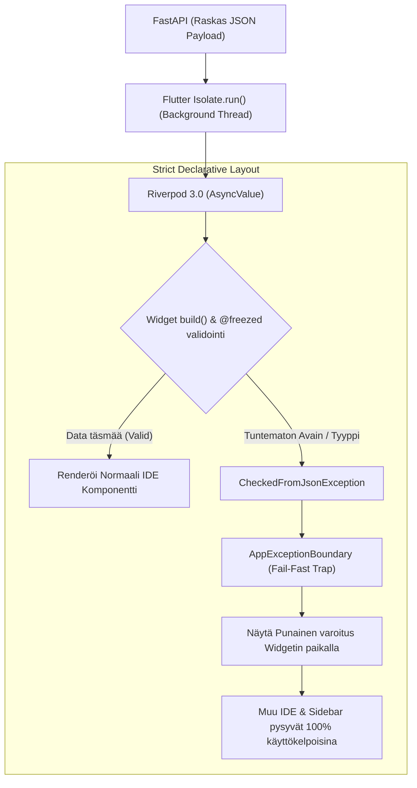

* Järjestelmä on kapseloitu globaaliin **AppExceptionBoundary** -verkkoon (toteutettu tiedostossa `core/error/app_error_boundary.dart`).
* Mikäli yhden tietyn visuaalisen laatikon tai komponentin data (esim. yksittäisen LLM-hookin vastaussääntö) puuttuu tai on korruptoitunut (`CheckedFromJsonException`), laite eristää yksittäisen widgen punaisilla katkoviivoilla korostettuun virhelaatikkoon. Koko muu IDE (sivupalkki, näkymät ja tallennuspainikkeet) pysyy aktiivisena, samalla kun Backendin oma ilmoitus (RFC 7807) tulostuu komponentin sisältä suoraan kehittäjälle näkyville.
* **Graceful Network Degradation:** Dataparserin virheet kaatavat sovelluksen tietoisesti punaiseksi laatikoksi suojatakseen muistivuodoilta, mutta **puhtaita tietoverkkovirheitä** (kuten `SocketException`, HTTP 500/503) ei saa kaataa AppExceptionBoundaryyn. Ne otetaan kiinni alemman tason rajapinnoissa, ja Riverpod ohjaa käyttöliittymän turvallisesti vain tilapäiseen lataus-, uudelleenyhdistämis- tai virhetilaan tuhoamatta käyttäjän jo syöttämää paikallista dataa.

## 5. Keskeinen Hakemistokartta ja Komponentit

Koska Client nojaa tiukasti ominaisuuspohjaiseen rakenteeseen (Feature-First), kriittiset näkymät on jaettu seuraavasti:
* **`features/execution/views/`:** Vastaa työnkulkujen ajonaikaisesta esittämisestä ja tulostuksesta (SDUI). Sisältää 5 ydinruutua: `dashboard_view.dart`, `dynamic_start_screen.dart`, `execution_report_view.dart`, `execution_view.dart`, ja `new_execution_view.dart`. Näissä näkymissä hallinnoidaan myös asynkronisten järjestelmäaskeleiden (esim. pisteytys ja PDF-generointi) saumatonta renderöintiä osana askeleiden listaa ilman visuaalista eroa natiiveihin tekoälyaskeleisiin (Virtual System Steps).
* **`features/studio/views/`:** Pitää sisällään Admin Studion hallintatyökalut, ml. työnkulkujen rakentimen (DAG Editor: `workflow_builder_view.dart`) sekä V2-arkkitehtuurin mukaisen PromptBlock-editorin (`prompt_block_builder_view.dart`).
* **`core/error/`:** Sisältää järjestelmän tärkeimmät vikasietomekanismit, joista keskeisimpänä `app_error_boundary.dart` (AppExceptionBoundary).
* **`features/studio/views/widgets/xai/`:** SDUI-komponenttien koti, esim. `matrix_observability_accordion.dart`, joka huolehtii xAI-matriisien rakenteellisesta esittämisestä ilman lokaalia matematiikkaa.

<br><hr>

➡️ **Seuraavaksi:** Flutterin arkkitehtuurin ymmärtämisen jälkeen, lue [08_dynamic_rendering_sdui.md](./08_dynamic_rendering_sdui.md) nähdäksesi, kuinka palvelin ohjaa käyttöliittymän asetteluita dynaamisesti (Server-Driven UI) ilman, että käyttöliittymää tarvitsee päivittää.
# 08: Dynaaminen Tulostusmoottori ja Osiokohtainen Synteesi

Tämä dokumentti kuvaa järjestelmän uusimman "Dynamic Rendering Engine" (tulostusmoottori) -arkkitehtuurin, joka erottaa tiedonkeruun työnkulun ja sen kielellisen generoinnin sekä visuaalisen asettelun toisistaan.

Kaikki toiminnallisuudet perustuvat tiukkaan "Backend-For-Frontend" (BFF) -jakoon, jossa palvelin ratkaisee raporttien lopullisen JSON- ja PDF-muodon (Zero-Math UI) turvallisesti erikseen eristetyssä Asynkronisessa Worker-prosessissa.

## 1. Arkkitehtuurin Pääkomponentit

Nykyaikainen tulostusarkkitehtuuri nojaa seuraaviin kerroksiin:

1. **`ExecutionService` (API Facade):** 
   Vastaa ohjaamaan pyyntöjä joko suoraan `BlueprintTransformer`ille taikka pollausta vaativaan `Arq Worker` -pohjaiseen taustatyöhön (`render_profile_job`), riippuen valitun tulostusprofiilin (`OutputProfile`) välimuistitilanteesta.
   
2. **Osiokohtainen Synteesivälimuisti (`profile_syntheses`):**
   `ExecutionRecord` on varustettu dynaamisella sanakirjalla (`dict[str, RenderedSynthesisCache]`). Yhdellä työnkululla (DAG) kerätty puhdas "Event Sourced" -tieto voidaan ajaa satojen erilaisten profiilien (esim. lyhyt Executive Summary tai pitkä 3D-data) läpi täysin toisistaan riippumatta ylikirjoittamatta synteesejä.

3. **Arq Worker (`render_profile_job`):**
   Jos pyydetyn profiilin mukaista synteesiä ei vielä löydy tietokannasta, pyyntö palautetaan välittömästi HTTP `202 Accepted` ("pending") -tilassa (SSE/Polling rajapintaedellytys). Taustatyöntekijä hyödyntää puhtaasti "CPU-bound algorithmic logic" -komponenttina toimivaa `HookRegistry`ä (erityisesti determinististä `text_consolidation_hook` asynkronista suoritusta), tuottaakseen raskaat LLM-tekstit sekoittamatta synkronisia I/O -kutsuja API-kerrokseen, ja liittää ne vasta paikalleen. Tämän synteesin valmistuttua, `render_profile_job` päätteeksi Arq Worker enqueuettaa automaattisesti PDF-tuotannon uuteen työhön (`await redis.enqueue_job("generate_pdf_job", ...)`).

4. **Arq Worker (`generate_pdf_job`):**
   Uusi ketjutettu PDF-Background Worker, joka vastaanottaa valmiit synteesit. **Syy:** Tämä hajauttaa kielellisen generoinnin ja visuaalisen asettelun (Zero-Math PDF) eri asynkronisiin työprosesseihin suorituskyvyn takaamiseksi.

5. **`BlueprintTransformer` (BFF DTO Mapper & 3D Matrix Projection):**
   Kun synteesi ja data on koossa, Blueprint ottaa haltuun raakadatan (`FrozenContext`) sekä raporttipohjan (`OutputProfile`). Se pakkaa "Zero-Math" säännöillä paitsi perinteiset akselitiedot, myös täydellisen tuen 3D-matriisivisualisoinnille (kuten Illusion Detector ja hajontakuviot). Transformer mappaa saumattomasti edistyneet XAI-laajennukset (falsifikaatio, coaching, remediation, sentiment) ja matriisikohtaiset PromptBlock-arvosanat suoraan valmiiseen `ReportDataDTO` muotoon. Tämä mahdollistaa moniulotteisten 3D-näkymien renderöinnin Frontendissa (tai PDF-moottorissa) täysin ilman asiakaspuolen laskentaa (Zero-Math UI).

### 1.1 Yhteenveto (Data Flow)
Koko dynaaminen tulostusketju etenee askeleittain seuraavasti:
1. **Tietokanta antaa raa'an historian:** Työnkulun koko `execution_trace` luetaan sellaisenaan.
2. **Pydantic & Token Shield suodattaa:** `OutputProfile`n asetukset (kuten `target_blocks`) aktivoivat Token Shieldin. Pydantic varmistaa, että vain profiilin sallima, tarpeellinen data pääsee eteenpäin ilman LLM:n token-tukkeumaa.
3. **Markdown-synteesi (Chief Editor LLM):** Tämä suodatettu, puhdas Pydantic-data syötetään uuden Arq Worker -taustatehtävän (`text_consolidation_hook`) avulla Chief Editor LLM:lle. Output Profile ohjeistaa tekoälyä roolilla (esim. "Senior Executive Coach") kirjoittamaan yhtenäinen asiantuntijateksti lennosta suoraan kovan datan pohjalta.
4. **BlueprintTransformer (Lopullinen yhdistäminen):** `BlueprintTransformer` ottaa Pydanticista numeeriset pisteet (Frontendin *Zero-Math UI* -matriiseja varten) ja uuden Bleach-sanitoidun Markdown-dokumentin, kooten ne yhdeksi turvalliseksi `ReportDataDTO` -paketiksi, joka siirtyy suoraan Flutteriin tai PDF-generaattoriin.

**Datan Muutosputki (Data Transformation Pipeline):**
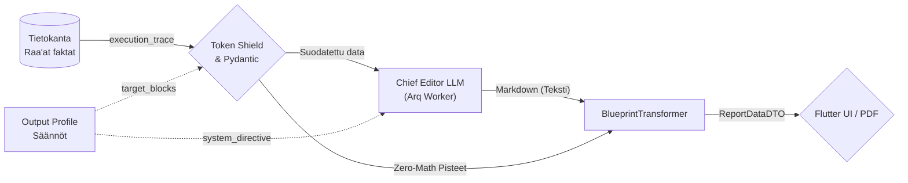

## 2. Tulostusprosessi (Mermaid Visualisointi)

Alla on arkkitehtoninen Sequence-verkko, joka kuvaa koko tulostusprosessin (`/render` endpoint) reitityksen sekä Omni-Channel HTTP -käyttäytymisen UI:lle tai PDF-tuotannolle:

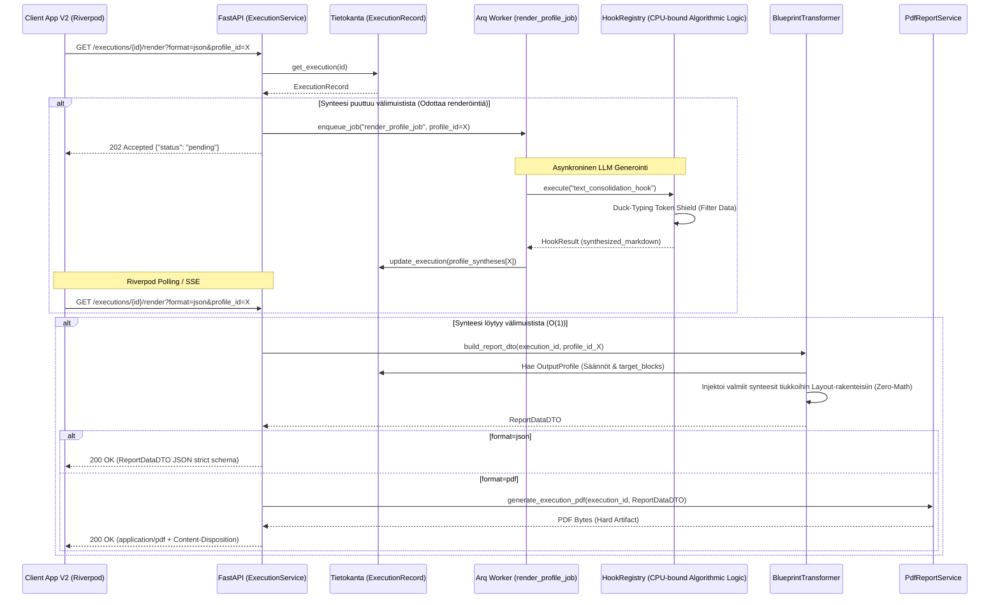

## 3. Keskeiset turvallisuus- ja skaalautuvuusvarmitukset

* **Fail-Fast reititys:** Esim. `test_integration_real_llm.py` on osoitus siitä, että jos Arq epäonnistuu kielellisessä synteesissä tai tietokannan profiilia ei löydy, järjestelmä palauttaa ehdottoman validointivirheen (AppException/Pydantic `ValidationError`) sen sijaan että UI kaatuisi mystiseen tyhjään ruutuun. `/render` endpoint palauttaa lisäksi aina asynkronisessa vaiheessa `HTTP 202 Accepted` ("pending"), minimoiden turhat polling-virheet.
* **Storage Fallback Mechanism:** Jos PDF haetaan oletusprofiililla ja sen staattinen tiedostopolku (`pdf_report_path`) on turmeltunut tallennustilasta, `ExecutionService` "parantaa itsensä" rinnakkaisesti fallback-reitillä; synkronisesti regeneroiden puuttuvan tiedoston levylle lennosta (tuottaen lokeihin varoituksen `[ExecutionService] Self-healed missing PDF`).
* **Pariteetti-Sopimus:** Kaikki Flutter-mallit lukevat JSONia 1:1 `ReportDataDTO` -rungolla, jolloin PDF ja selain pohjautuvat matemaattisesti virheettömästi täsmälleen samaan loogiseen puuhun.

## 4. Hard Artifact Testing Protocol (Visuaalisen Regression Hallinta)

Koko tulostusarkkitehtuurin (Dynamic Rendering Engine) elinehto on sen täydellinen determinismi. Koska järjestelmä ajaa jopa PDF-generoinnin suoraan samasta `ReportDataDTO` puusta kuin selainkäyttöliittymä, E2E-testauksessa noudatetaan pakollista **Hard Artifact Testing Protocol** -standardia:

1. **DB Mockaus (Kustannus & Nollaviive):** Ulkoinen I/O-riippuvuus ja LLM-generointi ohitetaan E2E-testeissä syöttämällä renderöintimoottorille 100 % deterministinen `ExecutionRecord`-mock. Nämä luodaan automaattisesti `polyfactory`-kirjastolla turvatun Pydantic-validoinnin kautta, jolloin käsintehtyjen mock-kokoelmien virheellisyys poistuu (vähintään `test_pdf_generator.py` säännöissä). Tämä takaa nanosekuntitason suoritusnopeuden eristetyssä ympäristössä.
2. **Kova Tiedosto (Visuaalinen Regressio):** Pelkkä tyyppitarkastus (`assert isinstance(pdf_bytes, bytes)`) on kielletty yksinomaisena laadunvarmistuksena Output Management -kerroksessa, sillä se ei paljasta esim. layout-katkoksista tai tyhjistä viiksistä johtuvia visuaalisia regressioita. Testien (kuten `test_pdf_generator.py` ja `test_e2e_orchestration.py`) on aina injektoitava mocked-data aitoon PDF-moottoriin saakka ja kirjoitettava tuotos fyysiseksi `test_report.pdf` -tiedostoksi levylle.
3. **Koneluettava Audiotoitavuus:** Tästä kovalevylle pudotettavasta artefaktista järjestelmäarkkitehdit, katselmoijat ja tekoälyagentit pystyvät visuaalisesti ja forensisesti tarkastamaan, että uudet layout-laajennukset sijoittuvat oikein rikkomatta aikaisempaa renderöintiä – vaarantamatta CI/CD-automaatiota.

## 5. Tiedonkeruun ja Synteesin Tietomalli (Token Optimization)

Koska raporttisynteesi perustuu tekoälymallien LLM-analyysiin, olemme rakentaneet kolmikerroksisen suojamekanismin varmistamaan, ettei puhtaan tekstin synteesi tukehdu raakadataan (nk. *Token Explosion*).

### A. Amnesia Protocol (Binäärin tuhoaminen, PII eristys ja Trace-tallennus)
Kun järjestelmään syötetään massiivisia lausuntoja (esim. PDF/Word-tiedostoja), Eager Extraction tapahtuu välittömästi synkronisella API-reititinkerroksella (tai ulkoisella uuttajalla) ennen varsinaista suoritusta. Raskas muistia kuormittava binääridata ei koskaan päädy järjestelmän ytimeen saakka, sillä `WorkflowInputs` -toimialuemalli (Domain Model) estää tämän tiukalla `prevent_base64_pollution` Pydantic `@model_validator` -säännöllä. Jos `content_base64` havaitaan, järjestelmä kaatuu välittömästi (Fail-Fast `AppException`), suojellen tietokantaa ja RAM-muistia. Näin ollen dynaamista uudelleensynteesiä voidaan suorittaa jopa vuosia myöhemmin lataamatta megatavukaupalla puhdasta koodiroskaa välimuistiin. Kaikki inputit tallentuvat lähtökohtaisesti `execution_trace` taulukkoon `TraceEvent(event_type="input")` kapselissa. Kun `ExecutionRecord.execution_trace` kasvaa liian suureksi, se tallennetaan erikseen tiedostojärjestelmään/levylle GCS-bucketin sijaan `execution_trace_storage_path` -viitteen kautta Token Explosion -tukkeumien poistamiseksi jopa tietokannan päästä.

### B. Duck-Typing Token Shield (Token Exhaustion Suojamuuri)
Backendin suurin arkkitehtuurinen riski dynaamisessa tulostuksessa on koko `execution_trace` laatikon sokkosyöttö LLM-mallille, mikä laukaisee API-tarjoajalla (esim. Vertex AI) "Resource Exhausted" 400 -virheen ja tukkii yli miljoonan tokenin rajat sekunneissa. Tämä estetään **"Duck-Typing Token Shield"** kerroksella:
1. **Säännötön Imurointi (Wildcard `*`):** Jos UI pyytää kaikki osiot, Token Shield ei hae kaikkea dataa, vaan iteratiivisesti poimii ainoastaan Pydantic-solmut, joista löytyy tekoälyn luoma `reasoning_trace`. Tämä on **LLM-stepin diskriminaattori** — kaikki LLM-suoritusstepit emittoivat sen dynaamisessa schemassa (`prompt_compiler.py`), mutta `raw_inputs`, `inputs` ja logic-nodet eivät. Token Shield käyttää `SynthesisStepDataDTO` DTO:ta diskriminointiin (`extra="ignore"` — vain `reasoning_trace`-kentän tarkistus).
   > **Tärkeä yksityiskohta:** Tarkistus tehdään `is None` -vertailulla (ei falsy `not`), koska tyhjä merkkijono on kelvollinen LLM-output tietyillä malleilla. Näin yhden stepin poisjääminen synteesistä ei tapahdu tyhjän thinking-outputin vuoksi.
   > **Arkkitehtuurinen Poikkeus (Graceful Degradation):** `extra="ignore"` -asetuksen käyttö Token Shieldissä rikkoo järjestelmän laajuista `extra="forbid"` Fail-Fast -sääntöä. Tämä kompromissi on kuitenkin pakollinen: sen avulla valtavat, miljoonien tokenien `execution_trace` -puut voidaan siivilöidä turvallisesti läpi sokkona, pudottaen raskaat rakenteet hiljaisesti pois ilman kaatumista tuntemattomiin Pydantic-avaimiin.
2. **Erikoiskohteistettu Kutsu (Explicit `target_blocks`):** Jos UI hakee raporttiin vain tiettyjä palikoita (esim. `["python_math_score", "report_metadata"]`), Token Shield ohittaa wildcard asiantuntijalogian ja purkaa Pydantic `frozen_context` rakenteesta natiivisti vain tasan nuo erikoisavaimet kielelliseen tulkkaukseen ilman muun malliston sotkeentumista päälle.
3. **Raskaan datan poisto ennen LLM-kutsua (`_compress_synthesis_payload`):** Ennen LLM-kutsuhetkiä poistuu kentät `shuffled_atoms`, `evaluations`, `quote` ja `reasoning`, jotka voivat sisältää satoja atomeja tai pitkiä ketjupäättelylokeja. Näin Chief Editor -LLM saa vain olennaisen: perustelut ja pisteet.

## 6. Zero-Compromise Export & Reporting (Epic 41)

Tulostusmoottorin vienti- ja raportointiarkkitehtuuri noudattaa "HTML First" ja Zero-Compromise periaatteita varmistaakseen, että PDF- ja ruututulosteet ovat täysin vakaita ja heijastavat absoluuttista Pydantic-tietomallia:

### 6.1 Datan Eheyden Varmistaminen (StrictMatrixPayload)
* **Fail-Fast ja Tyyppiturvallisuus:** Järjestelmän tietokannasta luettava ajodata (ExecutionRecords) puretaan ehdottoman tiukasti `StrictMatrixPayload` -rakenteita noudattaen aina tiedon synnystä lopulliseen tulosteeseen saakka.
* Koodissa ei sallita hiljaisia `except Exception: pass` -suodattimia ("God Blocks"), jotka piilottaisivat matriisidatan rakenteelliset virheet.
* **Eksplisiittinen Tyyppikastaus:** Matriisien syvädataa luettaessa vältetään Mypy:n hylkäämä dynaaminen `union-attr` duck-typing. Tieto tyypitetään eksplisiittisesti (esim. `dict[str, Any]`), jotta varmistutaan tiedon virheettömästä siirtymisestä tietokannasta tulostusmoottorille ilman tiedonhäviötä. Kaikki validointivirheet (`ValidationError`) lokitetaan välittömästi, mikä estää viallisen tiedon päätymisen asiakasraportteihin.

### 6.2 Raporttien Tulostus-API ja HTML Pariteetti (HTML-First Export Strategy)
* **HTML First ja PDF:n Selaindelegointi:** Paikallisten Weasyprint (GTK3) -kaatumisten estämiseksi Windows-ympäristöissä tulostusmoottori tukee formaattia `format=html` suoraan `ExecutionService` -reitittimestä (`/render`). Tämä eriyttää HTML-templatoinnin raskaasta PDF-renderöinnistä, jolloin backend voi palauttaa raa'an HTML:n ja delegoida PDF-konversion suoraan selaimelle (esim. Flutter `url_launcher` tai natiivi print-to-pdf). Tämä ohittaa backendin Weasyprint-rajoitteet lokaalissa kehityksessä täysin ja takaa nopeat, kaatumattomat testausiteraatiot.
* **Yhtenäinen API-rajapinta:** PDF:n tai kauniin HTML-raportin generointiin ei tueta erillisiä lokaaleja CLI-purkkaskriptejä. Kaikki raportit tuotetaan yksinomaan järjestelmän ydinrajapintojen (`BlueprintTransformer` + `HtmlReportService` / `PdfReportService`) kautta, jotta tulosteiden visuaalinen ja tietosisällöllinen renderöinti on aina täydellisesti linjassa tuotannon kanssa.
* **Fail-Fast Badges (Epic 42):** PDF-generaattorin Jinja2-raporttipohjat (`report_template.jinja2`) lukevat suoraan `ReportDataDTO`:n paljastamaa `strictness_level` ja `axis.evidence_type` -dataa. Näin PDF-raportit renderöivät samat visuaaliset badget (esim. "✅ Explicit Quote" tai "⚠️ Implied Intent") ja ankaruustason ilmoitukset identtisesti Flutter-työpöytäsovelluksen (SDUI) kanssa, tuoden Zero-Math UI:n myös paperitulosteisiin.

### 6.3 XAI-Datan ja Matriisikoontitaulukon Synteesi
* Loppuraportti (`report_template.jinja2`) tuottaa visuaalisessa muodossa 1:1 asiakaskäyttöliittymän (Flutter SDUI) kanssa kaikki matriisien syvälaajennukset (kuten Valmennusvinkit, Sävy ja Korjaustoimenpiteet). Tieto virtaa rikkomattomasti `ReportDataDTO`:n kautta.
* **Kattava Matriisikoontitaulukko (Summary Table):** Raportin loppuun renderöidään automaattisesti kattava taulukko-osio. Se kokoaa matriisien tasot (esim. T1-T6), lyhyet perustelut ja skaalatut prosenttiarvot tiiviiksi yhteenvedoksi, muodostaen loogisen ja kauniin loppuyhteenvedon tuotettavalle dokumentille.

### C. Multi-Profile Caching & On-Demand Reprocessing (FinOps)
Koko järjestelmä tallentaa kalliin prosessin vain kerran `ExecutionRecord.execution_trace` taulukkoon Pydantic Event Sourcing -mallilla.
Kun tietty Output Profile (esim. Johdon Tiivistelmä) on prosessoitu, LLM:n palauttama DTO (`RenderedSynthesisCache`) välimuistitetaan ikuiseksi osaksi itse `ExecutionRecord` -tietuetta (`profile_syntheses["prof_executive"]`).
Käyttäjä voi kuitenkin pyytää renderöinnin katselunäkymästä uuden tiivistelmän viikkoa myöhemmin toisella konfiguraatiolla (esim. "Syvä tekninen"). Tällöin järjestelmä ohittaa vanhan välimuistin uudelleenreitityksellä, noukkii vanhan raakadatan yhdellä tietokantahaulla ja puskee sen Token Shieldin läpi uudeksi DTO:ksi (esim. `profile_syntheses["prof_tech"]`), ilman että ainuttakaan alkuperäistä kognitiivista analyysi-agenttia herätetään uudelleen.

## 7. SDUI-Renderöinnin Tarkat Säännöt (`BlueprintTransformer`)

`BlueprintTransformer.build_report_dto()` on universaali BFF-muuntaja, joka palvelee **sekä Flutter-näyttöä että PDF-generointia samasta `ReportDataDTO`-rakenteesta** (täydellinen pariteetti).

### A. Block-suodatus — Fail-Fast rajapinta
Stepin tuloksesta lähetetään `ReportAxisDTO`:ksi **vain** ne avaimet, joilla löytyy vastaava `PromptBlock` tietokannasta (tai legacy `score`-avain):
```python
block = blocks_by_id.get(k)
if not block and not is_legacy_score:
    continue  # reasoning_trace, _step_metadata, jne. suodatetaan POIS
```
Tämä takaa, että sisäiset diagnostiikkakentät (`reasoning_trace`, `_step_metadata`, `_evaluative_matrices`) eivät koskaan vuoda käyttöliittymälle. Lisäksi (Epic 42 myötä) `BlueprintTransformer` kerää solmun atomi-datasta eksplisiittisesti `step_1_evidence_type` -kentän ja asettaa sen suoraan DTO-kerrokselle (`evidence_type`), tehden Zero-Trust evidenssistä ensimmäisen luokan kansalaisen SDUI:ssa.

### B. Grand Unification & Zero-Math UI Mandate (Phase 9)
Raportointiarkkitehtuuri on yhdistetty täydellisesti (Grand Unification), mikä tarkoittaa absoluuttista Fail-Fast-pariteettia Backendin ja Frontendin (sekä PDF-moottorin) välillä:
1. **Zero-Math UI:** Frontend (Flutter) ja PDF-generaattori eivät suorita lainkaan matemaattisia operaatioita. Kaikki UI:n tarvitsemat laskennalliset arvot (esim. `uiPlotRatio`, numeerinen skaalaus ja prosentit) on esilaskettu backendissä.
2. **Dynaamiset Tasojakaumat:** Matriisien jakaumat (esim. pisteet 1-6 ja niitä vastaavat selitteet) iteroidaan suoraan backendin tarjoamasta `levelBreakdown`-kartasta (esim. `Map<String, String>`). Käyttöliittymään ei kovakoodata käännösavaimia "Level 1", "Level 2" jne., vaan sisältö tulee 100% backendiltä Pydantic-mallien läpi.
3. **Fail-Fast Pydantic V2:** Frontendin DTO:t noudattavat strict-tilassa Pydantic V2:n sääntöjä (esim. `extra="forbid"`). "Graceful degradation" eli oletusarvojen (esim. `score ?? 0.0`) käyttö käyttöliittymässä on kielletty (The Anti-TDD Trap). Jos tieto on viallista, järjestelmän tulee kaatua backendissä, eikä paikata virheitä UI-tason null-checkeillä.
4. **Ei Hallusinoitua Matematiikkaa:** Kielelliset perustelut (`justification`) puhdistetaan Regex-suodattimilla, jotta LLM:n hallusinoimat raakapisteet (esim. "[Pisteet: 4/5]") eivät vuoda tekstin sekaan. Pisteet näytetään vain determinististen DTO-kenttien kautta (esim. `score` ja `scaleMax`).

### C. Skaalauksen kolme tilaa (`display_scale`)

| `display_scale` | Pistelähde | Rajat UI:lle |
|---|---|---|
| `original` | `raw_score` | DB:n `computed_min` / `computed_max` |
| `custom` | `raw_score` | DB:n `scale_min` / `scale_max` |
| `normalized_100` | `normalized_score` | 0 – 100 |

Backend laskee `ui_plot_ratio` valmiiksi:
```python
ui_plot_ratio = (score_float - scale_min) / (scale_max - scale_min)
```
Flutter ei tee matematiikkaa — se renderöi suoraan saadun suhdeluvun (Zero-Math UI -mandaatti).

### C. Akselijärjestys — `target_blocks` määrää
`OutputProfile.layouts[n].target_blocks` -lista määrää akselijärjestyksen **täsmälleen** Admin Studion määrittämässä järjestyksessä:
```python
for target_k in target_blocks:          # UI:n määräämä järjestys
    for unique_k, axis_dto in unsorted_axes.items():
        if unique_k.endswith(f"_{target_k}"):
            axes.append(axis_dto)        # akseli lisätään oikeaan kohtaan
```
Wildcard (`*`) → akselijärjestys on DAG:n steppijärjestys (ei-determininen).

### D. Minimiakseli-vaatimukset — Fail-Fast
```python
if preset_view == "3d_complex" and len(axes) < 3:
    raise AppException(...)   # kaatuu ennen UI-renderöintiä
elif preset_view == "2d_compare" and len(axes) < 2:
    raise AppException(...)
```
Jos layout-konfiguraatio on virheellinen, järjestelmä kaatuu backendissä, ei Flutterissa.

### E. XAI Extensions ja Grouped Highlights
`OutputProfile.visible_extensions` määrää mitä XAI-laajennusryhmiä populoidaan:
```python
visible_extensions = [v.value for v in profile.visible_extensions]
grouped_extensions = {ext: [] for ext in visible_extensions}
# ... highlight.extension_type → grouped_extensions[group_key].append(highlight)
```
Extension-data poimitaan V2-skeemasta nested dict -rakenteesta:
```python
ext_dict = v.get("extensions", {})
coaching = ext_dict.get("coaching")     # 11 extension-kenttää
falsification = ext_dict.get("falsification")
risk_flag = ext_dict.get("risk_flag")
# ...
```

### F. XSS-suojaus (bleach) ennen PDF/SDUI
Synthesisoitu markdown sanitoidaan Bleach-kirjastolla ennen `ReportDataDTO`-konstruktiota:
```python
safe_md = bleach.clean(str(synthesis_md), tags=allowed_tags, attributes=allowed_attributes, strip=True)
```
Sallittu tagisetti kattaa kaikki markdown-muuntimet (`h1`–`h6`, `p`, `table`, `blockquote`, jne.) mutta poistaa `<script>` ja muut XSS-vektorit.

<br><hr>

➡️ **Seuraavaksi:** Frontend on nyt selvä. Seuraavaksi [09_data_persistence.md](./09_data_persistence.md) kertoo, miten koko tämä massiivinen tiedon määrä (suoritukset ja työnkulut) tallennetaan tietokantaan Append-Only -mallilla.
# 05: Tietokanta, Storage Driver ja Repository (Persistence)

Cognitive Quorum hylkää suorat tietokantakohtaiset rutiinit tai perinteiset paksut ORM:t (Object-Relational Mapping). Järjestelmä operoi asynkronisen **Storage Driver Pattern** -arkkitehtuurin kautta, joka mahdollistaa koodin saumattoman siirrettävyyden pilven ja lokaalin koneen välillä (Environment Sovereignty) ilman pienimpiäkään muutoksia liiketoimintalogiikkaan.

## 1. Interface Segregation and Unified Repository

Kaikki backendin datakutsut reititetään ISP-yhteensopivien rajapintojen (Interface Segregation Principle) kautta. Service-kerros ei koskaan tunne "God Class" -monolyyttiä, vaan injektoi ainoastaan omia, tiukasti rajattuja interface-abstraktioitaan (esim. `IWorkflowRepository`, `IExecutionRepository`, `ISystemRepository`, `IIdentityRepository`, `IComponentRepository`). Taustalla asynkronisista I/O-operaatioista ja Storage Driver -logiikasta vastaa erikoistuneet rinnakkaisluokat, jotka injektoivat ajuriksi joko `TinyDBDriver` (Local Dev) tai `FirestoreDriver` (Tuotanto).

### Phase 9: "Big Bang" Repository Decoupling (Huhtikuu 2026)
Vanha arkkitehtuuri nojasi yhteen raskaaseen `AbstractWorkflowRepository` / `UnifiedWorkflowRepository` -luokkaan, joka vastasi kaikista CRUD-operaatioista koko järjestelmässä. Tämä "God Class" -anti-pattern aiheutti massiivisia riippuvuusongelmia ja rikkoi yksittäisvastuuperiaatetta (SRP).
Phase 9 -päivityksessä koko järjestelmä refaktoroitiin noudattamaan ISP-eristystä (Interface Segregation Principle):
1. **Decoupled Repositories:** Vanha monolyytti on pilkottu roolipohjaisiin abstrakteihin rajapintoihin, jotka sijaitsevat `database/repositories/` -hakemistossa (esim. `audit.py`, `execution.py`, `identity.py`, `system.py`, `workflow.py`).
2. **Riippuvuuksien Injektointi (Dependency Injection):** API-palvelut ja Service-kerros luottavat nyt yksinomaan näihin tiukasti rajattuihin rajapintoihin yhden valtavan tietokantaluokan sijaan. Tämä eristys varmistaa 100% Pydantic V2 -rakenteellisen eheyden (Structural Integrity) koko arkkitehtuurissa.
3. **HookDependencies (The Contract):** Koukuille (Hooks) ei enää injektoida yleistä `repository`-oliota, vaan tiukasti tyypitetty `HookDependencies` -luokka, josta jokainen abstrahoitu instanssi (`exec_repo`, `workflow_repo`, `comp_repo` jne.) löytyy omasta nimiavaruudestaan.
4. **Pydantic V2 Strict Mocks:** Testiautomaatio on pakotettu käyttämään täydellisiä mock-toteutuksia `MagicMock`/`AsyncMock` -luokkien sijaan, silloin kun arkkitehtuuri odottaa täyttä Pydantic V2 -oliota tai tarkasti tyypitettyä sanakirjaa (dictionary). Tämä estää ValidationError-kaatumiset testien ja ajonaikaisen suorituksen välillä. Lisäksi arkkitehtuuri on kokonaan hylännyt erilliset fyysiset mock-tietokannat (kuten poistetun `db_mock_v2.json` ja vanhan `run_mock.bat` -laukaisijan) siirtyen täysin nopeutettuun, in-memory testaukseen (Deterministic Testing Delegation). Ainoa sallittu LLM-mockaus tapahtuu ohjatusti `backend_v2/llm/mock_data.py` -vakiovastausten avulla testiautomaatiossa.

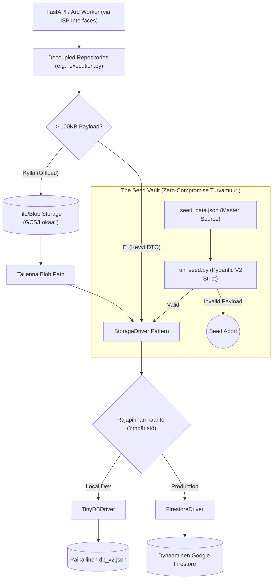

### Raskaiden Blobien Offload (Firestore Limits)
Tapahtumaperusteisen historiikin (Event Sourcing) myötä tietokantaan syntyy massiivisia Data Transfer -objekteja (`execution_trace`). Koska Googlen Firestore rajoittaa yhden tiedoston koon maksimissaan yhden (1) megatavun suuruiseksi, repository ratkaisee rajoitteen abstraktisti lennossa:
* `_offload_payloads()` -metodi huomaa, jos avainkentät (`execution_trace`, `frozen_context` tai `context_variables`) lähestyvät 100 kilotavun soft-rajaa. Mikäli raja ylittyy, Abstrakti Repository ohjaa valtavan JSON-merkkijonon tiedostopalvelimelle (GCS Bucket tai lokaali levy) pelkkänä binääripakettina, tallentaen itse päätietokantaan vain polkureferenssin (`..._storage_path`).
* Kun data haetaan API:lle (`_hydrate_payloads()`), repository lataa ja liimaa Blobien sisällön takaisin alkuperäiseen rakenteeseen saumattomasti.

### Decoupled MCP Audit Trails
Ennen mahdollisia Blob-siirtoja `_offload_payloads()` poimii `frozen_context` -paketista erilleen tekoälyn työkalukutsut (`mcp_tool_audit`). Tämä data voi työnkulun aikana paisua valtavaksi. Blob-storagen sijaan nämä MCP-lokit ohjataan tallennettavaksi täysin erillisinä dokumentteina natiiviin tietokantaan `executions/{doc_id}/audit_trails` -alakokoelmaan. Tämä eristys ohittaa normaalin JSON-Blob siirron ja mahdollistaa yksittäisten työkalukutsujen rakenteelliset haut ja selaamiset tietokantatasolla ohittaen muun datan.

### Työnkulkujen Versiointi (System Sovereignty)
Backend API:sta tulevat päivityspyynnöt (kuten työnkulkujen tai agenttien muokkaus) ohjataan `AppendOnlyRepository` -luokan kautta, joka perii uuden roolipohjaisen ISP-abstraktion (kuten `IWorkflowRepository`). Tämä toteuttaa tiukan **Append-Only** -protokollan forensisen jäljitettävyyden vaalimiseksi. Sen sijaan että data ylikirjoitettaisiin, vanha tietue merkitään `{"is_latest": False}` ja uusi tietue luodaan vanhan ID:n pohjalta käyttämällä `_increment_version` -metodia (esim. liittämällä `_v2`, `_v3` jne. alkuperäiseen tunnisteeseen). Tämä arkkitehtuurillinen System Sovereignty varmistaa, että vanhat ajot pysyvät pysyvästi kytkettyinä juuri niihin historiallisiin konfiguraatioihin, joilla ne alunperin suoritettiin.

## 2. API ja Pydantic (SSOT Validation)

Järjestelmä noudattaa tarkkaa rajapintaeristystä (Controller-Service-Repository).
Repository-kerros on jo kehittynyt validoimaan kriittisen datan lennossa: esimerkiksi `get_execution()` ja `get_workflow_definition()` palauttavat natiivisti Pydantic V2 -objekteja (`ExecutionRecord`, `WorkflowDefinition`). Listahakujen kohdalla (kuten `get_all_executions()`) repository-kerros soveltaa Graceful Degradation -mallia: korruptoituneet yksittäiset tietueet lokitetaan (`ErrorCodes.VALIDATION_FAILED`) ja ohitetaan, jottei yksi viallinen dokumentti kaada koko listausta 500/400 Server Errorilla. Yksittäisten hakujen ja API-rajapinnan rajalla odottamattomat kentät (`extra="forbid"`) katkaisevat edelleen pyynnön Fail-Fast -säännön mukaisesti ennemmin kuin sallisivat virheellisen järjestelmätiedon valua UI:n puolelle haamuvikoina.

## 3. The Seed Vault (Nollatoleranssi)

Globaalien järjestelmäkonfiguraatioiden (PromptBlocks, Workflow DAGs, Output Profiles) perustiheys on irrotettu tuotantokannasta turvalliseen **Seed Vault** -järjestelmään (`backend_v2/seed/`).

* **Manuaalinen muokkauskielto (Seed Mutation Protocol):** `.db` tai `db_v2.json` (TinyDB lokalisoitu) suora manuaalinen muokkaus kehittäjien tai tekoälyn toimesta on ehdottoman kielletty. Tämä koskee myös `seed_data.json` -tiedostoa: jopa pienet muutokset (kuten `HistoricalContextMode.DISABLED` korvaaminen Boolean-arvoksi) tehtynä teksti-editorilla tai etsi-korvaa-toiminnolla aiheuttavat tuhoisan skeema-driftin. Pydantic-validointi ei ehdi väliin manuaalisessa muokkauksessa, jolloin ohjelmisto kaatuu vasta ajonaikana.
* **Source of Truth:** Lokaalit tai globaalit testidata ja vakiot asuvat pelkästään mastertiedostossa `backend_v2/seed/seed_data.json`.
* **Kielto sed/awk -käytölle:** JSON-dataa ei saa koskaan muokata lennosta terminaalikomennoilla (esim. `sed`, `awk` tai bash-tulkit) edes `seed_data.json` -tiedostossa.
* **Backup & Scripting Mandatory:** Jokainen rakenteellinen datamuutos `seed_data.json` -tiedostoon TEHDÄÄN AINA erillisellä lyhytikäisellä Python-skriptillä (esim. `backend_v2/seed/scripts/patch_x.py`). Skriptin on ladattava JSON (`json.load()`), otettava varmuuskopio `backend_v2/seed/backups/` -hakemistoon, muokattava dataa ja lopuksi kirjoitettava se muotoon `json.dump(data, f, indent=2)`. Skriptin ajon yhteydessä datan on läpäistävä Pydantic V2 -mallien validointi ennen kuin muutokset katsotaan onnistuneiksi. Vain tämä lukitsee eheyden.
* **Atomization Cache (Suorituskyky):** Seeder (`run_seed.py`) hyödyntää `atomization_cache.json` -tiedostoa matriiseja sisältävien `PromptBlock`-objektien optimoinnissa. Seeder laskee Pydantic-mallista dumpatun tekstin perusteella MD5-tiivisteen, ja mikäli tiiviste löytyy välimuistista, hidasta LLM-pohjaista matriisiatomisaatiota ei suoriteta lokaalissa ympäristössä. Tämä on kriittinen komponentti nopean kehityssyklin turvaamisessa.
* **Opaque Stripe IDs:** Kaikissa luoduissa tunnisteissa on seurattava ehdotonta Opaque ID -mallia (esim. `usr_x8f9a2b1` tai `wf_cd3p1k`). Ihmisluettavia semanttisia avaimia (`new_user_1`) on kielletty käyttämästä. Opaque-mallit varmistavat aukottoman globaalin tason tietokantaintegritaation ja eristävät dataobjektien viittaukset nimien muutoksista.
* **Tietokannan Rakenteellinen Koskemattomuus (The One SSOT Architecture):** 
  - Järjestelmän tietomalli nojaa tiukasti relaatiomaiseen Single Source of Truth -malliin. Esimerkiksi **Tulostusprofiilit (Output Profiles)** asuvat *ainoastaan* globaalissa `output_profiles`-Pääkokoelmassa.
  - Vaikka kooditason Pydantic-mallit (kuten `Workflow`) esittelisivät rakenteita kuten `EmbeddedOutputProfile`, näitä upotettuja rakenteita **EI KOSKAAN** saa fyysisesti tallentaa tai siirtää `seed_data.json` -tiedostoon tekoälyn toimesta. 
  - Backendin Service-kerros (`_stitch_profiles_to_workflows`) on vastuussa datan dynaamisesta kokoamisesta (injektoinnista) lennossa silloin kun käyttöliittymä sitä pyytää. Frontend käyttää koottua JSON-näkymää, mutta fyysinen tallennusarkkitehtuuri on ja pysyy erillisten taulujen mallissa.
* **Tietokannan Resetointistrategiat (Hard vs Soft):** Arkkitehtuuri on jaettu kahteen eri nollausmalliin.
  - **Hard Reset (`run_seed.py`):** Pudottaa brutaalisti kaikki tietokannan taulut (`db.drop_tables()`) ja rakentaa arkkitehtuurin puhtaalta pöydältä luomalla uudet Validoidut Pydantic-oliot `seed_data.json`-lähteestä. Tuhoaa prosessin aikana automaattisesti myös kaikki fyysiset artifaktit (PDF:t, JSON-tallenteet) poistamalla lokaalin tallennushakemiston (`data/files/executions`) jotta levyasema pysyy puhtaana "orvoista" tiedostoista.
  - **Soft Reset (`wipe_user_data.py`):** Kirurginen resetointi, joka tyhjentää ainoastaan käynnissä olevat dynaamiset suoritukset ja työnkulut (esim. `data["executions"] = {}`), säilyttäen järjestelmäkonfiguraatiot koskemattomina. Tärkeänä yksityiskohtana se myös tuhoaa fyysiset orvot tiedostot (`data/files/executions`), toimien yhdenmukaisesti Hard Resetin kanssa fyysisen siisteyden osalta. Tarkoitettu vikakorjaussykleihin (debugging), joissa halutaan säilyttää käsin muokatut Seed-vakioarvot.
* **Tietokannan Sadonkorjuustrategia (Inverse Merge):** Koska kehittäjät rakentavat dynaamisia järjestelmäkomponentteja (kuten Output Profiles) visuaalisesti Admin Studion UI:n kautta lokaaliin kantaan, nämä muutokset "sadonkorjataan" (harvest) ohjelmallisesti takaisin koodikannan mastertiedostoon.
  - **Surgical Extraction (`harvest_output_profile.py`):** Tämä skripti lukee yksinomaan halutun taulun lokaalitiokannasta (esim. `output_profiles`), suorittaa tarvittaessa konversiot (kuten legacy `3d_complex` -> `3d_matrix`) ja injektoi datan takaisin `seed_data.json` -tiedostoon ohittaen käsin muokkaamisen riskit. Tämä takaa "Single Truth" -datan siirtymisen käyttöliittymästä versionhallintaan täysin turvallisesti estäen Pydantic-kaatumiset.
* Data astuu virallisesti voimaan vasta kun komento (`uv run python backend_v2/seed/run_seed.py local`) puhdistaa ja todentaa `seed_data.json`:in Pydantic-mallien läpi nollavirhein.

<br><hr>

➡️ **Seuraavaksi:** Kirjan päätteeksi lue [10_infrastructure_and_logs.md](./10_infrastructure_and_logs.md), joka kertoo, miten ylläpidämme järjestelmän havainnoitavuutta (Logfire) ja paikannamme virheitä asynkronisen kaaoksen keskeltä.
# 07: Infrastruktuuri ja Lokitus (Observability)

Järjestelmä operoi asynkronisen Python FastAPI -arkkitehtuurin, raskaiden Arq / Redis -taustatyöntekijöiden ja Docker-konttien päällä. Koska taiteellisen asiantuntijajärjestelmän debuggaus on perinteisesti tuskaista ("miksi tekoäly tuotti huonon tuloksen?"), Cognitive Quorum panostaa massiivisesti "Forensic Sovereignty" -tyyliseen jäljitettävyyteen.

## 1. Lokitus (The ContextFilter Mandate)

Lokitus (`backend_v2/logging_config.py`) ei ole vain tekstivirtaa, vaan arkkitehtuurisesti kytketty The Zero-Compromise Pledgen "Fail-Fast" periaatteisiin.

1. **Kontekstisidonnaisuus (`ContextFilter`):** Jokainen taustaprosessiin (Worker) tai reitittimeen (API) syntyvä lokirivi, oli se sitten tietokantavirhe tai LLM-integraation varoitus, ohjataan `ContextFilter`:n läpi. Tämä injektoi lokiriville *aina* aktiivisen `execution_id`:n (tai oletuksena `request_id`). Tämän ansiosta massiivisesta serverin lokitiedostosta (`backend_debug.log`) pystytään greppaamaan sekunneissa kaikki yhtä tiettyä työnkulkua koskettavat 100 eri I/O -kutsua. Oletuksena lokitiedosto käyttää kehittäjäystävällistä Standard Dev Formatteria, mutta se voidaan kytkeä tiukkaan koneelliseen `JSONFormatter`-tilaan `use_json_logging`-asetuksella.
2. **Dual-Reporting (RFC 7807):** Järjestelmän on ehdottomasti estetty nielemästä virheitä lennossa. Kun koodi kaatuu odottamattomaan poikkeukseen, sitä ei "hoideta pois", vaan se työnnetään ensin rakenteellisena `logger.error` viestinä talteen (mukaanlukien täysi Stack Trace ja virhekoodi), ja uudelleenheitetään asiakkaalle puhtaana Pydantic-validoituna `AppException` (RFC 7807 Problem Details) rakenteena vian selvittämiseksi. `main.py` määrittelee erilliset exception handlerit (`AppException`, `RequestValidationError`, `StarletteHTTPException` ja globaali `Exception`). Nämä palauttavat aina validin `application/problem+json` -vastauksen ja injektoivat `extensions`-lohkoon asiakkaalle (Flutterille) koneellisesti luettavan `error_code`:n lokalisointia (L10n) varten. Turvallisuus: HTTP-payloadien ja asiakastietojen raakalokitus on ehdottomasti kielletty. Tätä Dual-Reporting -protokollaa valvoo ohjelmallisesti erillinen `log_error()`-apufunktio, joka poimii poikkeuksista `error_code` ja `details` -kentät (duck-typing tai luokkanimen perusteella) pakottaen ne `APIError`-skeeman mukaiseen muotoon.

3. **Event Sourcing -liiketoimintalokit (`execution_trace`):** Järjestelmän ensisijainen liiketoimintatason jäljitettävyys ei nojaa vain tekstitiedostoihin, vaan Event Sourcing -tyyliseen `WorkflowState`-malliin (`backend_v2/models/state.py`). Jokainen ajo ylläpitää `execution_trace`-listaa (muuttumaton loki `TraceEvent`-olioita), joka taltioi tapahtuman tyypin (`input`, `reasoning`, `decision`, `error`, `output`, `tombstone`). Tämä sisältää muun muassa `ReasoningTrace`-mallilla piilotetun Chain-of-Thought -prosessin sekä `ErrorTraceEvent`-tapahtumat strukturoitua vianjäljitystä varten. `StateProjector` tiivistää (fold_trace) nämä lokit dynaamisesti asiakkaalle luettavaksi tilaksi O(1)-ajassa.

## 2. Pydantic Logfire & LLM Observability

Tekoälyn toimintakyky ei saa ikinä olla Musta Laatikko. Järjestelmä on integroitu suoraan Pydanticin viralliseen Logfire-pilveen (`logfire.configure`).
* Kaikki HTTP-pyynnöt ja tekoälyintegraatiot (`litellm.success_callback` ja `failure_callback`) säteilytetään suoraan kojelautaan pilveen vianjäljitystä varten. Arq Redis -instrumentaatio on kuitenkin tietoisesti disabloitu konsolispämmin (esim. ZRANGEBYSCORE) estämiseksi, ja LiteLLM:n vakio-debug-tulosteet on hiljennetty (`suppress_debug_info=True`).
* Tämä paljastaa tarkasti kauan mallilla (esim. Gemini Pro) meni generoida tietty Pydantic Structured Output, paljonko se maksoi (Token usage), ja kaatuiko kysely mahdollisesti rikkinäiseen Pydantic-skeeman luontiin (`schema_builder.py`).
* **Telemetrian hienosäätö ja kestävyys:** Logfire on pakotettu käyttämään EU-endpointtia (`LOGFIRE_BASE_URL="https://api-eu.pydantic.dev/"`). Ympäristötasolla Windows 11 cp1252-kaatumiset estetään suoraan lokituksen ytimessä kytkemällä pois Logfiren konsoliviejä (`LOGFIRE_CONSOLE="false"`) ja pakkokoodaamalla `sys.stdout.reconfigure(encoding="utf-8")`. Paikalliskehityksessä pilvitelemetria on myös mahdollista kytkeä kokonaan pois päältä `DISABLE_LOGFIRE` -ympäristömuuttujalla.
* **API-tason Middlewaret:** API-integraatio nojaa vahvasti middleware-kerrokseen. `RequestIdMiddleware` injektoi lennossa `X-Request-ID`:n `ContextFilter`ille telemetriakäsittelyä varten, ja `LocalizationMiddleware` asettaa oikean L10n-kielen (esim. `Accept-Language` otsikosta) dynaamisia virheviestejä varten.

## 3. Infrastruktuuri ja Ympäristöt

Quorum pohjaa kontitettuun "Infrastructure as Code" -toimintamalliin. Siksi järjestelmällä ei ole erillistä paikallisista eroja koskevaa ydinlogiikkaa. 

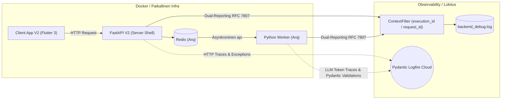
* **Worker Queue (Arq + Redis):** Kuten aiemmin mainittu, työnkulut eivät koskaan elä NginX tai Uvicorn pääprosessin sisällä. Kun asiakas laukaisee evaluaation, FastAPI -päärajapinta tallentaa Pydantic-mallit tietokantaan, lähettää tiedon sadasosasekunneissa Arq-palvelimelle (Redis), joka aloittaa raskaiden tekoälymallien asynkronisen ohjaamisen eristetyssä Worker-säikeessä.
* **Paikallinen Ajo:** Kehittäjät hyödyntävät käynnistysrutiineja kuten `run_local.bat` ja taustamallistoa `docker-compose.yml`, nostaen paikallisen Redis-ilmentymän sekunneissa kehityskäyttöön varmistaen täydellisen pilvipariteetin.

## 4. Frontend Observability (Flutter & AppErrorBoundary)

Vastaavasti kuin palvelinpuolella, Front-Endin (Flutter) arkkitehtuuri on immuuni hiljaisille virheiden nielemisille ("No-pass rule"). Asiakassovellus on kiedottu globaaliin `AppErrorBoundary` -luokkaan, joka ottaa kiinni kaikki odottamattomat asettelu- ja renderöintivirheet. Koska rikkinäisen komponentin jättäminen visuaalisesti näkymättömiin harmaatiloihin on estetty (`SizedBox.shrink()` on kielletty), nämä poikkeukset lokitetaan ja tallennetaan keskitetysti `LoggerServiceProvider`:n kautta lokaaliin `client_debug.log` -tiedostoon vianjäljityksen helpottamiseksi.

Vaikka puuttuva Pydantic/JSON-data kaataa parserin nativisti datavirhelyöntien paljastamiseksi ("Fail-Fast"), sovelletaan verkkoliikenteen osalta silti ohjeistusta "Graceful Network Degradation". Verkkovirheet ja aikakatkaisut otetaan kiinni alemman tason rajapinnoissa ja ohjelmisto heikkenee tällöin hallitusti lataustilaan romahtamatta koskaan kokonaan punaiseen virheruutuun. Näin varmistetaan paikallisesti generoidun graafisen työtilan turvaaminen tilapäisten verkkoyhteyskatkosten keskellä.
# 11: Empiirinen Raportti: Kognitiivinen Pisteytys ja XAI-Synkronisaatio (Sitra Case 2026)

## 1. Johdanto ja Arkkitehtoninen Tavoite
Tämä raportti dokumentoi toukokuussa 2026 suoritetun Tier 4 -tason kognitiivisen arviointimoottorin (Scoring Engine) karkaisun ja validoinnin tulokset. Istunnon päätavoitteena oli varmistaa **SSOT (Single Source of Truth)** -arkkitehtuurin eheys: järjestelmän tekoäly lukee lähdemateriaalin vain kerran (Deep Atomization), ja kaikki myöhempi vaihtelu tuotetaan täysin puhtaan, deterministisen matematiikan ja Pydantic-validoitujen kireystasojen avulla.

Samalla ratkaistiin kriittinen haaste Synteesi-LLM:n käyttäytymisessä ("Compliment Sandwich" -ongelma), sitomalla johdon yhteenvedon sanallinen sävy suoraan asynkronisen Workerin laskemaan lopulliseen, normalisoituun matemaattiseen arvosanaan.

## 2. Matemaattiset Vaihteet (The 4 Gears)
Quorum V2 käyttää neljää eri laskentamoottoria. Nämä algoritmit toimivat "linsseinä", joiden läpi sokea raakadata (osumat / väitteet) katsotaan:

1. **Syväarvostelu (Progressive Dampening - DINA V3):** 
   Tämä moottori hyödyntää lineaarista interpolaatiota (Lerp) lieventääkseen alempien kognitiivisten tasojen puutteita kaavalla: `effective_hit_rate = base_forgiveness + (hit_rate * (1.0 - base_forgiveness))`. Vaimennukseen sovelletaan kireystason perusteella dynaamista eksponenttia, jolloin täydellinenkään ylemmän tason suoritus ei voi kompensoida täysin murentunutta perustaa, mutta pisteet eivät romahda absoluuttisesti nollaan yksittäisen virheen takia. Etsii loogisen ketjun heikoimman lenkin.
2. **Koearvostelu (Soft Waterfall - Guttman V3):** 
   Tiukka compliance-moottori. Ehdoton portinvartija. Jos tavoitekynnys (threshold) alitetaan, järjestelmä ei enää lukitse koko pisteytystä "rikkinäisiin tikapuihin", vaan laskee vajauksen (`shortfall`) ja soveltaa **liukuvaa rangaistuskerrointa** (sliding penalty multiplier) kaikkiin myöhempiin tasoihin kaskadoituvasti.
3. **Painotettu Keskiarvo (Sigmoid Scaling):** 
   Laskee matriisin tason perusteella painotetun suhdeluvun ja skaalaa tuloksen ulos **Sigmoid (logistic) -käyrällä**: `raw_sigmoid = 1 / (1 + math.exp(-steepness * (hit_rate - midpoint)))`. Kireystaso liikuttaa Sigmoidin keskipistettä, jolloin tiukempi kireystaso vaatii eksponentiaalisesti puhtaampaa osumaprosenttia korkean arvosanan saamiseksi. Järjestelmä suorittaa täyden matemaattisen normalisoinnin absoluuttisten ääripäiden väliin.
4. **Lineaarinen Keskiarvo (MAD Outlier Rejection):** 
   Puhtaassa keskiarvossa järjestelmä on alttiimpi datapisteille, jotka heikentävät muuten vahvaa profiilia. Tämä moottori tunnistaa tilastolliset anomaliat hyödyntämällä **Median Absolute Deviation (MAD)** -menetelmää. Jos yksittäinen taso poikkeaa merkittävästi aggregaatin mediaanista (`hit_rate < median - 3.0 * MAD` ja `hit_rate < 0.30`), tason painoarvoa alennetaan (0.25x), suojellen näin kokonaisarvosanaa perusteettomilta romahduksilta.

## 3. Empiirinen Testiajo (Sitra Supermegatrendit)
Testasimme moottoria syöttämällä sille täysin identtisen tekoälyn suorittaman raaka-analyysin. Muutimme ainoastaan arviointimoottoria ja tiukkuusparametreja (0–100). Tulokset paljastivat arkkitehtuurin valtavan tehon:

### Skenaario A: "Säälimätön Auditoija"
* **Moottori:** Syväarvostelu (Dampening)
* **Tiukkuus:** 100 (Absoluuttinen)
* **Arvosana:** **7.00 / 100.00**
* **Havainto:** DINA-moottori havaitsi perustan ontuvan (falsifioinnin puute ja keksitty päivämäärä) ja vaimensi armotta kaikki ylempien tasojen onnistumiset nollaan. Tulos oli absoluuttinen hylkäys.

### Skenaario B: "Portinvartija"
* **Moottori:** Koearvostelu (Waterfall)
* **Tiukkuus:** 100 (Absoluuttinen)
* **Arvosana:** **44.40 / 100.00**
* **Havainto:** Koska perusosumia oli jonkin verran, Guttman-moottori salli alatasojen pisteet, mutta sulki ylemmät tasot liukuvalla rangaistuksella, kun näyttö (keksitty päivämäärä) petti. Tuloksena hylätty, mutta ei nollattu suoritus.

### Skenaario C: "Kultainen Keskitie"
* **Moottori:** Painotettu Keskiarvo
* **Tiukkuus:** 50 (Tasapainoinen)
* **Arvosana:** **64.20 / 100.00**
* **Havainto:** Perustason onnistumisille (esim. "supermegatrendien" innovaatio) annettiin painoarvoa, ja Sigmoid-skaalaus pehmensi virheitä. Arvosana ylsi niukasti, mutta varmasti tyydyttävälle tasolle.

### Skenaario D: "Sokea Cheerleader"
* **Moottori:** Koearvostelu (Waterfall)
* **Tiukkuus:** 0 (Täysi joustavuus)
* **Arvosana:** **100.00 / 100.00**
* **Havainto:** Kynnysarvot laskettiin nollaan. Kaikki minimaalinenkin osumadata riitti laukaisemaan hyväksynnän. Faktojen keksintää ja puutteellista logiikkaa ei rankaistu lainkaan.

## 4. XAI-Synkronisaatio ja Dynaaminen Sävy (Tone Continuum)
Pelkkä matematiikka ei riitä, jos XAI-tekstisynteesi ei tue sitä. Ongelmana oli perinteinen LLM-käyttäytyminen: tekoäly pyrki automaattisesti pehmentämään heikkoa 7.00 tulosta aloittamalla raportin kohteliailla kehuilla ("Compliment Sandwich").

Tämä ratkaistiin injektoimalla asynkronisen Workerin tuottama `normalized_score` suoraan Synteesi-LLM:n rakenteelliseen promptiin, luoden 4-portaisen **Score-Driven Tone Continuum** -arkkitehtuurin:

1. **0 - 39 (Catastrophic Failure):** Nollatoleranssi kehuille. Aloittaa suoraan rakenteellisen romahduksen toteamisella.
   * *Esimerkki (Arvosana 7.00):* "Tämä analyysi... jää puolitiehen. Suurin sokea pisteesi on kriittisen validoinnin täydellinen puute. Et missään vaiheessa haastanut luomasi mallin kestävyyttä... paljastaa myös huolimattomuutta."
2. **40 - 69 (Mediocre / Flawed):** Kliininen ja jämäkkä. Tunnustaa lähtötason, mutta siirtyy heti virheisiin.
   * *Esimerkki (Arvosana 64.20):* "Osoittaa kykyä siirtyä pelkästä tiedonkeruusta kohti synteesiä... toteutus jää kliinisen arvion mukaan keskinkertaiseksi. Suurin sokea piste on kriittisen validoinnin ja älyllisen nöyryyden täydellinen puuttuminen."
3. **70 - 89 (Strong / Competent):** Rakentava valmennus, vahvistaa osaamista.
4. **90 - 100 (Mastery / Excellent):** Äärimmäisen vahvistava, keskittyy ylläpitävään huipputason ohjaukseen.

## 5. Yhteenveto: Zero-Math ja Opaque Integrity
Tämä arkkitehtuurikokonaisuus varmistaa kaksi 2026 Zero-Legacy -mandaatin ydintavoitetta:
1. **Zero-Math UI:** Käyttöliittymä (Flutter) vastaanottaa valmiit laskelmat ja tekstit, eikä sen tarvitse koskaan purkaa matemaattista logiikkaa selaimeen.
2. **Kognitiivinen Pariteetti:** Matematiikka, arviointimatriisit ja tekoälyn ihmiskielinen palaute ovat saumattomassa, todistettavassa synkronissa. Tekoäly haukkuu vain, jos matematiikka antaa siihen luvan, ja perustelee ankaran palautteensa (*"keksitty päivämäärä"*) suorilla, auditoitavilla lainauksilla raakadatasta.

## 6. Teorialähteet ja Käyttötapaukset (Use Cases)

Jokainen moottori pohjautuu validioituun kognitiiviseen tai tilastolliseen teoriaan, ja niillä on tarkasti rajatut optimaaliset käyttötapaukset liiketoiminnassa:

### A. Syväarvostelu (DINA V3 / Progressive Dampening)
* **Teoriapohja:** Cognitive Diagnostic Models (CDM), erityisesti DINA (Deterministic Inputs, Noisy "And" gate). DINA olettaa, että korkeamman tason onnistuminen vaatii ehdottomasti kaikkien alempien taitojen hallintaa.
* **Optimaalinen Käyttötarkoitus:** "Ketjunheikkouden etsiminen" ja kriittinen riskienhallinta.
* **Käytännön Esimerkki:** **Lääketieteellinen tai juridinen analyysi.** Vaikka loppupäätelmä (Taso 5) olisi kuinka nerokas ja innovatiivinen, se on täysin arvoton ja jopa vaarallinen, jos sen taustalla oleva faktantarkistus (Taso 1) pettää. DINA romahduttaa arvosanan ja estää "vaarallisen innovaation" menemästä läpi.

### B. Koearvostelu (Guttman V3 / Soft Waterfall)
* **Teoriapohja:** Guttmanin asteikko (Cumulative scale). Teoria olettaa kumulatiivisen osaamisen: tason 4 suorittajan odotetaan automaattisesti osaavan tasot 1, 2 ja 3.
* **Optimaalinen Käyttötarkoitus:** "Portinvartija", pätevyyskokeet ja ISO-sertifioinnit.
* **Käytännön Esimerkki:** **Turvallisuus- ja Compliance-auditointi.** Jos työntekijä epäonnistuu pakollisessa turvallisuusprotokollassa (Taso 1), hän ei voi "korvata" tätä puutetta kirjoittamalla hyvän esseen johtamisesta (Taso 4). Guttman pysäyttää arvioinnin nousemisen, mutta säästää alatasojen pisteet liukuvalla rangaistuksella (ei absoluuttista nollausta).

### C. Painotettu Keskiarvo (Sigmoid Scaling)
* **Teoriapohja:** Logistinen funktio (Sigmoid-käyrä) ja normaalijakauman mukainen skaalaus. Arvosanat vakioidaan pehmeästi ääripäiden väliin.
* **Optimaalinen Käyttötarkoitus:** "Kultainen keskitie" ja valmentava palaute.
* **Käytännön Esimerkki:** **Ideointi, innovaatiotyöpajat ja strateginen aivoriihi.** Tässä halutaan palkita luovuudesta ja uusista avauksista (esim. uusi supermegatrendi). Vaikka perusteluissa olisi pieniä aukkoja, Sigmoid-skaalaus pehmentää virheitä ja tuottaa motivoivan, rakentavan arvosanan (esim. 64.20), joka kannustaa iterointiin.

### D. Lineaarinen Keskiarvo (MAD Outlier Rejection)
* **Teoriapohja:** Robustit tilastomenetelmät, erityisesti Median Absolute Deviation (MAD), jota käytetään tilastollisten anomalioiden (outliers) suodattamiseen keskiarvosta.
* **Optimaalinen Käyttötarkoitus:** Massadatan suodatus ja suurten organisaatioiden arviointi.
* **Käytännön Esimerkki:** **Globaalin henkilöstökyselyn synteesi.** Jos 9 osastoa tekee erinomaista työtä, mutta 1 osasto epäonnistuu täysin (koska he ymmärsivät kyselyn ohjeistuksen väärin), perinteinen keskiarvo romahtaisi. MAD tunnistaa tämän yhden epäonnistumisen "anomaliaksi" ja pienentää sen painoarvoa, suojellen koko yrityksen globaalia arvosanaa perusteettomalta romahdukselta.
