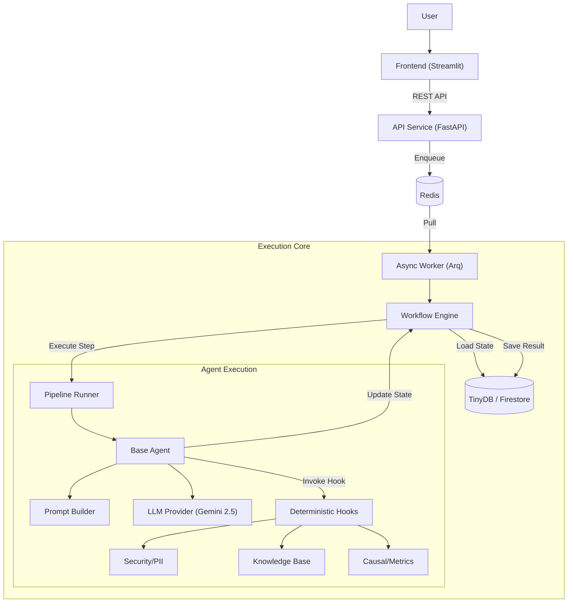

# Technical Architecture and Analysis (V2.5 Refactor)

This document describes the technical architecture of the Cognitive Quorum v2.5 system and analyzes its core features following the January 2026 refactoring (Async Modernization).

---

## 1. Core Architecture: Modular Async Monolith

The system is built on modern Python standards (3.14+), emphasizing static typing, async concurrency, and distributed execution.

### Backend (FastAPI + Arq)
- **Framework:** FastAPI (HTTP) + Arq (Redis-based Async Workers).
- **Validation:** Pydantic V2 (Strict Mode) utilizing `typing.Annotated`.
- **Documentation:** 100% Google-style docstrings and automatically generated OpenAPI / Swagger.
- **Structure:**
    - `backend/api/`: Lightweight HTTP routers (enqueue jobs).
    - `backend/worker.py`: Heavy-lifting background worker (processes jobs).
    - `backend/core/engine.py`: Core orchestration logic (Dependency Injection).

### Frontend (Streamlit)
- **Role:** Lightweight "Thin Client" UI layer.
- **Communication:** REST API calls to backend state endpoints.
- **Rendering:** Polling-based UI aimed at real-time progress tracking.

### Resilience & Observability
- **Logfire:** Distributed tracing across API and Workers.
- **Optimistic Locking:** `WorkflowState.version` ensures data integrity during concurrent writes.
- **Redis Broker:** Decouples ingestion from processing, allowing the API to remain responsive under load.

---

## 2. Agent Architecture (Cognitive Assembly Line)

Agents are not independent "black boxes" but function as part of a deterministic pipeline.
All agents inherit from `BaseAgent` and enforce strict Input/Output state contracts (`WorkflowState`).

| Agent | Role | Responsibility |
| :--- | :--- | :--- |
| **GuardAgent** | Gatekeeper | Security, PII protection (Presidio-hook), input sanitization. |
| **AnalystAgent** | Analyst | Data preprocessing, hypothesis generation, and evidence gathering (RAG). |
| **InteractionAnalyst** | Interaction | Analyzes dynamics between the user and AI (Driver/Passenger). |
| **ProfilerAgent** | Profiler | Identifies user intent and cognitive biases. |
| **LogicianAgent** | Logician | Constructs logical argument structures (Toulmin). |
| **FalsifierAgent** | Falsifier | Attempts to refute hypotheses and tests reasoning durability. |
| **CausalAgent** | Causal | Analyzes cause-effect relationships (DoWhy-hook). |
| **DetectorAgent** | Detector | Identifies performativity and pretense. |
| **OverseerAgent** | Overseer | Fact-checking (Google Search) and ethical oversight. |
| **PanelAgent** | Panel | "Fan-out" agent simulating a panel of experts. |
| **ArchivistAgent** | Archivist | Analyzes the process and compares it to precedents (Case Law). |
| **JudgeAgent** | Judge | Delivers final verdict and scores performance (Dynamic Matrices). |
| **CoachAgent** | Coach | Provides development suggestions and pedagogical feedback. |
| **XAIReporter** | Reporter | Produces an explainable (XAI) final report. |

---

## 3. Distributed Sync Loop

The system maintains state (`WorkflowState`) centrally, efficiently managed across distributed components.

1.  **API**: Enqueues a Job ID to Redis (`backend/api/execution_router.py`). The API responds immediately (HTTP 202), preventing client timeouts.
2.  **Worker**: Pulls Job (`backend/worker.py`).
3.  **Engine**: Loads `WorkflowState` from DB (TinyDB/Firestore).
4.  **Runner**: Executes one Step (Agent).
5.  **Agent**: Calls LLM Provider (`backend/llm/provider.py`) - Extracts **Reasoning Tokens**.
6.  **Agent**: Updates State (e.g. `state.step_analyst`).
7.  **Engine**: Persists State to DB (incrementing `version`).

This ensures that if a Worker crashes, the job can be retried or resumed from the last checkpoint.

### Performance & Scalability Analysis
The refactoring to an Async Worker architecture addresses critical bottlenecks identified in V1:

*   **Timeout Decoupling**: Standard HTTP clients (browsers, proxies) timeout after 60-300 seconds. Deep cognitive workflows (e.g., Causal Analysis or broad Research) can run for 15+ minutes. By offloading to `arq` workers (configured with `job_timeout=900s`), the system can execute long-running tasks without connection loss.
*   **Horizontal Scalability**: The decoupling allows independent scaling of API nodes (handling high concurrency lightweight requests) and Worker nodes (handling CPU/Memory intensive reasoning).
*   **State Parity**: The database (TinyDB vs Firestore) serves as the synchronization point. Worker-based updates are immediately visible to the Polling Client, solving the "Silent Execution" paradox.

---

## 4. Advanced Features (Hooks)

Agents utilize deterministic "Hooks" for tasks requiring precision beyond LLM capabilities.

*   **RAG (Retrieval-Augmented Generation):** Semantic document search (`backend/services/knowledge_base_service.py`).
*   **Causal Inference (DoWhy):** Statistical causal analysis (`backend/hooks/causal.py`).
*   **PII Protection (Presidio):** PII detection and masking (`backend/hooks/security.py`).
*   **Google Search:** Real-time data retrieval (`backend/hooks/search.py`).

---

## 5. Documentation and Quality Assurance

Following the refactoring, the codebase adheres to strict standards:

*   **Python 3.14:** Compliant with PEP 649 (Deferred Annotations).
*   **Full Typing:** 100% Type Hinting coverage.
*   **Google-Style Docstrings:** Monitored via Ruff (`D100-D106`).
*   **English Codebase:** Internal docs are English; User-facing content supports localisation.

