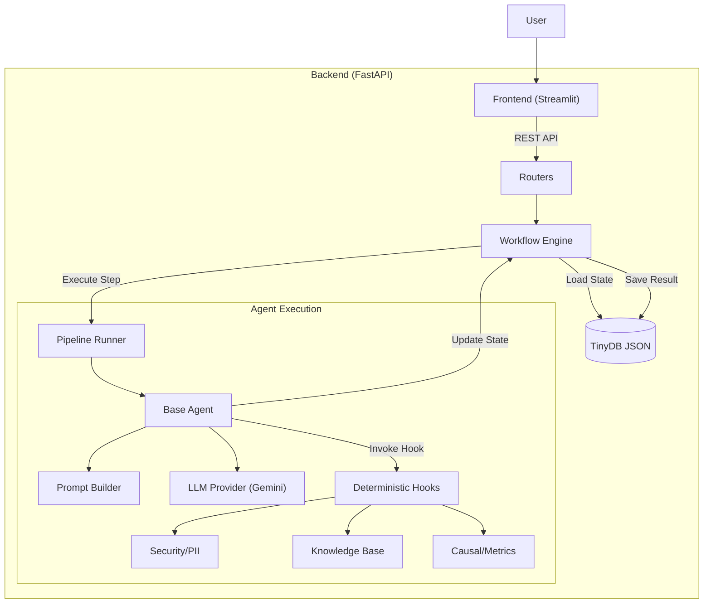

# Technical Architecture and Analysis (V2.0 Refactor)

This document describes the technical architecture of the Cognitive Quorum v2.0 system and analyzes its core features following the December 2025 refactoring.

---

## 1. Core Architecture: Modular Monolith

The system is built on modern Python standards, emphasizing static typing and clear interface separation.

### Backend (FastAPI)
- **Framework:** FastAPI
- **Validation:** Pydantic v2 (Strict Mode) utilizing `typing.Annotated`.
- **Documentation:** 100% Google-style docstrings and automatically generated OpenAPI / Swagger.
- **Structure:** Modular routers separated from core logic (`engine`, `services`).

### Frontend (Streamlit)
- **Role:** Lightweight UI layer that visualizes background state.
- **Communication:** REST API calls to backend state endpoints.

### Database (TinyDB Abstraction)
- **Implementation:** File-based JSON database (TinyDB) wrapped with an abstraction layer (`backend/database/wrapper.py`).
- **Benefits:** Fully portable, requires no separate database server.
- **Seed Data:** System configuration is loaded from `seed_data.json`, enabling an "Infrastructure as Data" model.

---

## 2. Agent Architecture (Cognitive Assembly Line)

Agents are not independent "black boxes" but function as part of a deterministic pipeline.

| Agent | Role | Responsibility |
| :--- | :--- | :--- |
| **GuardAgent** | Gatekeeper | Security, PII protection (Presidio-hook), input sanitization. |
| **AnalystAgent** | Analyst | Data preprocessing and structuring. |
| **InteractionAnalyst** | Interaction | Analyzes dynamics between the user and AI. |
| **ProfilerAgent** | Profiler | Identifies user intent and cognitive biases. |
| **LogicianAgent** | Logician | Constructs logical argument structures (Toulmin). |
| **FalsifierAgent** | Falsifier | Attempts to refute hypotheses and tests reasoning durability. |
| **CausalAgent** | Causal | Analyzes cause-effect relationships (DoWhy-hook). |
| **DetectorAgent** | Detector | Identifies performativity and pretense. |
| **OverseerAgent** | Overseer | Fact-checking and ethical oversight. |
| **PanelAgent** | Panel | "Fan-out" agent simulating a panel of experts (optimization). |
| **ArchivistAgent** | Archivist | Analyzes the process and compares it to precedents. |
| **JudgeAgent** | Judge | Delivers final verdict and scores performance. |
| **CoachAgent** | Coach | Provides development suggestions and pedagogical feedback. |
| **XAIReporter** | Reporter | Produces an explainable (XAI) final report. |

---

## 3. High-Fidelity Sync Loop

The system maintains state (`WorkflowState`) centrally.

1.  **Engine** loads state from DB.
2.  **Runner** executes one Step (Agent).
3.  **Agent** calls LLM Provider (`backend/llm/provider.py`).
4.  **LLM** returns structured JSON response (Pydantic Schema).
5.  **Agent** updates state (`state.step_X`).
6.  **Engine** saves state to DB.

This ensures that if the process crashes, it can resume from exactly the same point (State Persistence).

---

## 4. Advanced Features (Hooks)

Agents utilize deterministic "Hooks" for tasks requiring precision beyond LLM capabilities.

*   **RAG (Retrieval-Augmented Generation):** Semantic document search (`backend/services/knowledge_base_service.py`).
*   **Causal Inference (DoWhy):** Statistical causal analysis (`backend/hooks/causal.py`).
*   **PII Protection (Presidio):** PII detection and masking (`backend/hooks/security.py`).
*   **Google Search:** Real-time data retrieval (`backend/hooks/search.py`).

---

## 5. Documentation and Quality Assurance

Following the refactoring, the codebase adheres to strict standards:

*   **Full Typing:** All functions and methods use Type Hinting.
*   **Annotated Pydantic:** Data models use `Annotated[Type, Field(...)]` syntax.
*   **Google-Style Docstrings:** Every module, class, and function is documented to standard.
*   **English Codebase:** All comments and internal documentation are in English (user-facing content in Finnish/English).

