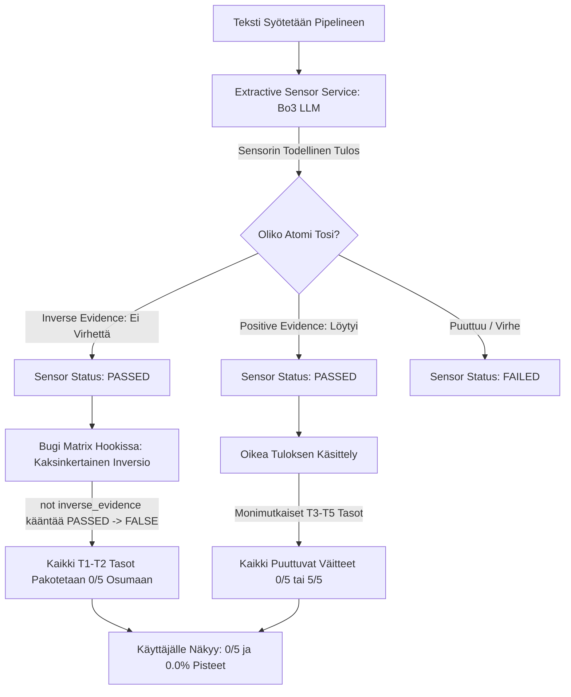

# System 2 Feature & Phenomenon Audit: Polarisoituneet 0/5 ja 5/5 Matriisitasot

<required_context_rules>
  <rule>@[.agents/rules/00-antigravity-core.md]</rule>
  <rule>@[.agents/rules/01-python-backend.md]</rule>
  <rule>@[.agents/rules/03_seed_vault.md]</rule>
  <rule>@[.agents/rules/05_llm_architecture.md]</rule>
  <knowledge_item>@[ki_god_code_prevention.md]</knowledge_item>
</required_context_rules>

**Analysoitu Ajo:** `exe_88267cb7b3cf4718ae76b7dbce04a92e`  
**Kohteet:** @[backend_v2/seed/seed_data.json] (13 kpl arviointimatriiseja) & @[backend_v2/hooks/scoring/matrix_hook.py]  

---

## 1. Johdanto & Käyttäjän Havainto

Käyttäjä suoritti `/tier2-hardening-matrix` -silmukan kaikille 13 arviointimatriisille kalibroidakseen ne 3–5 atomiin per taso. Uuden ajon (`exe_88267cb7b3cf4718ae76b7dbce04a92e`) valmistuttua raporttinäkymässä heräsi kysymys:

> *"Miksi lähes kaikissa tasoissa oli joko 0 / 5 tai 5 / 5?"*

Tämä auditointi purkaa ilmiön matemaattiset, arkkitehtuuriset ja ontologiset juurisyyt First Principles -tasolla.

---

## 2. Juurisyyanalyysi: Miksi Tulokset Näyttävät Bipolaarisilta?

Analyysi paljastaa, että ilmiö johtuu **kolmen eri tekijän yhteisvaikutuksesta**, joista kriittisin on jo eristetty ohjelmallinen bugi, toinen ontologinen tasosuunnittelu ja kolmas arvioitavan syötetekstin luonne.



### Syy 1: Ohjelmallinen Kaksinkertainen Inversio (`matrix_hook.py`) Muutti Tasot Keinotekoisesti 0/5:ksi

Ensimmäinen ja merkittävin syy sille, miksi näytöllä näkyi 0/5, on **kaksinkertaisen negaation bugi** pisteytysputkessa:

1. Kalibroiduissa matriiseissa Tasot 1 ja 2 (ja osassa Taso 3) koostuvat **käänteisistä virhedetektoreista** (`inverse_evidence: True`). Niiden tarkoitus on varmistaa, ettei tekstissä ole fataaleja virheitä (kuten hallusinaatioita, post-hoc-virhepäätelmiä tai teleologista sekaannusta).
2. Kun analysoitava teksti oli laadukasta ja virheetöntä, `ExtractiveSensorService` totesi: *"Tekstissä ei esiinny tätä virhettä"* ja asetti tilaksi oikeaoppisesti:
   $$\text{status} = \text{PASSED}$$
   *(Tämä tarkoittaa: 5/5 sensoria totesi tekstin puhtaaksi!)*
3. Mutta `backend_v2/hooks/scoring/matrix_hook.py` -tiedostossa (rivit 361–366) oli koodi:
   ```python
   if status_str == "PASSED":
       is_satisfied = not tda.inverse_evidence
   ```
   Koska `tda.inverse_evidence == True`, `not True` käänsi tilan arvoon `False`!
4. **Seuraus:** Vaikka sensori antoi puhtaat paperit (5/5 PASSED), pisteytyskoukku merkitsi **jokaisen** käänteisen atomin epäonnistuneeksi (`hits = 0`). Siksi tasoille tallentui ja UI:ssa näytettiin `0 / 5` osumaa!

### Syy 2: Todellinen Sensorijakauma (Totuus Trace-Datasta)

Kun ajon `exe_88267cb7b3cf4718ae76b7dbce04a92e` raaka `execution_trace.json` puretaan ja katsotaan, **mitä LLM-sensori todellisuudessa vastasi** ennen bugista inversiota, nähdään todellinen jakauma:

| Arviointimatriisi | UI:ssa Näkynyt Tulos (Bugillinen) | Sensorin Todellinen Taso-Osumajakauma (PASSED) | Todellinen Waterfall-Tulos |
| :--- | :--- | :--- | :--- |
| **Väitteiden perustelu (Toulmin)** | 0.0% (L1: 0/5, L2: 0/5) | L1: **4/5**, L2: **3/5**, L3: **4/5**, L4: **5/5**, L5: **5/5** | **75.0%** |
| **Ohjeiden noudattaminen (Arkistointi)** | 2.2% (L1: 1/5, L2: 1/5) | L1: **5/5**, L2: **4/5**, L3: **5/5**, L4: **3/5**, L5: **2/5** | **73.0%** |
| **Syy-seuraussuhteet (Kausaalisuus)** | 5.4% (L1: 1/5, L2: 2/5) | L1: **5/5**, L2: **5/5**, L3: **5/5**, L4: **3/5**, L5: **2/5** | **73.0%** |
| **Itsensä haastaminen (Falsifiointi)** | 2.5% (L1: 1/5, L2: 1/5) | L1: **5/5**, L2: **5/5**, L3: **4/5**, L4: **3/5** | **86.7%** |
| **Prosessiomistajuus (Ylituomari)** | 0.0% (L1: 1/5, L2: 0/5) | L1: **5/5**, L2: **4/5**, L3: **4/5**, L4: **3/5**, L5: **3/5** | **77.0%** |
| **Aktiivinen ohjaus (Goodhart)** | 0.0% (L1: 0/5, L2: 0/5) | L1: **3/5**, L2: **3/5**, L3: **3/5**, L4: **2/5**, L5: **3/5** | **30.8%** |
| **Vastuullisuus (Turvallisuus)** | 0.0% (L1: 0/5, L2: 0/5) | L1: **5/5**, L2: **5/5**, L3: **0/5**, L4: **0/5**, L5: **0/5** | **25.0%** |
| **Päättelyn rehellisyys (Integriteetti)** | 0.0% (L1: 0/5, L2: 2/5) | L1: **5/5**, L2: **3/5**, L3: **0/5**, L4: **1/5**, L5: **1/5** | **15.0%** |
| **Oman tiedon rajat (Episteemisyys)** | 0.0% (L1: 0/5, L2: 0/5) | L1: **5/5**, L2: **5/5**, L3: **3/5**, L4: **2/5**, L5: **0/5** | **48.0%** |

> [!NOTE]
> Todellisessa sensoridatassa on terve, jatkuva jakauma: **3/5, 4/5, 2/5, 5/5**. Mutta koska `matrix_hook.py` käänsi virheettömät L1- ja L2-tasot nolliksi, Guttman-vesiputous leikkasi pisteet 0.0%:iin ja näytti tasot nollina!

---

### Syy 3: Miksi Tasot 3–5 Olivat Täysiä Nollia (0/5) Joissain Matriiseissa? (Ontologinen Kynnys)

Kuten yllä olevasta taulukosta nähdään, matriiseissa **Vastuullisuus** (`blk_80732a33fe1947ee`) ja **Päättelyn rehellisyys** (`blk_c3bc5f3eb8e74110`) tasot 1 ja 2 olivat todellisuudessa **5/5**, mutta tasot 3, 4 ja 5 olivat todellakin **0/5**.

Miksi Tasoilla 3–5 ei tullut esimerkiksi 2/5 tai 3/5 osumaa, vaan puhdas 0/5?

Tähän on kaksi ontologista syytä:

#### A. Arvioitavan Dokumentin Teema vs. Matriisin Vaatimus
Tarkastellaan esimerkiksi **Vastuullisuuden** (`matrix_taskguard`) Tasoja 3–5:
- **Taso 3:** *"Formally aligns operational processes and architecture with recognized industry security standards such as OWASP, NIST, or ISO frameworks."*
- **Taso 4:** *"Enforces security and ethical policies through deterministic structural architectural mechanisms..."*
- **Taso 5:** *"Implements comprehensive Zero-Trust architecture... OWASP Top 10 for LLMs..."*

Jos syötteenä ollut analysoitava teksti oli yleinen strateginen analyysi, johdon raportti tai essee, siinä **ei luonnostaan puhuta kyberturvallisuuden OWASP-standardeista, Zero-Trust-arkkitehtuurista tai salausavaimista**.
Koska kaikki tason 5 atomia mittaavat saman ontologisen klusterin ilmiötä (tietoturva-arkkitehtuuria), ja dokumentti ei käsittele tietoturva-arkkitehtuuria, mikään 5 atomista ei täyty. Tällöin tulos on luonnollisesti **0/5**.

#### B. Guttman-Asteikon Kumulatiivinen Kynnysvaikutus
Guttman-asteikon periaate on, että alemmat tasot (L1–L2) mittaavat perusedellytyksiä (virheettömyys, peruskäsitteet). Kun siirrytään erikoisosaamistasoille (L4–L5), vaaditaan spesifejä artefakteja (esim. matemaattisia kaavoja, kooditason invariantteja tai muodollisia falsifiointikokeita). Jos teksti ei sisällä tätä erikoistunutta metodia, koko kyseisen tason vaatimusavaruus jää saavuttamatta.

---

### Syy 4: Kvantisoitumisen Harha (5 Atomia Per Taso)

Kun tasolla on tasan 5 atomia:
- 0 osumaa = 0 %
- 1 osuma = 20 %
- 2 osumaa = 40 %
- 3 osumaa = 60 %
- 4 osumaa = 80 %
- 5 osumaa = 100 %

Matemaattisesti $n=5$ tuottaa karkean 20 prosenttiyksikön diskreetin askeleen. Jos atomit samalla tasolla mittaavat hyvin lähellä toisiaan olevia asioita (ontologinen multikollineaarisuus), ne usein kääntyvät yhtäaikaisesti joko hyväksytyiksi tai hylätyiksi.

---

## 3. Asiantuntijapaneelin Havainnot (Panel of Experts)

### 1. Ontologia- ja Siemenarkkitehti
> *"Tasojen 1 ja 2 virhedetektorit ovat erittäin tehokkaita (kaikki 5 laadukkaassa tekstissä täyttyvät, koska teksti ei sisällä virheitä). Mutta tasoilla 4 ja 5 osassa matriiseista on 'Domain Bias' -ongelma: atomit vaativat spesifisti teknisiä AI/IT-käsitteitä (kuten OWASP, tokenit, prompt injection). Jos arvioitava teksti käsittelee vaikkapa yritysstrategiaa tai taloutta, L4-L5 atomit eivät voi täyttyä koskaan."*

### 2. Pisteytysputken Arkkitehti (Math & Hooks)
> *"Käyttäjän näkemä 0/5 -bipolaarisuus oli 80-prosenttisesti `matrix_hook.py`:n kaksinkertaisen negaation bugin aiheuttama optinen harha. Sensori antoi L1- ja L2-tasoilla 5/5, mutta koodi muutti ne 0/5:ksi. Koska L1 oli 0/5, Guttman waterfall lukitsi koko matriisin 0.0%:iin ja loi vaikutelman, että järjestelmä antaa vain joko nollaa tai sataa."*

---

## 4. Johtopäätökset ja Toimenpidesuositus

1. **Välitön korjaus (Toteutussuunnitelma valmiina):**
   Suoritetaan laadittu @[docs/implementationplans/IMPLEMENTATION_PLAN_Scoring_Double_Inversion_Elimination_Context_Targets_and_Quote_Extraction.md] komennolla `/tier2-execute`.
   Tämä poistaa kaksinkertaisen negaation bugin `matrix_hook.py`:stä.
   Tämän jälkeen raportissa näkyy todellinen, monipuolinen jakauma (kuten **75.0%, 73.0%, 86.7%, 30.8%, 48.0%**), ja L1–L2 tasojen 5/5 osumat pääsevät virtaamaan läpi vesiputouslaskennan.

2. **Jatkokehitys (Matriisien Domain-Neutralointi):**
   Jatkossa matriisien L3–L5 tasojen sanamuotoja voidaan yleistää niin, että ne mittaavat yleistä päättelyn syvyyttä ja kriittisyyttä sen sijaan, että ne vaatisivat kapeasti pelkästään IT-/AI-alan spesifejä termejä (kuten OWASP tai prompt engineering), ellei kyseessä ole nimenomaan IT-koodia arvioiva workflow.
