# Data Management & Databases

This document describes the data management architecture for the workflow engine. The system is fundamentally **data-driven**, meaning its business logic, prompts, and operational flows are defined in the database rather than being hardcoded in the application.

## Data Structure

All system data is located in the `data/` directory. This file-based approach simplifies configuration, backup, and version control.

### 1. Initialization Data (`data/seed_data.json`)

This file contains the system's "factory settings" and defines its core logic. It is the single source of truth for the engine's configuration. It includes:

*   **Components**: Definitions for prompt templates, tools, and other reusable entities.
*   **Steps**: Individual workflow steps, including their input/output schemas and execution logic.
*   **Workflows**: The sequence and linkage of steps that form a complete process.

**Usage:**
On system initialization or database reset, `seed_data.json` is loaded into the runtime database. This design allows system behavior to be modified by changing the JSON file without altering application code.

### 2. Runtime Database (`data/db.json`)

The system uses **TinyDB**, a lightweight, document-oriented database stored in the `db.json` file.

It contains two primary categories of data:
1.  **Configuration**: A live copy of the content from `seed_data.json` (components, steps, workflows). This data can be modified at runtime via the UI to adjust system behavior dynamically.
2.  **Execution History**: A complete record of every workflow execution is stored here, including:
    *   User inputs
    *   Intermediate results and responses from each step
    *   The final generated output
    *   Timestamps and status information

> **Note:** The `db.json` file can grow significantly in size over time, as it stores a complete history of all workflow executions.

### 3. Fragments (`data/fragments/`)

This directory contains reusable JSON-formatted text snippets used to construct prompts. Examples include:

*   `global_rules.json`: Global operational rules (e.g., "Do not use external tools without permission").
*   `style_guides.json`: Instructions on tone and format (e.g., "Respond in a professional tone").
*   `evaluation_rubric.json`: Standardized evaluation criteria.
*   `common_instructions.json`: Other shared methodological instructions.

This approach avoids content duplication. A rule or instruction can be referenced by multiple prompts; updating the fragment file ensures the change is propagated everywhere it is used.

### 4. Templates (`data/templates/`)

This directory contains **Jinja2** templates (`.j2`) that define the structure of prompts sent to the Large Language Model (LLM).

For example, `generic_prompt.j2` might contain:
```jinja2
{{ GLOBAL_INSTRUCTIONS }}

TASK: {{ task_description }}
...
FOLLOW THESE RULES:

- {{ rule }}

```

The system dynamically combines the following to construct a complete prompt:
1.  Configuration data from the runtime database (`db.json`).
2.  Text snippets from the `fragments/` directory.
3.  A structural template from the `templates/` directory.

### 5. Uploads (`data/uploads/`)

This directory serves as temporary storage for files uploaded by the user through the UI, such as PDF or text documents.

The process is as follows:
1.  A file is uploaded to this directory.
2.  The system processes the file (e.g., extracts text from a PDF).
3.  The extracted content is used as an input for a workflow.
4.  The folder can be cleaned periodically, either automatically or manually.

## Detailed Database Usage & Structure

This section details how data is retrieved from the database and used to construct prompts during a workflow execution.

### 1. Runtime Prompt Assembly

When the `WorkflowEngine` executes a step, it assembles the final prompt dynamically.

*   **Input**: The engine uses definitions stored in `db.json`, which reference raw data from `fragments/*.json` and `templates/*.j2`.
*   **Process**:
    1.  The engine loads the appropriate Jinja2 template (`.j2`) for the current step.
    2.  It fetches the required text snippets (`fragments`) and other configuration data from the database.
    3.  The Jinja2 engine renders the template, injecting the fragments and other dynamic data (e.g., user input, results from a previous step).
*   **Output**: A fully-formed prompt ready to be sent to the LLM.

### 2. Dynamic Schema Injection

To ensure the LLM produces valid JSON that the system can parse, we use a **Dynamic Schema Injection** mechanism.

*   **The Problem**: The LLM needs to know the exact JSON structure to output (e.g., fields, data types, required keys).
*   **The Solution**: Prompt templates contain special placeholders that reference Pydantic models defined in the application code, for example:
    `[SCHEMA: MyPydanticModel]`
*   **Execution**: When the `WorkflowEngine` prepares a step:
    1.  It reads the prompt text from the database.
    2.  It detects a `[SCHEMA: ...]` tag.
    3.  It looks up the corresponding Pydantic model in the application's `schemas` module.
    4.  It generates the **JSON Schema** for that model and replaces the tag with the schema definition.

**Example:**
If a prompt contains `[SCHEMA: Hypothesis]`, the engine injects:
```json
{
  "properties": {
    "id": {"type": "string"},
    "statement_text": {"type": "string"},
    "is_evidence_found": {"type": "boolean"}
  },
  "required": ["id", "statement_text", "is_evidence_found"]
}
```
This guarantees that the LLM's output conforms to the data structures expected by the application code.

### 3. Citation & Source Tracking

The database can also track academic or methodological sources for each prompt component.

*   **Structure**: Each component in `seed_data.json` can have a `citation` field (e.g., *"Toulmin, S. (1958). The Uses of Argument"*).
*   **Injection**: During prompt assembly, the `WorkflowEngine` can automatically append `[Source: Citation Text]` to the relevant instruction.
*   **Collection**: The engine collects all unique citations used in a workflow run and passes them to a final reporting step, which can use this information to generate a "Bibliography" or "References" section in the final output.

## Data Flow Summary


## Data Synchronization Flows

The following diagram illustrates how data flows between the Mock Database, Production Database, and the file system (`seed_data.json`) during various management operations.

```mermaid
graph TD
    subgraph Filesystem
        SEED[seed_data.json]
    end

    subgraph Databases
        MOCK_DB[(db_mock.json)]
        PROD_DB[(db.json)]
    end

    subgraph UI Actions
        SAVE[Save State to Seed]
        RESET[Reset DB from Seed]
        DEPLOY_M2P[🚀 Deploy Mock to Prod]
        DEPLOY_P2M[⬅️ Deploy Prod to Mock]
    end

    %% Save State (Context dependent)
    SAVE -.->|If Mock Mode| MOCK_DB
    SAVE -.->|If Prod Mode| PROD_DB
    MOCK_DB -->|Export| SEED
    PROD_DB -->|Export| SEED

    %% Reset (Context dependent)
    RESET -.->|If Mock Mode| MOCK_DB
    RESET -.->|If Prod Mode| PROD_DB
    SEED -->|Import| MOCK_DB
    SEED -->|Import| PROD_DB

    %% Deploy Mock to Prod
    DEPLOY_M2P -->|1. Export from Mock DB| MOCK_DB
    MOCK_DB -->|2. Update seed file| SEED
    SEED -->|3. Import to Prod DB| PROD_DB

    %% Deploy Prod to Mock
    DEPLOY_P2M -->|1. Export from Prod DB| PROD_DB
    PROD_DB -->|2. Update seed file| SEED
    SEED -->|3. Import to Mock DB| MOCK_DB

    style SEED fill:#f9f,stroke:#333,stroke-width:2px
    style MOCK_DB fill:#bbf,stroke:#333,stroke-width:2px
    style PROD_DB fill:#bfb,stroke:#333,stroke-width:2px
```

