# Data Management & Databases

This document describes the data management architecture of the Cognitive Quorum system. The system is **data-driven**, meaning its business logic, prompts, and workflows are defined in the database rather than hardcoded in the application.

## Data Structure

All system data is located in the `data/` directory. This file-based approach simplifies backup and version control.

### 1. Initialization Data (`data/seed_data.json`)

This file contains the system's "factory settings" and defines its core logic. It includes:

*   **Components**: Definitions for agents, tools, and prompts.
*   **Steps**: Individual workflow steps, including their input/output schemas and execution hooks.
*   **Workflows**: The sequence and linkage of steps that form a complete process.

**Usage:**
On system initialization or database reset, `seed_data.json` is loaded into the runtime database. This design allows system behavior to be modified by changing the JSON file without altering application code.

### 2. Runtime Database (`data/db.json`)

The system uses **TinyDB**, a lightweight, document-oriented database stored in the `db.json` file.

It contains two primary categories of data:
1.  **Configuration**: A live copy of the content from `seed_data.json` (components, steps, workflows). This data can be modified at runtime to adjust system behavior dynamically.
2.  **Execution History**: A complete record of every analysis run is stored here, including:
    *   User inputs
    *   Intermediate results and responses from each agent
    *   The final generated report
    *   Timestamps and status information

> **Note:** The `db.json` file can grow significantly in size over time, as it stores a complete history of all execution runs.

### 3. Fragments (`data/fragments/`)

This directory contains reusable JSON-formatted text snippets used to construct prompts. Examples include:

*   `mandates.json`: High-level system goals (e.g., "Employ System 2 Thinking").
*   `rules.json`: Global operational rules (e.g., "Do not use external tools without permission").
*   `criteria.json`: Standardized evaluation criteria (e.g., a BARS matrix).
*   `protocols.json` & `methods.json`: Other methodological instructions.

This approach avoids content duplication. A rule or mandate can be referenced by multiple prompts; updating the fragment file ensures the change is propagated everywhere it is used.

### 4. Templates (`data/templates/`)

This directory contains **Jinja2** templates (`.j2`) that define the structure of agent prompts.

For example, `prompt_analyst.j2` might contain:
```jinja2
{{ MASTER_INSTRUCTIONS }}

PHASE 2: ANALYST AGENT
...
FOLLOW THESE RULES:

- {{ rule }}

```

The system dynamically combines the following to construct a complete prompt for the Large Language Model (LLM):
1.  Configuration data from the runtime database (`db.json`).
2.  Text snippets from the `fragments/` directory.
3.  A structural template from the `templates/` directory.

### 5. Uploads (`data/uploads/`)

This directory serves as temporary storage for files uploaded by the user through the UI, such as PDF documents.

The process is as follows:
1.  A file is uploaded to this directory.
2.  The system processes the file (e.g., extracts text from a PDF).
3.  The extracted content is used as an input for a workflow.
4.  The folder can be cleaned periodically, either automatically or manually.

## Detailed Database Usage & Structure

This section details how data is retrieved from the database and injected into the AI agents during execution.

### 1. Prompt Construction (The "Seeding" Phase)

Before the system runs, the `seeder.py` script compiles the raw data into usable prompts.

*   **Input**: `fragments/*.json` (Raw text snippets) + `templates/*.j2` (Structure).
*   **Process**: The Jinja2 engine renders the templates, injecting the fragments (e.g., replacing `{{ rules.RULE_1 }}` with the actual text of Rule 1).
*   **Storage**: The fully rendered text is stored in the `components` table of `db.json` with a specific ID (e.g., `PROMPT_ANALYST`).

### 2. Dynamic Schema Injection (Runtime)

To ensure the AI produces valid JSON that the system can understand, we use a **Dynamic Schema Injection** mechanism.

*   **The Problem**: The AI needs to know exactly what JSON fields to output (e.g., `score`, `reasoning`, `evidence_id`).
*   **The Solution**: In the prompt templates, we use special placeholders like:
    `[Ks. schemas.py / TuomioJaPisteet]`
*   **Execution**: When `WorkflowEngine` prepares a step:
    1.  It reads the prompt text from `db.json`.
    2.  It detects the `[Ks. schemas.py / ...]` tag.
    3.  It looks up the corresponding Pydantic model in `backend/schemas.py`.
    4.  It generates the **JSON Schema** for that model and replaces the tag with the actual schema definition.

**Example:**
If the prompt contains `[Ks. schemas.py / Hypoteesi]`, the engine injects:
```json
{
  "properties": {
    "id": {"type": "string"},
    "vaite_teksti": {"type": "string"},
    "loytyyko_todisteita": {"type": "boolean"}
  },
  "required": ["id", "vaite_teksti", "loytyyko_todisteita"]
}
```
This guarantees that the AI's output matches the Python code's expectations.

### 3. Citation & Source Tracking

The database also tracks the academic or methodological sources for each prompt component.

*   **Structure**: Each component in `seed_data.json` can have a `citation` field (e.g., *"Toulmin, S. (1958). The Uses of Argument"*).
*   **Injection**: When the `WorkflowEngine` assembles the System Instruction, it automatically appends `[Lähde: Citation Text]` to the prompt.
*   **Collection**: The engine collects all unique citations used in a workflow run and passes them to the **XAI Reporter** (Phase 9), which generates the final "Bibliography" section in the report.

## Data Flow Summary


## Data Synchronization Flows

The following diagram illustrates how data flows between the Mock Database, Production Database, and the file system (`seed_data.json`) during various management operations.

```mermaid
graph TD
    subgraph Filesystem
        SEED[seed_data.json]
        TEMPLATES[templates/*.j2]
    end

    subgraph Databases
        MOCK_DB[(db_mock.json)]
        PROD_DB[(db.json)]
    end

    subgraph UI Actions
        SAVE[Save State to Seed]
        RESET[Reset DB from Seed]
        DEPLOY_M2P[🚀 Deploy Mock to Prod]
        DEPLOY_P2M[⬅️ Deploy Prod to Mock]
    end

    %% Save State (Context dependent)
    SAVE -.->|If Mock Mode| MOCK_DB
    SAVE -.->|If Prod Mode| PROD_DB
    MOCK_DB -->|Export| SEED
    PROD_DB -->|Export| SEED

    %% Reset (Context dependent)
    RESET -.->|If Mock Mode| MOCK_DB
    RESET -.->|If Prod Mode| PROD_DB
    SEED -->|Import| MOCK_DB
    SEED -->|Import| PROD_DB

    %% Deploy Mock to Prod
    DEPLOY_M2P -->|1. Export Mock| MOCK_DB
    MOCK_DB -->|2. Update| SEED
    SEED -->|3. Overwrite| PROD_DB

    %% Deploy Prod to Mock
    DEPLOY_P2M -->|1. Export Prod| PROD_DB
    PROD_DB -->|2. Update| SEED
    SEED -->|3. Overwrite| MOCK_DB

    style SEED fill:#f9f,stroke:#333,stroke-width:2px
    style MOCK_DB fill:#bbf,stroke:#333,stroke-width:2px
    style PROD_DB fill:#bfb,stroke:#333,stroke-width:2px
```

