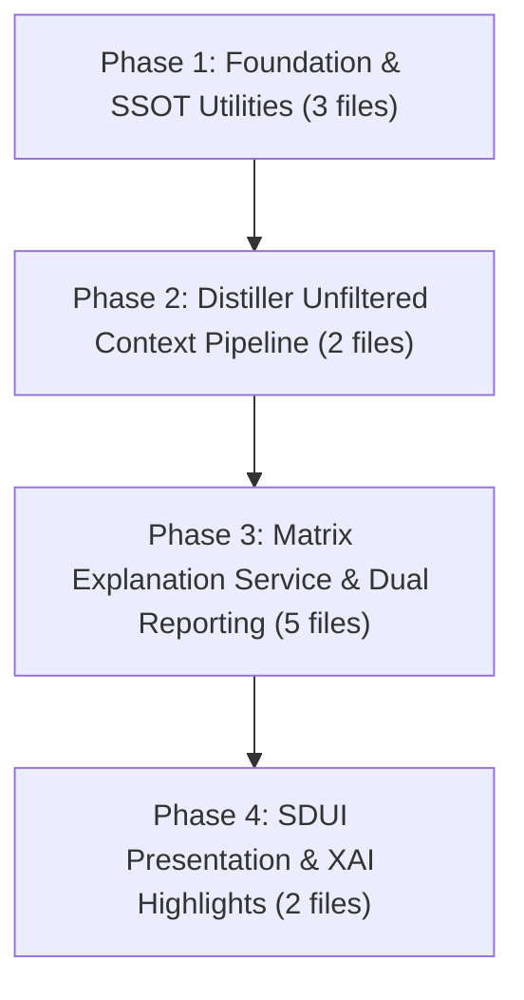

# EPIC 143: Synthesis Matrix Explanation Timing Fix & Architecture Hardening

## 1. Goal Description & Background (Objective & Problem Statement)

### Business Objective
Fix the architectural defect where `synthesis_distiller.py` conflates SDUI Presentation Layout filtering (`target_blocks`) with LLM Synthesis Context, starving both `MatrixExplanationService` (zero evidence quotes) and the LLM prompt's `<source>` blocks (`distilled_inputs` losing all cognitive sensor findings). Fix the illegitimate `target_blocks` filter loop in `synthesis_distiller.py` by removing it completely (passing all upstream cognitive sensors and matrices through unconditionally to LLM synthesis, while allowing Phase 3 SDUI adapters and `<section_instruction targets="...">` to handle visual and section-level scoping), hoist and unify `target_locale` validation at the start of the distiller hook to eliminate undefined variable and scope risks, create a centralized, pure SSOT generic utility `backend_v2/utils/ranked_round_robin.py` implementing `ranked_round_robin_select[T]` with $O(N \log N + K)$ algorithmic complexity via native $O(1)$ tail `.pop()` extraction and inverted sorting, harden `matrix_explanation_service.py` to eliminate 12 legacy anti-patterns, implement **Status-Aware Dual Reporting** (segregating `SUPPORTING EVIDENCE` for `PASSED` atoms and `UNMET CRITERIA / DEFICITS` for `FAILED` atoms to eliminate Positivity Bias), implement **Ranked Round-Robin Claim Diversity** in `matrix_explanation_service.py` (ranking quotes by length and unmet criteria by scale level) to prevent single-claim quote starvation, harden `xai_highlights_adapter.py` by integrating `ranked_round_robin_select` to curate highlights across active extension types ranked by informativeness/length (eliminating UI accordion Primacy Bias and Category Starvation without requiring Flutter DTO or database schema changes), filter low-substance quote fragments (< 15 characters), unify quote and criteria limits under centralized SSOT settings (`max_synthesis_quote_length` = 300, `max_synthesis_quotes_per_matrix` = 5, `max_synthesis_unmet_criteria_per_matrix` = 5) in `settings.py` to eliminate LLM Context Window Saturation risks, eliminate $O(N)$ settings lookup overhead via method-level hoisting, enforce strict multi-language support by requiring mandatory `target_locale: str` across all production and test call-sites (Zero Backwards Compatibility), update Knowledge Item documentation, and enforce strict compliance with `@[ki_god_code_prevention.md]`.

### Problem Statement
The synthesis pipeline suffers from six distinct architectural defects that collectively degrade the quality of LLM synthesis outputs and SDUI rendering:

1. **Context Starvation (Phase 2 Synthesis):** `synthesis_distiller.py` filters `available_dtos` against `output_profile.layouts[].target_blocks`, a Phase 3 SDUI directive, stripping all cognitive sensor findings from the LLM synthesis prompt.
2. **Positivity Bias (Matrix Explanations):** The mutually exclusive `if quotes: ... elif claims:` branch in `MatrixExplanationService` hides failed criteria when any passing quote exists.
3. **Single-Claim Starvation:** Linear truncation (`[:5]`) exhausts the quote budget on the first claim, starving remaining claims.
4. **Primacy Bias (XAI Highlights):** Raw arrival-order processing in `xai_highlights_adapter.py` exhausts visual capacity on early extension categories.
5. **Anti-Pattern Proliferation:** Legacy duck-typing (`isinstance`, `hasattr`, `getattr`, `.get()`) and raw string concatenation violate `the_zero_compromise_pledge`.
6. **Scattered Hardcoded Limits:** Magic numbers (`[:300]`, `[:5]`) duplicated across services without centralized SSOT settings.

### Source Implementation Plan & Phase Decomposition
This Epic is derived deterministically from @[docs/IMPLEMENTATION_PLAN_Synthesis_Matrix_Explanation_Timing_Fix.md] (Steps 0-8, 485 lines, 12 target files). To prevent Context Amnesia (`context_amnesia_prevention`) and guarantee bite-sized, independently verifiable execution units with atomic quality gates (`atomic_checkpoint_mandate`), the scope is decomposed into **four decoupled phases** (each touching 2 to 5 files maximum):



### Root Cause Analysis

> [!IMPORTANT]
> The following Root Cause Analysis items are preserved verbatim from the source implementation plan. See @[docs/IMPLEMENTATION_PLAN_Synthesis_Matrix_Explanation_Timing_Fix.md] (lines 33-57) for full detail with exact line references.

1. **Conflation of SDUI Presentation Filtering with Cognitive Synthesis Context (RCA-1):**
   In @[backend_v2/services/orchestrator/synthesis_distiller.py] (lines 159-330), incoming `available_dtos` from `inputs["steps"]` was filtered in-place against `output_profile.layouts[].target_blocks`. Per @[backend_v2/models/v2_core.py] (lines 1270-1308), `target_blocks` is strictly an SDUI layout directive ("Optional explicit block IDs to plot, filtering and ordering the axes") for frontend widgets and matrix charts. Cognitive sensor steps (specifically and exhaustively: analyst, profiler, logician, falsifier, fact checker, performativity detector, archivist, judge, coach, and causal analyst) are upstream analysis nodes whose `block_id` values are never in `target_blocks`.
2. **Dual Context Deprivation (RCA-2):**
   - **Downstream Matrix Quotes Deprivation:** `MatrixExplanationService.assemble_matrices_to_explain()` received the pruned list. The `global_quotes_map` was built from an empty set of sensor results, causing all matrices to produce `"No direct evidence quotes extracted for this matrix."`
   - **LLM `<source>` Context Deprivation:** `consolidated_distilled_parts` (`distilled_inputs`) iterated over the pruned list. Consequently, `<source id="DOC-X">` blocks passed into the LLM prompt's `DATA TO SYNTHESIZE` contained only boolean matrix results, completely stripping all cognitive sensor findings, exact quotes, and semantic reasoning from the synthesis prompt.
3. **Positivity Bias & Single-Claim Starvation in Matrix Explanations (RCA-3):**
   In @[backend_v2/services/orchestrator/matrix_explanation_service.py] (lines 123-136), justifications used a mutually exclusive `if unique_quotes: ... elif evaluated_claims:` branch. 
    - **Positivity Bias:** In Quorum's Null Hypothesis architecture (`@[ki_matrix_boolean_evaluation_strictness.md]`), `PASSED` atoms have verbatim quotes while `FAILED` atoms have `source_quote = None`. If a matrix has 1 `PASSED` atom and 9 `FAILED` atoms, the single quote triggered `if unique_quotes:`, completely hiding the 9 failed criteria. The LLM received a low score (specifically and exhaustively: a fixed 10% normalized score) with exclusively positive supporting quotes, causing hallucinated justifications or synthesis contradictions.
    - **Blind Truncation & Starvation:** Slicing claims linearly (`[:5]`) truncated higher-level or barrier criteria situated later in the scale definition. If one claim had 5 quotes, linear slicing took all 5 quotes from that single claim, starving remaining claims of representation.
4. **Primacy Bias & Category Starvation in XAI Highlights SDUI Adapter (RCA-4):**
    In @[backend_v2/services/sdui/adapters/xai_highlights_adapter.py] (lines 65-130), incoming highlights are processed in raw arrival order and appended to accordions until `len(accordion.children) < max_lines`. If earlier extension categories (specifically and exhaustively: the `coaching` extension category) contain many items, they exhaust visual capacity before later critical categories (specifically and exhaustively: `falsification` or `risk_flag` extension categories) are evaluated, creating **Primacy Bias** and **Category Starvation** in the UI. Furthermore, the adapter relies on duck-typing (`isinstance(item, dict)`, `.get()`, `getattr()`) violating `the_zero_compromise_pledge`.
5. **Anti-Pattern Proliferation, Raw String Concatenation & Hardcoded Language (RCA-5):**
   @[backend_v2/services/orchestrator/matrix_explanation_service.py] (lines 15-145) contains legacy anti-patterns (`isinstance` checks on payload dicts, `hasattr` reflection, `getattr` with fallback defaults, `.get()` defaults, raw string concatenation with `+` violating `naked_prompt_injection`, and `try/except Exception: continue` catch-alls) that violate `the_zero_compromise_pledge`, `the_duct_tape_ban`, and `naked_prompt_injection`. Additionally, `claim.label.resolve("en")` hardcodes English, violating the Dual-Axis Localization architecture.
6. **$O(N)$ Settings Overhead & Scattered Limits (RCA-6):**
   Quote truncation limits were hardcoded as magic numbers (`[:300]`) in `SynthesisPayloadCompressor`, with potential duplication in `MatrixExplanationService`. Calling `get_settings()` repeatedly inside nested iteration loops introduces unnecessary function and cache overhead. Both quote character length, per-matrix quote counts, and per-matrix unmet criteria limits must be centralized in `Settings` and hoisted at the method entry.
7. **TypeError Hazard on Null Quotes (`source_quote: str | None`) (RCA-7):**
   In @[backend_v2/models/v2_core.py] (lines 1127-1160), `AtomResultDTO.source_quote` is nullable (`str | None`), especially when `contextual_override: True` forces `source_quote = None` or when an atom evaluation produces no verbatim quote. Attempting to measure length (`len(quote)`) or slice directly (`quote[:max_quote_len]`) without an explicit `None`-check (`quote-guard`) crashes the synthesis pipeline with `TypeError: object of type 'NoneType' has no len()` or `TypeError: 'NoneType' object is not subscriptable`.
8. **Missing Pydantic Validation Error Handling for Matrix Outputs (`LightweightMatrixOutput.model_validate`) (RCA-8):**
   In @[backend_v2/services/orchestrator/matrix_explanation_service.py] (lines 85-89), `LightweightMatrixOutput.model_validate(payload_to_validate, strict=False)` is executed without a `try/except` block. Because `LightweightMatrixOutput` enforces `model_config = ConfigDict(strict=True, extra="forbid")`, any unexpected payload format (specifically and exhaustively: malformed dicts from upstream failures, unanticipated extra keys beyond popped `results`, or invalid numerical ranges) will raise an unhandled `ValidationError` or `ValueError`, crashing the entire `MatrixExplanationService` and terminating the synthesis pipeline.
9. **AttributeError Hazard on Nullable Level Breakdown (`level_breakdown: dict[str, dict[str, int]] | None`) (RCA-9):**
   In @[backend_v2/models/dtos/lightweight_matrix.py] (line 55), `LightweightMatrixOutput.level_breakdown` is typed as `dict[str, dict[str, int]] | None = None`. In non-hierarchical matrices, sensor steps, or payloads without computed breakdowns, `level_breakdown` is `None`. Directly executing `for lvl, stats_raw in lw_matrix.level_breakdown.items():` without an explicit `if lw_matrix.level_breakdown:` check raises `AttributeError: 'NoneType' object has no attribute 'items'`, crashing matrix explanation assembly during synthesis.
10. **Nomenclature Inconsistency, Scope Hoisting & Test Suite Blast Radius (RCA-10):**
    In @[backend_v2/services/orchestrator/synthesis_distiller.py] (lines 268-273), `target_locale` was extracted from `state.metadata` into a local variable named `language` late in the function body (after layout filtering). The helper `_build_title_map` also accepted `language: str`. This created vocabulary dissonance (`language` vs `target_locale`) and hoisting risks where modifying execution order causes `NameError`. Furthermore, updating `MatrixExplanationService.assemble_matrices_to_explain` to require mandatory `target_locale: str` (no lazy defaults) breaks 6 existing test call-sites across `test_matrix_explanation_service.py` (5 tests) and `test_epic93_contract_verification.py` (1 test). The plan must explicitly hoist and normalize `target_locale` at the start of `synthesis_distiller_hook`, unify all internal identifiers to `target_locale`, and update 100% of test callers.
11. **Algorithmic Bottleneck in Ranked Round-Robin ($O(N)$ `pop(0)` Degenerating to $O(N^2)$) (RCA-11):**
    In naive round-robin selection, extracting items from the head of a Python list using `group_items.pop(0)` is an $O(M)$ operation where $M$ is the group length, due to contiguous array pointer shifting (`memmove`). When selecting $K \approx N$ items across large synthesis payloads, total extraction time degenerates to $\sum_{i=1}^N (N-i) = O(N^2)$. Per Tier 8 Feature Audit (`feature_audit_ranked_round_robin_o1.md`), the algorithm MUST be optimized by inverting internal sort order (`reverse = not reverse_rank`), placing the highest-priority item at the tail of the list and enabling native $O(1)$ `list.pop()` extractions to guarantee mathematical $O(N \log N + K)$ execution without memory reallocation overhead.
12. **Atomic Test Data Migration & Blast Radius Verification (Golden Master & SDUI Parity Analysis) (RCA-12):**
    Per Tier 8 Feature Audit (`feature_audit_atomic_test_data_migration.md`), the introduction of Status-Aware Dual Reporting (`SUPPORTING EVIDENCE` for `PASSED` atoms and `UNMET CRITERIA / DEFICITS` for `FAILED` atoms) operates strictly in **Phase 2 (Synthesis Distillation)** as an intermediate prompt text formatting optimization (`MatrixExplanationContextDTO.justification: str`). It does **NOT** alter the downstream SDUI JSON payload structure (`MatrixScorecardRowDTO.row_explanation: str`), which remains a single string. Consequently, Golden Master serialization tests (@[backend_v2/tests/e2e/test_golden_master_sdui.py] and @[backend_v2/tests/integration/test_sdui_semantic_parity.py]) remain structurally non-breaking. However, an atomic test data migration IS required for direct unit tests (@[backend_v2/tests/unit/services/orchestrator/test_matrix_explanation_service.py]) that assert legacy string literals, and contract verification tests (@[backend_v2/tests/unit/test_epic93_contract_verification.py]) requiring mandatory `target_locale: str`.

---

## 2. Architectural Impact & Compliance Matrix

### Architectural Principle: Layered Synthesis Data Access

> [!IMPORTANT]
> **MANDATE (Synthesis Context Preservation):** The LLM Synthesis Phase (Phase 2) MUST have access to the **complete execution state** (all matrices and all cognitive sensors). The UI rendering selections (`OutputProfile.layouts` → `target_blocks`) dictate ONLY what is painted on the screen (Phase 3). They MUST NEVER be used to prune the `available_dtos` fed into the Synthesis Distiller or the LLM synthesis prompt.

**Layered Data Access Per Synthesis Component:**

| Component | Data Scope | Reason |
|---|---|---|
| **Executive Summary** (`SynthesisOutputDTO.user_role`, content_blocks) | **ALL** data (`distilled_inputs` = all `<source>` blocks from all matrices and all sensors) | The executive summary draws the big picture across the entire evaluation. Filtering any data would blind the LLM and force hallucinations. |
| **Section-Level Synthesis** (`SynthesisOutputDTO.section_syntheses`) | **ALL** data available, but the LLM is instructed via `<section_instruction targets="Matrix A, Matrix B">` to focus on specific matrices per layout | The LLM receives the complete `distilled_inputs` but is guided by the `targets` attribute in each `<section_instruction>` XML block (assembled from `layout.target_blocks` titles in `worker.py` lines 875-882). This keeps the LLM's full context intact while directing its attention per section. |
| **XAI Highlights** (`SynthesisOutputDTO.xai_highlights`) | **ALL** data, scoped by `<xai_curation_mandate>` listing requested extension types | XAI highlights are cross-cutting insights synthesized from the entire evaluation (all matrices, all sensors). The `visible_block_extensions` and `visible_workflow_extensions` on the Output Profile only control which extension *types* to produce, not which source data to use. |
| **Matrix Row Explanations** (`MatrixExplanationsResult.explanations`) | `matrices_to_explain` (ALL matrices from `MatrixExplanationService`) + `distilled_inputs` | Row explanations must cover every evaluated matrix because the summary table always displays all matrices. The Phase 3 SDUI layer (specifically `MatrixGraphsAdapter` and `MatrixSummaryTableAdapter`) uses `layout.target_blocks` to select which matrices to *visually render*. |
| **Phase 3 SDUI Adapters** (visual rendering) | Filtered by `layout.target_blocks` at the adapter level | This is the ONLY place where `target_blocks` filtering legitimately occurs. Adapters are "dumb painters" that select which matrices to paint on screen based on the Output Profile's layout definitions. |

> [!WARNING]
> **No-Data Handling Boundary:** If the execution produced zero atoms (Data Starvation), this is handled by the **Circuit Breaker** in `SynthesisEngine` (see `@[docs/IMPLEMENTATION_PLAN_Circuit_Breaker_Sparse_Data.md]`). This plan does NOT duplicate that logic. This plan ensures that when data EXISTS, each synthesis component receives all of it without illegitimate pruning.

### Phase Boundary Isolation & SDUI Schema Invariance (Golden Master Non-Breaking Proof)

Per Tier 8 Feature Audit (`feature_audit_atomic_test_data_migration.md`), Status-Aware Dual Reporting introduces a 2D structured string (`SUPPORTING EVIDENCE` and `UNMET CRITERIA / DEFICITS`) into `MatrixExplanationContextDTO.justification`. It is vital to formally document the architectural boundary isolation between Phase 2 (Synthesis Distillation) and Phase 3 (SDUI Presentation / Dumb Painter):

```mermaid
graph TD
    MES[MatrixExplanationService] -->|Outputs 2D Justification| SD[SynthesisDistiller]
    SD -->|MATRICES TO EXPLAIN| LLM[LLM Synthesis Worker]
    LLM -->|Synthesizes 1-Sentence Summary| RSC[RenderedSynthesisCache]
    RSC -->|Populates row_explanation| MDP[MatrixDomainParser]
    MDP -->|Builds MatrixScorecardRowDTO| MTA[MatrixSummaryTableAdapter]
    MTA -->|Outputs SduiMatrixTableBlock| SDUI[Flutter SDUI Engine]

    subgraph Direct Test Blast Radius (Requires Atomic Test Migration)
        MES -.-> TMES[test_matrix_explanation_service.py - 5 assertions migrated]
        MES -.-> TE93[test_epic93_contract_verification.py - 1 call-site updated]
        SD -.-> TSDW[test_synthesis_distiller_wiring.py - New test created]
    end

    subgraph SDUI Schema Invariant (Structurally Non-Breaking)
        SDUI -.-> TGMS[test_golden_master_sdui.py - PASSES]
        SDUI -.-> TSSP[test_sdui_semantic_parity.py - PASSES]
    end
```

1. **Intermediate Prompt Formatting vs. SDUI Presentation Contract:**
   - `MatrixExplanationService.assemble_matrices_to_explain()` produces `MatrixExplanationContextDTO` instances containing intermediate prompt text for the LLM synthesis prompt (`worker.py#L922`).
   - The LLM reads this balanced evidence and generates a singular, synthesized narrative sentence (`RowExplanationItemDTO.row_explanation: str`).
   - In Phase 3, `MatrixDomainParser` and `MatrixSummaryTableAdapter` populate `MatrixScorecardRowDTO.row_explanation: str`.
   - The SDUI JSON payload (`SduiMatrixTableBlock`, `MatrixScorecardRowDTO`, `ReportDataDTO`) remains **100% structurally identical**. No schema fields are added or mutated, and no Flutter Freezed models (`client_app_v2`) require changes.

2. **Golden Master & Parity Test Stability:**
   - `test_golden_master_sdui.py` verifies static `ReportDataDTO` serialization and ICU Markdown tag restrictions (`<span`, `<div`, `<p>`). It does not invoke `MatrixExplanationService` and remains 100% passing.
   - `test_sdui_semantic_parity.py` validates Flutter vs. Jinja PDF parity using `Polyfactory` fixtures and remains 100% passing.

3. **Targeted Atomic Test Migration Scope:**
   - `test_matrix_explanation_service.py`: 5 existing tests updated to assert `SUPPORTING EVIDENCE:` and `UNMET CRITERIA / DEFICITS:` headers + 3 new tests added.
   - `test_epic93_contract_verification.py`: Line 306 updated to pass mandatory `target_locale="en"`.

### Deprecations & Sunset List (`What We Will REMOVE`)

| Symbol | Location | Disposition |
|---|---|---|
| `target_blocks` filter loop | @[backend_v2/services/orchestrator/synthesis_distiller.py] | **INTENTIONALLY DROPPED**: The loop conflated Phase 3 visual rendering with Phase 2 data collection. `<section_instruction targets="...">` in worker.py handles per-section LLM focus. |
| `language` local variable & legacy `state_delta` key | @[backend_v2/services/orchestrator/synthesis_distiller.py] | **PURGED / INTENTIONALLY DROPPED**: Renamed to `target_locale` (hoisted to function start). Legacy `"language"` export in `HookResult.state_delta` is completely removed to enforce Zero Backwards Compatibility (`the_no_legacy_mandate`). |
| `if unique_quotes: ... elif evaluated_claims:` branch | @[backend_v2/services/orchestrator/matrix_explanation_service.py] | **REPLACED** with Status-Aware Dual Reporting (both `SUPPORTING EVIDENCE` and `UNMET CRITERIA / DEFICITS`) |
| `isinstance(atoms, dict)` guard | @[backend_v2/services/orchestrator/matrix_explanation_service.py] | **INTENTIONALLY DROPPED** |
| `hasattr(claim.label, "resolve")` guard | @[backend_v2/services/orchestrator/matrix_explanation_service.py] | **INTENTIONALLY DROPPED** |
| `payload.get("evaluated_atoms", {})` | @[backend_v2/services/orchestrator/matrix_explanation_service.py] | **INTENTIONALLY DROPPED** |
| Hardcoded `[:300]` slice | @[backend_v2/services/orchestrator/synthesis_payload_compressor.py] | **REPLACED** with `settings.max_synthesis_quote_length` |
| Raw `+` string concatenation | @[backend_v2/services/orchestrator/matrix_explanation_service.py] | **REPLACED** with f-strings and `str.join()` |
| `isinstance(item, dict)` / `.get()` / `getattr()` | @[backend_v2/services/sdui/adapters/xai_highlights_adapter.py] | **REPLACED** with strict typed extraction |

### Retained SSOT Invariants (`What We Will RETAIN`)

- `ExecutionStatus` Enum (`PASSED`, `FAILED`, `N_A`) as the strict evaluation status standard.
- `AtomResultDTO.source_quote` nullable typing (`str | None`) per Null Hypothesis architecture.
- `MatrixExplanationContextDTO` Pydantic DTO as the structured output type.
- `SynthesisPayloadCompressor` as the token budget guardian.
- `StepOutputDTO` structured envelope for execution trace data.
- XAI Highlights accordion/alert SDUI block structure (no Flutter DTO or database schema changes).

### Compliance & Modernity Gates

| Gate | Enforcement |
|---|---|
| Zero-Compromise Strict Typing | All legacy duck-typing (`isinstance`, `hasattr`, `getattr`, `.get()`) eliminated. Pydantic `model_validate()` at boundaries. |
| Duct-Tape Ban | Raw string concatenation banned. All formatting via f-strings and `str.join()`. REVIEWED EXCEPTION for probe boundaries in atom/matrix iteration (documented inline). |
| No-Legacy Mandate | Zero Backwards Compatibility: `target_locale: str` mandatory parameter across all signatures without defaults; legacy `"language"` key completely purged from `HookResult.state_delta` (no dual-export fallbacks). |
| Global Config Sovereignty | Three new SSOT settings in `Settings`: `max_synthesis_quote_length`, `max_synthesis_quotes_per_matrix`, `max_synthesis_unmet_criteria_per_matrix`. |
| God Code Prevention | See expanded table below. |
| Dual-Axis Localization | `claim.label.resolve(target_locale)` replaces hardcoded `"en"`. |
| Naked Prompt Injection | All prompt context assembly uses f-strings with structural boundaries. |

### God Code Prevention Compliance (`@[ki_god_code_prevention.md]`)

| Rule | Enforcement in this Plan |
|---|---|
| `anti_god_file_dumping` | `MatrixExplanationService` remains in its dedicated modular file `matrix_explanation_service.py` (<180 lines). Generic Ranked Round-Robin algorithm is extracted to a pure utility `backend_v2/utils/ranked_round_robin.py` (<50 lines). |
| `private_helper_bloat_ban` | Logic is extracted outwards to existing domain services and utility SSOTs, not downwards into `synthesis_distiller.py` private helpers. |
| `dry_composition_mandate` | Quote truncation, quote count limits, and unmet criteria limits are consolidated into centralized SSOT settings (`max_synthesis_quote_length`, `max_synthesis_quotes_per_matrix`, `max_synthesis_unmet_criteria_per_matrix` in `Settings`), eliminating copy-pasted slices and preventing prompt context blowup. |
| `ast_boundary_verification_mandate` | `synthesis_distiller.py` has 331 lines (>300 line God File threshold). Modifications MUST use verified line bounds before applying edits. |
| `domain_model_purity_mandate` | Pure DTOs (`ConfigDict(strict=True, extra="forbid")`) used across boundaries with no inline database/service logic. |
| `remedial_refactoring_coverage` | Full test suite execution before and after changes via `backend_audit_loop.py`. |

### Producer-Consumer Integration Check

| Role | Component | Data Contract |
|---|---|---|
| **Producer** | `ExtractiveSensorService` | Produces `AtomResultDTO` with `source_quote` and `ExecutionStatus` |
| **Producer** | `scoring.py` (Fixed by EPIC 142) | Produces `ExecutionStatus.PASSED` / `ExecutionStatus.FAILED` in `evaluated_atoms` |
| **Consumer** | `synthesis_distiller.py` then `MatrixExplanationService` | Receives unfiltered `list[StepOutputDTO]` via `available_dtos` |
| **Consumer** | `SynthesisPayloadCompressor` | Receives `StepOutputDTO.payload` for token-budget compression |
| **Consumer** | `XaiHighlightsAdapter` | Receives `xai_highlights` list for SDUI rendering |

---

## 3. Phased Execution Plan (Implementation Strategy)

### Key Design Decisions (User Review Required)

> [!IMPORTANT]
> **Complete Cognitive Preservation in `<source>` Prompt Blocks:** We DELETE the `target_blocks` filter from `synthesis_distiller.py` entirely. The filter conflated Phase 3 visual rendering decisions with Phase 2 data collection, starving the LLM of cognitive sensor findings. Because the LLM requires all data to write the Executive Summary, and `<section_instruction targets="...">` already guides per-section focus, there is no legitimate reason to pre-filter `available_dtos` in the distiller. `SynthesisPayloadCompressor` protects against Context Window Saturation via `max_synthesis_evaluations` and `max_synthesis_quote_length`.

> [!IMPORTANT]
> **Ranked Round-Robin SSOT (`backend_v2/utils/ranked_round_robin.py`):** We introduce a generic, pure mathematical function `ranked_round_robin_select[T]` (PEP 695 generics, $O(N \log N + K)$ complexity via native $O(1)$ tail `.pop()` with reverse sorting, deterministic, side-effect free). It serves as the single source of truth for equitable group interleaving across:
> 1. `MatrixExplanationService`: Quotes grouped by claim and ranked by length (longest/most informative first); unmet criteria grouped by claim and ranked by scale level (highest deficit first).
> 2. `XaiHighlightsAdapter`: Highlights grouped by `extension_type` and ranked by content length/informativeness, guaranteeing fair representation across coaching, falsification, risk flags, and other active categories, without requiring Flutter DTO or database schema changes.

> [!IMPORTANT]
> **Status-Aware Dual Justification in `MatrixExplanationService`:** Rather than a mutually exclusive `if quotes: ... elif claims:` branch that creates Positivity Bias, `MatrixExplanationService` produces a deterministic, two-part structural justification:
> 1. `SUPPORTING EVIDENCE`: Verbatim quotes from `PASSED` atoms, selected via Ranked Round-Robin across distinct claims (up to `max_synthesis_quotes_per_matrix = 5`), ignoring fragments shorter than 15 characters.
> 2. `UNMET CRITERIA / DEFICITS`: Explicit localized claim labels from `FAILED` atoms selected via Ranked Round-Robin (up to `max_synthesis_unmet_criteria_per_matrix = 5`), ensuring the LLM is informed of exactly what criteria were missing.

> [!IMPORTANT]
> **Single SSOT for Quote Limits & Context Shielding in `backend_v2/settings.py`:** We introduce three centralized configuration variables in `Settings`:
> 1. `max_synthesis_quote_length: int = 300` (caps individual quote character length).
> 2. `max_synthesis_quotes_per_matrix: int = 5` (caps the number of evidence quotes per matrix).
> 3. `max_synthesis_unmet_criteria_per_matrix: int = 5` (caps the number of unmet criteria / deficits per matrix).
> Both `SynthesisPayloadCompressor` and `MatrixExplanationService` will strictly reference these settings, eliminating hardcoded magic numbers and safeguarding against Context Window Saturation during LLM synthesis.

> [!IMPORTANT]
> **Zero Backwards Compatibility (No Optional Defaults or Dual-Exports) & Blast Radius Coverage:** `MatrixExplanationService.assemble_matrices_to_explain` strictly requires `target_locale: str` as a mandatory parameter:
> `assemble_matrices_to_explain(available_dtos: list[StepOutputDTO], title_map: dict[str, str], blocks_by_id: dict[str, PromptBlock], target_locale: str) -> list[MatrixExplanationContextDTO]`.
> All callers (specifically and exhaustively: `synthesis_distiller.py`, all 5 tests in `test_matrix_explanation_service.py`, and `test_epic93_contract_verification.py`) MUST provide `target_locale`. No optional `= None` or `="en"` fallbacks allowed per `the_no_legacy_mandate` and `anti_lazy_fallback_mandate`.
> In `synthesis_distiller.py`, `target_locale` validation is hoisted to the top of `synthesis_distiller_hook` immediately after `inputs["steps"]` checking, all internal references to the legacy `language` identifier are unified to `target_locale`, and `HookResult.state_delta` exports ONLY `"target_locale"` (the legacy `"language"` key is completely purged).

---

### Phase 1: Foundation & SSOT Utilities (P0 — Critical Path)

**Scope**: Centralize synthesis quote and deficit limit settings in `Settings` and implement the generic, pure `ranked_round_robin_select[T]` algorithm with dedicated unit test coverage. This phase provides the foundation for downstream curation in Phase 3 and Phase 4.

> [!IMPORTANT]
> **IMPLEMENTATION STATUS (Verified 2026-08-15):** Step 1.1 (Centralized Settings SSOT) is **ALREADY IMPLEMENTED** in the codebase. The settings `max_synthesis_quote_length`, `max_synthesis_quotes_per_matrix`, and `max_synthesis_unmet_criteria_per_matrix` already exist in the `Settings` class at @[backend_v2/settings.py] (fields at lines 136-138). The executing agent MUST VERIFY these settings exist with correct defaults and SKIP re-implementation. Steps 1.2 and 1.3 (`ranked_round_robin_select` utility and tests) are NOT yet implemented and remain in scope.

**Target Files (3 files)**:
- **[MODIFY]** @[backend_v2/settings.py]
- **[NEW]** `backend_v2/utils/ranked_round_robin.py`
- **[NEW]** `backend_v2/tests/unit/utils/test_ranked_round_robin.py`

#### Step 1.1: Centralized Settings SSOT
- **[MODIFY]** @[backend_v2/settings.py]: Add three centralized SSOT settings in `Settings` directly after `max_synthesis_evaluations`:
  ```python
  max_synthesis_quote_length: Annotated[
      int,
      Field(description="Maximum character length for evidence quotes in synthesis payloads"),
  ] = 300
  max_synthesis_quotes_per_matrix: Annotated[
      int,
      Field(description="Maximum number of evidence quotes per matrix in synthesis explanation context"),
  ] = 5
  max_synthesis_unmet_criteria_per_matrix: Annotated[
      int,
      Field(description="Maximum number of unmet criteria descriptions per matrix in synthesis explanation context"),
  ] = 5
  ```
- Constraint `global_config_sovereignty`: Hardcoded magic numbers `[:300]` and `[:5]` in service files are strictly banned. All quote truncation, quote counts, and criteria limits must reference `max_synthesis_quote_length`, `max_synthesis_quotes_per_matrix`, and `max_synthesis_unmet_criteria_per_matrix` in `Settings`.

#### Step 1.2: Ranked Round-Robin SSOT Utility Implementation
- **[NEW]** `backend_v2/utils/ranked_round_robin.py`: Create pure, side-effect-free, deterministic `ranked_round_robin_select[T]` function using PEP 695 generics with $O(N \log N + K)$ complexity via native $O(1)$ tail `.pop()` extraction and inverted sorting. Single Source of Truth for equitable group interleaving.
- Exact Implementation:
  ```python
  """Ranked Round-Robin Selection Utility.

  Provides a pure, deterministic generic utility to interleave items across
  distinct groups according to ranked criteria without algorithmic bottlenecks.
  """

  from typing import Any, Callable, Hashable, Sequence


  def ranked_round_robin_select[T](
      items: Sequence[T],
      group_key: Callable[[T], Hashable],
      rank_key: Callable[[T], Any],
      max_items: int,
      *,
      reverse_rank: bool = True,
  ) -> list[T]:
      """Select items using Ranked Round-Robin for equitable group representation.

      Complexity:
          - Grouping: O(N)
          - Sorting: O(sum(M_i * log(M_i))) <= O(N log N)
          - Selection: O(min(max_items, N) * 1) = O(K) via native tail .pop()
          - Total: O(N log N + K) vs naive O(N^2)

      Algorithm:
          1. Group items by group_key (preserving group order of first appearance)
          2. Sort each group internally such that the highest-priority item is at
             the tail of the list (reverse = not reverse_rank)
          3. Interleave groups in round-robin, popping from the tail in O(1) time
          4. Truncate selection at max_items or when all groups are exhausted
      """
      if max_items <= 0 or not items:
          return []

      groups: dict[Hashable, list[T]] = {}
      for item in items:
          g_key = group_key(item)
          groups.setdefault(g_key, []).append(item)

      # Sort within each group such that the best item is at the end (-1 index)
      # allowing native O(1) .pop() extraction.
      for g_key in groups:
          groups[g_key].sort(key=rank_key, reverse=not reverse_rank)

      selected: list[T] = []
      while len(selected) < max_items and groups:
          empty_groups: list[Hashable] = []
          for g_key, group_items in list(groups.items()):
              if len(selected) >= max_items:
                  break
              if group_items:
                  selected.append(group_items.pop())
              if not group_items:
                  empty_groups.append(g_key)

          for eg in empty_groups:
              groups.pop(eg, None)

      return selected
  ```
- Constraint `ssot_reuse_mandate`: Pure, side-effect free, deterministic function using modern Python PEP 695 generics. Single Source of Truth for group interleaving with mathematical O(N log N + K) complexity.

#### Step 1.3: Ranked Round-Robin Unit Tests
- **[NEW]** `backend_v2/tests/unit/utils/test_ranked_round_robin.py` to test:
  - Empty items list returns empty list.
  - Max items <= 0 returns empty list.
  - Single group maintains internal sorting order.
  - Multiple groups interleave in round-robin order picking top-ranked item from each group.
  - Budget truncation at exact `max_items` boundary.
  - Unequal group sizes where smaller groups deplete before larger groups.
  - Large dataset $O(1)$ tail pop performance test: verify that selecting from $10^4$ items executes in under 25ms without $O(N^2)$ degradation.
- **Phase 1 Verification**: `uv run pytest backend_v2/tests/unit/utils/test_ranked_round_robin.py`

---

### Phase 2: Distiller Unfiltered Context Pipeline & Locale Hoisting (P0 — Critical Path)

**Scope**: Remove the flawed `target_blocks` filter from `synthesis_distiller.py`, pass complete cognitive execution state to `<source>` prompt blocks and `MatrixExplanationService`, hoist and unify `target_locale` validation at hook entry, and create comprehensive distiller wiring tests.

> [!IMPORTANT]
> **IMPLEMENTATION STATUS (Verified 2026-08-15):** Step 2.1 core work is **PARTIALLY IMPLEMENTED** in the codebase:
> 1. `target_blocks` filter loop: **ALREADY REMOVED** (confirmed absent from file, comment at line 261-262).
> 2. `target_locale` validation: **ALREADY HOISTED** to top of `synthesis_distiller_hook` at lines 202-211.
> 3. `_build_title_map` signature: **ALREADY RENAMED** from `language` to `target_locale` (line 111).
> 4. `MatrixExplanationService.assemble_matrices_to_explain`: **ALREADY CALLED** with `target_locale=target_locale` (line 306).
> 5. `HookResult.state_delta`: **MUST PURGE LEGACY "language" KEY** (line 319 contains redundant `"language": target_locale` which must be deleted to enforce Zero Backwards Compatibility per `the_no_legacy_mandate`).
>
> The executing agent MUST verify these items and PURGE the `"language"` key from `state_delta`. Step 2.2 (new wiring test file `test_synthesis_distiller_wiring.py`) is NOT yet implemented and remains in scope.

**Target Files (2 files)**:
- **[MODIFY]** @[backend_v2/services/orchestrator/synthesis_distiller.py]
- **[NEW]** `backend_v2/tests/unit/services/orchestrator/test_synthesis_distiller_wiring.py`

#### Step 2.0: AST Boundary Verification Pre-Step (God File Mandate)
- @[backend_v2/services/orchestrator/synthesis_distiller.py] has 324 lines (exceeds 300-line God File threshold per @[ki_god_code_prevention.md]).
- Before making ANY edits, write and execute a temporary Python `ast` script in the `scratch/` directory to extract the exact `lineno` and `end_lineno` of the `synthesis_distiller_hook` function.
- Use these mathematically verified bounds for all subsequent edits.
- Constraint `ast_boundary_verification_mandate`: Per @[ki_god_code_prevention.md], you MUST NOT rely on `grep_search` to find method boundaries in files exceeding 300 lines.

#### Step 2.1: Synthesis Distiller Locale Hoisting, Pruning Elimination, Legacy Key Purge & Unfiltered Context Pipeline
- **[MODIFY]** @[backend_v2/services/orchestrator/synthesis_distiller.py] (function `synthesis_distiller_hook`):
  - **HOIST** `target_locale` validation to the top of `synthesis_distiller_hook` immediately after `inputs["steps"]` validation, before executing any async repository queries:
    ```python
    if not state.metadata or "target_locale" not in state.metadata:
        msg = "Strict Fail-Fast Enforced: 'target_locale' missing from execution metadata."
        logger.error("[SynthesisDistiller] %s: %s", ErrorCodes.VALIDATION_FAILED.name, msg)
        raise AppException(message=msg, status_code=500, details={"error_code": ErrorCodes.VALIDATION_FAILED.value})
    raw_locale = state.metadata["target_locale"]
    if not raw_locale or not str(raw_locale).strip():
        msg = "Strict Fail-Fast Enforced: 'target_locale' in execution metadata must be a non-empty string."
        logger.error("[SynthesisDistiller] %s: %s", ErrorCodes.VALIDATION_FAILED.name, msg)
        raise AppException(message=msg, status_code=500, details={"error_code": ErrorCodes.VALIDATION_FAILED.value})
    target_locale = str(raw_locale).strip().lower()
    ```
  - **RENAME** parameter in `_build_title_map(workflow_data: Workflow | None, all_steps: list[Step], target_locale: str) -> dict[str, str]` (replacing legacy `language` identifier).
  - **DELETE** the `target_blocks` filter loop entirely. The LLM requires full context for Executive Summary synthesis. Per-section focus is handled by `<section_instruction targets="...">` in worker.py. Phase 3 SDUI adapters handle visual filtering independently.
  - **ENSURE** `available_dtos` (complete, unfiltered execution state from `inputs["steps"]`) is passed directly to alias registration, `<source>` prompt blocks assembly, and `MatrixExplanationService.assemble_matrices_to_explain`.
  - **UPDATE** `<source>` prompt block generation in `synthesis_distiller_hook` to iterate over all `available_dtos`, compressing each step payload via `SynthesisPayloadCompressor.compress_synthesis_payload` so that all cognitive sensor evaluations and matrix results are preserved in `distilled_inputs`.
  - **UPDATE** `MatrixExplanationService.assemble_matrices_to_explain` call to pass `available_dtos`, `title_map`, `blocks_by_id`, and mandatory `target_locale=target_locale`.
  - **PURGE** the deprecated `"language": target_locale` key from `HookResult.state_delta` (exporting ONLY `"target_locale": target_locale`) to enforce Zero Backwards Compatibility per `the_no_legacy_mandate`.
  - Constraints `the_zero_compromise_pledge`, `the_no_legacy_mandate`, and `anti_lazy_fallback_mandate`.

#### Step 2.2: Synthesis Distiller Wiring Unit Tests
- **[NEW]** `backend_v2/tests/unit/services/orchestrator/test_synthesis_distiller_wiring.py` to test:
  - `synthesis_distiller_hook` passes unfiltered `available_dtos` to both `<source>` block distillation (`distilled_inputs`) and `MatrixExplanationService` along with `target_locale`.
  - `synthesis_distiller_hook` fails fast with `AppException(VALIDATION_FAILED)` when `target_locale` is missing from `state.metadata` or contains whitespace-only strings.
  - `distilled_inputs` preserves upstream cognitive sensor findings and verbatim evidence quotes.
  - `result.state_delta` contains `"target_locale"` and STRICTLY DOES NOT contain `"language"`, mathematically proving Zero Backwards Compatibility (`the_no_legacy_mandate`).
- **Phase 2 Verification**: `uv run pytest backend_v2/tests/unit/services/orchestrator/test_synthesis_distiller_wiring.py`

---

### Phase 3: Matrix Explanation Service Hardening & Dual Reporting (P0 — Critical Path)

**Scope**: Harden `matrix_explanation_service.py` to eliminate 12 legacy anti-patterns, implement Status-Aware Dual Reporting (`SUPPORTING EVIDENCE` + `UNMET CRITERIA / DEFICITS`) with Ranked Round-Robin curation, integrate SSOT quote limits in `SynthesisPayloadCompressor`, update Knowledge Item documentation, and expand unit/contract test coverage.

**Target Files (5 files)**:
- **[MODIFY]** @[backend_v2/services/orchestrator/matrix_explanation_service.py]
- **[MODIFY]** @[backend_v2/services/orchestrator/synthesis_payload_compressor.py]
- **[MODIFY]** @[ki_synthesis_payload_compression.md]
- **[MODIFY]** @[backend_v2/tests/unit/services/orchestrator/test_matrix_explanation_service.py]
- **[MODIFY]** @[backend_v2/tests/unit/test_epic93_contract_verification.py]

#### Step 3.1: Matrix Explanation Service Hardening, Dual Reporting & Ranked Round-Robin Curation
- **[MODIFY]** @[backend_v2/services/orchestrator/matrix_explanation_service.py] (function `assemble_matrices_to_explain`):
  - **IMPORT** `logger` via `import logging; logger = logging.getLogger(__name__)`, `ErrorCodes` from `backend_v2.exceptions`, and `settings` from `backend_v2.settings` globally at module level per `global_settings_import` rule.
  - **IMPORT** `ranked_round_robin_select` from `backend_v2.utils.ranked_round_robin`.
  - **IMPORT** `LevelStatsDTO`, `LightweightMatrixOutput` from `backend_v2.models.dtos.lightweight_matrix`, `PromptBlockCategory` from `backend_v2.models.enums`, and `ValidationError` from `pydantic`.
  - **UPDATE** signature: `def assemble_matrices_to_explain(available_dtos: list[StepOutputDTO], title_map: dict[str, str], blocks_by_id: dict[str, PromptBlock], target_locale: str) -> list[MatrixExplanationContextDTO]`.
  - **HOIST** settings at method start: `max_quote_len = settings.max_synthesis_quote_length`, `max_quotes_per_matrix = settings.max_synthesis_quotes_per_matrix`, `max_unmet_criteria = settings.max_synthesis_unmet_criteria_per_matrix` to eliminate $O(N)$ lookup overhead and enforce strict Fail-Fast attribute access without fallback defaults.
  - **HARDEN** `global_quotes_map` extraction: accept both direct `AtomResultDTO` instances and `dict` payloads; validate dictionaries via `AtomResultDTO.model_validate(atom_dict, strict=False)`; on `(ValidationError, ValueError)` catch, execute `logger.warning("[MatrixExplanationService] %s: Failed to parse atom result in step '%s' (block '%s'): %s", ErrorCodes.INVALID_OUTPUT_SCHEMA.name, dto.step_id, dto.block_id, str(e), exc_info=True)` before continuing; extract `source_quote` from `AtomResultDTO` with a strict `None`-guard (`if atom_res.source_quote: cleaned = atom_res.source_quote.strip(); if len(cleaned) >= 15: quotes.append(cleaned[:max_quote_len])`), avoiding `TypeError` on nullable quotes, and append non-empty substantive quotes to `global_quotes_map[atom_res.tda_id]`.
  - **WRAP** `LightweightMatrixOutput.model_validate(payload_to_validate, strict=False)` in a `try...except (ValidationError, ValueError) as e:` block; on catch, execute `logger.warning("[MatrixExplanationService] %s: Failed to parse matrix output in step '%s' (block '%s'): %s", ErrorCodes.INVALID_OUTPUT_SCHEMA.name, step_dto_obj.step_id, block_id, str(e), exc_info=True)` and `continue` before proceeding to atom evaluations, preventing unhandled schema validation exceptions on malformed matrix dictionaries from killing the synthesis aggregation.
    - *<mutation_note> REVIEWED EXCEPTION to `the_duct_tape_ban`: The `except (ValidationError, ValueError): continue` blocks are PROBE BOUNDARIES — code iterates ALL `StepOutputDTO` instances (text, matrix, sensor) and probes `payload.results` for atom data and `payload` for matrix data. The `payload` field is `Any`-typed. Not every step carries valid `AtomResultDTO` or `LightweightMatrixOutput` payloads. Crashing Fail-Fast on an upstream malformed step during distillation would kill the entire synthesis. The executing agent MUST add inline `# REVIEWED EXCEPTION to the_duct_tape_ban:` comments documenting this justification. </mutation_note>*
  - **GUARD** prompt block category lookup: eliminate `.get(block_id)` and nullable assignment; enforce strict non-nullable guard via `if block_id not in blocks_by_id: continue` followed by `pb = blocks_by_id[block_id]` and `if pb.category_id != PromptBlockCategory.MATRIX: continue`.
  - **RESOLVE** claim labels: strictly resolve text using `claim.label.resolve(target_locale)` (Zero hardcoded "en", Zero hasattr duck-typing). Remove `hasattr(claim.label, "resolve")` guard entirely — `claim.label` is always `I18nText` per Pydantic schema, so `.resolve()` is guaranteed to exist.
  - **COLLECT** atom evaluations: precompute `tda_to_claim` and `tda_to_scale` without fallback defaults, collect quote items as `(claim_label, quote_text)` tuples and unmet items as `(scale_score, claim_label)` tuples, and strictly guard against orphan TDAs without duck-typing (`.get(tda_id, "")`):
    ```python
    tda_to_claim: dict[str, str] = {}
    tda_to_scale: dict[str, int] = {}

    if pb.scales:
        for scale in pb.scales:
            for claim in scale.claims:
                claim_text = claim.label.resolve(target_locale)
                if claim_text:
                    for tda in claim.tda_assertions:
                        tda_to_claim[tda.tda_id] = claim_text
                        tda_to_scale[tda.tda_id] = scale.score

    quote_candidates: list[tuple[str, str]] = []
    unmet_candidates: list[tuple[int, str]] = []

    for tda_id, hit_status in lw_matrix.evaluated_atoms.items():
        if hit_status == ExecutionStatus.N_A:
            continue

        if tda_id not in tda_to_claim or tda_id not in tda_to_scale:
            logger.warning(
                "[MatrixExplanationService] %s: Unknown TDA ID '%s' in evaluated_atoms for matrix block '%s'",
                ErrorCodes.INVALID_OUTPUT_SCHEMA.name,
                tda_id,
                block_id,
            )
            continue

        claim_label = tda_to_claim[tda_id]
        scale_score = tda_to_scale[tda_id]

        if hit_status == ExecutionStatus.PASSED:
            if tda_id in global_quotes_map:
                for q in global_quotes_map[tda_id]:
                    quote_candidates.append((claim_label, q))
        elif hit_status == ExecutionStatus.FAILED:
            if claim_label:
                unmet_candidates.append((scale_score, claim_label))
    ```
  - **CURATE** quotes and unmet criteria via `ranked_round_robin_select`:
    ```python
    # Curate quotes: Grouped by claim_label, ranked by quote length (longest first)
    ranked_quotes = ranked_round_robin_select(
        items=quote_candidates,
        group_key=lambda pair: pair[0],
        rank_key=lambda pair: len(pair[1]),
        max_items=max_quotes_per_matrix,
        reverse_rank=True,
    )
    # Deduplicate keeping order
    curated_quotes = list(dict.fromkeys(q for _, q in ranked_quotes))

    # Curate unmet criteria: Grouped by claim_label, ranked by scale level (highest deficit first)
    ranked_unmet = ranked_round_robin_select(
        items=unmet_candidates,
        group_key=lambda pair: pair[1],
        rank_key=lambda pair: pair[0],
        max_items=max_unmet_criteria,
        reverse_rank=True,
    )
    unique_failed_claims = list(dict.fromkeys(c for _, c in ranked_unmet))
    ```
  - **RESOLVE** level stats: enclose iteration inside an explicit `if lw_matrix.level_breakdown:` guard. Inside the loop, perform UNCONDITIONAL `LevelStatsDTO.model_validate(stats_raw, strict=False)`. Construct `level_breakdown_str` strictly using Python f-strings, completely banning raw string concatenation with `+`:
    ```python
    level_breakdown_str = ""
    if lw_matrix.level_breakdown:
        breakdowns = []
        for lvl, stats_raw in lw_matrix.level_breakdown.items():
            stats_obj = LevelStatsDTO.model_validate(stats_raw, strict=False)
            breakdowns.append(f"Level {lvl}: {stats_obj.hits}/{stats_obj.total} hits")
        if breakdowns:
            level_breakdown_str = f"[DISTRIBUTION CONTEXT: {', '.join(breakdowns)}]"
    ```
  - **RESOLVE** title map: replace `.get()` with explicit lookup `title_map[block_id.lower()] if block_id.lower() in title_map else block_id`.
  - **ASSEMBLE** justification text using deterministic sections for distribution context, supporting evidence, and unmet criteria:
    ```python
    sections: list[str] = []
    if level_breakdown_str:
        sections.append(level_breakdown_str)

    if curated_quotes:
        quotes_formatted = "\n".join(f"- {q}" for q in curated_quotes)
        sections.append(f"SUPPORTING EVIDENCE:\n{quotes_formatted}")

    if unique_failed_claims:
        claims_formatted = "\n".join(f"- {c}" for c in unique_failed_claims)
        sections.append(f"UNMET CRITERIA / DEFICITS:\n{claims_formatted}")

    if not curated_quotes and not unique_failed_claims:
        sections.append("No direct evidence quotes or specific deficits recorded for this matrix.")

    justification_text = "\n\n".join(sections)
    ```
  - Constraints `naked_prompt_injection`, `the_duct_tape_ban`, and `the_no_legacy_mandate`.

#### Step 3.2: Synthesis Payload Compressor SSOT Alignment
- **[MODIFY]** @[backend_v2/services/orchestrator/synthesis_payload_compressor.py] (class `SynthesisPayloadCompressor`): Replace hardcoded `[:300]` with `settings_obj.max_synthesis_quote_length`.
- Constraint `dry_composition_mandate`: Ensure single source of truth for synthesis quote truncation across all orchestrator services.

#### Step 3.3: Knowledge Base Alignment
- **[MODIFY]** @[ki_synthesis_payload_compression.md]: Update to replace references to `ExtractiveSensorService` with the SSOT `MatrixExplanationService`, and document centralized quote truncation (`max_synthesis_quote_length`), per-matrix quote capping (`max_synthesis_quotes_per_matrix`), per-matrix unmet criteria capping (`max_synthesis_unmet_criteria_per_matrix`), Ranked Round-Robin diversity curation across matrices and XAI highlights, and mandatory `target_locale` parameter.

#### Step 3.4: Matrix Explanation Service Unit & Contract Tests

> [!WARNING]
> **BROKEN TEST BLAST RADIUS (Verified 2026-08-15):** All 6 test call-sites (5 in `test_matrix_explanation_service.py` + 1 in `test_epic93_contract_verification.py`) currently call `assemble_matrices_to_explain()` WITHOUT the mandatory `target_locale` parameter, despite the function signature already requiring `target_locale: str`. These tests will fail with `TypeError: missing required argument: 'target_locale'` if executed. Step 3.4 MUST be committed ATOMICALLY with Step 3.1 to prevent an intermediate broken test suite state. The executing agent MUST NOT commit Step 3.1 alone.

- **[MODIFY]** @[backend_v2/tests/unit/services/orchestrator/test_matrix_explanation_service.py]: Update all 5 existing call-sites to pass mandatory `target_locale="en"` and assert updated Status-Aware justification format:
  1. `test_assemble_matrices_to_explain_basic`: pass `target_locale="en"`, verify `SUPPORTING EVIDENCE:` header with quotes.
  2. `test_assemble_matrices_to_explain_no_matching_quotes`: pass `target_locale="en"`, verify `UNMET CRITERIA / DEFICITS:` header with failed claim labels.
  3. `test_assemble_matrices_to_explain_empty_quotes_list`: pass `target_locale="en"`, verify fallback string when neither quotes nor failed claims exist.
  4. `test_assemble_matrices_to_explain_deduplicates_by_block_id`: pass `target_locale="en"`.
  5. `test_assemble_matrices_to_explain_includes_failed_claims`: pass `target_locale="en"`, verify dual-reporting with both `SUPPORTING EVIDENCE:` and `UNMET CRITERIA / DEFICITS:` present simultaneously.
  - Add 3 new unit tests:
    - `test_assemble_matrices_to_explain_round_robin_diversity`: verify that when Claim A has 4 quotes and Claim B has 4 quotes, Ranked Round-Robin selects alternating quotes from both claims up to the limit of 5 (picking 3 longest from A and 2 longest from B) rather than exhausting Claim A.
    - `test_assemble_matrices_to_explain_short_quote_filtering`: verify that quote fragments shorter than 15 characters (specifically and exhaustively: short quote fragments "yes" and "OK") are excluded from `SUPPORTING EVIDENCE`.
    - `test_assemble_matrices_to_explain_multilingual_resolution`: verify that `target_locale="fi"` resolves Finnish claim translations while `target_locale="en"` resolves English translations.
- **[MODIFY]** @[backend_v2/tests/unit/test_epic93_contract_verification.py]: Update call-site at line 306 to pass mandatory `target_locale="en"` in `test_matrices_to_explain_assembly`.
- **Unit Test Mock Strictness (Anti-Fake-Green Mandate)**:
  - BANNED: Patching `model_validate` or `model_validate_json` with unconstrained `MagicMock` or using loose `MagicMock(spec=PromptBlock)` that bypasses Pydantic V2 schema validations.
  - MANDATORY: Replace all `MagicMock(spec=PromptBlock)` with concrete, structurally valid `PromptBlock` instances or typed fixtures.
  - MANDATORY: All repository mock return values MUST return valid schema dictionaries generated via `Polyfactory` or concrete Pydantic instances that pass real `model_validate(strict=False)` without patching the validator.
- **Phase 3 Verification**: `uv run python scripts/backend_audit_loop.py backend_v2/services/orchestrator/ --test`

---

### Phase 4: SDUI Presentation & XAI Highlights Fair Distribution (P1 — Enhancement)

**Scope**: Fix Phase 3 (SDUI Presentation) Primacy Bias and Category Starvation in XAI Highlights accordion rendering by integrating `ranked_round_robin_select`, eliminating duck-typing, and introducing strict graceful UI degradation when XAI is disabled.

**Dependency**: Phase 1 MUST be completed and committed before Phase 4 begins (relies on `ranked_round_robin_select` from `backend_v2/utils/ranked_round_robin.py`).

**Target Files (2 files)**:
- **[MODIFY]** @[backend_v2/services/sdui/adapters/xai_highlights_adapter.py]
- **[MODIFY]** @[backend_v2/tests/unit/services/sdui/adapters/test_xai_highlights_adapter.py]

#### Step 4.1: XAI Highlights SDUI Adapter Hardening & Round-Robin Fair Distribution
- **[MODIFY]** @[backend_v2/services/sdui/adapters/xai_highlights_adapter.py] (function `build`):
  - **IMPORT** `ranked_round_robin_select` from `backend_v2.utils.ranked_round_robin`, `XaiHighlightItem` from `backend_v2.models.dtos.synthesis`, and `ErrorCodes` from `backend_v2.exceptions`.
  - **GRACEFUL UI DEGRADATION**: If `profile.visible_block_extensions` is empty/`None` or `profile.max_extension_items` is zero/`None`, immediately return empty block list `return []` to cleanly handle disabled XAI states without unneeded iterations.
  - **ELIMINATE** duck-typing (`isinstance(item, dict)`, `.get()`, `getattr()`): strictly convert all raw highlight items into validated `XaiHighlightItem` DTO instances using `XaiHighlightItem.model_validate(raw_item, strict=False)` with diagnostic warning logging on malformed payloads (`logger.warning("[XaiHighlightsAdapter] %s: Malformed XAI highlight item skipped: %s", ErrorCodes.INVALID_OUTPUT_SCHEMA.name, str(e))`).
  - **PRE-FILTER** highlights across active extension types using `ranked_round_robin_select`:
    ```python
    valid_highlights: list[XaiHighlightItem] = []
    for raw_item in raw_highlights:
        try:
            valid_highlights.append(XaiHighlightItem.model_validate(raw_item, strict=False))
        except (ValidationError, ValueError) as e:
            logger.warning(
                "[XaiHighlightsAdapter] %s: Malformed XAI highlight item skipped: %s",
                ErrorCodes.INVALID_OUTPUT_SCHEMA.name,
                str(e),
            )

    if not valid_highlights:
        return blocks

    max_total_items = len(profile.visible_block_extensions) * profile.max_extension_items
    curated_highlights = ranked_round_robin_select(
        items=valid_highlights,
        group_key=lambda h: h.extension_type,
        rank_key=lambda h: len(h.content),
        max_items=max_total_items,
        reverse_rank=True,
    )
    ```
  - **ITERATE** over `curated_highlights` when populating `AccordionBlock` and `AlertBlock` children, guaranteeing that all active extension types receive equitable representation in the SDUI tree without Primacy Bias, while preserving strict aesthetics rule mappings and Fail-Fast dictionary access `XAI_AESTHETICS_RULES[ext_type_str]`.
  - Constraint `the_zero_compromise_pledge`: Eliminates legacy duck typing (`getattr`, `.get()`, `isinstance(dict)`) and hardcodes zero fallback defaults in SDUI presentation logic.

#### Step 4.2: XAI Highlights SDUI Adapter Unit Tests
- **[MODIFY]** @[backend_v2/tests/unit/services/sdui/adapters/test_xai_highlights_adapter.py]:
  - Add test `test_build_graceful_degradation_disabled_extensions`: Verify `visible_block_extensions=[]` returns `[]`.
  - Add test `test_build_graceful_degradation_zero_max_items`: Verify `max_extension_items=0` returns `[]`.
  - Add test `test_build_ranked_round_robin_distribution`: Verify that when 3 extension categories (specifically and exhaustively: `coaching`, `falsification`, and `remediation_steps`) have multiple items each, the adapter interleaves them fairly across accordions and prioritizes longer/more informative content.
  - Add test `test_build_malformed_highlight_item_skipped`: Verify malformed dictionaries or invalid types are safely skipped with warning log and valid items are rendered.
- **Phase 4 Verification**: `uv run python scripts/backend_audit_loop.py backend_v2/services/sdui/adapters/ --test`

---

## 4. Definition of Done (DoD) & Verification Plan

### Definition of Done (DoD)
1. `synthesis_distiller.py` passes ALL upstream `StepOutputDTO` instances (cognitive sensors + matrices) unfiltered to `MatrixExplanationService` and `<source>` block assembly.
2. `MatrixExplanationService` produces deterministic dual-section justifications (`SUPPORTING EVIDENCE` + `UNMET CRITERIA / DEFICITS`) with Ranked Round-Robin claim diversity.
3. `XaiHighlightsAdapter` interleaves highlights across extension types via Ranked Round-Robin, eliminating Primacy Bias.
4. All quote/criteria limits reference centralized `Settings` SSOT with zero hardcoded magic numbers.
5. `target_locale: str` is mandatory across all production and test call-sites with zero optional defaults.
6. All legacy duck-typing eliminated from `matrix_explanation_service.py` and `xai_highlights_adapter.py`.

### Automated Unit Tests Grouped by Phase

**Phase 1 Verification:**
```
uv run pytest backend_v2/tests/unit/utils/test_ranked_round_robin.py
```

**Phase 2 Verification:**
```
uv run pytest backend_v2/tests/unit/services/orchestrator/test_synthesis_distiller_wiring.py
```

**Phase 3 Verification:**
```
uv run pytest backend_v2/tests/unit/services/orchestrator/test_matrix_explanation_service.py
uv run pytest backend_v2/tests/unit/test_epic93_contract_verification.py
uv run python scripts/backend_audit_loop.py backend_v2/services/orchestrator/ --test
```

**Phase 4 Verification:**
```
uv run pytest backend_v2/tests/unit/services/sdui/adapters/test_xai_highlights_adapter.py
uv run python scripts/backend_audit_loop.py backend_v2/services/sdui/adapters/ --test
```

### AST Guardrails & Structural Tests
- Pre-step AST boundary verification for `synthesis_distiller.py` (331 lines > 300 threshold) per @[ki_god_code_prevention.md].
- Unit test mock strictness enforcement: no `MagicMock(spec=PromptBlock)` bypasses, all mocks use Polyfactory or concrete Pydantic instances.

### Anti-Happy-Path Scenarios

| ID | Scenario | Expected Output | Phase |
|---|---|---|---|
| A | **Unfiltered Sensor Quotes Extraction** | Sensor step with `data_type="text"` producing `results=[AtomResultDTO(tda_id="a1", source_quote="Sensor Evidence")]`, cross-referenced by a matrix step with `evaluated_atoms={"a1": "PASSED"}`. Matrix justification contains `SUPPORTING EVIDENCE:\n- Sensor Evidence`. | 3 |
| B | **Preservation of Cognitive Sensor `<source>` Blocks** | Sensor step with cognitive findings (specifically and exhaustively: analyst evaluations and verbatim evidence quotes) passed in `inputs["steps"]` alongside matrix steps. `distilled_inputs` contains `<source id="DOC-1" title="Analyst">` with compressed sensor evaluations, proving cognitive context is not pruned by layout targets. | 2 |
| C | **Quote Length Truncation Boundary** | Provide a 500-character evidence quote. Truncated deterministically to exactly `max_synthesis_quote_length` (300 characters) defined in `Settings`. | 1, 3 |
| D | **Quote Quantity Capping Boundary** | Provide a matrix referencing 12 sensor atoms, each with an authentic evidence quote. Matrix justification contains exactly `max_synthesis_quotes_per_matrix` (5) quotes defined in `Settings`, deterministically discarding excess quotes. | 1, 3 |
| E | **Ranked Round-Robin Diversity Across Multiple Claims** | Provide a matrix with Claim A (4 quotes: lengths 100, 80, 60, 40) and Claim B (4 quotes: lengths 95, 75, 55, 35). Matrix justification contains 3 quotes from Claim A (lengths 100, 80, 60) and 2 quotes from Claim B (lengths 95, 75) in alternating round-robin order up to total 5, preventing Claim A from taking all 5 spots. | 1, 3 |
| F | **Short Fragment Filtering** | Provide an evidence quote of length 4 ("yes!"). Excluded from `SUPPORTING EVIDENCE` due to < 15 character threshold. | 3 |
| G | **Status-Aware Dual Justification (Mixed Pass/Fail)** | Provide a matrix with 1 `PASSED` atom (with quote) and 4 `FAILED` atoms (with claim labels). Justification contains BOTH `SUPPORTING EVIDENCE:` (with 1 quote) and `UNMET CRITERIA / DEFICITS:` (with 4 claim labels), eliminating Positivity Bias. | 3 |
| H | **Unmet Criteria Capping Boundary** | Provide a matrix with 12 `FAILED` atoms. Justification contains exactly `max_synthesis_unmet_criteria_per_matrix` (5) claim labels under `UNMET CRITERIA / DEFICITS:`. | 1, 3 |
| I | **Multilingual Localization Resolution** | Provide claim with translations `{"fi": "Suomalainen väite", "en": "English claim"}` and invoke with `target_locale="fi"`. `UNMET CRITERIA / DEFICITS:` contains `"Suomalainen väite"`. | 3 |
| J | **Missing / Unknown Block ID** | Provide a step with a `block_id` not present in `blocks_by_id`. Handled cleanly without `getattr` fallbacks or broad exception masking. | 3 |
| K | **Malformed Atom Payload Observability** | Pass a step output containing a malformed atom dictionary in `results` (with missing mandatory fields or invalid types). Emits `logger.warning` containing `ErrorCodes.INVALID_OUTPUT_SCHEMA.name`, step ID, block ID, and exception traceback (`exc_info=True`) without raising an unhandled crash or silently dropping the error. | 3 |
| L | **Nullable Quote Guard Verification** | Pass an `AtomResultDTO` with `source_quote=None` (specifically and exhaustively: `contextual_override=True` with `ExecutionStatus.PASSED`, or `status=ExecutionStatus.FAILED`). Handled cleanly without `TypeError` (`object of type 'NoneType' has no len()` or subscripting errors). | 3 |
| M | **Malformed Matrix Output Payload Observability** | Pass a step output with a matrix `block_id` containing a malformed or invalid dictionary payload (specifically and exhaustively: extra forbidden keys violating `extra='forbid'`, non-numeric `normalized_score`, or out-of-range `normalized_score=1.5`). Emits `logger.warning` containing `ErrorCodes.INVALID_OUTPUT_SCHEMA.name`, step ID, block ID, and exception traceback (`exc_info=True`) without raising an unhandled crash or terminating the pipeline, safely skipping the malformed matrix and processing remaining valid matrices. | 3 |
| N | **Nullable Level Breakdown Guard Verification** | Pass a matrix step with `level_breakdown=None`. Handled cleanly without `AttributeError: 'NoneType' object has no attribute 'items'`, resulting in empty `level_breakdown_str` and successfully producing justification without crash. | 3 |
| O | **Missing or Whitespace-Only Target Locale in Distiller** | Pass a `HookState` where `metadata["target_locale"]` is missing, `None`, or contains whitespace-only `"   "`. Hook fails fast immediately with `AppException(VALIDATION_FAILED)` before executing any asynchronous repository calls. | 2 |
| P | **Pydantic V2 Mock Strictness & Zero Validation Bypass Gate** | Execute distiller hook tests without patching `Workflow.model_validate`, `PromptBlock.model_validate`, or passing unconstrained `MagicMock` instances as domain models. All repository mocks supply valid schema dictionaries or Polyfactory models that pass real `model_validate(strict=False)` executions natively, proving that tests execute against real Pydantic runtime constraints without false-green mock bypasses. | 2, 3 |
| Q | **XAI Highlights Primacy Bias Elimination** | Provide `xai_highlights` containing 6 items for `coaching` and 6 items for `falsification`. `XaiHighlightsAdapter` interleaves them using `ranked_round_robin_select`, populating both categories with their longest/most informative items rather than exhausting all capacity on `coaching`. | 4 |
| R | **Golden Master & SDUI Parity Non-Breaking Confirmation** | Execute @[backend_v2/tests/e2e/test_golden_master_sdui.py] and @[backend_v2/tests/integration/test_sdui_semantic_parity.py]. Proves that intermediate 2D prompt text formatting does not alter downstream SDUI schema or break Flutter Dumb Painter rendering. | 3, 4 |
| S | **Ranked Round-Robin $O(1)$ Tail Pop Performance** | Run `ranked_round_robin_select` on a synthetic dataset of 10,000 items partitioned into 50 groups with `max_items=5000`. Execution completes in under 25ms, mathematically proving $O(1)$ tail `.pop()` efficiency and eliminating $O(N^2)$ `pop(0)` bottleneck. | 1 |
| T | **Zero Backwards Compatibility & Legacy Language Key Purge** | Invoke `synthesis_distiller_hook` with valid state. Verify that `result.state_delta` contains `"target_locale"` and STRICTLY DOES NOT contain the deprecated `"language"` key, mathematically proving Zero Backwards Compatibility (`the_no_legacy_mandate`). | 2 |
| U | **XAI Highlights Graceful UI Degradation** | Provide `OutputProfile` with `visible_block_extensions=[]` or `max_extension_items=0`. `XaiHighlightsAdapter.build()` returns `[]` immediately without errors. | 4 |
| V | **Malformed XAI Highlight Item Observability** | Pass an invalid dictionary payload in `xai_highlights` (missing required fields). Emits `logger.warning` with `ErrorCodes.INVALID_OUTPUT_SCHEMA.name`, safely skipping the malformed item and rendering remaining valid items. | 4 |

### Manual Verification Steps
- Run local pipeline (`.\run_local.bat`) and verify in `client_debug.log` and `backend_debug.log` that:
  1. Synthesis report contains full cognitive context from upstream sensors in `<source>` blocks.
  2. Matrix justifications contain authentic quotes under `SUPPORTING EVIDENCE:` and deficit labels under `UNMET CRITERIA / DEFICITS:`.
  3. XAI highlights display fairly distributed content across accordion categories.

### MANDATORY Final E2E REST API Verification Gate
Set environment variable `RUN_LIVE_E2E=true` and run:
```
uv run pytest backend_v2/tests/integration/test_integration_real_llm.py
```

---

## 5. Required Knowledge Items (KI Registry)

**Primary Architectural Constraints:**
1. **`ki_synthesis_payload_compression.md` (Epic 141)**: Validates the role of `MatrixExplanationService` in preparing condensed matrix evidence quotes and deficits. Enforces centralized quote character limits (`max_synthesis_quote_length`), quote count limits, and deficit limits in `Settings`.
2. **`ki_god_code_prevention.md` (Epic 133)**: Enforces modular service extraction without adding helper bloat inside `synthesis_distiller.py`. Protects boundaries of files exceeding 300 lines via surgical edits.
3. **`ki_matrix_boolean_evaluation_strictness.md` (Epic 142)**: Ensures that `evaluated_atoms` resolution respects `ExecutionStatus` enum values (`PASSED`, `FAILED`, `N_A`). Respects the Null Hypothesis: `PASSED` atoms supply verbatim evidence quotes, while `FAILED` atoms supply unmet criteria descriptions.
4. **`ki_dual_axis_localization_architecture.md`**: Enforces semantic backend translation (Axis 2) by passing mandatory `target_locale: str` through `assemble_matrices_to_explain` to resolve claim labels without hardcoded `"en"`.

<required_knowledge_items>
- @[ki_god_code_prevention.md]
- @[ki_synthesis_payload_compression.md]
- @[ki_matrix_boolean_evaluation_strictness.md]
- @[ki_dual_axis_localization_architecture.md]
- @[ki_tripartite_pipeline_architecture.md]
- @[ki_sdui_matrix_synthesis.md]
- @[ki_sdui_adapter_pattern.md]
- @[ki_flat_polymorphic_pipeline.md]
- @[ki_global_config_sovereignty.md]
- @[ki_python_314_concurrency_strictness.md]
- @[ki_ai_testing_standards.md]
- @[ki_ast_guardrail_testing.md]
- @[ki_dag_engine_dto_projection_rules.md]
- @[ki_epic_lifecycle_workflow.md]
- @[ki_context_enriched_decompose_verify.md]
- @[ki_strict_sdui_serialization.md]
- @[.agents/rules/00-antigravity-core.md]
- @[.agents/rules/01-python-backend.md]
- @[.agents/rules/05_llm_architecture.md]
</required_knowledge_items>
