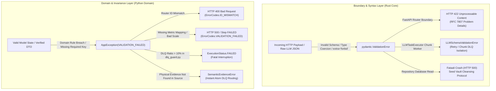
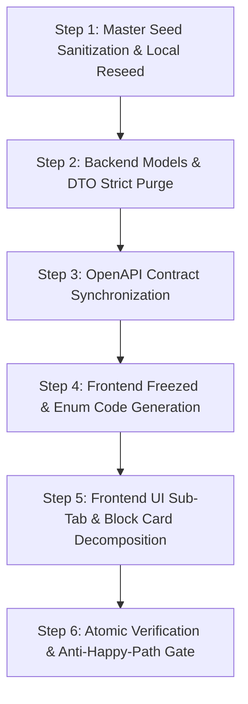

# EPIC 144: Output Profile Studio UI Modernization & Visual Block Builder

## 1. Goal Description & Background (Objective & Problem Statement)

### 1.1 Objective
Modernize and decompose the Output Profile editing interface in Quorum Studio (`@[client_app_v2/lib/features/studio/views/output_profile_crud_view.dart]`) into a clean, 3-tab information architecture aligned with Quorum's Gold Standard Flat MVC and Sub-Tabs paradigm (matching `@[client_app_v2/lib/features/studio/views/workflow_builder_view.dart]`). Replace the unintuitive, text-heavy layout block editor (`@[client_app_v2/lib/features/studio/views/widgets/profile/layout_editor_card.dart]`) with an **Adaptive Visual Block Builder** where complex matrices have deep configuration cards, while straightforward baseline components (specifically and exhaustively: `metadata_block`, `penalties_block`, `variance_validation_block`, `authenticity_evaluation_block`, and `printable_sources_block`) are managed via simple toggle cards.

**Studio Profile Lifecycle & Database SSOT Alignment:**
The entire Output Profile management workflow in Studio (`@[client_app_v2/lib/features/studio/views/output_profile_list_view.dart]`) operates directly on the single, unified `output_profiles` database collection/table:
- **Listing & Browsing:** Displays all active profiles in the system via `OutputProfileListView` (Admin Studio V2 → Profiilit Tab).
- **Creation (`+ Uusi profiili`):** Mints a new opaque ID (matching regex `prf_[a-f0-9]{16}`) draft profile via `outputProfilesControllerProvider.notifier.createOutputProfileDraft()`.
- **Cloning & Duplication:** Deep-copies an existing profile configuration to allow rapid preset experimentation via `CloneEntityButton`.
- **Deletion:** Safely deletes obsolete custom profiles (with confirmation dialog and delete action in the editor AppBar).
- **Editing & Persistence:** The modernized 3-tab editor (`output_profile_crud_view.dart`) modifies and saves profile documents directly via `PUT /api/v2/output-profiles/{id}`. In production/staging, users continuously create, clone, modify, and delete profiles within this single collection, while `@[backend_v2/seed/seed_data.json]` provides the immutable initial baseline (seeding `prf_5d6e7f8091a2b3c4` as the master preset).

### 1.2 Problem Statement
The current Output Profile editor in Studio suffers from severe cognitive overload and architectural coupling:
1. **Monolithic God View**: `@[client_app_v2/lib/features/studio/views/output_profile_crud_view.dart]` is an 896-line monolithic widget containing identity, scoring math, metadata checklists, XAI checkboxes, and layout blocks in an uneven, cramped 3-column layout.
2. **Conflated Responsibilities**: Mathematical scoring parameters (Strictness Level, Scoring Strategy, Display Scales) are crammed together with profile branding and I18n preface texts. Furthermore, technical header metadata (audit timestamps, engine badges) is mixed with deep cognitive explainability toggles (quotes, Devil's Advocate, coaching tips).
3. **Unintuitive Matrix & Layout Block Editing**: The current `@[client_app_v2/lib/features/studio/views/widgets/profile/layout_editor_card.dart]` relies on technical dropdown enums (`metrics1d`, `compare2d`, `matrix3d`, `textOnly`, `matrixSummary`) without visual previews. Switching views leaves orphaned or misleading axis selectors (`componentXAxisLabel`, `componentYAxisLabel`), prompts users to manually type comma-separated `steps` IDs into text inputs, and hides leipäteksti behind ambiguous `textDeliveryMode: none` settings.
4. **Inconsistent Studio UX**: Unlike `@[client_app_v2/lib/features/studio/views/workflow_builder_view.dart]` which uses a structured top TabBar with number/icon indicators, the Output Profile editor uses a raw `LayoutBuilder` 3-pane Row toggle and responsive column wrappers that break visual consistency.

---

## 2. Architectural Impact & Compliance Matrix

### 2.1 Deprecations & Sunset List (`What We Will REMOVE`)
| Symbol / Component | File Location | Status | Rationale / Migration Target |
| :--- | :--- | :--- | :--- |
| Local function `buildIdentityPane()` (L244-L726) | `@[client_app_v2/lib/features/studio/views/output_profile_crud_view.dart]` | REMOVED | Decomposed into dedicated widgets `ProfileGeneralTab` and `ProfileScoringTab`. |
| Local function `buildTargetBlockOrderPane()` (L755-L796) | `@[client_app_v2/lib/features/studio/views/output_profile_crud_view.dart]` | REMOVED | Decomposed into dedicated widget `ProfileLayoutsTab`. |
| Comma-separated `steps` text field | `@[client_app_v2/lib/features/studio/views/widgets/profile/layout_editor_card.dart]` | REMOVED | Eliminated manual string typing. Replaced by automatic resolution from workflow blueprints. |
| Sub-tab segmented button inside layout block | `@[client_app_v2/lib/features/studio/views/widgets/profile/layout_editor_card.dart]` | REMOVED | Replaced by single-page Adaptive Block Editor driven by selected visual presentation card. |
| Raw Checkbox lists for XAI & Metadata | `@[client_app_v2/lib/features/studio/views/output_profile_crud_view.dart]` | REMOVED | Replaced with themed `FilterChip` and `ChoiceChip` wrap pills grouped by domain category. |
| Redundant legacy field `include_diagnostic_scorecard: bool` | `@[backend_v2/models/v2_core.py]`, `@[backend_v2/models/dtos/output_profile.py]`, `@[client_app_v2/lib/features/studio/models/output_profile.dart]` | REMOVED | Eliminated redundant boolean flag in favor of `target_block_order` SSOT. |
| Raw string list `target_block_order: list[str]` / `List<String>` | `@[backend_v2/models/v2_core.py]`, `@[backend_v2/models/dtos/output_profile.py]`, `@[client_app_v2/lib/features/studio/models/output_profile.dart]` | MIGRATED | Migrated to strict `target_block_order: list[TargetBlockType]` (Python) and `List<TargetBlockType>` (Dart) to satisfy `strict_enum_hydration_and_validation` and eradicate Stringly-Typed anti-pattern. |

### 2.2 Retained SSOT Invariants (`What We Will RETAIN`)
1. **SSOT Data Models & Universal Block Dispatch**: The underlying domain models (`OutputProfile`, `OutputLayoutBlock`, `PresetView`, `TextDeliveryMode`, `XaiExtensionType`, `DisplayScale`, `StrictnessLevel`, `ScoringStrategy`, `TargetBlockType`) remain 100% identical in Python (`@[backend_v2/models/v2_core.py]`) and Dart Freezed (`@[client_app_v2/lib/features/studio/models/output_profile.dart]`). All block visibility is driven 100% via `target_block_order: list[TargetBlockType]`.
2. **Fail-Fast Boundary Parsing & Nested Sub-DTO Strictness**: Strict Pydantic V2 (`ConfigDict(strict=True, extra="forbid")`) and Dart Freezed deserialization (`@JsonSerializable(disallowUnrecognizedKeys: true)`) are strictly preserved and explicitly enforced on the top-level `OutputProfile` model, all DTOs (`OutputProfileCreateDTO`, `OutputProfileUpdateDTO`, `OutputProfileResponseDTO`), AND all nested sub-DTOs/sub-models (specifically and exhaustively: `SynthesisConfigDTO`, `OutputLayoutBlock`, `I18nText`, and all `AnySduiBlock` / `SduiBlockDTO` polymorphic subtypes). Selective strictness holes are strictly banned.
3. **Riverpod State Management**: `outputProfileFormProvider(id)` notifier pattern in `@[client_app_v2/lib/features/studio/controllers/output_profile_controller.dart]` is retained as the single source of truth for form mutations.

### 2.3 Compliance & Modernity Gates
1. **Flat MVC Sub-Tabs Pattern**: All tab views are isolated into dedicated, single-responsibility HookConsumerWidgets under `client_app_v2/lib/features/studio/views/widgets/profile/`.
2. **Desktop Pro-Tool Ergonomics**: Mouse hover cursors, focus traversal, and design token spacing (`@[client_app_v2/lib/core/theme/app_spacing.dart]`) enforced.
3. **No Hardcoded Magic Strings**: All tab titles, card descriptions, and button labels MUST be registered in `@[client_app_v2/lib/l10n/app_en.arb]` and `@[client_app_v2/lib/l10n/app_fi.arb]`.

### 2.4 Mandatory Codebase Violations to Eradicate (Modernity Gate)
During codebase verification, the following Fail-Fast violations (V1–V14) were identified in the files being refactored. These MUST be eradicated as part of the decomposition phases (Phase 0, Phase 1, Phase 2, and Phase 3), NOT deferred:

| # | Violation | Location | Rule Violated | Mandatory Fix |
| :--- | :--- | :--- | :--- | :--- |
| V1 | `unknownEnumValue` Freezed fallbacks in `OutputLayoutBlock`, `SynthesisConfigDTO`, and `BlueprintConfig` | `@[client_app_v2/lib/features/studio/models/output_profile.dart]`, `@[client_app_v2/lib/features/studio/models/blueprint_config.dart]` | `silent_json_fallbacks` / Modernity Checklist (Dart Freezed `@Default("Fallback")` and `fallbackUnion` FORBIDDEN) | REMOVE all `unknownEnumValue` parameters (`PresetView.defaultView`, `TextDeliveryMode.full`, `HistoricalContextMode.disabled`, `PresetView.metrics1d`). Unknown enum values MUST crash the Freezed parser via `CheckedFromJsonException`. |
| V2 | `SizedBox.shrink()` to hide unavailable XAI extensions | `@[client_app_v2/lib/features/studio/views/output_profile_crud_view.dart]` | `sized_box_shrink_ban` | Replace with programmatic filtering BEFORE the widget list is built (filter the iterable, not hide the output). |
| V3 | `AsyncValue<List<dynamic>>` untyped state parameters | `@[client_app_v2/lib/features/studio/views/output_profile_crud_view.dart]` | Modernity Checklist (`List<dynamic>` → Typed sealed classes) | Type all 3 parameters: `AsyncValue<List<PromptBlock>>`, `AsyncValue<List<Workflow>>`, `AsyncValue<List<NodeStrategy>>`. |
| V4 | Hardcoded color `Color(0xFF2E7D32)` | `@[client_app_v2/lib/features/studio/views/output_profile_crud_view.dart]` | `design_token_absolute_rule` | Replace with `Theme.of(context).colorScheme.primary` or equivalent design token. |
| V5 | Hardcoded pixel values `EdgeInsets.symmetric(horizontal: 16.0)` and `SizedBox(width: 20, height: 20)` | `@[client_app_v2/lib/features/studio/views/output_profile_crud_view.dart]` | `design_token_absolute_rule` | Replace with `AppSpacing` design tokens. |
| V6 | Raw `String displayScale` field (not a typed Enum) & `matrix_domain_parser.py` magic string comparisons | `@[client_app_v2/lib/features/studio/models/output_profile.dart]`, `@[backend_v2/services/matrix_domain_parser.py]` | `no_raw_string_enum_mappings` / `cross_language_enum_parity` / `strict_enum_hydration_and_validation` | Migrate to a strict `@JsonEnum() DisplayScale` enum in `enums.dart` with 3 values: `original`, `custom`, `normalized100` (`@JsonValue('normalized_100')`), and create corresponding `DisplayScale(StrEnum)` in `@[backend_v2/models/enums.py]`. Refactor `@[backend_v2/services/matrix_domain_parser.py]` (L238, L242, L268) to compare native `DisplayScale` enum members instead of magic string literals. |
| V7 | Hardcoded Finnish labels in `MetadataAdapter` (`"Käyttäjä:"`, `"Organisaatio:"`, `"Arviointimoottori:"`, `"Ankaruustaso:"`) | `@[backend_v2/services/sdui/adapters/metadata_adapter.py]` | `semantic_localization_axis` / `@[ki_dual_axis_localization_architecture.md]` | Replace hardcoded Finnish strings with localized label resolution via `OutputProfile.metric_mappings` I18nText dictionary (specifically and exhaustively: `metadata_user`, `metadata_organization`, `metadata_scoring_engine`, `metadata_strictness`). The adapter MUST emit only locale-resolved strings using `context.profile.metric_mappings[key].resolve(context.locale)` and raise `AppException(VALIDATION_FAILED)` if a required key is missing. Seed all required keys across `seed_data.json` and backend test fixtures. |
| V7a | `getattr(context.profile, "custom_preamble", None)` duck-typing & latent attribute bug | `@[backend_v2/services/sdui/adapters/metadata_adapter.py]` | `the_zero_compromise_pledge` / `zero_service_layer_fallbacks` | Replace duck-typing and fallback with strict typed attribute access: `context.profile.custom_preface.resolve(context.locale) if context.profile.custom_preface else None`. Note: the domain field in `OutputProfile` is named `custom_preface`, NOT `custom_preamble` — the previous duck-typing silently dropped all custom prefaces. |
| V7b | Hardcoded Finnish title fallback `"Raportti"` | `@[backend_v2/services/sdui/adapters/metadata_adapter.py]` | `semantic_localization_axis` / `the_duct_tape_ban` | Remove hardcoded `"Raportti"` fallback. Resolve report title strictly via `context.profile.name.resolve(context.locale)`. If `name` is missing or empty, raise `AppException(VALIDATION_FAILED)`. |
| V7c | `isinstance(dt, datetime)` duck-typing check | `@[backend_v2/services/sdui/adapters/metadata_adapter.py]` | `strict_pydantic_v2_rust` | Remove runtime `isinstance` guard on `context.execution.created_at`. The field is strictly typed as `datetime` in `ExecutionRecord`; format directly via `.strftime("%d.%m.%Y %H:%M")`. |
| V8 | `SynthesisTextAdapter` does not read `RenderedSynthesisCache.section_syntheses` | `@[backend_v2/services/sdui/adapters/synthesis_text_adapter.py]` | `tripartite_pipeline` / Dual-Mode synthesis | Extend adapter to read BOTH `context.profile.content_blocks` (static pre-defined blocks) AND `context.profile_cache.section_syntheses[layout_id]` (dynamic LLM-generated synthesis from Pipeline mode). Without this, Option A (Pipeline Way) produces no output. |
| V9 | Absence of Atomic Data & Mock Fixture Migration for V1 & V6 Tightening (Blast Radius) | `@[backend_v2/seed/seed_data.json]`, `@[client_app_v2/test/features/studio/models/output_profile_test.dart]`, `@[client_app_v2/test/features/studio/controllers/output_profile_controller_test.dart]`, `@[backend_v2/tests/unit/services/test_matrix_domain_parser.py]`, `@[backend_v2/tests/unit/services/test_blueprint.py]`, `@[backend_v2/tests/unit/hooks/test_scoring.py]`, `@[backend_v2/tests/unit/test_worker_synthesis.py]`, `@[backend_v2/tests/unit/test_v2_core_models.py]` | `universal_fail_fast` / `the_zero_compromise_pledge` | Synchronously update and verify all seed database entries (`output_profiles` collection in `seed_data.json`, specifically `prf_5d6e7f8091a2b3c4`) and all unit test mock fixtures (including in-memory test fixture `prof_1111111111111111` in `test_worker_synthesis.py` and `test_scoring.py`) across both frontend and backend blast radius test suites when removing `unknownEnumValue` fallbacks and converting `display_scale` to a strict Enum. Re-seed local development database (`run_seed.py local`) to eliminate any unmapped string values before execution. |
| V10 | DTO upper bound omission for `max_extension_items` & Flutter UI Slider Boundary Mismatch Crash Risk | `@[backend_v2/models/dtos/output_profile.py]`, `@[client_app_v2/lib/core/models/enums.dart]`, `@[client_app_v2/lib/features/studio/views/widgets/profile/blocks/xai_extensions_block_card.dart]` | `global_config_sovereignty_mandate` / `strict_pydantic_v2_rust` / `universal_fail_fast` | Mirror domain model mathematical bounds in DTO schema (`Field(ge=1, le=100)`) to maintain strict bidirectional boundary validation parity. To prevent Flutter framework assertion crashes (`Assertion failed: value >= min && value <= max: is not true`) when database/API returns values outside the 1–20 UI slider range (up to 100), define `SystemUiConstraints` enum in `@[client_app_v2/lib/core/models/enums.dart]` (`maxExtensionItemsSliderMin: 1`, `maxExtensionItemsSliderMax: 20`, `maxExtensionItemsAbsoluteMax: 100`, `maxExtensionItemsDefault: 3`). Implement safe clamping `currentVal.clamp(minVal, sliderMax).toDouble()` on the `Slider` in `@[client_app_v2/lib/features/studio/views/widgets/profile/blocks/xai_extensions_block_card.dart]` combined with a companion `TextFormField` validating the full `[1, 100]` range. |
| V11 | Absence of Automated Code Generation Gate for Freezed & OpenAPI | `@[backend_v2/scripts/generate_openapi.py]`, `@[docs/swagger/openapi.json]`, `@[client_app_v2/lib/features/studio/models/output_profile.freezed.dart]`, `@[client_app_v2/lib/features/studio/models/output_profile.g.dart]` | `automated_code_generation_mandate` / `pydantic_namespace_collisions` / `sdui_contract_fracture_prevention` | Execute `uv run python backend_v2/scripts/generate_openapi.py` to synchronize OpenAPI specification, and execute `uv run python scripts/flutter_audit_loop.py client_app_v2/lib/features/studio/models/output_profile.dart --build` to re-generate Freezed stubs immediately after DTO and Enum modifications in Phase 0. |
| V12 | Fatal Backend Deserialization Crash Risk under `ConfigDict(extra="forbid")` during `include_diagnostic_scorecard` purge & Local Seed Cleansing | `@[backend_v2/models/v2_core.py]`, `@[backend_v2/database/repositories/components/output_profile.py]` | `the_zero_compromise_pledge` / `python_314_concurrency_strictness` | When `include_diagnostic_scorecard` is removed from `OutputProfile`, running against any local TinyDB database containing the legacy key triggers fatal `pydantic.ValidationError` (`extra_forbidden`) on read in `OutputProfileRepositoryImpl.get_all_output_profiles_models()`. **Pre-Production Scope Rationale:** Quorum is in active development with no live production customer data; the database layer is ephemeral and governed by the Seed Vault Protocol (`@[ki_python_314_concurrency_strictness.md]`). Therefore, writing standalone database migration scripts is rejected as premature over-engineering (YAGNI). Purge `include_diagnostic_scorecard` directly from master seed data (`@[backend_v2/seed/seed_data.json]`) and re-seed the local development database via `uv run python backend_v2/seed/run_seed.py local` before modifying backend models. BANNED: Relaxing to `extra="ignore"` or adding `.pop()` duct-tape in repository. |
| V13 | Hardcoded Business Logic Thresholds in SDUI Adapter (`AUTHENTICITY_THRESHOLDS = {"high": 80.0, "low": 50.0}`) | `@[backend_v2/services/sdui/adapters/authenticity_adapter.py]` | `global_config_sovereignty_mandate` / `tripartite_configuration_segregation` / `@[ki_global_config_sovereignty.md]` / `@[ki_sdui_adapter_pattern.md]` | Eradicate module-level hardcoded `AUTHENTICITY_THRESHOLDS` dictionary in `authenticity_adapter.py`. Define centralized configurable threshold settings in `@[backend_v2/settings.py]` (`authenticity_threshold_high: float = Field(default=80.0, ge=0.0, le=100.0)` and `authenticity_threshold_low: float = Field(default=50.0, ge=0.0, le=100.0)`). Refactor `AuthenticityAdapter.build()` to import `get_settings` at module level and read dynamic thresholds, preserving pure visual role for `AUTHENTICITY_RULES` (severity/icon mapping only). |
| V14 | Raw string list `target_block_order: list[str]` / `List<String>` & Missing 4 `TargetBlockType` enum members in Flutter `enums.dart` | `@[backend_v2/models/v2_core.py]`, `@[backend_v2/models/dtos/output_profile.py]`, `@[client_app_v2/lib/core/models/enums.dart]`, `@[client_app_v2/lib/features/studio/models/output_profile.dart]`, `@[backend_v2/services/blueprint.py]` | `strict_enum_hydration_and_validation` / `cross_language_enum_parity` / `no_raw_string_enum_mappings` / `universal_fail_fast` | Add missing 4 enum values with `@JsonValue` to `@[client_app_v2/lib/core/models/enums.dart]` (specifically and exhaustively: `matrixGraphsBlock: 'matrix_graphs_block'`, `matrixSummaryTableBlock: 'matrix_summary_table_block'`, `varianceValidationBlock: 'variance_validation_block'`, `authenticityEvaluationBlock: 'authenticity_evaluation_block'`). Migrate `target_block_order` across Python domain model (`OutputProfile`) and DTOs (`OutputProfileCreateDTO`, `OutputProfileUpdateDTO`, `OutputProfileResponseDTO`) to `list[TargetBlockType]`. Migrate Dart Freezed model (`OutputProfile`) to `List<TargetBlockType>`. Refactor `blueprint.py` `self._target_block_hydrators` to `dict[TargetBlockType, Callable]`, eliminating `str()` casting and ensuring unknown keys fail fast. |
| V15 | Synthesis Config Duplication & Prompt Rule Redundancy | `@[backend_v2/seed/seed_data.json]` (lines 9461–9907), `@[backend_v2/worker.py]` | `ssot_reuse_mandate` / `prompt_asset_ssot_mandate` / `high_fidelity_prompting_and_caching` / `ephemeral_caching_topology` | **Three compound violations:** (A) 12 layout-level `synthesis` objects repeat identical dead-weight fields (`model_strategy`, `historical_context_mode`, `enable_pii_masking`, `allowed_exports`, `omit_empty_sections`, `allowed_mcp_tools`) that `worker.py` never reads — only `synthesis_block_id` (and optionally `row_explanations_block_id`) are consumed. Strip all 6 dead-weight fields, leaving only `{"synthesis_block_id": "..."}`. (B) Three hardcoded graph synthesis PromptBlocks (`blk_111122223333444a` at L7721, `blk_111122223333444b` at L7744, `blk_111122223333444c` at L7767) contain redundant rules (mathematical anchoring, visual storytelling, language mandate) already injected by `worker.py` via `GLOBAL_MANDATES_XML` and `build_linguistic_context()`, wasting ~300 tokens per prompt. Extract shared mandates into `@[backend_v2/models/prompts/synthesis_directives.py]` as Python constants and strip them from the PromptBlock `ai_description` fields. (C) Synthesis section rules block (`blk_34def5d628ba4ed4` at L7586) and row explanation block (`blk_ad303690b26b413d` at L7608) contain inline language and ID mandates already covered by the global injection pipeline. |

### 2.5 Block Data Pipeline Reference (DB → Pydantic → Adapter → SDUI → Renderer)

The following table exhaustively documents the complete data lineage for every rendering block in the system. The **dispatch loop** lives in `@[backend_v2/services/blueprint.py]`: it iterates `OutputProfile.target_block_order` and calls the matching adapter from the `_target_block_hydrators` registry in `@[backend_v2/services/blueprint.py]`.

**Block Type Enum SSOT:** `TargetBlockType` in `@[backend_v2/models/enums.py]` (Python) and `@[client_app_v2/lib/core/models/enums.dart]` (Dart)  
**Block Order SSOT:** `OutputProfile.target_block_order: list[TargetBlockType]` in `@[backend_v2/models/v2_core.py]`  
**Adapter Context DTO:** `AdapterContext` in `@[backend_v2/services/sdui/adapters/base_adapter.py]`

#### Block 1: `metadata_block`
| Layer | Location | Detail |
| :--- | :--- | :--- |
| **DB Config** | `OutputProfile.visible_metadata: list[str]` | `@[backend_v2/models/v2_core.py]` — Controls which metadata fields (specifically and exhaustively: `date`, `organization`, `user`, `scoring_engine`, `strictness`) appear on the header. |
| **DTO** | `OutputProfileCreateDTO.visible_metadata` | `@[backend_v2/models/dtos/output_profile.py]` |
| **Adapter** | `MetadataAdapter.build(context)` | `@[backend_v2/services/sdui/adapters/metadata_adapter.py]` — Reads `context.profile.visible_metadata`, `context.user_name`, `context.org_name`, `context.local_time_str`, `context.scoring_engine`, `context.cost`, `context.tokens`. Emits `SduiMetadataBlock`. |
| **SDUI Output** | `SduiMetadataBlock` | `@[backend_v2/models/view/sdui.py]` |
| **UI Config** | Checkboxes for toggling visible metadata fields | Tab 3 → `metadata_block` card |

#### Block 2: `executive_summary_block`
| Layer | Location | Detail |
| :--- | :--- | :--- |
| **DB Config** | `OutputProfile.custom_preface: I18nText`, `OutputProfile.user_role_mappings: dict[str, I18nText]`, `OutputProfile.user_role_label: I18nText` | `@[backend_v2/models/v2_core.py]` |
| **Data Source** | `RenderedSynthesisCache.user_role`, `RenderedSynthesisCache.user_role_justification` | `@[backend_v2/models/v2_core.py]` — The LLM-classified user role and justification from synthesis Phase 2. |
| **Adapter** | `ExecutiveSummaryAdapter.build(context)` | `@[backend_v2/services/sdui/adapters/executive_summary_adapter.py]` — Uses `EXECUTIVE_SUMMARY_RULES` dict mapping `RoleClassification` enum to localized l10n keys. Reads from `context.profile_cache`. Emits `ParagraphBlock` instances. |
| **SDUI Output** | `ParagraphBlock` | `@[backend_v2/models/view/sdui.py]` |
| **UI Config** | Custom preface text editor, Role Mappings modal | Tab 1 (General) preface + Tab 3 card visibility toggle |

#### Block 3: `synthesis_text_block`
| Layer | Location | Detail |
| :--- | :--- | :--- |
| **DB Config** | `OutputProfile.synthesis: SynthesisConfigDTO`, `OutputProfile.content_blocks: list[AnySduiBlock]`, `OutputProfile.tone_instruction: I18nText` | `@[backend_v2/models/v2_core.py]` |
| **Data Source** | `RenderedSynthesisCache.section_syntheses` (LLM-generated markdown) | `@[backend_v2/models/v2_core.py]` — Pre-computed Section-Level synthesis keyed by layout ID. |
| **Adapter** | `SynthesisTextAdapter.build(context)` | `@[backend_v2/services/sdui/adapters/synthesis_text_adapter.py]` — Reads `context.profile.content_blocks` (pre-defined static blocks). Emits deep-copied `AnySduiBlock` instances. |
| **SDUI Output** | Polymorphic `AnySduiBlock` (specifically all models defined in `LlmSduiBlock` in `@[backend_v2/models/dtos/synthesis.py]` or static `AnySduiBlock` in `@[backend_v2/models/view/sdui.py]`) | `@[backend_v2/models/view/sdui.py]` |
| **UI Config** | Dual-mode selector (Pipeline / On-the-Fly), tone instruction text field | Tab 3 → `synthesis_text_block` card |

#### Block 4: `matrix_graphs_block`
| Layer | Location | Detail |
| :--- | :--- | :--- |
| **DB Config** | `OutputLayoutBlock.preset_view` (Block 4 uses exclusively: `"1d_metrics"`, `"2d_compare"`, `"3d_matrix"`, `"text_only"`), `OutputLayoutBlock.steps: list[str]`, `OutputLayoutBlock.target_blocks: list[str]`, `OutputLayoutBlock.title: I18nText`, `OutputLayoutBlock.text_delivery_mode: Literal["full", "titles_only", "none"]` | `@[backend_v2/models/v2_core.py]` — Defines the graph visual preset, which workflow step IDs provide the axes, and per-graph display configuration. The `"matrix_summary"` preset is NOT used here — it belongs exclusively to Block 7 (`matrix_summary_table_block`). |
| **Data Source** | `AdapterContext.parsed_matrices: dict[str, MatrixScorecardRowDTO]` | `@[backend_v2/services/sdui/adapters/base_adapter.py]` — Pre-evaluated matrix scorecard rows from the DAG execution engine. Each `MatrixScorecardRowDTO` (`@[backend_v2/models/v2_core.py]`) contains `score`, `normalized_score`, `ui_plot_ratio`, `ui_boundary_labels`, and `evaluated_atoms`. |
| **Adapter** | `MatrixGraphsAdapter.build(context)` | `@[backend_v2/services/sdui/adapters/matrix_graphs_adapter.py]` — Validates axis count against `MATRIX_GRAPHS_RULES` (`3d_matrix` requires min 3 axes, `2d_compare` min 2). Emits `SduiRadarChartBlock`, `SduiScatterPlotBlock`, or `SduiMetrics1DBlock`. |
| **SDUI Output** | `SduiRadarChartBlock`, `SduiScatterPlotBlock`, `SduiMetrics1DBlock`, `ParagraphBlock` | `@[backend_v2/models/view/sdui.py]` |
| **UI Config** | **Collection Builder** (1-N graph sub-items with accordion inline editing). Each sub-item has: visual preset card selection (4 graph presets: 1D Metrics, 2D Compare, 3D Bubble, Text Only), Context-Adaptive X/Y/Z axis dropdowns, I18n title field, `text_delivery_mode` SegmentedButton, and `"+ Add Graph"` `FilledButton.icon` at the bottom | Tab 3 → `matrix_graphs_block` card (DEEP CONFIGURATION) |

#### Block 5: `grouped_extensions_block`
| Layer | Location | Detail |
| :--- | :--- | :--- |
| **DB Config** | `OutputProfile.visible_block_extensions: list[LaxXaiExtensionType]`, `OutputProfile.visible_workflow_extensions: list[LaxXaiExtensionType]`, `OutputProfile.max_extension_items: int`, `OutputProfile.extension_labels: dict[LaxXaiExtensionType, I18nText]` | `@[backend_v2/models/v2_core.py]` |
| **Data Source** | `RenderedSynthesisCache.xai_highlights: list[XaiHighlightItem]` | `@[backend_v2/models/v2_core.py]` — LLM-extracted XAI highlight items from synthesis Phase 2 (parsed as `XaiHighlightItem` from `@[backend_v2/models/dtos/synthesis.py]`). |
| **Adapter** | `XaiHighlightsAdapter.build(context)` | `@[backend_v2/services/sdui/adapters/xai_highlights_adapter.py]` — Filters highlights by `visible_block_extensions` and `visible_workflow_extensions`. Applies `ranked_round_robin_select` capped at `max_extension_items`. Uses `XAI_AESTHETICS_RULES` for severity/icon mapping. Emits `AccordionBlock` and `AlertBlock`. |
| **SDUI Output** | `AccordionBlock`, `AlertBlock` | `@[backend_v2/models/view/sdui.py]` |
| **UI Config** | FilterChip pills for extension types, max items slider | Tab 3 → `grouped_extensions_block` card |

#### Block 6: `penalties_block`
| Layer | Location | Detail |
| :--- | :--- | :--- |
| **DB Config** | Penalties are computed by the scoring engine, not configured per-profile. | Profile-level overrides: `OutputProfile.strictness_level` and `OutputProfile.scoring_strategy` in `@[backend_v2/models/v2_core.py]` affect penalty severity. |
| **Data Source** | `AdapterContext.penalties_applied: list[str]` | `@[backend_v2/services/sdui/adapters/base_adapter.py]` — List of penalty description strings computed by the Waterfall/CDM scoring engine during execution. |
| **Adapter** | `PenaltiesAdapter.build(context)` | `@[backend_v2/services/sdui/adapters/penalties_adapter.py]` — Iterates `penalties_applied`. Uses `PENALTIES_RULES` for `VisualIntent.CRITICAL_OVERRIDE` severity. Emits `AlertBlock` per penalty. |
| **SDUI Output** | `AlertBlock` | `@[backend_v2/models/view/sdui.py]` |
| **UI Config** | Universal Baseline toggle only (penalties are computed, not manually configured) | Tab 3 → `penalties_block` card (simple toggle) |

#### Block 7: `matrix_summary_table_block`
| Layer | Location | Detail |
| :--- | :--- | :--- |
| **DB Config** | `OutputLayoutBlock.preset_view`, `OutputLayoutBlock.steps`, `OutputLayoutBlock.matrix_visible_columns: list[str]`, `OutputLayoutBlock.matrix_column_labels: dict[str, I18nText]` | `@[backend_v2/models/v2_core.py]` — Controls which columns are visible and their localized labels. |
| **Data Source** | `AdapterContext.parsed_matrices: dict[str, MatrixScorecardRowDTO]` | Same as Block 4. Matrix rows contain `score`, `true_atoms`, `total_atoms`, `row_explanation`, `level_breakdown`. |
| **Adapter** | `MatrixSummaryTableAdapter.build(context)` | `@[backend_v2/services/sdui/adapters/matrix_summary_table_adapter.py]` — Reads `context.profile.layouts` and filters by `preset_view == "matrix_summary"`. Validates minimum axes via `MATRIX_SUMMARY_RULES`. Emits `SduiMatrixTableBlock`. |
| **SDUI Output** | `SduiMatrixTableBlock`, `MarkdownBlock`, `ParagraphBlock` | `@[backend_v2/models/view/sdui.py]` |
| **UI Config** | A **single, independent block editor card** (NOT part of the Matrix Graphs Collection Builder). `FilterChip` toggle pills for `matrix_visible_columns` (specifically and exhaustively: `label`, `atomic_breakdown`, `row_explanation`, `normalized_score`, `score`, `quotes`). I18n text fields for `matrix_column_labels` per visible column. Optional `target_blocks` multi-select for filtering displayed axes (default: `["*"]` = all matrices). | Tab 3 → `matrix_summary_table_block` card (DEEP CONFIGURATION) |

#### Block 8: `variance_validation_block`
| Layer | Location | Detail |
| :--- | :--- | :--- |
| **DB Config** | No profile-level configuration fields. Block is purely computed. | Presence in `target_block_order` controls visibility. |
| **Data Source** | `ExtensionMetricsDTO.variance_score: float`, `ExtensionMetricsDTO.alignment_verdict: str` | `@[backend_v2/models/v2_core.py]` — Pre-calculated by the synthesis engine. Also reads `MatrixScorecardRowDTO` rows from `context.parsed_matrices` for per-matrix variance breakdowns. |
| **Adapter** | `VarianceAdapter.build(context)` | `@[backend_v2/services/sdui/adapters/variance_adapter.py]` — Uses `VARIANCE_RULES` (aligned → `VisualIntent.INFO`, misaligned → `VisualIntent.WARNING`). Emits `SduiMetrics1DBlock`, `SduiGridBlock`, `AlertBlock`, `MarkdownBlock`, `ParagraphBlock`. |
| **SDUI Output** | `SduiMetrics1DBlock`, `SduiGridBlock`, `AlertBlock`, `MarkdownBlock`, `ParagraphBlock` | `@[backend_v2/models/view/sdui.py]` |
| **UI Config** | Universal Baseline toggle only | Tab 3 → `variance_validation_block` card (simple toggle) |

#### Block 9: `authenticity_evaluation_block`
| Layer | Location | Detail |
| :--- | :--- | :--- |
| **DB Config** | No profile-level configuration fields. Block is purely computed. | Presence in `target_block_order` controls visibility. |
| **Data Source** | `ExtensionMetricsDTO.authenticity_score: float`, `ExtensionMetricsDTO.performative_phrases_count: float` | `@[backend_v2/models/v2_core.py]` — Pre-calculated metrics. Also reads `MatrixScorecardRowDTO` for per-matrix authenticity breakdowns. |
| **Adapter** | `AuthenticityAdapter.build(context)` | `@[backend_v2/services/sdui/adapters/authenticity_adapter.py]` — Uses `AUTHENTICITY_RULES` with 3 severity levels (`level_high` → INFO, `level_medium` → WARNING, `level_low` → ERROR) and centralized dynamic thresholds from `@[backend_v2/settings.py]` (`settings.authenticity_threshold_high`, `settings.authenticity_threshold_low` per `@[ki_global_config_sovereignty.md]`). Emits `SduiMetrics1DBlock`, `SduiGridBlock`, `AlertBlock`, `MarkdownBlock`, `ParagraphBlock`. |
| **SDUI Output** | `SduiMetrics1DBlock`, `SduiGridBlock`, `AlertBlock`, `MarkdownBlock`, `ParagraphBlock` | `@[backend_v2/models/view/sdui.py]` |
| **UI Config** | Universal Baseline toggle only | Tab 3 → `authenticity_evaluation_block` card (simple toggle) |

#### Block 10: `printable_sources_block` (Bibliography)
| Layer | Location | Detail |
| :--- | :--- | :--- |
| **DB Config** | Presence in `target_block_order` (Universal SSOT). No separate boolean flag permitted. | `@[backend_v2/models/v2_core.py]` |
| **Data Source** | `RenderedSynthesisCache.cited_sources: list[str]` | `@[backend_v2/models/v2_core.py]` — Citations collected during synthesis Phase 2. Additionally, `AdapterContext.mcp_audit_map: dict[str, MCPAuditTrace]` provides `source_urls` from the MCP tool loop. |
| **Adapter** | `PrintableSourcesAdapter.build(context)` | `@[backend_v2/services/sdui/adapters/printable_sources_adapter.py]` — Reads `profile_cache.cited_sources` and `mcp_audit_map` source URLs. Emits `MarkdownBlock` with formatted bibliography. |
| **SDUI Output** | `MarkdownBlock` | `@[backend_v2/models/view/sdui.py]` |
| **UI Config** | Visibility toggle, grouping mode (chronological/by_matrix), anonymization toggle | Tab 3 → `printable_sources_block` card |

#### Block 11: `global_score_block` (System Block)
| Layer | Location | Detail |
| :--- | :--- | :--- |
| **DB Config** | System-managed. Not user-configurable. | Always present in `target_block_order`. |
| **Data Source** | `AdapterContext.global_score: float` | `@[backend_v2/services/sdui/adapters/base_adapter.py]` |
| **Adapter** | `GlobalScoreAdapter.build(context)` | `@[backend_v2/services/sdui/adapters/global_score_adapter.py]` |
| **UI Config** | N/A — System block, not editable in Studio | Not shown in Tab 3 block builder |

#### Block 12: `audit_trail_block` (System Block)
| Layer | Location | Detail |
| :--- | :--- | :--- |
| **DB Config** | System-managed. Not user-configurable. | Always present in `target_block_order`. |
| **Data Source** | `AdapterContext.mcp_audit_map: dict[str, MCPAuditTrace]` | `@[backend_v2/services/sdui/adapters/base_adapter.py]` |
| **Adapter** | `McpAuditAdapter.build(context)` | `@[backend_v2/services/sdui/adapters/mcp_audit_adapter.py]` |
| **UI Config** | N/A — System block, not editable in Studio | Not shown in Tab 3 block builder |

### 2.6 Exact Exception & DLQ Routing Taxonomy (ValidationError vs AppException)

To guarantee deterministic system execution, comprehensive audit logging (RFC 7807 Problem Details), and predictable Dead Letter Queue (DLQ) routing without "Amnesia Programming" or silent masking, errors across the Output Profile and SDUI lifecycle are strictly segregated into two distinct architectural categories:



The system strictly enforces the following exhaustive taxonomy table:

| Error Category | Exception Type | Trigger Context | HTTP / Arq Routing | Logging & DLQ Behavior |
| :--- | :--- | :--- | :--- | :--- |
| **API Request Schema Violation** | `pydantic.ValidationError` (wrapped as `RequestValidationError` by FastAPI) | Incoming JSON payload violates DTO schema: invalid field type, missing mandatory field, unknown key rejected by `ConfigDict(strict=True, extra='forbid')`, or range constraint breach (`ge/le/pattern`). | `HTTP 422 Unprocessable Content` (RFC 7807 Problem Details via `validation_exception_handler` in `@[backend_v2/main.py]`). | Emits `logger.error("[FastAPI] VALIDATION ERROR")`. Rejected immediately at API firewall before router or worker execution; zero DLQ activation. |
| **API Domain Invariance Violation** | `AppException` (specifically `ErrorCodes.ID_MISMATCH` or `ErrorCodes.RESOURCE_NOT_FOUND`) | Incoming JSON is syntactically valid against DTO, but violates endpoint logical invariants (specifically: URL path parameter `profile_id` does not match body DTO `id` in `@[backend_v2/api/routers/output_profiles.py]`, or target profile does not exist). | `HTTP 400 Bad Request` (`ID_MISMATCH`) or `HTTP 404 Not Found` (`RESOURCE_NOT_FOUND`) via `app_exception_handler` in `@[backend_v2/main.py]`. | Emits `logger.error` / `logger.warning` with structured trace metadata. Zero DLQ activation. |
| **LLM Structured Output Parsing Failure** | `pydantic.ValidationError` (caught and wrapped as `LLMSchemaValidationError`) | LLM returns malformed JSON or JSON that fails Pydantic response model validation during synthesis or extraction tasks (specifically `SynthesisOutputDTO` or `LLMDraftAtomList`). | Asynchronous worker (`@[backend_v2/services/llm_task_executor.py]`): Triggers bounded structured self-healing retry loop (capped by `settings.llm_max_retries`). If retries are exhausted, isolates the failed chunk into DLQ (`_dlq_status: "FAILED/DLQ"`). | Emits `logger.error("[LLMTaskExecutor] Schema Validation Failed")`. Persisted into `llm_debug_prompts.md` in development environments. |
| **Semantic Evidence & Anomaly Failure** | `SemanticEvidenceError` (inherits from `AppException`) | Extracted atom claim quote fails exact O(1) `str.find` lexical validation against normalized source document (`strict_physical_anchoring_mandate`), or `AliasEngine` detects block ID hallucination outside assigned chunk boundaries. | Dispatches directly to atom-level DLQ state (`status = "DLQ"` in `scorecard_atoms`). Bypasses retry loop to avoid wasting LLM inference tokens on hallucinated quotes. | Emits `logger.warning("corrupted_atom_dropped" / "AliasEngine hallucination detected")` with opaque atom and block identifiers. |
| **Service & Adapter Layer Invariance Violation** | `AppException(VALIDATION_FAILED)` | Service or presentation adapter encounters malformed domain state despite valid syntax (specifically: `OutputProfile.metric_mappings` lacks required localized key for `MetadataAdapter`, `target_block_order` contains invalid state, or `OutputProfile.name` is empty). | `HTTP 500 Internal Server Error` (FastAPI) or immediate step execution crash (`ExecutionStatus.FAILED` in `@[backend_v2/worker.py]`). | Emits `logger.error("[Service/Adapter] %s: %s", ErrorCodes.VALIDATION_FAILED.name, ...)` with full contextual parameters before failing fast. |
| **Excessive DLQ Breach Guard** | `AppException(VALIDATION_FAILED)` | `@[backend_v2/hooks/dlq_guard.py]` (`dlq_strict_mode_guard_hook`) calculates that the ratio of DLQ atoms exceeds the absolute allowed safety limit (`dlq_count / total_atoms > 0.10`). | Immediately aborts the entire workflow execution with `ExecutionStatus.FAILED` (Fatal Interruption), preventing distorted scores from reaching reporting. | Emits `logger.error("[DLQGuard] %s: Strict Fail-Fast: DLQ ratio ... exceeded the 10.00% absolute limit", ErrorCodes.VALIDATION_FAILED.name)` and records error string in `ExecutionRecord.error`. |
| **Database Hydration Model Corruption** | `pydantic.ValidationError` | Internal database (`data/db_v2.json`) contains obsolete, unmigrated fields (specifically legacy `include_diagnostic_scorecard`) when hydrated via `OutputProfile.model_validate(data, strict=False)` under `extra='forbid'`. | Fataali system crash (`HTTP 500` / Arq worker fatal abort). | Emits `logger.critical("[Repository] Malformed DB Model — Fail-Fast")`. Must be resolved at source via Seed Vault Cleansing Protocol (`uv run python backend_v2/seed/run_seed.py local`). Bypassing via `extra="ignore"` is strictly forbidden. |

---


## 3. Phased Execution Plan (Implementation Strategy)

### 3.0 MANDATORY Deployment & Execution Sequence (6-Step Atomic Pipeline)

To eliminate any catastrophic crash risk caused by removing `unknownEnumValue` fallbacks (V1), introducing strict `@JsonEnum() DisplayScale` (V6), and purging `include_diagnostic_scorecard` under strict Pydantic `extra="forbid"` deserialization (V9, V11 & V12; see `@[ki_python_314_concurrency_strictness.md]`), all implementation workflows MUST execute according to the following strict 6-step atomic sequence:



1. **Step 1: Master Seed Sanitization & Local Database Reseed**
   - Synchronize `@[backend_v2/seed/seed_data.json]` ensuring all output profile objects have `display_scale` set to valid enum strings (`normalized_100`, `custom`, `original`), zero `include_diagnostic_scorecard` keys, and complete `metric_mappings`.
   - Execute local environment database re-seeding via `uv run python backend_v2/seed/run_seed.py local` to establish a clean, validated local TinyDB state (`data/db_v2.json`) matching the updated schema prior to backend model modifications.
2. **Step 2: Backend Domain Model, Settings & DTO Synchronization**
   - In `@[backend_v2/settings.py]`, define centralized authenticity thresholds `authenticity_threshold_high: Annotated[float, Field(default=80.0, ge=0.0, le=100.0)]` and `authenticity_threshold_low: Annotated[float, Field(default=50.0, ge=0.0, le=100.0)]` per `global_config_sovereignty_mandate`.
   - In `@[backend_v2/models/enums.py]`, define `DisplayScale(StrEnum)` with values `ORIGINAL = "original"`, `CUSTOM = "custom"`, `NORMALIZED_100 = "normalized_100"` and property `l10n_key`.
   - In `@[backend_v2/models/v2_core.py]`, delete `include_diagnostic_scorecard: bool` from `OutputProfile`, change `display_scale` type to `DisplayScale`, and ensure `model_config = ConfigDict(strict=True, extra="forbid")` is enforced on `OutputProfile`, `OutputLayoutBlock`, and `SynthesisConfigDTO`.
   - In `@[backend_v2/models/dtos/output_profile.py]`, delete `include_diagnostic_scorecard` across `OutputProfileCreateDTO`, `OutputProfileUpdateDTO`, `OutputProfileResponseDTO`, ensuring each DTO and all nested types enforce `ConfigDict(strict=True, extra="forbid")`. Enforce `max_extension_items: Annotated[int | None, Field(ge=1, le=100)]`.
   - Run backend unit models audit: `uv run python scripts/backend_audit_loop.py backend_v2/tests/unit/test_v2_core_models.py --test`.
3. **Step 3: OpenAPI Specification Synchronization Gate**
   - Execute OpenAPI generator: `uv run python backend_v2/scripts/generate_openapi.py`.
   - Verify OpenAPI parity test: `uv run python scripts/backend_audit_loop.py backend_v2/tests/unit/scripts/test_generate_openapi.py --test`.
4. **Step 4: Frontend Freezed Model & Enum Synchronization**
   - In `@[client_app_v2/lib/core/models/enums.dart]`, define `@JsonEnum() enum DisplayScale` and `enum SystemUiConstraints`.
   - In `@[client_app_v2/lib/features/studio/models/output_profile.dart]`, delete `includeDiagnosticScorecard`, set `DisplayScale displayScale`, and remove ALL `unknownEnumValue` fallback parameters.
   - Execute code generation: `uv run python scripts/flutter_audit_loop.py client_app_v2/lib/features/studio/models/output_profile.dart --build`.
   - Run Freezed deserialization tests: `uv run python scripts/flutter_audit_loop.py client_app_v2/test/features/studio/models/output_profile_test.dart --test`.
5. **Step 5: Frontend UI Scaffold & Block Builder Decomposition**
   - Update localization files `app_en.arb` and `app_fi.arb`, compile with `cd client_app_v2; flutter gen-l10n; cd ..`.
   - Decompose `output_profile_crud_view.dart` into `ProfileGeneralTab`, `ProfileScoringTab`, and `ProfileLayoutsTab`.
   - Build dedicated block cards under `lib/features/studio/views/widgets/profile/blocks/` adhering to God Code Prevention (<200 lines per file).
   - Implement slider clamping and companion text field validation for `max_extension_items` in `xai_extensions_block_card.dart`.
6. **Step 6: Global Quality Gates & Anti-Happy-Path Falsification**
   - Run full backend negative test suite via `uv run python scripts/backend_audit_loop.py backend_v2 --test`.
   - Run full frontend test suite and build verification via `uv run python scripts/flutter_audit_loop.py client_app_v2/lib/features/studio --build` and `uv run python scripts/flutter_audit_loop.py client_app_v2/test/features/studio --test`.

---

### Phase 0: Atomic Data, Mock Fixture & Code Generation Gate (Pre-requisite)
**Target Files (Modify / New / Execute):**
- `[MODIFY]` `@[backend_v2/settings.py]`
- `[MODIFY]` `@[backend_v2/models/enums.py]`
- `[MODIFY]` `@[client_app_v2/lib/core/models/enums.dart]`
- `[MODIFY]` `@[backend_v2/models/v2_core.py]`
- `[MODIFY]` `@[backend_v2/models/dtos/output_profile.py]`
- `[MODIFY]` `@[client_app_v2/lib/features/studio/models/output_profile.dart]`
- `[MODIFY]` `@[client_app_v2/lib/features/studio/models/blueprint_config.dart]`
- `[MODIFY]` `@[backend_v2/tests/unit/test_settings.py]`
- `[MODIFY]` `@[backend_v2/seed/seed_data.json]`
- `[MODIFY]` `@[client_app_v2/test/features/studio/models/output_profile_test.dart]`
- `[MODIFY]` `@[client_app_v2/test/features/studio/controllers/output_profile_controller_test.dart]`
- `[MODIFY]` `@[client_app_v2/test/features/studio/views/widgets/profile/layout_editor_card_test.dart]`
- `[NEW]` `@[client_app_v2/test/features/studio/models/blueprint_config_test.dart]`
- `[MODIFY]` `@[backend_v2/tests/unit/services/test_matrix_domain_parser.py]`
- `[MODIFY]` `@[backend_v2/tests/unit/services/test_blueprint.py]`
- `[MODIFY]` `@[backend_v2/tests/unit/hooks/test_scoring.py]`
- `[MODIFY]` `@[backend_v2/tests/unit/test_worker_synthesis.py]`
- `[MODIFY]` `@[backend_v2/tests/unit/test_v2_core_models.py]`
- `[EXECUTE]` `@[backend_v2/scripts/generate_openapi.py]`
- `[EXECUTE]` `@[docs/swagger/openapi.json]`

To eliminate any catastrophic crash risk caused by removing `unknownEnumValue` fallbacks (V1), introducing strict `@JsonEnum() DisplayScale` (V6), and purging `include_diagnostic_scorecard` under strict Pydantic `extra="forbid"` deserialization (V9, V11 & V12; see `@[ki_python_314_concurrency_strictness.md]`), the database, mock fixtures, and generated code stubs MUST be migrated at the boundary following Steps 1–4 of the Mandatory Deployment Sequence before UI and client refactoring:

> [!IMPORTANT]
> **CRITICAL OPENAPI SYNC:** You MUST run `uv run python backend_v2/scripts/generate_openapi.py` followed by `uv run python scripts/flutter_audit_loop.py client_app_v2/lib/features/studio/models/output_profile.dart --build` to mathematically propagate the Pydantic schema changes (V6, V10) to the Dart API client before compiling any Flutter UI.
1. **SSOT Enum Parity & Centralized Constraints Creation:**
   - Define centralized settings in `@[backend_v2/settings.py]` (`authenticity_threshold_high: Annotated[float, Field(default=80.0, ge=0.0, le=100.0)]` and `authenticity_threshold_low: Annotated[float, Field(default=50.0, ge=0.0, le=100.0)]`) to eradicate hardcoded business logic thresholds (V13). Implement `@model_validator(mode="after")` enforcing `authenticity_threshold_high >= authenticity_threshold_low`.
   - Update `@[backend_v2/tests/unit/test_settings.py]` with boundary validation tests (`ge=0.0, le=100.0` testing `-0.1`, `100.1`), inversion checks (`high < low`), and environment variable overrides.
   - Define `DisplayScale(StrEnum)` in `@[backend_v2/models/enums.py]` with values `ORIGINAL = "original"`, `CUSTOM = "custom"`, `NORMALIZED_100 = "normalized_100"` and property `l10n_key`.
   - Define `@JsonEnum() enum DisplayScale` in `@[client_app_v2/lib/core/models/enums.dart]` with matching `@JsonValue('original') original`, `@JsonValue('custom') custom`, `@JsonValue('normalized_100') normalized100`.
   - Add missing 4 `TargetBlockType` enum members to `@[client_app_v2/lib/core/models/enums.dart]` (`matrixGraphsBlock: 'matrix_graphs_block'`, `matrixSummaryTableBlock: 'matrix_summary_table_block'`, `varianceValidationBlock: 'variance_validation_block'`, `authenticityEvaluationBlock: 'authenticity_evaluation_block'`) to achieve 1:1 mathematical parity with Python `TargetBlockType(StrEnum)` (V14).
   - Migrate `OutputProfile` (`@[backend_v2/models/v2_core.py]`), `OutputProfileCreateDTO`, `OutputProfileUpdateDTO`, and `OutputProfileResponseDTO` (`@[backend_v2/models/dtos/output_profile.py]`) to strictly type `target_block_order: list[TargetBlockType]` (V14).
   - Update `@[client_app_v2/lib/features/studio/models/output_profile.dart]` to use `DisplayScale displayScale` and `List<TargetBlockType> targetBlockOrder`, and eradicate all `unknownEnumValue` parameters.
   - Update `@[client_app_v2/lib/features/studio/models/blueprint_config.dart]` to eradicate its `unknownEnumValue: PresetView.metrics1d` fallback parameter.
   - Define `SystemUiConstraints` enum in `@[client_app_v2/lib/core/models/enums.dart]` (specifically and exhaustively: `maxExtensionItemsSliderMin(1)`, `maxExtensionItemsSliderMax(20)`, `maxExtensionItemsAbsoluteMax(100)`, `maxExtensionItemsDefault(3)`) to enforce centralized UI limits per `frontend_enum_parity_mandate`:
     ```dart
     /// System-wide UI constraints and slider boundaries.
     /// STRICT PARITY MANDATE: Boundaries mirror backend Pydantic model constraints.
     enum SystemUiConstraints {
       maxExtensionItemsSliderMin(1),
       maxExtensionItemsSliderMax(20),
       maxExtensionItemsAbsoluteMax(100),
       maxExtensionItemsDefault(3);

       final int value;
       const SystemUiConstraints(this.value);
     }
     ```
   - Ensure `OutputProfileCreateDTO` and `OutputProfileUpdateDTO` in `@[backend_v2/models/dtos/output_profile.py]` enforce strict boundary parity for `max_extension_items: Annotated[int | None, Field(default=None, ge=1, le=100)]`:
     ```python
     max_extension_items: Annotated[
         int | None,
         Field(
             default=None,
             ge=1,
             le=100,
             description="Max number of items to show per grouped XAI extension. Sorted by severity.",
         ),
     ]
     ```
2. **Master Seed Sanitization & Database Reseed Gate:**
   - *Pre-Production Scope Rationale:* Quorum is currently in active pre-production development where the database layer is ephemeral and populated directly from `seed_data.json` via the Seed Vault Protocol (`@[ki_python_314_concurrency_strictness.md]`). Because there is zero live customer data to migrate, implementing standalone migration scripts is avoided as premature over-engineering (YAGNI).
   - Audit and sanitize `@[backend_v2/seed/seed_data.json]` to guarantee all `output_profiles` (stored in the single root `output_profiles` SSOT array, specifically `prf_5d6e7f8091a2b3c4`) have valid enum keys (`"display_scale": "normalized_100"`, `"preset_view": "text_only"`, `"text_delivery_mode": "none"`), complete bilingual `metric_mappings`, and zero occurrences of legacy `include_diagnostic_scorecard`.
   - Execute local environment database re-seeding via `uv run python backend_v2/seed/run_seed.py local` to populate TinyDB (`data/db_v2.json`) from `seed_data.json`, establishing a clean state before domain model and DTO modifications.
3. **Synchronous Backend Model & DTO Purge:**
   - Completely remove `include_diagnostic_scorecard` from `@[backend_v2/models/v2_core.py]` (`OutputProfile`), `@[backend_v2/models/dtos/output_profile.py]` (`OutputProfileCreateDTO`, `OutputProfileUpdateDTO`, `OutputProfileResponseDTO`), and `@[client_app_v2/lib/features/studio/models/output_profile.dart]`.
   - Maintain `model_config = ConfigDict(strict=True, extra="forbid")` without relaxing serialization rules (`the_zero_compromise_pledge`) across `OutputProfile`, all DTOs, and all nested sub-DTOs (`SynthesisConfigDTO`, `OutputLayoutBlock`, `I18nText`, `AnySduiBlock`).
4. **Automated Schema & Code Generation Gate (MANDATORY):**
   - **Backend OpenAPI Generation:** Run `uv run python backend_v2/scripts/generate_openapi.py` to synchronize `@[docs/swagger/openapi.json]`.
   - **Frontend Freezed/JsonSerializable Generation:** Run `uv run python scripts/flutter_audit_loop.py client_app_v2/lib/features/studio/models/output_profile.dart --build` to re-generate `output_profile.freezed.dart` and `output_profile.g.dart`.
   - Verify backend OpenAPI test compliance via `uv run python scripts/backend_audit_loop.py backend_v2/tests/unit/scripts/test_generate_openapi.py --test`.
5. **Mock & Unit Test Fixture Synchronization (Blast Radius Coverage):**
   - Update all test mocks and in-memory test fixtures (specifically `prof_1111111111111111` in `test_worker_synthesis.py`, `test_scoring.py`, and `test_synthesis_distiller_hook.py`, which is an isolated unit test fixture and not part of `seed_data.json`) and frontend mocks across `@[client_app_v2/test/features/studio/models/output_profile_test.dart]`, `@[client_app_v2/test/features/studio/controllers/output_profile_controller_test.dart]`, `@[backend_v2/tests/unit/services/test_matrix_domain_parser.py]`, `@[backend_v2/tests/unit/services/test_blueprint.py]`, `@[backend_v2/tests/unit/hooks/test_scoring.py]`, `@[backend_v2/tests/unit/test_worker_synthesis.py]`, and `@[backend_v2/tests/unit/test_v2_core_models.py]` to strictly use typed `DisplayScale` enums and valid `PresetView` strings without legacy `include_diagnostic_scorecard` keys.
   - Create `@[client_app_v2/test/features/studio/models/blueprint_config_test.dart]` with Freezed deserialization falsification tests asserting `CheckedFromJsonException` on unmapped `preset_view` enum strings and forbidden extra JSON keys (`disallowUnrecognizedKeys: true`).
   - Run `uv run python scripts/flutter_audit_loop.py client_app_v2/test/features/studio/models/output_profile_test.dart --test`.
   - Run `uv run python scripts/flutter_audit_loop.py client_app_v2/test/features/studio/models/blueprint_config_test.dart --test`.

### Phase 1: Sub-Tab Information Architecture & Scaffold Decomposition
**Target Files (Modify / New):**
- `[MODIFY]` `@[client_app_v2/lib/features/studio/views/output_profile_crud_view.dart]`
- `[NEW]` `@[client_app_v2/lib/features/studio/views/widgets/profile/profile_general_tab.dart]`
- `[NEW]` `@[client_app_v2/lib/features/studio/views/widgets/profile/profile_scoring_tab.dart]`
- `[NEW]` `@[client_app_v2/lib/features/studio/views/widgets/profile/profile_layouts_tab.dart]`
- `[NEW]` `client_app_v2/test/features/studio/views/output_profile_crud_view_test.dart`

0. **Pre-Refactoring Golden Master Test Baseline (`remedial_refactoring_coverage` in `@[ki_god_code_prevention.md]`):**
   - Create a baseline widget test `client_app_v2/test/features/studio/views/output_profile_crud_view_test.dart` to lock existing form behavior prior to decomposing the 896-line monolithic view.
   - Run `uv run python scripts/flutter_audit_loop.py client_app_v2/test/features/studio/views/output_profile_crud_view_test.dart --test` to establish a clean green baseline.

Decompose `@[client_app_v2/lib/features/studio/views/output_profile_crud_view.dart]` into a highly streamlined 3-tab `DefaultTabController` scaffold matching the visual stepper idiom of `@[client_app_v2/lib/features/studio/views/workflow_builder_view.dart]`. This strictly enforces the **God Code Prevention mandate** (`@[ki_god_code_prevention.md]`) by physically splitting the 896-line monolithic file into dedicated sub-widgets rather than appending more private helpers. All violations listed in Section 2.4 (Modernity Gate) MUST be eradicated during this phase:
- **Tab 1: 📋 General & Preface (`ProfileGeneralTab` in `client_app_v2/lib/features/studio/views/widgets/profile/profile_general_tab.dart`)**
  - Workflow binding selector (`DropdownButtonFormField<String>`).
  - Profile name and description (`I18nTextField`).
  - Custom report preface / introduction rich text (`I18nTextField`).
  - Advanced expandable accordion for opaque `id` and semantic `slug`.
- **Tab 2: ⚖️ Scoring & Scales (`ProfileScoringTab` in `client_app_v2/lib/features/studio/views/widgets/profile/profile_scoring_tab.dart`)**
  - Strictness level slider / segmented selector (Level 1 to 5).
  - Scoring Strategy selector (specifically and exhaustively: `waterfall`, `average`, `weighted_average`, `pure_math`).
  - Display Scale selector (specifically and exhaustively: `original`, `custom`, `normalized_100`).
- **Tab 3: 📐 Report Structure (`ProfileLayoutsTab` in `client_app_v2/lib/features/studio/views/widgets/profile/profile_layouts_tab.dart`)**
  - The master drag-and-drop canvas for the user-configurable execution blocks (specifically and exhaustively: `metadata_block`, `executive_summary_block`, `synthesis_text_block`, `matrix_graphs_block`, `grouped_extensions_block`, `penalties_block`, `matrix_summary_table_block`, `variance_validation_block`, `authenticity_evaluation_block`, `printable_sources_block`).
  - Contains all block-specific configuration cards (specifically and exhaustively: Metadata, Matrix Graphs, Matrix Summary Table, Synthesis Text, AI Extensions, Penalties, Variance, Authenticity, Bibliography).

### Phase 2: Adaptive Visual Block Builder & UI Patterns
**Target Files (Modify / New):**
- `[MODIFY]` `@[client_app_v2/lib/features/studio/views/widgets/profile/layout_editor_card.dart]`
- `[NEW]` `@[client_app_v2/lib/features/studio/views/widgets/profile/profile_layouts_tab.dart]`
- `[NEW]` `@[client_app_v2/lib/features/studio/views/widgets/profile/blocks/block_card_registry.dart]`
- `[NEW]` `@[client_app_v2/lib/features/studio/views/widgets/profile/blocks/base_block_card.dart]`
- `[NEW]` `@[client_app_v2/lib/features/studio/views/widgets/profile/blocks/matrix_graphs_block_card.dart]`
- `[NEW]` `@[client_app_v2/lib/features/studio/views/widgets/profile/blocks/matrix_summary_table_card.dart]`
- `[NEW]` `@[client_app_v2/lib/features/studio/views/widgets/profile/blocks/synthesis_text_block_card.dart]`
- `[NEW]` `@[client_app_v2/lib/features/studio/views/widgets/profile/blocks/xai_extensions_block_card.dart]`
- `[NEW]` `@[client_app_v2/lib/features/studio/views/widgets/profile/blocks/metadata_block_card.dart]`
- `[NEW]` `@[client_app_v2/lib/features/studio/views/widgets/profile/blocks/bibliography_block_card.dart]`
- `[NEW]` `@[client_app_v2/lib/features/studio/views/widgets/profile/blocks/simple_toggle_block_card.dart]`

Refactor the UI (`@[client_app_v2/lib/features/studio/views/widgets/profile/layout_editor_card.dart]`) to strictly follow the new "Flat Master-Detail" architecture within the Report Structure tab (`client_app_v2/lib/features/studio/views/widgets/profile/profile_layouts_tab.dart`). To enforce the **God Code Prevention mandate** (`@[ki_god_code_prevention.md]`), all individual block editor cards MUST be implemented as dedicated single-responsibility widgets under `client_app_v2/lib/features/studio/views/widgets/profile/blocks/` and registered in `client_app_v2/lib/features/studio/views/widgets/profile/blocks/block_card_registry.dart` via the Registry Map pattern (`Map<TargetBlockType, Widget Function()>`) to eliminate monolithic switch/if-else logic. Implement the following approved UI patterns:

1. **Universal Baseline (The Block Visibility Toggle):**
   - EVERY block editor (Metadata, Exec Summary, Matrix Results) MUST start with a primary toggle: `Include this block in the final report` (`base_block_card.dart`). This controls the baseline visibility of the block in the final PDF/SDUI output.
   - **SSOT Mechanism:** The toggle MUST map exclusively to adding/removing the block's `TargetBlockType` enum member from `OutputProfile.target_block_order: list[TargetBlockType]` (`@[backend_v2/models/v2_core.py]`). No separate `include_X: bool` fields are permitted. This ensures a single, universal visibility mechanism for ALL blocks.

2. **Executive Summary Editor:**
   - Incorporates the `custom_preface` (multilingual preamble text).
   - User Role Mappings (specifically and exhaustively: all role mapping keys configured in `OutputProfile.user_role_mappings` matching `RoleClassification` enum members in `@[backend_v2/models/enums.py]`) are hidden behind an explicit "Edit Role Translations ↗" modal to reduce cognitive overload in the main view.

3. **Matrix Graphs Editor (`matrix_graphs_block_card.dart`):**
   - Replaces monolithic routing with a **Collection Builder** (1-N graph sub-items). Each sub-item represents one `OutputLayoutBlock` entry in `OutputProfile.layouts` with `preset_view ∈ {1d_metrics, 2d_compare, 3d_matrix, text_only}`.
   - **Inline Editing (Accordion):** When editing a graph sub-item, it expands inline rather than navigating to a new page, maintaining list context.
   - **Deterministic Visuals:** The "Auto Default" option is REMOVED. Each sub-item MUST explicitly select one of 4 graph presets (specifically and exhaustively: 1D Metrics, 2D Compare, 3D Bubble, Text Only). The `matrix_summary` preset is NOT available here — it belongs exclusively to the separate `matrix_summary_table_card.dart` block editor.
   - **Context-Adaptive Axes:** The UI reacts to the visual selection. Selecting 3D Bubble displays 3 axis dropdowns (X, Y, Z). Selecting 2D Compare displays 2 (X, Y). Selecting 1D displays only 1. Text Only displays none.
   - **"+ Add Graph" Button:** `FilledButton.icon` at the bottom of the sub-list to append a new `OutputLayoutBlock` with default `preset_view: 1d_metrics`.

3a. **Matrix Summary Table Editor (`matrix_summary_table_card.dart`):**
   - A **single, independent block editor card** (NOT part of the Collection Builder sub-list). Represents a separate `OutputLayoutBlock` entry in `OutputProfile.layouts` with fixed `preset_view == "matrix_summary"`.
   - **Column Visibility:** `FilterChip` toggle pills controlling `matrix_visible_columns` (specifically and exhaustively: `label`, `atomic_breakdown`, `row_explanation`, `normalized_score`, `score`, `quotes`).
   - **Column Labels:** I18n text fields for each visible column via `matrix_column_labels: dict[str, I18nText]`.
   - **Target Blocks:** Optional multi-select for filtering which matrix axes appear in the table (defaults to `["*"]` = all).

4. **Synthesis Text Editor (`synthesis_text_block_card.dart`):**
   - Exposes the architectural difference between Phase 1 deep analysis and Phase 3 on-the-fly generation.
   - Option A (Pipeline Way): Dropdown to select a `synthesis_block_id` (fetches existing deep analysis from `RenderedSynthesisCache.section_syntheses`).
   - Option B (On-the-Fly): Text fields for `tone_instruction` and `preamble_text` to configure summaries generated during Phase 2 (Synthesis Engine), optionally combining with `historical_context_mode`. (Structural `system_prompt` rules MUST remain locked in Python `prompt_compiler.py`). Note: All LLM generation MUST execute within Phase 2 (Synthesis Engine) before rendering; Phase 3 SDUI Adapters strictly operate as "Dumb Painters" reading from `profile_cache`.
   - Includes a multilingual `preamble_text` rich text editor.
   - **Adapter Gap (V8):** `SynthesisTextAdapter` (`@[backend_v2/services/sdui/adapters/synthesis_text_adapter.py]`) MUST be extended to read `context.profile_cache.section_syntheses` in addition to `context.profile.content_blocks`. Currently it only reads static blocks, which means Pipeline Way (Option A) synthesis output is silently dropped.

5. **AI Extensions Block Editor (`client_app_v2/lib/features/studio/views/widgets/profile/blocks/xai_extensions_block_card.dart`):**
   - Uses interactive `FilterChip` pills for selecting active XAI extension categories.
   - **Dual-Input Hybrid Pattern & Clamping:** Slider for `max_extension_items` MUST safely clamp incoming values via `currentVal.clamp(minVal, sliderMax).toDouble()` against `SystemUiConstraints.maxExtensionItemsSliderMin` (1) and `SystemUiConstraints.maxExtensionItemsSliderMax` (20) to prevent Flutter framework assertion crashes on out-of-bounds database values (`>20`).
   - **Client-Side Boundary Validation:** The companion `TextFormField` numerical text input override MUST include a `FormFieldValidator` ensuring the parsed value is `>= SystemUiConstraints.maxExtensionItemsSliderMin.value` (1) and `<= SystemUiConstraints.maxExtensionItemsAbsoluteMax.value` (100). This guarantees local Fail-Fast before the API network call while allowing power-users to specify values between 21 and 100 without crashing the UI.
   - **Canonical Implementation Pattern:**
     ```dart
     final rawVal = profile.maxExtensionItems ?? SystemUiConstraints.maxExtensionItemsDefault.value;
     final sliderMin = SystemUiConstraints.maxExtensionItemsSliderMin.value.toDouble();
     final sliderMax = SystemUiConstraints.maxExtensionItemsSliderMax.value.toDouble();
     final clampedSliderVal = rawVal.clamp(
       SystemUiConstraints.maxExtensionItemsSliderMin.value,
       SystemUiConstraints.maxExtensionItemsSliderMax.value,
     ).toDouble();

     Row(
       children: [
         Expanded(
           child: Slider(
             value: clampedSliderVal,
             min: sliderMin,
             max: sliderMax,
             divisions: (sliderMax - sliderMin).toInt(),
             label: rawVal.toString(),
             onChanged: (double val) {
               ref.read(outputProfileFormProvider(profileId).notifier).updateMaxExtensionItems(val.round());
             },
           ),
         ),
         AppSpacing.w12,
         SizedBox(
           width: 64,
           child: TextFormField(
             initialValue: rawVal.toString(),
             keyboardType: TextInputType.number,
             decoration: const InputDecoration(isDense: true, border: OutlineInputBorder()),
             validator: (v) {
               final parsed = int.tryParse(v ?? '');
               if (parsed == null ||
                   parsed < SystemUiConstraints.maxExtensionItemsSliderMin.value ||
                   parsed > SystemUiConstraints.maxExtensionItemsAbsoluteMax.value) {
                 return '1-100';
               }
               return null;
             },
             onChanged: (v) {
               final parsed = int.tryParse(v);
               if (parsed != null &&
                   parsed >= SystemUiConstraints.maxExtensionItemsSliderMin.value &&
                   parsed <= SystemUiConstraints.maxExtensionItemsAbsoluteMax.value) {
                 ref.read(outputProfileFormProvider(profileId).notifier).updateMaxExtensionItems(parsed);
               }
             },
           ),
         ),
       ],
     )
     ```

6. **Metadata & Bibliography Block Editors (`metadata_block_card.dart` & `bibliography_block_card.dart`):**
   - Simple toggle-based cards in the block builder.
   - Metadata contains checkboxes for visible metadata fields (specifically and exhaustively: `date`, `organization`, `user`, `scoring_engine`, `strictness`).
   - Bibliography contains formatting toggles (specifically and exhaustively: `grouped_by_matrix` and `anonymous_mode`).

7. **Variance & Authenticity Evaluation Blocks (`simple_toggle_block_card.dart`):**
   - Standalone, straightforward visual blocks available in the Report Structure builder.
   - Require no complex internal configuration beyond the Universal Baseline toggle (`Include this block in the final report`).
   - Maps directly to the static `variance_validation_block` and `authenticity_evaluation_block` rendering pipelines.

### Phase 3: Backend Execution, Synthesis Alignment & Prompt DRY Simplification
**Target Files (Modify / New):**
- `[NEW]` `@[backend_v2/models/prompts/synthesis_directives.py]`
- `[MODIFY]` `@[backend_v2/settings.py]`
- `[MODIFY]` `@[backend_v2/services/matrix_domain_parser.py]`
- `[MODIFY]` `@[backend_v2/services/sdui/adapters/synthesis_text_adapter.py]`
- `[MODIFY]` `@[backend_v2/services/sdui/adapters/printable_sources_adapter.py]`
- `[MODIFY]` `@[backend_v2/services/sdui/adapters/metadata_adapter.py]`
- `[MODIFY]` `@[backend_v2/services/sdui/adapters/xai_highlights_adapter.py]`
- `[MODIFY]` `@[backend_v2/services/sdui/adapters/authenticity_adapter.py]`
- `[MODIFY]` `@[backend_v2/models/v2_core.py]`
- `[MODIFY]` `@[backend_v2/models/dtos/output_profile.py]`
- `[MODIFY]` `@[backend_v2/worker.py]`
- `[MODIFY]` `@[backend_v2/seed/seed_data.json]`
- `[MODIFY]` `@[backend_v2/tests/unit/services/test_blueprint.py]`
- `[MODIFY]` `@[backend_v2/tests/unit/services/sdui/adapters/test_metadata_adapter.py]`
- `[MODIFY]` `@[backend_v2/tests/unit/services/sdui/adapters/test_xai_highlights_adapter.py]`
- `[MODIFY]` `@[backend_v2/tests/unit/services/sdui/adapters/test_authenticity_adapter.py]`
- `[NEW]` `@[backend_v2/tests/unit/models/prompts/test_synthesis_directives.py]`

1. **Tripartite Synthesis & SDUI Alignment (V8 Fix):**
   - **Phase 2 (Synthesis Engine):** Must handle the LLM execution for both Option A and Option B (`tone_instruction`, `system_prompt`) and save the output to `profile_cache` (`RenderedSynthesisCache.section_syntheses`).
   - **Phase 3 (SDUI Adapter):** Refactor `@[backend_v2/services/sdui/adapters/synthesis_text_adapter.py]` to read BOTH `context.profile.content_blocks` (static blocks) AND `context.profile_cache.section_syntheses` (dynamic Pipeline synthesis). It MUST strictly act as a "Dumb Painter" (`@[ki_tripartite_pipeline_architecture.md]`): zero LLM calls, reading only pre-computed results from `AdapterContext`.
   - Ensure `SynthesisConfigDTO` robustly supports dual-mode synthesis.
2. **Bibliography & Universal Block Alignment (SSOT):** The `printable_sources_block` visibility is controlled exclusively via `target_block_order` (Universal Baseline Toggle SSOT). No separate `include_bibliography` boolean field is permitted. Refactor `@[backend_v2/services/sdui/adapters/printable_sources_adapter.py]` to support new grouping settings if needed.
3. **Legacy Redundancy Eradication & Strictness Defense (`include_diagnostic_scorecard`):**
   - Completely remove `include_diagnostic_scorecard: bool` from `@[backend_v2/models/v2_core.py]`, `@[backend_v2/models/dtos/output_profile.py]`, and `@[client_app_v2/lib/features/studio/models/output_profile.dart]`. The presence of `matrix_summary_table_block` or `matrix_graphs_block` in `target_block_order` is the sole SSOT for scorecard rendering.
   - **Pydantic Strictness Contract (`@[ki_python_314_concurrency_strictness.md]`):** All domain models, DTOs, and nested sub-DTOs (`SynthesisConfigDTO`, `OutputLayoutBlock`, `I18nText`, `AnySduiBlock` subtypes) MUST maintain `ConfigDict(strict=True, extra="forbid")`. Because `seed_data.json` is sanitized and the local development database is re-seeded via `uv run python backend_v2/seed/run_seed.py local` (Phase 0), all documents loaded by `OutputProfileRepositoryImpl.get_all_output_profiles_models()` strictly conform to the new schema. Relaxing Pydantic to `extra="ignore"`, adding `.pop()` in repositories, or injecting any `@model_validator(mode="before")` legacy field scrubbing hooks into Pydantic models is strictly BANNED (`the_zero_compromise_pledge`, `zero_legacy_fallback_hacks`). Legacy data must be cleansed at the master seed source, keeping domain schemas mathematically pure.
4. **Metadata Localization & Modernity Fix (V7, V7a, V7b, V7c) and Seed Data Contract:**
   - **SDUI Adapter:** Refactor `@[backend_v2/services/sdui/adapters/metadata_adapter.py]` to:
     1. **Eradicate V7 (Hardcoded Finnish strings):** Replace ALL hardcoded Finnish strings (`"Käyttäjä:"`, `"Organisaatio:"`, `"Arviointimoottori:"`, `"Ankaruustaso:"`) with locale-resolved labels from `context.profile.metric_mappings` I18nText dictionary, strictly adhering to Dual-Axis Localization (`@[ki_dual_axis_localization_architecture.md]`). The adapter MUST enforce Fail-Fast key lookups and raise `AppException(VALIDATION_FAILED)` if a required metric translation key is missing. Zero `.get(k, default)` fallbacks permitted.
     2. **Eradicate V7a (`getattr` duck-typing & latent attribute bug):** Replace `getattr(context.profile, "custom_preamble", None)` with strict typed attribute access: `context.profile.custom_preface.resolve(context.locale) if context.profile.custom_preface else None`. Note: the domain field in `OutputProfile` is named `custom_preface`, NOT `custom_preamble`.
     3. **Eradicate V7b (Hardcoded title fallback):** Remove the hardcoded `"Raportti"` fallback string. Resolve the title strictly via `context.profile.name.resolve(context.locale)`. If `context.profile.name` is missing or empty, raise `AppException(VALIDATION_FAILED)`.
     4. **Eradicate V7c (`isinstance` duck-typing):** Remove the runtime `if isinstance(dt, datetime):` guard. Format `context.execution.created_at.strftime("%d.%m.%Y %H:%M")` directly since it is strictly typed as `datetime` in `ExecutionRecord`.
   - **Seed Data SSOT:** Synchronize all `output_profiles` in `@[backend_v2/seed/seed_data.json]` and all test fixtures in `@[backend_v2/tests/unit/services/test_blueprint.py]` and `@[backend_v2/tests/unit/services/sdui/adapters/test_metadata_adapter.py]` to explicitly define the complete set of metadata label keys (specifically and exhaustively: `metadata_user`, `metadata_organization`, `metadata_scoring_engine`, `metadata_strictness`) with bilingual (`en` and `fi`) `I18nText` entries:
     - `metadata_user`: `{"default_locale": "fi", "translations": {"fi": "Käyttäjä:", "en": "User:"}}`
     - `metadata_organization`: `{"default_locale": "fi", "translations": {"fi": "Organisaatio:", "en": "Organization:"}}`
     - `metadata_scoring_engine`: `{"default_locale": "fi", "translations": {"fi": "Arviointimoottori:", "en": "Scoring Engine:"}}`
     - `metadata_strictness`: `{"default_locale": "fi", "translations": {"fi": "Ankaruustaso:", "en": "Strictness Level:"}}`
   - **DTO Firewall:** Ensure `OutputProfileResponseDTO` and `OutputProfileUpdateDTO` in `@[backend_v2/models/dtos/output_profile.py]` maintain `metric_mappings` as `Field(exclude=True)` and `@[backend_v2/api/routers/studio/output_profiles.py]` retains `update_data.pop("metric_mappings", None)` to permanently prevent Studio UI CRUD operations from wiping or corrupting system translation maps.
5. **TargetBlockType Dispatcher Strictness & Typed Hydrators (`blueprint.py` - V14 Fix):**
   - Refactor `@[backend_v2/services/blueprint.py]` to type `self._target_block_hydrators` strictly as `dict[TargetBlockType, Callable[[AdapterContext], list[AnySduiBlock]]]`.
   - The dispatch loop iterating `profile.target_block_order` MUST index directly via native `TargetBlockType` keys without `str()` casting. Unrecognized target block types MUST raise `AppException(VALIDATION_FAILED)` per `strict_enum_hydration_and_validation`.
6. **Adapter Pattern Strictness & Global Config Sovereignty (V13 Fix):**
   - All modified adapters MUST strictly follow the 2-section canonical template (AESTHETICS_RULES dictionary + Adapter Class), utilizing fail-fast dictionary access and immutable `AdapterContext` (`@[ki_sdui_adapter_pattern.md]`).
   - Refactor `@[backend_v2/services/sdui/adapters/authenticity_adapter.py]` to completely delete the hardcoded `AUTHENTICITY_THRESHOLDS = {"high": 80.0, "low": 50.0}` dictionary. The adapter MUST import `get_settings` at the top of the file and resolve `high_thresh` and `low_thresh` from `settings.authenticity_threshold_high` and `settings.authenticity_threshold_low` dynamically per `@[ki_global_config_sovereignty.md]`.
7. **XAI Highlights Type Safety (`list[XaiHighlightItem]`):** Refactor `RenderedSynthesisCache.xai_highlights` (`@[backend_v2/models/v2_core.py]`) from `list[Any]` to `list[XaiHighlightItem]`, enforcing strict Fail-Fast Pydantic V2 parsing across synthesis cache storage. Remove the defensive runtime `model_validate` try-catch loop from `@[backend_v2/services/sdui/adapters/xai_highlights_adapter.py]`. Synchronize all backend test fixtures in `@[backend_v2/tests/unit/services/sdui/adapters/test_xai_highlights_adapter.py]` and `@[backend_v2/tests/unit/services/test_blueprint.py]` to instantiate `XaiHighlightItem` objects explicitly.
8. **DisplayScale Domain Service Alignment (`matrix_domain_parser.py`):** Refactor `@[backend_v2/services/matrix_domain_parser.py]` to compare native `DisplayScale` enum members (`NORMALIZED_100`, `CUSTOM`) instead of raw string literals (`if display_scale == "normalized_100":` at L238, L242, L268), strictly satisfying `strict_enum_hydration_and_validation` (`@[ki_python_314_concurrency_strictness.md]`).
9. **Unified Synthesis Prompt DRY Simplification (V15 Fix — `synthesis_directives.py` SSOT):**
   All four synthesis domains (Executive Summary, 1D/2D/3D Graph Synthesis, Row Explanations, and XAI Output Extensions) are unified under a single Python SSOT module `@[backend_v2/models/prompts/synthesis_directives.py]` to eliminate prompt rule duplication across `seed_data.json` PromptBlocks and achieve Epic 144 scalability for arbitrary graph dimensionalities:
   - **9a. Create `@[backend_v2/models/prompts/synthesis_directives.py]`:** Define four mandate constant groups as XML-structured Python string constants (following `xml_structural_sovereignty_mandate` from `@[.agents/rules/05_llm_architecture.md]`):
     1. **Graph Synthesis Mandates** (specifically and exhaustively: `GRAPH_MATHEMATICAL_ANCHORING_MANDATE`, `GRAPH_VISUAL_STORYTELLING_MANDATE`, `GRAPH_DIMENSIONAL_SYNTHESIS_MANDATE`, `GRAPH_STRUCTURE_MANDATE`, combined into `GRAPH_SYNTHESIS_SHARED_MANDATES_XML`) — covering dynamic scale anchoring, spatial metaphors, 1D/2D/3D multi-axis synergy, and the two-paragraph output structure.
     2. **Row Explanation Mandate** (`ROW_EXPLANATION_MANDATE`) — enforcing exactly one sentence of maximum 30 words, plain text, causal reasoning.
     3. **XAI Extension Curation Mandates** (specifically and exhaustively: `XAI_EXTENSION_DEFINITIONS`, `XAI_CURATION_MANDATE_TEMPLATE`, and builder function `build_xai_curation_mandate(requested_extensions, max_extension_items)`) — covering category definitions, curation instructions with dynamic parameters, and anchoring rules.
     4. **Imports from existing SSOT:** `ANTI_ID_MANDATE`, `ANTI_SCORE_MANDATE`, `EXTENSION_ANCHORING_MANDATE`, `LANGUAGE_MANDATE`, `SCHEMA_PURITY_MANDATE` from `@[backend_v2/models/prompts/global_mandates.py]`.
   - **9b. Strip Dead-Weight Fields from `seed_data.json` Layouts:** Remove the following 6 unused fields from all 12 layout-level `synthesis` objects (lines 9461–9907): `model_strategy`, `historical_context_mode`, `enable_pii_masking`, `allowed_exports`, `omit_empty_sections`, `allowed_mcp_tools`. Retain only `synthesis_block_id` (and `row_explanations_block_id` where present). This eliminates ~80 lines of duplicated boilerplate.
   - **9c. Simplify Graph Synthesis PromptBlocks:** Strip redundant inline rules from three hardcoded PromptBlocks (`blk_111122223333444a` at L7721, `blk_111122223333444b` at L7744, `blk_111122223333444c` at L7767). Each block's `ai_description` retains ONLY the unique domain-specific semantic flavor (role, objective with axis interpretation mappings) while shared mandates (mathematical anchoring, visual storytelling, dimensional synthesis, output structure, language, and technical gates) are injected dynamically from `synthesis_directives.py` via `worker.py`.
   - **9d. Simplify Section & Row Explanation PromptBlocks:** Strip redundant language and brevity mandates from `blk_34def5d628ba4ed4` (Synthesis Section Rules, L7586) and `blk_ad303690b26b413d` (Row Explanation Rules, L7608). Shared rules are injected from `synthesis_directives.py`.
   - **9e. Worker Dynamic Context Injection:** Extend the synthesis dynamic context construction in `@[backend_v2/worker.py]` to inject the appropriate `synthesis_directives.py` mandate constants alongside the existing `GLOBAL_MANDATES_XML` and `build_linguistic_context()` injections. Graph synthesis tasks inject `GRAPH_SYNTHESIS_SHARED_MANDATES_XML`. Row explanation tasks inject `ROW_EXPLANATION_MANDATE`. XAI curation tasks inject the output of `build_xai_curation_mandate()`.
   - **9f. Executive Summary Alignment:** The Executive Summary synthesis (`blk_1a2b3c4d5e6f7a8b` at L7674, referenced at lines 9462 and 9898) is confirmed to follow the same `worker.py` synthesis pipeline. Its `ai_description` is USER intellectual property (coaching philosophy) protected by `prompt_preservation_mandate`. The shared mandates from `synthesis_directives.py` provide structural anchoring without modifying the Executive Summary's unique coaching tone and four-paragraph structure.
   - **9g. `SynthesisConfigDTO` Simplification:** Update `SynthesisConfigDTO` in `@[backend_v2/models/v2_core.py]` and its Dart Freezed counterpart to make dead-weight fields optional with defaults (specifically: `model_strategy: str = "synthesis"`, `historical_context_mode: str = "DISABLED"`) OR remove them entirely if backend audit confirms zero read access. The `synthesis_block_id: str` field remains the primary SSOT key.

### Phase 4: Localization Synchronization & Freezed Validation
**Target Files (Modify / Execute):**
- `[MODIFY]` `@[client_app_v2/lib/l10n/app_en.arb]`
- `[MODIFY]` `@[client_app_v2/lib/l10n/app_fi.arb]`
- `[MODIFY]` `@[backend_v2/models/enums.py]`
- `[EXECUTE]` `flutter gen-l10n`
- `[EXECUTE]` `@[client_app_v2/lib/features/studio/models/output_profile.freezed.dart]`

> [!IMPORTANT]
> **Dual-Axis Localization Mandate (`@[ki_dual_axis_localization_architecture.md]`):** All UI text in Epic 144 MUST follow the strict two-axis separation:
> - **Axis 1 (Structural / Flutter):** Tab titles, button labels, tooltip texts, card headers, and all compile-time-known UI chrome MUST be defined exclusively in `.arb` files (`@[client_app_v2/lib/l10n/app_en.arb]` and `@[client_app_v2/lib/l10n/app_fi.arb]`) and accessed via `AppLocalizations.of(context)!.keyName`. The backend MUST remain completely unaware of these strings.
> - **Axis 2 (Semantic / Backend):** Dynamic, data-driven labels (profile names, matrix names, extension labels, metric labels including `metadata_user`, `metadata_organization`) MUST be resolved by the backend via `I18nText.resolve(locale)` from `OutputProfile.metric_mappings` and delivered pre-localized to Flutter inside `inner_sdui_blocks`. Flutter blindly paints the `text` attribute without client-side parsing or dictionary matrices.

1. Update `@[client_app_v2/lib/l10n/app_en.arb]` and `@[client_app_v2/lib/l10n/app_fi.arb]` with comprehensive UI keys for all 3 tabs, all 9 block card titles, preset cards, and helper tooltips. Specifically and exhaustively:
   - Tab labels: `profileTabGeneral`, `profileTabScoring`, `profileTabReportStructure`
   - Block card titles: `blockMetadata`, `blockExecutiveSummary`, `blockSynthesisText`, `blockMatrixGraphs`, `blockAiExtensions`, `blockPenalties`, `blockMatrixSummary`, `blockVariance`, `blockAuthenticity`, `blockBibliography`
   - Universal toggle: `blockVisibilityToggleLabel`
   - Preset view labels: `presetView1d`, `presetView2d`, `presetView3d`, `presetViewTextOnly`, `presetViewSummaryTable`
2. **Backend Enum l10n Adapters:** Enforce that Backend Enums mapped to the UI (specifically and exhaustively: `PresetView`, `XaiExtensionType`, `DisplayScale`, `ScoringStrategy`) utilize strict `@property def l10n_key(self) -> str:` mapping. The Frontend MUST NOT use magic string manipulation (specifically and exhaustively: Dart string manipulation methods `.lower()` and `.split('_')`) or ID fallbacks to resolve translations.
3. Execute `flutter gen-l10n` to compile localization files.
4. Validate Freezed model serialization with `uv run python scripts/flutter_audit_loop.py client_app_v2/lib/features/studio --build`.

### Phase 5: Automated Verification & Quality Gates (Anti-Happy-Path Mandate)
**Target Files (Test Targets):**
- `[TEST]` `@[backend_v2/tests/unit/services/sdui/adapters/test_metadata_adapter.py]`
- `[TEST]` `@[backend_v2/tests/unit/services/sdui/adapters/test_authenticity_adapter.py]`
- `[NEW]` `backend_v2/tests/unit/models/dtos/test_output_profile_dto.py`
- `[TEST]` `@[backend_v2/tests/unit/test_output_profile_models.py]`
- `[TEST]` `@[backend_v2/tests/unit/test_settings.py]`
- `[TEST]` `@[client_app_v2/test/features/studio/models/output_profile_test.dart]`
- `[NEW]` `client_app_v2/test/features/studio/views/output_profile_crud_view_test.dart`
- `[TEST]` `@[backend_v2/tests/unit/services/test_matrix_domain_parser.py]`
- `[TEST]` `@[backend_v2/tests/unit/services/test_blueprint.py]`
- `[TEST]` `@[backend_v2/tests/unit/hooks/test_scoring.py]`
- `[TEST]` `@[backend_v2/tests/unit/test_worker_synthesis.py]`
- `[TEST]` `@[backend_v2/tests/unit/test_v2_core_models.py]`

1. **Backend Fail-Fast & Negative Unit Tests (`@[ki_ai_testing_standards.md]`):**
   - Execute negative tests in `@[backend_v2/tests/unit/services/sdui/adapters/test_metadata_adapter.py]` verifying that `MetadataAdapter.build()` raises `AppException(VALIDATION_FAILED)` when `metric_mappings` lacks required keys (`metadata_user`, `metadata_organization`, `metadata_scoring_engine`, `metadata_strictness`) or when a translation is missing for the active locale (specifically preventing silent fallback to Finnish strings or `.get()` defaults).
   - Execute negative and boundary tests in `@[backend_v2/tests/unit/services/sdui/adapters/test_authenticity_adapter.py]` verifying that `AuthenticityAdapter.build()` correctly categorizes severity levels across the exact thresholds configured in `settings.py` (`authenticity_threshold_high`, `authenticity_threshold_low`) and reacts deterministically to `monkeypatch` settings overrides.
   - Execute negative and boundary tests in `@[backend_v2/tests/unit/test_settings.py]` asserting that `pydantic.ValidationError` is raised on out-of-bounds `authenticity_threshold_high` and `authenticity_threshold_low` (`ge=0.0, le=100.0`, specifically and exhaustively testing boundary failure inputs `-0.1` and `100.1`), logical inversion (`authenticity_threshold_high < authenticity_threshold_low`), and verifying dynamic environment variable hydration.
   - Execute negative tests in `backend_v2/tests/unit/models/dtos/test_output_profile_dto.py` and `@[backend_v2/tests/unit/test_output_profile_models.py]` verifying that `pydantic.ValidationError` is raised on out-of-bounds `max_extension_items` (`ge=1, le=100`, specifically and exhaustively testing boundary failure values `0`, `-1`, and `101`), invalid `display_scale` strings, invalid/unmapped `target_block_order` block strings (V14), legacy `include_diagnostic_scorecard` keys, and unexpected extra keys inside nested sub-DTOs (`SynthesisConfigDTO`, `OutputLayoutBlock`) under `ConfigDict(strict=True, extra="forbid")`.
   - Verify that `matrix_domain_parser.py` tests in `@[backend_v2/tests/unit/services/test_matrix_domain_parser.py]` evaluate correctly under all `DisplayScale` enum options (`ORIGINAL`, `CUSTOM`, `NORMALIZED_100`).
2. **Frontend Freezed Falsification & Negative Tests:**
   - Execute negative tests in `@[client_app_v2/test/features/studio/models/output_profile_test.dart]` asserting that `CheckedFromJsonException` is thrown when unmapped enum values (for `PresetView`, `TextDeliveryMode`, `DisplayScale`, or `TargetBlockType` in `targetBlockOrder`) or unrecognized JSON keys (both at root `OutputProfile` level and inside nested `SynthesisConfigDTO` / `OutputLayoutBlock` objects) are parsed, verifying that `@Default` and `unknownEnumValue` fallbacks have been completely eradicated.
3. **Studio UI & Widget Test Suite:**
   - Run localized Flutter unit and widget test suite on Studio output profile views and block cards.
4. **Global Quality Gates:**
   - Run global quality gates: `uv run python scripts/backend_audit_loop.py backend_v2 --test` and `uv run python scripts/flutter_audit_loop.py client_app_v2/lib/features/studio --build`.

---

## 4. Definition of Done (DoD) & Verification Plan

### 4.1 Definition of Done (DoD)
- [ ] **Mandatory 6-Step Deployment Sequence Enforced:**
  - [ ] Step 1: Master seed sanitization (`seed_data.json`) and local environment re-seed via `uv run python backend_v2/seed/run_seed.py local` executed before domain model and DTO modifications.
  - [ ] Step 2: Backend `DisplayScale(StrEnum)` and `target_block_order: list[TargetBlockType]` added, `include_diagnostic_scorecard` purged from `OutputProfile` domain models and DTOs with `ConfigDict(strict=True, extra="forbid")`.
  - [ ] Step 3: Backend OpenAPI specification synchronized via `generate_openapi.py` and verified by test.
  - [ ] Step 4: Frontend `@JsonEnum() DisplayScale`, missing 4 `TargetBlockType` enums, `targetBlockOrder: List<TargetBlockType>`, and `SystemUiConstraints` added, `includeDiagnosticScorecard` and `unknownEnumValue` fallbacks purged from Freezed models, code generation (`--build`) passing cleanly.
  - [ ] Step 5: Frontend UI decomposed into 3 tabs (`ProfileGeneralTab`, `ProfileScoringTab`, `ProfileLayoutsTab`) and dedicated single-responsibility block cards with slider clamping and companion text validation.
  - [ ] Step 6: Full backend and frontend test suites and anti-happy-path negative test gates passing green.
- [ ] `DisplayScale` Enum parity is mathematically enforced: `DisplayScale(StrEnum)` in Python and `@JsonEnum() DisplayScale` with `@JsonValue('normalized_100')` in Dart.
- [ ] `TargetBlockType` Enum parity is mathematically enforced: `TargetBlockType(StrEnum)` in Python (13 members) and `@JsonEnum() TargetBlockType` in Dart with all 13 `@JsonValue` mappings.
- [ ] `OutputProfile` and all OutputProfile DTOs strictly type `target_block_order` as `list[TargetBlockType]` (Python) and `List<TargetBlockType>` (Dart).
- [ ] `blueprint.py` `_target_block_hydrators` is strictly typed as `dict[TargetBlockType, Callable]` without `str()` casting.
- [ ] `matrix_domain_parser.py` compares native `DisplayScale` enum members (`NORMALIZED_100`, `CUSTOM`) directly without magic string literals.
- [ ] All backend test fixtures across `test_matrix_domain_parser.py`, `test_blueprint.py`, `test_scoring.py`, `test_worker_synthesis.py`, and `test_v2_core_models.py` pass with `DisplayScale` enums.
- [ ] `SystemUiConstraints` enum is defined in `@[client_app_v2/lib/core/models/enums.dart]` for centralized UI slider and boundary limits (`maxExtensionItemsSliderMin: 1`, `maxExtensionItemsSliderMax: 20`, `maxExtensionItemsAbsoluteMax: 100`, `maxExtensionItemsDefault: 3`).
- [ ] `OutputProfileCreateDTO` and `OutputProfileUpdateDTO` strictly validate `max_extension_items` with `Field(ge=1, le=100)`.
- [ ] Flutter `client_app_v2/lib/features/studio/views/widgets/profile/blocks/xai_extensions_block_card.dart` implements Dual-Input Hybrid Pattern, safely clamping slider display values (`currentVal.clamp(minVal, sliderMax)`) and validating companion `TextFormField` (`1 <= val <= 100`) to prevent framework assertion crashes on out-of-bounds database values.
- [ ] `unknownEnumValue` fallback parameters are completely removed from `OutputLayoutBlock` and `SynthesisConfigDTO` without runtime crashes.
- [ ] `seed_data.json` and unit test fixtures in `output_profile_test.dart` and `output_profile_controller_test.dart` are synchronized with typed enums and reseeded.
- [ ] `@[client_app_v2/lib/features/studio/views/output_profile_crud_view.dart]` is decomposed into a 3-tab `DefaultTabController` scaffold.
- [ ] Three dedicated sub-tab widgets exist in `client_app_v2/lib/features/studio/views/widgets/profile/`:
  - `client_app_v2/lib/features/studio/views/widgets/profile/profile_general_tab.dart`
  - `client_app_v2/lib/features/studio/views/widgets/profile/profile_scoring_tab.dart`
  - `client_app_v2/lib/features/studio/views/widgets/profile/profile_layouts_tab.dart`
- [ ] The `profile_layouts_tab.dart` coordinates dedicated single-responsibility block editor cards under `client_app_v2/lib/features/studio/views/widgets/profile/blocks/` (specifically and exhaustively: `base_block_card.dart`, `matrix_graphs_block_card.dart`, `matrix_summary_table_card.dart`, `synthesis_text_block_card.dart`, `xai_extensions_block_card.dart`, `metadata_block_card.dart`, `bibliography_block_card.dart`, `simple_toggle_block_card.dart`) via a Registry Map pattern to strictly enforce the **God Code Prevention mandate** (`@[ki_god_code_prevention.md]`).
- [ ] `@[client_app_v2/lib/features/studio/views/widgets/profile/layout_editor_card.dart]` provides visual card selection for `PresetView` with adaptive form fields.
- [ ] No manual comma-separated `steps` text fields remain in the UI.
- [ ] All UI strings exist in both English (`app_en.arb`) and Finnish (`app_fi.arb`).
- [ ] `MetadataAdapter` contains ZERO hardcoded Finnish strings (V7), ZERO duck-typing `getattr` calls or latent attribute name mismatches (`custom_preface` strictly resolved) (V7a), ZERO hardcoded title fallbacks (strictly resolved `name` + Fail-Fast) (V7b), and ZERO runtime `isinstance` guards on `created_at` (V7c). All labels (`metadata_user`, `metadata_organization`, `metadata_scoring_engine`, `metadata_strictness`) are resolved via `OutputProfile.metric_mappings` `I18nText` with strict Fail-Fast `AppException` error handling.
- [ ] `AuthenticityAdapter` contains ZERO hardcoded business logic thresholds (V13). The module-level `AUTHENTICITY_THRESHOLDS` dictionary is completely removed, and thresholds are resolved dynamically from `settings.authenticity_threshold_high` and `settings.authenticity_threshold_low` via top-level `get_settings()` import per `@[ki_global_config_sovereignty.md]`.
- [ ] `seed_data.json` and backend test fixtures in `test_blueprint.py` and `test_metadata_adapter.py` explicitly seed all required `metric_mappings` metadata keys in both English and Finnish.
- [ ] `OutputProfileResponseDTO` and `OutputProfileUpdateDTO` maintain the DTO firewall (`metric_mappings` excluded) to prevent Studio UI CRUD operations from clobbering system metric mappings.
- [ ] `SynthesisTextAdapter` reads both `content_blocks` (static) and `section_syntheses` (dynamic Pipeline synthesis).
- [ ] Block visibility is controlled exclusively via `target_block_order` manipulation (no `include_X: bool` fields).
- [ ] Redundant legacy field `include_diagnostic_scorecard: bool` is completely removed from Backend models/DTOs and Frontend Freezed models.
- [ ] Dedicated unit tests in `@[backend_v2/tests/unit/test_settings.py]` verify `authenticity_threshold_high` and `authenticity_threshold_low` boundary bounds (`ge=0.0, le=100.0`), cross-field validation (`high >= low`), and environment variable overrides.
- [ ] `OutputProfile`, all OutputProfile DTOs, and all nested sub-DTOs (`SynthesisConfigDTO`, `OutputLayoutBlock`, `I18nText`, and `AnySduiBlock` / `SduiBlockDTO` polymorphic subtypes) maintain `model_config = ConfigDict(strict=True, extra="forbid")` in Python and `@JsonSerializable(disallowUnrecognizedKeys: true)` without `unknownEnumValue` in Dart Freezed, with zero relaxed serialization flags (`extra="ignore"` strictly banned).
- [ ] Backend OpenAPI generation and Frontend Freezed generation are synchronized in lockstep to guarantee zero HTTP 422 Unprocessable Entity or 500 Validation Failed deserialization crashes.
- [ ] `RenderedSynthesisCache.xai_highlights` is strictly typed as `list[XaiHighlightItem]` and defensive try-catch loops in `XaiHighlightsAdapter` are removed.
- [ ] All dynamic UI block arrays (`OutputProfile.content_blocks`, `ReportDataDTO.inner_sdui_blocks`) are strictly typed as polymorphic Dart SduiBlockDTO models and Python `list[AnySduiBlock]` with zero occurrences of `List<dynamic>` or `list[dict[str, Any]]`.
- [ ] In Flutter, the polymorphic block DTO (SduiBlockDTO) enforces `@Freezed(unionKey: 'block_type')` without `fallbackUnion` and with `@JsonSerializable(disallowUnrecognizedKeys: true)`.
- [ ] **Unified Synthesis Prompt SSOT (V15):**
  - [ ] `@[backend_v2/models/prompts/synthesis_directives.py]` exists and defines four mandate constant groups: Graph Synthesis Mandates (`GRAPH_SYNTHESIS_SHARED_MANDATES_XML`), Row Explanation Mandate (`ROW_EXPLANATION_MANDATE`), XAI Extension Curation Mandates (`build_xai_curation_mandate()`), and imports from `@[backend_v2/models/prompts/global_mandates.py]`.
  - [ ] All 12 layout-level `synthesis` objects in `@[backend_v2/seed/seed_data.json]` contain ONLY `synthesis_block_id` (and `row_explanations_block_id` where applicable). The 6 dead-weight fields (`model_strategy`, `historical_context_mode`, `enable_pii_masking`, `allowed_exports`, `omit_empty_sections`, `allowed_mcp_tools`) are completely removed.
  - [ ] Graph synthesis PromptBlocks (`blk_111122223333444a`, `blk_111122223333444b`, `blk_111122223333444c`) contain ONLY unique domain-specific semantic flavor (role + axis interpretation). Shared structural mandates are injected from `synthesis_directives.py`.
  - [ ] `@[backend_v2/worker.py]` injects the appropriate `synthesis_directives.py` mandate constants into the synthesis dynamic context alongside `GLOBAL_MANDATES_XML` and `build_linguistic_context()`.
  - [ ] Unit tests in `@[backend_v2/tests/unit/models/prompts/test_synthesis_directives.py]` verify that all mandate constants are valid non-empty XML strings and that `build_xai_curation_mandate()` produces correct output for given inputs.
- [ ] Violation V3 (`AsyncValue<List<dynamic>>`) is completely eradicated in `output_profile_crud_view.dart` in favor of typed `AsyncValue<List<PromptBlock>>`, `AsyncValue<List<Workflow>>`, and `AsyncValue<List<NodeStrategy>>`.
- [ ] All `.arb` keys for block titles, tab labels, and preset views are registered in both `app_en.arb` and `app_fi.arb`.
- [ ] **Anti-Happy-Path Negative Tests (DoD Mandate):**
  - [ ] Backend unit tests in `@[backend_v2/tests/unit/services/sdui/adapters/test_metadata_adapter.py]` explicitly test and verify that `MetadataAdapter.build()` fails fast (`AppException(VALIDATION_FAILED)`) on missing `metric_mappings` keys and unmapped locales.
  - [ ] Backend unit tests in `@[backend_v2/tests/unit/test_settings.py]` explicitly test and verify that out-of-bounds threshold values (`-0.1`, `100.1`) and inverted thresholds (`high < low`) raise `pydantic.ValidationError`.
  - [ ] Backend unit tests in `backend_v2/tests/unit/models/dtos/test_output_profile_dto.py` and `@[backend_v2/tests/unit/test_output_profile_models.py]` explicitly test and verify that out-of-bounds `max_extension_items` (`<1` or `>100`), invalid `display_scale` values, legacy `include_diagnostic_scorecard` keys, and unexpected extra keys inside nested sub-DTOs (`SynthesisConfigDTO`, `OutputLayoutBlock`) fail fast with `pydantic.ValidationError`.
  - [ ] Frontend unit tests in `@[client_app_v2/test/features/studio/models/output_profile_test.dart]` explicitly test and verify that unknown `PresetView`, `TextDeliveryMode`, `DisplayScale`, or unrecognized JSON keys (both at root level and inside nested sub-models `synthesis` and `layouts`) throw `CheckedFromJsonException`.
- [ ] All automated tests pass without warnings or deprecations.

### 4.2 Automated Unit & Widget Tests
```powershell
# Phase 0 Pre-requisite: OpenAPI Generation & Validation
uv run python backend_v2/scripts/generate_openapi.py
uv run python scripts/backend_audit_loop.py backend_v2/tests/unit/scripts/test_generate_openapi.py --test

# Backend Fail-Fast & Negative Unit Tests
uv run python scripts/backend_audit_loop.py backend_v2/tests/unit/test_settings.py --test
uv run python scripts/backend_audit_loop.py backend_v2/tests/unit/services/sdui/adapters/test_metadata_adapter.py --test
uv run python scripts/backend_audit_loop.py backend_v2/tests/unit/test_output_profile_models.py --test
uv run python scripts/backend_audit_loop.py backend_v2/tests/unit/models/dtos/test_output_profile_dto.py --test
uv run python scripts/backend_audit_loop.py backend_v2/tests/unit/services/test_matrix_domain_parser.py --test
uv run python scripts/backend_audit_loop.py backend_v2/tests/unit/services/test_blueprint.py --test
uv run python scripts/backend_audit_loop.py backend_v2/tests/unit/hooks/test_scoring.py --test
uv run python scripts/backend_audit_loop.py backend_v2/tests/unit/test_worker_synthesis.py --test
uv run python scripts/backend_audit_loop.py backend_v2/tests/unit/test_v2_core_models.py --test

# Localization compilation
cd client_app_v2; flutter gen-l10n; cd ..

# Frontend Freezed generation and Studio audit
uv run python scripts/flutter_audit_loop.py client_app_v2/lib/features/studio --build

# Frontend Negative & Widget Tests
uv run python scripts/flutter_audit_loop.py client_app_v2/test/features/studio/models/output_profile_test.dart --test
uv run python scripts/flutter_audit_loop.py client_app_v2/test/features/studio/views/
```

### 4.3 Manual Verification Steps
1. Navigate to Quorum Studio -> Output Profiles -> Edit Profile.
2. Verify all 3 top tabs render with icons and labels matching the design standard of `WorkflowBuilderView`.
3. Switch between tabs: verify smooth transitions and zero layout overflow errors.
4. On Tab 3 (Report Structure), add a new layout block, select `2D Grid Comparison`, verify X and Y axis selectors appear cleanly, save profile, and verify database persistence.

---

## 5. Required Knowledge Items — Binding Constraints (Explicit)

> [!IMPORTANT]
> This section does NOT merely reference KI files. It **explicitly documents the binding constraints** from each KI that an implementing agent MUST obey during Epic 144 execution. If a constraint below conflicts with an instruction elsewhere in this document, this section takes precedence.

---

### 5.1 God Code Prevention (`@[ki_god_code_prevention.md]`)

**Why it applies:** Phase 1 decomposes an 896-line monolithic view. The agent MUST follow decomposition rules, not just move code into private helpers.

| Rule ID | Binding Constraint for Epic 144 |
|:--------|:-------------------------------|
| `anti_god_file_dumping` | The 3 new tab files (`client_app_v2/lib/features/studio/views/widgets/profile/profile_general_tab.dart`, `client_app_v2/lib/features/studio/views/widgets/profile/profile_scoring_tab.dart`, `client_app_v2/lib/features/studio/views/widgets/profile/profile_layouts_tab.dart`) and all 8 block cards in `client_app_v2/lib/features/studio/views/widgets/profile/blocks/` MUST each be dedicated single-responsibility widgets. No generic `utils.dart` or `helpers.dart` for shared logic — extract into named domain files. |
| `private_helper_bloat_ban` | Extracted helper functions MUST NOT be placed as private methods in the parent `@[client_app_v2/lib/features/studio/views/output_profile_crud_view.dart]` or `client_app_v2/lib/features/studio/views/widgets/profile/profile_layouts_tab.dart`. They MUST be physically separated into new widget files under `client_app_v2/lib/features/studio/views/widgets/profile/` and `client_app_v2/lib/features/studio/views/widgets/profile/blocks/`. |
| `strategy_pattern_mandate` | The block editor routing in Tab 3 (selecting which block card to render) MUST use a Registry/Map pattern (`Map<TargetBlockType, Widget Function()>`), NOT an `if/elif/else` chain. |
| `remedial_refactoring_coverage` | Before decomposing `output_profile_crud_view.dart`, existing widget test coverage MUST be verified. If below 80%, a Golden Master snapshot test MUST be written first. |
| File limit: **200 lines** per file as hard architectural smell. New tab and block card widgets exceeding this limit MUST be further decomposed. |

---

### 5.2 SDUI Self-Contained Adapter Pattern (`@[ki_sdui_adapter_pattern.md]`)

**Why it applies:** Phase 3 modifies `MetadataAdapter` (V7) and `SynthesisTextAdapter` (V8). Both MUST follow the canonical template.

| Rule ID | Binding Constraint for Epic 144 |
|:--------|:-------------------------------|
| `adapter_two_section_structure` | Every adapter file MUST have exactly 2 sections: **Section 1** = module-level `{NAME}_RULES` dictionary, **Section 2** = Adapter class with `@staticmethod build(context: AdapterContext) -> list[AnySduiBlock]`. Visual decisions (severity, icon, label) MUST live ONLY in Section 1. |
| `adapter_locked_terminology` | Method name: `build`. Parameter: `context`. Type: `AdapterContext`. Return: `list[AnySduiBlock]`. Dictionary suffix: `_RULES`. Internal variable: `blocks: list[AnySduiBlock] = []`. These names are LOCKED and MUST NOT be renamed. |
| `adapter_fail_fast_dictionary_access` | All aesthetics lookups MUST use strict `RULES[key]`. `.get(key, default)` is BANNED. Missing keys MUST crash with `KeyError`. |
| `adapter_context_immutability` | `AdapterContext` is `ConfigDict(frozen=True, strict=True, extra="forbid")`. Constructed ONCE before the dispatch loop. Adapters MUST NOT mutate it. |
| `adapter_direct_data_access` | Adapters MUST read raw data directly from `AdapterContext` root objects (`context.profile`, `context.profile_cache`, `context.execution`). The orchestrator (`blueprint.py`) MUST NOT pre-process data for adapters. |
| `database_driven_dispatch_mandate` | Block dispatch order is 100% database-driven via `OutputProfile.target_block_order`. No hardcoded arrays in Python. |
| `adapter_pure_ssot_synthesis_rendering` | Adapters MUST read dynamic text from `section_syntheses` mapped by layout ID. Global fallback strings (`synthesis_md`) are BANNED. (This directly governs the V8 fix for `SynthesisTextAdapter`.) |

---

### 5.3 Tripartite Pipeline Architecture (`@[ki_tripartite_pipeline_architecture.md]`)

**Why it applies:** Phase 3 requires the Synthesis Text and Metadata adapters to be "Dumb Painters". This KI defines the exact boundary.

| Rule ID | Binding Constraint for Epic 144 |
|:--------|:-------------------------------|
| `tripartite_phase_isolation` | Three strict phases: **(1) Execution** = pure data extraction (NO UI formatting), **(2) Synthesis** = pure text generation (NO data extraction), **(3) SDUI** = pure visual mapping (NO LLM calls, NO domain parsing). `SynthesisTextAdapter` (V8 fix) MUST NOT call LLMs — it reads only pre-computed results from `RenderedSynthesisCache`. |
| `event_driven_data_envelopes` | Phase boundaries communicate via immutable Pydantic DTOs: Execution→Synthesis: `StepOutputDTO`, Synthesis→SDUI: `RenderedSynthesisCache` + `MatrixScorecardRowDTO`, SDUI→Client: `ReportDataDTO` with `inner_sdui_blocks`. |
| `sdui_adapter_dumb_painter` | SDUI Adapters (Phase 3) MUST be 100% "Dumb Painters". `blueprint.py` prepares domain data into `AdapterContext`. Adapters map this data to `AnySduiBlock`. No domain math or DB lookups inside adapters. |
| `synthesis_context_preservation_mandate` | UI layout selections (`OutputProfile.layouts` → `target_blocks`) control ONLY what is painted on screen (Phase 3). They MUST NEVER prune the data available to synthesis (Phase 2). The LLM needs full execution context. |

---

### 5.4 Dual-Axis Localization Architecture (`@[ki_dual_axis_localization_architecture.md]`)

**Why it applies:** Phase 4 localizes all UI strings. Phase 3 fixes hardcoded Finnish labels in `MetadataAdapter` (V7) and enforces DTO firewall integrity against CRUD clobbering.

| Rule ID | Binding Constraint for Epic 144 |
|:--------|:-------------------------------|
| `structural_localization_axis` | **Axis 1 (Flutter / Compile-Time):** Tab titles, button labels, card headers, toggle labels, helper tooltips, and all compile-time-known UI chrome MUST use Flutter `.arb` files (`AppLocalizations.of(context)!.keyName`). The backend MUST NOT generate or handle UI chrome text. |
| `semantic_localization_axis` | **Axis 2 (Backend / Runtime Data):** Dynamic domain labels (profile names, matrix axis names, extension labels, and metadata prefixes `metadata_user`, `metadata_organization`, `metadata_scoring_engine`, `metadata_strictness`) MUST be resolved by backend via `I18nText.resolve(locale)` from `OutputProfile.metric_mappings`. |
| `strict_enum_l10n_adapter` | Backend Enums mapped to UI (specifically and exhaustively: `PresetView`, `XaiExtensionType`, `DisplayScale`, `ScoringStrategy`) MUST use explicit `@property def l10n_key(self) -> str:` mapping inside the Python Enum class. NO magic string manipulation (`.lower()`, `.split('_')`) or raw ID fallbacks. |
| `dynamic_translation_fail_fast` | If a dynamic I18n translation is missing for the active locale, the resolution chain is: (1) active locale → (2) `en` fallback → (3) `throw AppException.validation('Fail-Fast: Missing required translation.')`. NEVER fallback to `fi` or raw IDs. |
| `metric_mappings_dto_firewall` | `OutputProfileResponseDTO` and `OutputProfileUpdateDTO` MUST exclude `metric_mappings` (`Field(exclude=True)`), and `output_profiles.py` router MUST maintain `update_data.pop("metric_mappings", None)`. Studio UI CRUD MUST NEVER overwrite or strip system metric mappings in the database. |
| `seed_metadata_contract` | All profiles in `seed_data.json` and backend test fixtures MUST explicitly define bilingual (`en` and `fi`) `I18nText` entries for `metadata_user`, `metadata_organization`, `metadata_scoring_engine`, and `metadata_strictness` under `metric_mappings`. |
| `pdf_sdui_localization_parity` | Both the Flutter in-app report viewer and the Jinja2 HTML-PDF export renderer MUST consume the identical pre-localized `inner_sdui_blocks` array from `BlueprintTransformer` to guarantee zero visual or linguistic drift across export targets. |

---

### 5.5 Strict SDUI Polymorphic Serialization (`@[ki_strict_sdui_serialization.md]`)

**Why it applies:** All block editor changes produce `AnySduiBlock` output. The Python↔Flutter boundary MUST remain type-safe.

| Rule ID | Binding Constraint for Epic 144 |
|:--------|:-------------------------------|
| `strict_sdui_polymorphic_serialization` | All dynamic UI block arrays (`content_blocks`, `inner_sdui_blocks`, `section_syntheses`) MUST be strictly typed using `AnySduiBlock` (Python Pydantic discriminated union with `ConfigDict(strict=True, extra="forbid")`) and polymorphic Dart SduiBlockDTO (Flutter Freezed Dart 3 sealed class with `@Freezed(unionKey: 'block_type')` and `@JsonSerializable(disallowUnrecognizedKeys: true)`). `List<dynamic>` or `list[dict[str, Any]]` is strictly BANNED across all state envelopes, DTOs, and widget parameters. |
| `discriminator_fail_fast_mandate` | Every SDUI block MUST possess an explicit `block_type` discriminator. On the Flutter side, polymorphic Freezed models MUST NOT define `fallbackUnion`. An unrecognized `block_type` or invalid schema payload MUST crash immediately via `CheckedFromJsonException` (Fail-Fast), propagating to `AppErrorBoundary` rather than silently dropping or rendering broken blank widgets. |
| `exhaustive_renderer_matching` | Flutter UI rendering in `sdui_node_renderer.dart` and `sdui_blocks_renderer.dart` MUST use Dart 3 native `switch (block)` expressions to guarantee exhaustive compile-time pattern matching across all sealed SduiBlockDTO variants. Freezed `.when()`, `.map()`, or manual `if-else` chains with default fallbacks are strictly prohibited. |
| `atomic_cross_domain_phase_mandate` | Whenever a new SDUI block variant is introduced, the Flutter Freezed model (SduiBlockDTO) and code generation (`flutter_audit_loop.py ... --build`) MUST be executed and verified before or atomically with backend emitters to prevent runtime `CheckedFromJsonException` crashes on deployed clients. |
| `untyped_state_eradication_v3` | Violation V3 (Section 2.4) MUST be eradicated during Phase 1: convert all untyped `AsyncValue<List<dynamic>>` parameters in `output_profile_crud_view.dart` into strongly typed sealed classes (`AsyncValue<List<PromptBlock>>`, `AsyncValue<List<Workflow>>`, `AsyncValue<List<NodeStrategy>>`). |

---

### 5.6 SDUI Flat Polymorphic Block Pipeline (`@[ki_flat_polymorphic_pipeline.md]`)

**Why it applies:** The block builder in Tab 3 configures `OutputLayoutBlock.preset_view`, which drives the flattening into `inner_sdui_blocks`.

| Binding Constraint |
|:-------------------|
| The Flutter frontend MUST remain a "Dumb Painter" iterating a flat `inner_sdui_blocks` array. No nested layout routing. |
| `OutputProfile.layouts` is used for authoring/configuration in Studio (Tab 3 block cards), but during rendering `blueprint.py` flattens them entirely into `inner_sdui_blocks`. |
| The Jinja HTML-PDF renderer and the Flutter UI MUST use the exact same flat list in the exact same order. |
| Strict Freezed deserialization (`disallowUnrecognizedKeys: true`) enforces zero data leakage across the Python↔Dart boundary. |

---

### 5.7 SDUI Matrix Synthesis Architecture (`@[ki_sdui_matrix_synthesis.md]`)

**Why it applies:** The Matrix Results block editor (Tab 3 deep configuration) configures `preset_view` which drives graph rendering.

| Rule ID | Binding Constraint for Epic 144 |
|:--------|:-------------------------------|
| `dumb_painter_ui` | Flutter MUST NOT compute scores or apply visual thresholds. Backend `BlueprintTransformer` maps `TargetBlockType` into explicit SDUI blocks. |
| `polymorphic_sdui_serialization` | Enum parity between Python and Dart MUST be verified with `test_enum_parity.py`. If `DisplayScale` enum is added (V6 violation fix), its Dart counterpart MUST have matching `@JsonValue` annotations. |
| `database_ssot_synthesis_outputs` | `seed_data.json` is the absolute SSOT. UI titles MUST come from `output_profile.extension_labels`. Prompt directives MUST NOT be hardcoded in Python. |
| `unified_sdui_graphing_architecture` | All graph visualizations (1D, 2D, 3D) are unified under `OutputLayoutBlock.preset_view`. Backend MUST ALWAYS generate baseline 1D textual blocks (`SduiGridBlock`, `MarkdownBlock`) into `inner_sdui_blocks` for every matrix row, ensuring 100% fallback parity. |

---

### 5.8 Global Config Sovereignty (`@[ki_global_config_sovereignty.md]`)

**Why it applies:** The AI Extensions block editor exposes `max_extension_items` and the Authenticity Evaluation block evaluates thresholds. Client UI bounds MUST be centralized in `enums.dart` per `frontend_enum_parity_mandate`, while backend Pydantic models enforce mathematical bounds (`ge=1, le=100`) and all backend evaluation limits / classification thresholds (specifically and exhaustively: `authenticity_threshold_high` and `authenticity_threshold_low`) MUST live centrally in `settings.py`. Flutter MUST NEVER attempt to directly read backend `settings.py`.

| Rule ID | Binding Constraint for Epic 144 |
|:--------|:-------------------------------|
| `frontend_enum_parity_mandate` | All systemic or global Flutter UI constraints (including `SystemUiConstraints.maxExtensionItemsSliderMax` and timeout durations) MUST be centralized in `@[client_app_v2/lib/core/models/enums.dart]`. NO raw magic numbers in widget trees. |
| `global_config_sovereignty_mandate` | All backend thresholds, batch sizes, timeout limits, and evaluation boundaries (specifically `authenticity_threshold_high` and `authenticity_threshold_low`) MUST be defined centrally in `@[backend_v2/settings.py]` via Pydantic Settings and imported via top-level module imports. Backend Pydantic schema validation (`ge=1, le=100`) across domain models and DTOs serves as the definitive boundary guard for incoming API requests. |
| `settings_fail_fast_validation_gate` | `settings.py` MUST enforce cross-field consistency via `@model_validator(mode="after")` (`authenticity_threshold_high >= authenticity_threshold_low`) and `test_settings.py` MUST test boundary limits (`ge=0.0, le=100.0`) and logical inversion failures. |
| `tripartite_configuration_segregation` | Enums in `enums.py` / `enums.dart` (finite constants), limits and thresholds in `settings.py` (configurable backend), DTOs combine them at runtime across the network boundary. SDUI Adapters MUST NOT contain hardcoded numeric threshold dictionaries. |
| `slider_assertion_guard` | The Flutter slider UI for `maxExtensionItems` MUST clamp display values to `[SystemUiConstraints.maxExtensionItemsSliderMin, SystemUiConstraints.maxExtensionItemsSliderMax]` to prevent fatal assertion crashes on valid high-threshold backend profiles. |

---

### 5.9 AI Testing Standards & Anti-Happy-Path Mandate (`@[ki_ai_testing_standards.md]`)

**Why it applies:** Phase 5 runs automated quality gates. All newly introduced Fail-Fast boundaries MUST be falsified with explicit negative tests.

| Rule ID | Binding Constraint for Epic 144 |
|:--------|:-------------------------------|
| `anti_happy_path_mandate` | All newly introduced Fail-Fast boundaries (specifically and exhaustively: V1, V6, V7, V10, V12) MUST be backed by explicit Negative Tests asserting `AppException(VALIDATION_FAILED)`, `pydantic.ValidationError`, or `CheckedFromJsonException`. Happy-path-only testing is strictly prohibited. |
| `settings_boundary_negative_test_gate` | `test_settings.py` MUST test out-of-bounds `authenticity_threshold_high`/`low` (`-0.1`, `100.1`) and inverted configuration (`high < low`) asserting `pydantic.ValidationError`. |
| `metadata_adapter_negative_test_gate` | `test_metadata_adapter.py` MUST test missing `metric_mappings` keys and missing locale translations, asserting immediate `AppException(VALIDATION_FAILED)` to prevent silent re-introduction of Finnish string defaults or `.get()` fallbacks. |
| `dto_boundary_negative_test_gate` | `test_output_profile_dto.py` MUST test `max_extension_items` bounds (`ge=1, le=100`, asserting `ValidationError` on `0`, `-1`, `101`) and invalid enum strings to prevent boundary relaxation. |
| `freezed_deserialization_falsification` | `output_profile_test.dart` MUST verify that unmapped enum strings (for `PresetView`, `TextDeliveryMode`, `DisplayScale`) and forbidden extra JSON keys throw `CheckedFromJsonException`. |
| `legacy_key_purge_falsification` | `test_output_profile_models.py` MUST test deserialization of dictionaries containing `include_diagnostic_scorecard` and assert `ValidationError(extra_forbidden)` under `ConfigDict(strict=True, extra="forbid")`. |

---

### 5.10 Python 3.14 Strictness & Deserialization Safety (`@[ki_python_314_concurrency_strictness.md]`)

**Why it applies:** Phase 0 and Phase 3 purge `include_diagnostic_scorecard`. Pydantic V2 models enforce `extra="forbid"`, which raises fatal `extra_forbidden` exceptions if un-migrated documents are read from persistent storage.

| Rule ID | Binding Constraint for Epic 144 |
|:--------|:-------------------------------|
| `strict_pydantic_v2_extra_forbid` | `OutputProfile` domain models, all DTOs, and all nested sub-DTOs (`SynthesisConfigDTO`, `OutputLayoutBlock`, `I18nText`, and `AnySduiBlock` / `SduiBlockDTO` polymorphic subtypes) MUST strictly enforce `ConfigDict(strict=True, extra="forbid")` in Python and `@JsonSerializable(disallowUnrecognizedKeys: true)` in Dart Freezed. Relaxing to `extra="ignore"` or adding `.pop()` duct-tape in repository layers is strictly BANNED (`the_zero_compromise_pledge`). |
| `seed_data_sanitization_mandate` | Master seed data in `@[backend_v2/seed/seed_data.json]` MUST be sanitized to purge `"include_diagnostic_scorecard"` prior to removing the field from Python models. The local database MUST be re-seeded via `uv run python backend_v2/seed/run_seed.py local` to eliminate legacy keys. **Development Pre-Production Scope Rationale:** Because Quorum is in pre-production development with zero real customer data, writing standalone database migration scripts is prohibited as premature over-engineering (YAGNI); state resets MUST route through Master Seed and `run_seed.py local` per Seed Vault Protocol (`@[ki_python_314_concurrency_strictness.md]`). |
| `local_database_reseed_mandate` | Local development environments MUST execute `/tier3-database-reset` (`uv run python backend_v2/seed/run_seed.py local`) to ensure zero stale dictionary keys exist before executing UI or backend test suites. |
| `atomic_cross_boundary_sync` | Backend Models, Backend DTOs, OpenAPI schema, and Frontend Freezed models MUST be modified and code-generated synchronously to eliminate HTTP 422 / 500 boundary deserialization failures. |

---

### 5.11 Synthesis Payload Compression (`@[ki_synthesis_payload_compression.md]`)

**Why it applies:** Phase 2 and Phase 3 involve the Synthesis Text Adapter (V8 fix) reading synthesized sections from `RenderedSynthesisCache`. The implementing agent MUST respect the compression and explanation service boundaries.

| Rule ID | Binding Constraint for Epic 144 |
|:--------|:-------------------------------|
| `synthesis_payload_compression_mandate` | Raw execution context (`shuffled_atoms`, raw `atom_quotes`) MUST NOT be passed into synthesis or requested by SDUI adapters. `SynthesisPayloadCompressor` strips raw keys and bounds evaluations. SDUI Adapters (Phase 3) strictly read pre-computed `RenderedSynthesisCache.section_syntheses` as Dumb Painters. |
| `matrix_explanation_service_abstraction` | Matrix evaluations and explanation assembly MUST be strictly isolated within `MatrixExplanationService`. SDUI presentation layers and adapters MUST NOT embed ad-hoc matrix explanation logic or bypass `MatrixExplanationContextDTO` serialization. |

---

### 5.12 DAG Engine & DTO Projection Rules (`@[ki_dag_engine_dto_projection_rules.md]`)

**Why it applies:** Matrix scorecard blocks (specifically and exhaustively: `matrix_graphs_block` and `matrix_summary_table_block`) consume evaluated matrix rows from `AdapterContext.parsed_matrices: dict[str, MatrixScorecardRowDTO]`.

| Rule ID | Binding Constraint for Epic 144 |
|:--------|:-------------------------------|
| `schema_projection_blueprint_mandate` | Raw engine execution states (`AtomExecutionState`, `ExecutionRecord`) MUST be mapped directly into `ReportDataDTO` via the Universal Transformer Hub (`blueprint.py`). Leaking raw execution objects or creating intermediate `ResultProjector` proxy layers is strictly BANNED. |
| `state_machine_sovereignty` | Execution statuses in matrix rows MUST strictly use the centralized `ExecutionStatus` enum (`PASSED`, `FAILED`, `PENDING`, `N_A`, `SYSTEM_ERROR`, `BLOCKED`). Inline string literals or divergent status states are prohibited. |
| `forensic_naming_law` | The immutable forensic evidence string in backend engine and DTO layers (`ExtractedAtom`, `HydratedAtomDTO`, `AtomResultDTO`, `MatrixScorecardRowDTO`) MUST be named exactly `source_quote`. The name `quote` is strictly reserved for the SDUI Presentation Layer (`QuoteEvidenceDTO`). |

---

### 5.13 LLM Architecture & Synthesis Prompt DRY Rules (`@[.agents/rules/05_llm_architecture.md]`)

**Why it applies:** Phase 3 step 9 (V15 fix) creates `synthesis_directives.py` and modifies PromptBlock `ai_description` fields and `worker.py` dynamic context injection. The implementing agent MUST obey LLM prompting constraints.

| Rule ID | Binding Constraint for Epic 144 |
|:--------|:-------------------------------|
| `prompt_asset_ssot_mandate` | All synthesis mandate constants (graph anchoring, visual storytelling, dimensional synthesis, row explanations, XAI curation) MUST be defined exclusively in `@[backend_v2/models/prompts/synthesis_directives.py]`. Service layers (`worker.py`) MUST only import and inject these pre-defined assets. They MUST NOT construct structural XML rules dynamically. |
| `xml_structural_sovereignty_mandate` | All mandate constants in `synthesis_directives.py` MUST use rigid, named XML tags (specifically: `<graph_anchoring_mandate>`, `<graph_storytelling_mandate>`, `<graph_dimensional_synthesis_mandate>`, `<graph_structure_mandate>`, `<row_explanation_mandate>`, `<xai_extension_definitions>`, `<xai_curation_mandate>`) to provide mathematically optimal semantic boundaries. |
| `high_fidelity_prompting_and_caching` | All synthesis mandates in `synthesis_directives.py` MUST be 100% static (zero dynamic variables). Dynamic execution parameters (axis names, score boundaries, target language) MUST be injected exclusively into the `user` message at the end by `worker.py`, preserving the static prefix for maximum LLM Context Caching efficiency. |
| `ephemeral_caching_topology` | Injecting timestamps, UUIDs, or per-execution variables into the system instruction constants is strictly BANNED. The `XAI_CURATION_MANDATE_TEMPLATE` uses `.format()` placeholders for dynamic values, but these are rendered in the `user` message by `build_xai_curation_mandate()`, NOT injected into the cached system instruction. |
| `prompt_preservation_mandate` | The Executive Summary PromptBlock (`blk_1a2b3c4d5e6f7a8b`) `ai_description` is the USER's intellectual property representing deliberate coaching philosophy. It MUST NOT be simplified, truncated, or roboticized during V15 remediation. Shared mandates from `synthesis_directives.py` supplement it; they do NOT replace its unique tone and structure. |
| `native_english_generation_mandate` | All mandate constants in `synthesis_directives.py` MUST be written strictly in English per `native_language_system_prompts`. Translation to the user's target language is handled downstream by `build_linguistic_context()` and the translation hook. |

---

<required_knowledge_items>
- @[ki_god_code_prevention.md]
- @[ki_sdui_adapter_pattern.md]
- @[ki_tripartite_pipeline_architecture.md]
- @[ki_dual_axis_localization_architecture.md]
- @[ki_strict_sdui_serialization.md]
- @[ki_flat_polymorphic_pipeline.md]
- @[ki_sdui_matrix_synthesis.md]
- @[ki_global_config_sovereignty.md]
- @[ki_ai_testing_standards.md]
- @[ki_python_314_concurrency_strictness.md]
- @[ki_epic_lifecycle_workflow.md]
- @[ki_synthesis_payload_compression.md]
- @[ki_dag_engine_dto_projection_rules.md]
- @[.agents/rules/00-antigravity-core.md]
- @[.agents/rules/01-python-backend.md]
- @[.agents/rules/02_flutter_desktop.md]
- @[.agents/rules/03_seed_vault.md]
- @[.agents/rules/04_directory_reference.md]
- @[.agents/rules/05_llm_architecture.md]
</required_knowledge_items>

