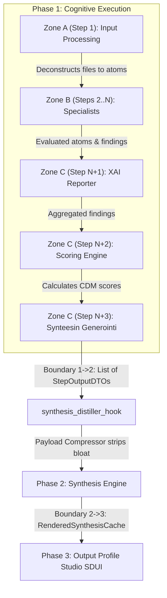

# EPIC 145: Workflow Context Governance & Studio UX Harmonization

## 1. Goal Description & Background (Objective & Problem Statement)

### Objective
Unify backend synthesis payload protection with frontend Studio workflow context governance and 3-Zone step management. This Epic hardens the backend synthesis distillation pipeline against context window saturation (1.08M+ token explosions) while simultaneously refactoring the Flutter Studio Workflow Builder step view and Step Blueprint Library:
1. **3-Zone Workflow Architecture**:
   - **Zone A (Input Anchor - Step 1: Input Processing)**: Immutable entry point for raw document ingestion ($inputs.*) and atomization. Protected system step (`is_system_core: true`, `sp_db849f9790984585`).
   - **Zone B (Cognitive Specialists - Steps 2...N)**: **100% Fully Dynamic in Quantity and Content**. Users have full CRUD flexibility to add new specialist roles, delete existing ones, reorder them, select analyzed atomized scopes, and establish cycle-safe dependencies.
   - **Zone C (Pipeline Funnel Anchors - Steps N+1...N+3: XAI Reporter, Scoring Engine, Synteesin Generointi)**: **100% Automated System Anchors (Zero Manual Input Mutations)**. System funnel steps (`sp_192910b5f5a34c79`, `sp_d245365e4a274b9e`, `sp_7a8b9c0d1e2f3a4b`) require and allow zero manual input selection or deletion. `XAI Reporter` automatically aggregates all active Zone B specialists ($steps), `Scoring Engine` automatically computes CDM matrix scores, and `Synteesin Generointi` seals the headless global state into Tripartite Phase 2 (Synthesis).
2. **System Core Blueprint Protection (`is_system_core: bool`)**: Protect essential foundational steps (`Input Processing`, `XAI Reporter`, `Scoring Engine`, `Synteesin Generointi`) against accidental deletion or renaming in both the UI and Backend API.
3. **Full-Width Accordion Master Cards**: Clean, modern single-column cards with categorized atomized materials ($inputs.*) vs. prior step reports ($steps.*).

### Problem Statement
In multi-document production runs, heavy LLM extraction steps (specifically Step 1 Input Processing `sp_db849f9790984585` with 100+ extracted atoms) generate megabytes of verbatim page references (`hydrated_references`) and unpruned `results`/`evaluations` arrays. During Phase 2 (Async Text Synthesis), `SynthesisPayloadCompressor` failed to strip `hydrated_references` and unpruned `results`, passing over 1.08M tokens to Gemini 2.5 Pro and triggering HTTP 400 `ContextWindowExceededError`.

Concurrently, the Flutter Studio Workflow Builder exposed raw developer jargon (*"Syötekartoitukset (Tilan injektointi)"*) in a single monolithic checkbox list, allowing unconstrained raw document selection across all steps and risking structural breakage if core foundational steps were deleted.

### High-Fidelity Synthesis vs. Payload Compression (Preventing Starvation & Preserving Human Tone)
Payload compression MUST NOT degrade synthesis narrative richness into dry, robotic scores. The system distinguishes strictly between bloated raw duplication and high-value qualitative human content:
1. **What Is Purged (Zero-Value Bloat)**:
   - Verbatim 100-page raw PDF text dumps replicated across 16 DAG steps (`hydrated_references`).
   - Internal execution tracking metadata (`_step_metadata`, `_audit_signature`, `_evaluative_matrices`).
   - Redundant atom cache hashing collections (`shuffled_atoms`).
2. **What Is Preserved & Curated for Rich Synthesis**:
   - **Exact Direct Quotes & Pre-Deduplication**: `MatrixExplanationService` curates the sharpest user voice and verbatim evidence (`settings.max_synthesis_quote_length`, 3-5 quotes per matrix) via `ranked_round_robin_select` with **Candidate Pre-Deduplication** (`seen_matrix_quotes: set[str]`) to prevent quote starvation when distinct TDAs share identical evidence sentences.
   - **Specialist Semantic Reasoning**: Narrative findings and qualitative explanations generated by Zone B specialists (specifically all cognitive roles including Analyst, Falsifier, and Coach).
   - **Status-Aware Dual Reporting**: Explicit distinction between fulfilled strengths (with supporting quotes) and critical deficits (with failure quotes).
   - **Consolidated Multi-Agent Synthesis**: `XAI Reporter` (`sp_192910b5f5a34c79`) overarching narrative context.
   - **Optimal Footprint**: Reduces payload from 1,080,000 tokens (crashes) down to 25,000–45,000 tokens (3-second execution, preserving 100% human tone and user identity).


---

## 2. Architectural Impact & Compliance Matrix

### Deprecations & Sunset List (`What We Will REMOVE`)
| Symbol / Entity | Location | Action | Replacement / Destination |
| :--- | :--- | :--- | :--- |
| `hydrated_references` in synthesis payload | `@[backend_v2/services/orchestrator/synthesis_payload_compressor.py#L17-L163]` | Purged | Stripped during payload compression |
| `_step_metadata`, `_audit_signature`, `_evaluative_matrices` | `@[backend_v2/services/orchestrator/synthesis_payload_compressor.py#L17-L163]` | Purged | Stripped during payload compression |
| Monolithic input checkboxes container | `@[client_app_v2/lib/features/studio/views/widgets/workflow/workflow_step_card.dart#L1-L335]` | Refactored | Split into Categorized Source Material and Prior Step Reports |
| Jargon header `studioWorkflowInputMappings` | `@[client_app_v2/lib/l10n/app_fi.arb#L1075-L1125]`, `@[client_app_v2/lib/l10n/app_en.arb#L1620-L1670]` | Replaced | Replaced by `studioWorkflowSourceDocsTitle` and `studioWorkflowPriorStepsTitle` |

### Retained SSOT Invariants (`What We Will RETAIN`)
- **Immutable Underlying Schema**: `StepRule.input_mappings: dict[str, str]` and `StepRule.depends_on: list[str]` remain 100% backward compatible and architecturally unchanged.
- **SSOT Settings Limits**: `settings.max_synthesis_evaluations` (default: `0` = Unbounded / no truncation by default), `settings.max_synthesis_quote_length`, `settings.max_synthesis_quotes_per_matrix`, and `settings.max_synthesis_unmet_criteria_per_matrix` in `@[backend_v2/settings.py]`.
- **Tripartite Configuration Architecture**: Models define defaults, Settings defines global bounds, and Output Profile DTOs provide optional profile-level overrides.

### Compliance & Modernity Gates
1. **Zero Legacy Fallback Hacks**: No `.get()` fallback chains for mandatory schema fields in `SynthesisPayloadCompressor`.
2. **Strict Dictionary Access & Key Deletion**: Iterated collections with known, validated keys MUST use deterministic and loud operations (specifically `del groups[group_id]` in `ranked_round_robin_select` upon bucket exhaustion). The use of duck-typing or soft fallbacks (`groups.pop(key, None)`) on known iterated keys is STRICTLY PROHIBITED per `the_zero_compromise_pledge`.
3. **Probe Boundary & Fail-Fast Isolation**:
   - Empty `evaluations` container resulting from data loss -> `AppException(VALIDATION_FAILED)`.
   - **Evaluations Count Governance & Token Shield Protocol**: When `settings.max_synthesis_evaluations == 0`, truncation is disabled (Unbounded Mode, full 100% forensic coverage without data loss). When `settings.max_synthesis_evaluations > 0` and count exceeds limit -> **100% Deterministic Prioritized Stratification** (deficits/failures prioritized up to 70% of limit, remaining budget to strengths with dynamic spillover, sorted deterministically by `(-len(exact_quotes), atom_id)` and canonically ordered by `atom_id`) with structured `logger.warning` (Token Shield). Blind array slicing (`evals[:limit]`) or random sampling is strictly prohibited to prevent "Auditing Whitewash" distortions and LLM prompt cache invalidation.
   - Dynamic step payload probing (`LevelStatsDTO` & `LightweightMatrixOutput`): Untrusted or malformed nested `level_breakdown` dictionaries MUST be wrapped in explicit `try...except (ValidationError, ValueError) as e:` PROBE BOUNDARIES with `logger.warning(..., extra={"error_code": ErrorCodes.INVALID_OUTPUT_SCHEMA.name, "details": str(e)})` and skipped with `continue` to preserve Fail-Fast isolation and prevent non-critical statistical metadata corruption from crashing overall synthesis aggregation.
4. **Observability & Structured Validation Logging Parity**: All probe-boundary and presentation-layer components (`MatrixExplanationService`, `XaiHighlightsAdapter`) MUST log caught `(ValidationError, ValueError)` exceptions with explicit structured error codes (`extra={"error_code": ErrorCodes.INVALID_OUTPUT_SCHEMA.name, "details": str(e)}`). Dropping `str(e)` / error details is strictly forbidden to prevent silent observability degradation in Cloud Logging and Datadog. Unhandled system exceptions and configuration errors MUST be logged via `logger.error(..., exc_info=True)` before raising `AppException` or `ConfigurationError`.
5. **Cross-Domain DTO Parity & Atomic Code Generation Lock (Contract First & Zero Duct-Tape)**: Because Quorum is in a pure development environment with zero live customers, zero legacy backwards-compatibility duct-tape or fallback chains are permitted (`zero_legacy_fallback_hacks`, `the_no_legacy_mandate`). The Consumer (Flutter Dart DTOs) and Producer (Python Pydantic DTOs) contracts MUST be updated and locked atomically in **Phase 1 (Contract First)**. Python Pydantic V2 `StepRule` / `Step` and Dart 3 Freezed `StepRule` / `NodeStrategy` (both `llm` and `logic` union variants) are synchronously updated with `is_synthesis_source` and `is_system_core`. Freezed code generation (`flutter_audit_loop.py --build`) MUST execute BEFORE any seed data mutation or Flutter domain parity tests (`domain_parity_test.dart`) to prevent `CheckedFromJsonException` crashes on `seed_data.json` deserialization.
6. **Dual-Axis Localization**: Zero hardcoded strings in Flutter widgets. All labels, subtitles, and tooltips defined in `app_fi.arb` and `app_en.arb`.
7. **God Code Prevention & Proactive Decomposition Governance (`@[ki_god_code_prevention.md]`)**:
   - **File Boundary & Size Ceiling**: All modified and newly created files (`synthesis_payload_compressor.py`, `matrix_explanation_service.py`, `workflow_step_card.dart`) MUST strictly respect modular boundaries and avoid accumulating monolithic helper bloat (`anti_god_file_dumping`, `private_helper_bloat_ban`). Complex sub-logic (specifically token stratifications and matrix explanation assemblies) MUST be kept decoupled in dedicated single-responsibility services.
   - **Pure Stateless DTOs (`domain_model_purity_mandate`)**: All Pydantic models (`Step`, `StepRule`, `SynthesisConfigDTO`) and Freezed Dart models MUST remain pure data transfer containers (`frozen=True, strict=True, extra="forbid"`), strictly isolating business logic into service layers.
   - **AST Boundary Verification & Remedial Protection**: Any refactoring targeting large files (>300 lines) MUST use exact AST inspection (`ast.parse`) rather than loose text matching to protect method boundaries (`ast_boundary_verification_mandate`).
   - **Safe Decomposition & Atomic Checkpoints**: Pre-implementation technical debt remediation and migrations MUST adhere to Strangler Fig / atomic batch constraints with continuous quality gate verification.

### Producer-Consumer Integration Check (Tripartite Lifecycle)



---

## 3. Phased Execution Plan (Implementation Strategy)

### Phase 1: Cross-Domain DTO Parity, Freezed Code Generation Lock & Pre-Implementation Tech Debt Cleanups (Contract First & Zero Duct-Tape)
- **Target Files**:
  - `@[backend_v2/models/v2_core.py#L712-L801]` (`Step` model)
  - `@[backend_v2/models/v2_core.py#L804-L836]` (`StepRule` model)
  - `@[backend_v2/models/v2_core.py#L1073-L1090]` (`SynthesisConfigDTO` model)
  - `@[backend_v2/settings.py#L51-L710]` (`Settings` class: `max_synthesis_evaluations` and `max_synthesis_reasoning_length` limit configs)
  - `@[backend_v2/exceptions.py#L99-L277]` (`ErrorCodes` enum: `SYSTEM_PROTECTED_RESOURCE`)
  - `@[backend_v2/services/orchestrator/synthesis_payload_compressor.py#L17-L163]` (`SynthesisPayloadCompressor` tech debt remediation)
  - `@[backend_v2/services/studio/workflow_service.py#L448-L479]` (`StudioWorkflowService.save_step` duck-typing elimination)
  - `@[client_app_v2/lib/features/studio/models/workflow.dart#L54-L116]` (`StepRule`, `NodeStrategy.llm`, `NodeStrategy.logic`)
  - `@[client_app_v2/test/features/studio/models/workflow_test.dart]`

- **Actions**:
  1. **Pre-Implementation Technical Debt Cleanups (Mandatory Phase 1 Gate per `touched_scope_tech_debt_mandate`)**:
     - In `@[backend_v2/services/orchestrator/synthesis_payload_compressor.py#L20-L163]`: Strictly eliminate `lite_ev_obj.model_copy(update={...})` (which performs an unvalidated shallow copy bypassing Pydantic V2 Rust core) and replace it with direct Pydantic re-validation: `DistilledEvaluation.model_validate(lite_ev_obj.model_dump(exclude_unset=True) | {"exact_quotes": [q[: settings.max_synthesis_quote_length] for q in valid_quotes], "semantic_reasoning": str(lite_ev_obj.semantic_reasoning)[: max_synthesis_reasoning_length] if lite_ev_obj.semantic_reasoning else None})`.
     - In `@[backend_v2/services/orchestrator/synthesis_payload_compressor.py#L20-L163]`: Eliminate hardcoded magic number `[:300]` for `semantic_reasoning`, referencing the newly centralized `max_synthesis_reasoning_length` (added to `Settings` in Phase 1) per `strict_configuration_segregation` and `ki_global_config_sovereignty.md`.
     - In `@[backend_v2/services/studio/workflow_service.py#L448-L479]`: Eliminate duck typing `getattr(data, "organization_id", None)` in `save_step`, replacing with direct typed attribute access `data.organization_id` per `the_zero_compromise_pledge` and `zero_service_layer_fallbacks`.
  2. Add `is_system_core: Annotated[bool, Field(description="Whether this step blueprint is a protected system foundational component.")] = False` to Python `Step` model.
  3. Add `is_synthesis_source: Annotated[bool, Field(description="Whether this step's narrative text output is forwarded to the synthesis LLM context.")] = True` to Python `StepRule` model.
  4. Add `max_quotes_per_matrix: Annotated[int | None, Field(description="Per-profile override for quotes per matrix in explanations.")] = None` and `max_unmet_criteria: Annotated[int | None, Field(description="Per-profile override for unmet criteria per matrix.")] = None` to `SynthesisConfigDTO`.
  5. Add `SYSTEM_PROTECTED_RESOURCE = "SYSTEM_PROTECTED_RESOURCE"` to `ErrorCodes` in `@[backend_v2/exceptions.py#L99-L277]` under a new `# System Protection` section.
  6. In `settings.py`:
     - Update `max_synthesis_evaluations: Annotated[int, Field(ge=0, description="Max evaluations for synthesis token shield. Set to 0 for unbounded (no truncation by default).")] = 0`.
     - Add `max_synthesis_reasoning_length: Annotated[int, Field(description="Maximum character length for semantic reasoning in synthesis payloads")] = 300` to `Settings` to eliminate hardcoded magic number `[:300]` in compressor logic.
  7. In `client_app_v2/lib/features/studio/models/workflow.dart`:
     - Add `@Default(false) @JsonKey(name: 'is_system_core') bool isSystemCore` to BOTH `NodeStrategy.llm` and `NodeStrategy.logic` Freezed sealed class constructors at `@[client_app_v2/lib/features/studio/models/workflow.dart#L76-L116]`. Both variants MUST include the field since it maps to the unified Python `Step.is_system_core`.
     - Add `@Default(true) @JsonKey(name: 'is_synthesis_source') bool isSynthesisSource` to the `StepRule` Freezed model constructor at `@[client_app_v2/lib/features/studio/models/workflow.dart#L54-L62]`. This maps 1:1 to the Python `StepRule.is_synthesis_source` field.
  8. **Mandatory Code Generation Lock**: Run Flutter code generation via `uv run python scripts/flutter_audit_loop.py client_app_v2/lib/features/studio/models/workflow.dart --build`.
  9. Update `workflow_test.dart` to verify that `isSystemCore` and `isSynthesisSource` deserialize correctly from JSON and adopt their default values (`false` and `true`) when omitted from payload.

### Phase 2: Atomic Seed Data Migration & Database Re-seeding Gate (Vault Protocol)
- **Target Files**:
  - `@[backend_v2/seed/seed_data.json]`
  - `@[backend_v2/seed/run_seed.py]`
- **Protocol Compliance**: Strictly follows `@[.agents/rules/03_seed_vault.md]` protocol.
- **Actions**:
  1. **Backup**: Execute timestamped backup: `New-Item -ItemType Directory -Force -Path backend_v2/seed/backups; Copy-Item backend_v2/seed/seed_data.json -Destination backend_v2/seed/backups/seed_data_pre_epic145.json`.
  2. **Step Definitions Migration (`is_system_core`)**:
     - In `seed_data.json` under `steps` array, set `"is_system_core": true` for protected foundational steps:
        - `sp_db849f9790984585` (`step_input_processing`, Input Processing)
        - `sp_192910b5f5a34c79` (`step_xai_reporter`, XAI Reporter)
        - `sp_d245365e4a274b9e` (`sp_d245365e4a274b9e`, Scoring Engine / Native Logic Hook)
        - `sp_7a8b9c0d1e2f3a4b` (`synthesis_generation`, Synteesin Generointi)
     - Set `"is_system_core": false` explicitly for all remaining step definitions in the `steps` array (specifically and exhaustively all steps where `id` not in `{sp_db849f9790984585, sp_192910b5f5a34c79, sp_d245365e4a274b9e, sp_7a8b9c0d1e2f3a4b}`).
  3. **Workflow Step Rules Migration (`is_synthesis_source`)**:
     - In `seed_data.json` under `workflows[0].steps` array, configure `"is_synthesis_source"` for all `StepRule` definitions:
       - Set `"is_synthesis_source": false` for `sr_f0a26d17cc9b48a7` (Step 1: Input Processing blueprint `sp_db849f9790984585`) to ensure raw document decompositions (`hydrated_references`) are excluded from synthesis.
       - Set `"is_synthesis_source": true` for all other cognitive specialist and funnel step rules in `workflows[0].steps` to forward their narrative evaluations to the synthesis engine.
  4. **Integrity & Re-Seed Gate**:
     - Dry-run JSON validation to ensure zero syntax or trailing comma regressions.
     - Execute backend audit: `uv run python scripts/backend_audit_loop.py backend_v2 --test`.
     - Re-seed local development database: `uv run python backend_v2/seed/run_seed.py local`.
  5. **Atomic Test Data Parity Gate (CI/CD Protection)**:
     - Verify that the updated `seed_data.json` (the sole Single Source of Truth for test fixtures loaded by `conftest.py` and `domain_parity_test.dart`) immediately passes both backend `pytest` suite and frontend domain parity tests.

### Phase 3: Backend Domain & Synthesis Payload Compression Hardening
- **Target Files**:
  - `@[backend_v2/services/orchestrator/synthesis_payload_compressor.py#L17-L163]` (`SynthesisPayloadCompressor`)
  - `@[backend_v2/services/orchestrator/synthesis_distiller.py#L171-L344]` (`synthesis_distiller_hook`)
  - `@[backend_v2/services/orchestrator/matrix_explanation_service.py#L25-L224]` (`MatrixExplanationService`)
  - `@[backend_v2/services/studio/workflow_service.py#L481-L504]` (`StudioWorkflowService.delete_step`)
  - `@[backend_v2/services/studio/workflow_service.py#L448-L479]` (`StudioWorkflowService.save_step`)
  - `@[backend_v2/api/routers/studio/steps.py#L100-L119]` (`save_step` endpoint)
  - `@[backend_v2/api/routers/studio/steps.py#L122-L142]` (`delete_step` endpoint)

- **Actions**:
  0. **Structural Prerequisites (Encapsulation & Logging)**:
      - Add `__all__ = ["SynthesisPayloadCompressor"]` module export declaration to `@[backend_v2/services/orchestrator/synthesis_payload_compressor.py]`. Currently missing entirely — violates encapsulation mandate.
      - Add `import logging` and `logger = logging.getLogger(__name__)` to `@[backend_v2/services/orchestrator/synthesis_payload_compressor.py]`. Currently has NO logger instance — prerequisite for all `logger.error(...)` and `logger.warning(...)` calls specified below.
      - Add `from pydantic import ValidationError` to the import block (required for specific exception catching below).
  1. Upgrade `SynthesisPayloadCompressor._strip_heavy_keys`:
     - Explicitly and exhaustively strip keys using `obj.pop(key, None)` for each key in the following closed set: `"shuffled_atoms"`, `"atom_quotes"`, `"hydrated_references"`, `"_step_metadata"`, `"_audit_signature"`, `"_evaluative_matrices"`. NOTE: `pop(key, None)` is architecturally permitted here because these keys are OPTIONAL metadata that may or may not exist on any given payload dict. This is distinct from the `the_zero_compromise_pledge` ban which prohibits `.pop(key, None)` on keys that are KNOWN to exist in iterated collections.
     - Optimize top-level BaseModel handling: avoid redundant `copy.deepcopy` calls after `model_dump(exclude_unset=True)`.
     - Implement dedicated `_normalize_result_item(item: dict[str, Any]) -> dict[str, Any]` for `results` payload schema. **Routing Discriminator**: If the result item dictionary contains the key `"exact_quotes"`, route to `DistilledEvaluation.model_validate()` (evaluation-type result). Otherwise, apply strict field whitelisting (specifically and exhaustively retaining only the whitelisted keys: `"output_text"`, `"status"`, `"atom_id"`) to prevent raw unvalidated dictionaries from propagating bloat into synthesis prompts (`no_naked_dicts_in_state` compliant).
     - Process `"evaluations"` and `"results"` as dual explicit distillation paths without fallback chains.
     - Enforce `DistilledEvaluation.model_validate(lite_ev_obj.model_dump(exclude_unset=True) | {...})` re-validation (strictly replacing `lite_ev_obj.model_copy(update={...})` and referencing `max_synthesis_reasoning_length`).
     - Refactor exception handling in `SynthesisPayloadCompressor`: eliminate broad `except Exception as e:` wrapping without RFC-7807 logging. Catch specific `(ValidationError, ValueError)` and log via `logger.error("[SynthesisCompressor] %s: Validation failed during payload distillation: %s", ErrorCodes.VALIDATION_FAILED.name, str(e))` before raising `AppException(status_code=400, details={"error_code": ErrorCodes.VALIDATION_FAILED.value})`.
     - **Token Shield Prioritized Stratification & Unbounded Protocol (Intentional Fail-Fast Deviation)**:
        - If `settings.max_synthesis_evaluations == 0`: Truncation is completely disabled (Unbounded Mode). All valid distilled evaluations are forwarded to synthesis, ensuring 100% forensic coverage for standard production runs without data loss.
        - If `settings.max_synthesis_evaluations > 0` and `len(lite_evals) > settings.max_synthesis_evaluations`:
          Apply **100% Deterministic Prioritized Stratification** via `_prune_and_stratify_evaluations(evals, limit)`:
          1. Partition evaluations into Deficits/Failures (`status in ("FAILED", "UNMET", "NON_COMPLIANT")` or `is_unmet: True`) and Strengths/Passes.
          2. Sort both partitions deterministically using compound sort key `(-len(exact_quotes), atom_id)` prioritizing items with richer evidence quotes, with immutable `atom_id` as the absolute tie-breaker.
          3. Allocate dynamic budget with spillover:
             - `deficit_budget = min(len(deficits), math.ceil(limit * 0.70))`
             - `strength_budget = min(len(strengths), limit - deficit_budget)`
             - If strengths do not exhaust their allotment (`len(strengths) < strength_budget`) and deficits have remaining items, allow deficits to claim the unused budget: `deficit_budget = min(len(deficits), limit - strength_budget)`.
          4. Slice top items: `selected = deficits[:deficit_budget] + strengths[:strength_budget]`.
          5. Final canonical sort: `sorted(selected, key=lambda x: str(x["atom_id"]))`. All items are already validated through `DistilledEvaluation.model_validate()` at this point, guaranteeing `atom_id` existence — direct key access is mandatory per `the_zero_compromise_pledge` (no `.get()` fallbacks on validated data). This guarantees 100% byte-for-byte reproducible JSON prompt serialization across worker processes and test runs, preserving LLM Prompt Caching and eliminating Flaky Tests.
          6. Emit structured `logger.warning("Token Shield: Prioritized stratification applied", extra={"original_count": len(evals), "limit": limit, "deficits_retained": deficit_budget, "strengths_retained": strength_budget, "dropped_count": len(evals) - len(selected)})`.
        - **Architectural Justification**: Eliminates the "Auditing Whitewash" anti-pattern where blind array slicing (`evals[:limit]`) dropped critical compliance failures at the tail of the list and tricked the LLM into generating false-clean audit reports, while completely preventing Non-Deterministic Flaky Test and Cache Invalidation risks by locking the exact multi-key sorting and tie-breaker algorithm. Setting default to `0` guarantees complete audit fidelity while retaining configurable bounding for extreme multi-thousand atom runs.
  2. In `synthesis_distiller.py`:
     - **Structural Prerequisite**: Add `__all__` module export declaration listing all public symbols.
     - Forward `output_profile.synthesis` config into `MatrixExplanationService.assemble_matrices_to_explain()`.
     - Filter `available_dtos` using the `StepRule.is_synthesis_source` flag: only include steps where the corresponding `StepRule.is_synthesis_source == True` in the synthesis payload assembly.
  3. In `matrix_explanation_service.py`:
     - **Structural Prerequisite**: Add `__all__` module export declaration listing all public symbols.
     - Accept an additional `synthesis_config: SynthesisConfigDTO | None` parameter in `assemble_matrices_to_explain()`. Consume profile-level `max_quotes_per_matrix` and `max_unmet_criteria` overrides using the **Tripartite Configuration Resolution**: `synthesis_config.max_quotes_per_matrix if synthesis_config and synthesis_config.max_quotes_per_matrix is not None else settings_obj.max_synthesis_quotes_per_matrix`. This follows the Tripartite Configuration Architecture (Models → Settings → Profile Override) and is NOT a banned fallback chain per `zero_service_layer_fallbacks`.
     - **Deduplication Starvation Prevention**: The `seen_matrix_quotes: set[str]` pre-deduplication pattern already exists at `@[backend_v2/services/orchestrator/matrix_explanation_service.py#L25-L224]`. Verify it remains intact and operates BEFORE `ranked_round_robin_select`.
     - **Strict Key Deletion Invariant**: The `del groups[group_id]` pattern already exists at `@[backend_v2/utils/ranked_round_robin.py#L73]`. Verify it remains intact and no `.pop(k, None)` patterns are introduced.
     - **Probe Boundary Isolation (Architectural Exception to Duct-Tape Ban)**: Maintain strict Probe Boundary isolation on `LevelStatsDTO.model_validate(raw_stats, strict=False)` and `AtomResultDTO.model_validate` with `try...except (ValidationError, ValueError) as e:` logging structured `extra={"error_code": ErrorCodes.INVALID_OUTPUT_SCHEMA.name, "details": str(e)}`. **Architectural Justification**: These probe boundaries protect non-critical statistical metadata (level breakdowns) from crashing the overall synthesis aggregation. Malformed `level_breakdown` dictionaries from upstream DAG steps are explicitly non-critical and MUST NOT block synthesis. This follows the established pattern at `@[backend_v2/services/orchestrator/matrix_explanation_service.py#L25-L224]`.
      - **Resolve `except Exception:` in Label Resolution**: Replace silent catch-all `except Exception:` in claim text resolution at `@[backend_v2/services/orchestrator/matrix_explanation_service.py#L28-L224]` (inside `assemble_matrices_to_explain`, specifically lines 121-124) with direct typed resolution `claim.label.resolve(target_locale)` (or catching specific `(KeyError, AttributeError)` with structured debug logging) per `the_duct_tape_ban` and `universal_fail_fast`.
     - **Eliminate `.get()` with Magic Default in `tda_to_scale`**: Replace `tda_to_scale.get(tda_id, 999)` at `@[backend_v2/services/orchestrator/matrix_explanation_service.py#L152]` with direct typed access `tda_to_scale[tda_id]`. The key is guaranteed to exist because `tda_to_claim` and `tda_to_scale` are populated from the identical loop (lines 126-128). The magic default `999` violates `strict_configuration_segregation` and `the_zero_compromise_pledge`.
  4. In backend `StudioWorkflowService` (`workflow_service.py`):
     - **Structural Prerequisite**: Add `__all__` module export declaration listing all public symbols.
     - Enforce Fail-Fast protection: If `step.is_system_core` is True, raise `AppException(ErrorCodes.SYSTEM_PROTECTED_RESOURCE)` on deletion or renaming attempts.
     - In `@[backend_v2/services/studio/workflow_service.py#L448-L479]`: Eliminate duck typing `getattr(data, "organization_id", None)` in `save_step`. Access typed attribute `data.organization_id` directly per `the_zero_compromise_pledge` and `zero_service_layer_fallbacks`.

### Phase 4: Studio Workflow & Step Blueprint UX Restructuring (3-Zone Management & Core Protection)
- **Target Files**:
  - `@[client_app_v2/lib/l10n/app_fi.arb#L1075-L1125]`
  - `@[client_app_v2/lib/l10n/app_en.arb#L1620-L1670]`
  - `@[client_app_v2/lib/features/studio/views/widgets/workflow/workflow_step_card.dart#L1-L335]`
  - `@[client_app_v2/lib/features/studio/views/step_builder_view.dart#L108-L140]`
  - `@[client_app_v2/lib/features/studio/views/step_builder_view.dart#L219-L295]`
- **Actions**:
  1. Add localized strings to `app_fi.arb` and `app_en.arb`:
     - `studioWorkflowTaskProfileTitle`: `"Tehtäväprofiili (Kognitiivinen rooli)"` / `"Task Profile (Cognitive Role)"`
     - `studioWorkflowExecutionOrderTitle`: `"Suoritusjärjestys & Riippuvuudet"` / `"Execution Order & Dependencies"`
     - `studioWorkflowExecutionOrderSubtitle`: `"Käynnistyy vasta kun valitut edeltävät vaiheet ovat valmistuneet:"` / `"Runs only after the following prior steps complete:"`
     - `studioWorkflowStep1IngestionTitle`: `"Syötenäytöllä määritetyt raakatiedostot (PDF, DOCX)"` / `"Raw Source Documents from Input Screen (PDF, DOCX)"`
     - `studioWorkflowStep1IngestionSubtitle`: `"Tämä vaihe lukee annetut raakadokumentit ja pilkkoo ne strukturoiduiksi todisteiksi ja atomeiksi."` / `"This step ingests raw documents and decomposes them into structured evidence and atoms."`
     - `studioWorkflowStep1OutputBadge`: `"✨ Muuntaa tiedostot puretuiksi atomeiksi loppuketjulle."` / `"✨ Deconstructs files into atoms and citations for the pipeline."`
     - `studioWorkflowAtomicScopeTitle`: `"Atomisoidut aineistot (Valitse analysoitavat sisällöt)"` / `"Atomized Materials (Select Analyzed Contents)"`
     - `studioWorkflowAtomicScopeSubtitle`: `"Syötenäytöllä määritettyjen dokumenttien puretut atomit ja sitaatit (raakatiedostoja ei raahata mukana):"` / `"Decomposed atoms and citations from input screen documents (raw files are excluded):"`
     - `studioWorkflowPriorStepsTitle`: `"Edeltävien askeleiden tekstiyhteenvedot (Valinnainen)"` / `"Prior Step Text Summaries (Optional)"`
     - `studioWorkflowPriorStepsSubtitle`: `"Valitse vain jos agentin pitää lukea laaja sanallinen analyysi. Strukturoitu data ja havainnot siirtyvät aina automaattisesti."` / `"Enable only if this agent needs to read the narrative analysis. Structured findings are forwarded automatically."`
     - `studioWorkflowZoneCAutoTitle`: `"Automaattinen järjestelmäankkuri (Suojattu)"` / `"Automated System Anchor (Protected)"`
     - `studioWorkflowXaiReporterAggregateBadge`: `"⚡ Automaattinen koonti: Kokoaa automaattisesti kaikki yllä määritellyt työnkulun asiantuntijat."` / `"⚡ Automatic Aggregation: Automatically collects all active workflow specialists above."`
     - `studioWorkflowXaiReporterPayloadDesc`: `"📑 Yhdistetty tilasyöte ($steps): Tämä askel lukee ja ristiinanalysoi kaikkien aktiivisten asiantuntijoiden havainnot ja todisteet. Raakatiedostoja ei tarvita."` / `"📑 Consolidated State Stream ($steps): This step ingests and cross-analyzes all active specialist findings. Raw files are excluded."`
     - `studioSystemCoreBadge`: `"🔒 Järjestelmän perusaskel (Suojattu)"` / `"🔒 System Core Step (Protected)"`
     - `studioStepBuilderModelStrategyRequired`: `"Tekoälymalli (Model Strategy) on pakollinen LLM-askelille."` / `"Model Strategy is required for LLM steps."`
     - `studioWorkflowInputPrefix`: `"Syöte: {name}"` / `"Input: {name}"`
     - `studioWorkflowStepPrefix`: `"Askel: {name}"` / `"Step: {name}"`
     - `studioWorkflowNoSelectableInputs`: `"Ei valittavia syötteitä tai riippuvuuksia."` / `"No selectable inputs or dependencies available."`
  2. Refactor `WorkflowStepCard` with the **3-Zone Layout, Blueprint Locking & Design System Parity**:
     - Eliminate hardcoded Finnish strings (`'Syöte: $labelText'`, `'Askel: $labelStr'`, `'Ei valittavia syötteitä...'`) at lines 225, 279, 308, utilizing generated `l10n` getters per `no_magic_strings_l10n` (Axis 1 - Structural Localization).
     - Modernize `getBlueprintLabel(String stepId)` to use `bp.name.get(Localizations.localeOf(context).languageCode)` on `I18nText` instead of manual fallback chains (`bp.name.translations['fi'] ?? bp.name.translations['en']`) per `@[ki_dual_axis_localization_architecture.md]` (Axis 2 - Semantic Dynamic Localization).
     - Eliminate manual string truncation `substring(0, 15)` at lines 181 and 273, replacing with Flutter `Text(..., overflow: TextOverflow.ellipsis)` per `horizontal_overflow_prevention`.
     - **Pre-Implementation Tech Debt**: Replace Finnish docstring comment `/// Polymorfisille luokille ei sallita Unknown/Fallback -tyyppejä.` at `@[client_app_v2/lib/features/studio/models/workflow.dart#L69]` with English equivalent `/// Sealed Classes Mandate: Unknown/Fallback union types are strictly forbidden.` per `internal_language_and_epic_ban`.
     - **Zone A (Step 1 - Input Processing)**:
       - Header: Index badge, title, collapse arrow (Delete button 🗑 is HIDDEN/DISABLED).
       - Blueprint: **Locked System Anchor** (`Input Processing`). Dropdown is disabled/hidden, displaying locked `studioSystemCoreBadge`.
       - Body: Full-width container for Tab 2 raw documents ($inputs.*), Output Badge.
     - **Zone B (Steps 2...N - Cognitive Specialists: 100% Dynamic in Quantity and Content)**:
       - Header: Index badge, title, Delete button 🗑, collapse arrow.
       - Blueprint Dropdown: Filtered list showing exclusively cognitive specialist roles (specifically all blueprints where `is_system_core == false`). System core anchor steps are filtered out to prevent duplication or structural displacement.
       - Body: Dynamic dependency chips (`FilterChip`) with **Real-time Cycle Detection**, full-width container for Atomized Materials, full-width container for Prior Step Reports.
     - **Zone C (Steps N+1...N+3 - Pipeline Funnel: XAI Reporter, Scoring Engine, Synteesin Generointi)**:
       - Header: Index badge, title, Funnel badge, collapse arrow (Delete button 🗑 is HIDDEN/DISABLED).
       - Blueprint: **Locked System Anchors** (`XAI Reporter` `sp_192910b5f5a34c79`, `Scoring Engine` `sp_d245365e4a274b9e`, `Synteesin Generointi` `sp_7a8b9c0d1e2f3a4b`). Dropdowns are completely locked.
       - Body: **Zero manual input mutations**.
         - Dynamic Step N+1 (`XAI Reporter`): Shows `studioWorkflowXaiReporterAggregateBadge` and list of active Zone B specialists collected dynamically via `$steps`.
         - Dynamic Step N+2 (`Scoring Engine`): Shows automatic CDM calculation badge connecting to `XAI Reporter`.
         - Dynamic Step N+3 (`Synteesin Generointi`): Shows headless state sealing badge into Tripartite Phase 2.
  3. Refactor Step Blueprint Management (`step_builder_view.dart`):
     - Replace hardcoded hex color `backgroundColor: const Color(0xFF2E7D32)` at line 252 by removing the explicit `backgroundColor` parameter entirely, allowing the `SnackBar` to inherit standard themed styling from `Theme.of(context).snackBarTheme` per `design_token_absolute_rule`.
     - Replace hardcoded snackbar error text at line 237 with `l10n.studioStepBuilderModelStrategyRequired`.
     - **System Core Protection (`is_system_core == true`)**:
       - Hide/disable the Delete action 🗑 and show the `studioSystemCoreBadge` (`🔒 Järjestelmän perusaskel (Suojattu)`).
       - Lock execution type (`logic` vs `llm`), hook name (specifically `apply_scoring_logic` for Scoring Engine), and expected input signatures to prevent engine disruption.
     - **Informational Slug Policy**:
       - Reaffirm that `slug` is purely informational metadata for human display and SEO, and is NEVER used for relational bindings or routing. Users are free to edit the slug without affecting system integrity.
       - System relationships and step references strictly bind to the immutable **Opaque Stripe ID** (`sp_...`).
     - **Mandatory Quality Gates for Specialist Blueprints**:
       - Require at least one Role Block and a valid Model Strategy before saving LLM specialist blueprints.

### Phase 5: Verification, Widget Testing & E2E Integration Gate
- **Target Files**:
   - `@[backend_v2/tests/unit/services/orchestrator/test_synthesis_payload_compressor.py]` (**Canonical Location** — all new compressor tests MUST be placed here. If a legacy file exists at `backend_v2/tests/unit/test_synthesis_payload_compression.py`, it MUST be migrated into the canonical path and the legacy file deleted to prevent dual SSOT.)
   - `@[backend_v2/tests/unit/services/test_studio.py#L238-L252]` (`test_delete_step`)
   - `@[client_app_v2/test/models/domain_parity_test.dart]`
   - `@[client_app_v2/test/features/studio/models/workflow_test.dart]`
   - [NEW] `@[client_app_v2/test/features/studio/views/widgets/workflow/workflow_step_card_test.dart]`

- **Actions**:
  1. Implement comprehensive unit, negative, and ISTQB equivalence partition test suite in `test_synthesis_payload_compression.py` and `test_studio.py` per `heterogeneous_payload_testing_mandate`:
     - `test_compress_payload_unbounded_when_zero_evaluations_limit`
     - `test_compress_payload_prioritized_stratification_retains_critical_deficits_over_passes`
     - `test_compress_payload_stratification_is_100_percent_deterministic_with_tiebreakers` (verifying byte-for-byte identical output across repeated runs, shuffle permutations of input evals, and dynamic budget spillover)
     - `test_compress_payload_strips_hydrated_references_and_heavy_keys`
     - `test_compress_payload_with_results_only_no_evaluations`
     - `test_compress_payload_evaluations_empty_after_compression_fails_fast`
     - `test_compress_payload_heterogeneous_dag_types` (exhaustively testing all 4 ISTQB partitions: Partition 1: `dict[str, Any]` matrix evaluations, Partition 2: `list[Any]` batch items and DTO lists, Partition 3: `str` pure Markdown/narratives, Partition 4: Scalars `int`/`float`/`bool` and empty falsy inputs `None`/`""`/`{}`)
     - `test_delete_step_protected_system_core_fails_fast` (verifying `AppException(SYSTEM_PROTECTED_RESOURCE)` on system core step deletion)
     - `test_save_step_direct_organization_id_access` (verifying direct typed access without duck-typing fallback)
  2. Implement Flutter Widget and Parity tests:
     - `workflow_step_card_test.dart`:
       - Renders categorized `$inputs.` vs `$steps.` sections.
       - Toggling `isSynthesisSource` invokes `onChanged` callback with updated boolean.
       - Verifies correct localized strings and absence of raw hardcoded Finnish strings.
     - `domain_parity_test.dart`:
       - Confirms background Isolate parsing extracts all Workflows and Steps from `seed_data.json` without `CheckedFromJsonException`.
     - `workflow_test.dart`:
       - Verifies Freezed deserialization and default values for `is_system_core` and `is_synthesis_source`.
  3. Execute automated Quality Gate audits:
     - `uv run python scripts/backend_audit_loop.py backend_v2/services/orchestrator/synthesis_payload_compressor.py --test`
     - `uv run python scripts/flutter_audit_loop.py client_app_v2/lib/features/studio/views/widgets/workflow/workflow_step_card.dart --test`


---

## 4. Definition of Done (DoD) & Verification Plan

### Definition of Done (DoD)
- [ ] `SynthesisPayloadCompressor` strips `hydrated_references` and internal metadata, reducing synthesis payload size by over 85% in multi-document runs.
- [ ] `SynthesisPayloadCompressor` supports Unbounded Mode (`max_synthesis_evaluations = 0` default) and Prioritized Stratification when limit > 0, preventing Auditing Whitewash.
- [ ] `StepRule.is_synthesis_source` properly excludes unselected steps from `synthesis_distiller_hook` source blocks.
- [ ] `backend_v2/seed/seed_data.json` is atomistically migrated with `is_system_core` populated on all step definitions in `steps` and `is_synthesis_source` populated on all step rules in `workflows[0].steps`, and database re-seeded via `run_seed.py local`.
- [ ] `SynthesisConfigDTO` profile overrides for `max_quotes_per_matrix` and `max_unmet_criteria` are functional in `MatrixExplanationService`.
- [ ] `MatrixExplanationService` enforces Candidate Pre-Deduplication, guaranteeing full quote budget without deduplication starvation.
- [ ] Studio `WorkflowStepCard` displays 3 distinct, categorized sections with localized explanatory text and zero hardcoded strings.
- [ ] All modified backend Python modules declare explicit `__all__` module exports per encapsulation mandate.
- [ ] All modified backend Python modules that emit structured logs have `import logging` and `logger = logging.getLogger(__name__)` at module level.
- [ ] All Python and Flutter automated quality gates pass with 0 warnings, 0 type errors, and 100% green tests.

### Automated Unit & Widget Tests (Sequenced by Phase)
```powershell
# Phase 1: Freezed Code Generation & DTO Tests
uv run python scripts/flutter_audit_loop.py client_app_v2/lib/features/studio/models/workflow.dart --build
uv run flutter test client_app_v2/test/features/studio/models/workflow_test.dart

# Phase 2: Seed Data Migration & Domain Parity Gate
uv run python backend_v2/seed/run_seed.py local
uv run flutter test client_app_v2/test/models/domain_parity_test.dart

# Phase 3: Backend Compressor & Synthesis Tests
uv run pytest backend_v2/tests/unit/test_synthesis_payload_compression.py -v
uv run pytest backend_v2/tests/unit/services/orchestrator/test_matrix_explanation_service.py -k "deduplication_starvation" -v
uv run pytest backend_v2/tests/unit/services/test_studio.py -k "test_delete_step" -v

# Phase 4 & 5: Flutter Widget & Quality Gate Audits
uv run flutter test client_app_v2/test/features/studio/views/widgets/workflow/workflow_step_card_test.dart
uv run python scripts/backend_audit_loop.py backend_v2/services/orchestrator/synthesis_payload_compressor.py --test
uv run python scripts/flutter_audit_loop.py client_app_v2/lib/features/studio/views/widgets/workflow/workflow_step_card.dart --test
```

### AST Guardrails & Structural Tests
- Ensure `SynthesisPayloadCompressor` contains zero `.get()` fallback chains on mandatory evaluation keys and zero hardcoded magic numbers (referencing `max_synthesis_reasoning_length` from `Settings`).
- Ensure `DistilledEvaluation` does not use in-place mutation or unvalidated model copies, enforcing `model_dump(exclude_unset=True)`.
- Ensure `workflow_service.py` uses direct attribute access `data.organization_id` with zero `getattr()` calls.
- Ensure `MatrixExplanationService` enforces Candidate Pre-Deduplication (`seen_matrix_quotes`) before invoking `ranked_round_robin_select`.
- Ensure `MatrixExplanationService` protects `LevelStatsDTO` and atom parsing inside a dedicated `try...except (ValidationError, ValueError)` probe boundary with structured `ErrorCodes.INVALID_OUTPUT_SCHEMA` logging including `details=str(e)`.
- Ensure SDUI adapters (`XaiHighlightsAdapter`) maintain structured logging parity with `details=str(e)` on validation errors and `exc_info=True` on configuration errors.
- Ensure `ranked_round_robin_select` strictly uses deterministic `del groups[...]` upon bucket exhaustion without soft `.pop(..., None)` fallbacks.
- Ensure Flutter widgets `workflow_step_card.dart` and `step_builder_view.dart` contain zero hardcoded user-facing strings or raw color hex codes.


### Manual Verification Steps
1. Start local development environment: `.\run_local.bat`.
2. Open *Admin Studio* -> *Workflows* -> *Kokonaisvaltainen Auditointi* -> *Stepit & Riippuvuudet*.
3. Verify that the step card renders the 3 categorized sections with clean styling and intuitive toggles.
4. Execute `render_profile_job` for an execution record with 100+ extracted atoms and verify synthesis completes in under 5 seconds with zero HTTP 400 errors.

### MANDATORY Final E2E REST API Verification Gate
```powershell
$env:RUN_LIVE_E2E="true"; uv run pytest backend_v2/tests/integration/test_integration_real_llm.py -k "test_synthesis"
```


### Post-Implementation Gates

#### Tier 2 Hardening (Backend)
- [ ] `@[backend_v2/services/orchestrator/synthesis_payload_compressor.py]`
- [ ] `@[backend_v2/services/orchestrator/synthesis_distiller.py]`
- [ ] `@[backend_v2/services/orchestrator/matrix_explanation_service.py]`
- [ ] `@[backend_v2/services/studio/workflow_service.py]`
- [ ] `@[backend_v2/api/routers/studio/steps.py]`

#### Tier 2 Hardening (Frontend)
- [ ] `@[client_app_v2/lib/features/studio/views/widgets/workflow/workflow_step_card.dart]`
- [ ] `@[client_app_v2/lib/features/studio/views/step_builder_view.dart]`

---

## 5. Required Context & Governance (Rules & KI Registry)

```xml
<required_context_rules>
  <rule>@[.agents/rules/00-antigravity-core.md]</rule>
  <rule>@[.agents/rules/01-python-backend.md]</rule>
  <rule>@[.agents/rules/02_flutter_desktop.md]</rule>
  <rule>@[.agents/rules/03_seed_vault.md]</rule>
  <rule>@[.agents/rules/04_directory_reference.md]</rule>
  <rule>@[.agents/rules/05_llm_architecture.md]</rule>
</required_context_rules>

<required_knowledge_items>
  <ki>@[ki_synthesis_payload_compression.md]</ki>
  <ki>@[ki_sdui_matrix_synthesis.md]</ki>
  <ki>@[ki_tripartite_pipeline_architecture.md]</ki>
  <ki>@[ki_god_code_prevention.md]</ki>
  <ki>@[ki_dual_axis_localization_architecture.md]</ki>
  <ki>@[ki_strict_sdui_serialization.md]</ki>
  <ki>@[ki_python_314_concurrency_strictness.md]</ki>
  <ki>@[ki_global_config_sovereignty.md]</ki>
  <ki>@[ki_matrix_boolean_evaluation_strictness.md]</ki>
  <ki>@[ki_ai_testing_standards.md]</ki>
  <ki>@[ki_dag_engine_dto_projection_rules.md]</ki>
  <ki>@[ki_neuro_symbolic_agentic_workflow.md]</ki>
  <ki>@[ki_flat_polymorphic_pipeline.md]</ki>
  <ki>@[ki_sdui_adapter_pattern.md]</ki>
</required_knowledge_items>
```
