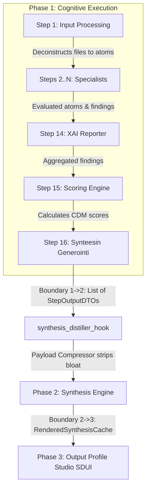

# EPIC 145: Workflow Context Governance & Studio UX Harmonization

## 1. Goal Description & Background (Objective & Problem Statement)

### Objective
Unify backend synthesis payload protection with frontend Studio workflow context governance and 3-Zone step management. This Epic hardens the backend synthesis distillation pipeline against context window saturation (1.08M+ token explosions) while simultaneously refactoring the Flutter Studio Workflow Builder step view and Step Blueprint Library:
1. **3-Zone Workflow Architecture**:
   - **Zone A (Input Anchor - Step 1: Input Processing)**: Immutable entry point for raw document ingestion ($inputs.*) and atomization. Protected system step (`is_system_core: true`).
   - **Zone B (Cognitive Specialists - Steps 2...N)**: **100% Fully Dynamic in Quantity and Content**. Users have full CRUD flexibility to add new specialist roles, delete existing ones, reorder them, select analyzed atomized scopes, and establish cycle-safe dependencies.
   - **Zone C (Pipeline Funnel Anchors - Steps N+1...N+3: XAI Reporter, Scoring Engine, Synteesin Generointi)**: **100% Automated System Anchors (Zero Manual Input Mutations)**. Steps 14, 15, and 16 require and allow zero manual input selection or deletion. Step 14 automatically aggregates all active Zone B specialists ($steps), Step 15 automatically computes CDM matrix scores, and Step 16 seals the headless global state into Tripartite Phase 2 (Synthesis).
2. **System Core Blueprint Protection (`is_system_core: bool`)**: Protect essential foundational steps (`Input Processing`, `XAI Reporter`, `Scoring Engine`, `Synteesin Generointi`) against accidental deletion or renaming in both the UI and Backend API.
3. **Full-Width Accordion Master Cards**: Clean, modern single-column cards with categorized atomized materials ($inputs.*) vs. prior step reports ($steps.*).

### Problem Statement
In multi-document production runs, heavy LLM extraction steps (specifically Step 1 Input Processing `sp_db849f9790984585` with 100+ extracted atoms) generate megabytes of verbatim page references (`hydrated_references`) and unpruned `results`/`evaluations` arrays. During Phase 2 (Async Text Synthesis), `SynthesisPayloadCompressor` failed to strip `hydrated_references` and unpruned `results`, passing over 1.08M tokens to Gemini 2.5 Pro and triggering HTTP 400 `ContextWindowExceededError`.

Concurrently, the Flutter Studio Workflow Builder exposed raw developer jargon (*"Syötekartoitukset (Tilan injektointi)"*) in a single monolithic checkbox list, allowing unconstrained raw document selection across all steps and risking structural breakage if core foundational steps were deleted.

### High-Fidelity Synthesis vs. Payload Compression (Preventing Starvation & Preserving Human Tone)
Payload compression MUST NOT degrade synthesis narrative richness into dry, robotic scores. The system distinguishes strictly between bloated raw duplication and high-value qualitative human content:
1. **What Is Purged (Zero-Value Bloat)**:
   - Verbatim 100-page raw PDF text dumps replicated across 16 DAG steps (`hydrated_references`).
   - Internal execution tracking metadata (`_step_metadata`, `_audit_signature`, `_evaluative_matrices`).
   - Redundant atom cache hashing collections (`shuffled_atoms`).
2. **What Is Preserved & Curated for Rich Synthesis**:
   - **Exact Direct Quotes & Pre-Deduplication**: `MatrixExplanationService` curates the sharpest user voice and verbatim evidence (`settings.max_synthesis_quote_length`, 3-5 quotes per matrix) via `ranked_round_robin_select` with **Candidate Pre-Deduplication** (`seen_matrix_quotes: set[str]`) to prevent quote starvation when distinct TDAs share identical evidence sentences.
   - **Specialist Semantic Reasoning**: Narrative findings and qualitative explanations generated by Zone B specialists (specifically all cognitive roles including Analyst, Falsifier, and Coach).
   - **Status-Aware Dual Reporting**: Explicit distinction between fulfilled strengths (with supporting quotes) and critical deficits (with failure quotes).
   - **Consolidated Multi-Agent Synthesis**: Step 14 XAI Reporter overarching narrative context.
   - **Optimal Footprint**: Reduces payload from 1,080,000 tokens (crashes) down to 25,000–45,000 tokens (3-second execution, preserving 100% human tone and user identity).


---

## 2. Architectural Impact & Compliance Matrix

### Deprecations & Sunset List (`What We Will REMOVE`)
| Symbol / Entity | Location | Action | Replacement / Destination |
| :--- | :--- | :--- | :--- |
| `hydrated_references` in synthesis payload | `@[backend_v2/services/orchestrator/synthesis_payload_compressor.py#L17-L163]` | Purged | Stripped during payload compression |
| `_step_metadata`, `_audit_signature`, `_evaluative_matrices` | `@[backend_v2/services/orchestrator/synthesis_payload_compressor.py#L17-L163]` | Purged | Stripped during payload compression |
| Monolithic input checkboxes container | `@[client_app_v2/lib/features/studio/views/widgets/workflow/workflow_step_card.dart#L1-L335]` | Refactored | Split into Categorized Source Material and Prior Step Reports |
| Jargon header `studioWorkflowInputMappings` | `@[client_app_v2/lib/l10n/app_fi.arb#L1075-L1125]`, `@[client_app_v2/lib/l10n/app_en.arb#L1620-L1670]` | Replaced | Replaced by `studioWorkflowSourceDocsTitle` and `studioWorkflowPriorStepsTitle` |

### Retained SSOT Invariants (`What We Will RETAIN`)
- **Immutable Underlying Schema**: `StepRule.input_mappings: dict[str, str]` and `StepRule.depends_on: list[str]` remain 100% backward compatible and architecturally unchanged.
- **SSOT Settings Limits**: `settings.max_synthesis_evaluations`, `settings.max_synthesis_quote_length`, `settings.max_synthesis_quotes_per_matrix`, and `settings.max_synthesis_unmet_criteria_per_matrix` in `@[backend_v2/settings.py]`.
- **Tripartite Configuration Architecture**: Models define defaults, Settings defines global bounds, and Output Profile DTOs provide optional profile-level overrides.

### Compliance & Modernity Gates
1. **Zero Legacy Fallback Hacks**: No `.get()` fallback chains for mandatory schema fields in `SynthesisPayloadCompressor`.
2. **Strict Dictionary Access & Key Deletion**: Iterated collections with known, validated keys MUST use deterministic and loud operations (specifically `del groups[group_id]` in `ranked_round_robin_select` upon bucket exhaustion). The use of duck-typing or soft fallbacks like `groups.pop(eg, None)` on known iterated keys is STRICTLY PROHIBITED per `the_zero_compromise_pledge`.
3. **Probe Boundary & Fail-Fast Isolation**:
   - Empty `evaluations` container resulting from data loss -> `AppException(VALIDATION_FAILED)`.
   - Evaluations exceeding `settings.max_synthesis_evaluations` -> Deterministic truncation with `logger.warning` (Token Shield).
   - Dynamic step payload probing (`LevelStatsDTO` & `LightweightMatrixOutput`): Untrusted or malformed nested `level_breakdown` dictionaries MUST be wrapped in explicit `try...except (ValidationError, ValueError) as e:` PROBE BOUNDARIES with `logger.warning(..., extra={"error_code": ErrorCodes.INVALID_OUTPUT_SCHEMA.name, "details": str(e)})` and skipped with `continue` to preserve Fail-Fast isolation and prevent non-critical statistical metadata corruption from crashing overall synthesis aggregation.
4. **Observability & Structured Validation Logging Parity**: All probe-boundary and presentation-layer components (`MatrixExplanationService`, `XaiHighlightsAdapter`) MUST log caught `(ValidationError, ValueError)` exceptions with explicit structured error codes (`extra={"error_code": ErrorCodes.INVALID_OUTPUT_SCHEMA.name, "details": str(e)}`). Dropping `str(e)` / error details is strictly forbidden to prevent silent observability degradation in Cloud Logging and Datadog. Unhandled system exceptions and configuration errors MUST be logged via `logger.error(..., exc_info=True)` before raising `AppException` or `ConfigurationError`.
5. **Cross-Domain DTO Parity**: Python Pydantic V2 `StepRule` and Dart 3 Freezed `StepRule` synchronously updated with `is_synthesis_source` / `isSynthesisSource`.
6. **Dual-Axis Localization**: Zero hardcoded strings in Flutter widgets. All labels, subtitles, and tooltips defined in `app_fi.arb` and `app_en.arb`.

### Producer-Consumer Integration Check (Tripartite Lifecycle)



---

## 3. Phased Execution Plan (Implementation Strategy)

### Phase 1: Backend Domain Models & Synthesis Payload Compression Hardening
- **Target Files**:
  - `@[backend_v2/models/v2_core.py#L709-L775]` (`Step` model)
  - `@[backend_v2/models/v2_core.py#L801-L835]` (`StepRule` model)
  - `@[backend_v2/models/v2_core.py#L1070-L1087]` (`SynthesisConfigDTO` model)
  - `@[backend_v2/services/orchestrator/synthesis_payload_compressor.py#L17-L163]` (`SynthesisPayloadCompressor`)
  - `@[backend_v2/services/orchestrator/synthesis_distiller.py#L172-L344]` (`synthesis_distiller_hook`)
  - `@[backend_v2/services/orchestrator/matrix_explanation_service.py#L25-L224]` (`MatrixExplanationService`)
  - `@[backend_v2/services/studio/workflow_service.py#L450-L505]` (`WorkflowService.delete_step` & `save_step`)
  - `@[backend_v2/api/routers/studio/steps.py#L101-L142]` (`save_step` & `delete_step` endpoints)

- **Actions**:
  1. Add `is_system_core: Annotated[bool, Field(description="Whether this step blueprint is a protected system foundational component.")] = False` to `Step` model.
  2. Add `max_quotes_per_matrix: Annotated[int | None, Field(description="Per-profile override for quotes per matrix in explanations.")] = None` and `max_unmet_criteria: Annotated[int | None, Field(description="Per-profile override for unmet criteria per matrix.")] = None` to `SynthesisConfigDTO`.
  3. Upgrade `SynthesisPayloadCompressor._strip_heavy_keys`:
     - Explicitly and exhaustively pop/strip keys: `"shuffled_atoms"`, `"atom_quotes"`, `"hydrated_references"`, `"_step_metadata"`, `"_audit_signature"`, `"_evaluative_matrices"`.
     - Implement dedicated `_normalize_result_item(item: dict) -> dict` for `results` payload schema.
     - Process `"evaluations"` and `"results"` as dual explicit distillation paths without fallback chains.
     - Enforce `DistilledEvaluation.model_validate(lite_ev_dict, strict=False)` deep copy re-validation.
     - Truncate evaluations exceeding `settings.max_synthesis_evaluations` with `logger.warning` token shield log.
  4. In `synthesis_distiller.py`:
     - Forward `output_profile.synthesis` config into `MatrixExplanationService.assemble_matrices_to_explain()`.
  5. In `matrix_explanation_service.py`:
     - Consume profile-level `max_quotes_per_matrix` and `max_unmet_criteria` overrides from `synthesis_config: SynthesisConfigDTO | None` when present, falling back to `settings.max_synthesis_quotes_per_matrix` and `settings.max_synthesis_unmet_criteria_per_matrix`.
     - **Deduplication Starvation Prevention**: Enforce Candidate Pre-Deduplication during evidence collection. Quotes MUST be deduplicated before entering `ranked_round_robin_select` using `seen_matrix_quotes: set[str]` per matrix block. Deduplicating after round-robin is strictly forbidden, as shared quotes across TDAs would starve the output quota.
     - **Strict Key Deletion Invariant**: Ensure `ranked_round_robin_select` continues to enforce deterministic key deletion via `del groups[group_id]` when group lists are exhausted, rejecting any soft `.pop(k, None)` fallback patterns.
     - Maintain strict Probe Boundary isolation on `LevelStatsDTO.model_validate(raw_stats, strict=False)` and `AtomResultDTO.model_validate` with `try...except (ValidationError, ValueError) as e:` logging structured `extra={"error_code": ErrorCodes.INVALID_OUTPUT_SCHEMA.name, "details": str(e)}` to prevent observability degradation while protecting synthesis aggregation against malformed payloads.
  6. In backend `WorkflowService` (`workflow_service.py`):
     - Enforce Fail-Fast protection: If `step.is_system_core` is True, raise `AppException(SYSTEM_PROTECTED_RESOURCE)` on deletion or renaming attempts.

### Phase 2: DTO & Freezed Serialization Parity
- **Target Files**:
  - `@[client_app_v2/lib/features/studio/models/workflow.dart#L1-L185]`
- **Actions**:
  1. Add `@Default(false) bool isSystemCore` to `NodeStrategy` / `Step` Freezed model constructor.
  2. Run Flutter code generation via `uv run python scripts/flutter_audit_loop.py client_app_v2/lib/features/studio/models/workflow.dart --build`.

### Phase 3: Studio Workflow & Step Blueprint UX Restructuring (3-Zone Management & Core Protection)
- **Target Files**:
  - `@[client_app_v2/lib/l10n/app_fi.arb#L1075-L1125]`
  - `@[client_app_v2/lib/l10n/app_en.arb#L1620-L1670]`
  - `@[client_app_v2/lib/features/studio/views/widgets/workflow/workflow_step_card.dart#L1-L335]`
  - `@[client_app_v2/lib/features/studio/views/step_builder_view.dart#L108-L140]`
  - `@[client_app_v2/lib/features/studio/views/step_builder_view.dart#L219-L295]`
- **Actions**:
  1. Add localized strings to `app_fi.arb` and `app_en.arb`:
     - `studioWorkflowTaskProfileTitle`: `"Tehtäväprofiili (Kognitiivinen rooli)"` / `"Task Profile (Cognitive Role)"`
     - `studioWorkflowExecutionOrderTitle`: `"Suoritusjärjestys & Riippuvuudet"` / `"Execution Order & Dependencies"`
     - `studioWorkflowExecutionOrderSubtitle`: `"Käynnistyy vasta kun valitut edeltävät vaiheet ovat valmistuneet:"` / `"Runs only after the following prior steps complete:"`
     - `studioWorkflowStep1IngestionTitle`: `"Syötenäytöllä määritetyt raakatiedostot (PDF, DOCX)"` / `"Raw Source Documents from Input Screen (PDF, DOCX)"`
     - `studioWorkflowStep1IngestionSubtitle`: `"Tämä vaihe lukee annetut raakadokumentit ja pilkkoo ne strukturoiduiksi todisteiksi ja atomeiksi."` / `"This step ingests raw documents and decomposes them into structured evidence and atoms."`
     - `studioWorkflowStep1OutputBadge`: `"✨ Muuntaa tiedostot puretuiksi atomeiksi loppuketjulle."` / `"✨ Deconstructs files into atoms and citations for the pipeline."`
     - `studioWorkflowAtomicScopeTitle`: `"Atomisoidut aineistot (Valitse analysoitavat sisällöt)"` / `"Atomized Materials (Select Analyzed Contents)"`
     - `studioWorkflowAtomicScopeSubtitle`: `"Syötenäytöllä määritettyjen dokumenttien puretut atomit ja sitaatit (raakatiedostoja ei raahata mukana):"` / `"Decomposed atoms and citations from input screen documents (raw files are excluded):"`
     - `studioWorkflowPriorStepsTitle`: `"Edeltävien askeleiden tekstiyhteenvedot (Valinnainen)"` / `"Prior Step Text Summaries (Optional)"`
     - `studioWorkflowPriorStepsSubtitle`: `"Valitse vain jos agentin pitää lukea laaja sanallinen analyysi. Strukturoitu data ja havainnot siirtyvät aina automaattisesti."` / `"Enable only if this agent needs to read the narrative analysis. Structured findings are forwarded automatically."`
     - `studioWorkflowZoneCAutoTitle`: `"Automaattinen järjestelmäankkuri (Suojattu)"` / `"Automated System Anchor (Protected)"`
     - `studioWorkflowStep14AggregateBadge`: `"⚡ Automaattinen koonti: Kokoaa automaattisesti kaikki yllä määritellyt työnkulun asiantuntijat."` / `"⚡ Automatic Aggregation: Automatically collects all active workflow specialists above."`
     - `studioWorkflowStep14PayloadDesc`: `"📑 Yhdistetty tilasyöte ($steps): Tämä askel lukee ja ristiinanalysoi kaikkien aktiivisten asiantuntijoiden havainnot ja todisteet. Raakatiedostoja ei tarvita."` / `"📑 Consolidated State Stream ($steps): This step ingests and cross-analyzes all active specialist findings. Raw files are excluded."`
     - `studioSystemCoreBadge`: `"🔒 Järjestelmän perusaskel (Suojattu)"` / `"🔒 System Core Step (Protected)"`
  2. Refactor `WorkflowStepCard` with the **3-Zone Layout & Blueprint Locking**:
     - **Zone A (Step 1 - Input Processing)**:
       - Header: Index badge, title, collapse arrow (Delete button 🗑 is HIDDEN/DISABLED).
       - Blueprint: **Locked System Anchor** (`Input Processing`). Dropdown is disabled/hidden, displaying locked `studioSystemCoreBadge`.
       - Body: Full-width container for Tab 2 raw documents ($inputs.*), Output Badge.
     - **Zone B (Steps 2...N - Cognitive Specialists: 100% Dynamic in Quantity and Content)**:
       - Header: Index badge, title, Delete button 🗑, collapse arrow.
       - Blueprint Dropdown: Filtered list showing exclusively cognitive specialist roles (specifically all blueprints where `is_system_core == false`). System core anchor steps are filtered out to prevent duplication or structural displacement.
       - Body: Dynamic dependency chips (`FilterChip`) with **Real-time Cycle Detection**, full-width container for Atomized Materials, full-width container for Prior Step Reports.
     - **Zone C (Steps N+1...N+3 - Pipeline Funnel: XAI Reporter, Scoring Engine, Synteesin Generointi)**:
       - Header: Index badge, title, Funnel badge, collapse arrow (Delete button 🗑 is HIDDEN/DISABLED).
       - Blueprint: **Locked System Anchors** (Step 14: `XAI Reporter`, Step 15: `Scoring Engine`, Step 16: `Synteesin Generointi`). Dropdowns are completely locked.
       - Body: **Zero manual input mutations**.
         - Step 14 (XAI Reporter): Shows the automatic aggregation badge and list of active Zone B specialists collected dynamically via `$steps`.
         - Step 15 (Scoring Engine): Shows automatic CDM calculation badge connecting to Step 14.
         - Step 16 (Synteesin Generointi): Shows headless state sealing badge into Tripartite Phase 2.
  3. Refactor Step Blueprint Management (`step_builder_view.dart`):
     - **System Core Protection (`is_system_core == true`)**:
       - Hide/disable the Delete action 🗑 and show the `studioSystemCoreBadge` (`🔒 Järjestelmän perusaskel (Suojattu)`).
       - Lock execution type (`logic` vs `llm`), hook name (specifically `apply_scoring_logic` for Scoring Engine), and expected input signatures to prevent engine disruption.
     - **Informational Slug Policy**:
       - Reaffirm that `slug` is purely informational metadata for human display and SEO, and is NEVER used for relational bindings or routing. Users are free to edit the slug without affecting system integrity.
       - System relationships and step references strictly bind to the immutable **Opaque Stripe ID** (`sp_...`).
     - **Mandatory Quality Gates for Specialist Blueprints**:
       - Require at least one Role Block and a valid Model Strategy before saving LLM specialist blueprints.

### Phase 4: Verification, Widget Testing & E2E Integration Gate
- **Target Files**:
  - `@[backend_v2/tests/unit/test_synthesis_payload_compression.py#L1-L121]`
  - `@[backend_v2/tests/unit/services/orchestrator/test_synthesis_payload_compressor.py#L1-L25]`
  - `@[backend_v2/tests/unit/services/test_studio.py#L235-L270]`
  - [NEW] `@[client_app_v2/test/features/studio/views/widgets/workflow/workflow_step_card_test.dart]`

- **Actions**:
  1. Implement comprehensive unit and negative test suite in `test_synthesis_payload_compression.py` and `test_studio.py`:
     - `test_compress_payload_strips_hydrated_references_and_heavy_keys`
     - `test_compress_payload_with_results_only_no_evaluations`
     - `test_compress_payload_truncates_exceeding_limit_without_crashing`
     - `test_compress_payload_evaluations_empty_after_compression_fails_fast`
     - `test_compress_payload_heterogeneous_dag_types` (specifically covering the 4 ISTQB partitions: `str`, `list`, `int`/`float`/`bool`, `BaseModel`)
     - `test_delete_step_protected_system_core_fails_fast` (verifying `AppException(SYSTEM_PROTECTED_RESOURCE)` on system core step deletion)
  2. Implement Flutter Widget test in `workflow_step_card_test.dart`:
     - Renders categorized `$inputs.` vs `$steps.` sections.
     - Toggling `isSynthesisSource` invokes `onChanged` callback with updated boolean.
  3. Execute automated Quality Gate audits:
     - `uv run python scripts/backend_audit_loop.py backend_v2/services/orchestrator/synthesis_payload_compressor.py --test`
     - `uv run python scripts/flutter_audit_loop.py client_app_v2/lib/features/studio/views/widgets/workflow/workflow_step_card.dart --test`


---

## 4. Definition of Done (DoD) & Verification Plan

### Definition of Done (DoD)
- [ ] `SynthesisPayloadCompressor` strips `hydrated_references` and internal metadata, reducing synthesis payload size by over 85% in multi-document runs.
- [ ] `StepRule.is_synthesis_source` properly excludes unselected steps from `synthesis_distiller_hook` source blocks.
- [ ] `SynthesisConfigDTO` profile overrides for `max_quotes_per_matrix` and `max_unmet_criteria` are functional in `MatrixExplanationService`.
- [ ] `MatrixExplanationService` enforces Candidate Pre-Deduplication, guaranteeing full quote budget without deduplication starvation.
- [ ] Studio `WorkflowStepCard` displays 3 distinct, categorized sections with localized explanatory text and zero hardcoded strings.
- [ ] All Python and Flutter automated quality gates pass with 0 warnings, 0 type errors, and 100% green tests.

### Automated Unit & Widget Tests
```powershell
# Backend Compressor & Synthesis Tests
uv run pytest backend_v2/tests/unit/test_synthesis_payload_compression.py -v
uv run pytest backend_v2/tests/unit/services/orchestrator/test_matrix_explanation_service.py -k "deduplication_starvation" -v
uv run python scripts/backend_audit_loop.py backend_v2/services/orchestrator/synthesis_payload_compressor.py --test

# Flutter Freezed Generation, Widget & L10n Tests
uv run python scripts/flutter_audit_loop.py client_app_v2/lib/features/studio/models/workflow.dart --build
uv run python scripts/flutter_audit_loop.py client_app_v2/lib/features/studio/views/widgets/workflow/workflow_step_card.dart --test
```

### AST Guardrails & Structural Tests
- Ensure `SynthesisPayloadCompressor` contains zero `.get()` fallback chains on mandatory evaluation keys.
- Ensure `DistilledEvaluation` does not use in-place mutation or unvalidated model copies.
- Ensure `MatrixExplanationService` enforces Candidate Pre-Deduplication (`seen_matrix_quotes`) before invoking `ranked_round_robin_select`.
- Ensure `MatrixExplanationService` protects `LevelStatsDTO` and atom parsing inside a dedicated `try...except (ValidationError, ValueError)` probe boundary with structured `ErrorCodes.INVALID_OUTPUT_SCHEMA` logging including `details=str(e)`.
- Ensure SDUI adapters (`XaiHighlightsAdapter`) maintain structured logging parity with `details=str(e)` on validation errors and `exc_info=True` on configuration errors.
- Ensure `ranked_round_robin_select` strictly uses deterministic `del groups[...]` upon bucket exhaustion without soft `.pop(..., None)` fallbacks.


### Manual Verification Steps
1. Start local development environment: `.\run_local.bat`.
2. Open *Admin Studio* -> *Workflows* -> *Kokonaisvaltainen Auditointi* -> *Stepit & Riippuvuudet*.
3. Verify that the step card renders the 3 categorized sections with clean styling and intuitive toggles.
4. Execute `render_profile_job` for an execution record with 100+ extracted atoms and verify synthesis completes in under 5 seconds with zero HTTP 400 errors.

### MANDATORY Final E2E REST API Verification Gate
```powershell
$env:RUN_LIVE_E2E="true"; uv run pytest backend_v2/tests/integration/test_integration_real_llm.py -k "test_synthesis"
```

---

## 5. Required Knowledge Items (KI Registry)

```xml
<required_knowledge_items>
  - @[ki_synthesis_payload_compression.md]
  - @[ki_sdui_matrix_synthesis.md]
  - @[ki_tripartite_pipeline_architecture.md]
  - @[ki_god_code_prevention.md]
  - @[ki_dual_axis_localization_architecture.md]
  - @[ki_strict_sdui_serialization.md]
  - @[ki_python_314_concurrency_strictness.md]
  - @[ki_global_config_sovereignty.md]
</required_knowledge_items>
```
