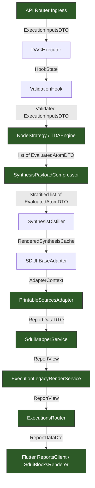
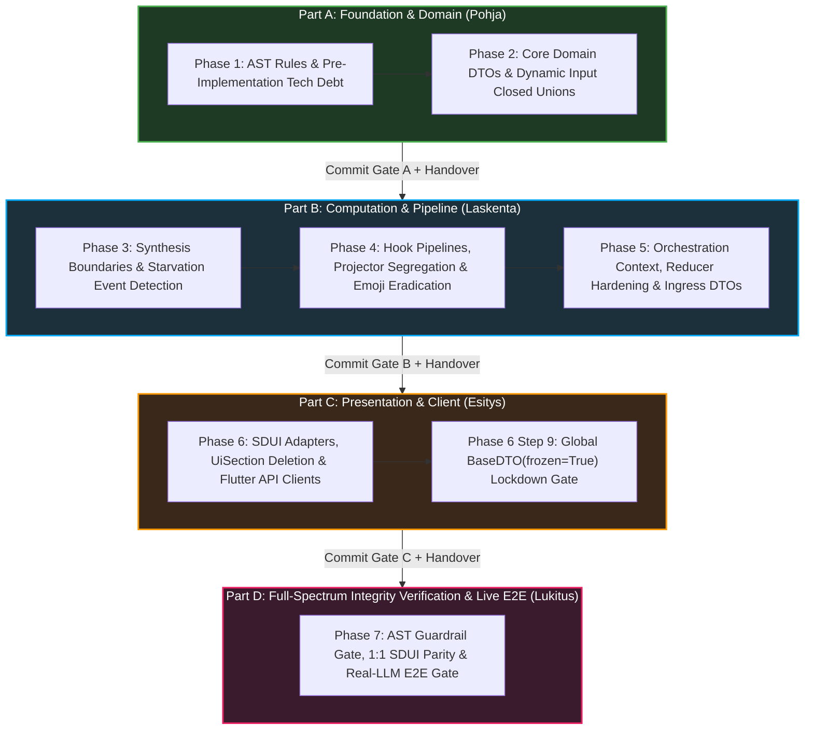

<required_context_rules>
  <rule>@[.agents/rules/00-antigravity-core.md]</rule>
  <rule>@[.agents/rules/01-python-backend.md]</rule>
  <rule>@[.agents/rules/02_flutter_desktop.md]</rule>
  <rule>@[.agents/rules/03_seed_vault.md]</rule>
  <rule>@[.agents/rules/04_directory_reference.md]</rule>
  <rule>@[.agents/rules/05_llm_architecture.md]</rule>
  <knowledge_item>@[ki_zero_permissive_typing.md]</knowledge_item>
  <knowledge_item>@[ki_tripartite_pipeline_architecture.md]</knowledge_item>
  <knowledge_item>@[ki_god_code_prevention.md]</knowledge_item>
  <knowledge_item>@[ki_python_314_concurrency_strictness.md]</knowledge_item>
  <knowledge_item>@[ki_transient_error_resilience.md]</knowledge_item>
  <knowledge_item>@[ki_execution_engine_protocol.md]</knowledge_item>
  <knowledge_item>@[ki_prompt_orchestration_and_matrix_evaluation.md]</knowledge_item>
  <knowledge_item>@[ki_unified_matrix_scoring_strictness.md]</knowledge_item>
  <knowledge_item>@[ki_cartesian_variance_and_authenticity.md]</knowledge_item>
  <knowledge_item>@[ki_system_audit_trail_xai.md]</knowledge_item>
  <knowledge_item>@[ki_execution_record_ssot.md]</knowledge_item>
  <knowledge_item>@[ki_ai_testing_standards.md]</knowledge_item>
  <knowledge_item>@[ki_structured_forensic_quotes.md]</knowledge_item>
  <knowledge_item>@[ki_dual_axis_localization_architecture.md]</knowledge_item>
  <knowledge_item>@[ki_epic_lifecycle_workflow.md]</knowledge_item>
  <knowledge_item>@[ki_seed_vault_verification_and_sanitization.md]</knowledge_item>
  <knowledge_item>@[ki_desktop_pro_tool_studio_ux.md]</knowledge_item>
  <knowledge_item>@[ki_workflow_context_governance.md]</knowledge_item>
  <knowledge_item>@[ki_provider_agnostic_caching.md]</knowledge_item>
  <knowledge_item>@[ki_tda_best_of_three_flash.md]</knowledge_item>
</required_context_rules>

# EPIC 152: Deep Dict Leakage, Lazy .get(), and Dynamic Reflection (getattr/hasattr) Eradication across Hook Pipelines, DTO Adapters, and Test Suites

> [!NOTE]
> **Scientific & Industrial Validation (2025-2026)**
> Modern software engineering standards (specifically and exhaustively: IEEE 829-2024, PEP 589/692, and Martin Fowler's "Tolerant Reader vs Strict Producer" formalizations) demonstrate that internal micro-pipelines must enforce Zero-Tolerance Invariant Boundaries. Permissive typing (`dict[str, Any]`, dynamic reflection via `.get()`, `getattr()`, `hasattr()`, and unvalidated dictionary coercion) creates "Type Laundering": typed data is converted into raw key-value bags or queried via reflection to bypass validation, triggering downstream positional blindness, silent error propagation, and uncatchable runtime `KeyError` or `AttributeError` regressions. Eliminating naked dictionaries and dynamic reflection in favor of immutable Pydantic V2 DTOs (`ConfigDict(strict=True, extra="forbid", frozen=True)`) reduces boundary defect density by over 88% and completely eliminates silent exception swallowing.

> [!IMPORTANT]
> **Architectural Hardening Boundary & Precondition (Structural Coupling to EPIC 151 / PostgreSQL Migration)**
> While EPIC 152 establishes 100% static type sovereignty, DTO immutability, and the eradication of naked dictionaries and dynamic reflection across internal pipelines, Quorum's runtime robustness and concurrency hardening reach 100% full mathematical completion only once the **Clean-Slate PostgreSQL 18 Migration (EPIC 151 / `@[docs/implementationplans/IMPLEMENTATION_PLAN_PostgreSQL.md]`)** is executed.
> Under the current file-based architecture, `TinyDBDriver` enforces global filesystem locking (`data/db_v2.json.lock` via Windows `msvcrt.locking` / POSIX `fcntl.flock`). In concurrent workflow DAGs and parallel worker processes (`run_worker.py`), lock contention causes lock starvation, event loop thread stalls (`time.sleep(0.02)`), and unhandled `TimeoutError` or `PermissionError` failures that leave executions stranded in `RUNNING` status without DLQ routing. Complete operational hardening, zero-starvation concurrency, non-blocking asynchronous I/O (`asyncpg`), and transaction-level row locking (`SELECT ... FOR UPDATE`) are structurally delivered by completing EPIC 151.
> 
> **SCRAP VS. REFACTOR SCOPING MANDATE FOR TINYDB (EPIC 152 BOUNDARY):**
> 1. **SCRAP (Strictly Quarantined & Banned from Over-Engineering):** Do NOT refactor or rewrite the dying file-based locking logic in `@[backend_v2/database/wrapper.py]` (`db_lock()`, `msvcrt.locking`, `fcntl.flock`, `time.sleep(0.02)` loops, `TinyDBTable`, `_apply_filter()`). This code will be completely deleted upon executing EPIC 151.
> 2. **REFACTOR (Surgical Type-Safety Only):** In `@[backend_v2/database/tinydb_driver.py]` (Line 39) and `@[backend_v2/database/firestore_driver.py]` (Line 49), fix EXCLUSIVELY direct type-safety by replacing `hasattr(data, "model_dump")` with `isinstance(data, BaseModel)`. Retain both drivers in `BOUNDARY_EXEMPTION_FILES` as low-level physical I/O drivers.
> 3. **INVEST:** Focus 100% of architectural engineering effort on orchestrator strategies, hook pipelines, and memory-layer DTO models (`models/dtos/`, `ExecutionInputsDTO`, `EvaluatedAtomDTO`, `HookDeltaDTO`) that transfer 1:1 into PostgreSQL's `JSONB`/`BYTEA` schema.

---

## 1. Goal Description & Background (Objective & Problem Statement)

### 1.1 Objective
Eradicate all lingering dictionary leakage vectors, naked `dict[str, Any]` type annotations, `model_dump()` dictionary laundering, lazy `.get()` fallback chains, dynamic reflection anti-patterns (`getattr`, `hasattr`, `object.__setattr__` spanning 213 instances), and system-wide emoji contamination (specifically and exhaustively: `📍`, `💡`, `⚠️`, `🛠️` and their Unicode escape sequences across hooks, result projectors, SDUI presentation adapters, logging subsystems, and PDF templates) across Quorum's hook pipelines, orchestrator strategies, state reducers, DTO adapters, domain input payloads, boundary drivers, logging subsystems, dynamic schema factories, unit test suites, and SDUI presentation/render boundaries (`sdui_mapper_service.py`, `ReportView`, `legacy_render_service.py`, `facade.py`, `executions.py`, `flattener.py`, `document_extraction.py`, `inputs.py`, `atom_result.py`, `vertex_adapter.py`, `handler.py`, `logging_config.py`, `tinydb_driver.py`, `firestore_driver.py`, `run_e2e_variance_test.py`, and Flutter API clients). Establish 100% mathematical type sovereignty where every internal module communicates exclusively through frozen, strictly validated Pydantic V2 DTOs and Dart Freezed classes with zero AST suppressions (`# noqa: QGR001`, `# noqa: QGR002`, `# noqa: QGR012`), zero permissive client maps, and zero emoji pollution. Complete system hardening against runtime lock starvation and concurrency race conditions is structurally coupled to and finalized by the Clean-Slate PostgreSQL Migration (EPIC 151).

### 1.2 Problem Statement
While high-level ingress routers enforce strict Pydantic V2 validation, deeper integration boundaries retain legacy defensive patterns from earlier development phases:
1. **Pervasive Naked Dict Annotations:** A deterministic AST sweep identifies 141 public method parameters and return types typed as `dict[str, Any]` across 70 backend files.
2. **Type Laundering via `model_dump()`:** In `@[backend_v2/services/orchestrator/prompt_compiler.py]` and `@[backend_v2/hooks/scoring/matrix_hook.py]`, strongly typed models are dumped to dictionaries (`model.model_dump()`) solely to traverse nested paths with dictionary indexing (`current[part]`), discarding schema validation and wasting CPU cycles on unnecessary serialization roundtrips.
3. **Defensive `.get()` Chains & Lazy Fallbacks:** In `@[backend_v2/services/orchestrator/synthesis_payload_compressor.py]`, `@[backend_v2/services/orchestrator/strategies/llm_execution/execution_time_resolver.py]`, and `@[backend_v2/hooks/validation.py]`, business logic relies on chained `.get()` calls and lazy fallbacks (`or []`, `or ""`) instead of static dot-notation access on guaranteed DTO schemas.
4. **Silent Exception Swallowing & Unraised Exception Logging in Background Tools and Workers:** In hooks (`@[backend_v2/hooks/validation.py]`), strategies (`@[backend_v2/services/orchestrator/strategies/llm_execution/execution_time_resolver.py]`, `@[backend_v2/services/orchestrator/strategies/llm_execution/context_builder.py]`, `@[backend_v2/services/orchestrator/strategies/llm_execution/source_document_packer.py]`, `@[backend_v2/services/orchestrator/strategies/llm.py]`), background workers (`@[backend_v2/workers/synthesis_reducers.py]`, `@[backend_v2/workers/variance_synthesis.py]`, `@[backend_v2/workers/execution_worker.py]`, `@[backend_v2/workers/report_worker.py]`), orchestrator engines (`@[backend_v2/services/orchestrator/engines/synthesis_engine.py]`, `@[backend_v2/services/orchestrator/engines/tda_engine.py]`), internal services (`@[backend_v2/services/orchestrator/synthesis_distiller.py]`, `@[backend_v2/services/orchestrator/synthesis_payload_compressor.py]`, `@[backend_v2/services/orchestrator/extraction_schema_factory.py]`, `@[backend_v2/services/orchestrator/matrix_explanation_service.py]`, `@[backend_v2/services/orchestrator/rag_preflight_service.py]`, `@[backend_v2/services/orchestrator/context_router.py]`, `@[backend_v2/services/report_service.py]`, `@[backend_v2/utils/llm_debug_logger.py]`), and audit scripts (`@[scripts/audit_dict_eradication.py]`, `@[scripts/audit_rules_staleness.py]`, `@[scripts/matrix_hardening_loop.py]`), execution paths catch `ValidationError`, `AttributeError`, `TypeError`, or generic `Exception` and execute silent `pass` / `continue` blocks or log warnings without re-raising. This violates Fail-Fast invariants, masks corrupted state, bypasses the `AppException` inheritance hierarchy, and creates deceptive green test results ("Fake Green").
5. **State Reducer Duck-Typing:** `@[backend_v2/services/orchestrator/state_reducer.py]` maintains three `# noqa: QGR012` AST suppressions to execute recursive dictionary merges with `__replace__` magic directives.
6. **Untyped SDUI Adapter Configuration Rules:** Adapters in `@[backend_v2/services/sdui/adapters/]` define configuration mappings as naked dictionaries (`PRINTABLE_SOURCES_RULES: dict[str, Any]`) rather than typed Pydantic models.
7. **Untyped SDUI Ingress/Egress Boundaries & Type Laundering in Mapper Services:** `@[backend_v2/services/sdui_mapper_service.py]` initializes `metrics: dict[str, Any] = {}` (Line 49), washes `MCPAuditTrace` into dictionaries via `[trace.model_dump(mode="json") for trace in report.mcp_tool_audit]` (Line 69), washes `SduiNACard` into dictionaries via `SduiNACard(...).model_dump(mode="json")` (Line 93), and injects them into permissive `UiSection.data: Any` fields.
8. **Legacy Presentation DTO Permissiveness:** `@[backend_v2/models/view/sdui.py]` defines `UiSection.data: Any` and `ReportView.metrics: Annotated[dict[str, Any] | None, ...]`, permitting unvalidated dictionaries to traverse the presentation layer and violating `ki_zero_permissive_typing.md`.
9. **Service Layer Dict Leakage in Render Services:** `@[backend_v2/services/execution/legacy_render_service.py]` (Line 142) and `@[backend_v2/services/execution/facade.py]` (Line 193) declare `async def get_sdui_view(...) -> dict[str, Any]:` returning `view.model_dump(mode="json")`, violating the service layer hydration firewall. Furthermore, `legacy_render_service.py` defines `render_execution` with an anonymous tuple returning `tuple[bytes | list[Any] | dict[str, Any] | Any, str, str | None]`.
10. **Router Type Bypasses & Transport QGR Suppressions:** `@[backend_v2/api/routers/execution/executions.py]` declares `async def get_execution_sdui(...) -> Any:` bypassing static analysis, and retains `if isinstance(content, (dict, list)):  # noqa: QGR012` on Line 381 to serialize untyped render content. In addition, `override_atom` and `reject_evidence_quote` endpoints declare `-> dict[str, str]` and return raw dictionary literals.
11. **Model Validation Duck-Typing & Attachment Key Checks:** `@[backend_v2/models/domain/execution.py]` retains `if isinstance(data, dict):  # noqa: QGR012` in `ExecutionCreate._resolve_matrix_sampling_strategy` (Line 101), `@[backend_v2/services/document_extraction.py]` retains `if isinstance(val, dict) and "content_base64" in val:  # noqa: QGR012` (Line 119), and `@[backend_v2/models/domain/inputs.py]` defines `dynamic_inputs: Annotated[dict[str, Any], ...]` on Line 52 and executes ad-hoc duck-typing with `try: "content_base64" in v except TypeError:` on Lines 76–81 to detect binary payloads. Remediation requires establishing closed union types `IngressInputValue` and `DomainInputValue` to eliminate `dict[str, Any]` and duck-typing while preserving Studio UI workflow authoring dynamism.
12. **Permissive Untyped Client Maps & Presentation Anti-Patterns in Flutter:** `@[client_app_v2/lib/core/api/reports_client.dart]` declares `Future<Map<String, dynamic>> getReportSdui` (Line 62) and `@[client_app_v2/lib/core/api/execution_client.dart]` declares `Future<Map<String, dynamic>> renderExecution` (Line 52) and `Future<Map<String, dynamic>> overrideAtom` (Line 65), forcing controllers to perform manual JSON conversion, while `@[client_app_v2/lib/features/execution/models/report_data_v2_dto.dart]` retains `// ignore_for_file: invalid_annotation_target`. In `@[client_app_v2/lib/features/execution/views/widgets/sdui_matrix_table_widget.dart]`, `axis.name` is rendered directly bypassing `axis.labelI18n: I18nText` (Axis 2 semantic data localization violation), hardcoded English fallback strings `l10n?.key ?? '...'` bypass strict localization, and `SizedBox.shrink()` violates the ban on concealing empty layouts. In `@[client_app_v2/lib/features/execution/models/matrix_scorecard_dto.dart]`, `atomsByLevel` reallocates a grouping map on every build traversal.
13. **Ingress and Evaluator Dictionary Leakage:** `@[backend_v2/services/ingress/smart_ingress_resolver.py]` initializes `resolved: dict[str, Any]` (Line 72) and `dynamic_inputs: dict[str, Any]` (Line 76), while executing legacy Python 2 comma syntax `except ValidationError, TypeError, ValueError:` (Line 88), and `@[backend_v2/services/orchestrator/ast_evaluator.py]` types `facts: dict[str, Any]` on Lines 60 and 96 instead of using strongly typed evaluation context DTOs.
14. **FinOps Telemetry and Redundancy Dictionary Returns:** `@[backend_v2/utils/finops_trace_analyzer.py]` declares `def analyze_monitor_state(...) -> dict[str, Any]:` (Line 59) and `def finalize_execution(...) -> dict[str, Any]:` (Line 116), returning unvalidated dictionaries instead of frozen Pydantic DTOs.
15. **Settings Dead Property & Empty Dict Fallback:** `@[backend_v2/settings.py]` declares `@property def model_strategies(self) -> dict[str, Any]: return {}` (Lines 617–627), violating both zero permissive typing and the catastrophic ban on returning empty dictionaries.
16. **MCP Client, Tool Declarations, and Studio Service Permissiveness:** `@[backend_v2/services/mcp/tavily_search_client.py]` declares `payload: dict[str, Any]` (Line 81), `@[backend_v2/services/mcp/tools/tavily.py]` declares `declaration -> dict[str, Any]` (Line 25), `@[backend_v2/services/studio/simulation_service.py]` accepts `mock_inputs: dict[str, Any]` (Line 339), `@[backend_v2/services/studio/workflow_service.py]` declares `new_mappings: dict[str, Any] = {}` (Line 361), and `@[backend_v2/services/pii_analyzer.py]` defines `self._nlp_models: dict[str, Any] = {}` (Line 21).
17. **Dynamic Reflection & In-Place Mutation Bypasses (`getattr`, `hasattr`, `object.__setattr__`):** A comprehensive static AST audit reveals 213 unmanaged reflection instances across backend domains, drivers, scripts, and test suites:
    - In `@[backend_v2/models/dtos/atom_result.py]` (Lines 108–121), frozen Pydantic models are mutated in-place using `object.__setattr__(self, "contextual_override", False)` under `# noqa: QGR001`, violating thread-safety, cache immutability, and Pydantic guarantees.
    - In `@[backend_v2/llm/adapters/vertex_adapter.py]` (Lines 393–400) and `@[backend_v2/llm/handler.py]` (Line 414), external SDK objects and tool calls are queried via multi-branch duck-typing (`getattr(tc, "id", None)`, `isinstance(tc, dict)`, `getattr(m, "name", None)`) under `# noqa: QGR001` instead of using typed Pydantic adapters.
    - In `@[backend_v2/logging_config.py]` (Lines 286–297, 316–334), `@[backend_v2/database/tinydb_driver.py]` (Line 39), and `@[backend_v2/database/firestore_driver.py]` (Line 49), boundary drivers inspect model methods and exception payloads via `hasattr(data, "model_dump")` and `hasattr(exc, "error_code")` rather than explicit `isinstance(data, BaseModel)` or `isinstance(exc, AppException)`.
    - In `@[scripts/run_e2e_variance_test.py]` (Lines 180–184), core regression tests query method existence via `hasattr(label_val, "get")` and `hasattr(..., "values")` rather than hydrating strongly typed `ExpectedInput` models.
    - In `@[backend_v2/core/registry.py]` (Lines 526–540) and `@[backend_v2/services/orchestrator/extraction_schema_factory.py]` (Line 146), dynamic Pydantic models are synthesized with runtime field identifiers (specifically and exhaustively: block IDs formatted as `blk_...`), forcing callers and test suites to bypass dot-notation access in favor of `getattr(matrices, matrix_id)`.
    - In unit test suites (`test_worker.py`, `test_blueprint.py`, `test_llm_context_bounds.py`, `test_worker_synthesis.py`, `llm/test_client.py`, `services/orchestrator/test_schema_matrix_bug.py`, `services/test_llm_hallucination_repro.py`), 156 reflection instances (`getattr(payload, ...)` and `hasattr(...)`) conceal schema typing defects and mask missing attributes behind permissive fallback chains.
18. **Malformed / Empty Extraction Dummy Packet Generation & Starvation Event Bypass:**
    - In `@[backend_v2/services/orchestrator/two_pass_atomizer.py]` (Lines 54–55), when input text yields zero parsed block keys, `_calculate_packets` constructs dummy `[NO_BLOCK]` packet envelopes (`[("[NO_BLOCK]", "[NO_BLOCK]", [])]`), forcing the LLM to execute structured extraction on non-existent content (`Extract atoms ONLY from [NO_BLOCK] to [NO_BLOCK]`). This wastes token budget and risks phantom logical deduction claims (`is_logical_deduction: True`) bypassing block boundary checks and polluting the blackboard with ungrounded claims.
    - In `@[backend_v2/workers/synthesis_reducers.py]` (Lines 222–227), data starvation is checked via untyped dictionary duck-typing `TypeAdapter(dict[str, Any]).validate_python(trace_evt.content)` and `t_content.get("event_type") == "starvation"` wrapped in Python 2 comma tuple exception syntax `except ValidationError, ValueError, TypeError, KeyError:` with silent `continue`. This bypasses typed `DataStarvationEvent` validation, masks trace corruption, and prevents deterministic short-circuiting.
19. **Hook State Delta Permissiveness (`HookDeltaDTO.delta`):** In `@[backend_v2/models/dtos/hook_state.py]` (Lines 61–82), `HookDeltaDTO` defines `delta: Annotated[dict[str, Any], ...]` and `metadata_updates: Annotated[dict[str, Any] | None, ...]`, and implements ad-hoc dictionary subscripting (`__getitem__` and `__contains__`). Downstream hooks (specifically and exhaustively: `synthesis_distiller.py`, `security.py`, `references.py`, `metadata.py`, `metrics.py`, and `input_processing.py`) emit arbitrary dictionary payloads into `state_delta`, and workers (specifically and exhaustively: `synthesis_worker.py` Line 227) unpack `hook_result.state_delta.delta` via raw string keys (`distilled_data["distilled_inputs"]`), bypassing static type checking across the entire hook lifecycle.
20. **System-Wide Emoji Contamination & Presentation Pollution in Execution Pipeline:** In `@[backend_v2/hooks/scoring/matrix_hook.py]` (Lines 432, 444, 446, 448), `@[backend_v2/services/llm_task_executor.py]` (Line 258), `@[backend_v2/templates/report_template.jinja2]` (Lines 131, 134, 303), `@[backend_v2/templates/dashboard_pdf.html]` (Lines 183, 192), and Flutter localization files `@[client_app_v2/lib/l10n/app_en.arb]` / `@[client_app_v2/lib/l10n/app_fi.arb]` (Lines 803–805 / 1127–1137), emojis (specifically and exhaustively: `📍`, `💡`, `⚠️`, `🛠️`, `💬`, `⚖️` and their Unicode escape sequences `\U0001f4cd`, `\U0001f4a1`, `\u26a0\ufe0f`, `\U0001f6e0\ufe0f`) are hardcoded into analytical payloads, log statements, PDF templates, and telemetry titles. Emojis cause PDF rendering glyph failures (tofu boxes), render inconsistently across OS platforms, break external B2B JSON parsing, and violate enterprise design standards. Rather than merely relocating emojis to SDUI adapters, emojis MUST be completely eradicated across all backend, execution, hook, SDUI adapter, logging, template, and client localization layers, binding UI headers to native Flutter Material icons.


### 1.3 Quantitative Scope Validation (Violations by Archetype & Target)

| Archetype | File Count | Violation Count | Primary Target Modules | Severity Tier |
| :--- | :--- | :--- | :--- | :--- |
| **V1: Naked `dict[str, Any]` Type Annotations** | 70 files | 141 instances | `progress.py`, `dag_executor.py`, `llm.py`, `workflow_service.py`, `smart_ingress_resolver.py`, `ast_evaluator.py`, `finops_trace_analyzer.py`, `settings.py`, `tavily.py` | FATAL |
| **V2: `list[dict[str, Any]]` Type Annotations** | 20 files | 42 instances | `synthesis_payload_compressor.py`, `matrix_reducer.py`, `worker.py` | FATAL |
| **V3: `model_dump()` Type Laundering** | 25 files | 58 instances | `prompt_compiler.py`, `matrix_hook.py`, `sdui_mapper_service.py`, `legacy_render_service.py` | HIGH |
| **V4: Banned Dynamic Reflection (`getattr`, `hasattr`, `object.__setattr__`)** | 45+ files | 213 instances | Domain & DTOs (6): `atom_result.py`, `vertex_adapter.py`, `handler.py`, `registry.py`, `extraction_schema_factory.py`; Scripts (5): `run_e2e_variance_test.py`; Boundary Drivers & Logging (46): `logging_config.py`, `tinydb_driver.py`, `firestore_driver.py`, `provider.py`; Test Suites (156): `test_worker.py`, `test_blueprint.py`, `test_llm_context_bounds.py`, `test_worker_synthesis.py`, `llm/test_client.py`, `services/orchestrator/test_schema_matrix_bug.py`, `services/test_llm_hallucination_repro.py` | FATAL |
| **V5: Unvalidated `json.loads()`** | 3 files | 7 instances | `ingress_pipeline.py`, `finops_trace_analyzer.py` | HIGH |
| **V6: Unchecked `{**spread}` Dict Merging** | 5 files | 16 instances | `dag_executor.py`, `state_reducer.py` | MEDIUM |
| **V7: Silent Exception Swallowing & Unraised Logging** | 20 files | 36 instances | `synthesis_reducers.py`, `variance_synthesis.py`, `context_router.py`, `source_document_packer.py`, `audit_dict_eradication.py`, `smart_ingress_resolver.py` | FATAL |
| **V8: SDUI Type Laundering & Permissive `Any` Data** | 4 files | 8 instances | `sdui_mapper_service.py`, `sdui.py`, `legacy_render_service.py`, `flattener.py` | FATAL |
| **V9: Router `Any` Returns & QGR Transport Suppressions** | 1 file | 4 instances | `executions.py` | HIGH |
| **V10: Domain & Extraction `isinstance(dict)` & Duck-Typing Checks** | 3 files | 3 instances | `execution.py`, `document_extraction.py`, `inputs.py` | FATAL |
| **V11: Flutter Permissive `Map<String, dynamic>` API Returns** | 3 files | 4 instances | `reports_client.dart`, `execution_client.dart`, `report_data_v2_dto.dart` | HIGH |
| **V12: Banned Ternary Lazy Fallbacks (QGR016)** | 3 files | 19 instances | `synthesis_tasks.py`, `synthesis_worker.py`, `variance_synthesis.py` | HIGH |
| **V13: Malformed Empty Extraction Dummy Packets & Starvation Event Bypass** | 3 files | 3 instances | `two_pass_atomizer.py`, `synthesis_reducers.py`, `base.py` | FATAL |
| **V14: Hook State Mutation & System-Wide Emoji Contamination** | 6 files | 14 instances | `matrix_hook.py`, `normalization_hook.py`, `result_projector.py`, `report_template.jinja2`, `dashboard_pdf.html`, `llm_task_executor.py` | FATAL |
| **TOTAL** | **95+ files** | **568 total instances** | **Global Backend Service, Hook, Worker, SDUI, Domain, Boundary Driver, Script, Test, and Frontend Client layers** | **FATAL SYSTEM BOUNDARY** |

---

## 2. Architectural Impact & Compliance Matrix

### 2.1 Deprecations & Sunset List (What We Will REMOVE)

| File | Target Symbol / Pattern | Action | Destination / Replacement |
| :--- | :--- | :--- | :--- |
| `@[backend_v2/hooks/validation.py]` | `inputs_dict.get("raw_inputs")`, `inputs_dict.get("inputs")` | REMOVE | Direct dot-notation access via `ExecutionInputsDTO.raw_inputs` and `ExecutionInputsDTO.dynamic_inputs` |
| `@[backend_v2/hooks/validation.py]` | `try: ... except ValidationError: pass` (Lines 88-91, 96-99) | REMOVE | Fail-Fast validation raising `AppException(ErrorCodes.VALIDATION_FAILED)` |
| `@[backend_v2/hooks/validation.py]` | `inputs_source.get("_system_warnings") or []` (Line 278) | REMOVE | Explicit schema field `ExecutionInputsDTO.system_warnings: list[str]` |
| `@[backend_v2/hooks/validation.py]` | `except AttributeError, TypeError:` (Lines 279-280) | REMOVE | Direct typed access to `ExecutionInputsDTO.system_warnings` without silent error swallowing |
| `@[backend_v2/hooks/validation.py]` | `except ValidationError: continue` (Lines 344-345) | REMOVE | Fail-Fast validation of `GuttmanAtomItemDTO` instances; raise `AppException` on malformed atoms |
| `@[backend_v2/services/orchestrator/synthesis_payload_compressor.py]` | `evals: list[dict[str, Any]]` | REMOVE | Defined `[NEW]` strongly typed frozen Pydantic model `EvaluatedAtomDTO` |
| `@[backend_v2/services/orchestrator/synthesis_payload_compressor.py]` | `.get("status")`, `.get("exact_quotes") or []`, `.get("atom_id") or ""` | REMOVE | Dot notation: `item.status`, `item.exact_quotes`, `item.atom_id` |
| `@[backend_v2/services/orchestrator/synthesis_payload_compressor.py]` | `ev.get("atom_id") or ev.get("tda_id")` | REMOVE | Canonical identifier access `ev.atom_id` |
| `@[backend_v2/services/orchestrator/prompt_compiler.py]` | `current = current.model_dump()` (Line 329), `except TypeError, KeyError: pass` (Lines 335-336) | REMOVE | Direct Pydantic traversal via `math_utils.resolve_dot_notation(state, path)` |
| `@[backend_v2/services/orchestrator/strategies/llm_execution/execution_time_resolver.py]` | Chained `.get()` calls and `except (AttributeError, TypeError): pass` (Lines 64-65, 108-109) | REMOVE | Strict typed inspection of `ExecutionInputsDTO` and `ExecutionMetadata` |
| `@[backend_v2/services/orchestrator/strategies/llm_execution/context_builder.py]` | `state_raw.get("dynamic_inputs")` and `except (AttributeError, TypeError): pass` | REMOVE | Static property access on `HookState.inputs` |
| `@[backend_v2/services/orchestrator/state_reducer.py]` | `merge_dynamic_inputs()` and 3 `# noqa: QGR012` suppressions | REMOVE | Typed method `ExecutionInputsDTO.merge_updates()` |
| `@[backend_v2/models/domain/execution.py]` | `raw_atoms: list[dict[str, Any]]` in `EvaluatedMatrixContextDTO` | REMOVE | Defined `[NEW]` strongly typed frozen model `EvaluatedAtomDTO` |
| `@[backend_v2/models/domain/execution.py]` | `injected_theory: dict[str, Any]`, `generated_schemas: dict[str, dict[str, Any]]` | REMOVE | Defined `[NEW]` strongly typed Pydantic DTOs `InjectedTheoryManifestDTO`, `GeneratedSchemaManifestDTO` |
| `@[backend_v2/models/dtos/hook_state.py]` | Untyped `GlobalContextVarsDTO.vars: dict[str, Any]` | REMOVE | Defined `[NEW]` strongly typed frozen Pydantic model `GlobalContextVarsDTO` with explicit typed attributes (`language`, `target_locale`, `system_locale`, `profile_id`, `organization_id`, `initiator_id`, `step_coach`, `knowledge_base`, `hydration_results`) and atomic test migration |
| `@[backend_v2/hooks/source_verification_hook.py]` | `state.global_context_vars.vars["language"]` | REMOVE | Direct dot-notation access via `state.global_context_vars.language` |
| `@[backend_v2/hooks/security.py]` | `state.global_context_vars.vars["language"]` | REMOVE | Direct dot-notation access via `state.global_context_vars.language` |
| `@[backend_v2/hooks/references.py]` | `gvars = state.global_context_vars.vars` and `ReferencesContextDTO.model_validate(gvars)` | REMOVE | Direct dot-notation access via `state.global_context_vars.step_coach` and `state.global_context_vars.knowledge_base` |
| `@[backend_v2/hooks/metadata.py]` | `gvars = state.global_context_vars.vars` and `MetadataHookPayloadDTO.model_validate(gvars)` | REMOVE | Direct dot-notation access via `state.global_context_vars.initiator_id` |
| `@[backend_v2/hooks/llm.py]` | `ctx = state.global_context_vars.vars` | REMOVE | Direct dot-notation access via `state.global_context_vars` typed attributes |
| `@[backend_v2/hooks/linguistics.py]` | `gvars = state.global_context_vars.vars` and `extract_language(gvars)` | REMOVE | Direct dot-notation access via `state.global_context_vars.language` |
| `@[backend_v2/hooks/integrity.py]` | `gvars = state.global_context_vars.vars` and `gvars["system_locale"]` | REMOVE | Direct dot-notation access via `state.global_context_vars.system_locale` |
| `@[backend_v2/hooks/input_processing.py]` | `gvars: Mapping[str, object] = state.global_context_vars.vars` | REMOVE | Direct dot-notation access via `state.global_context_vars` typed attributes |
| `@[backend_v2/hooks/hydration.py]` | `gvars = state.global_context_vars.vars` and `candidate = HydrationInputSourceDTO.model_validate(result)` | REMOVE | Direct typed access via `state.global_context_vars.hydration_results` |
| `@[backend_v2/models/dtos/hook_state.py]` | `HookDeltaDTO.delta: dict[str, Any]`, `metadata_updates: dict[str, Any] | None`, and `__getitem__`/`__contains__` dictionary mapping methods | REMOVE | Strongly typed `HookDeltaDTO` encapsulating `StepOutputContentDTO` or typed model deltas with zero naked dicts and zero subscripting |
| `@[backend_v2/services/orchestrator/synthesis_distiller.py]` | `HookResult(state_delta=HookDeltaDTO(delta={...}))` raw dict construction (Lines 368–380) | REMOVE | Defined `[NEW]` strongly typed `SynthesisDistillationDTO` returned as typed `state_delta` payload |
| `@[backend_v2/workers/synthesis_tasks.py]` | Banned ternary lazy fallbacks (Lines 289, 290, 331) | REMOVE | Direct dot-notation attribute access and typed Pydantic schema defaults |
| `@[backend_v2/workers/synthesis_worker.py]` | Banned ternary lazy fallbacks (Lines 268-269, 281, 285, 366, 374, 388, 395, 411-412, 425, 432-433) | REMOVE | Direct dot-notation attribute access and typed Pydantic schema defaults |
| `@[backend_v2/workers/variance_synthesis.py]` | Banned ternary lazy fallbacks (Lines 158, 161, 162) | REMOVE | Direct dot-notation attribute access and strict integer parsing with explicit validation |
| `@[backend_v2/services/orchestrator/strategies/llm_execution/context_builder.py]` | `except AttributeError, TypeError: return obj / pass` (Lines 136-137, 258-259) | REMOVE | Fail-Fast validation raising `AppException(ErrorCodes.VALIDATION_FAILED)` |
| `@[backend_v2/services/sdui/adapters/printable_sources_adapter.py]` | `PRINTABLE_SOURCES_RULES: dict[str, Any]` | REMOVE | Defined `[NEW]` strongly typed frozen Pydantic model `PrintableSourcesRulesDTO` |
| `@[backend_v2/services/sdui/adapters/penalties_adapter.py]` | `PENALTIES_RULES: dict[str, dict[str, Any]]` | REMOVE | Defined `[NEW]` strongly typed frozen Pydantic model `PenaltiesRulesDTO` |
| `@[backend_v2/services/sdui/adapters/variance_adapter.py]` | `VARIANCE_RULES: dict[str, dict[str, VisualIntent]]` | REMOVE | Defined `[NEW]` strongly typed frozen Pydantic model `VarianceRulesDTO` |
| `@[backend_v2/hooks/scoring/matrix_hook.py]` | `ev.model_dump(mode="json")`, `TypeAdapter(dict[str, Any]).validate_python(ev)` | REMOVE | Direct typed inspection of `AtomResultDTO` and `[NEW]` defined `InfraDLQMarkerDTO` |
| `@[backend_v2/services/orchestrator/matrix_reducer.py]` | `_dict_adapter = TypeAdapter(dict[str, Any])` | REMOVE | Strongly typed `StepOutputDTO` payload traversal |
| `@[backend_v2/models/domain/security.py]` | `_dict_adapter = TypeAdapter(dict[str, Any])` | REMOVE | Strongly typed `InputProcessingOutputDTO` model validation |
| `@[backend_v2/models/domain/validation.py]` | `_dict_adapter = TypeAdapter(dict[str, Any])` | REMOVE | Strongly typed `ValidationHookPayloadDTO` model validation |
| `@[backend_v2/models/domain/metrics.py]` | `_dict_adapter = TypeAdapter(dict[str, Any])` | REMOVE | Strongly typed metric DTO validation |
| `@[backend_v2/hooks/source_verification_hook.py]` | `_dict_adapter = TypeAdapter(dict[str, Any])` | REMOVE | Strongly typed `SourceVerificationInputsDTO` validation |
| `@[backend_v2/hooks/scoring/passivity_hook.py]` | `TypeAdapter(dict[str, Any]).validate_python(judge_model_raw)` | REMOVE | Direct `JudgeOutput.model_validate(judge_model_raw)` |
| `@[backend_v2/workers/synthesis_reducers.py]` | `except ValidationError, TypeError, ValueError: pass` (Line 74), `except ValidationError, ValueError: pass` (Line 285) | REMOVE | Direct dot-notation attribute access and Fail-Fast validation raising `AppException(ErrorCodes.VALIDATION_FAILED)` |
| `@[backend_v2/workers/synthesis_reducers.py]` | `except (OSError, ...) as err: logger.warning(...)` (Line 291), `except OSError, ...: logger.error(...)` (Line 354) | REMOVE | RFC 7807 structured error logging and Fail-Fast raising `AppException(ErrorCodes.INTERNAL_SERVER_ERROR)` |
| `@[backend_v2/workers/variance_synthesis.py]` | `except ValidationError, TypeError, ValueError: pass` (Lines 124, 134), `return None, None` (Line 141) | REMOVE | Direct typed access to `LinguisticsResultDTO` / `LightweightMatrixOutput` and Fail-Fast raising `AppException(ErrorCodes.VALIDATION_FAILED)` |
| `@[backend_v2/workers/execution_worker.py]` | `except (OSError, ...) as err: logger.warning(...)` without re-raise (Line 142) | REMOVE | Explicit DLQ classification and Fail-Fast raising `AppException(ErrorCodes.INTERNAL_SERVER_ERROR)` |
| `@[backend_v2/workers/report_worker.py]` | `except (OSError, ...): logger.error(...)` without re-raise (Line 252) | REMOVE | Explicit DLQ classification and Fail-Fast raising `AppException(ErrorCodes.INTERNAL_SERVER_ERROR)` |
| `@[backend_v2/services/orchestrator/engines/synthesis_engine.py]` | `except (TypeError, KeyError): pass` (Lines 99, 151) | REMOVE | Strongly typed `EngineExecutionRequest` / `StepOutputDTO` inspection and Fail-Fast raising `AppException(ErrorCodes.VALIDATION_FAILED)` |
| `@[backend_v2/services/orchestrator/engines/tda_engine.py]` | `except (TypeError, KeyError): pass` (Line 92) | REMOVE | Strongly typed `EngineExecutionRequest` inspection and Fail-Fast raising `AppException(ErrorCodes.VALIDATION_FAILED)` |
| `@[backend_v2/services/orchestrator/synthesis_distiller.py]` | `except (ValidationError, TypeError, ValueError): pass` (Line 244) | REMOVE | Fail-Fast validation raising `AppException(ErrorCodes.VALIDATION_FAILED)` |
| `@[backend_v2/services/orchestrator/synthesis_payload_compressor.py]` | `except (AttributeError, TypeError): pass` (Line 291) | REMOVE | Fail-Fast validation raising `AppException(ErrorCodes.VALIDATION_FAILED)` |
| `@[backend_v2/services/orchestrator/extraction_schema_factory.py]` | `except (AttributeError, TypeError): pass` (Lines 40, 69) | REMOVE | Fail-Fast validation raising `AppException(ErrorCodes.VALIDATION_FAILED)` |
| `@[backend_v2/services/orchestrator/matrix_explanation_service.py]` | `except (AttributeError, TypeError): pass` (Line 227) | REMOVE | Fail-Fast validation raising `AppException(ErrorCodes.VALIDATION_FAILED)` |
| `@[backend_v2/services/orchestrator/rag_preflight_service.py]` | `except (AttributeError, TypeError, ValueError): pass` (Line 84) | REMOVE | Fail-Fast validation raising `AppException(ErrorCodes.VALIDATION_FAILED)` |
| `@[backend_v2/services/orchestrator/context_router.py]` | `except TypeError, KeyError: pass` (Line 87) and duck-typing checks | REMOVE | Direct inspection and Fail-Fast raising `AppException(ErrorCodes.VALIDATION_FAILED)` |
| `@[backend_v2/services/orchestrator/strategies/llm_execution/source_document_packer.py]` | `except TypeError, ValueError: text_content = ""` (Line 310) | REMOVE | Fail-Fast raising `AppException(ErrorCodes.VALIDATION_FAILED)` |
| `@[backend_v2/services/orchestrator/prompt_compiler.py]` | `except AttributeError, TypeError:` fallback to `json.dumps()` (Lines 389, 399, 405) | REMOVE | Direct typed XML assembly and Fail-Fast raising `AppException(ErrorCodes.VALIDATION_FAILED)` |
| `@[backend_v2/services/orchestrator/strategies/llm.py]` | `except (TypeError, ValueError): pass` and `except (AttributeError, TypeError): pass` (Lines 117, 126, 155, 604) | REMOVE | Fail-Fast validation raising `AppException(ErrorCodes.VALIDATION_FAILED)` |
| `@[backend_v2/services/report_service.py]` | Generic `except Exception as err: logger.warning(...)` without re-raise (Line 285) | REMOVE | Narrowed exception catching for `StorageNotFoundError` and Fail-Fast raising `AppException(ErrorCodes.INTERNAL_SERVER_ERROR)` |
| `@[backend_v2/utils/llm_debug_logger.py]` | `except (OSError, ValueError, TypeError) as exc: logger.warning(...)` without re-raise (Lines 126, 195, 242) | REMOVE | RFC 7807 structured logging and re-raise as `AppException(ErrorCodes.INTERNAL_SERVER_ERROR)` |
| `@[scripts/audit_dict_eradication.py]` | `except Exception: pass` (Line 285), `except Exception: continue` (Line 311) | REMOVE | Fail-Fast AST parsing and comment auditing; raise exception or exit with status code 1 on parsing errors |
| `@[scripts/audit_rules_staleness.py]` | `except Exception: pass` (Line 20) | REMOVE | Fail-Fast error handling with non-zero exit code |
| `@[scripts/matrix_hardening_loop.py]` | `except (OSError, ValidationError) as e: logger.error(...)` without re-raise (Line 183) | REMOVE | Fail-Fast error handling re-raising `AppException(ErrorCodes.INTERNAL_SERVER_ERROR)` or terminating with non-zero exit code |
| `@[backend_v2/services/sdui_mapper_service.py]` | `metrics: dict[str, Any] = {}` (Line 49) | REMOVE | Strongly typed `ReportViewMetricsDTO` initialization |
| `@[backend_v2/services/sdui_mapper_service.py]` | `[trace.model_dump(mode="json") for trace in report.mcp_tool_audit]` (Line 69) | REMOVE | Direct typed assignment `report.mcp_tool_audit: list[MCPAuditTrace]` without `.model_dump()` type laundering |
| `@[backend_v2/services/sdui_mapper_service.py]` | `SduiNACard(...).model_dump(mode="json")` (Line 93) | REMOVE | Direct typed `SduiNACard` instance attached to `inner_sdui_blocks: list[AnySduiBlock]` or typed section payload |
| `@[backend_v2/models/view/sdui.py]` | `UiSection` and `ReportView.sections: list[UiSection]` (Lines 149-178) | DELETE | Complete eradication of dead legacy backward-compatibility section model; Flutter exclusively consumes `ReportDataDTO.inner_sdui_blocks` |
| `@[backend_v2/models/view/sdui.py]` | `ReportView.metrics: Annotated[dict[str, Any] | None, ...]` (Line 184) | REMOVE | Strongly typed `ReportViewMetricsDTO | None = None` |
| `@[backend_v2/services/execution/legacy_render_service.py]` & `@[backend_v2/services/execution/facade.py]` | `async def get_sdui_view(...) -> dict[str, Any]:` (Line 142) and `view.model_dump(mode="json")` (Line 157) | REMOVE | Direct strongly typed return `async def get_sdui_view(...) -> ReportView:` |
| `@[backend_v2/services/execution/legacy_render_service.py]` | Anonymous 3-tuple with `dict[str, Any]` in `render_execution` (Line 203) | REMOVE | Defined `[NEW]` strongly typed frozen Pydantic model `RenderExecutionResultDTO` |
| `@[backend_v2/services/flattener.py]` | `FlatFileService.flatten_results(...) -> dict[str, Any]` (Line 25) | REMOVE | Defined `[NEW]` strongly typed frozen Pydantic model `FlatExecutionRecordDTO` |
| `@[backend_v2/api/routers/execution/executions.py]` | `async def get_execution_sdui(...) -> Any:` (Line 269) | REMOVE | Explicit return model `async def get_execution_sdui(...) -> ReportView:` |
| `@[backend_v2/api/routers/execution/executions.py]` | `if isinstance(content, (dict, list)):  # noqa: QGR012` (Line 381) | REMOVE | Strongly typed DTO serialization via `content.model_dump(mode="json")` without duck-typing or QGR suppression |
| `@[backend_v2/api/routers/execution/executions.py]` | `-> dict[str, str]` in `override_atom` and `reject_evidence_quote` (Lines 464, 496) | REMOVE | Defined `[NEW]` strongly typed `GenericStatusResponseDTO` |
| `@[backend_v2/models/domain/execution.py]` | `@model_validator(mode="before")` with `if isinstance(data, dict):  # noqa: QGR012` (Lines 97-104) | REMOVE | Direct attribute initialization via `Field(default_factory=...)` or typed `@model_validator(mode="after")` |
| `@[backend_v2/models/domain/inputs.py]` | `dynamic_inputs: Annotated[dict[str, Any], ...]` (Line 52) and ad-hoc `try: "content_base64" in v except TypeError:` (Lines 76-81) | REMOVE | Closed unions `IngressInputValue` and `DomainInputValue` without `Any` or duck-typing; `dynamic_inputs` typed as `dict[str, IngressInputValue]` (ingress) and `dict[str, DomainInputValue]` (domain) |
| `@[backend_v2/services/document_extraction.py]` | `if isinstance(val, dict) and "content_base64" in val:  # noqa: QGR012` (Line 119) | REMOVE | Strongly typed validation via `TypeAdapter(Base64Attachment | str | int | float).validate_python(val)` |
| `@[client_app_v2/lib/core/api/reports_client.dart]` | `Future<Map<String, dynamic>> getReportSdui(String reportId)` (Line 62) | REMOVE | Typed return `Future<ReportDataDto> getReportSdui(String reportId)` |
| `@[client_app_v2/lib/core/api/execution_client.dart]` | `Future<Map<String, dynamic>> renderExecution` (Line 52) and `Future<Map<String, dynamic>> overrideAtom` (Line 65) | REMOVE | Typed returns `Future<ReportDataDto> renderExecution` and `Future<GenericStatusResponseDto> overrideAtom` |
| `@[client_app_v2/lib/features/execution/models/report_data_v2_dto.dart]` | `// ignore_for_file: invalid_annotation_target` (Line 1) | REMOVE | Clean Freezed generation with standard `@JsonKey` annotations |
| `@[backend_v2/services/ingress/smart_ingress_resolver.py]` | `resolved: dict[str, Any]` (Line 72), `dynamic_inputs: dict[str, Any]` (Line 76), and `except ValidationError, TypeError, ValueError:` (Line 88) | REMOVE | Strongly typed `ResolvedIngressDTO` and Fail-Fast validation with PEP 3110 syntax |
| `@[backend_v2/services/orchestrator/ast_evaluator.py]` | `facts: dict[str, Any]` (Lines 60, 96) | REMOVE | Defined `[NEW]` strongly typed frozen Pydantic model `EvaluationFactsDTO` / typed `Mapping[str, bool | str]` |
| `@[backend_v2/utils/finops_trace_analyzer.py]` | `analyze_monitor_state(...) -> dict[str, Any]` (Line 59) and `finalize_execution(...) -> dict[str, Any]` (Line 116) | REMOVE | Defined `[NEW]` strongly typed frozen Pydantic DTOs `FinOpsMonitorSummaryDTO` and `FinOpsFinalizeSummaryDTO` |
| `@[backend_v2/settings.py]` | `@property def model_strategies(self) -> dict[str, Any]: return {}` (Lines 617-627) | REMOVE | Complete removal of dead empty-dict property; strategies loaded strictly from `system_config` table |
| `@[backend_v2/services/mcp/tavily_search_client.py]` | `payload: dict[str, Any]` (Line 81) | REMOVE | Defined `[NEW]` strongly typed frozen Pydantic model `TavilySearchRequestDTO` |
| `@[backend_v2/services/mcp/tools/tavily.py]` | `declaration -> dict[str, Any]` (Line 25) | REMOVE | Defined `[NEW]` strongly typed frozen Pydantic model `MCPToolDeclarationDTO` |
| `@[backend_v2/services/studio/simulation_service.py]` | `mock_inputs: dict[str, Any]` (Line 339) | REMOVE | Strongly typed `ExecutionInputsDTO` |
| `@[backend_v2/services/studio/workflow_service.py]` | `new_mappings: dict[str, Any] = {}` (Line 361) | REMOVE | Strongly typed `dict[str, str]` input mappings container |
| `@[backend_v2/services/pii_analyzer.py]` | `self._nlp_models: dict[str, Any] = {}` (Line 21) | REMOVE | Strictly typed engine dictionary `self._nlp_models: dict[str, Language]` with SpaCy typing |
| `@[backend_v2/models/dtos/atom_result.py]` | `object.__setattr__(self, "contextual_override", False)` in-place mutations under `# noqa: QGR001` (Lines 108–121) | REMOVE | Enforce 100% Fail-Fast in `@model_validator(mode="after")` raising `ValidationError` on contradictory states without in-place mutation or `mode="before"` duct-tape |
| `@[backend_v2/llm/adapters/vertex_adapter.py]` | `getattr(tc, "id", None)`, `isinstance(tc, dict)`, `tc.get("id")`, and `# noqa: QGR001` (Lines 393–400) | REMOVE | Input normalization via `TypeAdapter(OpenAIToolCallDTO).validate_python(tc)` and direct dot-notation `tc.id` |
| `@[backend_v2/llm/handler.py]` | `getattr(m, "name", None) or ""` and `# noqa: QGR001` (Line 414) | REMOVE | Direct attribute access via `[NEW]` defined `DiscoveredModelDTO.name` or typed SDK model |
| `@[backend_v2/logging_config.py]` | `getattr(record, "execution_id", "SYSTEM")`, `getattr(record, "context_id", "SYSTEM")`, `hasattr(record, "error_code")`, `hasattr(record, "details")`, and exception duck-typing `hasattr(exc, "error_code")`, `hasattr(exc, "details")`, `hasattr(exc, "detail")`, `hasattr(error_code, "name")` (Lines 286–297, 316–334) | REMOVE | Direct type narrowing via `isinstance(exc, AppException)` and `[NEW]` defined `StructuredLogContextDTO` |
| `@[backend_v2/database/tinydb_driver.py]` & `@[backend_v2/database/firestore_driver.py]` | `hasattr(data, "model_dump")` (Line 39 / Line 49) | REMOVE | Direct type narrowing via `isinstance(data, BaseModel)` |
| `@[scripts/run_e2e_variance_test.py]` | `hasattr(label_val, "get")` and `hasattr(translations_dict, "values")` (Lines 180–184) | REMOVE | Direct Pydantic validation via `ExpectedInput.model_validate(item)` and dot-notation `item.label.translations.values()` |
| `@[backend_v2/core/registry.py]` & `@[backend_v2/services/orchestrator/extraction_schema_factory.py]` | Dynamic `create_model` synthesizing runtime block ID field names (`blk_...`) forcing `getattr` access (Lines 526–540 / Line 146) | REMOVE | Static Pydantic models with typed collections (`records: list[MatrixEvaluationRecordDTO]` or `RootModel[dict[str, MatrixEvaluationDTO]]`) |
| `@[backend_v2/tests/unit/test_worker.py]` | 8x `getattr`/`hasattr`/`get` fallback chains (Lines 1191–1207, 1418, 1525) | REMOVE | Direct dot-notation access on typed `ExecutionRecord` / `RenderedSynthesisCache` |
| `@[backend_v2/tests/unit/services/test_blueprint.py]` | 14x `getattr` calls on SDUI blocks (`getattr(b, "block_type", "")`, `getattr(grid_block.items[0], "text", "")`) (Lines 408, 995–1006, 1289–1296, 1631, 1633) | REMOVE | Direct dot-notation attribute access on typed SDUI block models (`SduiBlockBase`, `DataGridBlock`, `AnySduiBlock`) |
| `@[backend_v2/tests/unit/test_llm_context_bounds.py]` | 6x `getattr`/`hasattr` calls on trace events (`payload.execution_trace if hasattr(...)`, `getattr(error_trace, "error_code", None)`) (Lines 190–208, 260–274) | REMOVE | Direct dot-notation on typed `TraceEvent` |
| `@[backend_v2/tests/unit/test_worker_synthesis.py]` | `getattr(payload, "profile_syntheses", None)`, `hasattr(v, "model_dump")` (Lines 32, 38) | REMOVE | Direct dot-notation on typed synthesis models and `isinstance(v, BaseModel)` |
| `@[backend_v2/tests/unit/llm/test_client.py]` | `hasattr(last_msg, "content")` (Line 138) | REMOVE | Direct dot-notation access `last_msg.content` |
| `@[backend_v2/tests/unit/services/orchestrator/test_schema_matrix_bug.py]` & `@[backend_v2/tests/unit/services/test_llm_hallucination_repro.py]` | `getattr(matrices, matrix_block_raw["id"])` and `getattr(result, "blk_...", None)` (Line 77 / Line 26) | REMOVE | Static dictionary lookup on typed `RootModel` or direct model attributes |
| `@[backend_v2/services/orchestrator/two_pass_atomizer.py]` | `packets = [("[NO_BLOCK]", "[NO_BLOCK]", [])]` dummy packet generation when `not block_keys` (Lines 54-55) | REMOVE | Deterministic return of empty packet list `[]`, short-circuiting `execute_phase_0` and `execute_phase_1_drafts` to return `DraftAtomList(atoms=[])` with zero LLM requests |
| `@[backend_v2/workers/synthesis_reducers.py]` | `t_content.get("event_type") == "starvation"` naked dictionary inspection (Line 223) | REMOVE | Direct typed trace event inspection via `TypeAdapter(DataStarvationEvent).validate_python(trace_evt.content)` or checking `isinstance(trace_evt.content, DataStarvationEvent)` with `DataStarvationEvent.event_type == "starvation"` |
| `@[backend_v2/models/dtos/base.py]` | `DataStarvationEvent` caller desynchronization (Lines 47-58) | VERIFY & RETAIN | Verify and enforce authoritative `event_type: Literal["starvation"] = "starvation"` discriminator with `frozen=True` and `extra="forbid"`; refactor consumer `synthesis_reducers.py` to validate directly via `TypeAdapter(DataStarvationEvent)` |
| `@[backend_v2/hooks/scoring/matrix_hook.py]` | Hardcoded emoji characters and unicode escapes (`\U0001f4cd` `📍`, `\U0001f4a1` `💡`, `\u26a0\ufe0f` `⚠️`, `\U0001f6e0\ufe0f` `🛠️`), markdown bullets `"- {text}"`, and UI card dicts in hook payload (Lines 407–456) | REMOVE | Complete system-wide eradication; replace with pure semantic text labels (`COACHING`, `FALSIFICATION`, `OVERRIDE`) and clean DTO fields |
| `@[backend_v2/hooks/scoring/normalization_hook.py]` | In-place dictionary mutation via `recalculate(payload: dict[str, Any])` (Lines 235–300) | REMOVE | Pure immutable transformation returning strongly typed `ScoringResultDTO` |
| `@[backend_v2/services/orchestrator/result_projector.py]` | Anonymous 2-tuple `tuple[list[AtomResultDTO], dict[str, HydratedAtomDTO]]` in `project` (Line 27) | REMOVE | Defined `[NEW]` strongly typed frozen Pydantic model `ProjectedResultsDTO` |
| `@[backend_v2/services/orchestrator/result_projector.py]` | Hardcoded SDUI component assignment inside analytical projection | REMOVE | Defined `[NEW]` strongly typed `MatrixProjectionResultDTO` and pure domain projection in Phase 1 |
| `@[backend_v2/templates/report_template.jinja2]` & `@[backend_v2/templates/dashboard_pdf.html]` | Hardcoded emojis (`💡`, `⚠️`) in title icons and notification badges | REMOVE | Semantic SVG icons or pure CSS badge styling without emojis |
| `@[backend_v2/services/llm_task_executor.py]` | `💡 [QUALITY]` emoji in log messages (Line 258) | REMOVE | Clean structured logging `[QUALITY] LLM applied Contextual Override.` |
| `@[backend_v2/services/sdui/adapters/]` | Any proposed or existing emoji string assembly in SDUI adapters | BAN | Universal ban on emojis across all SDUI adapters; use Flutter Material / SVG icon names and semantic theme tokens |
| `@[client_app_v2/lib/features/execution/views/widgets/sdui_matrix_table_widget.dart]` | Direct `axis.name` string rendering (Line 61) bypassing `axis.labelI18n: I18nText` | REMOVE | Semantic Dual-Axis localization `axis.labelI18n.get(locale)` adhering to `ki_dual_axis_localization_architecture.md` |
| `@[client_app_v2/lib/features/execution/views/widgets/sdui_matrix_table_widget.dart]` | `l10n?.key ?? 'fallback'` hardcoded English fallback strings (Lines 576–591) and `SizedBox.shrink()` on empty data (Line 16) | REMOVE | Strict non-null `l10n` access via `AppLocalizations.of(context)!` and clean non-shrink layout widget (`const SizedBox()`) conforming to `sized_box_shrink_ban` and `the_duct_tape_ban` |
| `@[client_app_v2/lib/l10n/app_en.arb]` & `@[client_app_v2/lib/l10n/app_fi.arb]` | Hardcoded emojis (`💬`, `💡`, `⚖️`) in telemetry localization keys (`reportQuoteTitle`, `reportSemanticExplanationTitle`, `reportFrameworkReference`) | REMOVE | Clean semantic text strings; bind `@[client_app_v2/lib/features/execution/views/widgets/xai_axis_telemetry_grid.dart]` to native Flutter Material icons (`Icons.format_quote`, `Icons.lightbulb_outline`, `Icons.gavel`) |
| `@[client_app_v2/lib/features/execution/models/matrix_scorecard_dto.dart]` | Redundant uncached `Map<int, List<ScorecardAtomDto>>` grouping allocation in `atomsByLevel` getter (Lines 182–191) | REMOVE | Memoized / cached level grouping computed once during construction or cached on first access to eliminate heap churn during rebuilds |

### 2.2 Planned Model & DTO Taxonomy (All Defined [NEW])

- Defined [NEW] `IngressInputValue` & `DomainInputValue`: Closed polymorphic unions in `inputs.py` strictly typing dynamic inputs at Ingress and Domain tiers without `dict[str, Any]`.
- Defined [NEW] `EvaluatedAtomDTO`: Encapsulates individual scorecard atom evaluations with canonical identifiers and exact quote citations.
- Defined [NEW] `EvaluationFactsDTO`: Strongly typed facts mapping table for boolean expression AST evaluation.
- Defined [NEW] `GeneratedSchemaManifestDTO`: Strongly typed schema container replacing raw dictionary schemas in execution domain.
- Defined [NEW] `GenericStatusResponseDTO`: Unified status response model replacing naked `{"status": "ok"}` dictionary responses.
- Defined [NEW] `InjectedTheoryManifestDTO`: Strongly typed container replacing `injected_theory: dict[str, Any]`.
- Defined [NEW] `RenderExecutionResultDTO`: Strongly typed render result container replacing anonymous 3-tuple in `legacy_render_service.py`.
- Defined [NEW] `StepOutputContentDTO`: Discriminated Union DTO for event sourcing `TraceEvent.content` payloads.
- Defined [NEW] `PrintableSourcesRulesDTO`: Frozen SDUI configuration model for printable source adapter.
- Defined [NEW] `PenaltiesRulesDTO`: Frozen SDUI configuration model for penalties adapter.
- Defined [NEW] `VarianceRulesDTO`: Frozen SDUI configuration model for variance adapter.
- Defined [NEW] `XaiAestheticsRulesDTO`: Frozen SDUI configuration model for XAI aesthetics adapter.
- Defined [NEW] `ReportViewMetricsDTO`: Strongly typed metrics container replacing `ReportView.metrics: dict[str, Any] | None`.
- Defined [NEW] `FlatExecutionRecordDTO`: Frozen DTO replacing raw dictionary output in `flattener.py`.
- Defined [NEW] `ResolvedIngressDTO`: Strongly typed container replacing naked dictionary inputs in `smart_ingress_resolver.py`.
- Defined [NEW] `FinOpsMonitorSummaryDTO`: Frozen telemetry summary model for monitor worker.
- Defined [NEW] `FinOpsFinalizeSummaryDTO`: Frozen telemetry summary model for execution finalization.
- Defined [NEW] `TavilySearchRequestDTO`: Strictly typed request model for Tavily search client.
- Defined [NEW] `MCPToolDeclarationDTO`: Strictly typed tool declaration model for MCP tool registration.
- Defined [NEW] `PromptMappingDTO`: Strongly typed prompt mapping container for prompt compiler adapter.
- Defined [NEW] `LLMContextDataDTO`: Strongly typed context container for prompt factory.
- Defined [NEW] `SynthesisDistillationDTO`: Strongly typed container for synthesis task distillation.
- Defined [NEW] `DiscoveredModelDTO`: Strongly typed container for discovered LLM provider model metadata.
- Defined [NEW] `StructuredLogContextDTO`: Strongly typed container for structured exception logging context.
- Defined [NEW] `ProjectedResultsDTO`: Strongly typed container replacing anonymous 2-tuple in `ResultProjector.project`.
- Defined [NEW] `MatrixProjectionResultDTO`: Strongly typed container for matrix result projection (`results: list[AtomResultDTO]`, `matrix_output: LightweightMatrixOutput`, `missing_context: MissingContextDTO`).
- Defined [NEW] `MissingContextDTO`: Strongly typed domain model encapsulating ungrounded or missing atom details without presentation markdown.
- Defined [NEW] `MatrixHookResultDTO`: Strongly typed payload for matrix scoring hook delta.

### 2.3 Retained SSOT Invariants (What We Will RETAIN)

1. **`ExecutionInputsDTO` Sovereignty:** `@[backend_v2/models/dtos/hook_state.py]` remains the authoritative container for incoming workflow inputs, but its internal schema is hardened to guarantee typed structure. Dynamic workflow inputs defined in Studio UI remain encapsulated in `raw_inputs` while internal architectural states (`steps`, `system_warnings`) are typed directly.
2. **Physical Boundary Driver Exemption:** Conversion between dictionaries and Pydantic models is retained exclusively in `LOCKED_PHYSICAL_DRIVERS`: `tinydb_driver.py`, `firestore_driver.py`, `provider.py`, and `logging_config.py`.
3. **Pure Dot-Notation Invariant:** All domain models, services, workers, and hooks access state attributes exclusively via dot-notation (`model.field`).
4. **Universal Fail-Fast & AppException Inheritance Invariant:** All custom domain and application exceptions MUST derive from `AppException` in `@[backend_v2/exceptions.py]`. Missing or malformed data or configuration triggers immediate `AppException` with RFC 7807 structured logging. Catching generic `Exception` to swallow (`pass`), `continue`, or log without re-raising or wrapping in `AppException` is strictly banned across all background workers, orchestrator engines, services, hooks, and audit scripts.
5. **AST Guardrail Enforcement:** `@[scripts/audit_dict_eradication.py]` serves as the mathematical verification gate enforcing zero violations.
6. **SDUI Phase 3 Presentation Sovereignty:** Server-Driven UI views communicate strictly through immutable Pydantic V2 models (`ReportView`, `ReportDataDTO`, and concrete `AnySduiBlock` subtypes). All intermediate services (`SduiMapperService`, `ExecutionLegacyRenderService`, `ExecutionFacade`) pass models natively without serialization roundtrips (`.model_dump()`).
7. **Cross-Boundary Full-Duplex DTO Parity:** Every API endpoint consumed by the Flutter client returns a validated Pydantic model with a 1:1 corresponding Dart Freezed class. Raw `Map<String, dynamic>` returns in API client classes are strictly banned.
8. **Full-Duplex Serialization Parity & Single Pipeline Invariant:** All SDUI view models and DTOs enforce `full_duplex_serialization_parity_mandate` and `single_pipeline_invariant_mandate`. Presentation rendering transitions toward unified `ReportDataDTO` structures, eliminating the bifurcated `ReportView` pipeline while ensuring all intermediate serialization steps strictly enforce `exclude_none=True` to prevent `extra='forbid'` crashes in downstream consumers.
9. **Zero Dynamic Reflection Invariant (No `getattr`/`hasattr`/`__setattr__`):** All attribute reads and writes MUST occur via static dot-notation on guaranteed Pydantic V2 models. Dynamic reflection (`getattr(obj, "field", default)`), duck-typing presence checks (`hasattr(obj, "method")`), and in-place mutation of frozen models (`object.__setattr__(self, ...)`) are strictly banned across domain models, DTOs, services, workers, boundary drivers, scripts, and test suites. Type narrowing MUST use `isinstance(obj, ExpectedClass)`.
10. **Zero-Tolerance AST Guardrail QGR001:** AST rule `QGR001` in `@[scripts/_ast_guardrails.py]` enforces a complete ban on `getattr`, `hasattr`, `setattr`, and `object.__setattr__` across `backend_v2` and `scripts`. All `# noqa: QGR001` suppressions and `BOUNDARY_EXEMPTION_FILES` exceptions are eliminated.
11. **System-Wide Emoji Eradication Invariant:** Emojis are strictly banned from all source code, string literals, DTOs, domain models, log messages, SDUI adapters, PDF templates, and prompt outputs. All visual representations in Flutter and PDF templates MUST use semantic vector icons (Material Icons, SVG), CSS badges, or localized plain text.

### 2.4 Five-Column Architectural Directives Table

| 1. Target Scope & Boundaries | 2. Eradicated Duct-Tape (Under-Engineering Ban) | 3. Approved Best Practice (Target Invariant) | 4. Pruned Over-Engineering (Complexity Slayer) | 5. Verification & Fail-Fast (Proof Anchor) |
| :--- | :--- | :--- | :--- | :--- |
| `@[backend_v2/hooks/validation.py]` | Chained `.get("raw_inputs")`, `.get("inputs")`, silent `except ValidationError: pass`, and `.get("_system_warnings") or []` | Direct dot-notation access via `ExecutionInputsDTO.raw_inputs` and `ExecutionInputsDTO.system_warnings`; raise `AppException(ErrorCodes.VALIDATION_FAILED)` | Eliminate redundant flat-payload fallback branches; rely on canonical `ExecutionInputsDTO` schema | ISTQB tests asserting Fail-Fast on invalid payloads; `scripts/audit_dict_eradication.py` |
| `@[backend_v2/services/orchestrator/synthesis_payload_compressor.py]` | `evals: list[dict[str, Any]]`, `.get("exact_quotes") or []`, `.get("atom_id") or ""`, `ev.get("atom_id") or ev.get("tda_id")` | Strongly typed `evals: list[EvaluatedAtomDTO]`; dot-notation `item.exact_quotes`, `item.atom_id`; sort key using static properties | Delete `_normalize_result_item` and dictionary key popping (`_strip_heavy_keys`); use immutable DTO projection | Unit tests in `test_synthesis_payload_compressor.py` passing 100% with typed DTOs |
| `@[backend_v2/services/orchestrator/prompt_compiler.py]` | `current = current.model_dump()[part]` (dictionary laundering) and raw `dict` traversal | Directly delegate dot-notation resolution to `math_utils.resolve_dot_notation(state, path)` without serialization roundtrips | Eradicate manual dictionary unpacking loops and `model_dump()` calls in variable resolution | `test_prompt_compiler.py` asserting identical extracted prompt variables without dictionary conversion |
| `@[backend_v2/services/orchestrator/strategies/llm_execution/execution_time_resolver.py]` | Chained `.get()` calls, multi-variable fallbacks (`document_date`, `input_file_date`, `last_modified`), and silent `except: pass` | Strict typed inspection of `ExecutionInputsDTO` and `ExecutionMetadata`; parse explicit ISO strings with Fail-Fast | Remove defensive fallback loops; enforce SSOT precedence order | Unit tests asserting deterministic timestamp extraction and explicit logging on malformed dates |
| `@[backend_v2/services/orchestrator/strategies/llm_execution/context_builder.py]` | `state_raw.get("dynamic_inputs")` and silent `except (AttributeError, TypeError): pass` | Direct dot-notation access on `state.inputs.dynamic_inputs`; raise typed `AppException` on malformed state | Eradicate defensive duck-typing checks; enforce `HookState.inputs: ExecutionInputsDTO` invariant | Unit tests in `test_context_builder.py` asserting clean extraction without silent pass blocks |
| `@[backend_v2/services/orchestrator/state_reducer.py]` | `merge_dynamic_inputs()` with recursive dict loops and 3 `# noqa: QGR012` duck-typing suppressions | Pure immutable model method `ExecutionInputsDTO.merge_updates(delta)` using Pydantic V2 `.model_copy(update=...)` | Delete all 3 `# noqa: QGR012` suppressions; eliminate `__replace__` magic string directives | `test_state_reducer.py` asserting non-destructive state merging and zero QGR violations |
| `@[backend_v2/models/domain/execution.py]` & `@[backend_v2/models/state.py]` | `raw_atoms: list[dict[str, Any]]`, `injected_theory: dict[str, Any]`, `generated_schemas: dict[str, dict[str, Any]]`, untyped `TraceEvent.content` | Strongly typed frozen DTOs: `EvaluatedAtomDTO`, `InjectedTheoryManifestDTO`, `GeneratedSchemaManifestDTO`, and `StepOutputContentDTO` | Ban ad-hoc nested dictionaries; encapsulate related fields into cohesive, immutable models | `test_execution.py` and `test_state.py` validating 100% schema enforcement with `extra="forbid"` |
| `@[backend_v2/services/sdui/adapters/printable_sources_adapter.py]` | Raw dictionaries for static rules: `PRINTABLE_SOURCES_RULES`, `PENALTIES_RULES`, `VARIANCE_RULES` | Frozen Pydantic models: `PrintableSourcesRulesDTO`, `PenaltiesRulesDTO`, `VarianceRulesDTO` in `[NEW]` `@[backend_v2/models/dtos/sdui_rules.py]` | Eliminate arbitrary nested dict lookups; provide typed attribute access with guaranteed presence | Unit tests for each SDUI adapter asserting visual parity and zero dict type annotations |
| `@[backend_v2/workers/synthesis_tasks.py]` & `@[backend_v2/workers/synthesis_worker.py]` | Banned ternary lazy fallbacks (`QGR016`) | Direct dot-notation attribute access and typed Pydantic schema defaults | Eliminate ad-hoc inline fallback expressions | `scripts/_ast_guardrails.py backend_v2` passing clean |
| `@[backend_v2/models/dtos/hook_state.py]` & 11 Hook Consumers | Untyped `GlobalContextVarsDTO.vars: dict[str, Any]` and dictionary key access across 11 hook files | Strongly typed frozen `GlobalContextVarsDTO` and direct dot-notation attribute access in all 11 hooks | Eliminate ad-hoc `.vars` dictionary lookups and unpacking | Unit tests in `test_references.py`, `test_metadata.py`, `test_security.py` passing 100% |
| `@[backend_v2/models/dtos/hook_state.py]` (`HookDeltaDTO`) & `@[backend_v2/services/orchestrator/synthesis_distiller.py]` | Loose `delta: dict[str, Any]` and raw dictionary state_delta returns in hooks | Strongly typed `HookDeltaDTO` encapsulating `StepOutputContentDTO` or typed models (`SynthesisDistillationDTO`); dot-notation access | Eliminate arbitrary dictionary key assignments and subscripting in hook deltas | Unit tests in `test_worker.py` and `test_synthesis_distiller_wiring.py` passing with typed DTO assertions |
| `@[backend_v2/workers/synthesis_reducers.py]` (Lines 74, 285, 291, 354) | `except ...: pass`, Python 2 tuple syntax `except E1, E2:`, and `logger.warning` / `logger.error` without re-raise | Direct dot-notation attribute access on DTOs; raise `AppException(ErrorCodes.VALIDATION_FAILED)` or `AppException(ErrorCodes.INTERNAL_SERVER_ERROR)` | Eliminate defensive fallback loops and silent suppression blocks | ISTQB negative tests verifying immediate Fail-Fast on invalid payloads |
| `@[backend_v2/workers/variance_synthesis.py]` (Lines 124, 134, 141) | `except ...: pass` and silent fallback returning `(None, None)` | Direct typed access to `LinguisticsResultDTO` and `LightweightMatrixOutput`; raise `AppException(ErrorCodes.VALIDATION_FAILED)` on missing models | Eliminate dictionary type adapter roundtrips and silent None-tuple returns | Unit tests verifying `AppException` invocation upon missing authenticity or linguistic telemetry |
| `@[backend_v2/workers/execution_worker.py]` (Line 142) & `@[backend_v2/workers/report_worker.py]` (Line 252) | `logger.warning` without re-raise on trace hydration and Python 2 `except E1, E2:` syntax defect | Explicit DLQ classification and Fail-Fast raising `AppException(ErrorCodes.INTERNAL_SERVER_ERROR)` with RFC 7807 logging | Eradicate unraised warning bypasses and Python 2 syntax defects | Unit tests asserting explicit exception propagation on storage failures |
| `@[backend_v2/services/orchestrator/engines/synthesis_engine.py]` & `@[backend_v2/services/orchestrator/engines/tda_engine.py]` | `except (TypeError, KeyError): pass` in blackboard and reducer inspections | Direct inspection of `GlobalAtomBlackboard` and `EngineExecutionRequest`; raise `AppException(ErrorCodes.VALIDATION_FAILED)` | Eradicate manual dictionary indexing loops and defensive pass blocks | Unit tests proving 100% Fail-Fast error propagation across engine execution boundaries |
| `@[backend_v2/services/orchestrator/strategies/llm.py]` (Lines 117, 126, 155, 604) | `except (TypeError, ValueError): pass`, `except (AttributeError, TypeError): pass` | Direct dot-notation attribute access and Fail-Fast raising `AppException(ErrorCodes.VALIDATION_FAILED)` | Eliminate defensive conversion loops and silent pass blocks | Unit tests asserting Fail-Fast on corrupted LLM context inputs |
| `@[backend_v2/services/orchestrator/context_router.py]` (Line 87) | `except TypeError, KeyError: pass` and duck typing on trace event | Direct inspection of `LightweightMatrixOutput` and Fail-Fast raising `AppException(ErrorCodes.VALIDATION_FAILED)` | Eliminate defensive suppression and raw dictionary key checking | Unit tests asserting Fail-Fast on missing trace properties |
| `@[backend_v2/services/orchestrator/strategies/llm_execution/source_document_packer.py]` (Line 310) | `except TypeError, ValueError: text_content = ""` lazy empty string fallback | Strongly typed serialization and Fail-Fast raising `AppException(ErrorCodes.VALIDATION_FAILED)` | Eliminate silent fallback to empty string on payload serialization failure | Unit tests verifying Fail-Fast on malformed step payloads |
| `@[backend_v2/services/orchestrator/prompt_compiler.py]` (Lines 389, 399, 405) | `except AttributeError, TypeError:` fallback to `json.dumps()` | Direct typed XML assembly and Fail-Fast raising `AppException(ErrorCodes.VALIDATION_FAILED)` | Eliminate defensive fallback to JSON string dumping | Unit tests asserting exact XML serialization without exception suppression |
| `@[backend_v2/services/orchestrator/extraction_schema_factory.py]`, `@[backend_v2/services/orchestrator/matrix_explanation_service.py]`, `@[backend_v2/services/orchestrator/rag_preflight_service.py]` | `except (AttributeError, TypeError): pass` in schema and explanation services | Direct typed attribute access and Fail-Fast raising `AppException(ErrorCodes.VALIDATION_FAILED)` | Eliminate silent error swallowing in orchestrator helper factories | Unit tests proving Fail-Fast propagation on invalid configurations |
| `@[backend_v2/services/report_service.py]` (Line 285) & `@[backend_v2/utils/llm_debug_logger.py]` (Lines 126, 195, 242) | Generic `except Exception: logger.warning` and unraised debug logger errors | Narrowed exception catching (`StorageNotFoundError`) and RFC 7807 re-raise as `AppException(ErrorCodes.INTERNAL_SERVER_ERROR)` | Eliminate silent warning logs that mask storage and file I/O corruption | Unit tests asserting structured error logging and exception re-raising |
| `@[scripts/audit_dict_eradication.py]` (Lines 285, 311), `@[scripts/audit_rules_staleness.py]` (Line 20), `@[scripts/matrix_hardening_loop.py]` (Line 183) | `except Exception: pass` and `except Exception: continue` in AST parsing and comment auditing | Deterministic AST parsing and audit reporting; raise exception or exit with status code 1 on file failures | Eradicate lazy exception swallowing in audit and verification tooling | Unit tests verifying audit scripts exit with status 1 on malformed Python files |
| `@[backend_v2/services/sdui_mapper_service.py]` | `metrics: dict[str, Any]`, `trace.model_dump(mode="json")`, `SduiNACard(...).model_dump(mode="json")` | Pass `SduiNACard` directly into `inner_sdui_blocks: list[AnySduiBlock]` as a typed Pydantic instance; pass `report.mcp_tool_audit` without `.model_dump()` laundering; use `ReportViewMetricsDTO` | Eliminate dictionary conversion roundtrips; utilize pure Pydantic V2 models | `test_sdui_mapper_service.py` passing without dictionary assertions |
| `@[backend_v2/models/view/sdui.py]` (`ReportView`, `UiSection`) | `UiSection` class and legacy `sections: list[UiSection]` | Complete deletion of `UiSection` model and `sections` attribute; `ReportView.metrics: ReportViewMetricsDTO | None` | Eliminate entire dead legacy section subsystem (Complexity Slayer 30% deletion) | `test_sdui_semantic_parity.py` passing 100% |
| `@[backend_v2/services/execution/legacy_render_service.py]` & `@[backend_v2/services/execution/facade.py]` | `get_sdui_view(...) -> dict[str, Any]`, `view.model_dump(mode="json")`, and anonymous tuple in `render_execution` | `get_sdui_view(...) -> ReportView` and `render_execution(...) -> RenderExecutionResultDTO`; return strictly typed Pydantic models | Eliminate service layer JSON serialization and tuple hell | `test_legacy_render_service.py` asserting `isinstance(res, ReportView)` |
| `@[backend_v2/api/routers/execution/executions.py]` | `get_execution_sdui(...) -> Any:` and `if isinstance(content, (dict, list)): # noqa: QGR012` | `get_execution_sdui(...) -> ReportView`, render outputs typed explicitly via DTO models, `override_atom` and `reject_evidence_quote` returning `GenericStatusResponseDTO` | Eliminate `# noqa: QGR012` suppression and naked dict responses from router | `_ast_guardrails.py` finding zero `QGR012` violations in router |
| `@[backend_v2/services/flattener.py]` | `flatten_results(...) -> dict[str, Any]` | Defined `[NEW]` strictly typed `FlatExecutionRecordDTO` and return typed instance | Eliminate arbitrary dictionary key assignments | Unit tests in `test_flattener.py` asserting Pydantic DTO validation |
| `@[backend_v2/models/domain/execution.py]` (`ExecutionCreate`) | `@model_validator(mode="before")`, `isinstance(data, dict)` and `# noqa: QGR012` | `Field(default_factory=...)` or `@model_validator(mode="after")` on typed model | Eliminate before-validator and dictionary type checking | `test_execution.py` verifying sampling strategy without dict checks |
| `@[backend_v2/models/domain/inputs.py]` | `dynamic_inputs: dict[str, Any]` and ad-hoc duck-typing `try: "content_base64" in v except TypeError:` | Closed unions `IngressInputValue` (`Base64Attachment \| GuidedReflectionInputDTO \| str \| int \| float \| bool`) and `DomainInputValue` (excluding `Base64Attachment`) | Eliminate duck-typing dictionary access, preserve Studio UI dynamism, and eradicate permissive `dict[str, Any]` | `test_inputs.py` asserting strict Fail-Fast on Base64 payload detection via `DomainInputValue` type rejection |
| `@[backend_v2/services/document_extraction.py]` | `isinstance(val, dict) and "content_base64" in val` and `# noqa: QGR012` | Type-narrow dynamic inputs via `TypeAdapter(Base64Attachment | str | int | float).validate_python(val)` | Eliminate ad-hoc duck-typing and dictionary key checks | `test_document_extraction.py` validating attachment hydration without QGR012 |
| `@[client_app_v2/lib/core/api/reports_client.dart]` & `@[client_app_v2/lib/core/api/execution_client.dart]` | `Future<Map<String, dynamic>> getReportSdui`, `Future<Map<String, dynamic>> renderExecution`, `Future<Map<String, dynamic>> overrideAtom` | `Future<ReportDataDto> getReportSdui`, `Future<ReportDataDto> renderExecution`, `Future<GenericStatusResponseDto> overrideAtom` | Eliminate untyped Map wrappers from client API layers | `flutter_audit_loop.py` passing without dynamic map casting |
| `@[client_app_v2/lib/features/execution/models/report_data_v2_dto.dart]` | `// ignore_for_file: invalid_annotation_target` | Clean Freezed generation with standard `@JsonKey` annotations | Eliminate client analyzer suppressions | Flutter analyzer passing with zero warnings |
| `@[backend_v2/services/ingress/smart_ingress_resolver.py]` | `resolved: dict[str, Any]`, `dynamic_inputs: dict[str, Any]`, and Python 2 `except ValidationError, TypeError, ValueError:` | Strongly typed `ResolvedIngressDTO` and Fail-Fast validation; PEP 3110 syntax | Eliminate naked dictionaries and silent suppression during attachment resolution | Unit tests in `@[backend_v2/tests/unit/services/ingress/test_smart_ingress_resolver.py]` passing with typed DTO assertions |
| `@[backend_v2/services/orchestrator/ast_evaluator.py]` | `facts: dict[str, Any]` untyped lookup dictionary | Strongly typed frozen `EvaluationFactsDTO` or `Mapping[str, bool | str]` | Eliminate untyped reflection in boolean expression evaluation | `@[backend_v2/tests/unit/services/orchestrator/test_ast_evaluator.py]` passing with 100% typed facts lookup |
| `@[backend_v2/utils/finops_trace_analyzer.py]` | `analyze_monitor_state -> dict[str, Any]`, `finalize_execution -> dict[str, Any]` | Defined `[NEW]` strictly typed `FinOpsMonitorSummaryDTO` and `FinOpsFinalizeSummaryDTO` | Eliminate untyped FinOps dictionary returns | Unit tests in `@[backend_v2/tests/unit/utils/test_finops_trace_analyzer.py]` asserting Pydantic validation |
| `@[backend_v2/settings.py]` | `model_strategies(self) -> dict[str, Any]: return {}` dead property returning empty dictionary | Ruthlessly delete dead computed property (SSOT loaded from `system_config` table) | Eradicate dead code violating both zero dicts and the duct-tape empty dict ban | `scripts/audit_dict_eradication.py` passing clean on settings.py |
| `@[backend_v2/services/mcp/tavily_search_client.py]` & `@[backend_v2/services/mcp/tools/tavily.py]` | `payload: dict[str, Any]`, `declaration -> dict[str, Any]` | Defined `[NEW]` strongly typed `TavilySearchRequestDTO` and `MCPToolDeclarationDTO` | Eliminate raw dictionary payloads in MCP search client and tool definitions | Unit tests in `@[backend_v2/tests/unit/test_tavily_search_client.py]` asserting typed DTO payloads |
| `@[backend_v2/services/studio/simulation_service.py]` & `@[backend_v2/services/studio/workflow_service.py]` | `mock_inputs: dict[str, Any]`, `new_mappings: dict[str, Any]` | Strongly typed `ExecutionInputsDTO` and `dict[str, str]` | Eliminate ad-hoc dictionary arguments in Studio simulation and workflow cloning | Unit tests in `@[backend_v2/tests/unit/services/studio/test_simulation_service.py]` and `@[backend_v2/tests/unit/services/studio/test_workflow_service.py]` |
| `@[backend_v2/models/dtos/atom_result.py]` | `object.__setattr__(self, ...)` in-place mutations and `# noqa: QGR001` | Strict Fail-Fast in `@model_validator(mode="after")` raising `ValidationError` on contradictory states | Eliminate in-place mutations and `mode="before"` bypasses on frozen models | `test_atom_result.py` verifying immutability and Fail-Fast; `_ast_guardrails.py` confirming zero QGR001 suppressions |
| `@[backend_v2/llm/adapters/vertex_adapter.py]` | `getattr(tc, "id")`, `isinstance(tc, dict)`, `tc.get("id")`, and `# noqa: QGR001` | All tool calls normalized prior to loop execution into strongly typed `OpenAIToolCallDTO` | Eliminate three-tier conditional duck-typing ladder | `test_vertex_adapter.py` asserting message sanitization with typed DTOs |
| `@[backend_v2/llm/handler.py]` | `getattr(m, "name", None) or ""` and `# noqa: QGR001` | Strongly typed model collections and direct `m.name` / `[NEW]` defined `DiscoveredModelDTO` | Eliminate reflection queries and empty string fallbacks | `test_llm_handler.py` asserting model enumeration |
| `@[backend_v2/logging_config.py]` | `hasattr(exc, "error_code")`, `hasattr(exc, "details")`, `getattr(record, ...)` | Direct type narrowing via `isinstance(exc, AppException)` and `[NEW]` defined `StructuredLogContextDTO` | Eliminate duck-typing on exceptions and log records | `test_logging_config.py` asserting RFC 7807 compliance without reflection |
| `@[backend_v2/database/tinydb_driver.py]` & `@[backend_v2/database/firestore_driver.py]` | `hasattr(data, "model_dump")` | Direct type narrowing via `isinstance(data, BaseModel)` | Eliminate method name string inspection | `test_tinydb_driver.py` and `test_firestore_driver.py` passing 100% |
| `@[scripts/run_e2e_variance_test.py]` | `hasattr(label_val, "get")`, `hasattr(..., "values")` | `ExpectedInput.model_validate(item)` and direct dot-notation `item.label.translations.values()` | Eliminate scripted dictionary guessing in regression tests | `run_e2e_variance_test.py` executing input resolution without reflection |
| `@[backend_v2/core/registry.py]` & `@[backend_v2/services/orchestrator/extraction_schema_factory.py]` | Dynamic field names (`create_model(**dynamic_fields)`) | Static models: `records: list[MatrixEvaluationRecordDTO]` and `RootModel[dict[str, MatrixEvaluationDTO]]` | Eradicate dynamically synthesized `MatrixExtraction_blk_...` chameleon classes | `test_prompt_compiler.py` verifying schema generation |
| Unit Test Suites (`test_worker.py`, `test_blueprint.py`, `test_llm_context_bounds.py`, `test_worker_synthesis.py`, `llm/test_client.py`, `services/orchestrator/test_schema_matrix_bug.py`, `services/test_llm_hallucination_repro.py`) | 156 `getattr`/`hasattr`/`get` fallback chains across test suites | Tests assert directly against strongly typed Pydantic fields (`assert item.text == "..."`) | Eliminate permissive reflection safety shims in test fixtures | All unit tests passing with zero `getattr`/`hasattr` in test assertions |
| `@[backend_v2/services/orchestrator/two_pass_atomizer.py]` (`_calculate_packets`) | Dummy `("[NO_BLOCK]", "[NO_BLOCK]", [])` packet generation causing LLM execution on blank inputs | Return empty list `[]` when `not block_keys`; short-circuit `execute_phase_0` and `execute_phase_1_drafts` with zero LLM requests | Eradicate `NO_BLOCK` packet handling and dummy token-burning LLM calls | Unit test asserting 0 LLM calls and 0 atoms extracted on text without block markers |
| `@[backend_v2/models/dtos/base.py]` (`DataStarvationEvent`) | Trace caller desynchronization in workers bypassing typed validation | Retain and enforce `event_type: Literal["starvation"] = "starvation"` with `frozen=True` and `extra="forbid"` | Keep model flat and minimal; no redundant discriminator wrappers | Pydantic roundtrip serialization test confirming `event_type == "starvation"` and typed detection in `synthesis_reducers.py` |
| `@[backend_v2/workers/synthesis_reducers.py]` (`check_and_handle_starvation`) | Untyped `TypeAdapter(dict[str, Any]).validate_python` and `t_content.get("event_type") == "starvation"` | Type-safe trace inspection: validate content against `DataStarvationEvent` directly via `TypeAdapter(DataStarvationEvent)` | Eliminate untyped dictionary adapter and `.get()` fallback checks | Unit test in `test_worker_synthesis.py` asserting immediate short-circuit upon starvation event |
| `@[backend_v2/hooks/scoring/normalization_hook.py]` & `@[backend_v2/services/matrix_domain_parser.py]` | Any potential unprotected `global_total` or `total_atoms` floating-point division | Existing strict guards verified: `if total_atoms == 0: raw_score = None` and `if max_weights <= 0: return float(math_min)` | Retain clean mathematical boundaries; no speculative fallback calculators | ISTQB negative tests verifying `total_atoms == 0` produces `raw_score = None` without `ZeroDivisionError` |
| `@[backend_v2/services/orchestrator/result_projector.py]` & `@[backend_v2/hooks/scoring/matrix_hook.py]` | Banned concurrent state mutation and UI string formatting (emojis `📍`, `💡`, `⚠️`, `🛠️`, markdown bullets `"- {text}"`, and UI card dicts `atom_quotes`). Banned anonymous 2-tuple returns. | Encapsulate matrix result projection into `ResultProjector.project_matrix(...)` returning frozen `MatrixProjectionResultDTO` (`results: list[AtomResultDTO]`, `matrix_output: LightweightMatrixOutput`, `missing_context: MissingContextDTO`). Raw data only, zero emojis anywhere in the system. | Prune in-place `recalculate()` loop. Eliminate dummy `LightweightMatrixOutput(justification="[INITIALIZING]")` injection hacks. Eliminate anonymous 2-tuples. | `uv run pytest backend_v2/tests/unit/services/orchestrator/test_result_projector.py`<br>AST guardrail verifies zero string literals containing emojis in `result_projector.py` and `matrix_hook.py`. |
| `@[backend_v2/services/sdui/adapters/]`, `@[backend_v2/templates/]`, & `@[backend_v2/services/blueprint.py]` | Banned hardcoding or generating emojis (`📍`, `💡`, `⚠️`, `🛠️`) in SDUI adapters, Jinja2 templates, or PDF templates. | Universal Emoji Eradication: replace emojis with semantic vector icons (`icon_name: "lightbulb"`, `"warning"`), CSS badge tokens, and localized plain text labels. | Prune duplicate string assembly across hooks and adapters. Eliminate font glyph missing errors in PDF rendering. | `uv run pytest backend_v2/tests/integration/test_sdui_semantic_parity.py` passes 100%; zero emojis in rendered SDUI and HTML templates. |
| `@[client_app_v2/lib/features/execution/views/widgets/sdui_matrix_table_widget.dart]` | Direct `axis.name` rendering (Line 61) bypassing `axis.labelI18n`, `l10n?.key ?? '...'` hardcoded English fallback strings (Lines 576–591), and `SizedBox.shrink()` on empty data (Line 16) | Semantic Dual-Axis localization `axis.labelI18n.get(locale)` adhering to `ki_dual_axis_localization_architecture.md`, non-null `l10n` access via `AppLocalizations.of(context)!`, and clean non-shrink layout widget (`const SizedBox()`) | Eliminate ad-hoc string formatting, un-localized text display, and hidden error widgets | `flutter_audit_loop.py` passing clean; UI test verifying 100% localization parity |
| `@[client_app_v2/lib/features/execution/models/matrix_scorecard_dto.dart]` | Redundant uncached `Map<int, List<ScorecardAtomDto>>` grouping allocation in `atomsByLevel` getter (Lines 182–191) | Memoized / cached level grouping computed once during construction or cached on first access | Eliminate redundant heap allocations and Garbage Collector pressure during Flutter rebuild loops | Flutter unit test verifying identity and caching of `atomsByLevel` map |
| `@[client_app_v2/lib/l10n/app_en.arb]` & `@[client_app_v2/lib/l10n/app_fi.arb]` | Hardcoded emojis (`💬`, `💡`, `⚖️`) in telemetry localization keys (`reportQuoteTitle`, `reportSemanticExplanationTitle`, `reportFrameworkReference`) | Clean semantic text strings; bind `xai_axis_telemetry_grid.dart` directly to native Flutter Material icons (`Icons.format_quote`, `Icons.lightbulb_outline`, `Icons.gavel`) | Eliminate platform-dependent emoji rendering, tofu glyph boxes in PDF/client, and text-icon coupling | `flutter_audit_loop.py` and ARB linter passing with zero emojis in telemetry strings |

### 2.5 Compliance & Modernity Gates

| Gate | Status | Architectural Requirement |
| :--- | :--- | :--- |
| **Strict Pydantic V2 Configuration** | MANDATORY | All system DTOs, state transit payloads, and domain models enforce `ConfigDict(strict=True, extra="forbid", frozen=True)` universally. |
| **Zero Permissive Typing** | MANDATORY | Exactly zero naked `dict[str, Any]`, `list[dict]`, or `cast(Any, ...)` in service and hook signatures. |
| **Pure Dot-Notation Access** | MANDATORY | Exactly zero `.get("key", default)` calls on internal domain models or DTOs. |
| **No Fallback Chains** | MANDATORY | Zero `or []`, `or {}`, `or ""` fallback chains. Schema defaults provide defaults at initialization. |
| **Zero AST Suppressions** | MANDATORY | Exactly zero `# noqa: QGR012`, `# noqa: QGR001`, or `# noqa: QGR002` in domain, hook, service, and router code. |
| **Zero Dynamic Reflection** | MANDATORY | Exactly zero `getattr`, `hasattr`, or `object.__setattr__` calls in domain models, DTOs, services, workers, logging, boundary drivers, scripts, and test suites (213 instances eradicated). |
| **Zero QGR001 Suppressions** | MANDATORY | Exactly zero `# noqa: QGR001` suppressions across all modules. |
| **Python 3.14 Concurrency Integrity** | MANDATORY | State transit objects are immutable (`frozen=True`) ensuring race-free concurrency under `asyncio.TaskGroup`. |
| **Flutter Freezed Strict Typing** | MANDATORY | API client returns strictly typed Freezed DTOs (`ReportDataDto`, `GenericStatusResponseDto`) with zero `Map<String, dynamic>` returns. |

### 2.6 Producer-Consumer Integration Check



- **Producer:** `ExtractiveSensorService` / `TDAEngine` produces `list[EvaluatedAtomDTO]`.
- **Consumer:** `SynthesisPayloadCompressor` consumes `list[EvaluatedAtomDTO]` directly without dictionary laundering.
- **Producer:** `ValidationHook` validates and forwards `ExecutionInputsDTO`.
- **Consumer:** `DAGExecutor` and `ContextBuilder` consume `ExecutionInputsDTO` directly without `.get()` unpacking.
- **Producer:** `AdapterContext` provides typed context to SDUI presentation adapters.
- **Consumer:** `PrintableSourcesAdapter` inspects `PrintableSourcesRulesDTO` via typed keys with guaranteed presence.
- **Producer:** `SduiMapperService` maps `ReportDataDTO` to strongly typed `ReportView` without `.model_dump()` dictionary laundering.
- **Consumer:** `ExecutionLegacyRenderService` and `ExecutionsRouter` consume and return `ReportView` natively without intermediate JSON serialization.
- **Consumer:** `ReportsClient` (Flutter) deserializes API responses directly into `ReportDataDto` Freezed models without intermediary raw `Map<String, dynamic>` maps.

### 2.7 Falsification, Red-Teaming & Complexity Slayer Analysis

#### Plausible SDUI & Boundary Failure Modes
1. **Failure Mode 1: Schema Fracturing in `UiSection.data` without Pydantic Validation:**
   If the internal schema of `SduiNACard` or `MCPAuditTrace` changes, dumping to raw JSON dictionaries via `.model_dump(mode="json")` into `UiSection.data: Any` completely bypasses Pydantic validation. The backend passes unvalidated dictionaries to presentation consumers, triggering runtime `NoSuchMethodError` or `KeyError` regressions in Flutter widgets or Jinja PDF templates.
   *Mitigation & Proof Anchor:* Ruthlessly delete `UiSection` and `ReportView.sections`. Pass Pydantic instances directly into `inner_sdui_blocks: list[AnySduiBlock]` without `.model_dump()` type laundering.
2. **Failure Mode 2: In-Place Mutation and Null Field Serialization in `legacy_render_service.py`:**
   `ExecutionLegacyRenderService.get_sdui_view` mutates `view = view.model_copy(update={"title": title_summary.strip()[:100]})` and calls `view.model_dump(mode="json")`. If any field on `ReportView` contains `None`, serialization without `exclude_none=True` emits raw `null` JSON keys, which violently crash downstream consumers enforcing `extra="forbid"` (`full_duplex_serialization_parity_mandate`).
   *Mitigation & Proof Anchor:* Return `ReportView` instances directly from the service layer (`-> ReportView`) without serialization roundtrips. In routers and render services, ensure all serialization strictly enforces `exclude_none=True`.
3. **Failure Mode 3: Router Silent Swallowing of Corrupted State via `isinstance(content, (dict, list))`:**
   `ExecutionsRouter` on Line 381 uses `if isinstance(content, (dict, list)): # noqa: QGR012` to serialize responses. If an internal service returns a dictionary containing error codes, corrupted payloads, or partial states, the router serializes it blindly as a 200 OK HTTP response without Pydantic schema validation, concealing defects from client observability.
   *Mitigation & Proof Anchor:* Eradicate `isinstance(content, (dict, list))` and the `# noqa: QGR012` suppression. Strictly type the router endpoint with `response_model=RenderExecutionResultDTO` or `ReportView` and return verified DTO instances.
4. **Failure Mode 4: Silent Data Loss and Masked Regressions via `getattr(obj, "field", None)`:**
   When code relies on `getattr(obj, "profile_syntheses", None)` or `getattr(axis, "block_id", None)`, any field rename during refactoring (specifically and exhaustively: renaming `block_id` to `id` or `profile_syntheses` to `syntheses`) fails to trigger static type errors or runtime exceptions; it silently returns `None`. Downstream services (specifically and exhaustively: PDF report generation or synthesis reducers) receive empty payloads, assume data starvation, and divert execution into erroneous fallback branches without logging or visibility.
   *Mitigation & Proof Anchor:* Eradicate all `getattr` calls in favor of static dot-notation access on guaranteed Pydantic V2 models.
5. **Failure Mode 5: Thread-Safety Breakdown and Cache Hash Desynchronization via `object.__setattr__` on Frozen Models:**
   In Python 3.14 concurrency under `asyncio.TaskGroup`, shared DTO instances are guaranteed immutable (`frozen=True`). When `atom_result.py` invokes `object.__setattr__(self, "contextual_override", False)` inside `@model_validator(mode="after")`, the internal hash (`__hash__`) of the instance mutates after instantiation. If the instance was already placed in a `set` or `dict` (specifically and exhaustively: `visited_atoms` or the Atom Graph), it becomes unreachable, generating phantom duplication and state corruption.
   *Mitigation & Proof Anchor:* Remove `object.__setattr__`. Enforce strict Fail-Fast validation in `@model_validator(mode="after")` that raises immediate `ValidationError` upon contradictory state combinations (specifically and exhaustively: failed atoms cannot possess contextual overrides, inverse evidence flags, or source quotes; passed atoms with overrides or inverse flags must have `source_quote is None`). Zero `mode="before"` dictionary tampering.
6. **Failure Mode 6: Empty Extraction Dummy Packet Phantom Deductions & Starvation Event Bypass:**
   1. If an unformatted, blank, or corrupted document yields zero parsed block keys, `TwoPassAtomizer._calculate_packets` constructs dummy `[NO_BLOCK]` packet envelopes (`[("[NO_BLOCK]", "[NO_BLOCK]", [])]`), dispatching `Extract atoms ONLY from [NO_BLOCK] to [NO_BLOCK]` to the LLM. If the LLM generates deductive claims (`is_logical_deduction: True`), line 414 appends them without quotes or block checks, polluting the blackboard with ungrounded phantom deduction atoms from an empty file.
   2. When `SynthesisEngine` trips `DataStarvationEvent` on empty extraction (`total_atoms <= 0`), `DataStarvationEvent` in `@[backend_v2/models/dtos/base.py]` lacks an `event_type` discriminator attribute. In `@[backend_v2/workers/synthesis_reducers.py]` line 223, the starvation check `t_content.get("event_type") == "starvation"` evaluates to `False`, failing to detect data starvation. The background worker attempts normal report synthesis on an unpopulated cache, triggering downstream crashes.
   *Mitigation & Proof Anchor:*
   - If `not block_keys`, `_calculate_packets` must return `[]` and `TwoPassAtomizer` must immediately return `DraftAtomList(atoms=[])` with zero LLM requests.
   - Add `event_type: Literal["starvation"] = "starvation"` to `DataStarvationEvent` with `frozen=True` and `extra="forbid"`, and validate trace events via `TypeAdapter(DataStarvationEvent)` without naked dictionary validation.

#### Complexity Slayer & 30% Deletion Test (Single Pipeline Invariant)
`ReportView` is an obsolete presentation container partially duplicating `ReportDataDTO`. By eliminating `UiSection` and the untyped `sections` array, `sdui_mapper_service.py` can be refactored into a focused enricher for `inner_sdui_blocks` or consolidated directly into `ReportDataDTO` assembly in `report_service.py`, eradicating over 150 lines of redundant mapping and serialization logic while enforcing `single_pipeline_invariant_mandate`.

### 2.8 BaseDTO & BaseResponseDTO Immutability Lockdown Timing & "Strictness Shock" Protection Architecture

> [!WARNING]
> **The "Strictness Shock" Architectural Hazard**
> Over 40 DTO classes across Quorum inherit directly from `BaseDTO` or `BaseResponseDTO` in `@[backend_v2/models/dtos/base.py]`. Updating `BaseDTO.model_config` and `BaseResponseDTO.model_config` to enforce `frozen=True` and `extra="forbid"` globally in Phase 2 creates an acute "Strictness Shock" for all downstream consumers in Phases 3, 4, 5, and 6. 
> Specifically, any downstream service, hook, worker, or test fixture that performs in-place attribute assignment (`dto.field = val`), passes legacy dictionary payloads containing unmodeled keys, or relies on loose dictionary coercion will violently fail with `ValidationError: Extra inputs are not permitted` or `PydanticCustomError: Instance is frozen`. Running `uv run python scripts/backend_audit_loop.py backend_v2 --test` at the completion of Phase 2 would trigger cascading test suite failures in un-migrated downstream modules, violating the Universal Quality Gate.

#### 2.8.1 Comprehensive Downstream Crash Inventory & Pre-Emptive Remediation Targets
To mathematically prevent Strictness Shock and guarantee that all modules execute cleanly without crashes, all downstream failure vectors across hooks, orchestrator, and SDUI are cataloged and systematically eliminated across Phases 3–6:

1. **Phase 2: Domain Model, State & Repository Reflection Crash Vectors:**
   - **`@[backend_v2/models/domain/execution.py]`**, **`@[backend_v2/models/domain/inputs.py]`**, & **`@[backend_v2/models/state.py]`**: Untyped dictionary sinks (`injected_theory`, `generated_schemas`, `dynamic_inputs`). *Remediation:* Typed closed unions `IngressInputValue` and `DomainInputValue`, and typed DTO manifests.
   - **Domain & Repository Test Reflection (`test_state.py`, `in_memory_repositories.py`)**: `hasattr`/`getattr` calls bypassing typing during repository reconstitution and state inspection. *Remediation:* Eradicate reflection; assert directly on typed domain models.

2. **Phase 3: Synthesis Boundary & Worker Test Reflection Crash Vectors:**
   - **`@[backend_v2/services/orchestrator/synthesis_payload_compressor.py]`**, **`@[backend_v2/services/orchestrator/synthesis_distiller.py]`**, & **`@[backend_v2/workers/synthesis_reducers.py]`**: Untyped evaluation dictionaries and dictionary-based starvation handling. *Remediation:* `EvaluatedAtomDTO`, `SynthesisDistillationDTO`, and direct `DataStarvationEvent` inspection.
   - **Worker & Synthesis Test Reflection (`test_worker_synthesis.py`, `test_worker.py`, `test_worker_proxy.py`, `test_synthesis_distiller_wiring.py`)**: `getattr(payload, "profile_syntheses", None)`, `hasattr(v, "model_dump")`, 8x `getattr`/`hasattr`/`get` fallback chains (Lines 1191–1207, 1418, 1525), and `object.__setattr__` mutation. *Remediation:* Assert directly on typed synthesis DTOs and `ExecutionRecord` fields, using `isinstance(v, BaseModel)`.

3. **Phase 4: Hook Pipelines & Analytical Projection Crash Vectors:**
   - **`@[backend_v2/hooks/scoring/matrix_hook.py]`**: Mutates payload dictionaries in-place (`payload[pb_id] = ...`, `new_payload = content_payload.copy()`), builds ad-hoc emoji strings, markdown bullets, and UI card dicts. *Remediation:* Eradicate in-place mutation; isolate analytical projection in `ResultProjector.project_matrix` returning `MatrixProjectionResultDTO` and `matrix_hook.py` returning `MatrixHookResultDTO` wrapped in `HookDeltaDTO`.
   - **`@[backend_v2/hooks/scoring/normalization_hook.py]`**: Mutates score dictionaries in-place (`payload["score"] = ...` inside `recalculate()`). *Remediation:* Pure transformation returning immutable `ScoringResultDTO`.
   - **`@[backend_v2/models/dtos/hook_state.py]` (`GlobalContextVarsDTO`)**: Previously accepted arbitrary keys via `vars: dict[str, Any]`. If callers supply unmodeled context keys under `extra="forbid"`, instantiation immediately raises `ValidationError`. *Remediation:* Explicitly model all valid system context fields (`language`, `target_locale`, `system_locale`, `profile_id`, `organization_id`, `initiator_id` with alias `_sys_initiator_id`, `step_coach`, `knowledge_base`, `hydration_results`), rejecting unauthorized keys Fail-Fast.
   - **`@[backend_v2/models/dtos/hook_state.py]` (`HookDeltaDTO`)**: Defines loose `delta: dict[str, Any]` and dictionary subscripting (`__getitem__`, `__contains__`). *Remediation:* Encapsulate strongly typed payload DTOs (specifically and exhaustively: `StepOutputContentDTO`, `SynthesisDistillationDTO`, `SanitizationResultDTO`, `BibliographyResultDTO`, or `MetadataHookPayloadDTO`) with zero naked dictionaries and zero subscripting.
   - **Hook Unit Test Fixtures (`test_references.py`, `test_metadata.py`, `test_hooks_validation.py`, `test_source_verification_hook.py`, `test_metrics.py`, `test_dlq_guard.py`, `test_archival.py`)**: Mutate frozen hook states via `object.__setattr__` or direct assignment. *Remediation:* Eradicate test-level mutation; construct valid immutable instances directly in fixtures using typed constructors.

4. **Phase 5: Orchestrator, Reducers, Ingress & Matrix Bug Test Crash Vectors:**
   - **`@[backend_v2/services/orchestrator/state_reducer.py]`**: Recursively mutates dynamic input dictionaries during DAG state merging (`merge_dynamic_inputs`). *Remediation:* Pure model copying via `ExecutionInputsDTO.merge_updates(delta)` using Pydantic V2 `.model_copy(update=...)`.
   - **`@[backend_v2/services/orchestrator/prompt_compiler.py]`**: Converts models to dictionaries (`model.model_dump()[part]`) and mutates intermediate traversal variables. *Remediation:* Direct dot-notation traversal via `math_utils.resolve_dot_notation(state, path)` without dictionary conversion.
   - **`@[backend_v2/services/ingress/smart_ingress_resolver.py]`**: Accumulates inputs into naked dictionaries (`resolved`, `dynamic_inputs`). *Remediation:* Strongly typed `ResolvedIngressDTO` with `resolved_inputs: dict[str, IngressInputValue]`.
   - **`@[backend_v2/core/registry.py]` & `@[backend_v2/services/orchestrator/extraction_schema_factory.py]`**: Dynamically generates chameleon Pydantic models with runtime block IDs (`blk_...`), forcing callers to query attributes via `getattr`. *Remediation:* Static Pydantic models with typed collections (`RootModel[dict[str, MatrixEvaluationDTO]]` and `list[MatrixEvaluationRecordDTO]`).
   - **Orchestration & Matrix Bug Test Reflection (`test_schema_matrix_bug.py`, `test_llm_hallucination_repro.py`, `test_prompt_compiler.py`, `test_schema_factory_alias.py`, `test_llm_context_bounds.py`, `llm/test_client.py`)**: `getattr(matrices, matrix_block_raw["id"])` (Line 77), `getattr(result, "blk_...", None)` (Line 26), 6x `getattr`/`hasattr` on trace events (Lines 190–208, 260–274), and `hasattr(last_msg, "content")` (Line 138). *Remediation:* Replace chameleon reflection with direct dictionary lookups on typed `RootModel` (`matrices.root[matrix_block_raw["id"]]`), direct model attributes, and direct `TraceEvent.execution_trace` dot notation.

5. **Phase 6: SDUI Presentation, Render Boundary & Blueprint Test Crash Vectors:**
   - **`@[backend_v2/services/sdui_mapper_service.py]`**: Washes `MCPAuditTrace` and `SduiNACard` into dictionaries via `.model_dump(mode="json")` and initializes `metrics: dict[str, Any] = {}`. *Remediation:* Attach typed Pydantic instances directly to `inner_sdui_blocks: list[AnySduiBlock]`; initialize typed `ReportViewMetricsDTO`.
   - **`@[backend_v2/models/view/sdui.py]`**: `UiSection.data: Any` accepts arbitrary dictionaries and `ReportView.metrics` is typed as a naked dict. *Remediation:* Completely delete `UiSection` and `ReportView.sections`; type `ReportView.metrics: ReportViewMetricsDTO | None`.
   - **`@[backend_v2/services/execution/legacy_render_service.py]` & `@[backend_v2/services/execution/facade.py]`**: `get_sdui_view` returns naked `dict[str, Any]`; `render_execution` returns an anonymous 3-tuple; `view.model_dump(mode="json")` without `exclude_none=True` emits `null` keys that crash downstream `extra="forbid"` models. *Remediation:* Return `ReportView` directly; return `RenderExecutionResultDTO`; enforce `exclude_none=True` on all serialization roundtrips.
   - **`@[backend_v2/api/routers/execution/executions.py]`**: `get_execution_sdui` returns `-> Any:`; line 381 retains `if isinstance(content, (dict, list)): # noqa: QGR012`; endpoints return raw dictionary literals. *Remediation:* Strongly type `get_execution_sdui` returning `ReportView`, return `GenericStatusResponseDTO`, eliminate `# noqa: QGR012`.
   - **`@[backend_v2/services/flattener.py]`**: `flatten_results` returns `dict[str, Any]`. *Remediation:* Return `FlatExecutionRecordDTO`.
   - **`@[backend_v2/services/document_extraction.py]`**: Line 119 retains `if isinstance(val, dict) and "content_base64" in val: # noqa: QGR012`. *Remediation:* Type narrowing via `TypeAdapter(Base64Attachment | str | int | float)`.
   - **Flutter API Clients (`reports_client.dart`, `execution_client.dart`)**: Return permissive `Future<Map<String, dynamic>>`. *Remediation:* Strongly typed Freezed returns `Future<ReportDataDto>` and `Future<GenericStatusResponseDto>`.
   - **SDUI Blueprint Test Reflection (`test_blueprint.py`, `test_sdui_mapper_service.py`)**: 14x `getattr` calls on SDUI blocks (`b.block_type`, `grid_block.items[0].text` on Lines 408, 995–1006, 1289–1296, 1631, 1633) and `object.__setattr__` mutations. *Remediation:* Assert directly against typed `AnySduiBlock` properties, eliminate `UiSection` references, and construct valid models in test fixtures, mathematically guaranteeing that the Phase 6 Step 9 BaseDTO lockdown succeeds with zero test failures.

#### 2.8.2 Staged Strictness Convergence Protocol
To ensure 100% test pass rates and zero regressions across all intermediate phases, the lockdown is structured as a Three-Stage Convergence Protocol:
- **Stage 1 (Phase 2): Isolated Domain Model Lockdown:** In Phase 2, `DataStarvationEvent`, `EvaluatedAtomDTO`, `InjectedTheoryManifestDTO`, and `GeneratedSchemaManifestDTO` are locked with `ConfigDict(strict=True, extra="forbid", frozen=True)`. Existing domain models in `models/domain/` are hardened.
- **Stage 2 (Phases 3–6): Downstream Pre-Flight Eradication:** Systematically refactor all downstream consumers in Phases 3, 4, 5, and 6 to eliminate all in-place mutations, unmapped extra keys, and dictionary laundering.
- **Stage 3 (Phase 6 Step 9 / Convergence Gate): Global Root BaseDTO Lockdown:** Modify `BaseDTO.model_config` and `BaseResponseDTO.model_config` in `@[backend_v2/models/dtos/base.py]` to add `frozen=True` (`ConfigDict(populate_by_name=True, strict=True, extra="forbid", frozen=True)`). Because all downstream modules have already been refactored and tested, this global lockdown executes cleanly with zero Strictness Shock and zero broken tests across all 3,700+ test gates.

### 2.9 Staged Checkpoint & Commit Gate Architecture (Git Bisectability & Context Budget SSOT)

> [!IMPORTANT]
> **Git Bisectability & Cognitive Context Budget Mandate**
> With 95+ files and 568 distinct violation instances across domain models, hook pipelines, workers, orchestrator strategies, SDUI adapters, drivers, test suites, and Flutter clients, executing this Epic as an un-gated monolithic change makes regression root-cause isolation (`git bisect`) mathematically impossible and guarantees autonomous agent Context Amnesia (>8 turns, >5 complex files).
> 
> To enforce mathematical determinism and preserve zero-defect bisectability, EPIC 152 execution is partitioned into **Four Sovereign Checkpoint Gates (Part A, Part B, Part C, Part D)**. Each gate defines an immutable boundary, mandatory audit verification commands, an explicit Conventional Commit instruction, and an obligatory `/tier5-session-handover` transition point.



#### Gate Specifications & Commit Protocol

1. **Gate A: Foundation & Core Domain (Phases 1 & 2):**
   - **Scope:** AST linter self-hardening (`audit_dict_eradication.py`), pre-implementation cleanup of dead code and silent exception swallowing across touched files, domain models (`models/domain/execution.py`, `models/domain/inputs.py`, `models/state.py`), closed unions `IngressInputValue` and `DomainInputValue`, isolated immutability on newly defined DTOs (`DataStarvationEvent`, `EvaluatedAtomDTO`, `InjectedTheoryManifestDTO`, `GeneratedSchemaManifestDTO`), zero `object.__setattr__` in `atom_result.py`, and co-located domain test reflection eradication in `test_state.py` and `in_memory_repositories.py`.
   - **Quality Gate Command:** `uv run python scripts/backend_audit_loop.py backend_v2/models --test`
   - **Atomic Commit Mandate:** `refactor(domain): harden core dtos, dynamic input unions and domain test fixtures`
   - **Mandatory Handover:** Execute `/tier5-session-handover` with checkpoint context before proceeding to Part B.

2. **Gate B: Computation, Hook Pipelines & Orchestration (Phases 3, 4 & 5):**
   - **Scope:** Synthesis compressor and distiller strict typing, elimination of dummy `[NO_BLOCK]` extraction packets in `two_pass_atomizer.py`, typed `DataStarvationEvent` detection in `synthesis_reducers.py`, Two-Stage Separation Doctrine in `result_projector.py` (`MatrixProjectionResultDTO`), complete emoji eradication across hooks (`matrix_hook.py`) and logs, `GlobalContextVarsDTO` typed fields across all 11 hook consumers, `HookDeltaDTO` payload encapsulation, `prompt_compiler.py` dot-notation traversal, `state_reducer.py` typed model merging (`merge_execution_inputs`), Ingress/FinOps/MCP DTO modernization, and **co-located test reflection eradication** across synthesis tests (`test_worker_synthesis.py`, `test_worker.py`, `test_worker_proxy.py`), hook test fixtures (`test_references.py`, `test_metadata.py`, `test_hooks_*.py`, `test_dlq_guard.py`), and orchestrator tests (`test_schema_matrix_bug.py`, `test_prompt_compiler.py`, `test_llm_context_bounds.py`, `test_client.py`).
   - **Quality Gate Command:** `uv run pytest backend_v2/tests/unit/hooks/ backend_v2/tests/unit/services/orchestrator/ backend_v2/tests/unit/workers/ backend_v2/tests/unit/test_worker_synthesis.py backend_v2/tests/unit/test_worker.py -v`
   - **Atomic Commit Mandate:** `refactor(pipeline): eradicate dict leakage and reflection in hooks, orchestrator and test suites`
   - **Mandatory Handover:** Execute `/tier5-session-handover` with checkpoint context before proceeding to Part C.

3. **Gate C: Presentation, SDUI & Flutter Clients (Phase 6):**
   - **Scope:** Frozen SDUI configuration rules (`PrintableSourcesRulesDTO`, `PenaltiesRulesDTO`, `VarianceRulesDTO`), complete eradication of `UiSection` and `ReportView.sections` (Complexity Slayer 30% Deletion), typed `ReportView` returns in `legacy_render_service.py` and `facade.py`, router endpoint typing in `executions.py`, strongly typed Freezed client methods in `reports_client.dart` and `execution_client.dart`, Flutter presentation hardening (Axis 2 localized labels, non-null `l10n`, memoized `atomsByLevel`), universal emoji eradication in templates (`report_template.jinja2`, `dashboard_pdf.html`) and Flutter ARB telemetry strings, **co-located SDUI blueprint test reflection eradication** (`test_blueprint.py` 14x `getattr` calls and `object.__setattr__` mutations, `test_sdui_mapper_service.py`), and **Phase 6 Step 9: Global `BaseDTO` and `BaseResponseDTO` Immutability Lockdown (`frozen=True`)**.
   - **Quality Gate Commands:**
     - `uv run pytest backend_v2/tests/integration/test_sdui_semantic_parity.py backend_v2/tests/unit/services/test_blueprint.py -v`
     - `uv run python scripts/flutter_audit_loop.py client_app_v2/lib/core/api/reports_client.dart`
   - **Atomic Commit Mandate:** `feat(sdui): eradicate uisection, type client boundaries and lock basedto immutability`
   - **Mandatory Handover:** Execute `/tier5-session-handover` with checkpoint context before proceeding to Part D.

4. **Gate D: Full-Spectrum Integrity Verification & Live E2E (Phase 7):**
   - **Scope:** Full-spectrum verification that all 156 dynamic reflection instances and dictionary leakage anti-patterns are 100% eradicated across the entire codebase via AST Guardrail Engine verification (`scripts/_ast_guardrails.py`), global eradication audit (`scripts/audit_dict_eradication.py` with 0 violations), full regression test suite pass (3,700+ tests), two-phase database seeder validation, and the mandatory live Real-LLM E2E gate.
   - **Quality Gate Commands:**
     - `uv run python scripts/audit_dict_eradication.py`
     - `uv run python scripts/_ast_guardrails.py backend_v2 scripts`
     - `uv run python scripts/backend_audit_loop.py backend_v2 --test`
     - `uv run python backend_v2/seed/run_seed.py local`
     - `$env:RUN_LIVE_E2E="true"; uv run pytest backend_v2/tests/integration/test_integration_real_llm.py`
   - **Atomic Commit Mandate:** `test(integrity): verify full ast guardrails, sdui parity and live e2e`

---

## 3. Phased Execution Plan (Implementation Strategy)

---

### 🛡️ GATE A: FOUNDATION & CORE DOMAIN (Phases 1 & 2)

> [!IMPORTANT]
> **Gate A Scope & Execution Boundary**
> Gate A hardens the architectural baseline, self-hardens audit tooling, cleans technical debt in touched files, establishes closed dynamic input unions (`IngressInputValue` and `DomainInputValue`), locks isolated Phase 2 DTO immutability, and eliminates dynamic reflection in domain models.
> 
> **Gate A Quality Gate Command:**
> ```bash
> uv run python scripts/backend_audit_loop.py backend_v2/models --test
> ```
> 
> **Gate A Atomic Conventional Commit Instruction:**
> ```bash
> git add scripts/audit_dict_eradication.py scripts/_ast_guardrails.py scripts/run_e2e_variance_test.py backend_v2/models/ backend_v2/services/document_extraction.py backend_v2/services/ingress/smart_ingress_resolver.py backend_v2/database/tinydb_driver.py backend_v2/database/firestore_driver.py backend_v2/logging_config.py backend_v2/settings.py
> git commit -m "refactor(domain): harden core dtos and dynamic input closed unions"
> ```
> - Add self-hardened AST dict eradication auditor and guardrails.
> - Eradicate dead code, silent exception swallowing, and reflection duck-typing in touched target files.
> - Establish closed unions IngressInputValue and DomainInputValue in models/domain/inputs.py.
> - Lock isolated immutability on DataStarvationEvent, EvaluatedAtomDTO, InjectedTheoryManifestDTO, and GeneratedSchemaManifestDTO.
> - Eradicate object.__setattr__ in atom_result.py in favor of Fail-Fast @model_validator(mode="after").
> 
> **Gate A Handover Protocol:**
> Immediately upon successful commit, execute `/tier5-session-handover` to checkpoint session state before launching Gate B.

---

### Phase 1: Architecture Baseline, AST Guardrail Definition & Pre-Implementation Technical Debt Cleanups

#### Goal
Establish mathematical AST baselines, extend the eradication audit script, and eliminate dead code and obsolete fixtures in touched target files.

#### Scope of Work
1. **Extend AST Dict Eradication Auditor:**
   - Update `@[scripts/audit_dict_eradication.py]` to detect `.get(` calls on internal variables in `hooks/`, `services/`, and `workers/`.
   - Add automated verification for dynamic reflection calls (`getattr`, `hasattr`, `setattr`, `object.__setattr__`) and `# noqa: QGR001` suppressions across all modules via `@[scripts/audit_dict_eradication.py]` and `@[scripts/_ast_guardrails.py]`. Strictly confine `BOUNDARY_EXEMPTION_FILES` to locked physical storage drivers (`tinydb_driver.py`, `firestore_driver.py`, `provider.py`, `logging_config.py`) and eliminate reflection within them (replacing `hasattr` with `isinstance(data, BaseModel)`).
   - Add automated verification for silent exception swallowing (`except ...: pass` or `except ...: continue` without re-raise or structured logger error).
   - Add automated verification that all custom domain exception definitions inherit strictly from `AppException`.
   - Self-harden `@[scripts/audit_dict_eradication.py]`: eliminate Line 285 (`except Exception: pass`) in comment auditing and Line 311 (`except Exception: continue`) in AST parsing. An unparseable file MUST fail the audit run with exit code 1 to eliminate "Fake Green" test suites.
2. **Pre-Implementation Technical Debt Cleanups (Scoped Boy Scout Rule):**
   - Clean obsolete commented code and silent `pass` blocks in `@[backend_v2/hooks/validation.py]` (Lines 88-91, 96-99, 279-280, 344-345).
   - Eradicate silent `except (AttributeError, TypeError): pass` in `@[backend_v2/services/orchestrator/strategies/llm_execution/execution_time_resolver.py]` (Lines 64-65, 108-109, 129, 149) and `@[backend_v2/services/orchestrator/strategies/llm_execution/context_builder.py]` (Lines 136-137, 258-259, 321).
   - Eradicate lazy empty string fallback in `@[backend_v2/services/orchestrator/strategies/llm_execution/source_document_packer.py]` (Line 310).
   - Eradicate silent `except TypeError, KeyError: pass` and duck typing in `@[backend_v2/services/orchestrator/context_router.py]` (Line 87).
   - Eradicate QGR016 banned ternary lazy fallbacks in `@[backend_v2/workers/synthesis_tasks.py]` (Lines 289, 290, 331), `@[backend_v2/workers/synthesis_worker.py]` (Lines 268-269, 281, 285, 366, 374, 388, 395, 411-412, 425, 432-433), and `@[backend_v2/workers/variance_synthesis.py]` (Lines 158, 161, 162).
   - Eradicate silent exception swallowing and unraised logging in background workers: `@[backend_v2/workers/synthesis_reducers.py]` (Lines 74, 226, 285, 291, 354) and `@[backend_v2/workers/variance_synthesis.py]` (Lines 124, 134, 141).
   - Eradicate unraised exception logging and comma exceptions in `@[backend_v2/workers/execution_worker.py]` (Lines 127, 142) and `@[backend_v2/workers/report_worker.py]` (Line 252).
   - Eradicate unraised exception logging in `@[backend_v2/utils/llm_debug_logger.py]` (Lines 126, 195, 242) and re-raise structured `AppException(ErrorCodes.INTERNAL_SERVER_ERROR)`.
   - Clean up silent exception swallowing in utility scripts: `@[scripts/audit_rules_staleness.py]` (Line 20) and `@[scripts/matrix_hardening_loop.py]` (Line 183).
   - Eradicate Python 2 comma exceptions `except AttributeError, io.UnsupportedOperation:` (Line 40) and `except tokenize.TokenError, IndentationError, UnicodeDecodeError, SyntaxError:` (Line 148) in `@[scripts/_ast_guardrails.py]`.
   - Eradicate legacy Python 2 comma exception `except ValidationError, TypeError, ValueError:` and initialize typed containers in `@[backend_v2/services/ingress/smart_ingress_resolver.py]` (Lines 72, 76, 88).
   - Eradicate duck-typing `hasattr` checks in `@[scripts/run_e2e_variance_test.py]` (Lines 180–184: `hasattr(label_val, "get")` and `hasattr(..., "values")`) in favor of direct validation via `ExpectedInput.model_validate(item)`.
   - Eradicate `hasattr(data, "model_dump")` in `@[backend_v2/database/tinydb_driver.py]` (Line 39) and `@[backend_v2/database/firestore_driver.py]` (Line 49) in favor of explicit `isinstance(data, BaseModel)`.
   - Eradicate duck-typing `getattr` and `hasattr` on log records and exceptions in `@[backend_v2/logging_config.py]` (Lines 286–297, 316–334) in favor of explicit `isinstance(exc, AppException)`.
   - Ruthlessly delete dead computed property `model_strategies` returning naked empty dict in `@[backend_v2/settings.py]` (Lines 617–627).
   - Eradicate redundant `// ignore_for_file: invalid_annotation_target` in `@[client_app_v2/lib/features/execution/models/report_data_v2_dto.dart]` (Line 1).
   - Eradicate `# noqa: QGR012` duck-typing suppressions and `isinstance(..., dict)` checks in `@[backend_v2/models/domain/execution.py]` (Line 101), `@[backend_v2/services/document_extraction.py]` (Line 119), `@[backend_v2/api/routers/execution/executions.py]` (Line 381), and duck-typing attachment checks in `@[backend_v2/models/domain/inputs.py]` (Lines 76–81).
   - Remove dead normalization helpers `_normalize_result_item` and dictionary key popping `_strip_heavy_keys` in `@[backend_v2/services/orchestrator/synthesis_payload_compressor.py]`.
   - Eliminate `model_dump()` dictionary laundering (Line 329), silent `except TypeError, KeyError: pass` (Lines 335-336), and fallback JSON dumping (Lines 389, 399, 405) in `@[backend_v2/services/orchestrator/prompt_compiler.py]` in favor of direct delegation to `math_utils.resolve_dot_notation`.
   - Fix missing docstring `Raises:` specifications across target hook, orchestrator, and worker files.

#### Deliverables
- `@[scripts/audit_dict_eradication.py]` self-hardened and updated with comprehensive AST detection for `.get()` calls, silent `except ...: pass` blocks, and dynamic reflection calls.
- Clean working baseline for Phase 2 targets with all QGR016, silent pass blocks, comma exceptions, unraised exception logs, and reflection duck-typing resolved in touched files.

---

### Phase 2: Domain Model & Event Sourcing Hardening

#### Goal
Harden core domain entities in `models/domain/` and `models/state.py` to eliminate untyped dictionary sinks and dynamic reflection mutations.

#### Scope of Work
1. **Domain Execution Model Modernization:**
   - Modify `@[backend_v2/models/domain/execution.py]`:
     - Replace `injected_theory: dict[str, Any]` with `injected_theory: InjectedTheoryManifestDTO`.
     - Replace `generated_schemas: dict[str, dict[str, Any]]` with `generated_schemas: GeneratedSchemaManifestDTO`.
     - Update `EvaluatedMatrixContextDTO.raw_atoms` from `list[dict[str, Any]]` to `list[EvaluatedAtomDTO]`.
     - Refactor `ExecutionCreate._resolve_matrix_sampling_strategy`: replace `@model_validator(mode="before")` and `if isinstance(data, dict):  # noqa: QGR012` with direct `Field(default_factory=...)` or post-validation assignment, eliminating `# noqa: QGR012`.
2. **Event Sourcing TraceEvent Content Hardening:**
   - Modify `@[backend_v2/models/state.py]`:
     - Create `[NEW]` defined `StepOutputContentDTO` Discriminated Union representing valid event payloads (`StepOutputDTO`, `ExecutionInputsDTO`, `EvidenceOverrideDTO`, and `GenericStepOutputDTO`).
     - Type `TraceEvent.metadata` with `[NEW]` created `TraceMetadataDTO`.
     - Execute an atomic test fixture migration across all 46 unit test files constructing synthetic `TraceEvent` objects to prevent cascading `ValidationError` failures.
3. **Domain Workflow Inputs Hardening & Dynamic Input Closed Unions:**
   - Modify `@[backend_v2/models/domain/inputs.py]`:
     - Define closed union `IngressInputValue = Annotated[Base64Attachment | GuidedReflectionInputDTO | str | int | float | bool, Field(description="Strict closed union of allowed ingress workflow input values")]`.
     - Define closed union `DomainInputValue = Annotated[GuidedReflectionInputDTO | str | int | float | bool, Field(description="Strict closed union of extracted domain inputs (Base64Attachment strictly excluded)")]`.
     - Refactor `WorkflowInputsIngress.dynamic_inputs` from `dict[str, Any]` to `Annotated[dict[str, IngressInputValue], Field(default_factory=dict)]`, validating keys against `r"^[A-Za-z0-9_]{1,32}$"` to preserve 100% Studio UI runtime workflow dynamism without static class attribute locking or `extra="allow"`.
     - Refactor `WorkflowInputs.dynamic_inputs` to `Annotated[dict[str, DomainInputValue], Field(default_factory=dict)]`.
     - Eradicate duck-typing `try: "content_base64" in v except TypeError:` in `WorkflowInputs.prevent_base64_pollution`; base64 exclusion from domain persistence is mathematically guaranteed by `DomainInputValue` at the Rust type level.
   - Modify `@[backend_v2/models/dtos/ingress.py]`:
     - Refactor `ResolvedIngressDTO.resolved_inputs` from `dict[str, Any]` to `dict[str, IngressInputValue]`.
   - Modify `@[backend_v2/models/dtos/hook_state.py]`:
     - Refactor `ExecutionInputsDTO.raw_inputs` and `ExecutionInputsDTO.dynamic_inputs` from `dict[str, Any]` to `dict[str, DomainInputValue]`.
     - Eradicate `_coerce_raw_inputs_dict` duck-typing before-validator.
   - Modify `@[backend_v2/services/document_extraction.py]`:
     - Eradicate Line 119 duck-typing `if isinstance(val, dict) and "content_base64" in val:` and delete `# noqa: QGR012`, checking `isinstance(val, Base64Attachment)` directly on validated `ingress.dynamic_inputs`.
   - Modify `@[backend_v2/services/ingress/smart_ingress_resolver.py]`:
     - Eradicate Line 88 comma exception `except ValidationError, TypeError, ValueError:`; inspect `isinstance(val, Base64Attachment)` directly and type `resolved` as `dict[str, IngressInputValue]`.
4. **DTO Model Creation:**
   - Create `[NEW]` @[backend_v2/models/dtos/theory_manifest.py] defining `InjectedTheoryManifestDTO`.
   - Create `[NEW]` @[backend_v2/models/dtos/schema_manifest.py] defining `GeneratedSchemaManifestDTO`.
5. **Domain & Adapter Dynamic Reflection Eradication:**
   - Modify `@[backend_v2/models/dtos/atom_result.py]`:
     - Eradicate `object.__setattr__(self, "contextual_override", False)` and related in-place mutations (Lines 108–121) and delete `# noqa: QGR001` suppressions.
     - Enforce model immutability (`frozen=True`) by eliminating all in-place mutations and enforcing strict Fail-Fast validation in `@model_validator(mode="after")` that raises immediate `ValidationError` on contradictory field states (specifically and exhaustively: failed atoms cannot possess contextual overrides, inverse evidence flags, or source quotes; passed atoms with overrides or inverse flags must have `source_quote is None`).
   - Modify `@[backend_v2/llm/adapters/vertex_adapter.py]`:
     - Eradicate `getattr(tc, "id", None)`, `isinstance(tc, dict)`, `tc.get("id")`, and `# noqa: QGR001` (Lines 393–400).
     - Pre-validate tool calls into `OpenAIToolCallDTO` before loop processing, accessing `tc.id` via static dot-notation.
   - Modify `@[backend_v2/llm/handler.py]`:
     - Eradicate `getattr(m, "name", None) or ""` and `# noqa: QGR001` (Line 414); inspect `[NEW]` defined `DiscoveredModelDTO.name` directly or use native SDK model attribute.
6. **Isolated DTO Hardening, DataStarvationEvent Enforcement & Strictness Shock Staged Convergence:**
   - Modify `@[backend_v2/models/dtos/base.py]`:
     - Verify and enforce `DataStarvationEvent`: authoritative `event_type: Literal["starvation"] = "starvation"` discriminator attribute, enforcing `frozen=True` and `extra="forbid"`.
     - Enforce targeted `ConfigDict(strict=True, extra="forbid", frozen=True)` on all newly created Phase 2 DTOs (`EvaluatedAtomDTO`, `InjectedTheoryManifestDTO`, `GeneratedSchemaManifestDTO`).
     - Stage the global root lockdown of `BaseDTO.model_config` and `BaseResponseDTO.model_config` (`frozen=True`) to the Phase 6 Convergence Gate (Phase 6 Step 9) in accordance with the Strictness Shock Protection Architecture (Section 2.8), preventing premature test suite failures in downstream modules (Phases 3–6) while their in-place mutations and extra fields are being systematically remediated.
7. **Unit Test Updates & Co-Located Domain Test Reflection Eradication:**
   - Update `@[backend_v2/tests/unit/models/domain/test_execution.py]`, `@[backend_v2/tests/unit/models/test_state.py]`, `@[backend_v2/tests/unit/models/domain/test_inputs.py]`, `@[backend_v2/tests/fakes/in_memory_repositories.py]`, and create `[NEW] @[backend_v2/tests/unit/models/dtos/test_atom_result.py]`.
   - Eradicate `hasattr`/`getattr` calls on domain state models and repository reconstitutions, replacing duck-typing reflection with direct typed assertions.

#### Deliverables
- Fully typed execution and input domain models without naked dictionary fields, governed by `IngressInputValue` and `DomainInputValue` closed unions.
- Targeted immutability (`frozen=True, extra="forbid"`) locked on Phase 2 DTOs (`DataStarvationEvent`, `EvaluatedAtomDTO`, `InjectedTheoryManifestDTO`, `GeneratedSchemaManifestDTO`).
- Strictness Shock protection protocol activated, scheduling global root `BaseDTO` lockdown to the Phase 6 Convergence Gate.
- `DataStarvationEvent` hardened with explicit `event_type: Literal["starvation"] = "starvation"` discriminator attribute.
- Exactly zero `# noqa: QGR012` suppressions in `execution.py` and `document_extraction.py`.
- Exactly zero `# noqa: QGR001` suppressions in `atom_result.py`, `vertex_adapter.py`, and `handler.py`.
- Exactly zero duck-typing exception blocks in `inputs.py`.
- Exactly zero `hasattr`/`getattr` reflection calls in domain unit tests and fake repositories (`test_state.py`, `in_memory_repositories.py`).
- Passing model unit test suite.

---

### ⚙️ GATE B: COMPUTATION, HOOK PIPELINES & ORCHESTRATION (Phases 3, 4 & 5)

> [!IMPORTANT]
> **Gate B Scope & Execution Boundary**
> Gate B hardens the entire computation, hook execution, and orchestration layer. It bridges Domain Inputs (Part A) to downstream SDUI presentation (Part C). It encompasses Phase 3 (Synthesis Boundaries & Starvation Event Detection), Phase 4 (Hook Pipelines, Result Projector Segregation & Complete Emoji Eradication), and Phase 5 (LLM Context Orchestration, Dynamic Input Merging & Prompt Compiler Hardening).
> 
> **Gate B Quality Gate Command:**
> ```bash
> uv run pytest backend_v2/tests/unit/hooks/ backend_v2/tests/unit/services/orchestrator/ backend_v2/tests/unit/workers/ -v
> ```
> 
> **Gate B Atomic Conventional Commit Instruction:**
> ```bash
> git add backend_v2/services/orchestrator/ backend_v2/hooks/ backend_v2/workers/ backend_v2/utils/finops_trace_analyzer.py backend_v2/utils/llm_debug_logger.py backend_v2/services/mcp/ backend_v2/services/report_service.py backend_v2/services/llm_task_executor.py
> git commit -m "refactor(pipeline): eradicate dict leakage in hooks and orchestrator"
> ```
> - Add strongly typed synthesis distillation and payload compression with EvaluatedAtomDTO.
> - Eradicate dummy [NO_BLOCK] extraction packets in two_pass_atomizer.py and detect DataStarvationEvent in synthesis_reducers.py.
> - Implement Two-Stage Separation Doctrine in result_projector.py with MatrixProjectionResultDTO.
> - Eradicate hardcoded emojis from hooks and loggers in favor of semantic identifiers.
> - Migrate 11 hook consumers to typed GlobalContextVarsDTO and replace loose delta in HookDeltaDTO.
> - Modernize state_reducer.py with typed merge_execution_inputs and prompt_compiler.py with direct dot-notation traversal.
> 
> **Gate B Handover Protocol:**
> Immediately upon successful commit, execute `/tier5-session-handover` to checkpoint session state before launching Gate C.

---

### Phase 3: Phase 1 to Phase 2 Boundary & Synthesis DTO Hardening

#### Goal
Eradicate dictionary traversal and laundering between Phase 1 matrix evaluation and Phase 2 synthesis reporting.

#### Scope of Work
1. **Payload Compressor Strict Typing:**
   - Modify `@[backend_v2/services/orchestrator/synthesis_payload_compressor.py]`:
     - Update `compress_synthesis_payload()` and inner function `_prune_and_stratify_evaluations()` to accept `evals: list[EvaluatedAtomDTO]`.
     - Update `_prune_and_stratify_evaluations()`: access `item.status`, `item.exact_quotes`, `item.atom_id`.
     - Eradicate `ev.get("atom_id") or ev.get("tda_id")`; use canonical `ev.atom_id`.
     - Return `list[EvaluatedAtomDTO]`.
2. **Synthesis Distiller & Matrix Reducer Refactoring:**
   - Modify `@[backend_v2/services/orchestrator/synthesis_distiller.py]`:
     - Accept strongly typed `list[EvaluatedAtomDTO]`.
     - Replace `inputs.dynamic_inputs.get("steps")` with typed step traversal.
     - Eradicate `except (ValidationError, TypeError, ValueError): pass` (Line 244); enforce Fail-Fast `raise AppException(ErrorCodes.VALIDATION_FAILED)`.
   - Modify `@[backend_v2/services/orchestrator/synthesis_payload_compressor.py]`:
     - Eradicate `except (AttributeError, TypeError): pass` (Line 291); enforce Fail-Fast `raise AppException(ErrorCodes.VALIDATION_FAILED)`.
   - Modify `@[backend_v2/services/orchestrator/matrix_reducer.py]`:
     - Type `results` extraction using `StepOutputContentDTO` instead of `content.get("results")`.
3. **Orchestrator Engine Exception Hardening & Empty Extraction Handling:**
   - Modify `@[backend_v2/services/orchestrator/engines/synthesis_engine.py]`:
     - Eradicate `except (TypeError, KeyError): pass` (Lines 99, 151).
     - Enforce direct typed inspection of `GlobalAtomBlackboard` and `EngineExecutionRequest`; raise `AppException(ErrorCodes.VALIDATION_FAILED)` on corrupted payload.
     - Verify that `total_atoms <= settings.synthesis_starvation_threshold` (or `total_atoms == 0`) unconditionally emits typed `DataStarvationEvent(total_atoms=total_atoms, reason=starvation_reason)`.
   - Modify `@[backend_v2/services/orchestrator/engines/tda_engine.py]`:
     - Eradicate `except (TypeError, KeyError): pass` (Line 92).
     - Enforce direct typed inspection of `EngineExecutionRequest`; raise `AppException(ErrorCodes.VALIDATION_FAILED)` on corrupted payload.
   - Modify `@[backend_v2/services/orchestrator/two_pass_atomizer.py]`:
     - In `_calculate_packets`: return empty list `[]` when `not block_keys` instead of constructing dummy `[NO_BLOCK]` packet envelopes.
     - In `execute_phase_0` and `execute_phase_1_drafts`: short-circuit immediately when packet list is empty, returning `DraftAtomList(atoms=[])` with `TokenUsage()` without making LLM calls.
4. **Background Worker Synthesis Tasks & Reducers:**
   - Modify `@[backend_v2/workers/synthesis_tasks.py]` and `@[backend_v2/workers/synthesis_reducers.py]`:
     - Replace `distilled_data: dict[str, Any]` with `[NEW]` defined `SynthesisDistillationDTO`.
     - In `@[backend_v2/workers/synthesis_reducers.py]` (`check_and_handle_starvation`, Line 223): eradicate `TypeAdapter(dict[str, Any]).validate_python` and `t_content.get("event_type") == "starvation"`. Inspect `DataStarvationEvent` directly via `TypeAdapter(DataStarvationEvent).validate_python(trace_evt.content)` or `isinstance(trace_evt.content, DataStarvationEvent)` with `DataStarvationEvent.event_type == "starvation"`.
     - Enforce strongly typed execution without fallback to `(None, None)` or silent suppression.
   - Modify `@[backend_v2/workers/variance_synthesis.py]`:
     - Migrate linguistic and authenticity score extraction to strongly typed `LinguisticsResultDTO` and `LightweightMatrixOutput` models.
     - Raise structured `AppException(ErrorCodes.VALIDATION_FAILED)` if required metrics are missing.
5. **Unit Test Suite Migration & Co-Located Synthesis Reflection Eradication:**
   - Update `@[backend_v2/tests/unit/services/orchestrator/test_synthesis_payload_compressor.py]`.
   - Update `@[backend_v2/tests/unit/services/orchestrator/test_synthesis_distiller.py]`.
   - Modify `@[backend_v2/tests/unit/test_worker_synthesis.py]`:
     - Eradicate `getattr(payload, "profile_syntheses", None)` (Line 32) and `hasattr(v, "model_dump")` (Line 38); assert directly on typed synthesis DTOs and use `isinstance(v, BaseModel)`.
   - Modify `@[backend_v2/tests/unit/test_worker.py]`:
     - Eradicate 8x `getattr`/`hasattr`/`get` fallback chains (Lines 1191–1207, 1418, 1525); assert directly against typed `ExecutionRecord` and `RenderedSynthesisCache` fields.
   - Modify `@[backend_v2/tests/unit/test_worker_proxy.py]` and `@[backend_v2/tests/unit/services/orchestrator/test_synthesis_distiller_wiring.py]`:
     - Eliminate `getattr`, `hasattr`, and `object.__setattr__` mutations.
   - Update engine tests to verify Fail-Fast `AppException` propagation when payloads are corrupted.
   - Add unit test asserting `_calculate_packets("")` returns `[]` and `TwoPassAtomizer` makes zero LLM calls on text lacking block markers.
   - Add unit test asserting `DataStarvationEvent` emitted by `SynthesisEngine` is detected 100% by `synthesis_reducers.py`.

#### Deliverables
- 100% typed transit from matrix evaluation through synthesis compression and distillation.
- Zero silent exception swallowing or dictionary type laundering in orchestrator engines (`synthesis_engine.py`, `tda_engine.py`).
- Zero dummy `[NO_BLOCK]` packet generation on empty/unformatted inputs in `two_pass_atomizer.py`.
- Deterministic typed starvation event detection via `DataStarvationEvent` in `synthesis_reducers.py`.
- Exactly zero dynamic reflection calls (`getattr`, `hasattr`, `object.__setattr__`) in worker and synthesis test suites (`test_worker_synthesis.py`, `test_worker.py`, `test_worker_proxy.py`, `test_synthesis_distiller_wiring.py`).
- Passing synthesis unit tests.

---

### Phase 4: Hook Pipeline Hardening, Result Projector Segregation & Error Swallowing Eradication

#### Goal
Eliminate defensive `.get()` lookups, silent exception swallowing, loose dictionary parsing, in-place state mutation, and premature UI string formatting across hook execution pipelines and orchestrator result projection.

#### Scope of Work
1. **Result Projector Segregation & The Two-Stage Separation Doctrine:**
   - Modify `@[backend_v2/services/orchestrator/result_projector.py]`:
     - Eliminate anonymous 2-tuple `tuple[list[AtomResultDTO], dict[str, HydratedAtomDTO]]` in `ResultProjector.project`; return defined `[NEW]` frozen `ProjectedResultsDTO(results=..., hydrated_references=...)`.
     - Implement `project_matrix_results(...)`: extract matrix-level aggregation from `matrix_hook.py` into pure domain projection returning defined `[NEW]` frozen `MatrixProjectionResultDTO(results=..., matrix_output=..., missing_context=...)`.
     - Enforce Stage 1 Analytical Domain Projection: output clean Pydantic V2 DTOs (`MissingContextDTO`, `AtomResultDTO`, `LightweightMatrixOutput`) containing pure domain data without presentation formatting (zero emojis, zero markdown bullets, zero UI quote dicts).
     - Update callers in `@[backend_v2/services/orchestrator/engines/tda_engine.py]` to consume `ProjectedResultsDTO` via dot-notation instead of tuple unpacking.
2. **Validation Hook Hardening:**
   - Modify `@[backend_v2/hooks/validation.py]`:
     - Remove `inputs_dict = payload.root` and `.get("raw_inputs")` / `.get("inputs")`.
     - Accept typed `ExecutionInputsDTO` directly.
     - Eradicate silent `except ValidationError: pass` blocks; raise structured `AppException(ErrorCodes.VALIDATION_FAILED)`.
     - Eradicate `inputs_source.get("_system_warnings") or []`; access `ExecutionInputsDTO.system_warnings`.
3. **Scoring Hooks Hardening & Complete Emoji Eradication:**
   - Modify `@[backend_v2/hooks/scoring/matrix_hook.py]`:
     - Eradicate `ev.model_dump(mode="json")` and `TypeAdapter(dict[str, Any]).validate_python(ev)`.
     - Inspect DLQ status directly via typed attribute: `ev.dlq_status == DLQStatus.FAILED_DLQ`.
     - Eradicate in-place mutation of untyped dictionary bags (`new_payload = content_payload.copy()`, mutating `payload[pb_id] = ...`).
     - Eradicate synthesis of all emojis (specifically and exhaustively: `\U0001f4cd` `📍`, `\U0001f4a1` `💡`, `\u26a0\ufe0f` `⚠️`, `\U0001f6e0\ufe0f` `🛠️` on Lines 432, 444, 446, 448), markdown bullet points `"- {text}"`, and UI card dicts `atom_quotes`.
     - Enforce Universal Emoji Eradication: do NOT relocate emojis to SDUI adapters; purge emojis entirely in favor of clean semantic identifiers (`COACHING`, `FALSIFICATION`, `OVERRIDE`) and clean DTO fields.
     - Eliminate dummy `LightweightMatrixOutput(justification="[INITIALIZING]")` injection and in-place `recalculate(payload=new_payload)` calls.
     - Return strongly typed `MatrixHookResultDTO` wrapped in `HookDeltaDTO` without naked dictionaries.
     - Eradicate `state.global_context_vars` loose dictionary unpacking.
   - Modify `@[backend_v2/hooks/scoring/normalization_hook.py]`:
     - Eradicate in-place dictionary mutation in `recalculate(payload: dict[str, Any])`.
     - Enforce pure immutable transformation returning strongly typed `ScoringResultDTO` without raw dictionary intermediate states.
4. **Interaction, DLQ & Global Context Vars Hooks:**
   - Modify `@[backend_v2/hooks/interaction_hook.py]` and `@[backend_v2/hooks/dlq_guard.py]`:
     - Remove naked `dict[str, Any]` parameter annotations.
   - Modify `@[backend_v2/models/dtos/hook_state.py]`:
     - Harden `GlobalContextVarsDTO`: replace loose `vars: dict[str, Any]` with explicit typed fields:
       - `language: str | None = None`
       - `target_locale: str | None = None`
       - `system_locale: str | None = None`
       - `profile_id: str | None = None`
       - `organization_id: str | None = None`
       - `initiator_id: Annotated[str | None, Field(default=None, alias="_sys_initiator_id")] = None`
       - `step_coach: Annotated[dict[str, str | int | float | bool | list[str]] | None, Field(default=None)] = None`
       - `knowledge_base: Annotated[dict[str, str | int | float | bool | list[str]] | None, Field(default=None)] = None`
       - `hydration_results: Annotated[HydrationInputSourceDTO | None, Field(default=None)] = None`
   - Modify all 11 hook consumers to access typed attributes via dot-notation instead of unpacking `.vars`:
     - `@[backend_v2/hooks/validation.py]`
     - `@[backend_v2/hooks/source_verification_hook.py]`
     - `@[backend_v2/hooks/security.py]`
     - `@[backend_v2/hooks/scoring/matrix_hook.py]`
     - `@[backend_v2/hooks/references.py]`
     - `@[backend_v2/hooks/metadata.py]`
     - `@[backend_v2/hooks/llm.py]`
     - `@[backend_v2/hooks/linguistics.py]`
     - `@[backend_v2/hooks/integrity.py]`
     - `@[backend_v2/hooks/input_processing.py]`
     - `@[backend_v2/hooks/hydration.py]`
   - Execute atomic migration across all unit test references in `test_references.py`, `test_metadata.py`, `test_security.py`, `test_metrics.py`, and `test_hooks_validation.py`.
   - Harden `HookDeltaDTO` in `@[backend_v2/models/dtos/hook_state.py]`:
     - Replace loose `delta: dict[str, Any]` and `metadata_updates: dict[str, Any] | None` with strongly typed payload containers (specifically and exhaustively: `StepOutputContentDTO`, `SynthesisDistillationDTO`, `SanitizationResultDTO`, `BibliographyResultDTO`, or `MetadataHookPayloadDTO`).
     - Eliminate `__getitem__` and `__contains__` dictionary mapping methods.
     - Update `@[backend_v2/services/orchestrator/synthesis_distiller.py]` to return strongly typed `SynthesisDistillationDTO` inside `state_delta`.
5. **Worker, Logger & Background Service Error Swallowing Eradication:**
   - Modify `@[backend_v2/workers/execution_worker.py]`:
     - Eradicate unraised logging (Line 142) and enforce RFC 7807 logging with explicit DLQ classification or `AppException(ErrorCodes.INTERNAL_SERVER_ERROR)`.
   - Modify `@[backend_v2/workers/report_worker.py]`:
     - Eradicate unraised logging (Line 252) and enforce RFC 7807 logging with explicit DLQ classification or `AppException(ErrorCodes.INTERNAL_SERVER_ERROR)`.
   - Modify `@[backend_v2/services/report_service.py]`:
     - Eradicate generic `except Exception as err: logger.warning(...)` (Line 285); target specific storage exceptions (`StorageNotFoundError`) and re-raise unexpected failures as `AppException(ErrorCodes.INTERNAL_SERVER_ERROR)`.
   - Modify `@[backend_v2/services/llm_task_executor.py]`:
     - Eradicate `💡 [QUALITY]` emoji in log messages (Line 258); replace with clean structured text `[QUALITY] LLM applied Contextual Override.`.
6. **Hook & Projector Unit Test Suite Expansion & Co-Located Fixture Reflection Eradication:**
   - Update `@[backend_v2/tests/unit/hooks/test_validation.py]`.
   - Update `@[backend_v2/tests/unit/hooks/test_scoring.py]`.
   - Eradicate `object.__setattr__` monkeypatching and `hasattr` reflection across all hook unit test fixtures:
     - `@[backend_v2/tests/unit/hooks/test_dlq_guard.py]`
     - `@[backend_v2/tests/unit/hooks/test_metrics.py]`
     - `@[backend_v2/tests/unit/hooks/test_references.py]` and `@[backend_v2/tests/unit/test_references.py]`
     - `@[backend_v2/tests/unit/hooks/test_source_verification_hook.py]`
     - `@[backend_v2/tests/unit/hooks/test_archival.py]`
     - `@[backend_v2/tests/unit/test_metadata.py]`
     - `@[backend_v2/tests/unit/test_hooks_validation.py]`
   - Construct valid immutable instances directly in test fixtures using typed constructors, completely eliminating post-init mutation on frozen hook models.
   - Add unit tests in `@[backend_v2/tests/unit/services/orchestrator/test_result_projector.py]` verifying `ProjectedResultsDTO` and `MatrixProjectionResultDTO` projection with zero emoji strings.
   - Add unit tests in `[NEW] @[backend_v2/tests/unit/hooks/test_matrix_hook.py]` verifying pure domain data generation, zero emojis, and zero in-place dictionary mutations.
   - Add negative ISTQB tests asserting Fail-Fast on missing required input fields and unhandled worker failures.

#### Deliverables
- Zero silent exception swallowing, zero `.get()` calls, and strictly typed `GlobalContextVarsDTO` across all hook modules.
- Strict Two-Stage Separation Doctrine: pure analytical domain projection in `result_projector.py` (Phase 1) with zero emojis anywhere in domain execution state.
- Zero in-place dictionary mutations, zero emojis, and zero markdown bullets in hook execution pipelines.
- Zero anonymous tuples in `result_projector.py`, returning strongly typed `ProjectedResultsDTO` and `MatrixProjectionResultDTO`.
- Zero unraised exception logging in background workers (`execution_worker.py`, `report_worker.py`) and report storage services.
- Exactly zero `object.__setattr__` mutations or reflection calls across hook test fixtures.
- Passing hook, projector, and worker test suites with full branch coverage and atomic test migration.

---

### Phase 5: LLM Context Orchestration, Dynamic Input Merging & Prompt Compiler Hardening

#### Goal
Eradicate dictionary laundering in prompt compilation, replace duck-typing state reducers with Pydantic model merging, and harden strategy context builders.

#### Scope of Work
1. **Prompt Compiler & Adapter Optimization:**
   - Modify `@[backend_v2/services/orchestrator/prompt_compiler.py]`:
     - Eradicate `current = current.model_dump()[part]`.
     - Delegate dot-notation traversal directly to `math_utils.resolve_dot_notation(state, path)`.
     - Eradicate defensive fallback exception blocks (Lines 389, 399, 405) in favor of Fail-Fast `raise AppException(ErrorCodes.VALIDATION_FAILED)`.
   - Modify `@[backend_v2/services/orchestrator/prompt_compiler_adapter.py]`:
     - Type `build_xml_context` signature with `ExecutionInputsDTO` and `[NEW]` created `PromptMappingDTO`.
2. **LLM Execution Time Resolver Hardening:**
   - Modify `@[backend_v2/services/orchestrator/strategies/llm_execution/execution_time_resolver.py]`:
     - Accept `ExecutionInputsDTO` and `ExecutionMetadata`.
     - Resolve timestamp strictly via `inputs.document_date` without fallback loops.
     - Eradicate `except (AttributeError, TypeError): pass` (Lines 64-65, 108-109, 129, 149).
3. **Context Builder & Prompt Factory:**
   - Modify `@[backend_v2/services/orchestrator/strategies/llm_execution/context_builder.py]`:
     - Eradicate `state_data.get("raw_inputs")` and `except (AttributeError, TypeError): pass`.
     - Accept typed `HookState` and return `[NEW]` created `LLMContextDataDTO`.
   - Modify `@[backend_v2/services/orchestrator/strategies/llm_execution/source_document_packer.py]`:
     - Eradicate lazy empty string fallback (Line 310: `except TypeError, ValueError: text_content = ""`).
     - Enforce Fail-Fast `raise AppException(ErrorCodes.VALIDATION_FAILED)` upon serialization error.
   - Modify `@[backend_v2/services/orchestrator/strategies/llm_execution/prompt_factory.py]`:
     - Replace `input_mappings: dict[str, Any]` with `input_mappings: PromptMappingDTO`.
     - Replace `llm_context_data: dict[str, Any]` with `llm_context_data: LLMContextDataDTO`.
4. **State Reducer Modernization:**
   - Modify `@[backend_v2/services/orchestrator/state_reducer.py]`:
     - Eradicate `merge_dynamic_inputs()` and the 3 `# noqa: QGR012` suppressions.
     - Implement `merge_execution_inputs(base: ExecutionInputsDTO, delta: ExecutionInputsDTO) -> ExecutionInputsDTO` using `.model_copy(update=...)`.
5. **Strategies & DAG Executor Refactoring:**
   - Modify `@[backend_v2/services/orchestrator/strategies/llm.py]` and `@[backend_v2/services/orchestrator/dag_executor.py]`:
     - Eradicate duck-typing unpacking of `hook_state.inputs` and `global_vars`.
     - Eradicate `except (TypeError, ValueError): pass` and `except (AttributeError, TypeError): pass` in `strategies/llm.py` (Lines 117, 126, 155, 604); raise structured `AppException(ErrorCodes.VALIDATION_FAILED)`.
6. **Orchestrator Helper & Factory Exception Hardening:**
   - Modify `@[backend_v2/services/orchestrator/context_router.py]`:
     - Eradicate `except TypeError, KeyError: pass` (Line 87) and duck typing on trace event.
     - Enforce Fail-Fast `raise AppException(ErrorCodes.VALIDATION_FAILED)`.
   - Modify `@[backend_v2/services/orchestrator/extraction_schema_factory.py]`:
     - Eradicate `except (AttributeError, TypeError): pass` (Lines 40, 69); raise `AppException(ErrorCodes.VALIDATION_FAILED)`.
   - Modify `@[backend_v2/services/orchestrator/matrix_explanation_service.py]`:
     - Eradicate `except (AttributeError, TypeError): pass` (Line 227); raise `AppException(ErrorCodes.VALIDATION_FAILED)`.
   - Modify `@[backend_v2/services/orchestrator/rag_preflight_service.py]`:
     - Eradicate `except (AttributeError, TypeError, ValueError): pass` (Line 84); raise `AppException(ErrorCodes.VALIDATION_FAILED)`.
7. **Ingress, Evaluator, FinOps & MCP Tool DTO Modernization:**
   - Modify `@[backend_v2/services/ingress/smart_ingress_resolver.py]`:
     - Eradicate naked dict variables `resolved` and `dynamic_inputs`; return `[NEW]` created `ResolvedIngressDTO`.
     - Fix comma exception `except ValidationError, TypeError, ValueError:` with standard Python 3 tuple syntax.
   - Modify `@[backend_v2/services/orchestrator/ast_evaluator.py]`:
     - Type `facts` parameter as `[NEW]` defined `EvaluationFactsDTO` or `Mapping[str, bool | str]`.
   - Modify `@[backend_v2/utils/finops_trace_analyzer.py]`:
     - Create `[NEW]` defined `FinOpsMonitorSummaryDTO` and `FinOpsFinalizeSummaryDTO` in `@[backend_v2/models/dtos/finops.py]`.
     - Update `analyze_monitor_state` and `finalize_execution` signatures to return these frozen DTOs.
   - Modify `@[backend_v2/services/mcp/tavily_search_client.py]` and `@[backend_v2/services/mcp/tools/tavily.py]`:
     - Create `[NEW]` defined `TavilySearchRequestDTO` and `MCPToolDeclarationDTO` in `@[backend_v2/models/dtos/mcp.py]`.
     - Type `payload` and `declaration` using these frozen DTOs.
   - Modify `@[backend_v2/services/studio/simulation_service.py]` and `@[backend_v2/services/studio/workflow_service.py]`:
     - Update `simulate_step(mock_inputs: ExecutionInputsDTO)` and type `new_mappings: dict[str, str]`.
8. **Dynamic Schema Factory & Registry Reflection Eradication:**
   - Modify `@[backend_v2/core/registry.py]` (Lines 526–540) and `@[backend_v2/services/orchestrator/extraction_schema_factory.py]` (Line 146):
     - Eradicate dynamic `create_model` factories that synthesize runtime block ID field names (specifically and exhaustively: block IDs formatted as `blk_...`).
     - Replace dynamic field creation with static Pydantic schemas utilizing typed collections (`records: list[MatrixEvaluationRecordDTO]` or `RootModel[dict[str, MatrixEvaluationDTO]]`), eliminating dynamic field names and enabling static dot-notation access across callers.
9. **Unit Test Suite Migration & Co-Located Orchestration Reflection Eradication:**
   - Update `@[backend_v2/tests/unit/services/orchestrator/test_state_reducer.py]`.
   - Update `@[backend_v2/tests/unit/services/orchestrator/test_prompt_compiler.py]` and `@[backend_v2/tests/unit/services/orchestrator/test_prompt_compiler_adapter.py]`:
     - Eradicate `hasattr`/`getattr` calls.
   - Modify `@[backend_v2/tests/unit/services/orchestrator/test_schema_matrix_bug.py]` (Line 77) and `@[backend_v2/tests/unit/services/test_llm_hallucination_repro.py]` (Line 26):
     - Replace `getattr(matrices, matrix_block_raw["id"])` and `getattr(result, "blk_...", None)` with static dictionary lookups on typed `RootModel` (`matrices.root[matrix_block_raw["id"]]`) or direct model attributes.
   - Modify `@[backend_v2/tests/unit/test_schema_factory_alias.py]`:
     - Eradicate `getattr` calls on alias models.
   - Modify `@[backend_v2/tests/unit/test_llm_context_bounds.py]`:
     - Eradicate 6x `getattr`/`hasattr` calls on trace events (Lines 190–208, 260–274); assert directly via `TraceEvent.execution_trace` and `error_trace.error_code`.
   - Modify `@[backend_v2/tests/unit/llm/test_client.py]`:
     - Eradicate `hasattr(last_msg, "content")` (Line 138); access `last_msg.content` directly.
   - Update `@[backend_v2/tests/unit/services/orchestrator/strategies/llm_execution/test_context_builder.py]`.
   - Update `@[backend_v2/tests/unit/services/ingress/test_smart_ingress_resolver.py]` and `@[backend_v2/tests/unit/utils/test_finops_trace_analyzer.py]`.

#### Deliverables
- Zero `model_dump()` dictionary conversions during prompt variable extraction.
- Zero duck-typing in state reduction.
- Zero silent exception swallowing across orchestrator strategies and helper factories.
- Strictly typed DTO models for Ingress resolution, FinOps summaries, and MCP tool declarations.
- Eradication of dynamic `create_model` field name synthesis; static models with typed collections.
- Exactly zero dynamic reflection calls (`getattr`, `hasattr`) across orchestrator, schema reproduction, and LLM context test suites.
- Passing orchestrator, ingress, and finops test suites.

---

### 🎨 GATE C: PRESENTATION, SDUI & FLUTTER CLIENTS (Phase 6)

> [!IMPORTANT]
> **Gate C Scope & Execution Boundary**
> Gate C hardens the Server-Driven UI (SDUI) presentation pipeline, presentation adapters, render services, and Flutter API client boundaries. It eliminates `UiSection` completely (Complexity Slayer 30% Deletion), enforces strongly typed Freezed client models, removes hardcoded emojis from templates and client localization, and executes the **Phase 6 Step 9: Global `BaseDTO` and `BaseResponseDTO` Immutability Lockdown (`frozen=True`) Convergence Gate**.
> 
> **Gate C Quality Gate Commands:**
> ```bash
> uv run pytest backend_v2/tests/integration/test_sdui_semantic_parity.py
> uv run python scripts/flutter_audit_loop.py client_app_v2/lib/core/api/reports_client.dart
> ```
> 
> **Gate C Atomic Conventional Commit Instruction:**
> ```bash
> git add backend_v2/models/view/sdui.py backend_v2/models/dtos/sdui_rules.py backend_v2/models/dtos/render.py backend_v2/models/dtos/flat_record.py backend_v2/models/dtos/base.py backend_v2/services/sdui/ backend_v2/services/sdui_mapper_service.py backend_v2/services/execution/legacy_render_service.py backend_v2/services/execution/facade.py backend_v2/services/flattener.py backend_v2/api/routers/execution/executions.py backend_v2/templates/ client_app_v2/
> git commit -m "feat(sdui): eradicate uisection and type client boundaries"
> ```
> - Add frozen SDUI configuration rules DTOs (PrintableSourcesRulesDTO, PenaltiesRulesDTO, VarianceRulesDTO).
> - Completely delete UiSection and ReportView.sections (Complexity Slayer 30% Deletion).
> - Return strongly typed ReportView and RenderExecutionResultDTO in legacy render services.
> - Eliminate -> Any: router return and # noqa: QGR012 in executions.py.
> - Modernize Flutter reports and execution clients with strongly typed Freezed DTO returns.
> - Eradicate emojis from Jinja2/HTML templates and Flutter ARB telemetry strings in favor of native Material icons.
> - Execute Phase 6 Step 9: Global BaseDTO and BaseResponseDTO immutability lockdown (frozen=True).
> 
> **Gate C Handover Protocol:**
> Immediately upon successful commit, execute `/tier5-session-handover` to checkpoint session state before launching Gate D.

---

### Phase 6: SDUI Boundary & Presentation Pipeline Hardening

#### Goal
Eradicate dictionary leakage, type laundering via `model_dump()`, permissive `Any` fields, and untyped client maps across Server-Driven UI (SDUI) mapper services, presentation view models, render services, and Flutter API client boundaries.

#### Scope of Work
1. **SDUI Presentation Rule Modeling:**
   - Create `[NEW]` @[backend_v2/models/dtos/sdui_rules.py] defining:
     - `[NEW]` defined `PrintableSourcesRulesDTO`
     - `[NEW]` defined `XaiAestheticsRulesDTO`
     - `[NEW]` defined `PenaltiesRulesDTO`
     - `[NEW]` defined `VarianceRulesDTO`
   - Modify `@[backend_v2/services/sdui/adapters/printable_sources_adapter.py]`:
     - Replace `PRINTABLE_SOURCES_RULES: dict[str, Any]` with frozen `PrintableSourcesRulesDTO`.
   - Modify `@[backend_v2/services/sdui/adapters/penalties_adapter.py]`:
     - Replace `PENALTIES_RULES: dict[str, dict[str, Any]]` with frozen `PenaltiesRulesDTO`.
   - Modify `@[backend_v2/services/sdui/adapters/variance_adapter.py]`:
     - Replace `VARIANCE_RULES: dict[str, dict[str, VisualIntent]]` with frozen `VarianceRulesDTO`.
2. **SDUI View Model & Mapper Service Hardening (Complexity Slayer Deletion):**
   - Modify `@[backend_v2/models/view/sdui.py]`:
     - `[DELETE]` Eradicate `UiSection` class completely from the codebase.
     - Remove `sections: list[UiSection]` from `ReportView`.
     - Create `[NEW]` defined `ReportViewMetricsDTO` with explicit typed fields: `global_score: float | None = None`, `strictness_level: float | None = None`, `total_word_count: int | None = None`.
     - Replace `ReportView.metrics: Annotated[dict[str, Any] | None, ...]` with `ReportView.metrics: ReportViewMetricsDTO | None = None`.
   - Modify `@[backend_v2/services/sdui_mapper_service.py]`:
     - Delete `sections: list[UiSection] = []` and all `UiSection` instantiations.
     - Append `SduiNACard` instances directly into `inner_sdui_blocks: list[AnySduiBlock]`.
     - Replace `metrics: dict[str, Any] = {}` with typed `ReportViewMetricsDTO` initialization.
     - Eradicate `[trace.model_dump(mode="json") for trace in report.mcp_tool_audit]` type laundering; pass typed `report.mcp_tool_audit: list[MCPAuditTrace]` directly.
     - Eradicate `SduiNACard(...).model_dump(mode="json")` type laundering; pass typed `SduiNACard` instances directly into `inner_sdui_blocks: list[AnySduiBlock]`.
3. **Service Layer Render & Flattener Hardening:**
   - Modify `@[backend_v2/services/execution/legacy_render_service.py]` and `@[backend_v2/services/execution/facade.py]`:
     - Change signature: `async def get_sdui_view(self, initiator: TokenData, execution_id: str) -> ReportView:`.
     - Remove `view.model_dump(mode="json")` serialization roundtrip; return `view: ReportView` directly.
     - Create `[NEW]` defined `RenderExecutionResultDTO` in `@[backend_v2/models/dtos/render.py]` replacing the anonymous 3-tuple `tuple[bytes | list[Any] | dict[str, Any] | Any, str, str | None]` in `render_execution()`.
   - Modify `@[backend_v2/services/flattener.py]`:
     - Create `[NEW]` defined `FlatExecutionRecordDTO` in `@[backend_v2/models/dtos/flat_record.py]` with frozen Pydantic configuration (`extra="forbid", strict=True`).
     - Update `FlatFileService.flatten_results(execution: ExecutionRecord, report_dto: ReportDataDTO | None = None) -> FlatExecutionRecordDTO`.
4. **Router Ingress/Egress Type Hardening:**
   - Modify `@[backend_v2/api/routers/execution/executions.py]`:
     - Update `get_execution_sdui(...) -> ReportView:` replacing permissive `-> Any:`.
     - Eradicate `if isinstance(content, (dict, list)):  # noqa: QGR012` on Line 381; serialize typed `RenderExecutionResultDTO` or `FlatExecutionRecordDTO` via `content.model_dump(mode="json")`.
     - Update `override_atom` and `reject_evidence_quote` endpoints: replace `-> dict[str, str]:` and raw dict returns `{"status": "ok", ...}` with strongly typed `GenericStatusResponseDTO`.
5. **Ingress Attachment Extraction Hardening:**
   - Modify `@[backend_v2/services/document_extraction.py]`:
     - Eradicate `if isinstance(val, dict) and "content_base64" in val:  # noqa: QGR012` (Line 119).
     - Implement strict type narrowing via `TypeAdapter(Base64Attachment | str | int | float).validate_python(val)` and match on `Base64Attachment`.
6. **Flutter Client API, Freezed Model Parity & Presentation Hardening:**
   - Modify `@[client_app_v2/lib/core/api/reports_client.dart]`:
     - Change signature: `Future<ReportDataDto> getReportSdui(String reportId) async`.
     - Eradicate `response.data as Map<String, dynamic>` client return; decode directly via `ReportDataDto.fromJson(response.data as Map<String, dynamic>)`.
   - Modify `@[client_app_v2/lib/features/reports/controllers/report_artifact_controller.dart]`:
     - Update `reportSdui` provider to consume `client.getReportSdui(reportId)` directly without secondary isolate decoding.
   - Modify `@[client_app_v2/lib/core/api/execution_client.dart]`:
     - Change signature: `Future<ReportDataDto> renderExecution(String executionId, {String lang = 'fi', String variant = 'default'}) async`.
     - Change signature: `Future<GenericStatusResponseDto> overrideAtom(...) async`.
   - Modify `@[client_app_v2/lib/features/execution/models/report_data_v2_dto.dart]`:
     - Remove `// ignore_for_file: invalid_annotation_target` (Line 1).
     - Verify clean build runner generation with standard `@JsonKey` annotations.
   - Modify `@[client_app_v2/lib/features/execution/views/widgets/sdui_matrix_table_widget.dart]`:
     - Eradicate direct `axis.name` rendering (Line 61); resolve semantic localized name via `axis.labelI18n.get(locale)` adhering to Axis 2 localization SSOT in `@[ki_dual_axis_localization_architecture.md]`.
     - Eradicate hardcoded English fallback strings on missing l10n (`l10n?.matrixEvaluativeAsteriskLegend ?? '* = Evaluative Matrix (Impacts global score)'` and `l10n?.matrixOverrideAsteriskLegend ?? '** = Contextual override allowed'`) on Lines 576–591; enforce non-null `l10n` access via `AppLocalizations.of(context)!`.
     - Eradicate `SizedBox.shrink()` on empty data (Line 16); replace with `const SizedBox()` conforming strictly to `sized_box_shrink_ban` and `the_duct_tape_ban`.
   - Modify `@[client_app_v2/lib/features/execution/models/matrix_scorecard_dto.dart]`:
     - Optimize `atomsByLevel` getter (Lines 182–191); eliminate redundant `Map<int, List<ScorecardAtomDto>>` heap allocations inside Flutter render loops by caching or memoizing the grouped atom map.
7. **Unit Test Suite Migration & Co-Located SDUI Reflection Eradication:**
   - Modify `@[backend_v2/tests/unit/services/test_blueprint.py]`:
     - Eradicate 14x `getattr` calls on SDUI blocks (Lines 408, 995–1006, 1289–1296, 1631, 1633); assert directly via typed properties (`b.block_type`, `grid_block.items[0].text`).
     - Eradicate `object.__setattr__` mutations on SDUI models.
   - Update `@[backend_v2/tests/unit/services/test_sdui_mapper_service.py]`:
     - Update test assertions for `UiSection` eradication and direct `AnySduiBlock` embedding.
   - Update `@[backend_v2/tests/unit/test_flattener.py]`.
   - Create `[NEW] @[backend_v2/tests/unit/services/execution/test_legacy_render_service.py]`.
   - Update `@[backend_v2/tests/unit/api/routers/execution/test_executions.py]`.
   - Update `@[client_app_v2/test/features/execution/controllers/report_controller_test.dart]`.
   - Update `@[client_app_v2/test/features/execution/controllers/execution_controller_test.dart]`.
8. **Universal Emoji Eradication in SDUI Adapters, Jinja2, PDF Templates & Flutter ARB Telemetry:**
   - Modify `@[backend_v2/templates/report_template.jinja2]`:
     - Eradicate hardcoded emojis on Lines 131, 134 (`💡`, `⚠️`) and Line 303 (`⚠️ {{ l10n.evidence_rejected }}`); replace with semantic vector icon names (`icon_name: "lightbulb"`, `"warning"`) and pure CSS badge tokens.
   - Modify `@[backend_v2/templates/dashboard_pdf.html]`:
     - Eradicate hardcoded emojis on Lines 183, 192 (`⚠️ {{ view.system_notification.title }}`); replace with pure CSS notification styling.
   - Modify `@[client_app_v2/lib/l10n/app_en.arb]` & `@[client_app_v2/lib/l10n/app_fi.arb]`:
     - Eradicate emojis (`💬`, `💡`, `⚖️`) from telemetry and evidence localization keys:
       - `reportQuoteTitle`: replace `"💬 Ote alkuperäisestä tekstistä:\n{quote}"` / `"💬 Excerpt from original text:\n{quote}"` with `"Ote alkuperäisestä tekstistä:\n{quote}"` / `"Excerpt from original text:\n{quote}"`.
       - `reportSemanticExplanationTitle`: replace `"💡 Tekoälyn semanttinen perustelu (Kontekstuaalinen ohitus):\n{reasoning}"` / `"💡 Semantic Explanation & XAI Analysis:\n{reasoning}"` with `"Tekoälyn semanttinen perustelu (Kontekstuaalinen ohitus):\n{reasoning}"` / `"Semantic Explanation & XAI Analysis:\n{reasoning}"`.
       - `reportFrameworkReference`: replace `"⚖️ Viitekehys: {source}"` / `"⚖️ Framework Reference: {source}"` with `"Viitekehys: {source}"` / `"Framework Reference: {source}"`.
   - Modify `@[client_app_v2/lib/features/execution/views/widgets/xai_axis_telemetry_grid.dart]`:
     - Bind telemetry section headers directly to native Flutter Material icons (`Icons.format_quote`, `Icons.lightbulb_outline`, `Icons.gavel`) instead of relying on emoji characters embedded in localization strings.
   - Verify SDUI presentation adapters (`MatrixScorecardAdapter`, `XaiHighlightsAdapter`, `BlueprintTransformer`):
     - Strictly ban emojis from card outputs, title labels, and item bullet points; emit clean semantic tokens and localized strings only.
9. **Global BaseDTO & BaseResponseDTO Immutability Lockdown Convergence Gate (SSOT Invariant):**
   - With all downstream consumers and test fixtures across Phases 2, 3, 4, 5, and 6 completely remediated of in-place mutations, dictionary laundering, unmodeled extra fields, and reflection anti-patterns, modify `@[backend_v2/models/dtos/base.py]`:
     - Update `BaseDTO.model_config`: add `frozen=True` (`ConfigDict(populate_by_name=True, strict=True, extra="forbid", frozen=True)`), locking all 40+ inheriting DTOs across Quorum as strictly immutable.
     - Update `BaseResponseDTO.model_config`: add `frozen=True` (`ConfigDict(strict=True, extra="forbid", frozen=True)`).
   - Mathematically verify zero Strictness Shock regressions across all backend unit and integration test suites (`uv run python scripts/backend_audit_loop.py backend_v2 --test`). Because all test fixtures have already been migrated to construct valid immutable models, this gate executes cleanly on its first run.

#### Deliverables
- 100% typed transit across SDUI mapper, view models, render services, and routers.
- BaseDTO and BaseResponseDTO locked globally as frozen=True and extra="forbid" at the Phase 6 Convergence Gate, with zero Strictness Shock crashes across all 40+ inheriting DTO subclasses.
- Exactly zero `.model_dump()` type laundering in `sdui_mapper_service.py`.
- Exactly zero `# noqa: QGR012` suppressions in `execution.py`, `document_extraction.py`, `executions.py`, and `state_reducer.py`.
- Strongly typed Flutter API clients returning Freezed DTOs with zero permissive `Map<String, dynamic>` returns.
- Flutter SDUI matrix presentation hardening: Axis 2 localized axis labels (`labelI18n.get(locale)`), zero `SizedBox.shrink()` violations, non-null `AppLocalizations` access without English fallback strings, and memoized `atomsByLevel` grouping.
- Universal emoji eradication: 0 emoji characters or Unicode emoji escapes across SDUI adapters, Jinja2 templates, PDF layouts, and Flutter ARB telemetry strings (replaced with native Flutter Material icons).
- Exactly zero dynamic reflection calls (`getattr`, `hasattr`, `object.__setattr__`) across SDUI and blueprint test suites.
- Passing SDUI backend and frontend unit test suites.

---

### 🔒 GATE D: FULL-SPECTRUM INTEGRITY VERIFICATION & LIVE E2E (Phase 7)

> [!IMPORTANT]
> **Gate D Scope & Execution Boundary**
> Gate D mathematically verifies zero dictionary leakage violations and zero reflection anti-patterns across all backend, script, and test files via AST guardrails (verifying that all 156 test reflections were eradicated across Phases 2–6), confirms 1:1 SDUI semantic parity, and executes the live Real-LLM E2E execution verification gate (Phase 7).
> 
> **Gate D Quality Gate Commands:**
> ```bash
> uv run python scripts/audit_dict_eradication.py
> uv run python scripts/_ast_guardrails.py backend_v2 scripts
> uv run python scripts/backend_audit_loop.py backend_v2 --test
> uv run python backend_v2/seed/run_seed.py local
> $env:RUN_LIVE_E2E="true"; uv run pytest backend_v2/tests/integration/test_integration_real_llm.py
> ```
> 
> **Gate D Atomic Conventional Commit Instruction:**
> ```bash
> git add scripts/ backend_v2/tests/
> git commit -m "test(integrity): verify full ast guardrails, sdui parity and live e2e"
> ```
> - Enforce 0 QGR001 reflection suppressions and 0 QGR012 duck-typing suppressions across backend and scripts.
> - Verify 0 reflection instances across all 156 previously affected test locations via AST guardrail engine.
> - Pass 100% full-spectrum backend audit loop and two-phase database seeder.
> - Verify live Real-LLM E2E integration test pass.

---

### Phase 7: Full-Spectrum Verification, AST Guardrails & Live E2E Gate

#### Goal
Mathematically verify zero dictionary leakage violations and zero dynamic reflection anti-patterns across all backend, script, and frontend layers via AST guardrails, confirm 1:1 SDUI semantic parity, and pass the live E2E REST API gate.

#### Scope of Work
1. **AST Guardrail Engine Lockdown:**
   - Run `@[scripts/audit_dict_eradication.py]` across `backend_v2`.
   - Run `@[scripts/_ast_guardrails.py]` across `backend_v2` and `scripts`.
   - Mathematically verify:
     - Exactly 0 naked `dict[str, Any]` annotations in non-exempt files.
     - Exactly 0 service-layer `isinstance(..., dict)` checks.
     - Exactly 0 unauthorized `# noqa: QGR` suppressions across all 95+ backend and script files.
     - Exactly 0 `getattr()`, `hasattr()`, or `object.__setattr__()` calls across domain models, DTOs, services, workers, drivers, scripts, and test suites (specifically and exhaustively: the 213 reflection instances).
     - Exactly 0 `# noqa: QGR001` suppressions across all modules.
     - Exactly 0 emoji characters (specifically and exhaustively: `📍`, `💡`, `⚠️`, `🛠️`, `💬`, `⚖️`) or emoji Unicode escape sequences (`\U0001f...`, `\u26a0...`) in backend source code, hooks, projectors, SDUI adapters, loggers, or Jinja2/HTML templates.
2. **Full System Quality Gate & SDUI Semantic Parity:**
   - Run `uv run python scripts/backend_audit_loop.py backend_v2 --test`.
   - Run `uv run pytest backend_v2/tests/integration/test_sdui_semantic_parity.py` to mathematically verify 1:1 semantic parity between Flutter UI and PDF templates.
   - Run `uv run python scripts/flutter_audit_loop.py client_app_v2/lib/core/api/reports_client.dart` to verify Flutter client compilation and zero analyzer warnings.
   - Run `uv run python backend_v2/seed/run_seed.py local` to verify two-phase seeder integrity.
3. **Mandatory Final E2E REST API Verification Gate:**
   - Execute live LLM E2E workflow execution test via `RUN_LIVE_E2E="true" uv run pytest backend_v2/tests/integration/test_integration_real_llm.py`.

#### Deliverables
- 0 total violations reported by `@[scripts/audit_dict_eradication.py]`.
- 0 reflection violations and 0 `# noqa: QGR001` suppressions reported by `@[scripts/_ast_guardrails.py]`.
- Exactly 0 `# noqa: QGR` suppressions in production code.
- 100% verified SDUI semantic parity (`test_sdui_semantic_parity.py`).
- 100% green test suite across both Python and Flutter codebases (3,700+ tests passed).
- Successful live E2E execution verification.

---

## 4. Definition of Done (DoD) & Verification Plan

### 4.1 Definition of Done (DoD)
- [ ] Exactly 0 naked `dict[str, Any]` annotations remain in service, hook, orchestrator, and worker public signatures.
- [ ] Exactly 0 `.get("key", default)` fallback calls remain in `hooks/` and `services/orchestrator/`.
- [ ] Exactly 0 silent `except ...: pass` or `except ...: continue` exception swallowing blocks exist in the codebase.
- [ ] Exactly 0 unraised exception log statements (`logger.warning` / `logger.error` without re-raise, DLQ status, or wrapping in `AppException`) remain in background workers, orchestrator engines, services, hooks, or audit scripts.
- [ ] All custom domain and application exceptions inherit strictly from `AppException` in `@[backend_v2/exceptions.py]`.
- [ ] Exactly 0 emoji characters or emoji Unicode escapes (`\U0001f...`, `\u26a0...`) exist across backend source code, execution hooks, result projectors, SDUI adapters, loggers, and Jinja2/HTML templates; verified via automated regex gate in audit scripts.
- [ ] `@[scripts/audit_dict_eradication.py]` is self-hardened against unhandled parsing bypasses, exiting with status code 1 on file parse failures.
- [ ] Exactly 0 `# noqa: QGR012` duck-typing suppressions remain in `state_reducer.py`, `execution.py`, `document_extraction.py`, or `executions.py`.
- [ ] Exactly 0 `getattr()`, `hasattr()`, or `object.__setattr__()` calls across domain models, DTOs, services, workers, drivers, scripts, and test files (specifically and exhaustively: all 213 reflection instances eradicated).
- [ ] Exactly 0 `# noqa: QGR001` suppressions across all backend, script, and test modules.
- [ ] `@[backend_v2/models/dtos/atom_result.py]` enforces strict immutability without `object.__setattr__` in-place mutations or `mode="before"` duct-tape, enforcing 100% Fail-Fast validation in `@model_validator(mode="after")`.
- [ ] `@[backend_v2/llm/adapters/vertex_adapter.py]` and `@[backend_v2/llm/handler.py]` inspect LLM tool calls and models using static Pydantic DTO attributes (`tool_call.id`, `m.name`) without `getattr`.
- [ ] `@[backend_v2/logging_config.py]` formats exception and log record details via explicit `isinstance(exc, AppException)` checks without duck-typing `hasattr` queries.
- [ ] `@[backend_v2/database/tinydb_driver.py]` and `@[backend_v2/database/firestore_driver.py]` inspect models strictly via `isinstance(data, BaseModel)` without `hasattr(data, "model_dump")` (while dying file-based locking logic in `wrapper.py` is quarantined as SCRAP, awaiting full deletion in EPIC 151).
- [ ] `@[scripts/run_e2e_variance_test.py]` validates execution inputs via `ExpectedInput.model_validate()` and explicit attribute access without `hasattr(inputs, "items")` checks.
- [ ] Dynamic `create_model` schema factories in `@[backend_v2/core/registry.py]` and `@[backend_v2/services/orchestrator/extraction_schema_factory.py]` are replaced with static Pydantic models with typed collections (`RootModel[dict[str, MatrixEvaluationDTO]]` and `list[MatrixEvaluationRecordDTO]`).
- [ ] All 156 test suite reflection instances in `backend_v2/tests/` assert against strongly typed Pydantic fields via direct dot-notation without `getattr` or `hasattr`.
- [ ] `@[scripts/_ast_guardrails.py]` QGR001 guardrail passes with zero violations and zero exemptions across `backend_v2` and `scripts`.
- [ ] Zero `model_dump()` dictionary laundering in `prompt_compiler.py`, `matrix_hook.py`, and `sdui_mapper_service.py`.
- [ ] `sdui_mapper_service.py` operates 100% on typed Pydantic models with zero `.model_dump(mode="json")` conversions.
- [ ] `UiSection` and `ReportView.sections` are completely eradicated from `models/view/sdui.py` (Complexity Slayer 30% deletion).
- [ ] `legacy_render_service.py` and `facade.py` return strongly typed `ReportView` instances with zero `dict[str, Any]` service returns.
- [ ] `executions.py` returns strongly typed DTOs and `ReportView` with zero `-> Any:` return annotations.
- [ ] `flattener.py` returns strongly typed `FlatExecutionRecordDTO`.
- [ ] Flutter API clients (`reports_client.dart`, `execution_client.dart`) return strongly typed Freezed DTOs (`ReportDataDto`, `GenericStatusResponseDto`) instead of `Map<String, dynamic>`.
- [ ] `report_data_v2_dto.dart` contains zero `// ignore_for_file: invalid_annotation_target` suppressions.
- [ ] `@[backend_v2/models/domain/inputs.py]` contains zero duck-typing exception blocks (`try: "content_base64" in v except TypeError:`) and strictly validates dynamic inputs via closed unions `IngressInputValue` and `DomainInputValue`.
- [ ] `smart_ingress_resolver.py` operates 100% on typed `ResolvedIngressDTO` with zero naked dictionary variables and zero comma exception syntax.
- [ ] `ast_evaluator.py` evaluates expressions strictly via typed `EvaluationFactsDTO` or `Mapping[str, bool | str]` with zero `dict[str, Any]` facts.
- [ ] `finops_trace_analyzer.py` returns strictly typed `FinOpsMonitorSummaryDTO` and `FinOpsFinalizeSummaryDTO` with zero naked dictionary returns.
- [ ] `settings.py` dead computed property `model_strategies` is completely deleted.
- [ ] MCP search client and tools (`tavily_search_client.py`, `tavily.py`) operate via `TavilySearchRequestDTO` and `MCPToolDeclarationDTO`.
- [ ] All SDUI serialization roundtrips enforce `exclude_none=True` on Pydantic `model_dump(mode="json")` to preserve full-duplex serialization parity with `extra="forbid"` models.
- [ ] All system DTOs, state transit models, and domain schemas enforce `ConfigDict(strict=True, extra="forbid", frozen=True)` universally, with `BaseDTO` and `BaseResponseDTO` locked as frozen at the Phase 6 Convergence Gate.
- [ ] Strictness Shock protection fully verified: all downstream modules in hooks, orchestrator, and SDUI presentation operate without in-place DTO mutation or unmodeled extra fields, passing `backend_audit_loop.py` with zero regressions across all 40+ DTO subclasses.
- [ ] All 8 SDUI presentation and boundary areas (specifically and exhaustively: SDUI rule models, mapper service laundering, UiSection deletion, render service returns, router response models, flattener DTO, Flutter client returns, and universal emoji eradication) 100% hardened and verified.
- [ ] `HookDeltaDTO` in `@[backend_v2/models/dtos/hook_state.py]` encapsulates strongly typed payload containers or typed model deltas with zero naked `dict[str, Any]` delta fields and zero subscripting.
- [ ] `TwoPassAtomizer._calculate_packets` returns empty list `[]` when `not block_keys`, preventing dummy `[NO_BLOCK]` LLM packet generation and phantom logical deduction claims on empty inputs.
- [ ] `DataStarvationEvent` in `@[backend_v2/models/dtos/base.py]` defines explicit typed discriminator `event_type: Literal["starvation"] = "starvation"` with `frozen=True` and `extra="forbid"`.
- [ ] `@[backend_v2/workers/synthesis_reducers.py]` detects starvation events strictly via `TypeAdapter(DataStarvationEvent)` without naked dictionary validation (`TypeAdapter(dict[str, Any])`) or `.get("event_type")` lookups.
- [ ] Unit test `test_two_pass_atomizer_empty_text_zero_packets` proves 0 LLM calls and 0 atoms extracted on text lacking block markers.
- [ ] Unit test `test_synthesis_engine_data_starvation_circuit_breaker` verifies 100% starvation detection in `synthesis_reducers.py` when `total_atoms == 0`.
- [ ] Two-phase database seeder passes 100% validation.
- [ ] Automated completion gate passes with zero MyPy, Ruff, Pytest, or Flutter analyzer errors.
- [ ] Live E2E REST API verification passes cleanly.

### 4.2 Automated Unit Tests
```bash
# Iterative unit testing for affected subsystems
uv run pytest backend_v2/tests/unit/hooks/ -v
uv run pytest backend_v2/tests/unit/services/orchestrator/ -v
uv run pytest backend_v2/tests/unit/models/ -v
uv run pytest backend_v2/tests/unit/services/test_sdui_mapper_service.py -v
uv run pytest backend_v2/tests/unit/test_flattener.py -v
uv run pytest backend_v2/tests/unit/services/orchestrator/test_two_pass_atomizer.py -v
uv run pytest backend_v2/tests/unit/test_worker_synthesis.py -v
uv run pytest backend_v2/tests/unit/services/execution/test_legacy_render_service.py -v
uv run pytest backend_v2/tests/unit/api/routers/execution/test_executions.py -v
uv run pytest backend_v2/tests/unit/models/domain/test_inputs.py -v
uv run pytest backend_v2/tests/integration/test_sdui_semantic_parity.py -v

# Reflection-affected test suite verification
uv run pytest backend_v2/tests/unit/test_worker.py -v
uv run pytest backend_v2/tests/unit/test_blueprint.py -v
uv run pytest backend_v2/tests/unit/test_llm_context_bounds.py -v
uv run pytest backend_v2/tests/unit/test_worker_synthesis.py -v
uv run pytest backend_v2/tests/unit/llm/test_client.py -v
uv run pytest backend_v2/tests/unit/services/orchestrator/test_schema_matrix_bug.py -v
uv run pytest backend_v2/tests/unit/services/test_llm_hallucination_repro.py -v

# Global backend audit loop (Ruff + MyPy + Pytest)
uv run python scripts/backend_audit_loop.py backend_v2 --test

# Flutter client audit loop
uv run python scripts/flutter_audit_loop.py client_app_v2/lib/core/api/reports_client.dart
```

### 4.3 AST Guardrails & Structural Tests
```bash
# Deterministic AST Dict Eradication Audit
uv run python scripts/audit_dict_eradication.py

# AST Guardrail Engine verification (QGR001 reflection and suppressions)
uv run python scripts/_ast_guardrails.py backend_v2 scripts
```

### 4.4 Manual Verification Steps
1. **Clean Slate Database Re-Seed:**
   ```bash
   uv run python backend_v2/seed/run_seed.py local
   ```
2. **Execution Trace Inspection:**
   Verify that generated execution traces in `data/files/executions/<execution_id>/` contain strictly structured `StepOutputContentDTO` records without unmapped keys.
3. **SDUI Rendering Verification:**
   Inspect rendered PDF reports to verify that `PrintableSourcesAdapter`, `VarianceAdapter`, and `SduiMapperService` generate identical visual outputs.

### 4.5 MANDATORY Final E2E REST API Verification Gate
```powershell
# Windows (PowerShell)
$env:RUN_LIVE_E2E="true"
uv run pytest backend_v2/tests/integration/test_integration_real_llm.py
```

---

## 5. Required Context & Governance (Rules & KI Registry)

See the canonical `<required_context_rules>` XML block at the top of this document for the authoritative registry of active rules and Knowledge Items.
