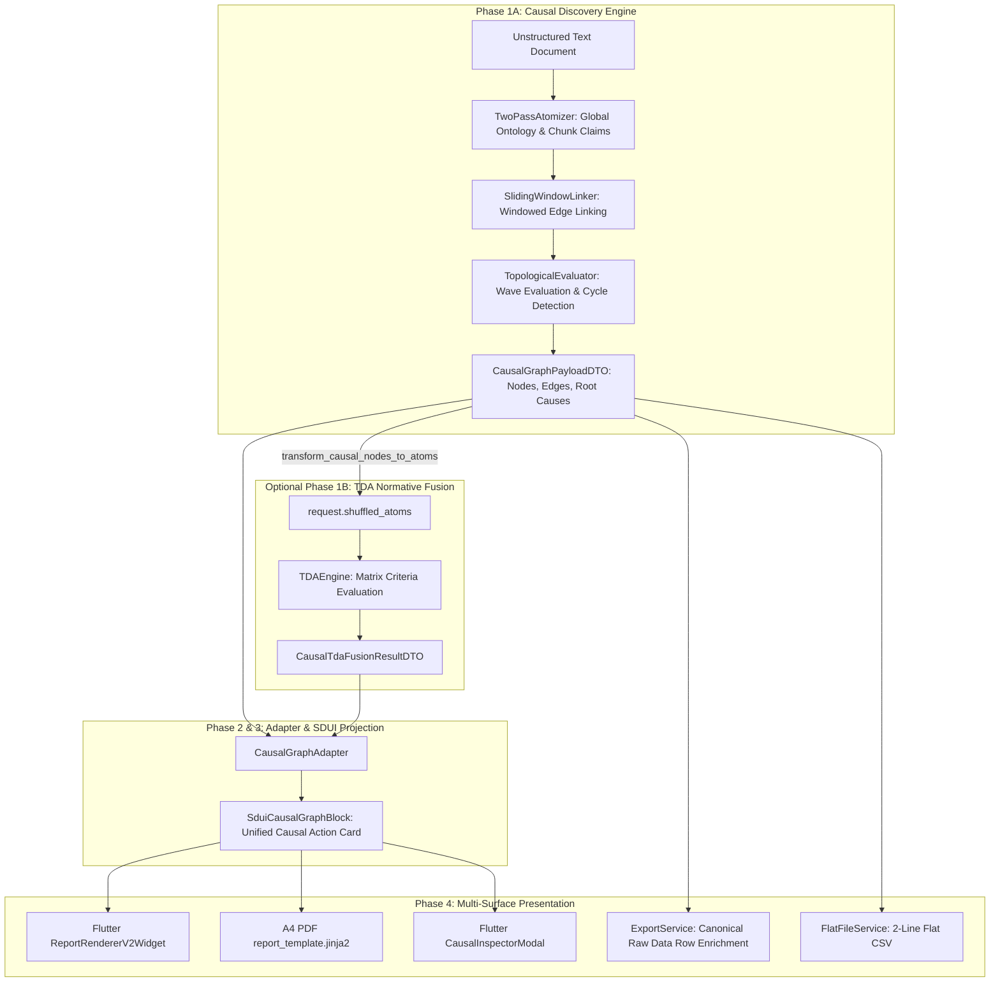

<required_context_rules>
    <rule>@[.agents/rules/00-antigravity-core.md]</rule>
    <rule>@[.agents/rules/01-python-backend.md]</rule>
    <rule>@[.agents/rules/02_flutter_desktop.md]</rule>
    <rule>@[.agents/rules/03_seed_vault.md]</rule>
    <rule>@[.agents/rules/04_directory_reference.md]</rule>
    <rule>@[.agents/rules/05_llm_architecture.md]</rule>
    <knowledge_item>@[ki_god_code_prevention.md]</knowledge_item>
    <knowledge_item>@[ki_context_enriched_decompose_verify.md]</knowledge_item>
    <knowledge_item>@[ki_tripartite_pipeline_architecture.md]</knowledge_item>
    <knowledge_item>@[ki_topological_engine.md]</knowledge_item>
    <knowledge_item>@[ki_execution_engine_protocol.md]</knowledge_item>
    <knowledge_item>@[ki_zero_permissive_typing.md]</knowledge_item>
    <knowledge_item>@[ki_dumb_painter_sdui.md]</knowledge_item>
    <knowledge_item>@[ki_prompt_orchestration_and_matrix_evaluation.md]</knowledge_item>
    <knowledge_item>@[ki_unified_matrix_scoring_strictness.md]</knowledge_item>
    <knowledge_item>@[ki_desktop_pro_tool_studio_ux.md]</knowledge_item>
    <knowledge_item>@[ki_shared_storage_driver_architecture.md]</knowledge_item>
    <knowledge_item>@[ki_dag_engine_dto_projection_rules.md]</knowledge_item>
    <knowledge_item>@[ki_python_314_concurrency_strictness.md]</knowledge_item>
    <knowledge_item>@[ki_dual_axis_localization_architecture.md]</knowledge_item>
    <knowledge_item>@[ki_workflow_context_governance.md]</knowledge_item>
    <knowledge_item>@[ki_execution_record_ssot.md]</knowledge_item>
    <knowledge_item>@[ki_opentelemetry_logfire_observability.md]</knowledge_item>
    <knowledge_item>@[ki_llm_extraction_architecture.md]</knowledge_item>
    <knowledge_item>@[ki_epic_lifecycle_workflow.md]</knowledge_item>
    <knowledge_item>@[ki_synthesis_payload_compression.md]</knowledge_item>
</required_context_rules>

# EPIC 154: Dynamic Causal Discovery Engine (Exploratory Text DAG & Argument Mapping)

> [!NOTE]
> **Scientific & Industrial Validation (2025-2026)**
> Recent computational argumentation and neuro-symbolic research (specifically: *ABAPC-LLM* [ArXiv 2025/2026], *CausalFusion* [OpenReview 2026], and LLM DAG Reconstruction [ACL/IJCAI 2025/2026]) demonstrates that while foundational LLMs excel at initial semantic proposition extraction and causal prior elicitation, unconstrained LLM reasoning suffers from hallucinated causal links and rationalization errors. State-of-the-art architectures mandate a hybrid paradigm: LLMs perform structured argument component extraction (premises, claims, backing) anchored to physical source discourse, while a deterministic topological engine (graph validation, Kahn's wave evaluation, thread-isolated cycle detection, and causal Markov conditions) evaluates graph validity, short-circuits cascading faults, and isolates root causes without non-deterministic LLM hallucination. EPIC 154 implements this exact neuro-symbolic architecture in Quorum.

> [!CAUTION]
> **DISTANT FUTURE ROADMAP ONLY**
> This Epic is filed in reserve for a future extension and does not belong to the active development cycle. The Epic specifies an optional and experimental open-text causal discovery workflow (*Exploratory Causal Discovery Engine*) that analyzes free-form documents without a pre-configured evaluation matrix. This MUST NOT be activated as part of the current normative evaluation core, and it must not compromise the deterministic execution or strict `shuffled_atoms` contract of `TDAEngine`.

---

## 1. Goal Description & Background (Objective & Problem Statement)

### 1.1 Objective & Strategic Scope
The objective of EPIC 154 is to establish an autonomous, exploratory causal discovery engine (`CausalDiscoveryEngine`) within Quorum's tripartite execution architecture. Unlike the normative criteria-driven `TDAEngine`, which validates text against pre-configured criteria matrices via `request.shuffled_atoms`, `CausalDiscoveryEngine` performs open-text argument mining:
1. **Autonomous Proposition Extraction:** Extracts argument premises, assumptions, claims, and conclusions directly from free-form text using the Two-Pass Atomizer.
2. **Directed Graph Construction:** Chains propositions into a directed argument graph (`LinkedAtomGraph`) via sliding window linking.
3. **Topological Fault Cascade & Blame Attribution:** Executes topological wave evaluation to detect circular reasoning (`cycle_detected`), identify orphaned arguments (fluff), and propagate blame from root causes to cascading secondary failures.
4. **Standalone & Fusion Flexibility:** Operates in 100% standalone mode (zero matrix dependencies) OR as an upstream structural feeder (Phase 1A Discovery -> Phase 1B TDA Normative Evaluation) via Studio-driven chaining (`StepRule.causal_source_step_id`).
5. **Streamlined 1:1 SDUI Presentation:** Projects argument structures into a unified, compact **Unified Causal Action Card** (`SduiCausalGraphBlock`) with identical visual representations in Flutter and PDF (occupying at most half an A4 page in PDF), decoupling in-depth exploration into an interactive inspector modal (`CausalInspectorModal`).

### 1.2 Core Problem Statement
Current evaluations in Quorum operate predominantly against structured matrix blueprints where atoms are pre-compiled and evaluated in isolation. When analyzing unstructured executive essays, strategic plans, or legal arguments, two architectural limitations emerge:
- **Missing Logical Topology:** A document may contain individually plausible claims that form an invalid, circular, or unsupported argument chain. Independent atom evaluations miss this structural breakdown.
- **Double-Penalization of Secondary Faults:** If foundational Premise A fails, dependent Conclusions B, C, and D also fail. Without causal blame tracing (`blame_parent_ids`), the candidate loses repetitive points across all dependent steps for a single underlying error.

EPIC 154 solves both challenges through deterministic topological blame attribution, Anti-Fluff detection, and Fair Scoring Deduplication.

### 1.3 Core Architectural Invariants & User Review Specifications

#### Complete Standalone and Decoupled Mode (Standalone Engine Mandate)
`CausalDiscoveryEngine` is implemented and maintained primarily as a **100% standalone and decoupled analysis engine**:
- The engine executes completely independently without any dependency on `TDAEngine`, without a pre-configured evaluation matrix, and without criteria blocks.
- It does not require a `request.shuffled_atoms` input; instead, it autonomously extracts argument structures from free-form text, constructs a directed argument graph (`LinkedAtomGraph`), executes topological evaluation, and produces a complete visualizable report block (`SduiCausalGraphBlock`).
- In standalone mode, node colors and states directly reflect the topological validity of arguments (defined exhaustively as: Green = validated claim, Red = refuted/failed claim, Orange = cascading fault, Grey = orphaned concept).

#### Single Pipeline Invariant, Zero-Fallback Compliance & Typed Engine Registry
`CausalDiscoveryEngine`, `TDAEngine`, `SynthesisEngine`, and `PromptEngine` remain completely decoupled `ExecutionEngine` implementations. Engine resolution is strictly decoupled from heuristic string parsing (`"atom_flattening_hook" in step_def.pre_hooks`) and criteria category guessing. Instead, engine dispatch is governed deterministically by an explicit `EngineType` enum on the step blueprint (`step_def.engine_type: EngineType`) resolved via a centralized, typed `ENGINE_REGISTRY` in `backend_v2/services/orchestrator/engines/registry.py`. Phase 1 analytical DAG execution resolves compute engines (`TDAEngine`, `CausalDiscoveryEngine`, `PromptEngine`, and in-DAG intermediate `SynthesisEngine`) strictly and deterministically in O(1) time without conflating Phase 1 execution with Phase 2 Report Synthesis (`synthesis_worker.py`). `CausalDiscoveryEngine` binds strictly via `EngineType.CAUSAL_DISCOVERY`. It MUST NOT function as a fallback branch inside `TDAEngine`, and the engines must never be merged into a monolithic class. `TDAEngine` preserves its 100% strict Fail-Fast contract (requiring `request.shuffled_atoms`). All step blueprints in `seed_data.json` and Dart client models in `client_app_v2` maintain 1:1 Full-Duplex Serialization Parity.

#### Automatic Engine Binding & Zero UI Over-Engineering
Workflow designers in Quorum Studio (`StepBuilderView`) configure a step's functional taxonomy (`StepType`: `LLM`, `LOGIC`, `CAUSAL_DISCOVERY`) and cognitive attributes (prompt blocks, criteria, cognitive tier). The execution engine is NEVER exposed as a manual dropdown in the UI. Instead, the backend automatically and deterministically binds the step's functional definition to its appropriate compute engine (`CausalDiscoveryEngine` for `StepType.CAUSAL_DISCOVERY`, `TDAEngine` for steps with matrix criteria, `PromptEngine` for non-matrix LLM steps). This completely protects the user interface from backend infrastructure leaks, prevents dual-source-of-truth configuration conflicts, and allows new steps authored in Studio to execute dynamically via `ENGINE_REGISTRY` with zero backend code changes.

#### Optional Causal Graph and TDA Matrix Fusion (Two Separate Engines -> One Unified Result)
When a workflow combines normative criteria evaluation with an exploratory causal graph, they are not executed as disconnected parallel reports; instead, they are chained into a two-phase deterministic analysis pipeline:
- **Dynamic Matrix Independence & Extensibility:** All evaluation matrices and argumentation frameworks (compiled from ALL configured PromptBlocks — argumentation matrices and criteria frameworks are 100% dynamic domain entities configured exclusively in Quorum Studio via `PromptBlockCategory.MATRIX` prompt blocks and loaded at runtime — they can be added, modified, or removed dynamically with zero backend code changes) are persisted in `seed_data.json`. Matrices are never hardcoded in source code: workflows can configure zero, one, or multiple dynamic matrices; matrices can be added, updated, or removed dynamically without modifying backend code.
1. **Pipeline Chaining (Discovery extracts -> TDA evaluates):**
   The workflow does not pick engines nondeterministically; rather, they are chained at the DAG layer into two deterministic phases:
   - **Phase 1A (`CausalDiscoveryEngine`):** The engine analyzes free-form text and constructs a directed argument graph (`LinkedAtomGraph`), isolating premises, claims, and conclusions into discrete atom nodes without requiring any evaluation matrix.
   - **Phase 1B (`TDAEngine`):** The TDA engine does not evaluate the raw text corpus randomly; rather, it takes these discovered causal nodes as direct input (`ExtractedAtom` -> `shuffled_atoms`) and evaluates them against whichever dynamic criteria matrix is configured for that step (verifying: Warrant linkage, Backing evidence, dogmatic quantifiers, and matrix score scales).
   - **Outcome:** A single analysis pipeline where causal discovery structures the document topology and TDA acts as the qualitative normative judge.
2. **Semantic Overlay in the User Interface:**
   The user interface does not present disjointed parallel tabs or separate duplicate reports; instead, the Flutter SDUI layer renders a single unified interactive graph (`SduiCausalGraphBlock`):
   - Directed edges between nodes depict the logical progression and causal relationships extracted by the Discovery engine.
   - In fusion mode, node colors and levels originate directly from the TDA matrix (defined exhaustively as: Green = grounded claim, Red = dogmatic assumption lacking backing).
   - **Outcome:** The evaluator inspects the logical structure of the text and the qualitative rigor of each argument in a single visual node representation.
3. **Causal Root Cause Attribution in Scoring:**
   Causal Discovery fault attribution (`blame_parent_ids`) binds directly to TDA score deductions and verbal rationale:
   - When an author loses points under the criteria "Claim Grounding", the system avoids generic feedback and instead reports the causal path: *"Conclusion B failed because it relies on the refuted assumption in node A in paragraph [B2]"*.
   - **Outcome:** Total score computations and qualitative justifications form a single non-disputable and transparent evaluation audit trail.

#### Flutter UI & PDF 1:1 Presentation Parity & Streamlined Output
The interactive on-screen report view (`ReportRendererV2Widget`) and the generated A4 PDF (`report_template.jinja2`) represent the exact same document:
- **Identical Output Representation:** In both Flutter and PDF, `SduiCausalGraphBlock` renders an identical, compact, and readable **Unified Causal Action Card**, occupying at most half an A4 page in the PDF artifact.
- **Critical Causal Path Principle:** The output avoids rendering an illegible spaghetti graph of dozens of passing claims. Instead, the output renders a streamlined left-to-right error chain: `[Root Cause]` -> caused -> `[Cascading Fault]` -> resulted in -> `[Score Loss]`, accompanied by the lexical quote and prescriptive remediation. Validated passing claims are summarized in a single compact metric (defined exhaustively as: "X other claims verified logically sound").
- **Supplementary Inspection Decoupling:** Free-form graph exploration, pan-and-zoom navigation, and in-depth inspection are strictly decoupled into a dedicated modal (`CausalInspectorModal`), opened via an explicit inspection action button. The primary printed and on-screen report layout remains 100% clean, standardized, and identical across screen and paper.

#### Streamlined Studio-Driven OutputProfile & Unified Single Presentation Point
Adhering to `studio_driven_parameterization_mandate` and the Single Presentation Point Invariant (obeying the Feature Audit for Causal Extensions Synchronization and the Executive Summary Unification Audit), all causal evaluation results are projected into **exactly ONE presentation point**: the **Unified Causal Action Card** (`SduiCausalGraphBlock`) integrated directly as the focal empirical core of **`TargetBlockType.EXECUTIVE_SUMMARY_BLOCK`**. There is ZERO separate "causal output", "causal report", or disconnected output pipeline, and ZERO separate `CAUSAL_GRAPH_BLOCK` in `target_block_order`.
- **Integrated Executive Horizon (`target_block_order`):** Quorum Studio retains strictly `TargetBlockType.EXECUTIVE_SUMMARY_BLOCK` as the single executive overview block. The Pääkortti (`SduiCausalGraphBlock`) is not an independent layout block, but an integral sub-component and core input to the Executive Summary section. `ExecutiveSummaryAdapter` ingests `context.causal_result` as one of its inputs (alongside `distilled_inputs`, `matrix_context`, and `user_role`), assembling a unified four-part executive presentation: 1. Status & Role pill, 2. Holistic strategic narrative (`ParagraphBlock`), 3. Unified Causal Action Card (`SduiCausalGraphBlock`, rendered whenever causal results exist), and 4. Strategic recommendations (`BulletListBlock`). If the workflow lacks causal results, the section degrades cleanly to the standard holistic narrative without broken cards.
- **Holistic Executive Prose & Empirical Causal Grounding:** The Executive Summary never degenerates into a bare diagnostic fault card. The holistic strategic narrative (observations on maturity, strengths, positive nuance, and contextual assessment) remains fully preserved. In Phase 2 synthesis (`synthesis_tasks.py` -> `create_executive_summary_task`), Phase 1 causal diagnosis (`causal_result: CausalRootCauseDiagnosisDTO | CausalGraphPayloadDTO`) is injected into the LLM synthesis context inside `<causal_diagnosis>` at the dynamic payload tail. This ensures the LLM's high-level prose and the Pääkortti's empirical fault chain speak with 100% mutual coherence without contradiction.
- **Driven by SSOT Extensions (`visible_block_extensions`):** The card and surrounding report blocks (specifically: `AccordionBlock` and `MatrixSummaryTable`) are dynamically populated based on `OutputProfile.visible_block_extensions` (specifically: `remediation_steps`, `falsification`, `risk_flag`, `citation`). Bifurcated micro-toggles, separate block types, and speculative display mode switches (`causal_display_mode`) are eradicated in favor of the existing `visible_block_extensions` Single Source of Truth.
- **Executive Card Standard:** The card renders an executive, half-page linear critical causal path (`[Root Cause]` -> `[Cascading Fault]` -> `[Score Loss]`), accompanied by the lexical quote and prescriptive remediation. Deep interactive exploration is strictly decoupled into `CausalInspectorModal`.

#### Forensic Tabular Symmetry & Single Output Invariant
Output parity extends directly to tabular data exports (`ExportService`):
- **Canonical "Raw Data" Worksheet Integration:** In fusion mode, TDA atom rows are enriched directly with scalar causal columns: `causal_status`, `blame_parent_id`, and `dependent_count`. Disjoint, isolated worksheets ("Causal Graph", "Causal Diagnostics") are pruned to prevent fragmented reporting silos.
- **Flat CSV (`FlatFileService`):** `FlatExecutionRecordDTO` is extended with centralized scalar causal metrics (`causal_node_count`, `causal_root_cause_count`, `causal_raw_penalty`, `causal_deduplicated_penalty`). The output remains strictly a two-line flat CSV artifact (line 1 = comma-delimited column headers, line 2 = scalar values), containing zero nested group headers or multi-level hierarchies.

#### Five Core Stakeholder Benefits
1. **Root Cause Attribution:** The topological blame cascade (`blame_parent_ids`) isolates the foundational origin of an error chain.
2. **Anti-Fluff Shield:** Detects orphaned concepts and circular reasoning (`cycle_detected`), deducting points when an argumentative chain is missing.
3. **Prescriptive Feedback:** Surgical remediation recommendations indicating which corrections unlock downstream assertions.
4. **Visual XAI Overlay:** A unified argument map where node color reflects operational status and lexical citations expand on demand.
5. **Fair & Deduplicated Scoring:** Decouples independent root causes from cascading secondary errors, preventing repetitive scoring penalties for a single underlying fault.

#### SSOT and Pydantic V2 Contracts
All domain models (`LinkedAtomGraph`, `CausalEdgeDTO`, `CausalNodeDTO`, `CausalRootCauseDiagnosisDTO`, `AntiFluffAuditDTO`, `PrescriptiveRemediationDTO`, `FairScoringBreakdownDTO`, `SduiCausalGraphBlock`, `OutputProfile`) adhere strictly to `ConfigDict(strict=True, extra='forbid', frozen=True)` with zero naked dictionaries.

#### Four-Layer Clean Stack & High-Fidelity Prompting
LLM prompts in `CausalDiscoveryEngine` are compiled strictly through the Four-Layer Clean Stack hierarchy:
1. **Layer 1: Static System Directives & Mandates:** Static ontology instructions placed in the system prompt prefix for 100% context caching efficiency.
2. **Layer 2: Theory Grounding & Epistemic Context:** Dynamically loaded theory grounding and argumentation schemes (compiled from ALL configured PromptBlocks — argumentation matrices and criteria frameworks are 100% dynamic domain entities configured exclusively in Quorum Studio via `PromptBlockCategory.MATRIX` prompt blocks and loaded at runtime — they can be added, modified, or removed dynamically with zero backend code changes) injected into `<theory_context>`. Matrices are never hardcoded in source code: all matrices and criteria schemes are dynamic domain entities that can be added, modified, or removed in Quorum Studio with zero backend code changes.
3. **Layer 3: Extraction Protocol:** Step-level argument extraction and linking behavior.
4. **Layer 4: Dynamic User Payload & Execution Variables:** Dynamic text blocks indexed as `[B0]...[Bn]` and atom aliasing (`a0`, `a1`) placed at the tail.
- **Exact Physical Anchoring:** Extracted quotes (`source_quote`) must strictly match source text via `str.find` lexical validation; fuzzy string matching is prohibited.

#### Pruned Over-Engineering & 30% Deletion Verification (Axis 4)
- **`CausalStep` Domain Subclass: PRUNED.** Rejected in favor of the existing `Step` domain model with validation branching, avoiding class hierarchy explosion.
- **Persistent Graph Database: PRUNED.** Rejected in favor of in-memory transient graph representation (`LinkedAtomGraph`) projected directly to SDUI `SduiCausalGraphBlock` and trace JSON.
- **Separate Causal Reports & Disjoint Worksheets: PRUNED.** Banned bifurcated causal reports and separate Excel worksheets ("Causal Graph", "Causal Diagnostics"). All causal reporting is consolidated into the single unified report (`SduiCausalGraphBlock`) and canonical "Raw Data" worksheet.
- **`CausalDisplayMode` Enum & Profile Micro-Toggles: PRUNED.** Eradicated in favor of the existing `OutputProfile.visible_block_extensions` SSOT. The Unified Causal Action Card renders compactly (half-page A4 PDF budget) with interactive deep-dive decoupled into `CausalInspectorModal`.
- **8 Dedicated Pydantic V2 DTOs: RETAINED.** `CausalNodeDTO`, `CausalEdgeDTO`, `CausalGraphPayloadDTO`, `CausalRootCauseDiagnosisDTO`, `AntiFluffAuditDTO`, `PrescriptiveRemediationDTO`, `FairScoringBreakdownDTO`, and `CausalTdaFusionResultDTO` are retained as irreducible domain contracts.

---

## 2. Architectural Impact & Compliance Matrix

### 2.1 Complete Target Scope & File Inventory

#### Quantitative Scope Validation:
| Archetype / Domain Category | Target File Count | Concrete File Deliverables | Blast Radius / Invariant Impact |
| :--- | :--- | :--- | :--- |
| **New Python Modules (Engines, DTOs, Adapters)** | 3 new files | `causal_discovery_engine.py`, `causal_discovery.py`, `causal_graph_adapter.py` | Standalone ExecutionEngine implementation, 8 Pydantic V2 DTOs, SDUI adapter |
| **Backend Orchestration & Runtime Modification** | 15 files | `settings.py`, `enums.py`, `exceptions.py`, `step.py`, `strategies/registry.py`, `strategies/llm.py`, `dag_models.py`, `two_pass_atomizer.py`, `sliding_window_linker.py`, `dag_executor.py`, `engines/__init__.py`, `engines/base.py`, `engines/tda_engine.py`, `engines/prompt_engine.py`, `engines/synthesis_engine.py` | Central configuration, StepType registration, CAUSAL_DISCOVERY_* ErrorCodes, chunk packet DTOs, priority engine dispatch, protocol telemetry labeling |
| **SDUI, Presentation & Synthesis Backend** | 8 files | `step_output.py`, `sdui.py`, `base_adapter.py`, `executive_summary_adapter.py`, `blueprint.py`, `synthesis_tasks.py`, `synthesis_worker.py`, `report_template.jinja2` | Full-duplex serialization, SduiCausalGraphBlock union, AdapterContext envelope, unified Executive Summary assembly, causal prompt grounding |
| **Tabular & Flat Data Export Pipeline** | 3 files | `export_service.py`, `flattener.py`, `flat_record.py` | Canonical Raw Data worksheet enrichment and 2-line flat CSV export |
| **Backend Fixtures, Seed & Automated Tests** | 8 files (2 new, 6 modified) | `test_causal_discovery_engine.py` [NEW], `test_engine_registry.py` [NEW], `test_causal_tda_fusion.py` [NEW], `test_enum_parity.py`, `test_sdui_semantic_parity.py`, `test_sdui_template_parity.py`, `test_two_pass_atomizer.py`, `sdui_golden_master.json`, `seed_data.json` | ISTQB boundary partitions, fusion integration, 19 SDUI block parity, enum verification, seed data explicit engine_type migration |
| **Frontend Presentation, Widgets, Studio & Parity** | 8 files (2 new, 6 modified) | `sdui_causal_graph_widget.dart` [NEW], `causal_inspector_modal.dart` [NEW], `enums.dart`, `workflow.dart`, `sdui_block_dto.dart`, `sdui_blocks_renderer.dart`, `app_en.arb`, `app_fi.arb` | Freezed DTOs, Dumb Painter action card, decoupled interactive inspector modal, block renderer dispatch, EngineType enum parity, compile-time localization |
| **Context & Read-Only Architectural References** | 3 files | `topological_evaluator.py`, `result_projector.py`, `report_renderer_v2_widget.dart` | Read-only references verifying ExecutionEngine protocol, Kahn's sort, and UI architecture |
| **TOTAL SCOPE AGGREGATION** | **45 Target Files** (7 NEW, 38 MODIFIED) + **3 Context Files** | Total 48 System Boundaries Audited | 100% Zero-Duct-Tape, Zero-Naked-Dicts, and 1:1 Cross-Platform Parity Enforced |

#### Target Files:
- `[NEW] @[backend_v2/services/orchestrator/engines/causal_discovery_engine.py]`
- `[NEW] @[backend_v2/services/orchestrator/engines/registry.py]`
- `[NEW] @[backend_v2/models/dtos/causal_discovery.py]`
- `[NEW] @[backend_v2/services/sdui/adapters/causal_graph_adapter.py]`
- `[MODIFY] @[backend_v2/settings.py#L54-L910]`
- `[MODIFY] @[backend_v2/models/enums.py#L111-L116]`
- `[MODIFY] @[backend_v2/exceptions.py#L128-L313]`
- `[MODIFY] @[backend_v2/models/domain/step.py#L32-L119]`
- `[MODIFY] @[backend_v2/models/domain/step.py#L122-L161]`
- `[MODIFY] @[backend_v2/services/orchestrator/strategies/registry.py#L69-L99]`
- `[MODIFY] @[backend_v2/services/orchestrator/strategies/llm.py#L82-L1010]`
- `[MODIFY] @[backend_v2/models/dtos/dag_models.py#L18-L57]`
- `[MODIFY] @[backend_v2/services/orchestrator/two_pass_atomizer.py#L50-L71]`
- `[MODIFY] @[backend_v2/services/orchestrator/sliding_window_linker.py#L122-L353]`
- `[MODIFY] @[backend_v2/models/dtos/step_output.py#L57-L71]`
- `[MODIFY] @[backend_v2/models/view/sdui.py#L563-L569, L797-L817]`
- `[MODIFY] @[backend_v2/services/sdui/adapters/base_adapter.py#L18-L47]`
- `[MODIFY] @[backend_v2/services/sdui/adapters/executive_summary_adapter.py]`
- `[MODIFY] @[backend_v2/services/blueprint.py#L52-L608]`
- `[MODIFY] @[backend_v2/workers/synthesis_tasks.py]`
- `[MODIFY] @[backend_v2/workers/synthesis_worker.py]`
- `[MODIFY] @[backend_v2/templates/report_template.jinja2#L87-L550]`
- `[MODIFY] @[backend_v2/services/export_service.py#L82-L301]`
- `[MODIFY] @[backend_v2/services/flattener.py#L24-L76]`
- `[MODIFY] @[backend_v2/models/dtos/flat_record.py#L17-L55]`
- `[MODIFY] @[backend_v2/services/orchestrator/dag_executor.py#L136-L372]`
- `[MODIFY] @[backend_v2/services/orchestrator/dag_executor.py#L375-L1347]`
- `[MODIFY] @[backend_v2/services/orchestrator/engines/__init__.py]`
- `[MODIFY] @[backend_v2/services/orchestrator/engines/base.py]`
- `[MODIFY] @[backend_v2/services/orchestrator/engines/tda_engine.py]`
- `[MODIFY] @[backend_v2/services/orchestrator/engines/prompt_engine.py]`
- `[MODIFY] @[backend_v2/services/orchestrator/engines/synthesis_engine.py]`
- `[MODIFY] @[backend_v2/tests/unit/test_enum_parity.py#L110-L112]`
- `[MODIFY] @[backend_v2/tests/fixtures/sdui_golden_master.json#L470-L482]`
- `[MODIFY] @[backend_v2/tests/integration/test_sdui_semantic_parity.py#L109-L380]`
- `[MODIFY] @[backend_v2/tests/unit/test_sdui_template_parity.py#L111-L148]`
- `[MODIFY] @[backend_v2/tests/unit/services/orchestrator/test_two_pass_atomizer.py#L180-L186]`
- `[MODIFY] @[backend_v2/seed/seed_data.json]`
- `[NEW] @[backend_v2/tests/unit/services/orchestrator/engines/test_causal_discovery_engine.py]`
- `[NEW] @[backend_v2/tests/unit/services/orchestrator/engines/test_engine_registry.py]`
- `[NEW] @[backend_v2/tests/unit/services/orchestrator/test_causal_tda_fusion.py]`
- `[MODIFY] @[client_app_v2/lib/core/models/enums.dart]`
- `[MODIFY] @[client_app_v2/lib/features/studio/models/workflow.dart]`
- `[MODIFY] @[client_app_v2/lib/shared/models/sdui_block_dto.dart#L10-L171]`
- `[NEW] @[client_app_v2/lib/features/execution/views/widgets/sdui_causal_graph_widget.dart]`
- `[NEW] @[client_app_v2/lib/features/execution/presentation/causal_inspector_modal.dart]`
- `[MODIFY] @[client_app_v2/lib/features/execution/views/widgets/sdui_blocks_renderer.dart#L40-L100]`
- `[MODIFY] @[client_app_v2/lib/l10n/app_en.arb]`
- `[MODIFY] @[client_app_v2/lib/l10n/app_fi.arb]`

#### Context / Read-Only Files:
- `@[backend_v2/services/orchestrator/topological_evaluator.py]`
- `@[backend_v2/services/orchestrator/result_projector.py]`
- `@[client_app_v2/lib/features/execution/views/widgets/report_renderer_v2_widget.dart]`

### 2.2 Architectural Directives (5-Column Synthesis)

| 1. Target Scope & Boundaries | 2. Eradicated Duct-Tape (Under-Engineering Ban) | 3. Approved Best Practice (Target Invariant) | 4. Pruned Over-Engineering (Complexity Slayer) | 5. Verification & Fail-Fast (Proof Anchor) |
| :--- | :--- | :--- | :--- | :--- |
| **Settings Configuration**<br>`@[backend_v2/settings.py#L54-L910]` | Magic constants in sliding window loops, hardcoded window sizes, fallback `getattr(settings, ...)` access. | Centralized Pydantic V2 `Settings` fields: `causal_discovery_window_size: int = 4`, `causal_discovery_overlap: int = 2`, `causal_discovery_max_atoms_per_window: int = 25`, `causal_discovery_max_total_atoms: int = 100`, `causal_secondary_fault_dampening: float = 0.25`, `two_pass_atomizer_packet_size: int = 50`. Causal discovery settings are explicitly injected into `SlidingWindowLinker` without mutating existing constructor defaults (`window_size = 4, overlap = 2`). | Speculative per-domain sliding window overrides and dynamic runtime reload factories. | `Settings.model_validate({})` strict type validation in unit tests; `test_settings.py`. |
| **SSOT Enums & ErrorCodes**<br>`@[backend_v2/models/enums.py#L111-L116]`<br>`@[backend_v2/exceptions.py#L128-L313]` | Untyped string comparisons (`self.type == "llm"`), heuristic string matching, ad-hoc string literals for block types. | `StepType.CAUSAL_DISCOVERY = "causal_discovery"` and `EngineType(StrEnum)` (`TDA = "tda"`, `SYNTHESIS = "synthesis"`, `PROMPT = "prompt"`, `CAUSAL_DISCOVERY = "causal_discovery"`) in `enums.py`. Explicit ErrorCodes in `exceptions.py`: `CAUSAL_DISCOVERY_EMPTY_DOCUMENT`, `CAUSAL_DISCOVERY_CYCLE_DETECTED`, `CAUSAL_DISCOVERY_DATA_STARVATION`. Zero mutation to `TargetBlockType`. | Granular display mode permutations (isolated anti-fluff toggles, remediations toggles), speculative block type additions. | `backend_audit_loop.py` verifying enum and exception integrity. |
| **Pre-Implementation Atomizer Cleanups**<br>`@[backend_v2/services/orchestrator/two_pass_atomizer.py#L50-L71]`<br>`@[backend_v2/models/dtos/dag_models.py#L18-L57]`<br>`@[backend_v2/tests/unit/services/orchestrator/test_two_pass_atomizer.py#L180-L186]` | Returning anonymous 3-tuples (`tuple[str, str, list[str]]`) in `_calculate_packets` ("Tuple Hell"), hardcoded magic window sizes (`packet_size = 50`). | Encapsulate chunk packet bounds into typed immutable `ChunkPacketDTO(start_block: str, end_block: str, block_keys: list[str])` in `dag_models.py`. Bind `packet_size` to `get_settings().two_pass_atomizer_packet_size`. | Intermediate packet wrapper classes or custom iterator protocols. | `uv run python scripts/audit_dict_eradication.py` passing AST guardrails; unit tests in `test_two_pass_atomizer.py`. |
| **SlidingWindowLinker Isolation**<br>`@[backend_v2/services/orchestrator/sliding_window_linker.py#L122-L353]` | Hardcoded `window_size=4, overlap=2` constructor defaults mutating shared caller behavior. | **DO NOT** mutate constructor defaults in `SlidingWindowLinker.__init__`. `CausalDiscoveryEngine` constructs `SlidingWindowLinker` with explicit settings: `SlidingWindowLinker(window_size=get_settings().causal_discovery_window_size, overlap=get_settings().causal_discovery_overlap)`. Existing `TDAEngine` callers retain current behavior without parameter contamination. | Binding constructor defaults to causal-specific settings. | Regression tests for existing `SlidingWindowLinker` callers; unit tests in `test_causal_discovery_engine.py`. |
| **Step Consistency & Strategy Registry**<br>`@[backend_v2/models/domain/step.py#L32-L119]`<br>`@[backend_v2/services/orchestrator/strategies/registry.py#L69-L99]` | Raw string literal comparisons (`self.type == "llm"`, `self.type == "logic"`) bypassing `StepType` enum, duck-typing missing criteria block IDs. | Explicit `StepType.LLM` and `StepType.LOGIC` enum comparisons. Declare `engine_type: EngineType = Field(default=EngineType.PROMPT, description="Explicit ExecutionEngine responsible for computing this step.")` on `Step`. New `StepType.CAUSAL_DISCOVERY` branch allowing empty `criteria_block_ids` while enforcing `extraction_protocol_block_id` and `cognitive_tier`. `NODE_STRATEGY_REGISTRY` (L63-L66) maps `StepType.CAUSAL_DISCOVERY -> _build_llm_strategy`, verified in `NodeStrategyFactory.create_strategy` (L73). | Separate `CausalStep` domain model subclass or parallel step validation pipeline. | Unit tests asserting `AppException` when `extraction_protocol_block_id` is missing; `backend_audit_loop.py`. |
| **`_resolve_execution_engine` Cleanup & Typed EngineRegistry**<br>[NEW] `@[backend_v2/services/orchestrator/engines/registry.py]`<br>`@[backend_v2/services/orchestrator/dag_executor.py#L160-L187]` | **Pre-existing debt:** `"atom_flattening_hook" in step_def.pre_hooks` heuristic string matching (L184) and criteria block category guessing violating `ban_heuristic_identifier_matching`. | Eradicate all heuristic string parsing and category inspection loops in `_resolve_execution_engine`. Introduce typed `ENGINE_REGISTRY: dict[EngineType, type[ExecutionEngine]]` in `registry.py`. `NodeExecutor._resolve_execution_engine` resolves deterministically via `ENGINE_REGISTRY[step_def.engine_type]` in O(1) time with Fail-Fast `AppException(ErrorCodes.VALIDATION_FAILED)`. | Heuristic substring matches, hardcoded hook tuple markers, and if-elif branching cascades. | Unit tests in `test_engine_registry.py` proving deterministic resolution and zero heuristic hook parsing. |
| **LLM Strategy Telemetry & Dispatch**<br>`@[backend_v2/services/orchestrator/strategies/llm.py#L82-L1010]`<br>`@[backend_v2/services/orchestrator/engines/base.py]`<br>`@[backend_v2/services/orchestrator/engines/tda_engine.py]`<br>`@[backend_v2/services/orchestrator/engines/prompt_engine.py]`<br>`@[backend_v2/services/orchestrator/engines/synthesis_engine.py]` | Permissive model strategy fallback defaulting to `"prompt"`, ignoring engine ontology for causal discovery steps. `isinstance()` runtime type-check heuristic for strategy string selection (L973–L976). Duck-typing `isinstance(existing_meta, BaseModel|Mapping)` cascade and untyped `meta_dict = {}` dictionary key mutation accumulator at L964-L970. | Add `telemetry_strategy_label: str` property to `ExecutionEngine` Protocol in `@[backend_v2/services/orchestrator/engines/base.py]`. Each engine self-reports its label (`TDAEngine` returns `"tda"`, `PromptEngine` returns `"prompt"`, `SynthesisEngine` returns `"synthesis"`, `CausalDiscoveryEngine` returns `"causal"`). In `LLMNodeStrategy`, replace `isinstance` branching and untyped duck-typing by reconstituting `_step_metadata` directly via typed `StepTraceMetadataDTO` and reading `self._engine.telemetry_strategy_label`. | Dynamic strategy router subclasses or parallel LLM execution strategies. `isinstance` cascade branches and untyped dictionary accumulators. | Unit tests verifying `engine.telemetry_strategy_label == "causal"`, `_step_metadata.model_strategy == "causal"`, and `StepTraceMetadataDTO` validation roundtrip. |
| **Causal Discovery DTOs**<br>[NEW] @[backend_v2/models/dtos/causal_discovery.py]<br>`@[backend_v2/models/dtos/step_output.py#L57-L71]` | Naked dictionaries (`dict[str, Any]`, `TypedDict`), anonymous state tuples ("Tuple Hell"), optional fallback keys. | Immutable Pydantic V2 DTOs (`ConfigDict(strict=True, extra="forbid", frozen=True)`): `CausalNodeDTO`, `CausalEdgeDTO`, `CausalGraphPayloadDTO`, `CausalRootCauseDiagnosisDTO`, `AntiFluffAuditDTO`, `PrescriptiveRemediationDTO`, `FairScoringBreakdownDTO`, `CausalTdaFusionResultDTO`. `StepPayloadValue` (L30-L54) extended with `CausalGraphPayloadDTO` and `CausalTdaFusionResultDTO`. | Polymorphic node inheritance hierarchies, recursive graph wrapper classes, intermediate DTO converter factories. | `QGR001` (no naked dicts) and `QGR002` (extra="forbid") automated AST guardrail passing in audit loop. |
| **Fusion Chaining Contract**<br>`@[backend_v2/models/domain/step.py#L122-L161]`<br>`@[backend_v2/services/orchestrator/dag_executor.py#L136-L372]` | Heuristic step-order detection, runtime flag branching, unmapped document passing. | Studio-driven parameterization: explicit first-class field `StepRule.causal_source_step_id: str \| None = None` referencing upstream causal discovery step within workflow DAG, with cross-field `@model_validator(mode='after')` on `StepRule` enforcing `causal_source_step_id ∈ self.depends_on`. DAG executor transforms upstream `CausalGraphPayloadDTO.nodes` to `ExtractedAtom` via `transform_causal_nodes_to_atoms` and feeds `request.shuffled_atoms`. | Nondeterministic engine picking, automatic graph merging without declared contracts. | Integration test in `test_causal_tda_fusion.py`. |
| **Unified Executive Presentation Point**<br>`@[backend_v2/services/sdui/adapters/executive_summary_adapter.py]`<br>`@[backend_v2/services/blueprint.py#L52-L608]` | Speculative `CausalDisplayMode` enum, separate `CAUSAL_GRAPH_BLOCK` in `target_block_order`, parallel studio configuration cards, and dual-summary fragmentation. | Single Presentation Point Invariant: OutputProfile retains strictly `TargetBlockType.EXECUTIVE_SUMMARY_BLOCK` in `target_block_order` (zero block-type proliferation). The causal action card is integrated as an empirical input and sub-component of Executive Summary. Prescriptive extensions (`remediation_steps`, `falsification`, etc.) are governed exclusively via existing `visible_block_extensions`. | Granular micro-toggles (`show_causal_anti_fluff`, `show_causal_remediations`, `show_causal_fair_scoring`, `causal_max_nodes_rendered`), separate bifurcated display modes (`CausalDisplayMode`), duplicate layout block types in `target_block_order`. | Unit and integration tests in `test_sdui_semantic_parity.py` and `backend_audit_loop.py`. |
| **Causal Discovery Engine & Execution**<br>[NEW] `@[backend_v2/services/orchestrator/engines/causal_discovery_engine.py]`<br>`@[backend_v2/services/orchestrator/engines/__init__.py]`<br>`@[backend_v2/services/orchestrator/dag_executor.py#L136-L372]`<br>`@[backend_v2/services/orchestrator/dag_executor.py#L375-L1347]` | Subclassing `TDAEngine`, branching inside `TDAEngine` based on missing `shuffled_atoms`, mutating existing step execution states in-place without DTOs, routing through fallback branches in `_resolve_execution_engine`. | Autonomous `CausalDiscoveryEngine(ExecutionEngine)` cleanly implementing `execute(request: EngineExecutionRequest) -> EngineExecutionResult`, re-exported in `__all__`. `NodeExecutor._resolve_execution_engine` routes via `step_def.type == StepType.CAUSAL_DISCOVERY`. StepType.CAUSAL_DISCOVERY check MUST be placed FIRST in `_resolve_execution_engine`, before block category and pre-hook inspection branches. Sequential DAG chaining strictly via immutable DTOs and `StepRule.causal_source_step_id`. | Dual execution buses, speculative actor frameworks, and persistent graph database storage engines. | Unit tests in `test_causal_discovery_engine.py` asserting Fail-Fast on cycle loops and empty documents; `test_causal_tda_fusion.py`. |
| **SDUI Model, Adapter & Blueprint**<br>`@[backend_v2/models/view/sdui.py#L563-L569, L797-L817]`<br>[NEW] `@[backend_v2/services/sdui/adapters/causal_graph_adapter.py]`<br>`@[backend_v2/services/sdui/adapters/executive_summary_adapter.py]`<br>`@[backend_v2/services/sdui/adapters/base_adapter.py#L18-L47]`<br>`@[backend_v2/services/blueprint.py#L52-L608]`<br>`@[backend_v2/workers/synthesis_tasks.py]`<br>`@[backend_v2/workers/synthesis_worker.py]`<br>`@[client_app_v2/lib/shared/models/sdui_block_dto.dart#L10-L171]` | Client-side graph semantic calculation, client inferring root causes, generic raw JSON passing, missing `SduiBlockBase` polymorphism, dual-summary clutter. | `SduiCausalGraphBlock(SduiBlockBase)` added to `AnySduiBlock` discriminated union (L797-L817). `AdapterContext` extended with typed `causal_result: CausalTdaFusionResultDTO | CausalGraphPayloadDTO | None = None` (in-memory only, never serialized across boundaries). `ExecutiveSummaryAdapter` unifies the top fold: resolves role badge $\rightarrow$ lead prose $\rightarrow$ delegates to `CausalGraphAdapter` to inject `SduiCausalGraphBlock` $\rightarrow$ bullet recommendations. 1:1 Freezed `@Freezed(unionKey: 'block_type')` Dart model. | Dynamic client-side layout calculators, SVG graph vector serialization over HTTP, multi-pass SDUI transformers, separate disjoint report blocks. | `test_sdui_template_parity.py` and `test_sdui_semantic_parity.py` passing 100%. |
| **1:1 Presentation Parity (Flutter & PDF)**<br>`@[backend_v2/templates/report_template.jinja2#L87-L550]`<br>[NEW] `@[client_app_v2/lib/features/execution/views/widgets/sdui_causal_graph_widget.dart]`<br>[NEW] `@[client_app_v2/lib/features/execution/presentation/causal_inspector_modal.dart]`<br>`@[client_app_v2/lib/features/execution/views/widgets/sdui_blocks_renderer.dart#L40-L100]` | Sprawling unreadable node graphs in PDF, inconsistent layout between PDF and screen, embedding heavy canvas tools into report print templates. | Identical Unified Causal Action Card in both Flutter and PDF: executive half-page critical causal path (`[Root Cause]` -> `[Cascading Fault]` -> `[Score Loss]`), lexical quote, prescriptive remediation. Deep interactive exploration decoupled strictly into `CausalInspectorModal`. | Embedded interactive JavaScript canvas in PDF, duplicate styling engines across platforms. | `test_sdui_semantic_parity.py` validating identical token and quote rendering across HTML/PDF and Flutter widgets. |
| **Tabular Export & Flat CSV Symmetry**<br>`@[backend_v2/services/export_service.py#L82-L301]`<br>`@[backend_v2/services/flattener.py#L24-L76]`<br>`@[backend_v2/models/dtos/flat_record.py#L17-L55]` | Multi-row hierarchical CSV headers, ragged nested Excel rows, missing causal columns in flat exports. | In fusion mode, enrich canonical `Raw Data` worksheet rows with columns `causal_status`, `blame_parent_id`, and `dependent_count`. `FlatExecutionRecordDTO` receives typed scalar causal fields (`causal_node_count`, `causal_root_cause_count`, `causal_raw_penalty`, `causal_deduplicated_penalty`). `FlatFileService` outputs strictly 2-line flat CSV (line 1 = header names, line 2 = scalar values). | Disjoint parallel Excel worksheets ("Causal Graph", "Causal Diagnostics"), pivot table generators, dynamic CSV dialect negotiation. | Unit tests in `test_export_service.py` asserting exact column headers and row counts. |
| **Regression & Integration Testing**<br>[NEW] `@[backend_v2/tests/unit/services/orchestrator/engines/test_causal_discovery_engine.py]`<br>[NEW] `@[backend_v2/tests/unit/services/orchestrator/test_causal_tda_fusion.py]`<br>`@[backend_v2/tests/fixtures/sdui_golden_master.json#L470-L482]`<br>`@[backend_v2/tests/integration/test_sdui_semantic_parity.py#L109-L380]`<br>`@[backend_v2/tests/unit/test_sdui_template_parity.py#L111-L148]` | Happy-path-only tests, mocking persistence with static dummy dicts, unasserted mock calls. | Comprehensive ISTQB tests: equivalence partitioning, boundary value analysis, negative partitions (at least 2 negative tests per feature: empty text, single atom, circular dependency, disconnected subgraph). Integration tests for Phase 1A -> Phase 1B sequential chaining. | Flaky network integration tests, long-running end-to-end browser tests for unit logic. | `uv run python scripts/backend_audit_loop.py` exiting 0 with Ruff, MyPy, and Pytest all green. |

### 2.3 Deprecations & Sunset List (`What We Will REMOVE`)

| Item to Deprecate / Sunset | Replacement / Target Destination | Destructive Operation Classification | Rationale |
| :--- | :--- | :--- | :--- |
| `list[tuple[str, str, list[str]]]` in `TwoPassAtomizer._calculate_packets` | `list[ChunkPacketDTO]` in `@[backend_v2/models/dtos/dag_models.py]` | Eradicate anonymous 3-tuple return type ("Tuple Hell") | Violates `ban_anonymous_state_tuples` in `00-antigravity-core.md`. |
| Hardcoded default `packet_size = 50` in `TwoPassAtomizer._calculate_packets` | Centralized `Settings.two_pass_atomizer_packet_size` | Remove hardcoded magic integer | Violates `Central Config Sovereignty` in `01-python-backend.md`. |
| Raw string comparisons `self.type == "llm"` and `self.type == "logic"` in `Step.validate_step_consistency` | Typed enum comparisons `self.type == StepType.LLM` and `self.type == StepType.LOGIC` | Eradicate string literal checks | Violates strict typing contracts and `01-python-backend.md`. |
| Heuristic pre-hook string checks (`"atom_flattening_hook" in step_def.pre_hooks` and `"synthesis_distiller_hook"`) and criteria block category inspections in `_resolve_execution_engine` | `ENGINE_REGISTRY[step_def.engine_type]` in `[NEW] @[backend_v2/services/orchestrator/engines/registry.py]` | Eradicate heuristic string parsing | Violates `ban_heuristic_identifier_matching` in `00-antigravity-core.md`. |
| Speculative `CausalStep` domain model subclass | Reused `Step` domain model with validation branching on `StepType.CAUSAL_DISCOVERY` | INTENTIONALLY DROPPED | Prevents polymorphic class explosion; adheres to Axis 4 pruning. |
| Persistent graph database storage (Neo4j / NetworkX persistence) | In-memory transient `LinkedAtomGraph` projected directly to `CausalGraphPayloadDTO` and SDUI blocks | INTENTIONALLY DROPPED | Preserves stateless execution and zero external infrastructure dependencies. |
| Granular Studio micro-toggles and speculative `CausalDisplayMode` selector | Existing `OutputProfile.visible_block_extensions` SSOT | Eradicate micro-toggle and display mode clutter | Adheres to Single Presentation Point Invariant and Axis 4 pruning. |
| Separate `TargetBlockType.CAUSAL_GRAPH_BLOCK` in `target_block_order` | Integrated directly into `TargetBlockType.EXECUTIVE_SUMMARY_BLOCK` | Eradicate block-type proliferation in Studio profiles | Eliminates dual-summary fragmentation and preserves single executive horizon. |
| Disjoint parallel Excel worksheets ("Causal Graph", "Causal Diagnostics") | Direct column enrichment (`causal_status`, `blame_parent_id`, `dependent_count`) in canonical "Raw Data" worksheet | Eradicate reporting silos | Eliminates bifurcated reporting pipelines. |
| Duck-typing cascade `isinstance(existing_meta, BaseModel|Mapping)` and untyped `meta_dict = {}` in `LLMNodeStrategy.execute` (`@[backend_v2/services/orchestrator/strategies/llm.py#L82-L1010]`) | Explicit Pydantic V2 `StepTraceMetadataDTO.model_validate()` and Protocol property `telemetry_strategy_label` | Eradicate duck-typing and unannotated dictionary mutation accumulator | Violates `the_zero_compromise_pledge` and `zero_service_layer_fallbacks` in `00-antigravity-core.md` and AST guardrail QGR012. |

### 2.4 Retained SSOT Invariants (`What We Will RETAIN`)

- **Topological Evaluator SSOT (`ki_topological_engine.md`):** Reuses existing `TopologicalEvaluator` with Kahn's wave-based topological sort, thread-isolated cycle detection, and local causal Markov condition evaluation.
- **ExecutionEngine Protocol (`ki_execution_engine_protocol.md`):** `CausalDiscoveryEngine` implements the standardized `ExecutionEngine` protocol, delegating from `LLMNodeStrategy` without branching inside `TDAEngine`.
- **Tripartite Decoupling (`ki_tripartite_pipeline_architecture.md`):** Phase 1 (DAG execution) outputs immutable DTOs, Phase 2 (Synthesis) consumes payloads without mutating graph state, and Phase 3 (SDUI) renders Dumb Painter blocks without semantic re-computation.
- **Pydantic V2 Strictness (`ki_zero_permissive_typing.md`):** All 8 new causal DTOs enforce `ConfigDict(strict=True, extra="forbid", frozen=True)` with zero naked dictionaries or anonymous state tuples.
- **Dumb Painter SDUI Architecture (`ki_dumb_painter_sdui.md`):** Client-side Flutter widgets perform zero semantic inference; all critical path nodes, error chains, and remediations are pre-computed on the backend.
- **Four-Layer Clean Stack (`ki_prompt_orchestration_and_matrix_evaluation.md`):** Prompt compilation enforces static ontology instructions in system prompt prefix for 100% caching efficiency, dynamic theory context in `<theory_context>`, step-level extraction protocol, and dynamic user text payloads at the tail.
- **Exact Lexical Anchoring (`05_llm_architecture.md`):** All extracted quotes (`source_quote`) validate strictly via `str.find` against indexed paragraph blocks `[B0]...[Bn]`; fuzzy string matching (RapidFuzz, Levenshtein) is strictly prohibited.

### 2.5 Compliance & Modernity Gates

1. **Zero Legacy State Support Mandate:** No backward-compatibility transition shims or legacy data migration layers. System expects clean slate DB re-seeding (`uv run python backend_v2/seed/run_seed.py local`).
2. **Central Config Sovereignty:** All sliding window boundaries, token limits, packet sizes, and dampening parameters reside in `backend_v2/settings.py`. Taxonomies reside in `models/enums.py`.
3. **Pydantic Strictness:** `ConfigDict(strict=True, extra='forbid', frozen=True)` enforced across all new domain models and DTOs.
4. **Cross-Domain DTO Parity:** Python Pydantic models map 1:1 with Dart Freezed models and `@JsonEnum` definitions (`client_app_v2/lib/core/models/enums.dart`, `client_app_v2/lib/shared/models/sdui_block_dto.dart`).
5. **Static-First Caching Topology:** Static prompt prefix with unbroken instructions; dynamic document blocks appended at the tail inside `<execution_parameters>`.
6. **Python 3.14 Concurrency:** `asyncio.TaskGroup` with semaphore context management (no `asyncio.gather`).
7. **RFC-7807 Dual-Reporting:** Every `AppException` crash is preceded by a structured `logger.error` containing logical codes and parameters.
8. **Strategy + Registry Pattern:** Dynamic dispatch via static registries (`NODE_STRATEGY_REGISTRY`) with eager loading and explicit re-exports in `__all__`.
9. **AST Guardrail Mandate:** Passes static AST guardrails (`QGR001` no naked dicts, `QGR002` extra='forbid', `MBD001-MBD009` boundary integrity).
10. **Scoped Boy Scout Rule:** Touched files (`two_pass_atomizer.py`, `step.py`, `dag_executor.py`) have pre-existing technical debt resolved in Phase 1 before new business logic is introduced.

### 2.6 Producer-Consumer Integration Check



- **Data Producer:** `CausalDiscoveryEngine` produces `CausalGraphPayloadDTO` containing argument nodes, directed edges, root cause IDs, and cycle flags.
- **Fusion Consumer:** `DAGExecutor` transforms upstream nodes to `ExtractedAtom` models feeding `TDAEngine.request.shuffled_atoms` when `step.causal_source_step_id` is declared.
- **SDUI Consumer:** `CausalGraphAdapter` translates `CausalTdaFusionResultDTO` or `CausalGraphPayloadDTO` into `SduiCausalGraphBlock`.
- **Surface Consumers:**
  - `SduiCausalGraphWidget` (Flutter) and Jinja2 macro (PDF) render the identical compact Unified Causal Action Card.
  - `CausalInspectorModal` (Flutter) provides decoupled interactive pan/zoom graph navigation.
  - `ExportService` enriches canonical "Raw Data" worksheet rows with causal columns (`causal_status`, `blame_parent_id`, `dependent_count`) during fusion runs, pruning disjoint worksheets.
  - `FlatFileService` outputs centralized scalar metrics into `FlatExecutionRecordDTO` (2-line flat CSV).

---

## 3. Phased Execution Plan (Implementation Strategy)

### Phase 1: Pre-Implementation Technical Debt Cleanups (Scoped Boy Scout)

#### 1.1 Encapsulate Chunk Packet Boundaries into Typed DTO
- **Target Files:**
  - `[MODIFY] @[backend_v2/models/dtos/dag_models.py#L18-L57]`
  - `[MODIFY] @[backend_v2/services/orchestrator/two_pass_atomizer.py#L50-L71]`
  - `[MODIFY] @[backend_v2/tests/unit/services/orchestrator/test_two_pass_atomizer.py#L180-L186]`
- **Action:**
  - Create immutable `ChunkPacketDTO(BaseModel)` with fields `start_block: str`, `end_block: str`, `block_keys: list[str]` enforcing `ConfigDict(strict=True, extra="forbid", frozen=True)`.
  - Refactor `TwoPassAtomizer._calculate_packets` to return `list[ChunkPacketDTO]` instead of `list[tuple[str, str, list[str]]]`.
  - Replace hardcoded default `packet_size = 50` by binding to `get_settings().two_pass_atomizer_packet_size`.
  - Update all three calling sites to unpack via explicit attribute access (`packet.start_block`, `packet.end_block`, `packet.block_keys`):
    1. `execute_phase_0` (line 128)
    2. `execute_phase_1` (line 236)
    3. `execute_phase_1_drafts` (line 413)
  - Update unit test `test_calculate_packets_empty` and add positive ISTQB unit test `test_calculate_packets_valid_chunks` asserting on `ChunkPacketDTO` fields (`start_block`, `end_block`, `block_keys`) and packet boundary partitioning.

#### 1.2 SlidingWindowLinker Constructor Parameter Isolation
- **Target File:**
  - `[MODIFY] @[backend_v2/services/orchestrator/sliding_window_linker.py#L122-L353]`
- **Action:**
  - Preserve constructor default arguments in `SlidingWindowLinker.__init__` (`window_size = 4, overlap = 2`) without mutation, preventing parameter contamination of existing `TDAEngine` execution paths.
  - Mandate that `CausalDiscoveryEngine` constructs `SlidingWindowLinker` with explicit settings parameters: `SlidingWindowLinker(window_size=get_settings().causal_discovery_window_size, overlap=get_settings().causal_discovery_overlap)`.

#### 1.3 Step Consistency Validation Enum Modernization
- **Target File:**
  - `[MODIFY] @[backend_v2/models/domain/step.py#L32-L119]`
- **Action:**
  - In `Step.validate_step_consistency`, replace string literal comparisons `if self.type == "llm":` and `if self.type == "logic":` with typed enum checks `if self.type == StepType.LLM:` and `if self.type == StepType.LOGIC:`.
  - Replace `ValueError(msg)` with `AppException(ErrorCodes.VALIDATION_FAILED, msg)` across step consistency validation failures, aligning implementation with docstrings and RFC 7807 Fail-Fast standards.

#### 1.4 Execution Engine Protocol Telemetry, Typed EngineRegistry & Hook Heuristic Eradication
- **Target Files:**
  - `[NEW] @[backend_v2/services/orchestrator/engines/registry.py]`
  - `[NEW] @[backend_v2/tests/unit/services/orchestrator/engines/test_engine_registry.py]`
  - `[MODIFY] @[backend_v2/models/enums.py#L111-L116]`
  - `[MODIFY] @[backend_v2/models/domain/step.py#L32-L120]`
  - `[MODIFY] @[backend_v2/seed/seed_data.json]`
  - `[MODIFY] @[client_app_v2/lib/core/models/enums.dart]`
  - `[MODIFY] @[client_app_v2/lib/features/studio/models/workflow.dart]`
  - `[MODIFY] @[backend_v2/services/orchestrator/engines/base.py]`
  - `[MODIFY] @[backend_v2/services/orchestrator/engines/tda_engine.py]`
  - `[MODIFY] @[backend_v2/services/orchestrator/engines/prompt_engine.py]`
  - `[MODIFY] @[backend_v2/services/orchestrator/engines/synthesis_engine.py]`
  - `[MODIFY] @[backend_v2/services/orchestrator/engines/__init__.py]`
  - `[MODIFY] @[backend_v2/services/orchestrator/strategies/llm.py#L82-L1010]`
  - `[MODIFY] @[backend_v2/services/orchestrator/dag_executor.py#L160-L187]`
- **Action:**
  - Define `EngineType(StrEnum)` in `@[backend_v2/models/enums.py#L111-L116]`: `TDA = "tda"`, `SYNTHESIS = "synthesis"`, `PROMPT = "prompt"`, `CAUSAL_DISCOVERY = "causal_discovery"`.
  - Mirror `EngineType` in Dart `@[client_app_v2/lib/core/models/enums.dart]` with `@JsonEnum()` annotations: `tda`, `synthesis`, `prompt`, `causalDiscovery`.
  - Add explicit `engine_type: EngineType = Field(default=EngineType.PROMPT, description="Explicit ExecutionEngine responsible for computing this step.")` to `Step` in `@[backend_v2/models/domain/step.py#L32-L120]`.
  - Add `@JsonKey(name: 'engine_type') @Default(EngineType.prompt) EngineType engineType` to `NodeStrategy.llm` and `NodeStrategy.logic` in `@[client_app_v2/lib/features/studio/models/workflow.dart]`, and run `uv run python scripts/flutter_audit_loop.py client_app_v2/lib/features/studio/models/workflow.dart --build` ensuring zero unrecognized key failures under `disallowUnrecognizedKeys: true`.
  - Migrate all step blueprints in `@[backend_v2/seed/seed_data.json]` under `"steps"` to include explicit `"engine_type"` (`"tda"` for matrix extraction steps, `"synthesis"` for intermediate synthesis steps, `"prompt"` for general LLM steps, and `"causal_discovery"` for causal discovery steps).
  - Create `[NEW] @[backend_v2/services/orchestrator/engines/registry.py]` defining `ENGINE_REGISTRY: dict[EngineType, type[ExecutionEngine]]` mapping `EngineType.TDA -> TDAEngine`, `EngineType.SYNTHESIS -> SynthesisEngine`, `EngineType.PROMPT -> PromptEngine`, and `EngineType.CAUSAL_DISCOVERY -> CausalDiscoveryEngine` (registered upon Phase 3 implementation), re-exported in `engines/__init__.py`.
  - In `_resolve_execution_engine` (`@[backend_v2/services/orchestrator/dag_executor.py#L160-L187]`), completely eradicate `"atom_flattening_hook" in step_def.pre_hooks`, `"synthesis_distiller_hook" in step_def.pre_hooks`, and criteria block category guessing. Resolve the engine deterministically via `ENGINE_REGISTRY.get(step_def.engine_type)` with Fail-Fast `AppException(ErrorCodes.VALIDATION_FAILED)` on unmapped engine types.
  - Add `telemetry_strategy_label: str` property to `ExecutionEngine` Protocol in `@[backend_v2/services/orchestrator/engines/base.py]`. Implement on all existing engines (`TDAEngine` returns `"tda"`, `PromptEngine` returns `"prompt"`, `SynthesisEngine` returns `"synthesis"`).
  - In `LLMNodeStrategy` (L964-L976), actively eradicate the duck-typing `isinstance(existing_meta, BaseModel|Mapping)` cascade and untyped dictionary accumulator (`meta_dict = {}`). Refactor to reconstitute `_step_metadata` strictly via `StepTraceMetadataDTO` (`@[backend_v2/models/dtos/trace.py]`): unpack any pre-existing step metadata via `StepTraceMetadataDTO.model_validate(existing_meta)` if present, record `model_strategy = self._engine.telemetry_strategy_label` using the Protocol property instead of `isinstance(self._engine, SynthesisEngine)` branching, and assign the serialized DTO back into the output event without unannotated dict mutation loops.
  - Create unit tests in `[NEW] @[backend_v2/tests/unit/services/orchestrator/engines/test_engine_registry.py]` asserting deterministic resolution across all `EngineType` values, rejection of unsupported engine types, and verifying zero residual heuristic string checks in `dag_executor.py`.

---

### Phase 2: Configuration, DTOs, Studio Foundation & Parity

#### 2.1 Centralized Settings Configuration
- **Target File:**
  - `[MODIFY] @[backend_v2/settings.py#L54-L910]`
- **Action:**
  - Add typed settings with PEP 593 `Annotated` syntax:
    - `causal_discovery_window_size: Annotated[int, Field(description="Sliding window size for causal argument linking")] = 4`
    - `causal_discovery_overlap: Annotated[int, Field(description="Overlap size for sliding window linking")] = 2`
    - `causal_discovery_max_atoms_per_window: Annotated[int, Field(description="Safety ceiling on claims extracted per window")] = 25`
    - `causal_discovery_max_total_atoms: Annotated[int, Field(description="Safety ceiling on total claims extracted for a document")] = 100`
    - `causal_secondary_fault_dampening: Annotated[float, Field(description="Penalty dampening factor for cascading secondary faults")] = 0.25`
    - `two_pass_atomizer_packet_size: Annotated[int, Field(description="Default block count per chunk packet in two-pass atomizer")] = 50`
  - Causal discovery settings are explicitly injected into `SlidingWindowLinker` without mutating existing constructor defaults (`window_size = 4, overlap = 2`), preventing parameter contamination of existing callers.

#### 2.2 Domain Enums & ErrorCodes Synchronization
- **Target Files:**
  - `[MODIFY] @[backend_v2/models/enums.py#L111-L115]`
  - `[MODIFY] @[backend_v2/exceptions.py#L128-L313]`
  - `[MODIFY] @[backend_v2/tests/unit/test_enum_parity.py#L110-L112]`
- **Action:**
  - In `backend_v2/models/enums.py`:
    - Add `StepType.CAUSAL_DISCOVERY = "causal_discovery"` (internal Python execution taxonomy; note that Dart models step strategies via the sealed `NodeStrategy` Freezed class in `workflow.dart`, so `StepType` is not serialized to Flutter).
    - Zero mutation to `TargetBlockType` (retains strict SSOT stability without block proliferation; all causal results project directly into `TargetBlockType.EXECUTIVE_SUMMARY_BLOCK`).
  - In `backend_v2/exceptions.py`:
    - Add explicit causal error codes in `ErrorCodes`: `CAUSAL_DISCOVERY_EMPTY_DOCUMENT`, `CAUSAL_DISCOVERY_CYCLE_DETECTED`, `CAUSAL_DISCOVERY_DATA_STARVATION`.
  - In `test_enum_parity.py`, assert that 1:1 cross-language parity for `TargetBlockType` remains intact with zero drift.

#### 2.3 Step Consistency, Registry Mapping & Fusion Schema Extension
- **Target Files:**
  - `[MODIFY] @[backend_v2/models/domain/step.py#L32-L119]`
  - `[MODIFY] @[backend_v2/models/domain/step.py#L122-L161]`
  - `[MODIFY] @[backend_v2/services/orchestrator/strategies/registry.py#L69-L99]`
  - `[MODIFY] @[backend_v2/services/orchestrator/dag_executor.py#L136-L372]`
- **Action:**
  - In `Step.validate_step_consistency`, add explicit validation branch for `StepType.CAUSAL_DISCOVERY`: criteria blocks (`criteria_block_ids`) are not required because arguments are mined dynamically from free-form text. Enforce Fail-Fast validation ensuring `extraction_protocol_block_id` and `cognitive_tier` are non-null.
  - In `StepRule`, declare `causal_source_step_id: Annotated[str | None, Field(default=None, pattern=OPAQUE_STRIPE_ID_REGEX, description="Reference to upstream causal discovery step for fusion atom extraction.")] = None` to enable Studio-driven fusion chaining within the workflow DAG without contaminating the reusable `Step` blueprint. Add a `@model_validator(mode='after')` on `StepRule` enforcing that when `causal_source_step_id is not None`, the value MUST exist in `self.depends_on`, raising `AppException(ErrorCodes.VALIDATION_FAILED)` if violated.
  - In `strategies/registry.py`, register `StepType.CAUSAL_DISCOVERY -> _build_llm_strategy` in `NODE_STRATEGY_REGISTRY` (L63-L66) and verify `NodeStrategyFactory.create_strategy` (L73) dispatch.
  - In `NodeExecutor.execute` (L295), resolve execution engine when `step_def.type in (StepType.LLM, StepType.CAUSAL_DISCOVERY)`.

#### 2.4 Immutable Causal Discovery DTO Contracts
- **Target Files:**
  - `[NEW] @[backend_v2/models/dtos/causal_discovery.py]`
  - `[MODIFY] @[backend_v2/models/dtos/step_output.py#L57-L71]`
- **Action:**
  - In `[NEW] @[backend_v2/models/dtos/causal_discovery.py]`, create and define 8 strictly typed Pydantic V2 models (`ConfigDict(strict=True, extra="forbid", frozen=True)`):
    - Create `CausalNodeDTO`: `node_id: str`, `claim: str`, `source_quote: str | None`, `paragraph_ref: str | None`, `status: ExecutionStatus`, `blame_parent_ids: list[str]`, `dependent_child_ids: list[str]`, `tda_score: float | None = None`, `tda_level_key: str | None = None`, `tda_color: str | None = None`.
    - Create `CausalEdgeDTO`: `source_id: str`, `target_id: str`, `reasoning: str`.
    - Create `CausalGraphPayloadDTO`: `nodes: list[CausalNodeDTO]`, `edges: list[CausalEdgeDTO]`, `root_cause_node_ids: list[str]`, `cycle_detected: bool`, `isolated_node_ids: list[str]`.
    - Create `CausalRootCauseDiagnosisDTO`: `failing_node_id: str`, `root_cause_parent_id: str`, `paragraph_ref: str`, `explanation: str`, `penalty_points: float`.
    - Create `AntiFluffAuditDTO`: `isolated_concept_count: int`, `cycle_detected: bool`, `unsupported_claims_count: int`, `logical_cohesion_score: float`, `detected_hollow_terms: list[str]`.
    - Create `PrescriptiveRemediationDTO`: `target_node_id: str`, `required_action: str`, `unlocks_node_ids: list[str]`, `potential_score_impact: float`.
    - Create `FairScoringBreakdownDTO`: `independent_error_count: int`, `cascading_fault_count: int`, `raw_penalty_points: float`, `deduplicated_penalty_points: float`, `dampened_savings_points: float`.
    - Create `CausalTdaFusionResultDTO`: `graph: CausalGraphPayloadDTO`, `root_cause_diagnoses: list[CausalRootCauseDiagnosisDTO]`, `anti_fluff_audit: AntiFluffAuditDTO`, `prescriptive_remediations: list[PrescriptiveRemediationDTO]`, `fair_scoring: FairScoringBreakdownDTO`.
  - In `step_output.py`, extend `StepPayloadValue` type union (lines 30-54) with `CausalGraphPayloadDTO | CausalTdaFusionResultDTO`, and extend `StepOutputDTO.data_type` literal with `"causal"`.

#### 2.5 Presentation Localization & Cross-Platform Token Parity
- **Target Files:**
  - `[MODIFY] @[client_app_v2/lib/l10n/app_en.arb]`
  - `[MODIFY] @[client_app_v2/lib/l10n/app_fi.arb]`
- **Action:**
  - In `client_app_v2/lib/l10n/app_en.arb` and `app_fi.arb`, add compile-time localization keys for the Unified Causal Action Card and interactive inspector modal (specifically: `causalActionCardTitle`, `causalIntactClaimsSummary`, `causalOpenInspectorAction`, `causalInspectorTitle`, `causalRootCauseBadge`, `causalCascadingFaultBadge`, `causalRemediationLabel`).
  - Enforce compile-time type safety via `AppLocalizations` on the Flutter frontend with zero runtime missing string fallbacks.

---

### Phase 3: Engine Implementation & Orchestrator Wiring (Standalone & Optional Fusion)

#### 3.1 Autonomous Causal Discovery Engine Implementation
- **Target Files:**
  - `[NEW] @[backend_v2/services/orchestrator/engines/causal_discovery_engine.py]`
  - `[MODIFY] @[backend_v2/services/orchestrator/engines/__init__.py]`
- **Action:**
  - Implement `CausalDiscoveryEngine(ExecutionEngine)`:
    - Injects `prompt_compiler: PromptCompiler`.
    - Completely standalone with zero `TDAEngine` dependencies.
    - Constructs `SlidingWindowLinker` with explicit settings parameters: `SlidingWindowLinker(window_size=get_settings().causal_discovery_window_size, overlap=get_settings().causal_discovery_overlap)`.
    - Implements `execute(request: EngineExecutionRequest) -> EngineExecutionResult`:
      1. **Pre-flight Ingress & Hydration:** Verifies document input is non-empty; if empty or containing 0 argument premises, raises `AppException(ErrorCodes.CAUSAL_DISCOVERY_EMPTY_DOCUMENT)`. Initializes `AliasEngine` and indexes paragraphs (`[B0]...[Bn]`).
      2. **Four-Layer Clean Stack Prompt Compilation:** Enforces static ontology instructions in system prompt prefix for 100% context caching, dynamic theory grounding in `<theory_context>` compiled from ALL configured PromptBlocks (ensuring argumentation matrices and criteria frameworks configured via `PromptBlockCategory.MATRIX` prompt blocks remain 100% dynamic domain entities, pluggable, and omittable with zero backend code changes), step-level extraction protocol, and dynamic user payload with atom aliasing (`a0`, `a1`) at the tail.
      3. **Phase 0 (Global Ontology):** Executes `TwoPassAtomizer.execute_phase_0` to construct `GlobalOntologyMap`.
      4. **Phase 1 (Chunked Claim Extraction):** Executes `TwoPassAtomizer.execute_phase_1` to generate independent `ExtractedAtom` instances with exact physical quote anchoring via `str.find` lexical validation against indexed paragraphs.
      5. **Sliding Window Linking:** Executes `SlidingWindowLinker.link_graph` to connect atoms into a directed `LinkedAtomGraph`.
      6. **Topological Wave Execution:** Passes the graph through `EnrichedDagExecutor` / `TopologicalEvaluator` with wave evaluation, short-circuit cascades, and fault attribution. Reuses thread-isolated cycle detection: if a circular dependency is detected, sets `cycle_detected=True` and marks cyclic nodes with `ExecutionStatus.SYSTEM_ERROR` with reason `CYCLIC_DEPENDENCY_DETECTED` without event loop deadlock.
      7. **Standalone Result Projection:** Projects standalone causal graph states returning an `EngineExecutionResult`.
  - Re-export `CausalDiscoveryEngine` in `backend_v2/services/orchestrator/engines/__init__.py` in `__all__`.

#### 3.2 DAG Orchestrator Wiring & Chained Fusion Execution
- **Target File:**
  - `[MODIFY] @[backend_v2/services/orchestrator/dag_executor.py#L136-L372]`
  - `[MODIFY] @[backend_v2/services/orchestrator/dag_executor.py#L375-L1347]`
- **Action:**
  - Register `CausalDiscoveryEngine` in `ENGINE_REGISTRY` (`[NEW] @[backend_v2/services/orchestrator/engines/registry.py]`) under `EngineType.CAUSAL_DISCOVERY`, enabling `NodeExecutor` in `dag_executor.py` to dispatch seamlessly via `step_def.engine_type` without modifying branching logic or performing heuristic checks.
  - **Fusion Chaining Execution (Phase 1A -> Phase 1B):**
    - When a downstream step defines `step.causal_source_step_id is not None`, the DAG executor resolves the completed upstream step's output (`CausalGraphPayloadDTO`).
    - Calls typed transformer `transform_causal_nodes_to_atoms(nodes: list[CausalNodeDTO]) -> list[ExtractedAtom]` mapping node IDs, claims, and paragraph references into `ExtractedAtom` models.
    - Injects the resulting atoms directly into `request.shuffled_atoms` for `TDAEngine`. If the upstream step produced 0 valid nodes or failed, Fail-Fast triggers with `AppException(ErrorCodes.CAUSAL_DISCOVERY_DATA_STARVATION)`.
  - Execute five stakeholder benefit pipelines in the orchestrator:
    1. **Root Cause Attribution:** Populates `blame_parent_ids` indicating root origins.
    2. **Anti-Fluff Shield:** Populates `AntiFluffAuditDTO` identifying orphaned concepts and hollow terms.
    3. **Prescriptive Remediation:** Populates `PrescriptiveRemediationDTO` indicating which corrections unlock downstream assertions.
    4. **Visual XAI Data Projection:** Formats node color overlays based on TDA scores and statuses.
    5. **Fair Scoring Deduplication:** Softens secondary cascading fault penalties using `causal_secondary_fault_dampening: float = 0.25`, preventing double-penalization.

---

### Phase 4: Presentation Parity, Studio Dispatch & Export Symmetry

#### 4.1 SDUI Model, Adapter & Blueprint Dispatch
- **Target Files:**
  - `[MODIFY] @[backend_v2/models/view/sdui.py#L563-L569, L797-L817]`
  - `[MODIFY] @[client_app_v2/lib/shared/models/sdui_block_dto.dart#L10-L171]`
  - `[NEW] @[backend_v2/services/sdui/adapters/causal_graph_adapter.py]`
  - `[MODIFY] @[backend_v2/services/sdui/adapters/base_adapter.py#L18-L47]`
  - `[MODIFY] @[backend_v2/services/sdui/adapters/executive_summary_adapter.py]`
  - `[MODIFY] @[backend_v2/services/blueprint.py#L52-L608]`
  - `[MODIFY] @[backend_v2/workers/synthesis_tasks.py]`
  - `[MODIFY] @[backend_v2/workers/synthesis_worker.py]`
- **Action:**
  - In `backend_v2/models/view/sdui.py`, define `SduiCausalGraphBlock(SduiBlockBase)` and append to polymorphic discriminated union `AnySduiBlock`:
    - `critical_path_nodes: list[CausalNodeDTO]`
    - `critical_edges: list[CausalEdgeDTO]`
    - `root_cause_diagnoses: list[CausalRootCauseDiagnosisDTO]`
    - `anti_fluff_audit: AntiFluffAuditDTO`
    - `prescriptive_remediations: list[PrescriptiveRemediationDTO]`
    - `fair_scoring: FairScoringBreakdownDTO | None = None`
    - `intact_claims_count: int`
    - `total_claims_count: int`
    - `summary: I18nText`
  - In `client_app_v2/lib/shared/models/sdui_block_dto.dart`, define Freezed class `@Freezed(unionKey: 'block_type') class SduiCausalGraphBlockDTO with _$SduiCausalGraphBlockDTO implements SduiBlockBase`.
  - In `base_adapter.py`, add typed field `causal_result: CausalTdaFusionResultDTO | CausalGraphPayloadDTO | None = None` to `AdapterContext` as strictly an in-memory execution context envelope (never serialized across boundaries). Document `backend_v2/services/blueprint.py#L520` as the single production construction site for hydration, ensuring default `None` preserves all existing unit test fixtures without regressions.
  - Implement `CausalGraphAdapter` transforming `causal_result` into `SduiCausalGraphBlock` directly populated based on `profile.visible_block_extensions`.
  - Update `ExecutiveSummaryAdapter` in `blueprint.py` to ingest `context.causal_result` and assemble `SduiCausalGraphBlock` directly within the `TargetBlockType.EXECUTIVE_SUMMARY_BLOCK` sequence (role badge -> holistic narrative -> causal action card -> strategic recommendations).
  - Update `synthesis_tasks.py` (`create_executive_summary_task`) to inject `<causal_diagnosis>` into the prompt dynamic tail whenever causal results exist, ensuring holistic prose and the action card maintain 100% semantic coherence.

#### 4.2 1:1 Presentation Parity (Flutter & PDF)
- **Target Files:**
  - `[MODIFY] @[backend_v2/templates/report_template.jinja2#L87-L550]`
  - `[NEW] @[client_app_v2/lib/features/execution/views/widgets/sdui_causal_graph_widget.dart]`
  - `[NEW] @[client_app_v2/lib/features/execution/presentation/causal_inspector_modal.dart]`
  - `[MODIFY] @[client_app_v2/lib/features/execution/views/widgets/sdui_blocks_renderer.dart#L40-L100]`
- **Action:**
  - In `report_template.jinja2`, implement macro `render_causal_graph_block`:
    - Renders the compact Unified Causal Action Card: linear critical root cause path (`[Root Cause]` -> `[Cascading Fault]` -> `[Score Loss]`), lexical quote card with `paragraph_ref`, prescriptive remediation card, and intact claims count chip (`"X other claims verified logically sound"`), occupying at most half an A4 page in PDF.
  - In Flutter, implement `SduiCausalGraphWidget` rendering the identical Unified Causal Action Card matching the Jinja2 macro, wrapped with `AppErrorBoundary`.
  - Implement `CausalInspectorModal` providing interactive pan, zoom, citation exploration, and remediation simulation, decoupled from the primary report presentation and wrapped with `AppErrorBoundary`.
  - Register `SduiCausalGraphBlock` in `sdui_blocks_renderer.dart`.

#### 4.3 Tabular Export & Flat CSV Symmetry
- **Target Files:**
  - `[MODIFY] @[backend_v2/services/export_service.py#L82-L301]`
  - `[MODIFY] @[backend_v2/services/flattener.py#L24-L76]`
  - `[MODIFY] @[backend_v2/models/dtos/flat_record.py#L17-L55]`
- **Action:**
  - In `ExportService`, add Excel export support:
    - In fusion mode, enrich canonical `Raw Data` worksheet rows with columns `causal_status`, `blame_parent_id`, and `dependent_count`. Disjoint parallel worksheets are pruned.
  - In `FlatExecutionRecordDTO`, add typed scalar causal metrics: `causal_node_count`, `causal_edge_count`, `causal_validated_count`, `causal_root_cause_count`, `causal_cascading_fault_count`, `causal_orphan_count`, `causal_cycle_detected`, `causal_cohesion_score`, `causal_raw_penalty`, `causal_deduplicated_penalty`, `causal_dampened_savings`, `causal_primary_root_cause_node`, `causal_primary_root_cause_ref`.
  - In `FlatFileService`, export a strictly 2-line flat CSV artifact (line 1 = header names, line 2 = scalar values) containing zero nested group headers or multi-level hierarchies.

### 4.4 Formal Machine-Readable Execution Protocol XML

```xml
<execution_protocol>
  <step id="1" name="PRE_IMPLEMENTATION_TECHNICAL_DEBT_CLEANUPS">
    <action>Create ChunkPacketDTO in @[backend_v2/models/dtos/dag_models.py] to replace anonymous 3-tuples.</action>
    <action>Refactor @[backend_v2/services/orchestrator/two_pass_atomizer.py] _calculate_packets to return list[ChunkPacketDTO] and bind packet_size to get_settings().two_pass_atomizer_packet_size, updating execute_phase_0, execute_phase_1, and execute_phase_1_drafts.</action>
    <action>Update @[backend_v2/tests/unit/services/orchestrator/test_two_pass_atomizer.py#L180-L186] to assert on ChunkPacketDTO fields.</action>
    <action>Enforce parameter isolation in @[backend_v2/services/orchestrator/sliding_window_linker.py]: preserve constructor defaults unchanged; construct SlidingWindowLinker in CausalDiscoveryEngine with explicit causal_discovery_* settings.</action>
    <action>Define EngineType(StrEnum) in @[backend_v2/models/enums.py#L111-L116], add explicit engine_type: EngineType field to Step in @[backend_v2/models/domain/step.py#L32-L120], and update @[backend_v2/seed/seed_data.json] step blueprints with explicit engine_type.</action>
    <action>Mirror EngineType in @[client_app_v2/lib/core/models/enums.dart] and add engine_type to NodeStrategy in @[client_app_v2/lib/features/studio/models/workflow.dart], verifying build runner via flutter_audit_loop.py --build.</action>
    <action>Create [NEW] @[backend_v2/services/orchestrator/engines/registry.py] defining ENGINE_REGISTRY: dict[EngineType, type[ExecutionEngine]] and unit tests in [NEW] @[backend_v2/tests/unit/services/orchestrator/engines/test_engine_registry.py].</action>
    <action>Refactor @[backend_v2/services/orchestrator/dag_executor.py#L160-L187] _resolve_execution_engine to resolve deterministically via ENGINE_REGISTRY[step_def.engine_type], completely eradicating "atom_flattening_hook" and "synthesis_distiller_hook" heuristic pre-hook checks.</action>
    <action>Add telemetry_strategy_label property to ExecutionEngine Protocol in @[backend_v2/services/orchestrator/engines/base.py] and implement on all existing engines (@[backend_v2/services/orchestrator/engines/tda_engine.py], @[backend_v2/services/orchestrator/engines/prompt_engine.py], @[backend_v2/services/orchestrator/engines/synthesis_engine.py]).</action>
    <action>Update @[backend_v2/services/orchestrator/strategies/llm.py#L82-L1010] to record model_strategy=self._engine.telemetry_strategy_label in _step_metadata using the Protocol property, actively eradicating duck-typing isinstance(existing_meta, BaseModel|Mapping) checks in favor of strict StepTraceMetadataDTO reconstitution.</action>
    <constraint invariant="universal_fail_fast">Ensure all existing tests pass 100% via backend_audit_loop.py before proceeding to new feature logic.</constraint>
  </step>

  <step id="2" name="SETTINGS_ENUMS_DTOS_AND_CAUSAL_FOUNDATION">
    <action>Add causal discovery configuration parameters, causal_secondary_fault_dampening, and two_pass_atomizer_packet_size to @[backend_v2/settings.py].</action>
    <action>Add StepType.CAUSAL_DISCOVERY to @[backend_v2/models/enums.py#L111-L115] and explicit CAUSAL_DISCOVERY_* ErrorCodes to @[backend_v2/exceptions.py#L128-L313].</action>
    <action>Update @[backend_v2/tests/unit/test_enum_parity.py#L110-L112] to assert 1:1 enum parity for TargetBlockType (confirming zero block-type drift).</action>
    <action>Update @[backend_v2/models/domain/step.py] validate_step_consistency to permit StepType.CAUSAL_DISCOVERY without criteria blocks while enforcing extraction_protocol_block_id and cognitive_tier; declare causal_source_step_id field on StepRule with @model_validator(mode='after') enforcing causal_source_step_id in self.depends_on.</action>
    <action>Register StepType.CAUSAL_DISCOVERY in NODE_STRATEGY_REGISTRY in @[backend_v2/services/orchestrator/strategies/registry.py#L69-L99] and update NodeExecutor.execute in @[backend_v2/services/orchestrator/dag_executor.py#L136-L372] (line 295) for StepType.CAUSAL_DISCOVERY.</action>
    <action>Create strictly typed immutable [NEW] @[backend_v2/models/dtos/causal_discovery.py] (CausalNodeDTO, CausalEdgeDTO, CausalGraphPayloadDTO, CausalRootCauseDiagnosisDTO, AntiFluffAuditDTO, PrescriptiveRemediationDTO, FairScoringBreakdownDTO, and CausalTdaFusionResultDTO).</action>
    <action>Extend StepPayloadValue (lines 30-54) in @[backend_v2/models/dtos/step_output.py#L57-L71] to include CausalGraphPayloadDTO and CausalTdaFusionResultDTO with data_type="causal".</action>
    <constraint invariant="the_zero_compromise_pledge">Enforce ConfigDict(strict=True, extra='forbid', frozen=True) on all DTOs with zero naked dicts.</constraint>
  </step>

  <step id="3" name="STANDALONE_ENGINE_IMPLEMENTATION_AND_TESTS">
    <action>Implement [NEW] @[backend_v2/services/orchestrator/engines/causal_discovery_engine.py] as a standalone engine without any TDAEngine dependencies, declaring telemetry_strategy_label property returning "causal".</action>
    <action>Update @[backend_v2/services/orchestrator/engines/__init__.py] to re-export CausalDiscoveryEngine in __all__.</action>
    <action>Enforce Four-Layer Clean Stack prompt compilation: static ontology instruction prefix for 100% caching efficiency, dynamic theory context supporting pluggable argumentation matrices (configured dynamically from PromptBlockCategory.MATRIX prompt blocks), step extraction protocol, and dynamic user payload with atom aliasing (a0, a1) at the tail.</action>
    <action>Enforce exact physical quote validation via str.find against indexed paragraph blocks, prohibiting fuzzy matching.</action>
    <action>Enforce Fail-Fast on empty input text: raise AppException(ErrorCodes.CAUSAL_DISCOVERY_EMPTY_DOCUMENT) when 0 argument premises exist.</action>
    <action>Wire TwoPassAtomizer and SlidingWindowLinker (instantiated with explicit causal_discovery_* settings) sequentially with progress reporting callbacks.</action>
    <action>Pass generated LinkedAtomGraph to TopologicalEvaluator for wave-based topological evaluation, blame cascading, and thread-isolated cycle detection (marking cyclic nodes SYSTEM_ERROR with CYCLIC_DEPENDENCY_DETECTED).</action>
    <action>Create comprehensive ISTQB unit tests in [NEW] @[backend_v2/tests/unit/services/orchestrator/engines/test_causal_discovery_engine.py] asserting CAUSAL_DISCOVERY_EMPTY_DOCUMENT on empty inputs, CYCLIC_DEPENDENCY_DETECTED on circular inputs, and single-atom edge cases.</action>
    <constraint invariant="single_pipeline_invariant_mandate">Keep CausalDiscoveryEngine completely separate from TDAEngine with zero shared fallback branches.</constraint>
    <constraint invariant="anti_god_file_dumping">Isolate engine logic strictly in its own file under 200 lines.</constraint>
  </step>

  <step id="4" name="DAG_ROUTER_AND_OPTIONAL_FUSION_INTEGRATION">
    <action>Register CausalDiscoveryEngine in ENGINE_REGISTRY ([NEW] @[backend_v2/services/orchestrator/engines/registry.py]) under EngineType.CAUSAL_DISCOVERY, enabling NodeExecutor in @[backend_v2/services/orchestrator/dag_executor.py] to dispatch directly via step_def.engine_type without branching or heuristic checks.</action>
    <action>Wire sequential DAG chaining: when step.causal_source_step_id is set, extract upstream CausalGraphPayloadDTO and transform nodes via transform_causal_nodes_to_atoms into ExtractedAtom instances feeding downstream TDAEngine shuffled_atoms.</action>
    <action>Enforce data starvation Fail-Fast: if upstream step produced 0 valid nodes or failed, raise AppException(ErrorCodes.CAUSAL_DISCOVERY_DATA_STARVATION).</action>
    <action>Implement five stakeholder benefit pipelines: Root Cause Attribution, Anti-Fluff Shield, Prescriptive Remediation, Visual XAI data projection, and Fair Scoring Deduplication.</action>
    <action>Create integration test [NEW] @[backend_v2/tests/unit/services/orchestrator/test_causal_tda_fusion.py] asserting CAUSAL_DISCOVERY_DATA_STARVATION on empty upstream graph, and verifying the five stakeholder benefits.</action>
    <constraint invariant="engine_override_ban">Ensure routing resolves dynamically and deterministically from step blueprint StepType without heuristic string parsing.</constraint>
  </step>

  <step id="5" name="ATOMIC_SDUI_PRESENTATION_PARITY">
    <action>Add SduiCausalGraphBlock to @[backend_v2/models/view/sdui.py#L563-L569, L797-L817], append to AnySduiBlock union (lines 797-817), and add Dart Freezed DTOs in @[client_app_v2/lib/shared/models/sdui_block_dto.dart].</action>
    <action>Implement [NEW] @[backend_v2/services/sdui/adapters/causal_graph_adapter.py] providing build_action_card(ctx) to construct SduiCausalGraphBlock from context.causal_result.</action>
    <action>Add causal_result to AdapterContext in @[backend_v2/services/sdui/adapters/base_adapter.py#L18-L47] as strictly an in-memory execution context envelope, documenting @[backend_v2/services/blueprint.py#L520] as its single production hydration site.</action>
    <action>Update @[backend_v2/services/sdui/adapters/executive_summary_adapter.py] and @[backend_v2/services/blueprint.py] to integrate SduiCausalGraphBlock directly within TargetBlockType.EXECUTIVE_SUMMARY_BLOCK based on context.causal_result, delegating card assembly to CausalGraphAdapter while preserving holistic strategic narrative and recommendations.</action>
    <action>Update @[backend_v2/workers/synthesis_worker.py] and @[backend_v2/workers/synthesis_tasks.py] to inject &lt;causal_diagnosis&gt; into create_executive_summary_task dynamic context whenever causal payload is present in execution step_states.</action>
    <action>Implement Jinja2 macro in @[backend_v2/templates/report_template.jinja2] rendering the streamlined Unified Causal Action Card (occupying at most half an A4 page in PDF).</action>
    <action>Implement [NEW] @[client_app_v2/lib/features/execution/views/widgets/sdui_causal_graph_widget.dart] in Flutter rendering the identical visual layout matching Jinja2 PDF output, wrapped with AppErrorBoundary.</action>
    <action>Implement [NEW] @[client_app_v2/lib/features/execution/presentation/causal_inspector_modal.dart] in Flutter as an explicitly decoupled supplementary pro-tool modal wrapped with AppErrorBoundary.</action>
    <action>Register SduiCausalGraphBlock handler in @[client_app_v2/lib/features/execution/views/widgets/sdui_blocks_renderer.dart].</action>
    <action>Add valid populated SduiCausalGraphBlock instance to @[backend_v2/tests/fixtures/sdui_golden_master.json#L470-L482].</action>
    <action>Update @[backend_v2/tests/unit/test_sdui_template_parity.py#L111-L148] to register SduiCausalGraphBlock in PYDANTIC_BLOCK_MODELS and DART_UNION_TYPE_MAP and assert 19 SDUI block types.</action>
    <action>Update @[backend_v2/tests/integration/test_sdui_semantic_parity.py#L109-L380] to verify 1:1 cross-platform SDUI parity.</action>
    <constraint invariant="sdui_contract_fracture_prevention">Ensure 100% semantic parity between Python SDUI model, Jinja macro, and Flutter Freezed representation.</constraint>
  </step>

  <step id="6" name="TABULAR_EXPORT_AND_FLAT_CSV_SYMMETRY">
    <action>Extend @[backend_v2/services/export_service.py] to enrich canonical Raw Data worksheet rows with causal columns (causal_status, blame_parent_id, dependent_count) during fusion runs, pruning disjoint worksheets.</action>
    <action>Extend @[backend_v2/models/dtos/flat_record.py] with typed scalar causal fields.</action>
    <action>Extend @[backend_v2/services/flattener.py] to project causal metrics into FlatExecutionRecordDTO, outputting strictly 2-line flat CSV.</action>
    <action>Add unit tests in test_export_service.py asserting exact column headers and row counts.</action>
    <constraint invariant="universal_fail_fast">Verify tabular and flat exports adhere to RFC 7807 and SSOT serialization.</constraint>
  </step>

  <step id="7" name="GLOBAL_AUDIT_AND_COMPLETION_GATE">
    <action>Run global backend_audit_loop.py across all touched backend files with --test.</action>
    <action>Run global flutter_audit_loop.py across client with --build.</action>
    <action>Run audit_dict_eradication.py to verify zero naked dicts across all causal DTOs.</action>
    <action>Run audit_markdown_boundaries.py on EPIC_154_Dynamic_Causal_Discovery_Engine.md.</action>
    <action>If LIVE credentials configured, run test_integration_real_llm.py.</action>
    <constraint invariant="backend_audit_execution">Zero tolerance for failing tests or AST violations.</constraint>
  </step>
</execution_protocol>
```

---

## 4. Definition of Done (DoD) & Verification Plan

### 4.1 Definition of Done (DoD)
- [ ] 1. `CausalDiscoveryEngine` executes autonomously as an independent `ExecutionEngine` on free-form text with zero matrix dependencies.
- [ ] 2. Optional pipeline chaining (Phase 1A Discovery -> Phase 1B TDA) transforms causal nodes to `ExtractedAtom` feeding `TDAEngine.shuffled_atoms` via `StepRule.causal_source_step_id`.
- [ ] 3. Data starvation Fail-Fast triggers with `AppException(ErrorCodes.CAUSAL_DISCOVERY_DATA_STARVATION)` if upstream discovery produces 0 nodes.
- [ ] 4. Empty document Fail-Fast triggers with `AppException(ErrorCodes.CAUSAL_DISCOVERY_EMPTY_DOCUMENT)`.
- [ ] 5. Circular reasoning is detected without deadlock, setting `cycle_detected=True` and marking cyclic nodes `ExecutionStatus.SYSTEM_ERROR` with reason `CYCLIC_DEPENDENCY_DETECTED`.
- [ ] 6. All extracted quotes validate strictly via `str.find` against indexed paragraph blocks `[B0]...[Bn]` (zero fuzzy matching).
- [ ] 7. Full-Duplex Serialization Parity maintained across Python Pydantic DTOs and Flutter Freezed models with zero naked dicts.
- [ ] 8. `SduiCausalGraphBlock` renders identical Unified Causal Action Card in Flutter and PDF (occupying at most half an A4 page in PDF).
- [ ] 9. Deep graph inspection is decoupled into `CausalInspectorModal`.
- [ ] 10. Excel export enriches canonical "Raw Data" worksheet with causal columns during fusion runs, and Flat CSV exports strictly 2-line format.
- [ ] 11. Pre-implementation technical debt in `two_pass_atomizer.py`, `step.py`, and `dag_executor.py` is resolved in Phase 1 before new logic is introduced.
- [ ] 12. AST guardrails (`QGR001`, `QGR002`, `MBD001-MBD009`) pass 100%.
- [ ] 13. Typed Engine Registry & Zero Heuristic Hook Matching: `_resolve_execution_engine` resolves exclusively via `ENGINE_REGISTRY[step_def.engine_type]`. The heuristic checks `"atom_flattening_hook" in step_def.pre_hooks` and category inspection loops are 100% eradicated from `dag_executor.py`. Full-Duplex Serialization Parity is enforced across Python `EngineType` / `Step.engine_type` and Flutter Dart `EngineType` / `NodeStrategy.engineType` with zero unrecognized key failures under `disallowUnrecognizedKeys: true`. All step blueprints in `seed_data.json` define explicit `engine_type`.
- [ ] 14. Automatic Engine Resolution for Dynamic Steps: Steps created or customized in Quorum Studio (`StepBuilderView`) automatically resolve their appropriate `ExecutionEngine` via `StepType` and criteria ontology without requiring manual engine dropdown configuration in the UI. `ENGINE_REGISTRY` dispatches the engine in O(1) with zero code modifications or server restarts.

### 4.2 Automated Unit Tests
Run localized unit tests using `backend_audit_loop.py` and `flutter_audit_loop.py`:
1. **Standalone Engine Unit & Equivalence Tests:**
   ```powershell
   uv run python scripts/backend_audit_loop.py backend_v2/tests/unit/services/orchestrator/engines/test_causal_discovery_engine.py --test
   ```
   - Verifies autonomous 2-pass extraction and linking on free-form text without evaluation matrices or `TDAEngine`.
   - Verifies standalone fault attribution cascade and short-circuit propagation.
   - Verifies circular dependency isolation and orphaned concept detection (`cycle_detected=True`).
   - ISTQB negative boundary tests: empty text document (asserting `AppException`), single isolated node (0 edges), and malformed payloads.
2. **Optional Chained Fusion Integration Tests:**
   ```powershell
   uv run python scripts/backend_audit_loop.py backend_v2/tests/unit/services/orchestrator/test_causal_tda_fusion.py --test
   ```
   - Verifies optional sequential pipeline chaining across two discrete engines (Phase 1A -> Phase 1B).
   - Verifies five core stakeholder benefits (Root Cause Attribution, Anti-Fluff Shield, Prescriptive Remediation, Visual XAI Data Projection, Fair Scoring Deduplication).
3. **Frontend UI & PDF Parity Gate:**
   ```powershell
   uv run pytest backend_v2/tests/integration/test_sdui_semantic_parity.py
   uv run pytest backend_v2/tests/unit/test_sdui_template_parity.py
   ```
   - Verifies that every text token, color token, and citation rendered by Flutter `SduiCausalGraphWidget` matches 1:1 with generated PDF output.
   - Verifies via static AST inspection that `SduiCausalGraphBlock` exists across the Jinja2 template, Pydantic discriminated union, and Dart block renderer.
4. **Enum Parity & Golden Master Tests:**
   ```powershell
   uv run pytest backend_v2/tests/unit/test_enum_parity.py
   ```
   - Verifies 1:1 parity for `TargetBlockType` between Python and Dart.
5. **Export Service & Flat CSV Tests:**
   ```powershell
   uv run pytest backend_v2/tests/unit/services/test_export_service.py
   ```
   - Verifies Excel export enriches `Raw Data` with causal columns during fusion runs, and asserts two-line flat CSV output structure.
6. **Frontend Audit Loop:**
   ```powershell
   uv run python scripts/flutter_audit_loop.py client_app_v2/lib/features/execution/ --build
   ```
   - Verifies Freezed models and SDUI block definitions achieve 1:1 parity and compiles Quorum Studio UI cleanly.

### 4.3 AST Guardrails & Structural Tests
- `uv run python scripts/audit_dict_eradication.py`: Mathematical verification of zero naked dictionaries (`dict[str, Any]`, `TypedDict`) across `backend_v2/models/dtos/causal_discovery.py` and modified orchestrator files.
- `uv run python scripts/audit_markdown_boundaries.py --file docs/epic/EPIC_154_Dynamic_Causal_Discovery_Engine.md`: Verification of boundaries and anti-ambiguity compliance.

### 4.4 Manual Verification Steps
1. **Executive Summary Verification:** Run a workflow execution with causal discovery enabled. Verify that the Executive Summary section renders both the holistic strategic prose and the integrated Unified Causal Action Card without visual fragmentation, and degrades cleanly to standard prose when causal discovery is omitted.
2. **1:1 Output Parity:** Compare on-screen `SduiCausalGraphWidget` side-by-side with downloaded A4 PDF. Verify the compact Unified Causal Action Card, lexical fault quote, and prescriptive remediation card are identical.
3. **Supplementary Inspection Decoupling:** Click the on-screen action button `[ 🔍 Open Interactive Inspector ]`. Verify the modal opens independently without altering or cluttering the primary report output.
4. **Excel Verification:** Open the generated `.xlsx` artifact and verify canonical "Raw Data" worksheet contains enriched causal columns (`causal_status`, `blame_parent_id`, `dependent_count`) during fusion runs without disjoint parallel worksheets.
5. **Flat CSV Verification:** Download the generated `.csv` report and verify it is strictly a two-line scalar CSV.

### 4.5 MANDATORY Final E2E REST API Verification Gate
Set environment variable `RUN_LIVE_E2E=true` and execute the full integration gate:
```powershell
$env:RUN_LIVE_E2E="true"; uv run pytest backend_v2/tests/integration/test_integration_real_llm.py
```

### 4.6 Falsification & Red-Teaming Matrix (Axis 5)

| Invariant / Potential Failure Point | Verification Mechanism | Expected Fail-Fast Behavior |
| :--- | :--- | :--- |
| **Empty or Starved Document:** Document text has 0 argument premises or empty string. | `test_causal_discovery_engine.py` | Raises `AppException(ErrorCodes.CAUSAL_DISCOVERY_EMPTY_DOCUMENT)`. |
| **Circular Argument Deadlock:** Arguments form a directed cycle (A -> B -> A). | `test_causal_discovery_engine.py` | `TopologicalEvaluator` thread-isolated cycle detection catches cycle, sets `cycle_detected=True`, marks nodes `ExecutionStatus.SYSTEM_ERROR` with reason `CYCLIC_DEPENDENCY_DETECTED`. |
| **Downstream Fusion Starvation:** Upstream discovery produces 0 nodes, but downstream TDA step expects atoms. | `test_causal_tda_fusion.py` | DAG executor raises `AppException(ErrorCodes.CAUSAL_DISCOVERY_DATA_STARVATION)` instead of silently evaluating empty text. |
| **KI Contract Parity:** Decoupling rules in `ki_execution_engine_protocol` and `ki_tripartite_pipeline_architecture`. | Architectural Review | Engine implements `ExecutionEngine(Protocol)` with zero cross-engine state leakage or shared mutable memory. |
| **Persistence Verification:** Repository operations assert real state mutation. | Unit & Integration Tests | Test suite tests real DTO state transitions and `ConfigDict(strict=True, extra="forbid")` validation roundtrips. |
| **SDUI Cross-Platform Parity:** Token, font, and quote divergence between PDF and Flutter. | `test_sdui_semantic_parity.py` | Validates identical DOM/Widget tokens; Jinja2 macro and Flutter widget share design tokens. |
| **Context Amnesia Prevention:** Refactoring across multiple directories exceeding session budget. | Implementation Governance | Standalone plan is divided into 7 discrete, atomic steps with explicit file lists and verification gates. |
| **Single Pipeline Invariant:** Coexistence of legacy permissive and new strict modes. | Architectural Review | Zero fallback branches; all execution flows deterministically via `StepType.CAUSAL_DISCOVERY`. |
| **Roadmap Isolation:** Premature activation into production workflows. | Documentation Gate | Explicit caution box locks plan as `DISTANT FUTURE ROADMAP ONLY`, preventing accidental production seeder activation. |

---

## 5. Required Context & Governance (Rules & KI Registry)

See the canonical `<required_context_rules>` XML block at the top of this document for the authoritative registry of active rules and Knowledge Items.
