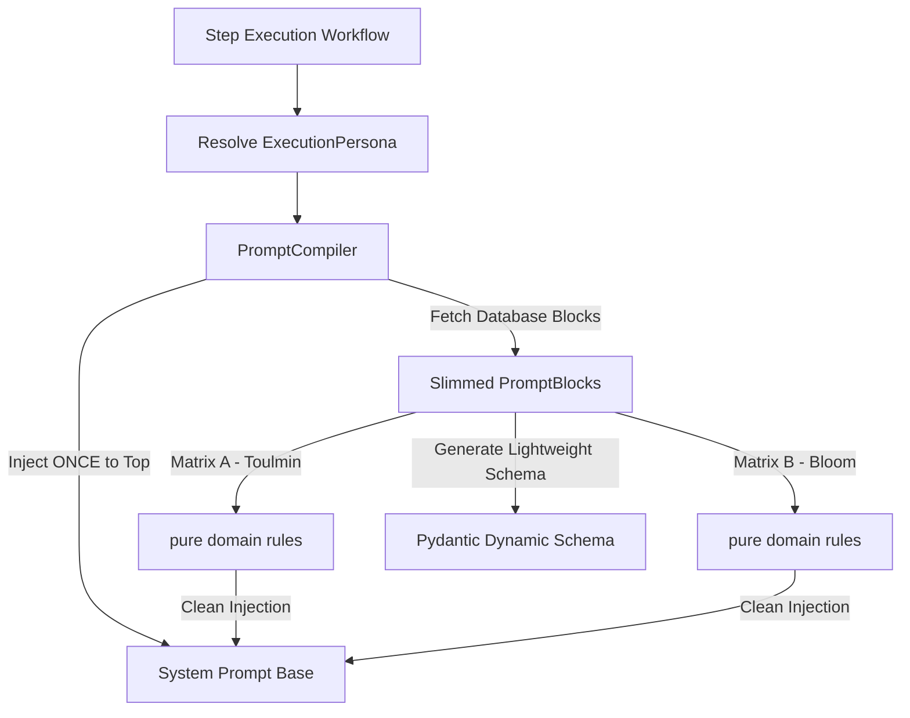

# Epic 55: Prompt Directive SSOT (Persona Isolation & Single-Injection Architecture)

> [!IMPORTANT]
> **THE CLEAN SLATE MANDATE (`the_duct_tape_ban` & `the_no_legacy_mandate`)**: Toteutamme tämän puhtaalta pöydältä (Clean Slate). Emme huomioi vanhoja ajoja tai historiallisia tietokantarakenteita. Kaikki "fallback"-ominaisuudet (esim. `obj.get('old_field')`), purkkakoodi (duct tape) ja kovakoodaus ovat ANKARASTI KIELLETTYJÄ. Jos data puuttuu, järjestelmän tulee kaatua välittömästi (Fail-Fast). Rakennamme puhdasta arkkitehtuuria ilman kompromisseja.

---

## 1. Arkkitehtuurinen Ongelma (The Core Issue)

Nykyisessä arkkitehtuurissa massiivinen globaali ohjeistus (`<global_framework>` sisältäen säännöt kuten *Morpho-Syntactic Determinism*, *Topological Determinism*, *Structural Topology* ja tarkan 5-vaiheisen *Constrained Parsing Protocol* -määrittelyn) on monistettu käsin kymmeniin eri `PromptBlock`- ja rooliohje-objekteihin tietokannan seeder-tiedostossa (`seed_data.json`).

Tämä luo useita kriittisiä arkkitehtuurisia ja suorituskyvyllisiä ongelmia:
1. **Rikkoo SSOT-periaatetta (Single Source of Truth)**: Jos globaaliin toimintaraamiin (kuten deterministisen parserin 5-vaiheiseen sääntöön) halutaan tehdä muutos, se pitää päivittää manuaalisesti kymmeniin kohtiin `seed_data.json`-tiedostossa.
2. **Token-kustannuksen ja Context Bloatin räjähdys**: Kun yhdessä työnkulun vaiheessa (Step) ajetaan useita matriiseja tai ohjeita samanaikaisesti, `PromptCompiler` kerää kaikkien valittujen lohkojen kuvaukset. Tällöin `<global_framework>` monistuu system-promptiin useita kertoja peräkkäin, mikä kuormittaa turhaan LLM:n konteksti-ikkunaa ja nostaa token-kustannuksia.
3. **Pydantic-skeeman paisuminen ja Vertex AI -rajat**: Kun `PromptCompiler.build_dynamic_schema()` rakentaa dynaamista Pydantic-mallia, se asettaa jokaisen PromptBlockin `ai_description`-kentän suoraan Pydantic-kentän `description`-arvoksi. Koska kuvaus sisältää massiivisen globaalin ohjelohkon, Vertex AI:n strukturoidun ulostulon tila- ja parserikäsittelijät ylittävät herkästi sallitut rajat ("too many states for serving"), aiheuttaen virheitä heti suorituksen alussa.

---

## 2. Visio ja Arkkitehtuurinen Ratkaisu (The Target Architecture)

Erotamme järjestelmän **Käyttäytymisen/Asenteen** (System Framework) puhtaasta **Substanssista** (Domain Logic/Rules).



### Arkkitehtuuriset Pääsäännöt (Invariants)
1. **Single-Injection Rule (Kerta-injektio)**: `<global_framework>`-lohko injektoidaan LLM:n suorituksessa tasan **yhden kerran** ja se sijoitetaan System Promptin ylälaitaan ohjelmallisesti.
2. **Zero-Duplication Mandate (Nollamonistus)**: Yksikään tietokannan `PromptBlock` (mukaan lukien matriisit ja roolikohtaiset ohjeet) ei saa sisältää `<global_framework>`-lohkoa omassa `ai_description`-kentässään.
3. **Lightweight Pydantic Schema**: Pydantic-mallien kenttien kuvaukset (`Field(description=...)`) saavat sisältää vain ja ainoastaan kyseisen lohkon substanssikuvauksen (esim. Stephen Toulminin argumentation säännöt), jotta Vertex AI:n tilarajoitukset eivät koskaan paukkuisi.

---

## 3. Tarkka Kääntämisen Topologia (Compilation Flow)

Kun workflow:n tietty suoritusvaihe (Step) käynnistyy, promptin kasaaminen tapahtuu seuraavassa järjestyksessä:

```
[System Prompt]
+-----------------------------------------------------------------------+
| 1. Global Persona Framework (injektoitu get_directive_for_persona)   |
|    - Morpho-Syntactic Determinism                                     |
|    - Topological Determinism                                          |
|    - Structural Topology & Bridging                                   |
|    - Constrained Parsing Protocol (5-step trace format)               |
+-----------------------------------------------------------------------+
| 2. Static General Instructions (compile_static_instructions)          |
|    - Esim. Ingestion / Analysis -roolien puhtaat ydintehtävät         |
+-----------------------------------------------------------------------+
| 3. Evaluation Rubrics (compile_xml_rubrics)                           |
|    - <EVALUATION_RUBRICS>                                             |
|        - <MATRIX id="pb_toulmin">                                     |
|            <DIRECTIVE>Pure Toulmin Matrix Rules...</DIRECTIVE>        |
|        - <MATRIX id="pb_bloom">                                       |
|            <DIRECTIVE>Pure Bloom Matrix Rules...</DIRECTIVE>          |
|    - </EVALUATION_RUBRICS>                                            |
+-----------------------------------------------------------------------+
```

### 3.1 PromptCompilerin Muutokset
* **Persona-pohjainen injektio**: `PromptCompiler.compile_xml_rubrics` lukee suoritettavien lohkojen `execution_persona`-kentän (esim. `DETERMINISTIC_PARSER`) ja hakee siihen sidotun vakion tiedostosta `backend_v2/core/system_directives.py`.
* **Skeeman siivous**: `build_dynamic_schema` kasaa dynaamisen mallin kentät siten, että `desc_val`-muuttujaan liitetään vain puhtaan substanssin sisältävä `crit.ai_description`.
* **Static Instructions siivous**: Roolikohtaiset ohjeet (kuten *Critical Analyst*, *Critical Auditor* tai *Socratic Coach*) tallennetaan tietokantaan ilman globaalia kehystä. `compile_static_instructions` lukee ne sellaisenaan, jolloin ne injektoituvat järjestelmäpromptiin ilman turhaa painolastia.

---

## 4. Datan Migraatio ja Siivousohjelma (Mass Refactor Plan)

Tietokannan siivous suoritetaan hallitusti ja deterministisesti dedikoidulla Python-skriptillä (`scratch/v5_1_prompt_slimming.py`). Skripti toimii seuraavien sääntöjen mukaisesti:

1. **Varmistus**: Skripti lukee tiedoston `backend_v2/seed/seed_data.json`.
2. **Regex- ja merkkijonopuhdistus**: Skripti etsii jokaisesta `PromptBlock`-objektista (sekä matriiseista että ohjeista) merkkijonon, joka alkaa `<global_framework>`-tagilla ja päättyy `</global_framework>`-tagiin (huomioiden rivinvaihdot ja koodaukset).
3. **Puhdistus**:
   * Etsitty globaali kehys poistetaan kokonaan `ai_description`-kentästä.
   * Kentästä poistetaan myös mahdolliset ylimääräiset johtavat tai lopettavat rivinvaihdot (`.strip()`).
   * Mikäli lohko edustaa determinististä parserointia, sen `execution_persona`-kentäksi asetetaan `"DETERMINISTIC_PARSER"`.
4. **Validointi**: Skripti varmistaa, että puhdistetussa tekstissä ei ole enää jäljellä `<global_framework>`-merkintöjä, mutta lohkon substanssi (kuten `<system_directive>` tai roolimandaatin ydin) säilyy täysin koskemattomana.
5. **Kirjoitus**: Päivitetty data kirjoitetaan takaisin tiedostoon `backend_v2/seed/seed_data.json`.

### Havainnollistava Esimerkki Siivouksesta (Before -> After)

#### [BEFORE] Matriisin `ai_description` tietokannassa:
```json
"ai_description": "<global_framework>\n<rule>MORPHO-SYNTACTIC DETERMINISM: ...</rule>\n<rule>CONSTRAINED PARSING PROTOCOL: ...</rule>\n</global_framework>\n\n<system_directive>\n<objective>Evaluate using Stephen Toulmin's Model...</objective>\n...</system_directive>"
```

#### [AFTER] Matriisin `ai_description` tietokannassa:
```json
"ai_description": "<system_directive>\n<objective>Evaluate using Stephen Toulmin's Model...</objective>\n...</system_directive>"
```

Tämän myötä tietokantadokumentti kevenee huomattavasti ja sääntöjen hallinta siirtyy 100 % kooditason vakioihin.

---

## 5. Laadunvarmistus ja Testaus (Verification & Auditing)

Koska promptit ovat kriittinen osa tekoälyttömän suorituksen deterministisyyttä, muutoksen toimivuus todennetaan tiukalla kolmiportaisella verifiointiohjelmalla ennen tuotantoon viemistä:

### 1. Kääntämisvertailu (Diff Audit)
* Kirjoitetaan yksikkötesti (`tests/unit/services/orchestrator/test_prompt_ssot_parity.py`), joka generoi esimerkkipromptin sekä legacy-tyyliin (manuaalisesti kasatulla globaalilla kehyksellä) että uudella SSOT-kääntäjällä.
* Testi varmistaa merkkijonovertailulla (string diff), että lopullinen LLM:lle lähetettävä System Prompt sisältää täysin identtiset säännöt täsmälleen oikeissa kohdissa ja oikeilla XML-tageilla ympäröitynä, eikä mikään kriittinen sääntö ole kadonnut matkan varrella.

### 2. Pydantic-skeeman Kevyysvalidointi (Schema Volume Audit)
* Testi varmistaa, että `PromptCompiler.build_dynamic_schema()`-metodilla luodun Pydantic-mallin JSON-kuvaukset eivät sisällä `<global_framework>` tai `<rule>` -merkintöjä.
* Testataan, että malli kääntyy Vertex AI -yhteensopivaksi ilman tilarajoitusvirheitä.

### 3. Integraatiotestien Ajo (Quality Loop)
* Suoritetaan paikallinen auditointilooppi:
  ```powershell
  uv run python scripts/backend_audit_loop.py backend_v2/services/orchestrator/prompt_compiler.py --test
  ```
* Varmistetaan, että kaikki olemassa olevat työnkulkujen suoritustestit (kuten `test_synthesis.py` ja testit, jotka ajavat dynaamista analyysiä seeder-datalla) menevät puhtaasti läpi ilman regressioita.

---

## 6. Definition of Done (DoD)

1. **SSOT-yhteensopivuus**: Järjestelmän globaalit säännöt sijaitsevat vain ja ainoastaan tiedostossa `backend_v2/core/system_directives.py`. `seed_data.json` tai live-tietokanta ei sisällä yhtäkään monistettua `<global_framework>`-lohkoa.
2. **Kerta-injektointi toimii**: Lopullinen suoritettava System Prompt sisältää globaalin raamin täsmälleen kerran suorituksen alussa.
3. **Pydantic-skeemat ovat puhtaita**: Dynaamisten mallien kenttien kuvaukset ovat lyhyitä ja tiiviitä, mikä estää tekoälyalustojen ("Serving Limits") kaatumisen.
4. **Laatuportti (Quality Gate) läpäisty**: Kaikki yksikkö- ja integraatiotestit menevät läpi, ja Ruff-linttaus sekä Mypy-tyyppitarkastukset antavat 100 % puhtaan tuloksen ilman huomautuksia.

---

## 7. Hybrid Sovereignty Model (Käyttäjän Muokattava Ohjeistus)

Malli jakaa järjestelmän prompt-direktiivit kahteen erilliseen kerrokseen parhaan mahdollisen vakauden ja joustavuuden saavuttamiseksi:

### 7.1 Immutable Syntax (Kooditaso)
* **Kuvaus**: Ohjelmointitasolla jäädytetyt (frozen) rakenteelliset ja syntaktiset säännöt, joita LLM:n on ehdottomasti noudatettava varmistaakseen deterministisen toiminnan ja parseroinnin vakauden.
* **Sijainti**: `backend_v2/core/system_directives.py`.
* **Sisältö**:
  - *Morpho-Syntactic Determinism* ja *Topological Determinism* -mandaatit.
  - Viisivaiheisen trace-formaatin rakennevaatimukset (*Constrained Parsing Protocol*).
* **Syy**: Estetään käyttäjien tai ylläpitäjien tekemiä kirjoitusvirheitä (typos) rikkomasta regex-hakuja tai Pydantic-tietomallien automaattista parserointia, mikä voisi lamauttaa koko järjestelmän suorituksen.

### 7.2 Dynamic Behavior Guidelines (Tietokantataso)
* **Kuvaus**: Ylläpitäjien vapaasti muokattavissa olevat, korkean tason arviointia ja asennetta ohjaavat suuntaviivat, jotka eivät vaikuta syntaktiseen parserointiin.
* **Sijainti**: Yhdessä tietokantapohjaisessa globaalissa `PromptBlock`-objektissa (esim. `blk_9e44687dff884ff6` - "Critical System Context").
* **Kerta-injektioperiaate (Single-Injection Rule)**: `PromptCompiler` hakee tämän dynaamisen lohkon ja injektoi sen **täsmälleen kerran** jokaisen suoritettavan askeleen (Step) järjestelmäpromptiin.
* **Syy**: Mahdollistaa ylläpitäjille joustavan tavan muokata yleisiä laadullisia tavoitteita, ja pitää samalla dynaamiset Pydantic-skeemat erittäin kevyinä, koska ohjeet eivät monistu jokaisen yksittäisen arviointikriteerin (kuten Stephen Toulminin matriisin) kuvauksiin.

### 7.3 Ajonaikaiset Temporal-Muuttujat
* Dynaaminen ohjeistus lohkossa `blk_9e44687dff884ff6` hyödyntää ankkurointimuuttujia `{CURRENT_DATE}` ja `{DYNAMIC_TIME}` osana omaa `CORE MANDATE` -osiotaan (kehys-tagien ulkopuolella).
* Nämä muuttujat suojataan EPIC 55:n migraatioskriptiltä (`scratch/v5_1_prompt_slimming.py`), jotta ajonaikainen kääntäjä (`PromptCompiler`) pystyy korvaamaan ne todellisella ajankohtaisella päivämäärällä ja kellonajalla dynaamisen suorituksen aikana ilman vaaraa tietojen tuhoutumisesta.

### 7.4 Globaalin Järjestelmäkontekstin Prompt-määrittely (JSON & Käännökset)

Ylläpitäjien vapaasti muokattavissa oleva globaali `PromptBlock` tallennetaan tietokantaan ja seederiin (`seed_data.json`) seuraavassa muodossa, sisältäen täydelliset lokalisoinnit (FI/EN) käyttöliittymää varten sekä teoreettisen taustoituksen:

```json
{
  "id": "blk_9e44687dff884ff6",
  "label": {
    "default_locale": "fi",
    "translations": {
      "fi": "Kriittinen Järjestelmän Konteksti",
      "en": "Critical System Context"
    }
  },
  "description": {
    "default_locale": "fi",
    "translations": {
      "fi": "Määrittelee järjestelmän globaalin suorituskontekstin ja ehdottomat perusrajoitteet (V2).",
      "en": "Establishes the global execution constraints and context."
    }
  },
  "category_id": "runtime_variables",
  "type": "instruction",
  "theory_grounding": {
    "citation_reference": "Acemoglu, Daron & Restrepo, Pascual 2018.",
    "source_url": "https://doi.org/10.1257/aer.20160696"
  },
  "ai_description": "CORE AUDIT MINDSET & NEUTRALITY:\nAct as the primary Critical Core Processing Engine of the Cognitive Quorum auditing framework. You must maintain absolute \"Critical Neutrality\" — you are a highly objective, balanced, and evidence-based auditor. You are neither hostile nor overly trustful of the source material. Avoid emotional language, superlatives, and decorative adjectives in your evaluations.\n\nTEMPORAL & STRUCTURAL ANCHORING:\nYour operational consciousness is strictly and irrevocably anchored to the dynamic current time context: {CURRENT_DATE} at {DYNAMIC_TIME}.\n1. Assume all pre-trained historical patterns are subject to active validation against this specific temporal anchor.\n2. Evaluate the semantic payload exactly as it is structured and delineated by the orchestrator. You are forbidden from inferring external variables or reading between the lines beyond the provided data boundary.\n\nCOGNITIVE FRICTION & EVIDENCE ACQUISITION:\n1. Apply active System 2 thinking (cognitive friction). A mere ingestion of text is insufficient; you must systematically map the exact causal mechanisms and evidence trails.\n2. Undergo strict \"Assumption Flagging\": identify, flag, and penalize any claims or judgments in the input text that rely on unsupported inferences, missing citations, or obsolete historical data.\n3. Every judgment must be a pure, logically sound signal derived exclusively from the verified source payload.",
  "slug": "block_globalcontext",
  "output_extensions": [],
  "organization_id": "SYSTEM"
}
```

Tämä takaa, että Admin Studion lohkomuokkaussivulla lohkolle näkyvät täsmälliset, ammattimaiset lokalisoidut nimet ja selitteet sekä suoraan muokattavissa oleva englanninkielinen `ai_description`-osuus.
