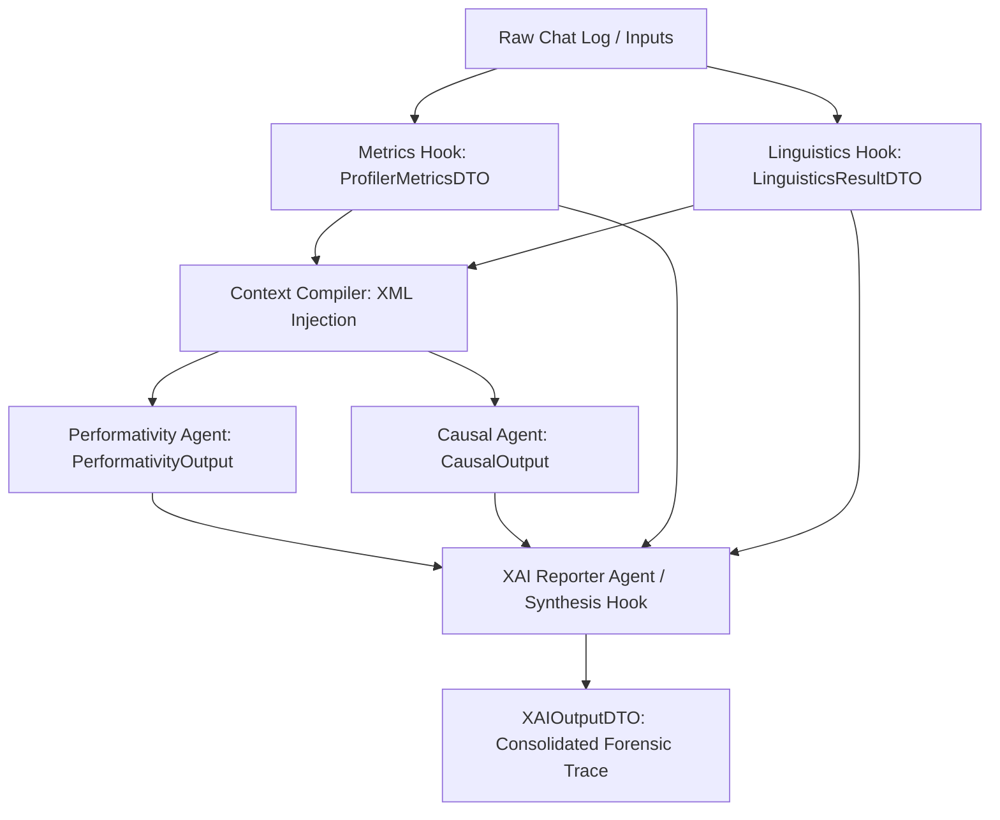

# Epic 57: XAI Reasoning Trace Consolidation (Mekaanisen ja Kognitiivisen Päättelyn Integraatio)

> [!IMPORTANT]
> **THE CLEAN SLATE & TRIPARTITE BOUNDARY MANDATE**: Toteutamme tämän Epicin ilman purkkakoodia (No Duct-Tape) ja tiukasti Pydantic V2 -malleja noudattaen. Kaikki mekaaniset laskennat ja lingvistiset havainnot pidetään deterministisinä "totuusankkureina" (Truth Anchors), jotka toimivat vastapainona (Dampener) LLM-agenttien kognitiivisille arvioille. Mitään UI-esitysmuotoiluja (kuten valmiita Markdown-taulukoita) ei kovakoodata backend-malleihin; backend tuottaa vain puhdasta, tyypitettyä DTO-rakenteista dataa, ja Flutter-client sekä PDF-generaattori vastaavat esityksestä.

---

## 1. Yhteenveto ja Tavoite (Objective)

Tämän Epicin tavoitteena on yhdistää Quorum-järjestelmän **deterministiset mekaaniset esikoukut** (`metrics.py`, `linguistics.py`) ja **laadulliset semanttiset asiantuntija-agentit** (`causal.py`, `performativity.py`) yhdeksi koherentiksi **Explainable AI (XAI) -päättelyketjuksi** (`XAIOutputDTO`).

### Nykytilan Ongelma:
Nykytilassa mekaaniset arvot (kuten `ProfilerMetricsDTO` ja `LinguisticsResultDTO`) lasketaan nopeasti Python-pohjaisissa esikoukuissa, mutta semanttiset asiantuntija-agentit (Causal Analyst ja Performativity Detector) tekevät päätelmänsä erillisissä DAG-vaiheissa ilman suoraa, strukturoitua pääsyä näihin numeerisiin ja lingvistisiin faktoihin. 
* Tämä johtaa **semanttiseen tyhjiöön**, jossa LLM-agentti voi hallusinoida tai yliarvioida performatiivisuutta/kausaalisuutta, vaikka mekaaniset totuusankkurit osoittaisivat muuta.
* Loppukäyttäjälle (Flutter SDUI) päättelyketju näyttäytyy pirstaleisena, koska mekaaniset metriikat ja asiantuntijoiden päättelyjäljet (Reasoning Traces) eivät keskustele keskenään.

### Tavoite:
Rakentaa neliportainen (4-Tier) integraatioputki, joka:
1. Groundaa (ankkuroi) LLM-agenttien päättelyn mekaanisiin mittauksiin lennossa.
2. Konsolidoi mekaaniset ja kognitiiviset strukturoidut vastaukset yhtenäiseen `XAIOutputDTO`-malliin.
3. Laskee ristiinvertailun avulla mekaanisen todellisuuden ja kognitiivisen arvion välisen varianssin (**Mechanical-Cognitive Variance**), paljastaen automaatioharhat (Automation Bias) ja mallien mielistelyn (Sycophancy).

---

## 2. Arkkitehtuurinen Integraatiomalli (4-Tier Pipeline)

Integraatio toteutetaan siistinä Y-Funnel- ja DAG-pohjaisena tietovuona ilman välikäsien mutaatioita:



### Taso 1: Syötteen Valmistelu (Mechanical Input Layer)
* Deterministiset pre-hookit `calculate_text_metrics` ja `detect_performative_patterns` ajetaan heti suorituksen alussa.
* Ne tuottavat `profiler_metrics` (sanakohtaiset metriikat, `say_do_gap`, `automation_bias`) ja `linguistics_result` (havaitut performatiiviset täytesanat ja fraasi-ID:t) `HookState`-kontekstiin.

### Taso 2: LLM Päättelyn Ohjaus (Cognitive Agent Grounding Layer)
* `PromptCompiler` poimii `HookState`-muuttujat ja injektoi ne XML-rakenteina **Performativity Detector**- ja **Causal Analyst** -agenttien system-prompteihin:
  ```xml
  <mechanical_anchors>
    <text_metrics>
      <word_count>{word_count}</word_count>
      <say_do_gap>{say_do_gap}</say_do_gap>
      <automation_bias>{automation_bias}</automation_bias>
    </text_metrics>
    <detected_performative_phrases>
      <phrase_count>{phrase_count}</phrase_count>
      <items>
        {detected_phrases}
      </items>
    </detected_performative_phrases>
  </mechanical_anchors>
  ```
* Tämä pakottaa LLM-agentit perustamaan arvionsa (kuten `authenticity_score` ja `plausibility_numeric`) näihin kiistattomiin faktoihin.

### Taso 3: Tripartite-Ristiinvertailu (Alignment & Dampening Layer)
* Luodaan uusi ohjelmallinen backend-validointisääntö tai matemaattinen apuri (`variance_engine.py`), joka laskee **Mekaanisen ja Kognitiivisen Varianssin** (Mechanical-Cognitive Variance):
  $$\text{Variance} = | \text{LLM Authenticity Score} - (3.0 - \text{Normalized Performative Count}) |$$
  * Jos LLM antaa korkean aitousarvosanan (lähellä 3.0), vaikka mekaaninen lingvistiikka on havainnut 10+ tyhjää performatiivista täytesanaa, varianssi kasvaa, ja järjestelmä tuottaa automaattisen kognitiivisen poikkeamahälytyksen (`CognitiveMismatchWarning`).

### Taso 4: XAI Synteesi (Unified XAI Output Layer)
* `XAIReporterAgent` syntetisoi kaikki neljä lähdettä ja täyttää päivitetyn `XAIOutputDTO`-mallin:
  * `executive_summary`: Yhdistetty sanallinen analyysi metriikoista ja laadullisesta päättelystä.
  * `cognitive_behavior`: Groundattu performatiivisuusanalyysi, joka linkittää LLM:n havainnot suoraan `LinguisticsResultDTO`-fraaseihin.
  * `causal_chain`: Groundattu kausaalisuusanalyysi, joka peilaa counterfactual-päättelyä mekaanista `say_do_gap`-metriikkaa vasten.
  * `output_extensions`: Laajennetaan polymorphic-listaa uudella `VarianceValidationExtension`-tyypillä, joka kuljettaa ristiinvertailun numeeriset tulokset suoraan käyttöliittymälle.

---

## 3. Pydantic-tason Mallimuutokset (Proposed Schema Evolution)

### 3.1. `XAIOutputDTO` Laajennus (`backend_v2/models/domain/xai.py`)
Tuodaan uusi polymorfinen XAI-laajennustyyppi `VarianceValidationExtension`, joka täyttää Fail-Fast Pydantic V2 -vaatimukset ilman löysiä tyyppejä tai fallbackeja:

```python
class VarianceValidationExtension(V2CoreBase):
    extension_type: Literal[XaiExtensionType.VARIANCE_VALIDATION] = XaiExtensionType.VARIANCE_VALIDATION
    mechanical_metric_ref: str = Field(..., description="Reference to the mechanical metric key used.")
    cognitive_metric_ref: str = Field(..., description="Reference to the cognitive agent score key used.")
    variance_score: float = Field(..., description="Calculated absolute variance between mechnical and cognitive assessments.")
    alignment_verdict: str = Field(..., description="Abstract verdict (e.g., 'ALIGNED', 'MISALIGNED_SYCOPHANCY').")
```

Tämä tyyppi lisätään `XAIExtension` -Annotated-unioniin, jolloin se on suoraan Flutter-clientin hyödynnettävissä ilman API-rikkoja.

### 3.2. `XAIReporterInput` Groundaus
Päivitetään `XAIReporterInput` sisältämään mekaanisten koukkujen tulokset eksplisiittisinä kenttinä, poistaen `dynamic_inputs`-hämärän:

```python
class XAIReporterInput(V2CoreBase):
    chat_log: str = Field(..., description="Mandatory conversation history.")
    step_metrics: ProfilerMetricsDTO | None = Field(default=None, description="Mechanical text and behavioral metrics.")
    step_linguistics: LinguisticsResultDTO | None = Field(default=None, description="Mechanical linguistic patterns.")
    step_causal_analyst: CausalOutput | None = Field(default=None, description="Cognitive causal output.")
    step_performativity: PerformativityOutput | None = Field(default=None, description="Cognitive performativity output.")
```

---

## 4. Toteutusvaiheet (Implementation Phases)

### Phase 1: Domain-mallit ja Validointi (Hardening backend)
* **Toimenpide 1:** Luodaan/päivitetään `backend_v2/models/domain/xai.py` sisältämään `VarianceValidationExtension` ja päivitetty `XAIReporterInput`.
  * **Sääntövarmistus [strict_pydantic_v2_rust & cross_language_enum_parity]**: Uusi `VarianceValidationExtension` noudattaa Pydantic V2 `ConfigDict(extra='forbid', strict=True)` -tiukkuutta. Lisäksi uusi `XaiExtensionType.VARIANCE_VALIDATION` -enum-arvo on lisättävä tiedostoon `backend_v2/models/enums.py` ja mäpättävä tiedostoon `client_app_v2/lib/core/models/enums.dart`. Aja `test_enum_parity.py` varmistaaksesi pariteetin.
* **Toimenpide 2:** Luodaan `backend_v2/utils/scoring/variance_engine.py`, joka sisältää matemaattisen ristiinvertaavan logiikan.
  * **Sääntövarmistus [strict_math_display_isolation]**: Laskenta on puhtaasti numeerista ja erotettua visualisoinnista. Erotetaan sisäinen matemaattinen analyysi ja dynaamiset display-rajat toisistaan SSOT-periaatteella.
* **Toimenpide 3:** Varmistetaan, että kaikki muutokset noudattavat strict Pydantic V2 -malleja (`ConfigDict(extra='forbid', strict=True)`).

### Phase 2: Orchestrator ja Prompt-Groundaus
* **Toimenpide 1:** Muokataan `backend_v2/services/orchestrator/strategies/llm.py` (tai kyseinen suoritusstrategia) syöttämään mekaaniset metriikat `PromptCompilerille`.
  * **Sääntövarmistus [prompt_compiler_immutability]**: `PromptCompiler` on suojattu ydinkomponentti. Älä muokkaa `prompt_compiler.py`-tiedostoa, vaan välitä muuttujat sen olemassa olevien rajapintojen kautta.
* **Toimenpide 2:** Päivitetään Performativity Detector- ja Causal Analyst -matriisien `ai_description`-prompteja `seed_data.json`-tiedostossa tukemaan uusia XML-pohjaisia mekaanisia ankkureita.
  * **Sääntövarmistus [cross_language_mapping_mandate & hybrid_prompting_mandate]**: Järjestelmäohjeet ja matriisisäännöt pidetään 100 % englanninkielisinä, ja LLM ohjeistetaan kääntämään ja soveltamaan niitä kohdekieleen lennossa. Kaikki syötteet aidataan XML-tageilla.
* **Toimenpide 3:** Ajetaan `run_seed.py local` uusien matriisiversioiden viemiseksi kantaan.
  * **Sääntövarmistus [direct_database_mutation]**: Kehityskantaa ei muokata koskaan suoraan, vaan muutokset tehdään siemenajolla `seed_data.json`-tiedoston kautta.

### Phase 3: XAI Reporter-agentin Päivitys
* **Toimenpide 1:** Muokataan `XAIReporterAgent`-toteutusta lukemaan uudet `step_metrics` ja `step_linguistics` syötteet.
  * **Sääntövarmistus [llm_structured_execution_mandate]**: Agentti suoritetaan `LLMTaskExecutor.execute_structured_task()` -metodilla, pakottaen Pydantic DTO -rakenteisen ulostulon ilman omia regex-hakkereita.
* **Toimenpide 2:** Syntetisoidaan nämä arvot `XAIOutputDTO`-raportin tekstikenttiin (`cognitive_behavior` ja `causal_chain`), jolloin loppuraportissa viitataan suoraan mekaanisiin lukuihin.
  * **Sääntövarmistus [native_english_generation_mandate]**: Päättely ja laadullinen synteesi tuotetaan mallissa englanniksi ja käännetään kääntäjäkoukulla (`translation_hook`) matalan latenssin passissa kohdekielelle.
* **Toimenpide 3:** Lasketaan varianssit lennossa ja lisätään ne `output_extensions`-listaan.

### Phase 4: Frontend (Flutter UI) ja PDF-Pariteetti (PDF-First Alignment)
* **Toimenpide 1:** Päivitetään Flutterin XAI-näkymä renderöimään uusi `VarianceValidationExtension` visuaalisena mittarina (esim. "Mekaaninen vs. Kognitiivinen tasapaino" -indikaattori), joka noudattaa PDF-raportin staattista asettelua.
  * **Sääntövarmistus [no_string_l10n & no_string_mandate]**: Kaikki käyttöliittymätekstit, otsikot ja lokalisoinnit viedään yksinomaan Flutterin `.arb`-kielitiedostoihin, ei kovakoodattuina merkkijonoina koodiin.
* **Toimenpide 2:** Päivitetään PDF-generaattorin Jinja2-raporttimalli näyttämään groundatut päättelyketjut ilman esityslogiikan vuotoa backendin puolelle, asettaen staattisen A4-asettelun visualisoinnin ensisijaiseksi standardiksi.
  * **Sääntövarmistus [tripartite_rendering_boundary]**: Backend ei tuota valmiita Markdown-taulukoita tai HTML-komponentteja, vaan välittää pelkkää puhdasta strukturoitua dataa. Visualisoinnista ja renderöinnistä vastaavat itsenäisesti esityskerroksen toteutukset (Flutter ja Jinja2 PDF).


---

## 5. Tulosten Tulkinta ja Käyttäytymisanalyysi (Interpretation)

Mekaanisen datan ja laadullisen LLM-arvioinnin ristiinvertaaminen ratkaisee useita kriittisiä kognitiivisia ja laadullisia haasteita:

1. **Kognitiivinen Varianssi (Cognitive Mismatch & Sycophancy):**
   * Paljastaa LLM-agenttien taipumuksen antaa liian optimistisia tai mielisteleviä arvioita (*sycophancy*). Jos performatiivisuusagentti antaa korkean aitousarvon (esim. `authenticity_score` = 2.9 / 3.0), mutta lingvistinen analyysi löytää 12 täytesanaa ja fraasia, syntyy poikkeamahälytys (`CognitiveMismatchWarning`).
2. **Automaatioharha ja kognitiivinen kontrolli (Automation Bias):**
   * Kertoo, kuinka itsenäisesti ihminen toimii suhteessa tekoälyyn. Jos mekaaninen `input_control_ratio` on erittäin matala (esim. 0.05, eli ihminen kirjoittaa hyvin vähän) ja `automation_bias` on tosi (`true`), ihminen on luovuttanut ohjat kokonaan tekoälylle, mikä nostaa prosessin riskitasoa.
3. **Groundattu ja todennettava päättelyjälki (Forensic Traceability):**
   * Varmistaa, että XAI-raportin sanalliset johtopäätökset (esim. kiireellinen tai mekaaninen päätöksenteko) perustuvat aina kiistattomaan mekaaniseen dataan (kuten `imperative_command_count` > 5 ja keskimääräinen lausepituus < 3 sanaa).

---

## 6. Tulosten Visuaalinen Esittäminen ja Pariteetti (Tripartite & PDF-First Parity)

Quorumin **Tripartite Rendering Boundary** -linjauksen mukaisesti backend ei koskaan renderöi tai tuota valmista esitysmuotoilua (kuten valmiita HTML- tai Markdown-taulukoita). Esitys jaetaan kolmeen erilliseen, pariteetin ylläpitävään kerrokseen puhtaasta DTO-datasta.

Visuaalista suunnittelua ohjaa ehdoton **PDF-First-suunnittelufilosofia** ("PDF-ehdoilla meneminen"). Koska tulostettu staattinen A4-raportti asettaa tiukimmat spatiaaliset ja toiminnalliset rajoitteet (ei dynaamista skrollausta, ei interaktiivisia painikkeita, kiinteä leveys), **PDF:n asettelu, värit ja rakenteet sanelevat myös Flutter-käyttöliittymän vastaavien komponenttien perusratkaisut**. Tämä takaa, että tulostettu raportti ja Flutter-sovellus ovat visuaalisesti ja sisällöllisesti mahdollisimman yhteneviä.

### A. Variance Gauge (Mekaaninen vs. Kognitiivinen Tasapaino)
* **PDF-tulosteessa (Staattinen A4-ehto):** Renderöidään premium-luokan staattisena korttina ("Mechanical vs Cognitive Axis Card"), jossa on kiinteä kaksiakselinen jana (Gauge). Jana osoittaa laskennallisen varianssin värillisellä ilmaisimella ja selkeillä kynnysarvoilla. A4-leveydelle optimoitu asettelu estää tekstien tai indikaattoreiden katkeamisen.
* **Flutter-käyttöliittymässä (Dynaaminen peilaus):** Peilaa täysin PDF-kortin visuaalista tyyliä, värejä ja layoutia, jotta käyttäjä tunnistaa elementin välittömästi. Lisää käyttökokemusta parantavan hienovaraisen liukumanimaation (micro-animation) ja interaktiiviset tooltip-lisätiedot, kun varianssia tarkastellaan dynaamisesti.

### B. Linguistic Phrase Highlighting (Lingvistinen Korostus)
* **PDF-tulosteessa (Staattinen A4-ehto):** Havaitut performatiiviset täytesanat ja fraasit korostetaan suoraan staattisen A4-keskustelulokin tekstivirrassa (inline highlighting) tyylikkäillä, kevyillä korostusväreillä (subtle background highlights/badges) ja viitenumeroilla, jotka osoittavat lingvististen sääntöjen ID-koodit.
* **Flutter-käyttöliittymässä (Dynaaminen peilaus):** Käyttää täsmälleen samoja korostusvärejä ja inline-tyylejä kuin PDF:ssä pariteetin varmistamiseksi, mutta tuo mukanaan dynaamisen interaktiivisuuden: klikkaamalla korostettua sanaa tai lingvististä elementtiä käyttöliittymä skrollaa pehmeästi tai avaa interaktiivisen overlay-työkaluvihjeen (tooltip), joka näyttää mekaanisen säännön ja kognitiivisen arvion ristiinvertailun.

### C. Behavioral Flags (Käyttäytymisprofiilin Huomiokortit - `say_do_gap`, `automation_bias` jne.)
* **Molemmat kanavat (PDF & Flutter):** Renderöidään identtisessä asettelujärjestyksessä ja täsmälleen samalla premium-tason semanttisella värikoodauksella (oranssi/keltainen/punainen huomioväri riippuen poikkeaman kriittisyydestä).
* **PDF-tulosteessa (Staattinen A4-ehto):** Renderöidään staattisina, siististi tasattuina huomiokortteina, jotka sijoittuvat sivurajoja rikkomatta.
* **Flutter-käyttöliittymässä (Dynaaminen peilaus):** Peilaa samaa korttirakennetta tarjoten interaktiivisen tavan kuitata tai suodattaa lokitietoja dynaamisen tilanhallinnan kautta.

### D. Raakadatat ja forensic-lokit (Admin Studio Debugging)
* **JSON Inspection Block:** Ylläpitäjille ja auditoijille tarjotaan suora, muuttumaton JSON-näkymä `XAIOutputDTO`-oliosta, mikä takaa 100 % läpinäkyvyyden päättelyketjun forensic-tietoihin.

---

## 7. Definition of Done (DoD)

1. **Tyyppiturvallisuus (Pydantic V2):** Kaikki uudet integraatiokentät ja laajennukset (Extensions) menevät läpi Pydantic-validoinnista ilman fallback-arvoja tai löysiä sanakirjoja noudattaen **[strict_pydantic_v2_rust]** -sääntöä.
2. **Katalyyttinen Groundaus:** Performativity- ja Causal-agentit hyödyntävät deterministisiä metriikoita in-context-prompteissaan, mikä voidaan todentaa suoritusaikaisista logeista (`backend_debug.log`). Prompteissa noudatetaan **[cross_language_mapping_mandate]** ja **[hybrid_prompting_mandate]** -vaatimuksia.
3. **Nolla-mutaatio persistenssissä:** Historiallinen `seed_data.json` tai suoritusaikainen tietokanta ei korruptoidu; uusi päättelyketju kulkee puhtaasti in-memory DAG-tilassa ja tallentuu virallisena suorituslokina. Muutokset sääntöihin siemennetään vain **[direct_database_mutation]** -säännön mukaisesti.
4. **Laatuportti (Quality Gate):** Kaikki olemassa olevat ja uudet unit-testit menevät läpi puhtaasti **[testing_and_verification_mandate]** -säännön mukaisesti:
   ```powershell
   uv run python scripts/backend_audit_loop.py backend_v2/models/domain/xai.py --test
   ```
5. **Esityskerroksen Eristys [tripartite_rendering_boundary]:** Backend ei tuota valmiiksi muotoiltuja käyttöliittymäkomponentteja tai Markdown-taulukoita ristiinvertailusta, vaan ainoastaan numeeriset varianssit ja kategoriset alignment-päätökset DTO-rakenteissa.
6. **PDF-First Pariteetti (PDF-First Fidelity & Parity):** PDF-generaattorin Jinja2-raportti ja Flutter-käyttöliittymä peilaavat toisiaan visuaalisesti ja rakenteellisesti (kuten asettelun ja semanttisen värikoodauksen osalta). Kaikki dynaamiset/interaktiiviset elementtilisäykset Flutterissa on suunniteltu staattisen A4-PDF:n asettamien rajoitteiden ("PDF-ehdot") puitteissa ja peilaavat PDF:n premium-ulkoasua.
7. **Monikielisyyden ja Rajojen Ylläpito [cross_language_enum_parity & native_english_generation_mandate]:** Uusi `VarianceValidationExtension` ja `XaiExtensionType` on mäpätty pariteetissa Dart-enumeihin. Kognitiiviset analyysit generoidaan natiivisti englanniksi ja käännetään erillisenä passina, ja käyttöliittymän tekstit noudattavat **[no_string_l10n]** -sääntöä `.arb`-tiedostojen kautta.

