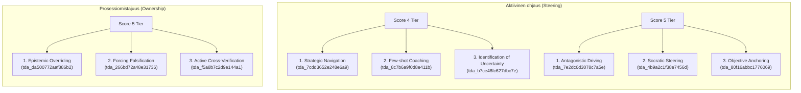

# Epic 58: Human-Centric Steering Evaluation (Option A)

> [!IMPORTANT]
> **THE CLEAN SLATE MANDATE (`the_duct_tape_ban` & `the_no_legacy_mandate`)**: Toteutamme tämän arkkitehtuurisen muutoksen puhtaalta pöydältä (Clean Slate). Vanhoja historiallisia tietokanta-ajoja ei tueta takautuvasti, eikä fallbacks-rakenteita (kuten `obj.get('old_field')`) sallita. Mikäli tarvittava data puuttuu tai on korruptoitunut, järjestelmän tulee kaatua välittömästi (Fail-Fast). Uudet TDA-väitesäännöt kirjoitetaan tiukasti englanniksi, ja tulosten suomenkieliset visualisoinnit integroidaan suoraan olemassa oleviin matriiseihin.

## 1. Yhteenveto ja Tavoite (Objective)

Tämän Epicin tavoitteena on suunnata Quorum-arviointimoottorin diagnostiikka ja kognitiivinen arviointi vahvemmin **ihmisen tekemään aktiiviseen ohjaukseen ja päätöksenteon omistajuuteen** ("driving" vs "riding" the AI). Pelkän tekoälyn suorituskyvyn tai luotettavuuden mittaamisen sijaan järjestelmä auditoi, miten tehokkaasti ihminen ohjaa tekoälyä, tunnistaa epävarmuuksia ja ristiintarkastaa tuotettuja tuloksia.

Käyttäjän asettaman tiukan reuna-ehdon mukaisesti **emme luo uutta matriisilohkoa** (No New Matrix Block). Sen sijaan käytämme **Vaihtoehtoa A (Substitution of Claims)**, jossa olemassa olevista matriiseista korvataan passiivisemmat tai vähemmän käytetyt väitteet (claims) uusilla aktiivista ihmisohjausta arvioivilla väitteillä tasoilla 4 ja 5.

Tämä linjaus säilyttää jokaisessa matriisitasossa **tasan 3 väitettä** (Exactly 3 Claims per Score Level), mikä takaa:
* Riverpod-tilanhallinnan ja JSON-skeemojen absoluuttisen vakauden.
* Pisteytysmoottorin matemaattisten ääriarvojen (1–5 asteikot) säilymisen ilman jako-nolla- tai skaalausvirheitä.
* Täyden yhteensopivuuden olemassa olevien käyttöliittymäkomponenttien (SDUI) kanssa.

---

## 2. Korvattavat Väitteet ja TDA-Määritykset

Toteutamme väitteiden korvaukset suoraan `backend_v2/seed/seed_data.json` -tietokantapohjaan. Uudet TDA-säännöt (`ai_rule_description`) on määritelty puhtaasti englanniksi, ja ne hyödyntävät suomenkielisiin ohjausrakenteisiin ankkuroituja syntaktisia sääntöjä (Syntactic Anchors).



### A. Matriisi: Aktiivinen ohjaus (`blk_53f32679aa514fcb`)

#### Score 4 (Claim 2 Replacement)
* **Vanha Väite**: "Rajaehtojen käsittely" / "Boundary Integration" (`tda_a2d1fa749b77d3de`)
* **Uusi Väite**: "Few-shot-ohjaus esimerkeillä" / "Few-shot Coaching"
* **Uusi TDA ID**: `tda_8c7b6a9f0d8e411b`
* **AI Rule Description (English)**:
  ```text
  REQUIRED TARGET: Scan ONLY the Target Data.
  STEP 1 (Syntactic Anchor): Find examples or model structures provided by the user (e.g., 'Esimerkki:', 'Kuten tässä:', 'esimerkiksi').
  STEP 2 (Bounding Box): Scan the user's prompt.
  EXTRACTION CONDITION: The user provides a concrete linguistic model or structurally detailed template to direct the AI.
  BANNED CONCEPTS: Do NOT evaluate user intent or excuse missing context.
  TRACE REQUIREMENT: Output ONLY the 5-step piped Parsing Log.
  ```

#### Score 5 (Claim 2 Replacement)
* **Vanha Väite**: "Kognitiivisen kitkan dokumentointi" / "Documentation of Cognitive Friction" (`tda_47219840710895f0`)
* **Uusi Väite**: "Sokraattinen ohjaus" / "Socratic Steering"
* **Uusi TDA ID**: `tda_4b9a2c1f38e7456d`
* **AI Rule Description (English)**:
  ```text
  REQUIRED TARGET: Scan ONLY the Target Data.
  STEP 1 (Syntactic Anchor): Find Socratic conceptual questions by the user (e.g., 'mihin oletukseen', 'mitä jos muuttaisimme', 'perustele miksi', 'miksi päädyit').
  STEP 2 (Bounding Box): Scan the user's prompt.
  EXTRACTION CONDITION: The user actively probes the foundational reasoning or forces the AI to defend its logic.
  BANNED CONCEPTS: Do NOT evaluate user intent or excuse missing context.
  TRACE REQUIREMENT: Output ONLY the 5-step piped Parsing Log.
  ```

### B. Matriisi: Prosessiomistajuus (`blk_ff72c2d79edb4ebf`)

#### Score 5 (Claim 3 Replacement)
* **Vanha Väite**: "Kognitiivisen arkkitehtuurin ohjaus" / "Directing cognitive architecture" (`tda_3439b21adfe2376a`)
* **Uusi Väite**: "Aktiivinen ristiintarkastus" / "Active Cross-Verification"
* **Uusi TDA ID**: `tda_f5a8b7c2d9e144a1`
* **AI Rule Description (English)**:
  ```text
  REQUIRED TARGET: Scan ONLY the Target Data.
  STEP 1 (Syntactic Anchor): Find active verification markers comparing output against raw documents (e.g., 'kirjoitit... mutta lähteessä', 'ei vastaa sivua', 'alkuperäisessä lukee').
  STEP 2 (Bounding Box): Scan the user's prompt.
  EXTRACTION CONDITION: The user actively flags discrepancies between AI claims and source materials.
  BANNED CONCEPTS: Do NOT evaluate user intent or excuse missing context.
  TRACE REQUIREMENT: Output ONLY the 5-step piped Parsing Log.
  ```

---

## 3. Toteutuksen Vaiheet (Työnkulku)

### Vaihe 1: Muutosskriptin Luonti ja Ajo (`tmp/modify_seed.py`)
Luodaan deterministinen Python-skripti, joka tekee varmuuskopion nykyisestä `seed_data.json` -tiedostosta ja korvaa kyseiset väitteet ja TDA-määritykset tarkasti halutuista indekseistä. Skripti tallennetaan sallittuun väliaikaishakemistoon `tmp/`.

Skriptin koodi (`tmp/modify_seed.py`):
```python
import json
import os
import shutil
from datetime import datetime

seed_file = "backend_v2/seed/seed_data.json"
backup_dir = "backend_v2/seed/backups"
os.makedirs(backup_dir, exist_ok=True)

# 1. Backup existing seed file
timestamp = datetime.now().strftime("%Y%m%d_%H%M%S")
shutil.copy(seed_file, f"{backup_dir}/seed_data_backup_{timestamp}.json")

# 2. Ingest & Mutate structure
with open(seed_file, "r", encoding="utf-8") as f:
    data = json.load(f)

blocks = data.get("prompt_blocks", [])
for block in blocks:
    # A. Aktiivinen ohjaus (blk_53f32679aa514fcb)
    if block.get("id") == "blk_53f32679aa514fcb":
        scales = block.get("scales", [])
        for scale in scales:
            # Score 4: Substitute Claim 2 (index 1)
            if scale.get("score") == 4:
                scale["claims"][1] = {
                    "label": {
                        "default_locale": "fi",
                        "translations": {
                            "fi": "Few-shot-ohjaus esimerkeillä",
                            "en": "Few-shot Coaching"
                        }
                    },
                    "ai_description": "CRITICAL DIRECTIVE: IDENTIFY where the user actively coaches the AI by providing concrete examples of desired formats or styles.",
                    "tda_assertions": [{
                        "tda_id": "tda_8c7b6a9f0d8e411b",
                        "ai_rule_description": "REQUIRED TARGET: Scan ONLY the Target Data. STEP 1 (Syntactic Anchor): Find examples or model structures provided by the user (e.g., 'Esimerkki:', 'Kuten tässä:', 'esimerkiksi'). STEP 2 (Bounding Box): Scan the user's prompt. EXTRACTION CONDITION: The user provides a concrete linguistic model or structurally detailed template to direct the AI. BANNED CONCEPTS: Do NOT evaluate user intent or excuse missing context. TRACE REQUIREMENT: Output ONLY the 5-step piped Parsing Log.",
                        "inverse_evidence": False,
                        "aggregation_mode": "ALL_MUST_COMPLY"
                    }]
                }
            # Score 5: Substitute Claim 2 (index 1)
            elif scale.get("score") == 5:
                scale["claims"][1] = {
                    "label": {
                        "default_locale": "fi",
                        "translations": {
                            "fi": "Sokraattinen ohjaus",
                            "en": "Socratic Steering"
                        }
                    },
                    "ai_description": "CRITICAL DIRECTIVE: IDENTIFY where the user acts as a Socratic steer, probing assumptions and demanding logical arguments.",
                    "tda_assertions": [{
                        "tda_id": "tda_4b9a2c1f38e7456d",
                        "ai_rule_description": "REQUIRED TARGET: Scan ONLY the Target Data. STEP 1 (Syntactic Anchor): Find Socratic conceptual questions by the user (e.g., 'mihin oletukseen', 'mitä jos muuttaisimme', 'perustele miksi', 'miksi päädyit'). STEP 2 (Bounding Box): Scan the user's prompt. EXTRACTION CONDITION: The user actively probes the foundational reasoning or forces the AI to defend its logic. BANNED CONCEPTS: Do NOT evaluate user intent or excuse missing context. TRACE REQUIREMENT: Output ONLY the 5-step piped Parsing Log.",
                        "inverse_evidence": False,
                        "aggregation_mode": "ALL_MUST_COMPLY"
                    }]
                }

    # B. Prosessiomistajuus (blk_ff72c2d79edb4ebf)
    elif block.get("id") == "blk_ff72c2d79edb4ebf":
        scales = block.get("scales", [])
        for scale in scales:
            # Score 5: Substitute Claim 3 (index 2)
            if scale.get("score") == 5:
                scale["claims"][2] = {
                    "label": {
                        "default_locale": "fi",
                        "translations": {
                            "fi": "Aktiivinen ristiintarkastus",
                            "en": "Active Cross-Verification"
                        }
                    },
                    "ai_description": "CRITICAL DIRECTIVE: IDENTIFY where the user actively cross-checks the AI's generated output against target sources.",
                    "tda_assertions": [{
                        "tda_id": "tda_f5a8b7c2d9e144a1",
                        "ai_rule_description": "REQUIRED TARGET: Scan ONLY the Target Data. STEP 1 (Syntactic Anchor): Find active verification markers comparing output against raw documents (e.g., 'kirjoitit... mutta lähteessä', 'ei vastaa sivua', 'alkuperäisessä lukee'). STEP 2 (Bounding Box): Scan the user's prompt. EXTRACTION CONDITION: The user actively flags discrepancies between AI claims and source materials. BANNED CONCEPTS: Do NOT evaluate user intent or excuse missing context. TRACE REQUIREMENT: Output ONLY the 5-step piped Parsing Log.",
                        "inverse_evidence": False,
                        "aggregation_mode": "ALL_MUST_COMPLY"
                    }]
                }

# 3. Save modified data with structure preserved
with open(seed_file, "w", encoding="utf-8") as f:
    json.dump(data, f, indent=2, ensure_ascii=False)

print("SUCCESS: Mutation of seed_data.json finished successfully!")
```

### Vaihe 2: Kehitystietokannan Re-seedaus ja Validointi
Suoritetaan schema- ja integrointitestit backendissa varmistamaan, että kaikki Pydantic-mallit hyväksyvät korvatut rakenteet pureksimatta ja että TinyDB paikallistallennus alustetaan oikein.

### Vaihe 3: Käyttöliittymän (Frontend) ja Tulosteiden Varmistus
Koska väitteiden määrä tasoilla säilyy täsmälleen samana, käyttöliittymä (Dart 3 / Riverpod) lataa uudet suomen- ja englanninkieliset käännöstekstit ilman muutoksia frontend-koodiin. Varmistetaan, että ajoraportit (Dashboard, StepCard, PDF-tulosteet) renderöityvät kauniisti uusilla väitteillä.

---

## 4. Definition of Done (DoD)

1. **Exactly 3 Claims Preserved**: Jokaisella matriisin tasolla on tasan kolme väitettä, eikä Riverpod/Flutter tilanhallinta rikkoudu listapituuksien muutoksista.
2. **Strict English Rules**: Kaikki uudet TDA-säännöt (`ai_rule_description`) on kirjoitettu 100 % englanniksi, ja ne ankkuroituvat suomenkielisiin käyttäjäprompteihin.
3. **Deterministic Seeding Success**: `run_seed.py local` ajo suoriutuu virheettömästi ja päivittää TinyDB-tietokannan.
4. **All Tests Pass**: Kaikki yksikkö- ja integraatiotestit menevät läpi `backend_audit_loop.py` suorituksessa ilman deprecation-varoituksia tai tyyppivirheitä.
5. **No Legacy Fallbacks**: Muutokset eivät sisällä kompromisseja tai taaksepäinyhteensopivuus-purkkaa. Järjestelmä kaatuu (Fail-Fast), jos JSON-tieto on viallista.
