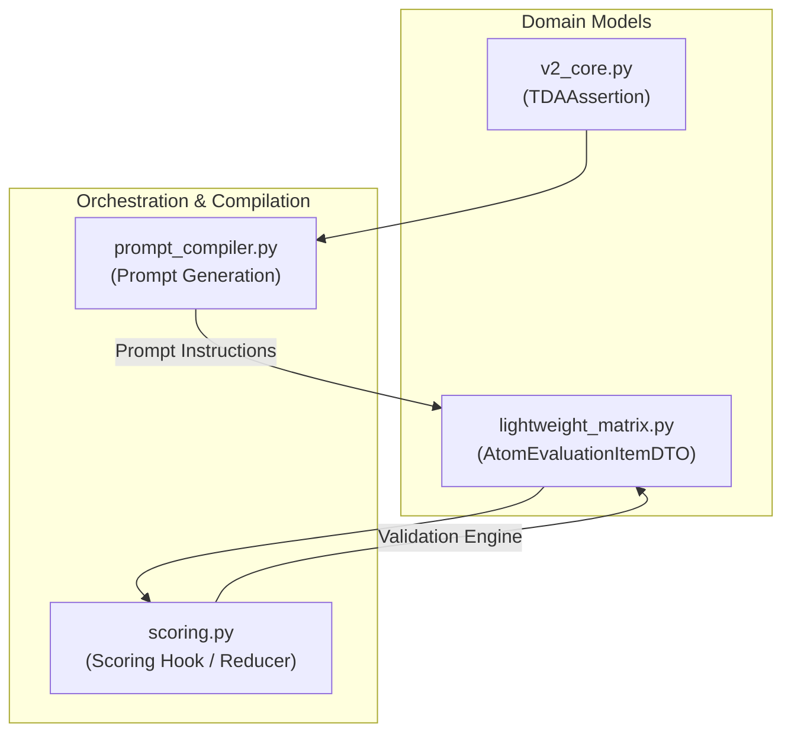

# Epic 59: Claim-Level Contextual Override & System 2 Zero-Variance Architecture

> [!IMPORTANT]
> **THE CLEAN SLATE MANDATE (`the_duct_tape_ban` & `the_no_legacy_mandate`)**: Toteutamme tämän arkkitehtuurisen muutoksen puhtaalta pöydältä (Clean Slate). Emme käytä fallback-purkkaa tai anemic-malleja. Uusi kenttä `allow_contextual_override` integroidaan tiukasti osaksi Pydantic V2 -malleja ja tietokantaschemoja. Jos data on korruptoitunutta tai epäyhteensopivaa, järjestelmän tulee kaatua välittömästi (Fail-Fast). Uudet TDA-säännöt kirjoitetaan tiukasti englanniksi, ja tulosten suomenkielinen visualisointi säilyy matriiseissa.

## 1. Yhteenveto ja Tavoite (Objective)

Tämän Epicin tavoitteena on saavuttaa arviointimoottorin absoluuttinen nollavarianssi (Zero-Variance) ja ratkaista monimutkaisten kognitiivisten väitteiden arviointiin liittyvät väärät negatiiviset (false negatives) tulokset sekä oskillointi. 

Uudistuksella poistetaan kolme keskeistä kognitiivista sokeaa pistettä siirtämällä monimutkainen deduktiivinen logiikka luonnollisen kielen prompteista (System 1) deterministiseen Python-kerrokseen (System 2):
1. **Eksklusiivisuuden paradoksi (Exclusivity Paradox)**: Säännön läsnäolon ja poissulkevuuden arviointi samanaikaisesti.
2. **Negatiivisen tilan sokeus (Negative State Blindness)**: Vaikeus todistaa poikkeusten tai negaatioiden puuttuminen.
3. **Kronomnesia (Chronomnesia)**: Aikajanasokeus ja myöhemmän kontekstin aiheuttama huomioikkunan siirtymä.

Lisäksi ratkaisemme korkean tason käsitteellisten väitteiden (kuten Toulmin-argumentoinnin falsifioinnin tai Bloom-synteesin) ankkurointiongelmat, joista puuttuu yksi selkeä lainauskohde, ottamalla käyttöön **väitetasoisen kognitiivisen ohitusventtiilin (Claim-Level Contextual Override)**.

---

## 2. Arkkitehtoniset Suojamuurit ja Vaarat (Architectural Safeguards)

### A. Skeemarikko (Schema Violation Hazard)
Koska Pydantic-mallimme (`V2CoreBase`) käyttävät tiukkaa konfiguraatiota (`extra="forbid"`), emme voi lisätä `allow_contextual_override` -kenttää suoraan `seed_data.json` -tiedostoon ilman, että Pydantic-skeema päivitetään ensin. Teemme tämän vaiheittain ja deterministisesti:
1. Päivitetään `TDAAssertion`-malli tiedostossa `backend_v2/models/v2_core.py`.
2. Varmistetaan OpenAPI-skeeman generointi.

### B. Laiskan tekoälyn riski (Lazy LLM Risk & Spatial Anchoring)
Jos ohitusventtiili sallittaisiin kaikille väitteille ilman tiukkoja kriteereitä, LLM alkaisi nopeasti käyttää sitä helppona oikopolkuna välttääkseen sitaattien hakemisen ja tuottaisi nollatason perusteluja (esim. *"Asiayhteys vihjaa tähän"*). Tämän torjumiseksi (Anti-Laziness):
- Ohitus sallitaan ainoastaan väitteissä, joissa `allow_contextual_override` on asetettu arvoon `True`.
- Jos LLM yrittää palauttaa `contextual_override = true` säännölle, jossa sitä ei ole sallittu, sääntömoottori hylkää ohituksen ja vaatii silti tarkan sitaatin (`exact_quote`).
- **Pakotettu spatiaalinen ankkurointi (Spatial Anchoring)**: Promptissa ja Pydantic-validaattorissa pakotetaan sääntö, että jos `contextual_override` on `True`, niin `semantic_reasoning`-kentän on oltava **vähintään 50 merkkiä pitkä** ja sen on **pakko sisältää rakenteellinen sijaintiviite** (esim. sivunumero, kappaleindeksi tai väliotsikon nimi, kuten *"page"*, *"paragraph"*, *"section"* tai *"kappale"*). Jos pituus- tai sijaintiviiteehto ei täyty, sääntö katsotaan FAILED-tilaiseksi ja siirretään DLQ-lokille.


### C. Global Workflow Master Switch (Työnkulun pääkytkin)
Ohitustoiminnallisuuden suojaksi otetaan käyttöön työnkulkukohtainen pääkytkin `enable_contextual_overrides: bool = False` suoraan `Workflow`-mallissa:
* Vaikka yksittäinen väite (Assertion) sallisi ohituksen (`allow_contextual_override = True`), ohituksia **ei koskaan suoriteta eikä hyväksytä**, jos työnkulun pääkytkin on pois päältä (`enable_contextual_overrides = False`).
* Tehokas ohitusoikeus on `workflow.enable_contextual_overrides AND assertion.allow_contextual_override`.

### D. Kognitiiviset sokeat pisteet ja niiden torjunta
*   **Eksklusiivisuuden paradoksi**: Ratkaistaan eristetyillä poimintaskeemoilla (`extraction_schema_factory.py`), joissa sallitut ja kielletyt löydökset eritellään omiin listakenttiinsä (`ActionClassificationAnalysis`).
*   **Negatiivisen tilan sokeus**: Ratkaistaan kaksiportaisella Map-Reduce -falsifioinnilla (`dag_executor.py` / `llm_task_executor.py`), jossa Python-kerros suorittaa negaatioarvioinnin deterministisesti.
*   **Kronomnesia**: Ratkaistaan *Spatial Slicing* -tekniikalla (`context_builder.py`), joka leikkaa aikajanan fyysisesti irti ennen LLM-syötettä, jos sääntö arvioi kronologiaa.

---

## 3. Tunnistetut Käsitteelliset Säännöt (Identified Seed Claims)

Auditoinnin perusteella olemme tunnistaneet seuraavat `seed_data.json` -matriisien väitteet, joissa ohitus tai System 2 -eristys on arkkitehtonisesti perusteltu:

1. **Toulmin Falsification (`tda_e6a0c9d3eb6c443f`)**: Vaatii monimutkaista itsensä kyseenalaistamista ja dialektiikkaa usean kappaleen ylitse. Suoraa yksittäistä sitaattia on vaikea erottaa.
2. **Bloom Novel Synthesis (`tda_567ee46c35852f54`)**: Eri käsitteiden yhdistäminen uudeksi viitekehykseksi tapahtuu synteettisesti eikä sitä voi ankkuroida yhteen lauseeseen.
3. **Goodhart Socratic Steering (`tda_4b9a2c1f38e7456d`)**: Foundaationaalisen päättelyn koettelu on dialogista ja siitä puuttuu yksittäinen syntaktinen avainsana.

---

## 4. Toteutuksen Vaiheistus (Phased Implementation Plan)

### Phase 1: Pydantic Schema and Evaluation DTO Hardening
*   **Tehtävä 1**: Päivitä `extraction_schema_factory.py` luomaan isolaatteja (esim. `ActionClassificationAnalysis`), joissa on erilliset listakentät sallituille (esim. muotoilu) ja kielletyille (esim. logiikan muutos) löydöksille.
*   **Tehtävä 2**: Integroi `ValidationInfo` -kontekstiin nojaava `@model_validator(mode="after")` (`_enforce_zero_variance_protocols`), joka:
    1. Tarkistaa `exact_quote` -kentän läsnäolon syötetekstissä käyttäen **Unicode NFKC -normalisointia**, tyhjän tilan siivousta ja **fuzzy matching / Levenshtein-etäisyysvertailua** (yli 95 % osumatarkkuus hyväksytään). Sitaattitarkistus ohitetaan kokonaan, jos `contextual_override` on `True`.
    2. **Laiskuuden torjunta (Anti-Laziness)**: Varmistaa, että jos `contextual_override` on `True`, niin `semantic_reasoning` on **vähintään 50 merkkiä pitkä** ja se **sisältää spatiaalisen rakenteellisen viitteen** (esim. sivunumero, kappaleindeksi tai väliotsikko, kuten *"page"*, *"paragraph"*, *"section"* tai *"kappale"*). Jos ehdot eivät täyty, validaattori nostaa virheen tai merkitsee säännön epäonnistuneeksi.
*   **Tehtävä 3**: Päivitä `ValidationWarningDTO` tukemaan XAI-telemetriaa (entropia ja error_code) sekä luo `HardeningRetryDirectiveDTO` dynaamista orkestrointia varten.

### Phase 2: Prompt Compiler, DAG Orchestration and Scoring Pipeline Integration
*   **Tehtävä 1**: Toteuta *Spatial Slicing* tiedostoon `context_builder.py`: Leikkaa aikajana fyysisesti irti ennen kuin se syötetään LLM:lle, jos sääntö arvioi kronologiaa.
*   **Tehtävä 2**: Rakenna *Decoupled Falsification* -putki (`dag_executor.py` / `llm_task_executor.py`): Erota negatiiviset ehdot kaksiportaiseksi Map-Reduce -kutsuksi. Ensimmäinen hakee väitteet, toinen rajoitteet, ja Python-koodi arvioi Boolean logiikan.
*   **Tehtävä 3**: Lisää *Dynamic Routing*: Tunnista historiallisesti korkean entropian (1.000) `atom_id`:t ja pakota ne lennossa "Ensemble-tilaan" (3 rinnakkaista ajoa, Majority Vote).

### Phase 3: Polymorphic Seed Migration and Database Re-seed
*   **Tehtävä 1**: Refaktoroi epävakautta aiheuttaneet promptit (esim. `tda_d204baf0bdf74ff7`, `tda_569f87a921a2fb69`, `tda_58cbd7271f491351`).
*   **Tehtävä 2**: Poista prompteista kaikki "NEGATIVE CONDITION", "IF AND ONLY IF" ja "ONLY" -säännöstöt. Muuta promptit muotoon: "Extract exact quotes matching X into list A. Extract exact quotes matching Y into list B."
*   **Tehtävä 3**: Aja tietokannan re-seed (`run_seed.py` / `wipe_user_data.py`), jotta uudet tietorakenteet ja mallit aktivoituvat.

### Phase 4: Verification, Quality Gate and Architecture Hardening
*   **Tehtävä 1**: Aja massatestit (`e2e_simulation.dart` / QA-putket) identtisillä syötteillä vähintään kolme kertaa.
*   **Tehtävä 2**: Kerää Fleissin Kappa ja Shannonin Entropia erityisesti 13 aiemmin epäonnistuneelta `tda_*` atomilta. Varmista entropian asettuminen arvoon `0.000` (nollavarianssi) ja Self-Consistency arvoon 100 %.
*   **Tehtävä 3**: Viimeistele XAI-läpinäkyvyysraportointi käyttöliittymään (Flutter), jotta uusi listaperustainen päättelyketju näkyy loppukäyttäjälle selkeästi.
*   **Tehtävä 4**: **Totuustaulun yksikkötestaus (Dual-Lock Logic Gate)**: Kirjoita kattava `pytest.mark.parametrize`-yksikkötesti tiedostoon `test_lightweight_matrix.py`, joka käy matemaattisesti läpi kaikki loogisen totuustaulun kombinaatiot (`Workflow Switch` `True/False`, `Assertion Switch` `True/False`, `LLM Override` `True/False`, `LLM Evidence` `True/False`, `Inverse Evidence` `True/False`). Testin on deterministisesti varmennettava System 2 -tason ehdoton ylivalta: Jos LLM palauttaa `override=True`, mutta työnkorjuun master-kytkin tai väitekytkin on `False`, ohituksen on heti kaaduttava `FAILED`-tilaan.
*   **Tehtävä 5**: **Vihamielinen "Lazy LLM" -simulaatio (Red Teaming)**: Rakenna integrointitesti, joka hyödyntää Mock-LLM:ää simuloimaan laiskaa tekoälyä. Simuloitu LLM yrittää oikaista ja palauttaa kaikille arvioitaville atomeille `contextual_override = True` sekä keksii lyhyitä, tyhjiä perusteluja. Testin on todennettava, että:
    1. Kaikki luvattomat ohitukset (joissa `allow_contextual_override` on `False`) reititetään deterministisesti `FAILED/DLQ` -tilaan.
    2. Spatiaalisen ankkuroinnin rikkovat ohitukset (alle 50 merkkiä tai ilman sijaintiviitettä) reititetään `FAILED/DLQ` -tilaan tai laukaisevat korjaavan `HardeningRetryDirectiveDTO`-uudelleenyrityksen.
    Varmista, ettei mikään laiska tai luvaton LLM-ohitus pääse koskaan suodattimen läpi `PASSED`-tilaan.
*   **Tehtävä 6**: **Kronomnesian negatiivisen tilan (Negative State) testi**: Kirjoita integrointitesti, joka mittaa *Spatial Slicing* -tekniikkaa aikajanaan sidotulla säännöllä (esim. *"Tapahtumaa X ei tapahtunut ennen vaihetta Y"*). Syötä testiputkeen dokumentti, jossa tapahtuma X tapahtuu vasta vaiheen Y jälkeen (eli fyysisesti leikatun alueen ulkopuolella). Testin on todennettava, että:
    1. `context_builder.py` leikkaa fyysisesti irti kaiken tekstin vaiheen Y jälkeen ennen LLM-syötettä.
    2. LLM ei näe tapahtumaa X lainkaan, jolloin se raportoi siitä nollahavainnon.
    3. Python-kerroksen Boolean-inversio (`inverse_evidence`) kääntää tämän oikein ja antaa deterministiseksi lopputuomioksi `PASSED` (vahvistaen, että säännön rikkomusta ei tapahtunut sallitulla aikajanalla), todistaen kronomnesian eston ja kaksiportaisen falsifioinnin aukottoman integraation.
*   **Tehtävä 7**: **Oskilloinnin poistumisen stressitesti (Shannonin Entropia Benchmark)**: Varmista nollavarianssin matemaattinen lahjomattomuus stressitestillä:
    1. Määritä testiajolle (tai muokkaa dynaamisesti `seed_data.json`-malliin) korkeampi tekoälyn lämpötila `temperature = 0.3` (esim. tiedostossa [seed_data.json](file:///c:/src/quorum/backend_v2/seed/seed_data.json)) provosoidaksesi luonnollisen kielen luovaa varianssia.
    2. Aja E2E-simulaatiotesti (esim. `e2e_simulation.dart` or vastaava Python-ajuri) 10–20 kertaa peräkkäin vaikeilla testisiemenillä (Toulmin, Bloom, Goodhart).
    3. **Quality Gate -vaatimus**: Vaikka tekoälyn luovuutta on nostettu (temp=0.3), System 2:n ja kognitiivisen ohitusventtiilin deterministic-suodattimien läpi ajettuna lopputuomion (PASS/FAIL) **Shannonin entropian on oltava tasan 0.000** ja **Fleissin Kappan tasan 1.0**. Tuloksen on oltava absoluuttisesti sama jokaisessa ajossa.
*   **Tehtävä 8**: **XAI-läpinäkyvyyden visuaalinen varmistaminen (Audit Trail UI Test)**: Jotta ihmisauditoijalla on 100 % läpinäkyvyys siihen, miten tulos on saavutettu, käyttöliittymän (Flutter) on reagoitava visuaalisesti kognitiiviseen ohitukseen. Kirjoita Flutter-integraatio/widget-testi (`client_app_v2/test/`), joka todentaa, että:
    1. Kun atomilaskenta sisältää `contextual_override == true`, käyttöliittymä korvaa perinteisen *"Lainaus/Quote"* -näyttölohkon selkeällä, erivärisellä *"Tekoälyn semanttinen perustelu / Semantic Explanation"* -laatikolla.
    2. Komponentti renderöi ja visualisoi semanttisen ankkuriperusteen (esim. sivun ja kappaleen viitteet) loppukäyttäjälle yksiselitteisenä ja korostettuna audit-trailina.


---

## 5. Ehdotetut Koodimuutokset (Proposed Technical Changes)



### A. Domain-mallien & Purkuskeeman päivitys

#### Tiedosto: `backend_v2/services/orchestrator/extraction_schema_factory.py` (Python)
Koska dynaamisissa skeemoissa käytetään tiukkaa `extra="forbid"`-määritystä, LLM-kutsut kaatuisivat välittömästi `ValidationError`-poikkeukseen, jos LLM yrittää palauttaa `contextual_override` ja `semantic_reasoning` -kentät ilman, että ne on määritelty dynaamisessa vastausskeemassa.

Päivitetään `create_extraction_model` lisäämään nämä kentät automaattisesti dynaamiseen `DynamicExtractionResponse` -malliin:

```python
    # 3. Build the dynamic DynamicExtractionResponse root model
    root_fields: dict[str, Any] = {
        "chunk_index": (int, Field(..., description="Zero-based index of the chunk")),
        "context_scan_trace": (str, Field(..., max_length=400, description="Short trace of LLM reasoning")),
        "search_context_anchor": (str | None, Field(default=None, description="Optional raw quote anchor")),
        "contextual_override": (bool, Field(default=False, description="If True, allows contextual override")),
        "semantic_reasoning": (str, Field(default="", description="Detailed semantic justification")),
    }
```

#### Tiedosto: `backend_v2/models/v2_core.py` (Python)
Lisätään uusi kenttä `allow_contextual_override` sääntötason tarkistukseen sekä globaali pääkytkin `enable_contextual_overrides` työnkulkutasolle:

```python
class TDAAssertion(V2CoreBase):
    """Deterministic rule evaluated by the backend."""
    # ... nykyiset kentät ...
    allow_contextual_override: bool = Field(
        default=False,
        description="If True, allows contextual or semantic justification instead of a strict exact quote citation."
    )


class Workflow(V2CoreBase):
    """Dynamic Directed Acyclic Graph orchestrator model."""
    # ... nykyiset kentät ...
    enable_contextual_overrides: bool = Field(
        default=False,
        description="Master switch to globally enable or disable claim-level contextual overrides for this entire workflow."
    )
```

#### Tiedostot: `client_app_v2` (Flutter/Dart)
Päivitetään vastaavat Dart-mallit (`@freezed`) vastaamaan Python-rajapinnan skeemaa:
* **`client_app_v2/lib/features/studio/models/workflow.dart`**: Lisätään `@Default(false) bool enableContextualOverrides`
* **`client_app_v2/lib/features/studio/models/tda_assertion.dart`**: Lisätään `@Default(false) bool allowContextualOverride`


#### Tiedosto: `backend_v2/models/dtos/lightweight_matrix.py`
Päivitetään `calculate_rule_satisfied` ottamaan vastaan `allow_contextual_override` -lippu:
```python
    def calculate_rule_satisfied(self, inverse_evidence: bool, allow_contextual_override: bool = False) -> bool | str:
        """Deterministinen tuomiovalta: Laskee rule_satisfied arvon kooditasolla."""
        if self.status:
            if self.status == "DLQ":
                return "DLQ"
            evidence_found = (self.status == "PASS")
            if inverse_evidence:
                return not evidence_found
            return evidence_found

        # Contextual Override logic
        if allow_contextual_override and self.contextual_override:
            evidence_satisfied = True
        else:
            evidence_satisfied = self.evidence_found

        if inverse_evidence:
            return not evidence_satisfied
        return evidence_satisfied
```

### B. Prompt Compilerin päivitys

#### Tiedosto: `backend_v2/services/orchestrator/prompt_compiler.py`
Päivitetään XML-pohjainen ohjeistuksen generointi siten, että jos assertion sallii ohituksen, LLM:lle syötetään tarkat toimintaohjeet ja häntä pakotetaan palauttamaan **eksplisiittinen Sentinel-arvo** `"[CONTEXTUAL_OVERRIDE_APPLIED]"` exact_quote-kenttään:
```python
                                    if getattr(assertion, "allow_contextual_override", False):
                                        rule_text += (
                                            " [CONTEXTUAL OVERRIDE ALLOWED] If the assertion's criteria are satisfied "
                                            "semantically or contextually across the text but no single exact verbatim quote "
                                            "can be isolated, you MUST: 1) Set contextual_override = true. 2) Provide a detailed "
                                            "explanation in semantic_reasoning with structural references. 3) Set exact_quote to exactly "
                                            "'[CONTEXTUAL_OVERRIDE_APPLIED]'. Do NOT hallucinate a quote. Only use this override "
                                            "if a direct literal quote is physically absent."
                                        )
```


### C. Pisteytyskoukun (Scoring Hook) päivitys
#### Tiedosto: `backend_v2/hooks/scoring.py`
Päivitetään suorituskonteksti ja evaluation-looppi siten, että ohitukset otetaan käyttöön vain silloin, kun **sekä työnkulku että yksittäinen väite** sallivat sen:

1. Haetaan työnkulun (`workflow`) master-kytkin suorituskontekstista ja välitetään se atomilaskentaan.
2. Lisätään kenttä `atom_mapping`-tuplaan:
```python
                             atom_mapping[aid] = (
                                 pb_id,
                                 s_val,
                                 tda.ai_rule_description,
                                 str(getattr(tda, "aggregation_mode", "EXISTS")),
                                 tda.inverse_evidence,
                                 getattr(tda, "allow_contextual_override", False),
                             )
```
3. Puretaan kenttä loopissa ja lasketaan lopullinen **tehokas ohitusoikeus** hyödyntäen työnkulun master-lippua (`workflow.enable_contextual_overrides`):
```python
            pb_id, s_val, text, agg_mode, inverse_evidence, allow_override = mapping
            
            # Tehokas ohitusoikeus vaatii sekä työnkulun että väitteen sallivan lipun
            effective_allow_override = getattr(workflow, "enable_contextual_overrides", False) and allow_override

            mapped_state: State
            if ev_dto.status == "DLQ":
                mapped_state = "DLQ"
            else:
                is_satisfied = ev_dto.calculate_rule_satisfied(inverse_evidence, allow_contextual_override=effective_allow_override)
                mapped_state = "PASSED" if is_satisfied else "FAILED"
```

---

## 6. Definition of Done (DoD)

1. **Schema Compliance**: Pydantic-mallit hyväksyvät `allow_contextual_override` -kentän ilman validointivirheitä.
2. **Strict Isolation**: Ohitus toimii VAIN väitteissä, joissa `allow_contextual_override` on explicitly asetettu arvoon `True`. Muissa väitteissä se hylätään deterministisesti.
3. **No Hallucinations**: Prompt Compiler syöttää selkeät ankkurointiohjeet LLM:lle, estäen olemattomien sitaattien keksimisen.
4. **All Tests Pass**: Kaikki yksikkötestit `pytest` -ajossa menevät puhtaasti läpi ilman deprecation-varoituksia tai tyyppivirheitä.
5. **No Legacy Fallbacks**: Muutokset noudattavat "Clean Slate" -periaatetta. Järjestelmä kaatuu välittömästi (Fail-Fast), jos skeemat ovat virheellisiä.

---

## 7. Käyttöliittymän Muutokset (UI & Administrative Studio Requirements)

Jotta ylläpitäjillä on täysi hallinta ohitustoiminnallisuuteen, Admin Studio -käyttöliittymään toteutetaan kaksi uutta määritysvalintaa samoilla tiedoilla ja käännöksillä kuin muutkin vastaavat asetukset:

### 7.1 Väite-editori (Assertion/Rule Editor UI)
Väitekohtaisen säännön (TDAAssertion) muokkausnäkymään (osana matriisi- ja ohje-editoria) lisätään uusi valintakytkin (switch/checkbox) ohituksen sallimiseksi:

* **Sijainti**: Jokaisen sääntörivin (Assertion) asetukset -osiossa.
* **Kenttä**: `allow_contextual_override`
* **Lokalisoidut tekstit**:
  * **Otsikko (Label)**:
    * FI: `"Salli kognitiivinen ohitus"`
    * EN: `"Allow Contextual Override"`
  * **Kuvaus / UI Vinkki (Tip/Description)**:
    * FI: `"Sallii LLM:lle perustellun semanttisen hyväksynnän ilman kirjaimellista lainausta, jos tarkkaa tekstiä ei ole fyysisiä todisteita varten olemassa."`
    * EN: `"Allows the LLM to justify semantic verification without a literal quotation if exact text evidence is physically absent."`

### 7.2 Työnkulku-editori (Workflow Builder UI)
Työnkulun yleisten asetusten hallintapaneeliin (sidebar tai workflow metadata panel) lisätään globaali pääkytkin koko suorituksen kattavalle ohituksen aktivoinnille:

* **Sijainti**: Workflow metadata- ja strictness-asetusten yhteydessä.
* **Kenttä**: `enable_contextual_overrides`
* **Lokalisoidut tekstit**:
  * **Otsikko (Label)**:
    * FI: `"Kognitiiviset ohitukset käytössä"`
    * EN: `"Enable Contextual Overrides"`
  * **Kuvaus / UI Vinkki (Tip/Description)**:
    * FI: `"Master-kytkin, joka sallii tai kieltää väitetasoiset semanttiset ohitukset koko tämän työnkulun ajon aikana."`
    * EN: `"Master toggle that globally enables or disables claim-level semantic overrides for this entire workflow run."`
