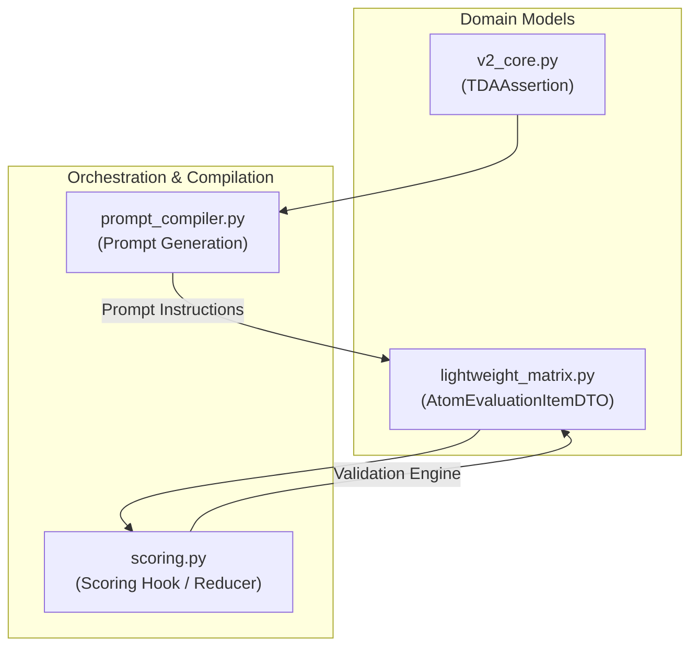

# Epic 59: Claim-Level Contextual Override Architecture

> [!IMPORTANT]
> **THE CLEAN SLATE MANDATE (`the_duct_tape_ban` & `the_no_legacy_mandate`)**: Toteutamme tämän arkkitehtuurisen muutoksen puhtaalta pöydältä (Clean Slate). Emme käytä fallback-purkkaa tai anemic-malleja. Uusi kenttä `allow_contextual_override` integroidaan tiukasti osaksi Pydantic V2 -malleja ja tietokantaschemoja. Jos data on korruptoitunutta tai epäyhteensopivaa, järjestelmän tulee kaatua välittömästi (Fail-Fast). Uudet TDA-säännöt kirjoitetaan tiukasti englanniksi, ja tulosten suomenkielinen visualisointi säilyy matriiseissa.

## 1. Yhteenveto ja Tavoite (Objective)

Tämän Epicin tavoitteena on ratkaista korkean kognitiivisen tason väitteiden (conceptual claims) arviointiin liittyvät väärät negatiiviset (false negatives) tulokset. Nykyisellään Quorum V2 vaatii jokaiselta TDA-säännöltä (`TDAAssertion`) tarkan lainauksen (`exact_quote`) suoraan kohdedokumentista. Käsitteelliset väitteet – kuten Toulmin-argumentaation falsifiointi, Bloom-synteesi ja Sokraattinen ohjaus – syntetisoivat tietoa useasta eri kappaleesta tai arvioivat dialogista rakennetta, jolloin yksittäistä kirjaimellista lainausankkuria ei ole fyysisesti olemassa.

Tämä pakottaa LLM:n joko hallusinoimaan lainauksia tai epäonnistumaan väitteen todentamisessa. Ratkaisuna otamme käyttöön **väitetasoisen kognitiivisen ohitusventtiilin (Claim-Level Contextual Override)**. 

Tämä ratkaisu mahdollistaa:
1. **Konseptuaalisen joustavuuden**: Väite voidaan hyväksyä semanttisesti, vaikka suoraa fyysistä lainausta ei ole erotettavissa.
2. **Hallusinaatioiden ehkäisyn**: LLM:lle annetaan laillinen poistumistie (`contextual_override = true` ja `semantic_reasoning`), jolloin sen ei tarvitse keksiä lainauksia väkisin.
3. **Tiukan kontrollin (Anti-Laziness)**: Ohitusmahdollisuus ei ole globaali, vaan se sallitaan tiukasti vain claim-by-claim-tasolla (`allow_contextual_override: bool = False` oletuksena).

---

## 2. Arkkitehtoniset Suojamuurit ja Vaarat (Architectural Safeguards)

### A. Skeemarikko (Schema Violation Hazard)
Koska Pydantic-mallimme (`V2CoreBase`) käyttävät tiukkaa konfiguraatiota (`extra="forbid"`), emme voi lisätä `allow_contextual_override` -kenttää suoraan `seed_data.json` -tiedostoon ilman, että Pydantic-skeema päivitetään ensin. Teemme tämän vaiheittain ja deterministisesti:
1. Päivitetään `TDAAssertion`-malli tiedostossa `backend_v2/models/v2_core.py`.
2. Varmistetaan OpenAPI-skeeman generointi.

### B. Laiskan tekoälyn riski (Lazy LLM Risk)
Jos ohitusventtiili sallittaisiin kaikille väitteille, LLM alkaisi nopeasti käyttää sitä helppona oikotienä välttääkseen tarkkojen lainausten etsimistä. Tämän vuoksi:
- Vain ne assertions, joiden kohdalla `allow_contextual_override` on eksplisiittisesti asetettu arvoon `True`, voivat käyttää ohitusta.
- Jos LLM yrittää palauttaa `contextual_override = true` säännölle, jolle se ei ole sallittu, deterministinen sääntömoottori (`scoring.py` / `calculate_rule_satisfied`) hylkää ohituksen ja vaatii edelleen fyysistä lainausta (`exact_quote`).

---

## 3. Tunnistetut Käsitteelliset Säännöt (Identified Seed Claims)

Auditoinnin perusteella olemme tunnistaneet seuraavat `seed_data.json` -matriisien väitteet, joissa ohitus on arkkitehtonisesti perusteltu:

1. **Toulmin Falsification (`tda_e6a0c9d3eb6c443f`)**: Vaatii monimutkaista itsensä kyseenalaistamista ja dialektiikkaa usean kappaleen ylitse. Suoraa yksittäistä sitaattia on vaikea erottaa.
2. **Bloom Novel Synthesis (`tda_567ee46c35852f54`)**: Eri käsitteiden yhdistäminen uudeksi viitekehykseksi tapahtuu synteettisesti eikä sitä voi ankkuroida yhteen lauseeseen.
3. **Goodhart Socratic Steering (`tda_4b9a2c1f38e7456d`)**: Foundaationaalisen päättelyn koettelu on dialogista ja siitä puuttuu yksittäinen syntaktinen avainsana.

---

## 4. Ehdotetut Koodimuutokset (Proposed Technical Changes)



### A. Domain-mallien päivitys
#### Tiedosto: `backend_v2/models/v2_core.py`
Lisätään uusi kenttä `allow_contextual_override`:
```python
class TDAAssertion(V2CoreBase):
    """Deterministic rule evaluated by the backend."""
    # ... nykyiset kentät ...
    allow_contextual_override: bool = Field(
        default=False,
        description="If True, allows contextual or semantic justification instead of a strict exact quote citation."
    )
```

#### Tiedosto: `backend_v2/models/dtos/lightweight_matrix.py`
Päivitetään `calculate_rule_satisfied` ottamaan vastaan `allow_contextual_override` -lippu:
```python
    def calculate_rule_satisfied(self, inverse_evidence: bool, allow_contextual_override: bool = False) -> bool | str:
        """Deterministinen tuomiovalta: Laskee rule_satisfied arvon kooditasolla."""
        if self.status:
            if self.status == "DLQ":
                return "DLQ"
            evidence_found = (self.status == "PASS")
            if inverse_evidence:
                return not evidence_found
            return evidence_found

        # Contextual Override logic
        if allow_contextual_override and self.contextual_override:
            evidence_satisfied = True
        else:
            evidence_satisfied = self.evidence_found

        if inverse_evidence:
            return not evidence_satisfied
        return evidence_satisfied
```

### B. Prompt Compilerin päivitys
#### Tiedosto: `backend_v2/services/orchestrator/prompt_compiler.py`
Päivitetään XML-pohjainen ohjeistuksen generointi siten, että jos assertion sallii ohituksen, LLM:lle syötetään tarkat toimintaohjeet:
```python
                                    if getattr(assertion, "allow_contextual_override", False):
                                        rule_text += (
                                            " [CONTEXTUAL OVERRIDE ALLOWED] If the assertion's criteria are satisfied "
                                            "semantically or contextually across the text but no single exact verbatim quote "
                                            "can be isolated, you MUST: 1) Set contextual_override = true. 2) Provide a detailed "
                                            "explanation in semantic_reasoning. 3) You may return null or an empty string for exact_quote. "
                                            "Do NOT hallucinate a quote. Only use this override if a direct literal quote is physically absent."
                                        )
```

### C. Pisteytyskoukun (Scoring Hook) päivitys
#### Tiedosto: `backend_v2/hooks/scoring.py`
Päivitetään `atom_mapping` ja evaluation-looppi välittämään `allow_contextual_override` -tieto säännöistä DTO-laskentaan:
1. Lisätään kenttä `atom_mapping`-tuplaan:
```python
                            atom_mapping[aid] = (
                                pb_id,
                                s_val,
                                tda.ai_rule_description,
                                str(getattr(tda, "aggregation_mode", "EXISTS")),
                                tda.inverse_evidence,
                                getattr(tda, "allow_contextual_override", False),
                            )
```
2. Puretaan kenttä loopissa ja välitetään eteenpäin:
```python
            pb_id, s_val, text, agg_mode, inverse_evidence, allow_override = mapping

            mapped_state: State
            if ev_dto.status == "DLQ":
                mapped_state = "DLQ"
            else:
                is_satisfied = ev_dto.calculate_rule_satisfied(inverse_evidence, allow_contextual_override=allow_override)
                mapped_state = "PASSED" if is_satisfied else "FAILED"
```

---

## 5. Seeding- ja Migraatiosuunnitelma

Luodaan deterministinen Python-migraatioskripti `tmp/modify_seed_override.py`, joka tekee varmuuskopion master-seedistä ja asettaa `allow_contextual_override = true` seuraaville TDA-ID:ille:
- `tda_e6a0c9d3eb6c443f` (Toulmin Falsification)
- `tda_567ee46c35852f54` (Bloom Novel Synthesis)
- `tda_4b9a2c1f38e7456d` (Goodhart Socratic Steering)

Tämän jälkeen ajetaan täydellinen kehitystietokannan re-seedaus:
```powershell
uv run python backend_v2/seed/run_seed.py local
```

---

## 6. Definition of Done (DoD)

1. **Schema Compliance**: Pydantic-mallit hyväksyvät `allow_contextual_override` -kentän ilman validointivirheitä.
2. **Strict Isolation**: Ohitus toimii VAIN väitteissä, joissa `allow_contextual_override` on explicitly asetettu arvoon `True`. Muissa väitteissä se hylätään deterministisesti.
3. **No Hallucinations**: Prompt Compiler syöttää selkeät ankkurointiohjeet LLM:lle, estäen olemattomien sitaattien keksimisen.
4. **All Tests Pass**: Kaikki yksikkötestit `pytest` -ajossa menevät puhtaasti läpi ilman deprecation-varoituksia tai tyyppivirheitä.
5. **No Legacy Fallbacks**: Muutokset noudattavat "Clean Slate" -periaatetta. Järjestelmä kaatuu välittömästi (Fail-Fast), jos skeemat ovat virheellisiä.
