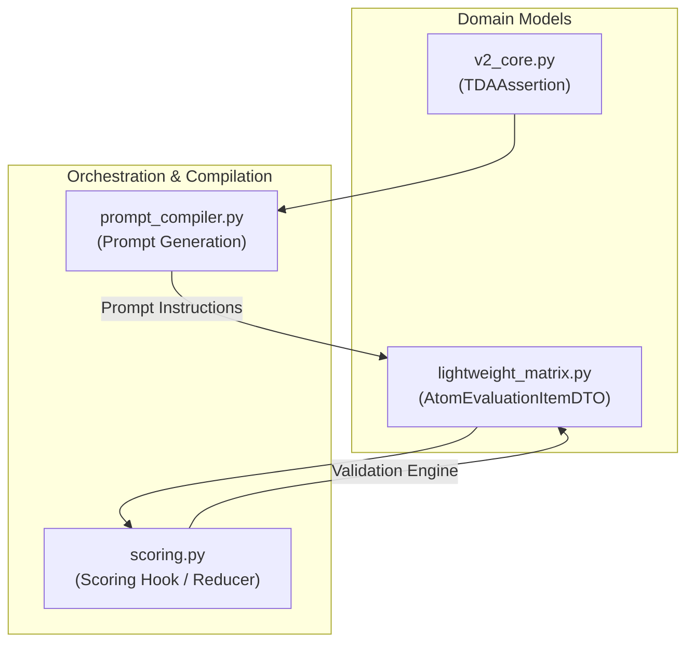

# Epic 59: Claim-Level Contextual Override Architecture

> [!IMPORTANT]
> **THE CLEAN SLATE MANDATE (`the_duct_tape_ban` & `the_no_legacy_mandate`)**: Toteutamme tämän arkkitehtuurisen muutoksen puhtaalta pöydältä (Clean Slate). Emme käytä fallback-purkkaa tai anemic-malleja. Uusi kenttä `allow_contextual_override` integroidaan tiukasti osaksi Pydantic V2 -malleja ja tietokantaschemoja. Jos data on korruptoitunutta tai epäyhteensopivaa, järjestelmän tulee kaatua välittömästi (Fail-Fast). Uudet TDA-säännöt kirjoitetaan tiukasti englanniksi, ja tulosten suomenkielinen visualisointi säilyy matriiseissa.

## 1. Yhteenveto ja Tavoite (Objective)

Tämän Epicin tavoitteena on ratkaista korkean kognitiivisen tason väitteiden (conceptual claims) arviointiin liittyvät väärät negatiiviset (false negatives) tulokset. Nykyisellään Quorum V2 vaatii jokaiselta TDA-säännöltä (`TDAAssertion`) tarkan lainauksen (`exact_quote`) suoraan kohdedokumentista. Käsitteelliset väitteet – kuten Toulmin-argumentaation falsifiointi, Bloom-synteesi ja Sokraattinen ohjaus – syntetisoivat tietoa useasta eri kappaleesta tai arvioivat dialogista rakennetta, jolloin yksittäistä kirjaimellista lainausankkuria ei ole fyysisesti olemassa.

Tämä pakottaa LLM:n joko hallusinoimaan lainauksia tai epäonnistumaan väitteen todentamisessa. Ratkaisuna otamme käyttöön **väitetasoisen kognitiivisen ohitusventtiilin (Claim-Level Contextual Override)**. 

Tämä ratkaisu mahdollistaa:
1. **Konseptuaalisen joustavuuden**: Väite voidaan hyväksyä semanttisesti, vaikka suoraa fyysistä lainausta ei ole erotettavissa.
2. **Hallusinaatioiden ehkäisyn**: LLM:lle annetaan laillinen poistumistie (`contextual_override = true` ja `semantic_reasoning`), jolloin sen ei tarvitse keksiä lainauksia väkisin.
3. **Tiukan kontrollin (Anti-Laziness)**: Ohitusmahdollisuus ei ole globaali, vaan se sallitaan tiukasti vain claim-by-claim-tasolla (`allow_contextual_override: bool = False` oletuksena).

---

## 2. Arkkitehtoniset Suojamuurit ja Vaarat (Architectural Safeguards)

### A. Skeemarikko (Schema Violation Hazard)
Koska Pydantic-mallimme (`V2CoreBase`) käyttävät tiukkaa konfiguraatiota (`extra="forbid"`), emme voi lisätä `allow_contextual_override` -kenttää suoraan `seed_data.json` -tiedostoon ilman, että Pydantic-skeema päivitetään ensin. Teemme tämän vaiheittain ja deterministisesti:
1. Päivitetään `TDAAssertion`-malli tiedostossa `backend_v2/models/v2_core.py`.
2. Varmistetaan OpenAPI-skeeman generointi.

### B. Laiskan tekoälyn riski (Lazy LLM Risk)
If the override valve were allowed for all claims, the LLM would quickly start using it as an easy shortcut to avoid searching for precise quotes. Therefore:
- Only assertions where `allow_contextual_override` is explicitly set to `True` can utilize the override.
- If the LLM tries to return `contextual_override = true` for a rule where it is not allowed, the deterministic rule engine (`scoring.py` / `calculate_rule_satisfied`) rejects the override and still demands a physical quote (`exact_quote`).

### C. Global Workflow Master Switch (Workflown Ehdollisuus)
Ohitustoiminnallisuuden suojaksi otetaan käyttöön työnkulkukohtainen pääkytkin `enable_contextual_overrides: bool = False` suoraan `Workflow`-mallissa:
* Vaikka yksittäinen väite (Assertion) sallisi ohituksen (`allow_contextual_override = True`), ohituksia **ei koskaan suoriteta eikä hyväksytä**, jos työnkulun pääkytkin on pois päältä (`enable_contextual_overrides = False`).
* Tämä toimii absoluuttisena suojamuurina: tehokas ohitusoikeus on `workflow.enable_contextual_overrides AND assertion.allow_contextual_override`.
* Tämä antaa ylläpitäjille absoluuttisen globaalin kontrollin työnkulun suoritusvarmuudesta ja faktoihin ankkuroinnista ilman, että yksittäisiä väitteitä tarvitsee käydä muuttamassa.

---

## 3. Tunnistetut Käsitteelliset Säännöt (Identified Seed Claims)

Auditoinnin perusteella olemme tunnistaneet seuraavat `seed_data.json` -matriisien väitteet, joissa ohitus on arkkitehtonisesti perusteltu:

1. **Toulmin Falsification (`tda_e6a0c9d3eb6c443f`)**: Vaatii monimutkaista itsensä kyseenalaistamista ja dialektiikkaa usean kappaleen ylitse. Suoraa yksittäistä sitaattia on vaikea erottaa.
2. **Bloom Novel Synthesis (`tda_567ee46c35852f54`)**: Eri käsitteiden yhdistäminen uudeksi viitekehykseksi tapahtuu synteettisesti eikä sitä voi ankkuroida yhteen lauseeseen.
3. **Goodhart Socratic Steering (`tda_4b9a2c1f38e7456d`)**: Foundaationaalisen päättelyn koettelu on dialogista ja siitä puuttuu yksittäinen syntaktinen avainsana.

---

## 4. Ehdotetut Koodimuutokset (Proposed Technical Changes)



### A. Domain-mallien päivitys

#### Tiedosto: `backend_v2/models/v2_core.py` (Python)
Lisätään uusi kenttä `allow_contextual_override` sääntötason tarkistukseen sekä globaali pääkytkin `enable_contextual_overrides` työnkulkutasolle:

```python
class TDAAssertion(V2CoreBase):
    """Deterministic rule evaluated by the backend."""
    # ... nykyiset kentät ...
    allow_contextual_override: bool = Field(
        default=False,
        description="If True, allows contextual or semantic justification instead of a strict exact quote citation."
    )

class Workflow(V2CoreBase):
    """Dynamic Directed Acyclic Graph orchestrator model."""
    # ... nykyiset kentät ...
    enable_contextual_overrides: bool = Field(
        default=False,
        description="Master switch to globally enable or disable claim-level contextual overrides for this entire workflow."
    )
```

#### Tiedostot: `client_app_v2` (Flutter/Dart)
Päivitetään vastaavat Dart-mallit (`@freezed`) vastaamaan Python-rajapinnan skeemaa:
* **`client_app_v2/lib/features/studio/models/workflow.dart`**: Lisätään `@Default(false) bool enableContextualOverrides`
* **`client_app_v2/lib/features/studio/models/tda_assertion.dart`**: Lisätään `@Default(false) bool allowContextualOverride`


#### Tiedosto: `backend_v2/models/dtos/lightweight_matrix.py`
Päivitetään `calculate_rule_satisfied` ottamaan vastaan `allow_contextual_override` -lippu:
```python
    def calculate_rule_satisfied(self, inverse_evidence: bool, allow_contextual_override: bool = False) -> bool | str:
        """Deterministinen tuomiovalta: Laskee rule_satisfied arvon kooditasolla."""
        if self.status:
            if self.status == "DLQ":
                return "DLQ"
            evidence_found = (self.status == "PASS")
            if inverse_evidence:
                return not evidence_found
            return evidence_found

        # Contextual Override logic
        if allow_contextual_override and self.contextual_override:
            evidence_satisfied = True
        else:
            evidence_satisfied = self.evidence_found

        if inverse_evidence:
            return not evidence_satisfied
        return evidence_satisfied
```

### B. Prompt Compilerin päivitys
#### Tiedosto: `backend_v2/services/orchestrator/prompt_compiler.py`
Päivitetään XML-pohjainen ohjeistuksen generointi siten, että jos assertion sallii ohituksen, LLM:lle syötetään tarkat toimintaohjeet:
```python
                                    if getattr(assertion, "allow_contextual_override", False):
                                        rule_text += (
                                            " [CONTEXTUAL OVERRIDE ALLOWED] If the assertion's criteria are satisfied "
                                            "semantically or contextually across the text but no single exact verbatim quote "
                                            "can be isolated, you MUST: 1) Set contextual_override = true. 2) Provide a detailed "
                                            "explanation in semantic_reasoning. 3) You may return null or an empty string for exact_quote. "
                                            "Do NOT hallucinate a quote. Only use this override if a direct literal quote is physically absent."
                                        )
```

### C. Pisteytyskoukun (Scoring Hook) päivitys
#### Tiedosto: `backend_v2/hooks/scoring.py`
Päivitetään suorituskonteksti ja evaluation-looppi siten, että ohitukset otetaan käyttöön vain silloin, kun **sekä työnkulku että yksittäinen väite** sallivat sen:

1. Haetaan työnkulun (`workflow`) master-kytkin suorituskontekstista ja välitetään se atomilaskentaan.
2. Lisätään kenttä `atom_mapping`-tuplaan:
```python
                             atom_mapping[aid] = (
                                 pb_id,
                                 s_val,
                                 tda.ai_rule_description,
                                 str(getattr(tda, "aggregation_mode", "EXISTS")),
                                 tda.inverse_evidence,
                                 getattr(tda, "allow_contextual_override", False),
                             )
```
3. Puretaan kenttä loopissa ja lasketaan lopullinen **tehokas ohitusoikeus** hyödyntäen työnkulun master-lippua (`workflow.enable_contextual_overrides`):
```python
            pb_id, s_val, text, agg_mode, inverse_evidence, allow_override = mapping
            
            # Tehokas ohitusoikeus vaatii sekä työnkulun että väitteen sallivan lipun
            effective_allow_override = getattr(workflow, "enable_contextual_overrides", False) and allow_override

            mapped_state: State
            if ev_dto.status == "DLQ":
                mapped_state = "DLQ"
            else:
                is_satisfied = ev_dto.calculate_rule_satisfied(inverse_evidence, allow_contextual_override=effective_allow_override)
                mapped_state = "PASSED" if is_satisfied else "FAILED"
```

---

## 5. Seeding- ja Migraatiosuunnitelma

Luodaan deterministinen Python-migraatioskripti `tmp/modify_seed_override.py`, joka tekee varmuuskopion master-seedistä ja asettaa `allow_contextual_override = true` seuraaville TDA-ID:ille:
- `tda_e6a0c9d3eb6c443f` (Toulmin Falsification)
- `tda_567ee46c35852f54` (Bloom Novel Synthesis)
- `tda_4b9a2c1f38e7456d` (Goodhart Socratic Steering)

Tämän jälkeen ajetaan täydellinen kehitystietokannan re-seedaus:
```powershell
uv run python backend_v2/seed/run_seed.py local
```

---

## 6. Definition of Done (DoD)

1. **Schema Compliance**: Pydantic-mallit hyväksyvät `allow_contextual_override` -kentän ilman validointivirheitä.
2. **Strict Isolation**: Ohitus toimii VAIN väitteissä, joissa `allow_contextual_override` on explicitly asetettu arvoon `True`. Muissa väitteissä se hylätään deterministisesti.
3. **No Hallucinations**: Prompt Compiler syöttää selkeät ankkurointiohjeet LLM:lle, estäen olemattomien sitaattien keksimisen.
4. **All Tests Pass**: Kaikki yksikkötestit `pytest` -ajossa menevät puhtaasti läpi ilman deprecation-varoituksia tai tyyppivirheitä.
5. **No Legacy Fallbacks**: Muutokset noudattavat "Clean Slate" -periaatetta. Järjestelmä kaatuu välittömästi (Fail-Fast), jos skeemat ovat virheellisiä.

---

## 7. Käyttöliittymän Muutokset (UI & Administrative Studio Requirements)

Jotta ylläpitäjillä on täysi hallinta ohitustoiminnallisuuteen, Admin Studio -käyttöliittymään toteutetaan kaksi uutta määritysvalintaa samoilla tiedoilla ja käännöksillä kuin muutkin vastaavat asetukset:

### 7.1 Väite-editori (Assertion/Rule Editor UI)
Väitekohtaisen säännön (TDAAssertion) muokkausnäkymään (osana matriisi- ja ohje-editoria) lisätään uusi valintakytkin (switch/checkbox) ohituksen sallimiseksi:

* **Sijainti**: Jokaisen sääntörivin (Assertion) asetukset -osiossa.
* **Kenttä**: `allow_contextual_override`
* **Lokalisoidut tekstit**:
  * **Otsikko (Label)**:
    * FI: `"Salli kognitiivinen ohitus"`
    * EN: `"Allow Contextual Override"`
  * **Kuvaus / UI Vinkki (Tip/Description)**:
    * FI: `"Sallii LLM:lle perustellun semanttisen hyväksynnän ilman kirjaimellista lainausta, jos tarkkaa tekstiä ei ole fyysisiä todisteita varten olemassa."`
    * EN: `"Allows the LLM to justify semantic verification without a literal quotation if exact text evidence is physically absent."`

### 7.2 Työnkulku-editori (Workflow Builder UI)
Työnkulun yleisten asetusten hallintapaneeliin (sidebar tai workflow metadata panel) lisätään globaali pääkytkin koko suorituksen kattavalle ohituksen aktivoinnille:

* **Sijainti**: Workflow metadata- ja strictness-asetusten yhteydessä.
* **Kenttä**: `enable_contextual_overrides`
* **Lokalisoidut tekstit**:
  * **Otsikko (Label)**:
    * FI: `"Kognitiiviset ohitukset käytössä"`
    * EN: `"Enable Contextual Overrides"`
  * **Kuvaus / UI Vinkki (Tip/Description)**:
    * FI: `"Master-kytkin, joka sallii tai kieltää väitetasoiset semanttiset ohitukset koko tämän työnkulun ajon aikana."`
    * EN: `"Master toggle that globally enables or disables claim-level semantic overrides for this entire workflow run."`

