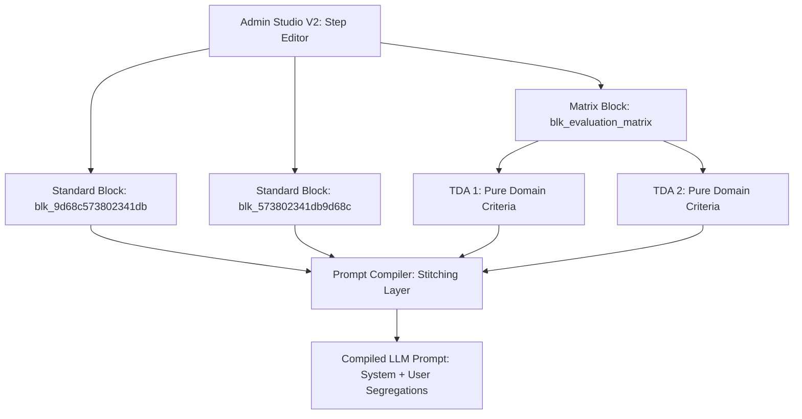

# Epic 60: Modular Extraction Decoupling (Sokean Poiminnan ja Kriteerien Modulaarinen Eriyttäminen)

> [!IMPORTANT]
> **THE COMPOSITION & TRIPARTITE BOUNDARY MANDATE**: Toteutamme tämän Epicin ilman järjestelmärakenteiden kovakoodausta backend-koodiin tai tarpeetonta toistoa tietokantaan (No Duct-Tape). Kaikki järjestelmätason toimintaohjeet (kuten "Blind Extraction Engine" -mandaatti) pidetään erillään domain-tason semanttisista totuusehdoista (TDA Assertions). Tämä saavutetaan hyödyntämällä Admin Studio V2:n polymorfisia **Standard PromptBlockeja**, jotka koostetaan dynaamisestiaskeleiden (Steps) tasolla ilman versionhallinnan ulkopuolisia "maagisia" taustaprompteja.

---

## 1. Yhteenveto ja Tavoite (Objective)

Tämän Epicin tavoitteena on poistaa järjestelmätason evidenssinpoimintaohjeiden (esim. *"Blind Extraction Engine"* -säännöt, *"5-step Parsing Log"* -ohjeet ja *"contextual_override"* -rajaukset) toisto ja kovakoodaus yksittäisten tietokanta- ja seed-tason TDA-väitteiden (`ai_rule_description`) sisältä. 

### Nykytilan Ongelma:
Nykytilassa jokainen tietokantaan (`seed_data.json` ja TinyDB) tallennettu TDA-väite sisältää saman valtavan järjestelmätason lakitekstiboilereplaten (kuten *"REQUIRED TARGET: Scan ONLY... You are a Blind Extraction Engine... Return JSON null..."*).
* **Attention Dilution (Huomion hajaantuminen)**: Yhdessä askeleessa (Step) voi olla 10+ eri TDA-väitettä. Kun järjestelmä koostaa promptin kielimallille, tämä pitkä lakiteksti toistuu jokaisen väitteen sisällä dynaamisessa XML-rakenteessa. LLM joutuu lukemaan saman monisanaisen ohjeen kymmeniä kertoja, mikä heikentää sen tarkkuutta keskittyä itse analyysityöhön.
* **Prefix Caching -tehon heikkeneminen**: Dynaamisen promptiosion tarpeeton paisuminen estää kielimallin kontekstivälimuistin (Context Caching) optimaalisen toiminnan, mikä hidastaa vasteaikoja ja nostaa token-kustannuksia turhaan.
* **SSOT-rikkomus (Single Source of Truth)**: Jos poimintaprotokollaa (esim. virheiden käsittelyä tai lokitusformaattia) halutaan parantaa, joudutaan manuaalisesti päivittämään tai migroimaan tuhansia tietokantarivejä, koska sääntö on monistettu jokaiseen TDA-kuvaukseen.

### Ratkaisu:
Jaetaan säännöt kahteen puhtaaseen tasoon hyödyntämällä Admin Studio V2:n modulaarista arkkitehtuuria:
1. **Globaali Järjestelmäohje (Modular Mandate)**: Luodaan oma erillinen Standard `PromptBlock` (tyyppi: `instruction`) nimeltä `Globaali Evidenssin Poimintaprotokolla` (tunnus: `block_extraction_protocol_zerotrust`), jota hallinnoidaan suoraan Admin Studiossa yhtenäisessä SSOT-pisteessä.
2. **Kriteerikohtaiset Semanttiset Ehdot (Domain Criteria)**: Puhdistetaan jokaisen TDA-väitteen `ai_rule_description` kaikesta globaalista toistoboilereplatesta, jolloin tietokantaan jää vain ja ainoastaan kyseisen väitteen spesifi totuusehto (esim. ARMA Compliance -havainnointi).
3. **Konseptuaalinen Kaksivaiheinen Ketjutus (Decoupled Pipeline Vision)**: Askel jaetaan kahteen loogiseen kielimalliajon vaiheeseen (Pass 1: Matalaentropinen mekaaninen poiminta, Pass 2: Korkeaentropinen kognitiivinen pisteytys ja sanallinen valmennussynteesi).

### 1.1. Arkkitehtuuristen sääntöjen huomiointi (Compliance Matrix)

Suunnittelu noudattaa ehdottomasti seuraavia ydinohjeita:
1. **[00-antigravity-core.md](file:///c:/src/quorum/.agents/rules/00-antigravity-core.md)**:
   * **Cross-Language Mapping Mandate**: Kaikki TDA-väitteet ja protokollat kirjoitetaan ainoastaan englanniksi (System Language). Kielimalli kytkee nämä dynaamisesti kohdekieleen (esim. suomi) suoritusaikana.
   * **Universal Fail-Fast & TDD**: Pydantic-tason tyyppien eheyttä valvotaan tiukasti ilman silent-ohituksia.
2. **[01-python-backend.md](file:///c:/src/quorum/.agents/rules/01-python-backend.md)**:
   * **Opaque Stripe ID Mandate**: Jokainen uusi palikka (esim. `blk_573802341db9d68c`) ja työnkulun askel käyttää opakkeja stripe-tunnisteita. Suhteita tai hakuja ei koskaan sidota slugeihin.
   * **Prompt Compiler Immutability**: Suojataan kääntäjämoottori maagisilta muutoksilta (katso varoitus Phase 2:n kohdalla).
3. **[05_llm_architecture.md](file:///c:/src/quorum/.agents/rules/05_llm_architecture.md)**:
   * **High-Fidelity Prompting & Caching Efficiency**: Eriyttämällä globaali protokolla dynaamisista TDA-kriteereistä maksimoidaan kielimallin kontekstivälimuistin (Prefix Caching) toiminta, mikä alentaa kustannuksia ja nopeuttaa vasteaikoja.
   * **Hybrid Prompting**: Compiled prompt -rakenne hyödyntää XML-tageja semanttisten rajojen vahvistamiseen attention drift -haittoja vastaan.

---

## 2. Arkkitehtuurinen Koostumusmalli (Modular Composition Pipeline)

Työnkulun askel koostetaan dynaamisesti Admin Studiossa kolmesta polymorfisesta palikkatyypistä:



### Palikoiden Roolijako (Separation of Concerns):

1. **Roolipalikka (`blk_9d68c573802341db`)**:
   * Määrittää kielimallin persoonan, asenteen ja analyyttisen syvyyden (esim. *"Kriittinen Auditoija"*). Tunnistetaan ja ladataan yksinomaan Opaque Stripe ID -avaimella, ei koskaan slugilla.
2. **Poimintaprotokollapalikka (`blk_573802341db9d68c`)**:
   * Määrittää mekaaniset poimintasäännöt, ankkurointivaatimukset ja virheiden käsittelyn (esim. *"You are a Blind Extraction Engine... exact_quote MUST be empty if contextual_override is True..."*).
   * Tämä lähetetään LLM-kutsussa **tasan kerran** askeleen alussa (System Prompt / General Execution Parameters).
3. **Matriisipalikka (`blk_evaluation_matrix`)**:
   * Sisältää litteän listan dynaamisia TDA-väitteitä (kuten `tda_21d7952c2bf6393c`), joiden kuvaukset ovat täysin puhtaita ja lyhyitä liiketoimintasääntöjä.

---

## 3. Pydantic-tason Mallit ja Suunnittelu (Proposed Schema Parity)

Käytämme olemassa olevaa Pydantic V2 -ydintämme ilman taaksepäinyhteensopivuuden oikoteitä (`ConfigDict(extra='forbid', strict=True)`). 

### 3.1. `PromptBlock` Domain-malli (`backend_v2/models/v2_core.py`)
Määritellään uusi globaali standardisulkutunnus ja luokkakehys standardille poimintaprotokollalle:

```python
class PromptBlockCategory(str, Enum):
    ROLE = "role"
    MANDATE = "mandate"          # Uusi kategoria poimintaprotokollille
    MATRIX = "matrix"
    TEXT = "text"
    INSTRUCTION = "instruction"
```

### 3.2. Step-määrittelyn Koostumus (`backend_v2/models/v2_core.py`)
Varmistetaan, että `WorkflowStep` (Step) pystyy kantamaan mukanaan useita ohje- ja protokollapalikoiden ID-viitteitä:

```python
class WorkflowStep(V2CoreBase):
    id: str = Field(..., pattern=r"^stp_[a-z0-9]+$")
    name: LocalizedString
    description: LocalizedString
    # Koostumuskentät polymorfiselle kehotekartoitukselle
    role_block_id: str | None = Field(default=None, description="Reference to block_role_*")
    extraction_protocol_block_id: str | None = Field(default=None, description="Reference to block_extraction_protocol_*")
    criteria_block_ids: list[str] = Field(default_factory=list, description="References to matrix or text blocks")
```

---

## 4. Toteutusvaiheet (Implementation Phases)

### Phase 1: Tietokannan ja Seed-datan Puhdistus (Database Refactoring)
* **Toimenpide 1**: Luodaan `backend_v2/seed/seed_data.json` -tiedostoon uusi standardi ohjepalikka:
  ```json
  {
    "id": "blk_573802341db9d68c",
    "slug": "block_extraction_protocol_zerotrust",
    "label": {
      "default_locale": "en",
      "translations": {
        "en": "Global Zero-Trust Evidence Extraction Protocol",
        "fi": "Globaali Zero-Trust evidenssin poimintaprotokolla"
      }
    },
    "type": "instruction",
    "category_id": "instruction",
    "ai_description": "BANNED CONCEPTS: Do NOT evaluate user intent... TRACE REQUIREMENT: Output ONLY... ENFORCEMENT MANDATE: You are a Blind Extraction Engine..."
  }
  ```
* **Toimenpide 2**: Puhdistetaan kaikki `seed_data.json`-tiedostossa olevat TDA-väitteiden (`ai_rule_description`) kuvaukset poistamalla niistä toistuvat järjestelmäohjeet, jättäen vain kunkin väitteen lokaalin semanttisen totuusehdon.
* **Toimenpide 3**: Ajetaan alustus `uv run python backend_v2/seed/run_seed.py` muutosten viemiseksi TinyDB-kantaan.

### Phase 2: Kääntäjämoottorin Päivitys (Prompt Compiler Evolution)

> [!WARNING]
> **PROMPT COMPILER IMMUTABILITY (01-python-backend.md)**: `prompt_compiler.py` on arkkitehtuurin jäädytetty kulmakivi. Sen muokkaaminen on erittäin sensitiivistä, koska se vaikuttaa dynaamisen skeeman muodostukseen ja deterministiseen kääntämiseen. Ennen kuin Phase 2:n koodimuutokset aloitetaan, on saatava erillinen ja nimenomainen käyttäjän hyväksyntä (USER CONFIRMATION) ja suunnitelman vahvistus.

* **Toimenpide 1**: Muokataan `prompt_compiler.py`-tiedoston `compile_static_instructions`-metodia:
  * Jos askeleeseen on liitetty `extraction_protocol_block_id`, ladataan tämä ohjepalikka tietokannasta ja injektoidaan sen teksti **tasan kerran** askeleen `base_system_prompt`-rakenteeseen.
* **Toimenpide 2**: Muokataan `prompt_factory.py`-koodia tukemaan uutta koostusmallia ja varmistetaan, että tyhjien tai litteiden TDA-sääntöjen renderöinti sujuu virheettömästi ilman attention drift -haittoja.

### Phase 3: Käyttöliittymä (Flutter Client & Admin Studio)
* **Toimenpide 1**: Varmistetaan, että Admin Studio V2:n kehotelistauksessa näytetään uusi `block_extraction_protocol_zerotrust`-palikka, ja että ylläpitäjä voi muokata sen sisältöä vapaasti käyttöliittymän kautta.
* **Toimenpide 2**: Päivitetään Askeleet-editori sallimaan poimintaprotokollan dynaaminen valinta ja liittäminen työnkulun eri vaiheisiin.

---

## 5. Definition of Done (DoD)

1. **SSOT Eristys (Parity Audit)**: Tietokannan TDA-väitteet (`ai_rule_description`) eivät sisällä merkkiäkään globaalista sääntöboilerplatesta. Kaikki yleiset ohjeet asuvat keskitetysti `blk_573802341db9d68c`-palikassa. Tunnisteet noudattavat Opaque Stripe ID -mandaattia, ja relaatiot haetaan ainoastaan tämän ID:n, ei koskaan slugin kautta.
2. **Ei kovakoodausta backendissä**: "Blind Extraction Engine" -kieliasu tai parsing log -ohjeet eivät ole kovakoodattuina merkkijonoina backendin Python-koodissa, vaan ne ladataan dynaamisesti tietokannan ohjepalikasta ID-viitteellä.
3. **Kielimallin tarkkuus ja huomio (Parity)**: LLM-promptin koko pienenee merkittävästi ja dynaamisen sääntötoiston poistuminen parantaa determinististä poimintatarkkuutta (todistettavissa testiajoissa).
4. **Laatuportti (Universal Quality Gate)**: Kaikki olemassa olevat 688 yksikkötestiä ja mahdolliset uudet TDD-testit menevät puhtaasti läpi MyPy-tyyppitarkastuksesta ja kattavuudesta (>76% coverage):
   ```powershell
   uv run python scripts/backend_audit_loop.py backend_v2/ --test --openapi
   ```
5. **Dynaaminen tallennus**: Kaikki Admin Studiossa tehdyt muutokset tähän globaaliin palikkaan tallentuvat onnistuneesti TinyDB-tietokantaan ja ne voidaan synkronoida takaisin seeding-tiedostoon ylläpitoskripteillä.
