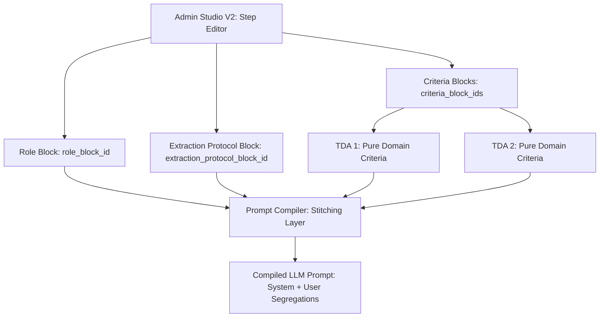

# Epic 60: Modular Extraction Decoupling (Sokean Poiminnan ja Kriteerien Modulaarinen Eriyttäminen)

> [!IMPORTANT]
> **THE COMPOSITION & TRIPARTITE BOUNDARY MANDATE**: Toteutamme tämän Epicin ilman järjestelmärakenteiden kovakoodausta backend-koodiin tai tarpeetonta toistoa tietokantaan (No Duct-Tape). Kaikki järjestelmätason toimintaohjeet (kuten "Blind Extraction Engine" -mandaatti) pidetään erillään domain-tason semanttisista totuusehdoista (TDA Assertions). Tämä saavutetaan hyödyntämällä Admin Studio V2:n polymorfisia **Standard PromptBlockeja**, jotka koostetaan dynaamisesti askeleiden (Steps) tasolla ilman versionhallinnan ulkopuolisia "maagisia" taustaprompteja.

---

## 1. Yhteenveto ja Tavoite (Objective)

Tämän Epicin tavoitteena on poistaa järjestelmätason evidenssinpoimintaohjeiden (esim. *"Blind Extraction Engine"* -säännöt, *"5-step Parsing Log"* -ohjeet ja *"contextual_override"* -rajaukset) toisto ja kovakoodaus yksittäisten tietokanta- ja seed-tason TDA-väitteiden (`ai_rule_description`) sisältä. 

### Nykytilan Ongelma:
Nykytilassa jokainen tietokantaan (`seed_data.json` ja TinyDB) tallennettu TDA-väite sisältää saman valtavan järjestelmätason lakitekstiboilereplaten (kuten *"REQUIRED TARGET: Scan ONLY... You are a Blind Extraction Engine... Return JSON null..."*).
* **Attention Dilution (Huomion hajaantuminen)**: Yhdessä askeleessa (Step) voi olla 10+ eri TDA-väitettä. Kun järjestelmä koostaa promptin kielimallille, tämä pitkä lakiteksti toistuu jokaisen väitteen sisällä dynaamisessa XML-rakenteessa. LLM joutuu lukemaan saman monisanaisen ohjeen kymmeniä kertoja, mikä heikentää sen tarkkuutta keskittyä itse analyysityöhön.
* **Prefix Caching -tehon heikkeneminen**: Dynaamisen promptiosion tarpeeton paisuminen estää kielimallin kontekstivälimuistin (Context Caching) optimaalisen toiminnan, mikä hidastaa vasteaikoja ja nostaa token-kustannuksia turhaan.
* **SSOT-rikkomus (Single Source of Truth)**: Jos poimintaprotokollaa (esim. virheiden käsittelyä tai lokitusformaattia) halutaan parantaa, joudutaan manuaalisesti päivittämään tai migroimaan tuhansia tietokantarivejä, koska sääntö on monistettu jokaiseen TDA-kuvaukseen.

### Ratkaisu (Vaihtoehto A: Strict Pydantic Schema Separation):
Jaetaan säännöt kahteen puhtaaseen tasoon ja toteutetaan **tarkka arkkitehtuurinen skeemaerottelu**:
1. **Globaali Järjestelmäohje (Modular Mandate)**: Luodaan oma erillinen Standard `PromptBlock` (tyyppi: `instruction`) nimeltä `Globaali Evidenssin Poimintaprotokolla` (tunnus: `block_extraction_protocol_zerotrust`), jota hallinnoidaan suoraan Admin Studiossa yhtenäisessä SSOT-pisteessä.
2. **Kriteerikohtaiset Semanttiset Ehdot (Domain Criteria)**: Puhdistetaan jokaisen TDA-väitteen `ai_rule_description` kaikesta globaalista toistoboilereplatesta, jolloin tietokantaan jää vain ja ainoastaan kyseisen väitteen spesifi totuusehto (esim. ARMA Compliance -havainnointi).
3. **Tiukka koostumuskenttien eriyttäminen (Strict Schema Separation)**: Korvataan dynaaminen ja epämääräinen `prompt_blocks`-lista backendin `Step`- ja Flutterin `NodeStrategy`-luokissa tiukasti tyypitetyillä koostumuskentillä (`role_block_id`, `extraction_protocol_block_id`, `criteria_block_ids`).

---

## 2. Arkkitehtuuristen sääntöjen huomiointi (Compliance Matrix)

Kehityksessä on ehdottomasti noudatettava ja ohjattava noudattamaan seuraavia `c:\src\quorum\.agents\rules` -hakemiston alaisia virallisia sääntöjä:

### 2.1. Ydinjärjestelmä ja laatuportit (00-antigravity-core.md & 01-python-backend.md)
* **The Zero-Compromise Pledge (00)**: Mitään fallback- tai ohitusketjuja ei sallita (kuten `getattr(obj, 'extraction_protocol_block_id', None)`). Jos viitattu lohko puuttuu, järjestelmän tulee kaatua välittömästi `ConfigurationError`-virheeseen.
* **Opaque Stripe ID Mandate (01)**: Kaikki luotavat PromptBlock-tunnisteet (esim. `blk_573802341db9d68c`) ja vaiheiden tunnisteet (esim. `stp_abc123`) MUST noudattaa tiukkaa opakkia etuliitemuotoa. Relaatioita tai hakuja ei koskaan sidota slugeihin.
* **Strict Pydantic V2 Rust (01)**: Kaikki Pydantic-mallit käyttävät Rust-pohjaista validointia. Kenttien validointi tehdään mieluiten suoraan `Field(pattern=...)` -määrittelyillä suorituskyvyn maksimoimiseksi.
* **Tripartite Rendering Boundary (01)**: Järjestelmätason ohjeet ja dynaamiset kehotteet eivät saa sisältää käyttöliittymän muotoilusääntöjä (kuten Markdown-taulukoiden rakenteita).

### 2.2. Siementietokannan muokkaukset (03_seed_vault.md)
* **Live Database Mutation Ban**: Kehityksen TinyDB-tietokantaa (`db_v2.json`) ei saa muokata lennosta tai käsin. Kaikki muutokset on tehtävä siemenkannan lähdetiedostoon `backend_v2/seed/seed_data.json`.
* **Inline Terminal Scripting Ban**: Merkkijonokorvauksia JSON-tiedostoon ei saa tehdä komentoriviltä (esim. `sed` tai PowerShell-kehityksellä). Muutoksiin MUST käyttää erillistä Python-skriptiä `modify_seed.py` eheyden takaamiseksi.
* **Vault Mutation Protocol**: Muutokset siementietoihin ajetaan tiukan 7-vaiheisen kaavan mukaan: `PROPOSE` -> `MODIFY` -> `BACKUP` -> `SCRIPT` -> `EXECUTE` -> `VERIFY` (testiajo) -> `RE-SEED`.

### 2.3. Kielimalli- ja tulosarkkitehtuuri (05_llm_architecture.md)
* **Native Language System Prompts**: Kaikki järjestelmätason ohjeet ja protokollat (mukaan lukien uusi `block_extraction_protocol_zerotrust`) MUST kirjoittaa yksinomaan englanniksi. LLM-mallit toimivat heikoimmin, jos järjestelmäohjeita kirjoitetaan suomeksi.
* **Naked Prompt Injection Ban**: Dynaamisia kehotteita tai sääntöjä ei saa liittää promptiin ilman selkeitä XML-rajauksia. Lohkon ohjeet on käärittävä sopiviin tageihin (esim. `<STATIC_INSTRUCTION>`).
* **Role Segregation and Fencing**: Käyttäjän syöttämä aineisto on eristettävä ehdottomasti `<user_payload>...</user_payload>` -tageilla kehotemyrkytystä vastaan.
* **High-Fidelity Prompting and Caching**: Dynamic-ohjeet ja suoritusaikaiset muuttujat (kuten päivämäärät) on eristettävä heti promptin alkuun `<execution_parameters>` -tagiin, jotta static-järjestelmäohjeet pysyvät muuttumattomina ja tehokkaasti välimuistissa (Context Caching).
* **LLM Structured Execution Mandate**: Kielimallilta ei pyydetä JSONia vapaana tekstinä, vaan hyödynnetään ainoastaan `LLMTaskExecutor.execute_structured_task()` -metodia Native Structured Outputs API:n kautta. Syntaktisia korjaussilmukoita ei saa koodata backend-tasolle.

---

## 3. Arkkitehtuurinen Koostumusmalli (Modular Composition Pipeline)

Työnkulun askel koostetaan dynaamisesti Admin Studiossa kolmesta polymorfisesta palikkatyypistä:



### Palikoiden Roolijako (Separation of Concerns):

1. **Roolivalinta (`role_block_id`)**:
   * Viittaa `PromptBlock`-olioon, joka määrittää kielimallin persoonan, asenteen ja analyyttisen syvyyden (esim. *"Kriittinen Auditoija"*, `blk_role_critic`). Tunnistetaan ja ladataan yksinomaan Opaque Stripe ID -avaimella.
2. **Evidenssin poimintaprotokolla (`extraction_protocol_block_id`)**:
   * Viittaa ohjepalikkaan `blk_573802341db9d68c` (`block_extraction_protocol_zerotrust`), joka määrittää mekaaniset poimintasäännöt, ankkurointivaatimukset ja virheiden käsittelyn (esim. *"You are a Blind Extraction Engine..."*).
   * Tämä injektoidaan LLM-kutsun `base_system_prompt`-rakenteeseen **tasan kerran**.
3. **Kriteerilohkot (`criteria_block_ids`)**:
   * Lista `PromptBlock`-tunnisteita (esim. `blk_440a5fef9331451b` Toulmin-argumentaatio), jotka sisältävät puhtaat semanttiset TDA-totuusehdot ilman yleistä lakitekstitoistoa.

---

## 4. Pydantic-tason Mallit ja Suunnittelu (Proposed Schema Parity)

Käytämme olemassa olevaa Pydantic V2 -ydintämme ilman taaksepäinyhteensopivuuden oikoteitä (`ConfigDict(extra='forbid', strict=True)`).

### 4.1. Python Backend `Step` -malli (`backend_v2/models/v2_core.py`)

Päivitetään olemassa oleva `Step`-malli eriyttämällä dynaaminen `prompt_blocks`-lista tiukoiksi koostumuskentiksi. Roolin ja protokollan puuttuminen suoritusaikana laukaisee `ConfigurationError`-virheen:

```python
class Step(V2CoreBase):
    """Isolated, reusable orchestrator cognitive module (e.g. Guard or step_input_processing).
    Formerly known as TaskBlueprint.
    """
    id: str = Field(pattern=r"^([a-z]{2,5})_[a-fA-F0-9]{16,32}$", description="Unique UUID for storage optionally")
    slug: str = Field(description="Human-readable identifier (e.g., 'step_guard')")
    organization_id: str | None = Field(default=None, description="Tenant organization ID.")
    name: I18nText = Field(description="Localized step name")
    description: I18nText | None = Field(default=None, description="Detailed step context")
    type: Literal["llm", "logic"] = Field(default="llm", description="Step execution type (llm or native logic)")
    hook: str | None = Field(default=None, description="Native Python hook to execute if type is 'logic'")
    
    # EPIC 60: Erotetut arkkitehtoniset koostumuskentät
    role_block_id: str | None = Field(default=None, description="Reference to role block_role_*")
    extraction_protocol_block_id: str | None = Field(default=None, description="Reference to block_extraction_protocol_*")
    criteria_block_ids: list[str] = Field(default_factory=list, description="References to matrix or text blocks")
    
    pre_hooks: list[str] = Field(default_factory=list)
    post_hooks: list[str] = Field(default_factory=list)
    safety: Literal["safe", "unsafe"] = Field(default="safe")
    allowed_mcp_tools: list[str] = Field(default_factory=list)
    model_strategy: str | None = Field(default=None)
    expected_inputs: list[str] = Field(default_factory=list)
    output_schema: dict[str, Any] | None = Field(default=None)

    @model_validator(mode="after")
    def validate_step_consistency(self) -> Step:
        """Strict fail-fast validation to ensure Step is structurally complete."""
        if self.type == "llm":
            if not self.model_strategy:
                msg = f"LLM Step '{self.slug}' must declare an explicit model_strategy (Zero-Fallback Rule)."
                raise ValueError(msg)
            if not self.criteria_block_ids:
                msg = f"LLM Step '{self.slug}' must define at least one criteria_block_id."
                raise ValueError(msg)
            if not self.extraction_protocol_block_id:
                msg = f"LLM Step '{self.slug}' must define a valid extraction_protocol_block_id."
                raise ValueError(msg)
        if self.type == "logic" and not self.hook:
            msg = f"Logic Step '{self.slug}' must define a native 'hook' execution target."
            raise ValueError(msg)
        return self
```

### 4.2. Flutter Client `NodeStrategy` -malli (`client_app_v2/.../workflow.dart`)

Päivitetään Flutterin Freezed-mallit vastaamaan täysin backendin uutta skeemaerottelua. Tämä poistaa vanhan `promptBlocks`-kentän:

```dart
@Freezed(unionKey: 'type')
sealed class NodeStrategy with _$NodeStrategy {
  const NodeStrategy._();

  @JsonSerializable(disallowUnrecognizedKeys: true)
  @FreezedUnionValue('llm')
  const factory NodeStrategy.llm({
    @StrictOpaqueIdConverter() required String id,
    required String slug,
    required I18nText name,
    I18nText? description,
    String? hook,
    
    // EPIC 60: Erotetut arkkitehtoniset koostumuskentät
    @StrictOpaqueIdConverter() String? roleBlockId,
    @StrictOpaqueIdConverter() String? extractionProtocolBlockId,
    @Default([]) List<String> criteriaBlockIds,
    
    @Default([]) List<String> preHooks,
    @Default([]) List<String> postHooks,
    @Default('safe') String safety,
    @Default([]) List<String> allowedMcpTools,
    @Default([]) List<String> expectedInputs,
    Map<String, dynamic>? outputSchema,
    String? modelStrategy,
    String? organizationId,
  }) = NodeStrategyLlm;

  @JsonSerializable(disallowUnrecognizedKeys: true)
  @FreezedUnionValue('logic')
  const factory NodeStrategy.logic({
    @StrictOpaqueIdConverter() required String id,
    required String slug,
    required I18nText name,
    I18nText? description,
    required String hook,
    
    // EPIC 60: Erotetut arkkitehtoniset koostumuskentät
    @StrictOpaqueIdConverter() String? roleBlockId,
    @StrictOpaqueIdConverter() String? extractionProtocolBlockId,
    @Default([]) List<String> criteriaBlockIds,
    
    @Default([]) List<String> preHooks,
    @Default([]) List<String> postHooks,
    @Default('safe') String safety,
    @Default([]) List<String> allowedMcpTools,
    @Default([]) List<String> expectedInputs,
    Map<String, dynamic>? outputSchema,
    String? modelStrategy,
    String? organizationId,
  }) = NodeStrategyLogic;

  factory NodeStrategy.fromJson(Map<String, dynamic> json) =>
      _$NodeStrategyFromJson(json);
}
```

---

## 5. Toteutusvaiheet (Implementation Phases)

### Phase 1: Tietokannan ja Seed-datan Puhdistus (Database Refactoring)

> [!IMPORTANT]
> **TIETOKANNAN MUUTOSVAATIMUS (03_seed_vault.md)**:
> Tietokantamuutokset MUST noudattaa tiukasti `vault_mutation_protocol` -sekvenssiä. Kaikki terminal- tai inline-merkkijonokorvaukset (sed, regex) ovat ehdottomasti kiellettyjä.

* **Toimenpide 1 (PROPOSE & BACKUP)**:
  * Proposoidaan muutettavat JSON-rakenteet (kts. alla) ja luodaan varmuuskopio nykyisestä seed-tiedostosta:
    ```powershell
    # Kopioidaan varmuuskopio natively ennen skriptin ajoa
    Copy-Item backend_v2/seed/seed_data.json backend_v2/seed/backups/seed_data_backup_pre_epic60.json
    ```
* **Toimenpide 2 (SCRIPT & MODIFY)**:
  * Luodaan erillinen python-skripti `tmp/modify_seed_epic60.py` muuttamaan tietokannan askeleet ja puhdistamaan TDA-väitteet:
    ```python
    # tmp/modify_seed_epic60.py
    import json
    
    with open("backend_v2/seed/seed_data.json", "r", encoding="utf-8") as f:
        data = json.load(f)
        
    # 1. Lisätään uusi globaali evidenssinpoimintalohko
    new_block = {
        "id": "blk_573802341db9d68c",
        "slug": "block_extraction_protocol_zerotrust",
        "label": {
            "default_locale": "en",
            "translations": {
                "en": "Global Zero-Trust Evidence Extraction Protocol",
                "fi": "Globaali Zero-Trust evidenssin poimintaprotokolla"
            }
        },
        "description": {
            "default_locale": "en",
            "translations": {
                "en": "Standard rules governing blind mathematical and evidence extraction tasks.",
                "fi": "Vakiomuotoiset säännöt mekaaniseen poimintaan."
            }
        },
        "category_id": "instruction",
        "type": "instruction",
        "ai_description": "REQUIRED TARGET: Scan ONLY the Target Data. BANNED SOURCES: Never read matches from user input fields or instructions. BANNED CONCEPTS: Do NOT evaluate user intent or excuse missing context. Do not evaluate if the data is 'good', only its physical presence. TRACE REQUIREMENT: Output ONLY the 5-step piped Parsing Log defined in the global framework. ENFORCEMENT MANDATE: You are a Blind Extraction Engine. Look only for explicit physical markers. IF AND ONLY IF the rule's syntactic conditions are met, extract the exact_quote. If the rule targets the ABSENCE of a feature (Negative Condition), the physical PRESENCE of that feature MUST result in a null output. Do not rationalize failures. Return JSON null for exact_quote if the syntactic chain is severed or validation fails."
    }
    
    if not any(b["id"] == "blk_573802341db9d68c" for b in data["prompt_blocks"]):
        data["prompt_blocks"].append(new_block)
        
    # 2. Puhdistetaan TDA-väitteet ja siirretään Steps-määritykset eroteltuihin koostumuskenttiin
    # (Puhdistusrutiini toteutetaan tässä tallentaen json.dump-muodossa indent=2)
    
    with open("backend_v2/seed/seed_data.json", "w", encoding="utf-8") as f:
        json.dump(data, f, indent=2, ensure_ascii=False)
    ```
* **Toimenpide 3 (EXECUTE & VERIFY)**:
  * Suoritetaan skripti `uv run python tmp/modify_seed_epic60.py` ja varmistetaan skeeman eheys:
    ```powershell
    uv run pytest backend_v2/tests/unit/test_seed_schema_alignment.py -v
    ```
* **Toimenpide 4 (RE-SEED)**:
  * Kun varmistustestit menevät puhtaasti läpi, suoritetaan tietokannan uudelleenalustus:
    ```powershell
    uv run python backend_v2/seed/run_seed.py local
    ```

### Phase 2: Kääntäjämoottorin ja Executorin Päivitys (Prompt Compiler Evolution)

* **Toimenpide 1 (Dynamic Segregation & Role segregated fencing - 05)**:
  * Päivitetään vaiheen prompt-lohkojen lataus `LLMNodeStrategy.execute` -metodissa (`backend_v2/services/orchestrator/strategies/llm.py`):
    * Ladataan erikseen `step_obj.role_block_id`, `step_obj.extraction_protocol_block_id` ja `step_obj.criteria_block_ids`.
    * Kaikki käyttäjän syötteet aidataan tiukasti `<user_payload>...</user_payload>` -tageilla kehotemyrkytystä vastaan ennen kääntämistä.
* **Toimenpide 2 (High-Fidelity Prompting and Caching - 05)**:
  * Muokataan `PromptFactory.build`-metodin allekirjoitus ja logiikka (`prompt_factory.py`):
    * Hyväksytään parametreina `role_block: PromptBlock | None`, `protocol_block: PromptBlock | None` ja `criteria_blocks: list[PromptBlock]`.
    * Kootaan system prompt siten, että `protocol_block`-ohjeet injektoidaan static-tyyppisenä kerran askeleen pääkehotteeseen. Dynaamiset parametrit ja run-aika-muuttujat eristetään promptin alkuun `<execution_parameters>` -tagien alle.
* **Toimenpide 3 (LLM Structured Execution Mandate - 05)**:
  * Varmistetaan, että `dag_executor.py` kutsuu LLM-rajapintaa ainoastaan `LLMTaskExecutor.execute_structured_task()` -metodilla, poistaen kaikki syntaktiset korjaus- tai regex-jälkikäsittelyt.

### Phase 4: Käyttöliittymä (Flutter Client & Admin Studio)

* **Toimenpide 1 (No String Localisation Mandate - 01 & 02)**:
  * Kaikki uudet Admin Studio V2 -lomakkeen UI-tekstit (esim. `roleBlockIdDropdownLabel`) MUST sijoittaa yksinomaan `.arb`-kielitiedostoihin. Koodiin ei saa kovakoodata yhtäkään merkkijonoa suomeksi tai englanniksi.
* **Toimenpide 2 (Code Generation)**:
  * Suoritetaan Flutter-koodigeneraattori päivittämään Freezed- ja JSON-serialisointitiedostot:
    ```powershell
    uv run python scripts/flutter_audit_loop.py client_app_v2 --build
    ```

---

## 6. Definition of Done (DoD)

1. **SSOT Eristys (Parity Audit)**: Tietokannan TDA-väitteet (`ai_rule_description`) eivät sisällä merkkiäkään globaalista sääntöboilerplatesta. Kaikki yleiset ohjeet asuvat keskitetysti `blk_573802341db9d68c`-palikassa. Tunnisteet noudattavat Opaque Stripe ID -mandaattia, ja relaatiot haetaan ainoastaan tämän ID:n kautta.
2. **Ei kovakoodausta backendissä**: "Blind Extraction Engine" -kieliasu tai parsing log -ohjeet eivät ole kovakoodattuina merkkijonoina backendin Python-koodissa, vaan ne ladataan dynaamisesti tietokannan ohjepalikasta ID-viitteellä.
3. **Kielimallin tarkkuus ja huomio (Parity)**: LLM-promptin koko pienenee merkittävästi ja dynaamisen sääntötoiston poistuminen parantaa determinististä poimintatarkkuutta.
4. **Laatuportti (Universal Quality Gate)**: Kaikki olemassa olevat yksikkötestit ja uudet TDD-testit menevät puhtaasti läpi MyPy-tyyppitarkastuksesta ja kattavuudesta (>76% coverage):
   * Backend-testit:
     ```powershell
     uv run python scripts/backend_audit_loop.py backend_v2/ --test --openapi
     ```
   * Frontend-testit:
     ```powershell
     uv run python scripts/flutter_audit_loop.py client_app_v2
     ```
5. **Dynaaminen tallennus**: Kaikki Admin Studiossa tehdyt muutokset tähän globaaliin palikkaan tallentuvat onnistuneesti TinyDB-tietokantaan ja ne voidaan synkronoida takaisin seeding-tiedostoon ylläpitoskripteillä.
