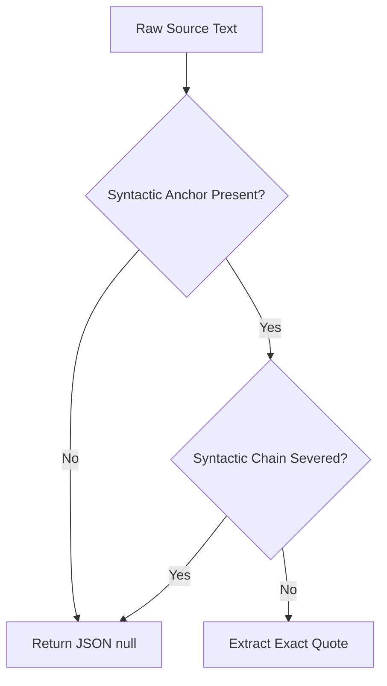

# Epic 61: Evaluation Directives Hardening & Vice Rules Operationalization (Evaluointisääntöjen Kovettaminen ja Käänteisten Säännösten Tyhjentävä Operationalisointi)

> [!IMPORTANT]
> **THE DETERMINISTIC COGNITIVE PARITY MANDATE**: Tämän Epicin ytimenä on vähentää LLM-pohjaisen evaluoinnin stokastista varianssia (itse-konsistenssin nosto $>95\ \%$ tasolle ja Shannon-entropian painaminen lähelle nollaa). Kaikki evaluointisäännöt (TDA-väitteet) operationalisoidaan matemaattisen tarkoiksi ja poistetaan laadulliset kokonaistulkinnat. Tämän saavuttamiseksi askeleittaiset syntaktiset ankkurit (Semantic Anchors) pakotetaan englanninkielisiksi (System Language), ja käänteisissä säännöissä (Vice Rules) otetaan käyttöön tiukka "epäselvissä tapauksissa tulos on NULL" -suodatus.

---

## 1. Yhteenveto ja Tavoite (Objective)

Epävarmuus- ja hajonta-analyyseissä (`mismatch_traces_raw.md`) on todettu, että vaikka deterministinen sääntöjärjestys, aikatokenien korjaus ja hyperparametrien (`top_p`, `top_k`) tuning nostavat itse-konsistenssia merkittävästi, suurin osa jäljelle jäävästä 9,1 % varianssista (17 erimielistä atomia) johtuu **evaluointisääntöjen laadullisesta heilahtelusta** (fuzzy criteria) ja **käänteisten sääntöjen (vice rules) loogisesta epämääräisyydestä**.

### 1.1. Tunnistetut Ongelmakohdat

1. **Laadulliset arviot (Fuzzy Qualitative Judgments)**:
   * Säännöt, kuten `tda_c74c4367acc028cf` (sokea metodologia), epäonnistuvat, koska ne vaativat LLM-arvioijaa tekemään laadullisen tulkinnan siitä, omaksuuko käyttäjä metodologian "sokeasti" vai "aktiivisesti ohjaten". Koska raja on liukuva, pienetkin muutokset edeltävässä keskusteluhistoriassa saavat arvioijan tekemään risteäviä `PASS`/`FAIL` -päätöksiä.
2. **Käänteiset säännöt eli "pahe-säännöt" (Vice Rules / Negative Conditions)**:
   * Säännöt, kuten `tda_3d3f1162d2ff1558` (rajoitteen poisselittäminen) ja `tda_d0b6789c895808eb` (binäärinen pelkistäminen), etsivät loogisia virheitä tai kielellistä puutetta (esim. *"X on ainoa tapa Y:n saavuttamiseksi"*).
   * Jos arviointilogiikka ei löydä selvää rikkomusta, tai jos se on rajatapaus, LLM-arvioija alkaa rationalisoida tulosta ristiin: toinen ajo tulkitsee epäsuoran ilmaisun rikkomukseksi, toinen taas pitää sitä puhtaana ehtona.
3. **Double Negative -loukut arviointilogiikassa**:
   * Kun sääntö etsii "pahetta" tai "puutetta", sen totuusehto kääntyy ristiin: rikkomuksen löytyminen tarkoittaa lopputuloksen kannalta `FAIL` (pistemäärän menetys), mutta säännön arvioinnin kannalta se merkitään usein arvolla `Rule Violated = True` tai `VALIDATION DECISION: FAIL`. Tämä käänteinen logiikka sekoittaa LLM-arvioijan huomiokykyä (attention drift).

---

## 2. Arkkitehtuuriset Parannustoimenpiteet

Toteutamme kaksivaiheisen korjausarkkitehtuurin stabiiliuden varmistamiseksi:

### 2.1. TDA-väitteiden syntaktinen ankkurointi (Operationalizing Semantic Anchors)

Kaikki heilahtelevat TDA-väitteet uudelleenmuotoillaan siten, että ne eivät pyydä arvioijaa tulkitsemaan tekijän *intentiota* tai tekemään *yleisluontoista laatuarviota*, vaan seuraamaan **tiukkoja syntaktisia askelia ja fyysisiä ankkurisanoja**:



* **Step-by-Step Pipeline**: Säännössä on oltava selkeät, peräkkäiset vaiheet (Step 1: Etsi ankkurisana X, Step 2: Tarkista soveltuuko se rajauskenttään Y).
* **Banned Intent Evaluation**: Säännöissä kielletään nimenomaisesti käyttäjän motiivien tai oletetun henkisen tilan arviointi (esim. *"Do NOT evaluate user intent or excuse missing context"*).

### 2.2. Käänteisten sääntöjen (Vice Rules) deterministinen Null-suodatus

Käänteisissä säännöissä, joissa ehto täyttyy silloin kun jotain puuttuu tai kun havaitaan looginen virhe, otetaan käyttöön **Zero-Trust Null-suodatus**:

1. **Strict Anchor Mandatory**: Säännön on vaadittava selkeä, tunnistettava syntaktinen ankkuri (esim. absoluuttinen kausaalisana *"only"*, *"peruuttamaton"* tai disjunktiomarkkeri *"either... or"*). Jos ankkuria ei löydy fysiologisena sanana, arviointi päättyy heti $\rightarrow$ `JSON null`.
2. **"In Case of Ambiguity, Return NULL"**: Arvioijan prompteihin ja sääntöjen XML-rakenteeseen lisätään tiukka ohjeistus:
   > *"If the semantic chain is severed, or if there is any ambiguity in whether the syntactic conditions are met, you MUST return JSON null for exact_quote. Do not rationalize or attempt to excuse missing evidence."*
3. **Inverse Rule Normalization**: Varmistetaan, että `seed_data.json` -tasolla säännön odotettu lopputulos (`expected_behavior`) ja arviointimoottorin palauttamat boolean-arvot täsmäävät loogisesti siten, ettei arvioijan tarvitse käsitellä tuplakieltoja (double negatives).

---

## 3. Pydantic-tason ja Evaluointistrategian muutokset

> [!WARNING]
> **PROMPT COMPILER & STRATEGY IMMUTABILITY**: Evaluointistrategian (`llm_execution`) koodimuutokset edellyttävät aina erillistä vahvistusta ja yksikkötestien suorittamista, jotta laatuportti ei rikkoonnu.

### 3.1. Sääntöjen operationalisointi `seed_data.json`-tiedostossa

Esimerkki korjatusta stokaattisesta säännöstä `tda_c74c4367acc028cf` (aiemmin: "käyttäjä omaksuu sokeasti tekoälyn metodologian"):

#### Vanha epävakaa muotoilu:
> *"REQUIRED TARGET: Scan ONLY the Target Data. EXTRACTION CONDITION: the user explicitly adopts the AI's proposed framework without adding their own constraints. BANNED CONCEPTS: Do NOT evaluate user intent..."* (Tämä johti 1.000 entropiaan, koska arvioija tulkitsi "omaksumisen" eri tavoin).

#### Uusi kovetettu muotoilu:
```markdown
REQUIRED TARGET: Scan ONLY user prompts.
STEP 1 (Syntactic Anchor): Find explicit user phrases of blind procedural surrender (must be one of: 'proceed with that approach', 'do what you suggested', 'let us use your structure', 'use your steps').
STEP 2 (Negative Condition): Reject if the user introduces at least one custom business rule, custom constraint, or alternative categorization model (e.g., 'supermegatrends') in the same message.
AMBIGUITY PROTOCOL: If the exact surrender phrase is absent, or if it is followed by custom constraints, you MUST return JSON null.
```

---

## 4. Toteutusvaiheet (Implementation Phases)

### Phase 1: Epävakaiden TDA-sääntöjen uudelleen operationalisointi (`seed_data.json`)
* **Toimenpide 1**: Tunnistetaan `mismatch_traces_raw.md`-raportista 5 kaikkein epävakainta TDA-väitettä (entropia 1.000, kuten `tda_c74c4367acc028cf`, `tda_d204baf0bdf74ff7`, `tda_3d3f1162d2ff1558`, `tda_d0b6789c895808eb`).
* **Toimenpide 2**: Kirjoitetaan TDA-väitteiden kuvaukset (`seed_data.json`) uusiksi yllä olevan syntaktisen ankkuroinnin ja tyhjentävän Ambiguity Protocol -mandaatin mukaisesti.
* **Toimenpide 3**: Synkronoidaan TinyDB-kehitystietokanta ajamalla seederi:
  ```powershell
  uv run python backend_v2/seed/run_seed.py
  ```

### Phase 2: Evaluointipromptien ja Arviointimoottorin tiukentaminen (Prompt Engine)
* **Toimenpide 1**: Varmistetaan, että `block_extraction_protocol_zerotrust` (`blk_573802341db9d68c`) tai vastaavat järjestelmäpalikat sisältävät tiukan globaalin determinismiohjeen:
  > *"When evaluating negative conditions or presence of flaws (vice rules), you must look ONLY for physical semantic matches. If the text does not contain the exact physical anchors defined in the rule, return JSON null. Speculation is strictly banned."*
* **Toimenpide 2**: Päivitetään testitapaukset `backend_v2/tests/` varmistamaan, että arviointimoottori käsittelee nämä null-tulokset oikein ja fail-fast-suojatusti ilman kaatumisia.

### Phase 3: Validointi ja Vakaustestit (Verification & Stability Loop)
* **Toimenpide 1**: Ajetaan kaksi peräkkäistä ajoa ja vertaillaan tuloksia `diff_executions.py`-skriptillä:
  ```powershell
  uv run python scratch/diff_executions.py [run1_id] [run2_id]
  ```
* **Toimenpide 2**: Varmistetaan, että epävakaiden sääntöjen entropia tippuu nollaan ja parittainen konsistenssi saavuttaa yli 95 % tason.

---

## 5. Definition of Done (DoD)

1. **Zero Fuzzy Directives**: Kaikki viisi keskeistä epävakaata TDA-väitettä on puhdistettu laadullisesta päättelystä ja varustettu eksplisiittisellä syntaktisella ankkuripolulla.
2. **Explicit Null Protocol**: Arviointipromptissa on selkeä ja ehdoton "epäselvissä tapauksissa NULL" -ohjeistus, mikä estää LLM:ää arvaamasta tai keksimästä perusteluja.
3. **Green Quality Gate**: Kaikki yksikkö- ja integrointitestit menevät puhtaasti läpi backend-auditointisilmukassa:
   ```powershell
   uv run python scripts/backend_audit_loop.py backend_v2/ --test
   ```
4. **Stable Self-Consistency**: Kahden identtisen ajon itse-konsistenssi on todistettavasti noussut, ja aiemmin heilahdelleet TDA-atomit ovat stabiileja (sama arvo kummassakin ajossa).
