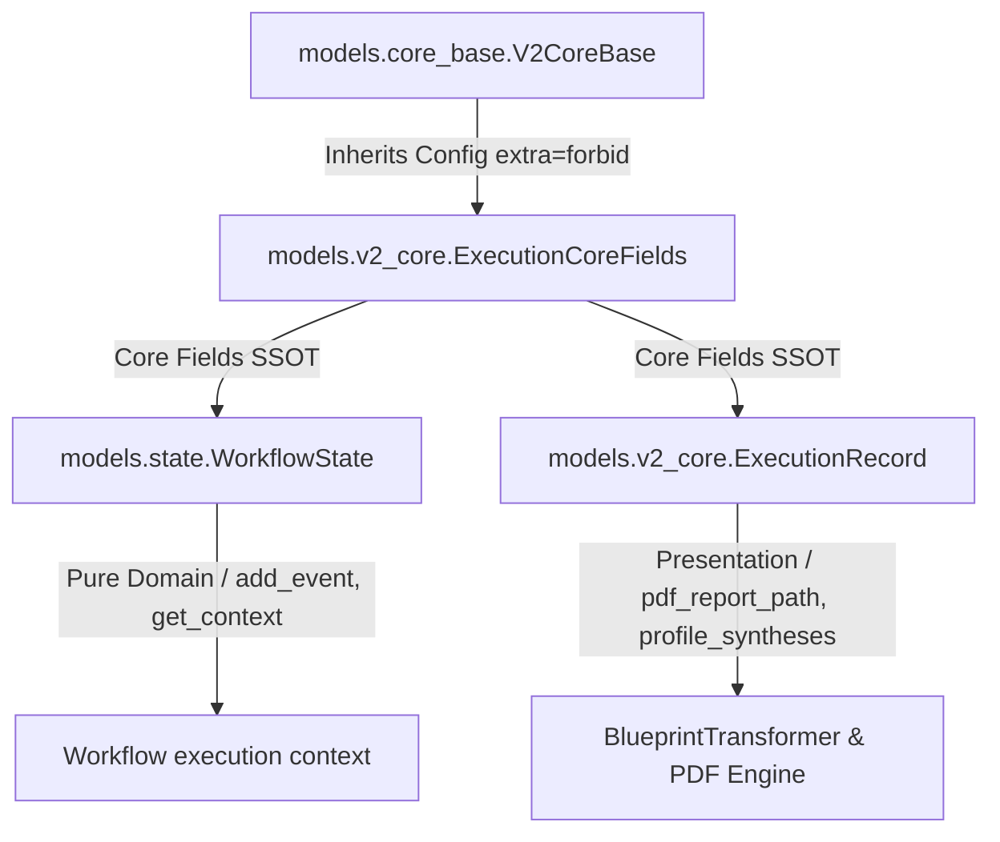

# Epic 63: Execution Model Decoupling & Parity Hardening (Jaetun Datarungon Mixin, Tiukka Skeemapariteetti ja CI-tason Fail-Fast-Valvonta)

> [!IMPORTANT]
> **THE ZERO-COMPROMISE PARITY & STRUCTURAL INTEGRITY MANDATE**: 
> Tämä Epic poistaa pysyvästi työnkulun ajonaikaisen aggregaattijuuren (`WorkflowState`) ja tietokanta-/esityskerroksen historiatallenteen (`ExecutionRecord`) välisen siirtymävajeen (Schema Disparity). Toteutus noudattaa 2026-ohjelmistokehityksen tiukimpia arkkitehtuurisia standardeja. Yhteinen datasopimus (Shared Core Contract) eriytetään kummankin mallin kantaluokaksi (`ExecutionCoreFields`), jolloin kaikki askelet, kontekstit ja muuttujat synkronoituvat automaattisesti skeematasolla ilman inhimillisen virheen mahdollisuutta. Kaikki dynaamiset tiedon offloading- (Storage Blobs) ja lazy-hydration-mekanismit integroidaan suoraan jaettuun ytimeen. Vanhojen suoritusajojen tai historiallisten siemenaineistojen taaksepäin yhteensopivuudesta luovutaan tietoisesti puhtaan, robustin ja parhaan nykytilan varmistamiseksi (Clean-Slate Migration).

---

## 1. Yhteenveto ja Tavoite (Objective)

Tämän Epicin tavoitteena on ratkaista lopullisesti työnkulun ajonaikaisen domain-tilan (`WorkflowState`) ja tietokantaan persistoitavan sekä esityskerroksen (PDF/SDUI) käyttämän historialuokan (`ExecutionRecord`) välinen skeemaepäsymmetria (Kaksoismalliongelma / Dual Model Hazard).

### Tunnistetut Nykytilan Ongelmat:
1. **Kaksoismallin pariteettivaje (Dual Model Hazard)**: `WorkflowState` (`models/state.py`) ja `ExecutionRecord` (`models/v2_core.py`) jakavat 90 % suoritustilasta (kuten `status`, `execution_trace`, `execution_trace_storage_path` sekä äskettäin lisätyt `context_variables` ja `context_variables_storage_path`). Koska ne ovat kaksi erillistä Pydantic-mallia eri tiedostoissa, yhden kehittyminen (esim. uudet dynamic strictness -muuttujat) jättää toisen jälkeen ja aiheuttaa rajapinnoissa kaatumisia.
2. **Implisiittiset sanakirjamuunnokset (`dict`)**: Työnkulun suoritus ja tallennus nojaavat useissa kohdin tyypittämättömiin `isinstance(data, dict)` tai `.model_validate(execution_dict, strict=False)` -muunnoksiin. Jos tietokannan raw JSON -muodossa on ylimääräisiä tai puuttuvia kenttiä, tiukka Pydantic-moodi (`extra="forbid"`) aiheuttaa `ValidationError`-katastrofeja tai poistaa dataa hiljaisesti, johtaen downstream-ajonaikaisiin `AttributeError`-kaatumisiin.
3. **Regressioriskit ja staattisen synkronoinnin puute**: Kehittäjät voivat lisätä uusia ydinmuuttujia työnkulun ajonaikaiseen tilaan huomaamatta, että historiantallennus tai PDF-sivujen koonti kaatuu myöhemmin kentän puuttumisen vuoksi. Testaus ei havaitse tätä staattisesti ennen kuin visualisointimoottori yrittää lukea puuttuvaa attribuuttia.

### Arkkitehtoninen Ratkaisu (Clean-Slate Mandate):
1. **Jaettu abstrakti tietorunko (`ExecutionCoreFields`)**: Luodaan yhteinen abstrakti kantaluokka (`ExecutionCoreFields`), joka perii `V2CoreBase`-luokan. Kaikki molemmille malleille yhteiset ydinmuuttujat (status, trace, storage_paths, context_variables) määritellään **vain tässä yhdessä paikassa** (Single Source of Truth).
2. **SRP-mukainen eriyttäminen (Single Responsibility Principle Decoupling)**:
   * **`WorkflowState` (Domain)**: Perii `ExecutionCoreFields`-luokan ja laajentaa sitä puhtaasti ajonaikaisella logiikalla ja dynaamisilla apumetodeilla (`add_event`, `get_context`). Ei sisällä mitään esityskerroksen (PDF/SDUI) riippuvuuksia.
   * **`ExecutionRecord` (Presentation & DB DTO)**: Perii `ExecutionCoreFields`-luokan ja laajentaa sitä tietokanta-, välimuisti- ja PDF-raportointikohtaisilla kentillä (`pdf_report_path`, `profile_syntheses`, `is_resumable`, `duration_ms`).
3. **CI-tason Fail-Fast Meta-testaus (Structural Parity Unit Test)**: Kirjoitetaan automaattinen yksikkötesti, joka vertaa Pythonin `inspect`- ja Pydanticin `model_fields`-ominaisuuksia dynaamisesti ja kaataa testiajot välittömästi, jos mallien jaettujen ydinkenttien tyypit tai nimet eroavat.
4. **Eksplisiittinen tyyppiturvallinen adapteri (`Factory/Adapter Pattern`)**: Korvataan löysät sanakirjamuunnokset tyyppiturvallisella adapterifunktiolla (`create_execution_record`), joka takaa staattisen tyyppitarkastuksen (MyPy) kääntöaikaisen suojan.

---

## 2. Arkkitehtuuristen sääntöjen huomiointi (Compliance Matrix)

Kehityksessä on noudatettava tiukasti seuraavia `c:\src\quorum\.agents\rules` -hakemiston sääntöjä:

### 2.1. Ydinjärjestelmä ja laatuportit (00-antigravity-core.md & 01-python-backend.md)
* **The Zero-Compromise Pledge (00)**: Mitään dynamic-fallbackkeja, löysiä sanakirjamuunnoksia tai tyhjiä korvaavia arvoja ei sallita. Jos skeema ei täsmää, järjestelmän on kaaduttava fail-fast validointitasolla rajapinnassa.
* **Fail-Fast Pydantic Schema (01)**: Molemmat mallit perivät `V2CoreBase`-luokan, joka pakottaa `ConfigDict(frozen=True, strict=True, extra="forbid")` -asetuksen. Ylimääräisiä tai arvaamattomia kenttiä ei sallita missään suoritusmuodossa.

### 2.2. Tietokanta ja persistointi (03_seed_vault.md & 04_directory_reference.md)
* **No Legacy Support (Clean-Slate)**: Koska vanhoja ajoja ei tarvitse säästää tai tukea, voimme suorittaa täydellisen ja puhtaan skeemamigraation ilman taaksepäin yhteensopivuuden painolastia. Kaikki siemenaineisto (`seed_data.json`) ja kehitysaikainen TinyDB pyyhitään ja päivitetään vastaamaan uutta skeemarakennetta.

---

## 3. Arkkitehtuurinen Suunnittelu (Proposed Code/Schema Changes)



### 3.1. Abstrakti jaettu tietorunko (`ExecutionCoreFields`)

Esitellään uusi abstrakti kantaluokka `backend_v2/models/v2_core.py` -tiedostoon:

```python
class ExecutionCoreFields(V2CoreBase):
    """The Single Source of Truth (SSOT) structural core for workflow executions.
    
    Inherited by both the active domain state (WorkflowState) and the
    historical persistent database record (ExecutionRecord).
    """
    status: Literal["pending", "running", "completed", "failed"] = Field(
        default="pending",
        description="Current status of the workflow execution."
    )
    execution_trace: list[ErrorTraceEvent | TombstoneEvent | TraceEvent] = Field(
        default_factory=list,
        description="Immutable log of all events."
    )
    execution_trace_storage_path: str | None = Field(
        default=None,
        description="Path to offloaded trace JSON in Cloud Storage."
    )
    context_variables: dict[str, Any] = Field(
        default_factory=dict,
        description="Current snapshots of context variables (the dynamic blackboard)."
    )
    context_variables_storage_path: str | None = Field(
        default=None,
        description="Path to offloaded context variables JSON in Cloud Storage."
    )
```

### 3.2. Eriytyneet ja puhtaat mallit

#### 1. Domain-malli (`WorkflowState`) tiedostossa `backend_v2/models/state.py`
```python
from backend_v2.models.v2_core import ExecutionCoreFields

class WorkflowState(ExecutionCoreFields):
    """Aggregate root containing the active execution trace and transient domain state."""
    execution_id: uuid.UUID = Field(default_factory=uuid.uuid4, description="Unique execution identifier.")
    workflow_id: str = Field(
        ...,
        min_length=1,
        pattern=r"^([a-z]{2,5})_[a-zA-Z0-9]{8,}$",
        description="The ID of the workflow definition."
    )
    trace_version: int = Field(default=0, description="Optimistic Concurrency Control version.")
    workflow_name: str | None = Field(default=None, description="Human-readable name of the workflow.")
    created_at: datetime = Field(default_factory=lambda: datetime.now(timezone.utc), description="Creation timestamp.")

    # Pure Domain Methods (add_event, get_context, properties)...
```

#### 2. Persistointi- ja visualisointimalli (`ExecutionRecord`) tiedostossa `backend_v2/models/v2_core.py`
```python
class ExecutionRecord(ExecutionCoreFields):
    """Record of a workflow execution, including presentation caches and persistent logs."""
    id: str = Field(pattern=r"^([a-z]{2,5})_[a-fA-F0-9]{16,32}$", description="Execution ID, usually a uuid")
    workflow_id: str = Field(description="Workflow ID")
    active_profile_id: str | None = Field(
        default=None, description="The ID of the output profile selected for formatting and printing."
    )
    raw_inputs: WorkflowInputs = Field(default_factory=WorkflowInputs, description="Raw user inputs by role")
    frozen_context: FrozenContext = Field(default_factory=FrozenContext, description="Immutable snapshot of context")
    frozen_context_storage_path: str | None = Field(
        default=None, description="Optional path to Blob Storage offloaded Frozen Context JSON"
    )
    
    # Presentation- & Persistointi-spesifiset laajennukset
    pdf_report_path: str | None = Field(default=None, description="Path to the generated PDF Execution Report.")
    output_profile_id: str | None = Field(
        default=None, description="Target profile ID for formatting instructions and synthesis."
    )
    step_states: dict[str, ExecutionStepState] = Field(
        default_factory=dict, description="Real-time status tracking for DAG nodes"
    )
    profile_syntheses: dict[str, RenderedSynthesisCache] = Field(
        default_factory=dict, description="Multi-profile synthesis caching"
    )
    is_resumable: bool = Field(
        default=False, description="Dynamic flag indicating if a failed/pending execution can be safely resumed."
    )
    duration_ms: int = Field(default=0, description="Total execution duration in milliseconds")
    created_at: datetime = Field(default_factory=lambda: datetime.now(timezone.utc))
```

### 3.3. Tyyppiturvallinen Adapteri (`Factory Pattern`)

Korvataan epäsuorat `dict`-muunnokset `backend_v2/services/execution.py` -tasolla tai erillisellä adapterifunktiolla:

```python
def create_execution_record_from_state(
    state: WorkflowState, 
    workflow_id: str,
    raw_inputs: WorkflowInputs,
    frozen_context: FrozenContext,
    **extra_persistence_fields
) -> ExecutionRecord:
    """Tyyppiturvallinen tehdasmetodi, joka muuntaa domain-tilan persistoitavaksi DTO-olioksi."""
    return ExecutionRecord(
        id=f"exe_{state.execution_id.hex[:16]}",
        workflow_id=workflow_id,
        status=state.status,
        execution_trace=state.execution_trace,
        execution_trace_storage_path=state.execution_trace_storage_path,
        context_variables=state.context_variables,
        context_variables_storage_path=state.context_variables_storage_path,
        raw_inputs=raw_inputs,
        frozen_context=frozen_context,
        **extra_persistence_fields
    )
```

---

## 4. Toteutusvaiheet (Implementation Phases)

### Phase 1: Kantaluokan `ExecutionCoreFields` luonti (Core Refactor)
* **Toimenpide**: Esitellään `ExecutionCoreFields`-luokka `backend_v2/models/v2_core.py`-tiedostoon.
* **Perintä**: Päivitetään `ExecutionRecord` perimään tämä kantaluokka ja poistetaan siitä monistetut ydinkentät.

### Phase 2: Domain-mallin `WorkflowState` päivitys (Domain Sync)
* **Toimenpide**: Päivitetään `WorkflowState` (`backend_v2/models/state.py`) perimään `ExecutionCoreFields` ja poistetaan siitä monistetut kentät.
* **Tyyppikorjaukset**: Korjataan mahdolliset MyPy-varoitukset tai import-riippuvuussyklihaasteet varmistamalla siisti pakettirakenne.

### Phase 3: Adapterin ja Rajapintojen Hardening (API Boundaries)
* **Toimenpide**: Toteutetaan `create_execution_record_from_state` -tehdasmetodi ja päivitetään worker- ja execution-palvelut hyödyntämään sitä raakojen sanakirjamuunnosten sijaan.
* **Fail-Fast**: Varmistetaan, että `UnifiedWorkflowRepository` ja `PdfReportService` validoivat ladattavat aineistot heti tiukasti.

### Phase 4: CI-tason Meta-yksikkötestin toteutus (Automated Parity Quality Gate)
* **Toimenpide**: Lisätään `backend_v2/tests/unit/test_v2_core_models.py` -tiedostoon `test_strict_schema_parity_for_core_execution_fields` -yksikkötesti.
* **Varmistus**: Testataan sen toimivuus muuttamalla kokeellisesti jotain tyyppiä ja varmistamalla, että testiajo kaatuu välittömästi punaiseksi.

### Phase 5: Tietokannan ja Siemenaineiston Pyyhintä (Clean-Slate DB Reset)
* **Toimenpide**: Koska vanhoja ajoja ei tarvitse tukea, pyyhitään `data/db_v2.json` kehitys- ja testitietokannat.
* **Polymorphic Seed**: Ajetaan seederi uudestaan päivitetyn rakenteen mukaisesti:
  ```powershell
  uv run python backend_v2/seed/run_seed.py
  ```

### Phase 6: Laadunvarmistus ja Auditoinnit (Hardening Verification)
* **Toimenpide**: Suoritetaan täysi Ruff-linttaus, Ruff-formatointi ja tiukka MyPy-tyyppitarkastus koko backend-koodille laatuportin läpäisemiseksi:
  ```powershell
  uv run python scripts/backend_audit_loop.py backend_v2/ --test
  ```

---

## 5. Definition of Done (DoD)

1. **Zero Schema Redundancy**: Kaikki yhteiset ydinkentät työnkulun tilan osalta on eristetty yhteen kantaluokkaan (`ExecutionCoreFields`). Yhtäkään ydinkenttää ei ole määritelty kahteen kertaan erikseen.
2. **Automated CI Parity Check**: Yksikkötesti tarkastaa automaattisesti skeemojen kentät ja tyypit, ja kaataa kehitysputken heti, jos pariteetti rikkoutuu.
3. **Decoupled Architecture**: `WorkflowState` ei sisällä PDF- tai tulostuskerroksen riippuvuuksia, ja `ExecutionRecord` vastaa itsenäisesti esityskerros-DTO:na visualisointitarpeista.
4. **Clean-Slate Database Validation**: Tietokanta ja siemenaineistot on alustettu ilman legacy-taakkaa, ja Pydantic V2 model validation menee 100 % puhtaasti läpi tiukassa moodissa (`extra="forbid"`).
5. **Quality Gates Passed**: Kaikki yksikkö- ja integrointitestit läpäisevät testiajon ja backend-auditoinnin puhtaasti:
   ```powershell
   uv run python scripts/backend_audit_loop.py backend_v2/ --test
   ```
